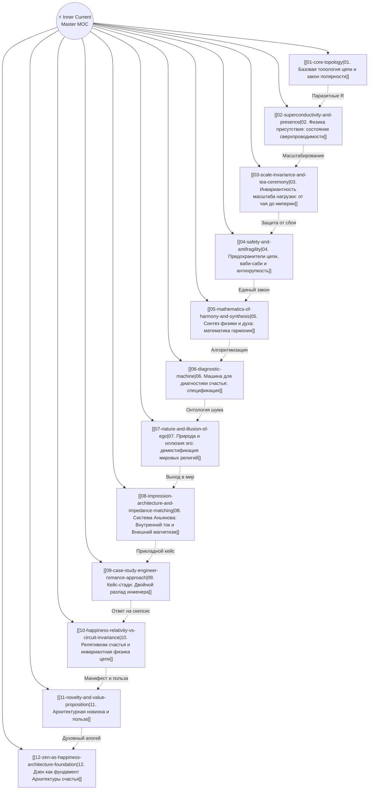
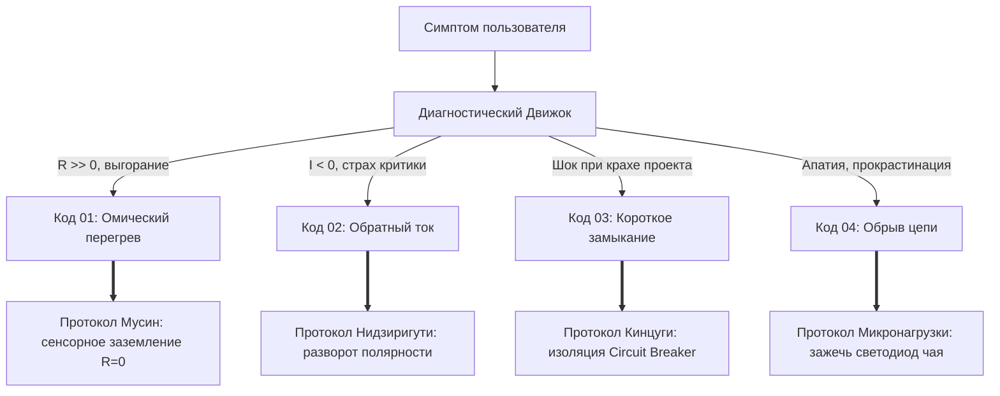

# ⚡ Inner Current (Внутренний ток) — Map of Content (MOC)

> [!abstract] Ключевой тезис системы
> **«Внутренний ток» (Inner Current)** — это прикладная инженерная онтология и диагностическая машина человеческого благополучия, объединяющая законы электродинамики, дзенскую философию прямого действия, античный стоицизм и математическую природу гармонии. Душевный разлад переводится из плоскости неразрешимой экзистенциальной драмы в плоскость **инженерного сбоя цепи**, поддающегося локализации и устранению.

---

## 🧭 Навигационный хаб статей (Core Notes)

### 📋 Реестр статей контура:
1. **[[01-core-topology|01. Базовая топология цепи и закон полярности]]** — схема «Реактор (Тандэн) → Внимание → Нагрузка (Лампочка)», авария обратного тока.
2. **[[02-superconductivity-and-presence|02. Физика присутствия: состояние сверхпроводимости]]** — «Здесь и сейчас» как $R \to 0$, закон Джоуля — Ленца ($Q = I^2 R t$), состояние Мусин.
3. **[[03-scale-invariance-and-tea-ceremony|03. Инвариантность масштаба нагрузки: от чая до империи]]** — закон сохранения энергии на любых масштабах; чайная церемония Тяною как стенд калибровки.
4. **[[04-safety-and-antifragility|04. Предохранители цепи, ваби-саби и антихрупкость]]** — Дзансин (Circuit Breakers), Ваби-саби (Кинцуги), низкий вход Нидзиригути.
5. **[[05-mathematics-of-harmony-and-synthesis|05. Синтез физики и духа: математика гармонии]]** — математическая геометрия парфюмерии, музыки и архитектуры; принцип независимой сходимости (Consilience).
6. **[[06-diagnostic-machine|06. Машина для диагностики счастья: спецификация]]** — принцип Pain-First (отталкивание от боли), реестр 5 архетипов несчастья, инженерная классификация сбоев (коды 01–05), диагностический движок и ремонтные протоколы.
7. **[[07-nature-and-illusion-of-ego|07. Природа и иллюзия эго: демистификация мировых религий]]** — демистификация мировых учений (Анатта, Майя, Мусин, У-вэй, Кенозис) через 4 измеримых физических факта и протокол шунтирования $R_{ego}$.
8. **[[08-impression-architecture-and-impedance-matching|08. Система Аньянова: Внутренний ток и Внешний магнетизм]]** — зонтичная мета-система целостности: Внутренний ток (Архитектура счастья) и Внешний магнетизм (Архитектура впечатления).
9. **[[09-case-study-engineer-romance-approach|09. Кейс-стади: Двойной разлад инженера — «В работе бог, в отношениях аут»]]** — прикладная калибровка романтического контура: ликвидация паразитного обратного тока ($I < 0$), омического взрыва симуляций ($R_{future} \gg 0$) и включение Дзансин.
10. **[[10-happiness-relativity-vs-circuit-invariance|10. Релятивизм счастья и инвариантная физика цепи: разбор тезиса «Счастье у каждого своё»]]** — подмена типа потребителя и законов электродинамики; аналогия «Розетка и приборы»; счастье как объективное состояние сверхпроводимости ($R \to 0$).
11. **[[11-novelty-and-value-proposition|11. Архитектурная новизна и практическая польза Системы Аньянова]]** — манифест системы: 6 измерений концептуального сдвига, прикладная ценность для созидателей и исполняемость в TypeScript-коде.
12. **[[12-zen-as-happiness-architecture-foundation|12. Дзен как фундамент Архитектуры счастья: инженерная демистификация высшего духа человечества]]** — исторический апогей эволюции духа, изоморфизм 5 канонов Дзен и электродинамики (Тандэн, Мусин, Кансо, Итиго Итиэ, Дзансин/Кинцуги) и Кодекс Дзен-инженера.

---

## 🏛️ Архитектурные столпы системы (Синтез статей)

### I. Контур и Полярность: [[01-core-topology|Базовая топология цепи]]
* **Принцип автономного реактора:** В глубине человека функционирует **Тандэн (丹田)** — автономный генератор жизненной силы, не требующий внешней подзарядки от признания или наград.
* **Закон однонаправленности тока:** Ток жизни обязан течь строго по вектору:  
  $$\text{Тандэн (Реактор)} \xrightarrow{\quad \text{Внимание} \quad} \text{Лампочка (Действие / Мир)}$$
* **6 канонических лампочек (Параллельный щит нагрузок):** Ток направляется в 6 базовых внешних потребителей:
  1. 🚗 **Машина** (мобильность, автономия)
  2. 🏡 **Дом** (среда, очаг, безопасность)
  3. 💼 **Карьера** (ремесло, созидание, влияние)
  4. ❤️ **Отношения** (любовь, близость, резонанс)
  5. 🩺 **Здоровье** (скафандр, биохимия, витальность)
  6. 🎉 **Развлечения** (игра, дофамин, радость)  
  *Баланс мощности ($P_{total} = \sum P_i$):* одновременная перегрузка всех 6 ламп вызывает просадку напряжения (undervoltage); у каждого человека активна своя уникальная комбинация горящих ламп.
* **Патология обратного тока (Reverse Polarity):** Попытка запитать себя от внешней лампочки (денег, похвалы, лайков, чужого одобрения) неминуемо глушит станцию и плавит кабели внимания. Лампочка — это потребитель, в ней нет генератора.

> [!danger] Авария обратного тока
> Формула невроза: *«Вот когда этот проект признают великим, я наконец почувствую себя ценным»*. В этот момент в цепи меняется полярность, вызывая обесточивание ядра.

---

### II. Физика «Здесь и сейчас»: [[02-superconductivity-and-presence|Сверхпроводимость и Мусин]]
* **«Быть в моменте» как $R \to 0$:** Настоящее время — это физическое состояние проводника без электрического сопротивления. В точке «сейчас» ток идёт без потерь мощности и без омического нагрева.
* **Закон Джоуля — Ленца ($Q = I^2 R t$):** Мысли о прошлом (сожаления, вина) и будущем (тревога, страх не успеть) — это паразитные виртуальные индуктивности. Они врезают в цепь мегаомные резисторы, превращая силу намерения в тепловой стресс и выгорание.
* **Состояние Мусин (無心):** Отключение внутреннего судьи/критика. У мозга нет ресурса крутить роман о себе, когда сенсорный тракт на 100% занят текущим действием. Ток льется чисто: если идёшь — идёшь, если кодишь — кодишь.

> [!tip] Инженерное определение счастья
> **Счастье** — это субъективное переживание режима нулевого сопротивления цепи ($R = 0$).

---

### III. Масштаб и Калибровка: [[03-scale-invariance-and-tea-ceremony|От чашки чая до империи]]
* **Инвариантность электродинамики:** Законы сохранения и передачи энергии не зависят от мощности подключенного прибора. Пить чай или строить межконтинентальную корпорацию — принципиальная схема идентична.
* **Почему счастье в простых вещах?** В чашке чая уму не за что зацепиться эго: нет страха опозориться, нет инвесторов. Сопротивление $R$ падает само собой, цепь замыкается чисто.
* **Японская чайная традиция (Тяною / Садо) как калибровочный полигон:**
  * *Нидзиригути (низкий лаз 1м):* снятие меча и чинов снаружи. Принудительный сброс эго на входе.
  * *Канон движений:* автоматизация моторики выключает рассудочный диалог.
  * *Итиго Итиэ (一期一会):* осознание неповторимости текущей секунды отсекает виртуальное время.
* **Правило мастера:** Не умея держать ноль сопротивления на светодиоде чашки чая, невозможно удержать мегаваттный реактор стартапа — проводка сгорит.

---

### IV. Безопасность и Антихрупкость: [[04-safety-and-antifragility|Дзансин и Ваби-Саби]]
* **Проблема короткого замыкания:** Любые внешние объекты смертны, уязвимы и подвержены краху. Без изоляции разрушение проекта взрывает личность.
* **Дзансин (残心) как Circuit Breaker:** «Сохраняющееся сознание». После выстрела или релиза реактор удерживает бдительную устойчивость. При аварии внешней системы ментальный предохранитель мгновенно изолирует сбой, сохраняя 100% мощности ядра.
* **Ваби-саби (侘寂) и Кинцуги (金継ぎ):**
  * Принятие неидеальности внешней материи.
  * Треснувшая чаша не прерывает чайную церемонию; упавший прод не разрушает созидателя.
  * Золотой шов кинцуги: превращение ошибки и пережитого сбоя в красивый конструктивный опыт.

---

### V. Единая Математика: [[05-mathematics-of-harmony-and-synthesis|Синтез физики и лирики]]
* **Преодоление раскола эпохи Просвещения:** Разделение на холодных технарей и слепых лириков искусственно. Пифагор, Спиноза и мастера Дзен воспринимали космос единым.
* **Математическая природа невидимого:**
  * *Музыка:* строгие соотношения частот и полифония.
  * *Архитектура:* эпюры напряжений и золотое сечение.
  * *Парфюмерия:* молекулярная масса, летучесть углеводородных фракций, кинетика испарения пирамиды (верх $\to$ сердце $\to$ база).
  * *Душевный покой:* топология электродинамической сети.
* **Принцип независимой сходимости (Consilience):** Если стоицизм (Эпиктет), японский дзен (Сэн-но Рикю), антропология простых людей (фильм «Cosa è felicità?») и физика сверхпроводимости сходятся к одной схеме — это объективный закон мироздания.
* **Роль изобретателя:** Подобно паровой машине Ньюкомена и Уатта, система «Внутренний ток» превратила стихийное наблюдение пара в работающий, повторяемый двигатель диагностики.

---

### VI. Практика Инженерии: [[06-diagnostic-machine|Машина диагностики счастья]]

---

### VII. Онтология Эго: [[07-nature-and-illusion-of-ego|Демистификация мировых религий]]
* **Эго как иллюзия в мировых учениях:** Анатта (буддизм), Майя (адвайта), Мусин (дзен), У-вэй (даосизм), Кенозис (христианство), Фана (суфизм).
* **Перевод на язык измеримых физических фактов:**
  * *Hardware Check:* отсутствие аппаратного узла эго на плате контура; эго — виртуальный софтверный шум сигнальной петли.
  * *Аннигиляция в $t = \text{now}$:* эго не способно существовать в точке физического действия; оно живет исключительно в симуляциях $L_{past}$ и $C_{future}$.
  * *Термодинамика трения:* эго не производит полезной работы ($P_{load}$), а генерирует омические потери ($Q = I^2 R_{ego} t$).
  * *Парадокс обратного тока:* пассивный потребитель (лампочка) не может быть источником ЭДС.
* **Шунтирование эго:** протокол сенсорного заземления и аппаратного сброса ролей (Нидзиригути) для достижения сверхпроводимости ($R \to 0$).

---

### VIII. Зонтичная Архитектура: [[08-impression-architecture-and-impedance-matching|Система Аньянова (Внутренний ток и Внешний магнетизм)]]
* **Система Аньянова как зонтичная мета-система:**
  * ⚡ *Внутренний ток (Архитектура счастья):* автономный генератор ЭДС (Тандэн), проводка внимания без сопротивления ($R \to 0$), целостность контура, преодоление синдрома самозванца, создание сильного продукта/стартапа.
  * 🧲 *Внешний магнетизм (Архитектура впечатления):* квадро-согласование (Форма, Фактура, Цвет, Запах), формирующее мощное силовое поле притяжения и физическое достоинство созидателя.
* **Снятие ложного дуализма:**
  * Исцеление двойного разлада человека (потухший взгляд внутри + запущенный вид снаружи).
  * Внутренний ток по закону электродинамики рождает внешнее магнитное поле: великий продукт внутри и притягательный человек снаружи.
* **Эффект Шибуми:** высшее слияние несокрушимой внутренней мощи с благородной, естественной простотой формы.

---

### IX. Объективная Физика vs Релятивизм: [[10-happiness-relativity-vs-circuit-invariance|«Счастье у каждого своё»]]
* **Категориальная ошибка:** подмена выбора электроприбора (чайник, гитарный комбоусилитель, квантовый компьютер) универсальными законами электросети (закон Ома, закон Джоуля — Ленца, законы Кирхгофа).
* **Инвариантность физики аварий:** омический перегрев ($Q = I^2 R t$), обратный ток ($I < 0$) и просадка напряжения при перегрузке щита нагрузок одинаково разрушают любого человека независимо от его ценностей и профессии.
* **Физическое определение счастья:** субъективное переживание сверхпроводимости цепи ($R \to 0$, состояние Мусин в $t = \text{now}$).
* **Шпаргалка созидателя:** 4-шаговый алгоритм ответа на критику («система не навязывает прибор, система чинит проводку»).

---

### X. Архитектурный Манифест: [[11-novelty-and-value-proposition|Новизна и Практическая Польза]]
* **Парадигмальный сдвиг (6 измерений):** смена онтологии (от драмы к цепи), физическая демистификация мировых учений, закон полярности ($I > 0$), инвариантность масштаба (чай $\leftrightarrow$ империя), баланс мощности 6 ламп, зонтичная мета-система (ток + магнетизм).
* **Прикладная ценность:** антивыгорание разработчиков, антихрупкость фаундеров (Circuit Breaker), ликвидация страха критики у творцов, снятие ступора при знакомствах (согласование импедансов).
* **Исполняемость:** не метафора, а работающая программная машина (TypeScript, движок, 11 юнит-тестов, SVG-интерфейс).

---

### XI. Духовный Апогей и Инженерный Базис: [[12-zen-as-happiness-architecture-foundation|Дзен как фундамент Архитектуры счастья]]
* **Дзен как наивысшая ступень эволюции духа:** учение прямого контакта с реальностью без догматов, богов-посредников и чувства вины.
* **Изоморфизм 5 канонов Дзен и законов физики:**
  * 丹田 *Тандэн:* автономный реактор внутренней ЭДС ($\mathcal{E}_{tanden}$) и закон полярности (счастье изнутри наружу).
  * 無心 *Мусин:* состояние сверхпроводимости проводника ($R \to 0$), нулевой тепловой нагрев по закону Джоуля — Ленца ($Q = 0$).
  * 簡素 *Кансо:* шунтирование паразитного реостата эго ($R_{ego} = 0$) и отсечение мысленных симуляций.
  * 一期一会 *Итиго Итиэ:* инвариантность законов цепи к масштабу (чайная церемония $\leftrightarrow$ транснациональная корпорация).
  * 残心 *Дзансин & Кинцуги:* психологические автоматические выключатели (Circuit Breakers) и антихрупкая закалка золотом опыта.
* **Кодекс Дзен-инженера:** прикладной 5-шаговый алгоритм утренней калибровки и созидания без трения.

---

## 🏷️ Тезаурус и концептуальная сеть (Concept Tags)

- **Ядро и Генерация:** #tanden #reactor #intrinsic-motivation #autonomy
- **Проводка и Внимание:** #attention #superconductivity #musin #flow #zero-resistance
- **Нагрузка и Реальность:** #load #action #scale-invariance #tea-ceremony #ichigo-ichie
- **Инвариантность и Консилиенс:** #invariance #relativity-fallacy #circuit-physics #objection-handling
- **Защита и Надежность:** #zanshin #circuit-breaker #wabi-sabi #kintsugi #antifragile
- **Синтез и Точные науки:** #consilience #electrodynamics #joule-lenz #math-of-harmony #perfumery-kinetics
- **Эго и Иллюзия:** #ego #illusion #anatta #maya #bypass #shunt #joule-loss
- **Архитектура Впечатления:** #system-anyanov #impression-architecture #impedance-matching #resonance #shibumi
- **Продуктовая разработка:** #inner-current-app #diagnostic-engine #telemetry

---

## 🔮 Инженерная дорожная карта (Roadmap)

- [x] Теоретический базис и формулировка аксиом цепи.
- [x] Создание базы знаний (LLM Wiki).
- [x] Сборка мастер-карты смыслов (Obsidian MOC).
- [x] Разработка схемы данных и системы состояний контура (`CircuitState`, `TelemetryPacket`).
- [x] Создание алгоритмического ядра диагностики (Diagnostic Rules Engine) & 13 юнит-тестов.
- [x] Проектирование интерактивного UI дашборда: Навигатор болей + Атлас счастья (Золотой контур R→0) + Интерактивные схемы v1.0 и v1.1.
- [x] Реализация калибровочных режимов (Мусин, Тандэн, Дзансин, Кинцуги, Чайная церемония).
