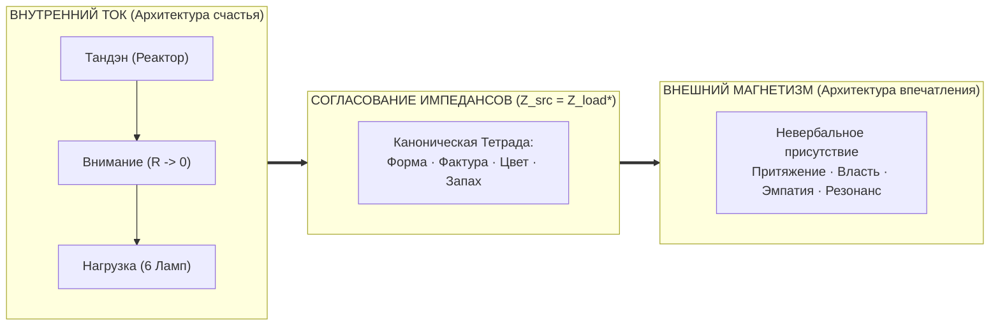

# ЗАКЛЮЧЕНИЕ И ПРИЛОЖЕНИЯ

---

## ЗАКЛЮЧЕНИЕ
### Мост во внешний мир: Согласование импедансов и Внешний магнетизм

> *«Внутренний ток рождает Внешний магнетизм. Тот, чей внутренний контур работает в режиме сверхпроводимости ($R \to 0$), неизбежно излучает мощное когерентное электромагнитное поле. Следующий шаг мастера — согласование импедансов с внешним миром: через форму, ткань, цвет и аромат. Так Архитектура счастья замыкается с Архитектурой впечатления в единую целостную Систему Аньянова.»*  
> — **Владимир Аньянов**

Вы подошли к финалу книги об устройстве вашего внутреннего контура. 

Теперь вы знаете фундаментальную истину:
- Счастье — это не случайная улыбка капризной судьбы.
- Счастье — это **строгий физический режим работы цепи ($R \to 0, I > 0$)**.

Когда ваш Тандэн генерирует чистый ток, проводка внимания очищена от окислов Эго и DMN, а щит 6 ламп сбалансирован — внутри вас наступает нерушимый, алмазный штиль. Вы больше не зависите от капризов погоды, колебаний фондовых рынков или мнения окружающих. Вы автономны.

Но человек не живет в вакууме. Человек живет среди других людей. И здесь вступает в силу великий закон электродинамики:
$$\text{Любой электрический ток неизбежно порождает магнитное поле!}$$

Когда внутренний ток силен и чист, вокруг человека возникает **Внешний магнетизм**:
- Люди неосознанно тянутся к нему, чувствуя колоссальную безопасность и опору.
- В его присутствии прекращаются истерики и стихают споры.
- Его слова обретают вес, потому что за ними стоит не звенящее эго, а тяжелая масса Тандэна.

Чтобы передать эту энергию во внешний социум без отражения и потерь, мастер применяет закон **согласования импедансов ($Z_{\text{source}} = Z_{\text{load}}^*$)**:
- Через точный силуэт одежды (Форма),
- Через тактильное благородство натуральных тканей (Фактура),
- Через гармонию колористики (Цвет),
- Через завершающую лимбическую печать шлейфа (Запах).

Об этой второй половине Системы Аньянова — об **Архитектуре Впечатления и Импрессиометрии** — написана наша следующая книга. 

А пока — держите свой контур замкнутым.  
Берегите Тандэн.  
Удерживайте сопротивление в нуле.  
И светите миру на полную мощность!

---

---

## ПРИЛОЖЕНИЯ

---

### Приложение A — Полный свод математических формул цепи

1. **Каноническое условие счастья:**
   $$\mathcal{H} \iff \begin{cases} R_{\text{ego}} \to 0 \\ I_{\text{attention}} > 0 \\ \sum I_{\text{in}} = \sum I_{\text{out}} \end{cases}$$

2. **Закон Джоуля — Ленца для омических потерь сознания:**
   $$Q = \int_0^T I_{\text{attention}}^2(t) \cdot R_{\text{temporal}}(t) \, dt$$

3. **Реактивное сопротивление времени:**
   $$Z_{\text{temporal}} = \sqrt{R_{\text{now}}^2 + \left( \omega L_{\text{past}} - \frac{1}{\omega C_{\text{future}}} \right)^2}$$
   где $R_{\text{now}} \to 0$ при $t = t_{\text{now}}$.

4. **Интегральный Индекс Счастья (КПД цепи):**
   $$\mathcal{H} = \left( 1 - \frac{R_{\text{ego}}}{R_{\text{total}}} \right) \cdot \left( \frac{I_{\text{actual}}}{I_{\text{nominal}}} \right) \cdot \cos(\varphi) \cdot \mathcal{Z}_{\text{safety}}$$

5. **Баланс Кирхгофа замкнутого контура:**
   $$\oint \mathbf{E} \cdot d\mathbf{l} = 0 \quad \text{и} \quad \sum_{k=1}^n U_k = 0$$

6. **Полезная электрическая мощность созидания:**
   $$P_{\text{useful}} = U_{\text{capital}} \cdot I_{\text{tanden}} \cdot \cos(\varphi)$$

7. **Параллельное сложение сопротивлений в команде:**
   $$\frac{1}{R_{\text{team}}} = \sum_{k=1}^m \frac{1}{R_k}$$

8. **Аварийный ток при утечке на экзистенциальную землю (Ground Fault):**
   $$I_{\text{leak}} = \frac{\mathcal{E}_{\text{tanden}}}{R_{\text{fault}}} \to \infty \quad \text{при} \quad \mathcal{M}_{\text{ext}} \equiv 0$$

---

### Приложение B — 12 инвариантных аксиом Владимира Аньянова

1. **Аксиома I (Сверхпроводимость):** *Счастье — это не эмоциональное возбуждение, а физическое состояние сверхпроводимости замкнутой цепи при сопротивлении, стремящемся к нулю.*
2. **Аксиома II (Полярность):** *Ток жизни течет строго изнутри наружу — от Тандэна к нагрузке. Ожидание счастья от внешнего объекта нарушает полярность и сжигает контур.*
3. **Аксиома III (Присутствие):** *«Здесь и сейчас» — это единственная временная координата, в которой омическое сопротивление равно нулю. Прошлое и будущее — реактивные помехи.*
4. **Аксиома IV (Сохранение):** *Энергия сознания строго постоянна: она либо совершает полезную работу в нагрузке, либо превращается в разрушительный омический перегрев Эго.*
5. **Аксиома V (Нейробиология):** *Эго — это активность Default Mode Network (DMN). Включение прямого действия (TPN) и вагусное заземление Тандэна аппаратно обнуляют Эго.*
6. **Аксиома VI (Шунтирование):** *С Эго бесполезно бороться морально. Его шунтируют медной перемычкой сенсорного действия.*
7. **Аксиома VII (Пустотность формы):** *Материальные вещи термодинамически пассивны ($\mathcal{E}_{\text{load}} \equiv 0$). В них нет аккумулятора радости.*
8. **Аксиома VIII (Смысл жизни):** *Внешнего смысла жизни нет. Жизнь — это автономный генератор. Смысл рождается в момент протекания тока.*
9. **Аксиома IX (Суверенитет):** *Человек никому не обязан доказывать легитимность своего существования. Источник питания в Тандэне суверенен.*
10. **Аксиома X (Масштаб):** *Законы цепи инвариантны: сверхпроводимость при заваривании чая и при руководстве корпорацией тождественна.*
11. **Аксиома XI (Дзансин):** *При разрушении нагрузки ментальный выключатель разрывает цепь за 50 миллисекунд, сохраняя жизнь генератору.*
12. **Аксиома XII (Синхронизация):** *Любовь — это параллельная синхронизация двух автономных генераторов на общую нагрузку без короткого замыкания.*

---

### Приложение C — Инженерно-дзенский тезаурус

- **Тандэн (丹田):** Нижний даньтянь, биологический и психосоматический генератор постоянного тока в геометрическом центре тела.
- **Мусин (無心):** Состояние чистого ума, сверхпроводимость проводки внимания ($R \to 0$), работа Task-Positive Network (TPN).
- **Фудосин (不動心):** Непоколебимый дух, частотная стабилизация генератора при скачках внешней нагрузки.
- **Дзансин (残心):** Неразрывное внимание, аварийный ментальный выключатель (Circuit Breaker).
- **Кансо (簡素):** Священная простота, устранение паразитной емкости и лишних слоев в быту и мышлении.
- **Кинцуги (金継ぎ):** Искусство реставрации золотом, закалка диэлектрика после катастрофы (антихрупкость).
- **Итиго Итиэ (一期一会):** Синхронизация текущего импульса ($t = t_{\text{now}}$), неповторимость текущего мига.
- **Шибуми (渋み):** Сдержанное совершенство, идеальное согласование импедансов человека и среды.
- **Шуньята (空):** Пустотность материальных форм, отсутствие собственного заряда у внешних вещей.
- **У-вэй (無為):** Деяние без омического сопротивления, ламинарный ток энергии Тандэна.

---
*Конец рукописи книги «Внутренний ток: Архитектура счастья».*  
*Владимир Аньянов | 2026*
