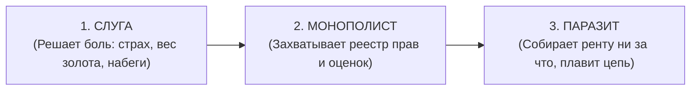
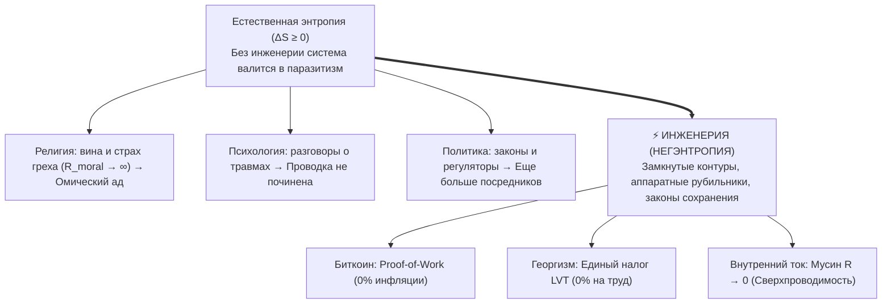

### Глава 1.8 — Генезис посредников и закон прямого потока: Почему рождается паразитная рента и как инженерия защищает систему от энтропии

> *«За счет того, что действует закон энтропии, нам, чтобы поддерживать чистоту, жизненно необходима инженерия. Без строгой инженерной системы всё неизбежно валится в хаос, а любой временный посредник вырождается в паразита.  
> Инженерия — это единственный инструмент во Вселенной, который не позволяет системе скатиться в энтропию.»*  
> — **Владимир Аньянов (Аксиома VII)**

#### 1. Вопрос на миллион: Почему мир не родился чистым?
Когда человек впервые открывает Закон Прямого Потока, в душе загорается радость узнавания: деньги должны быть твердыми, земля — свободной от монополий, а внимание — чистым проводником радости.

Но следом встает главный экзистенциальный вопрос:  
*Если чистота прямого потока так естественна, почему мир по умолчанию утопает в посредниках, ренте, инфляции и неврозах? В чем глубинное единство этой силы?*

Ответ лежит не в сфере абстрактной морали, а на стыке **эволюционной биологии, теории информации и термодинамики**.

#### 2. Трехфазный генезис посредника: Как костыль от страха становится кандалами
Ни один паразит в истории не приходил со словами «я хочу вас ограбить». Все посредники рождаются под спасительным девизом: *«Доверься мне. Я защищу тебя от боли, сложности и неизвестности»*.

1. **В душевном контуре (Эго):** В первобытной саванне мозг создал виртуальный симулятор рисков — Эго. Это был временный кэш-буфер от хищников. Но сторожевая собака выгнала хозяина из дома: Эго объявило себя хозяином сознания и потребовало пожизненную ренту в виде сомнений, вины и тревоги ($R_{\text{ego}} \to \infty$).
2. **В монетарной энергии (Центробанки):** Золото было тяжелым и опасным в перевозке. Банкиры предложили легкие расписки. Но получив монополию на печатный станок, они превратили расписки в фиатный грабеж через инфляцию.
3. **В социальной экономике (Лендлорды):** Феодалы начинали с защиты крестьян от разбоя. Спустя века их потомки и спекулянты просто приватизировали планету и собирают ренту за право стоять на земле.

Ник Сабо сформулировал фундаментальный закон информационной безопасности:  
> **«Доверенные третьи лица — это дыры в безопасности.»** (*Trusted third parties are security holes*). Любая сущность, которой система делегирует монопольное право валидации, с неизбежностью математического закона перерождается в паразитического рантье.

#### 3. Термодинамика энтропии и Негэнтропия Инженерии
Почему в мире по умолчанию нет чистоты? Потому что действует **Второй закон термодинамики ($\Delta S \ge 0$)**:
- Без осознанной подпитки и строгой формы любая замкнутая система стремится к хаосу и рассеянию энергии.
- Паразитировать — локально «энергетически дешевле», чем непрерывно созидать с нуля. Поэтому системы сами по себе обрастают посредниками, как днище корабля — ракушками.

**Инженерия — это единственный инструмент во Вселенной, который не позволяет системе скатиться в энтропию.**  
Она не уговаривает паразита быть честным — она делает паразитизм физически невозможным, напрямую замыкая Источник на Нагрузку.

#### 4. Триада и Тетрада: Истина, Свобода, Счастье и Созидание
Истина, Свобода и Счастье — это три измерительных прибора одного сверхпроводящего контура:
- **Истина ($\Delta U = 0$):** Вольтметр. Отсутствие симуляций и самообмана, чистый контакт с фактами.
- **Свобода ($R = 0$):** Омметр. Отсутствие трения и застревания в прошлом и будущем, действие прямо сейчас.
- **Счастье ($Q = 0, I > 0$):** Калориметр. Закон Джоуля — Ленца: нет паразитного тепла вины и страха, тихое сияние бытия.
- **Созидание (Creation):** Выход тока полного реактора в мир — строительство, код, книги, любовь и преобразование материи.

Человечество наконец выросло из детских ходунков. Инструменты прямого потока созданы. Время войти в сверхпроводимость.
