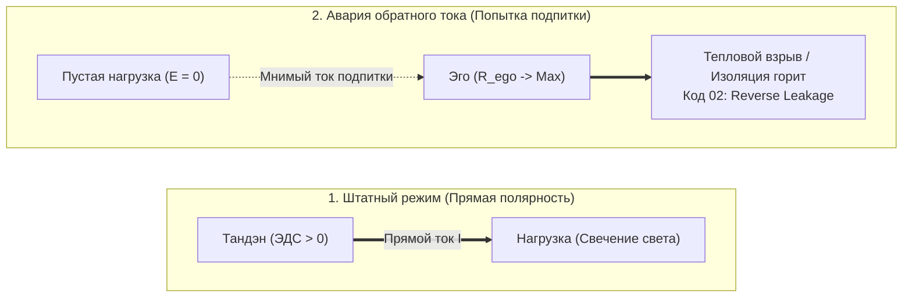
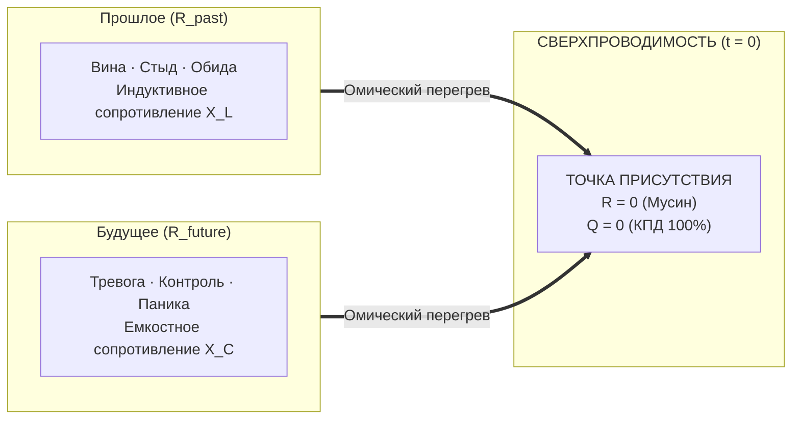

### Глава 1.2 — Закон полярности: Изнутри наружу и авария обратного тока

> *«В электродинамике полярность абсолютна: ток течет от источника ЭДС через проводник к потребителю. Пытаться получить радость из лампочки — это попытка заставить потребитель стать генератором. Лампа не генерирует ток, она лишь рассеивает его в виде света. Когда человек ждет счастья от внешнего объекта, он подключает нагрузку в обратной полярности, вызывая пробой диода и обугливание контура.»*  
> — **Владимир Аньянов (Аксиома II)**

#### 1. Физическая суть Закона полярности
Фундаментальный закон топологии человеческого контура гласит:
$$\mathbf{J}_{\text{life}} = \sigma \cdot \mathbf{E}_{\text{tanden}} \quad \text{при} \quad \nabla \cdot \mathbf{J} = 0$$
Вектор плотности тока жизни $\mathbf{J}_{\text{life}}$ всегда направлен **строго изнутри наружу**:
$$\text{Тандэн (Генератор)} \longrightarrow \text{Внимание (Провод)} \longrightarrow \text{Нагрузка (Лампа)}$$

Любая попытка развернуть этот вектор вспять — это фундаментальное нарушение законов природы.
Когда человек говорит:
- *«Эта работа сделает меня счастливым»*,
- *«Этот человек должен дать мне чувство значимости»*,
- *«Эта машина наполнит мою жизнь восторгом»*,

он совершает фатальную схемотехническую ошибку: он пытается заставить **пассивную нагрузку ($R_{\text{load}}$)** работать в режиме **активного источника энергии ($\mathcal{E}_{\text{load}} > 0$)**.

#### 2. Авария обратного тока (Reverse Current Breakdown)
В электронике для защиты от встречного тока устанавливают обратные диоды. Если к схеме приложить обратное напряжение, превышающее напряжение пробоя, возникает лавинный пробой p-n перехода.

В психофизике человека происходит то же самое:
1. Человек проецирует ожидание подпитки на проект, партнера или покупку.
2. Поскольку нагрузка пассивна ($\mathcal{E}_{\text{load}} \equiv 0$), тока нет.
3. Эго интерпретирует отсутствие входящей энергии как «катастрофу»: *«Меня не любят! Проект провалился! Жизнь бессмысленна!»*
4. Реостат $R_{\text{ego}}$ подскакивает до мегаомов.
5. Напряжение рассогласования $\Delta U$ возрастает, вызывая тяжелейший омический перегрев (паническая атака, депрессивный ступор, агрессия на внешний мир).

#### 3. Онтологический статус нагрузки: Лампочка пуста (Шуньята)
Древний буддийский канон Шуньяты (пустотности формы) на языке схемотехники означает:
> **Нагрузка сама по себе не содержит ни грамма счастья.**  
> Скрипка Страдивари — это кусок лакированного дерева и жилы. Она молчит, пока к ней не прикоснется смычок музыканта, питаемый Тандэном.  
> Любимый человек — это автономная вселенная, а не внешний повербанк для вашей неуверенности.  
> Код операционной системы — это массив байтов на кремнии.

Свет рождается **только в момент прохождения вашего тока через вольфрамовую нить нагрузки**. Счастье — это свечение, а не свойство лампы. 

Если вы подходите к любому делу с вопросом: *«Что я сейчас отдам и проявлю через этот проводник?»* — полярность соблюдена, цепь замкнута, и вас заливает ровный, чистый свет сверхпроводимости.

---

### Глава 1.3 — Физика присутствия: «Здесь и сейчас» как сверхпроводимость ($R \to 0$)

> *«Тысячелетиями учителя твердили: "Будь здесь и сейчас". Но никто не объяснил формулу. "Здесь и сейчас" — это координата времени $t = t_{\text{now}}$, в которой паразитное сопротивление сознания падает до нуля: $\lim_{\Delta t \to 0} R(t) = 0$. Прошлое — это индуктивное сопротивление памяти. Будущее — емкостная паника ожиданий. Только в нулевом фазовом сдвиге наступает чистая сверхпроводимость.»*  
> — **Владимир Аньянов (Аксиома III)**

#### 1. Закон Джоуля — Ленца для человеческого внимания
Каждый человек знает ощущение тяжести, раскаленности в висках и бессилия после целого дня сидения за компьютером, даже если физически он не поднимал ничего тяжелее мышки.

Физика дает точный расчет этого явления:
$$Q_{\text{mental}} = \int_0^T I_{\text{attention}}^2(t) \cdot R_{\text{temporal}}(t) \, dt$$
где:
- $I_{\text{attention}}$ — сила тока внимания (ваша жизненная ментальная мощность),
- $R_{\text{temporal}}$ — паразитное омическое сопротивление временного рассогласования,
- $Q_{\text{mental}}$ — выделяющееся паразитное тепло (усталость, головная боль, спазмы).

#### 2. Анатомия омических потерь времени
Паразитное сопротивление $R_{\text{temporal}}$ раскладывается на две реактивные составляющие:

1. **Индуктивное сопротивление прошлого ($X_L = \omega L$, $R_{\text{past}}$):**
   - Сознание застревает в том, что уже свершилось: *«Зачем я отправил это письмо? Почему я так глупо ответил на собеседовании?»*
   - Это тяжелая магнитная инерция катушки. Энергия циркулирует по мертвому кольцу, порождая тормозящую противо-ЭДС вины и самоедства.

2. **Емкостное сопротивление будущего ($X_C = \frac{1}{\omega C}$, $R_{\text{future}}$):**
   - Сознание прокручивает миллионы виртуальных симуляций: *«А вдруг проект не взлетит? А вдруг курс упадет? А вдруг партнер уйдет?»*
   - Это перезарядка паразитной емкости. Ток расходуется на прогрев несуществующих астральных миров, не совершая ни одного джоуля реальной работы в физическом пространстве.

#### 3. Режим Мусин (無心) как критическая температура сверхпроводимости
В физике твердого тела при охлаждении ртути или керамики ниже критической температуры $T_c$ кристаллическая решетка перестает препятствовать движению электронов: сопротивление скачком падает ровно до нуля ($R \equiv 0$). Электрический ток в сверхпроводящем кольце может циркулировать миллионы лет без затухания и без нагрева.

**Мусин (Чистый ум)** — это психофизическая сверхпроводимость.
- Когда вы полностью возвращаете внимание в текущую миллисекунду: ваши пальцы касаются клавиш, глаза видят пиксели на мониторе, легкие вдыхают воздух.
- В этой точке $\Delta t = 0$. 
- Нет прошлого, о котором можно сожалеть.
- Нет будущего, которого можно бояться.
- $R_{\text{past}} = 0$, $R_{\text{future}} = 0$, следовательно:
$$R_{\text{total}} \to 0 \implies Q = I^2 \cdot 0 \cdot t \equiv 0$$
Выделение паразитного тепла прекращается. Усталость исчезает. Ток Тандэна напрямую трансформируется в чистое свечение мастерства. Человек входит в поток абсолютного счастья.
