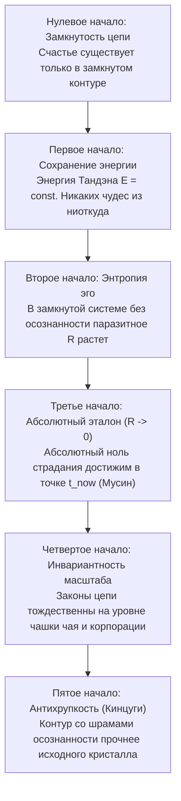

### Глава 1.4 — Термодинамика духа: Шесть фундаментальных начал счастья

> *«Термодинамика не знает сострадания, но она знает справедливость. Если система замкнута, закон сохранения энергии действует с точностью до эрга. Шесть начал термодинамики счастья — это инвариантные законы человеческого контура. Нарушить их невозможно: можно лишь сгореть в попытке обойти закон Джоуля — Ленца или взлететь на крыльях сверхпроводимости.»*  
> — **Владимир Аньянов (Аксиома IV)**

#### Шесть фундаментальных начал термодинамики счастья Владимира Аньянова:



1. **Нулевое начало (Закон замкнутости цепи):**  
   *«Счастье — это состояние протекания тока в замкнутой цепи.»*  
   Разомкнутый контур не может светиться, какими бы мощными ни были генератор и лампа. Счастье невозможно в изоляции от мира и невозможно в отказе от действия. Цепь замыкается только актом прямого взаимодействия с реальностью.

2. **Первое начало (Закон сохранения ментальной энергии):**  
   $$\Delta U = Q - W \implies \mathcal{E}_{\text{tanden}} = W_{\text{action}} + Q_{\text{ohmic}}$$
   Энергия вашего существа строго постоянна во времени. Она не возникает из мотивирующих видеороликов и не растворяется в космосе. Она делится ровно на две части: **полезную работу свечения ($W$)** и **паразитный нагрев эго ($Q$)**. Если вы не светите — вы горите. Третьего пути нет.

3. **Второе начало (Закон возрастания паразитного сопротивления):**  
   $$d S_{\text{ego}} \ge 0 \quad \text{или} \quad \frac{d R_{\text{ego}}}{dt} > 0 \quad \text{(без внешней калибровки)}$$
   Оставленное без калибровки внимание человека самопроизвольно окисляется страхами, сомнениями и жаждой социального одобрения. Энтропия эго растет. Без регулярной калибровки (Дзен, созерцание, гигиена ума) любой человек неминуемо скатывается в омический перегрев выгорания.

4. **Третье начало (Закон абсолютного эталона):**  
   $$\lim_{t \to t_{\text{now}}} R_{\text{temporal}} = 0$$
   В физике абсолютный ноль температуры недостижим. В Архитектуре счастья абсолютный ноль сопротивления **достижим в точке $t_{\text{now}}$**. В момент абсолютного присутствия (Сатори, Мусин) сопротивление падает ровно до нуля, а КПД контура достигает 100%.

5. **Четвертое начало (Закон масштабной инвариантности):**  
   $$\mathcal{H}(\text{чай}) \equiv \mathcal{H}(\text{империя}) \iff R \to 0$$
   Законы Ома не зависят от размера лампочки: миллиамперный светодиод и дуговая печь подчиняются одним формулам. Заваривание пиалы зеленого чая и запуск ракеты Falcon 9 требуют одной и той же сверхпроводимости внимания.

6. **Пятое начало (Закон антихрупкости и Кинцуги):**  
   Шрам или авария, преодоленные через осознанность и калибровку Дзансин, делают диэлектрик контура прочнее исходного. Сломанный сосуд, склеенный золотым лаком Кинцуги, становится произведением высшего искусства.

---

### Глава 1.5 — Нейробиология сверхпроводимости: DMN как аппаратный реостат Эго, TPN как фокус Мусин и блуждающий нерв как заземление Тандэна

> *«Эго — это не философская химера и не темная сущность в астрале. Это конкретная нейронная сеть в коре больших полушарий: Default Mode Network. Когда она активна, ваш биологический контур работает на холостой перегрев. Когда вы включаете прямое действие (Task-Positive Network), реостат падает в ноль, и наступает физиологическая сверхпроводимость.»*  
> — **Владимир Аньянов (Аксиома V)**

#### 1. Дефолт-система мозга (DMN): Анатомический чертеж Эго
В 2001 году профессор Маркус Райхл при функциональном картировании мозга совершил открытие: когда испытуемый не решает внешнюю задачу, активность его мозга не снижается, а переключается в мощную синхронизированную сеть — **Default Mode Network (DMN)**.

DMN включает в себя:
- Медиальную префронтальную кору (mPFC) — оценку «что это значит для МЕНЯ»,
- Заднюю поясную кору (PCC) — автобиографическую память и самосожаление,
- Нижнюю теменную долю (IPL) — пространственное отделение себя от мира.

```
       [ МЕДИАЛЬНАЯ ПРЕФРОНТАЛЬНАЯ КОРА ]
             ▲                 ▲
             │ (Омический      │ (Симуляции
             │  перегрев)      │  статуса)
             ▼                 ▼
   [ ЗАДНЯЯ ПОЯСНАЯ КОРА (PCC) ] ◄──► [ НИЖНЯЯ ТЕМЕННАЯ ДОЛЯ ]
```

На языке Архитектуры счастья **DMN — это физический аппаратный реостат $R_{\text{ego}}$**.  
Когда DMN активна, сознание крутит замкнутый цикл:
- «Достаточно ли я умен?»
- «Почему он так на меня посмотрел?»
- «А что если завтра я всё потеряю?»

Мозг сжигает до 20 ватт глюкозной мощности на бесконечное пережевывание фантомов, выделяя омическое тепло тревоги и истощая энергетические запасы организма.

#### 2. Task-Positive Network (TPN): Нейрофизиология Мусин
Антиподом DMN является **Сеть решения внешних задач (Task-Positive Network, TPN)**. 
Она охватывает дорсолатеральную префронтальную кору (dlPFC) и интрапариетальную борозду (IPS).

Фундаментальный закон нейродинамики:
> **Сети DMN и TPN антикоррелируют.**  
> Мозг не способен одновременно крутить мысленную жвачку о себе (DMN) и совершать высокоточное сенсорное действие в реальном мире (TPN). Включение TPN аппаратно гасит DMN.

Когда ювелир гранит алмаз, музыкант играет соло, программист отлаживает функцию, а стрелок натягивает тетиву:
1. DMN полностью отключается.
2. Внутренний монолог замолкает.
3. Исчезает ощущение «я отдельно от дела».
4. $R_{\text{ego}}$ падает до нуля ($R \to 0$).
5. Наступает состояние **Мусин (нейробиологическая сверхпроводимость)**. В этот момент мозг вырабатывает оптимальный коктейль нейромедиаторов: дофамин (фокус), серотонин (удовлетворение), норадреналин (ясность) и эндорфины (обезболивание и радость).

#### 3. Блуждающий нерв (Vagus Nerve) и Тандэн: Биология заземления
Почему древние мастера Дзен помещали источник силы не в голову, а в живот (Тандэн / Хара)?

Потому что в брюшной полости находится **энтеральная нервная система («второй мозг»)**, насчитывающая 500 миллионов нейронов, и главный блуждающий нерв (*Nervus Vagus*).

По теории поливагальной системы Стивена Порджеса:
- Поверхностное грудное дыхание активирует симпатическую цепочку «бей или беги», взвинчивает кортизол и заставляет DMN лихорадочно искать угрозы статусу ($R_{\text{ego}} \gg 0$).
- Глубокое **диафрагмальное дыхание Тандэном** стимулирует рецепторы вентрального вагуса:
  - Пульс урежается,
  - Вариабельность сердечного ритма (HRV) взлетает до эталонной синусоиды,
  - Симпатический спазм отпускает сосуды,
  - Сопротивление проводки обнуляется.

**Физиологический вывод:**  
Счастье и сверхпроводимость — это не абстрактное моральное решение. Это **конкретный нейросоматический протокол переключения**: торможение DMN через активацию TPN и вагусное заземление реактора Тандэн.
