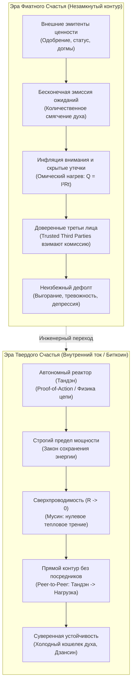
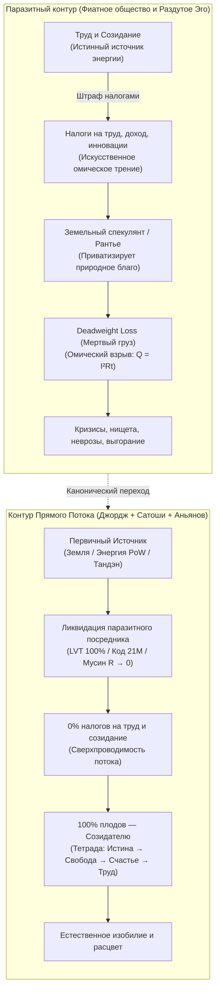

### Глава 1.6 — Биткоин духа: Что Сатоши сделал для денег, Внутренний ток сделал для счастья

> *«Что Биткоин сделал для финансов, Внутренний ток сделал для счастья: он навсегда отнял монополию у внешних эмитентов иллюзий и заземлил человеческий суверенитет на строгие законы термодинамики и чистой энергии.»*  
> — **Владимир Аньянов (Аксиома V)**

#### 1. Кризис «фиатной души» (The Fiat Soul Crisis)
Человечество веками жило в условиях духовного фиата. Нам внушали, что ценность нашего существования эмитируется кем-то извне — социальным одобрением, иерархическими догмами, чужими ожиданиями или моральным долгом. 

В традиционной финансовой системе центральные банки печатают необеспеченные бумажные деньги, вызывая инфляцию, разрушая сбережения и искажая цены. В сфере человеческого духа происходит ровно то же самое:
1. **Количественное смягчение ума (Quantitative Easing of Mind):** Популярная психология и социальные сети занимаются безудержной эмиссией обещаний: *«Мысли позитивно, визуализируй успех, дыши маткой во Вселенную»*. Это ничем не обеспеченная бумажная эмиссия — человеку предлагают раздувать баланс ожиданий без вливания реальной физической работы контура.
2. **Инфляция внимания:** Человек распыляет драгоценный ток своего внимания ($I$) на тысячи фальшивых внешних сигналов. Подобно тому как гиперинфляция сжигает сбережения граждан, инфляция ожиданий сжигает нервную систему в омическом аду ($Q = I^2 R t$).
3. **Уязвимость доверенных третьих лиц (Trusted Third Parties):** Сатоши Накамото в своем манифесте 2008 года указал на корень зла классической коммерции — необходимость доверять посредникам. В психике человека посредником веками выступало раздутое Эго ($R_{\text{ego}}$) и внешние валидаторы: *«Имею ли я право радоваться прямо сейчас?»* — и человек бежит за разрешением к начальнику, партнеру или лайкам в соцсетях. Посредник забирает 90% энергии в виде сомнений и страха, возвращая крохи кратковременной эйфории.



#### 2. Монетарная термодинамика Сейлора и Твердое счастье (Sound Happiness)
Майкл Сейлор совершил прорыв в понимании Биткоина, показав, что это не биржевой спекулятивный инструмент, а **первая в истории монетарная машина, подчиненная законам термодинамики**:
- Деньги — это законсервированная кинетическая энергия человеческого действия.
- Биткоин транспортирует эту энергию сквозь время и пространство без омических утечек инфляции.

«Внутренний ток» применяет эту логику к первоисточнику всякой ценности — к человеческому вниманию:

| Измерение архитектуры | Биткоин (Sound Money / Твердые деньги) | Внутренний ток (Sound Happiness / Твердое счастье) |
| :--- | :--- | :--- |
| **Фундаментальный базис** | Законы термодинамики и криптография SHA-256 | Законы электродинамики, баланс Кирхгофа и Дзен (Кансо / Мусин) |
| **Первичная энергия** | Электричество майнинговых ферм (кВт⋅ч) | Чистый ток внимания из автономного реактора Тандэн ($I$) |
| **Протокол консенсуса** | **Proof-of-Work:** сжигание физической работы | **Proof-of-Action:** прямое действие в «Здесь и сейчас» (Саму) |
| **Лимит эмиссии** | Жесткий лимит 21 млн BTC (дефляционная твердость) | Номинал генератора $P_{\text{rated}}$ (отказ от фантазий о вечном двигателе) |
| **Устранение посредников** | Peer-to-Peer передача стоимости без банков | Прямой контакт «Ядро $\to$ Нагрузка» в обход реостата Эго |
| **Верификация истины** | Независимая нода проверяет хэш (*Don't trust, verify*) | Внутренний мультиметр проверяет баланс Кирхгофа и омический нагрев |
| **Хранилище суверенитета** | Аппаратный холодный кошелек (Seed на металле) | Телесный якорь Тандэна (блуждающий нерв, дыхание животом) |
| **Защита от атак** | Защита от Атаки 51% совокупным хэшрейтом сети | Предохранители Дзансин: отключение цепи при попытке манипуляции |
| **Рабочий режим** | Бесперебойная финализация блоков сети | Режим сверхпроводимости проводника внимания ($R \to 0$) |

#### 3. Переход от Proof-of-Status к Proof-of-Action
В фиатной парадигме человек пытается доказать свое право на существование через **Proof-of-Status** (чужое восхищение, регалии, дипломы, визитки, дорогие безделушки). Но статус — инфляционный актив: стоит вам купить вещь, как планка ожиданий подскакивает, а внутри остается пустота.

В Архитектуре счастья единственным критерием является **Proof-of-Action (Доказательство прямого действия)**:
- Не мысли о действии, а само действие в физическом мире.
- Каждая секунда чистого присутствия в труде, близости или творчестве валидирует блок бытия в вашей собственной распределенной книге жизни.
- Вы становитесь суверенным банком собственного счастья. Подделка невозможна: если контур закорочен на эго, баланс Кирхгофа не сойдется, и проводка раскалится. Если сопротивление сброшено в ноль — в лампе загорается чистый, вечный свет.

---

### Глава 1.7 — Единый налог Генри Джорджа: Физика свободного созидания и ликвидация паразитной ренты

> *«Единый налог Генри Джорджа, Биткоин Сатоши Накамото и Внутренний ток — это один и тот же священный закон вселенной, приложенный к трем масштабам бытия: обществу, деньгам и человеческому духу.  
> Это Закон Прямого Потока: устрани паразитного рантье, обнули искусственное трение — и система войдет в естественное состояние изобилия и сверхпроводимости.»*  
> — **Владимир Аньянов (Аксиома VI)**

#### 1. Личный манифест: От экономической мясорубки к термодинамическому суверенитету
Всякая подлинная философия рождается не в тиши академических аудиторий, а в огне реальной жизненной катастрофы, когда старые социальные модели объявляют человеку дефолт.

Когда в моей жизни рушились привычные финансовые опоры, когда классическая система фиатного обмана пыталась обесценить годы труда и лишить почвы под ногами, **Биткоин спас меня экономически**. 

Это было не просто финансовым выходом. Это было **эпистемологическим прозрением**:
* Я увидел, что деньги могут быть не инструментом политического манипулирования и грабежа через инфляцию, а **чистой, неизменной термодинамической энергией**, упакованной в математический алгоритм, который никому не под силу сфальсифицировать.
* Биткоин показал: если убрать из цепи паразитного посредника — ненасытное «доверенное третье лицо» (*Trusted Third Party*) — энергия труда начинает путешествовать сквозь время и пространство **без потерь**.

Но экономическое спасение неизбежно поставило следующий фундаментальный вопрос: *почему общество в целом, обладая колоссальными технологиями и богатством, продолжает тонуть в бедности, неподъемной аренде, кризисах доступности жилья и социальном ожесточении?*

Ответом на этот вопрос стало учение величайшего американского мыслителя **Генри Джорджа (Henry George)** и его бессмертный труд *«Прогресс и бедность» (Progress and Poverty, 1879)*. 

Генри Джордж показал первопричину трагедии цивилизации с математической точностью: **монополия на землю и паразитная земельная рента**. Мы штрафуем налогами тех, кто строит, производит и трудится, и одновременно субсидируем тех, кто просто захватил кусок планеты и сидит на шее у общества, собирая дань за право жить.

И в этот момент в моем сознании замкнулся главный контур:
> **То, что Сатоши Накамото сделал для монетарной энергии, а Генри Джордж — для экономики земли, Архитектура счастья обязана сделать для человеческого духа.**

Эта книга написана для того, чтобы вернуть Единый налог Генри Джорджа в центр мирового внимания — не как скучную фискальную реформу, а как вселенский закон свободы созидательного тока.

#### 2. Анатомия великого заблуждения: Почему Единый налог — это закон природы, а не «бухгалтерская реформа»
На протяжении более чем ста лет академическая экономика намеренно вытесняла георгизм на периферию. Причина проста: признание правоты Генри Джорджа мгновенно разрушает фундамент паразитического класса рантье.

В общественном сознании закрепился ложный стереотип: мол, «Единый налог на ценность земли» (*Land Value Tax, LVT*) — это просто одна из сотен налоговых схем. Это катастрофическое непонимание масштаба!

Генри Джордж вывел закон, безупречный с точки зрения термодинамики:
1. **Земля (пространство, природные ресурсы, спектр, недра)** — не создана ни одним человеком. Это базовый физический потенциал ($U$), данный всему живому по праву рождения. Когда отдельный индивид объявляет кусок планеты своей частной монополией и требует с других плату за право стоять на ней — он совершает **захват общего кабеля питания**.
2. **Плоды труда (дома, станки, код, стихи, хлеб)** — созданы исключительным напряжением человеческой энергии и внимания ($I$). Облагать налогами труд, зарплату, производство и предпринимательство — значит **штрафовать саму жизнь**.

В терминах электродинамики:
* Налог на созидание — это искусственно впаянное в проводку огромное паразитное сопротивление ($R_{\text{tax}}$).
* В экономике оно порождает **Deadweight Loss (избыточное бремя / чистые потери общества)** — богатство, которое сгорело, не родившись.
* В физике духа это в точности закон Джоуля — Ленца: **$Q = I^2 R t$**. Сила тока созидания гасится, превращаясь в бессмысленный перегрев системы.



**Суть Единого Налога (The Single Tax):**
* **Обнулить ВСЕ налоги на труд, зарплаты, производство, инновации и торговлю.** (Сопротивление созиданию = 0!).
* Ввести **Единый налог на чистую ценность земли (LVT)**, изымающий 100% спекулятивной экономической ренты в общественный фонд.

Если ты держишь пустующую землю в центре мегаполиса и ждешь, пока труд соседей поднимет её стоимость — ты платишь полный налог на эту ценность. Ты не можешь паразитировать. Тебе выгодно либо **строить и созидать**, либо уступить землю тому, кто готов творить.

#### 3. Великая Триада Прямого Потока: Сатоши, Джордж, Аньянов

| Параметр контура | 1. Экономика Земли (Генри Джордж) | 2. Монетарная Энергия (Сатоши Накамото) | 3. Архитектура Духа (Владимир Аньянов) |
| :--- | :--- | :--- | :--- |
| **Что является током ($I$)** | Труд человека, созидание, реальные блага | Монетарная ценность, кинетическая энергия труда | Внимание человека, жизненный импульс присутствия |
| **Первичный генератор** | Творческий потенциал человека на планете | Вычислительная работа (**Proof-of-Work**) | Соматический реактор тела (**Тандэн**) |
| **Полезная нагрузка ($R_{\text{load}}$)** | Города, инфраструктура, товары, культура | Свободный обмен ценностью сквозь десятилетия | **6 ламп бытия** (дело, тело, отношения, творчество, среда, ум) |
| **Паразитный рантье** | **Земельный спекулянт** (приватизировал планету) | **Центробанк / Фиатные элиты** (печатный станок) | **Раздутое Эго ($R_{\text{ego}}$)** (приватизировало поток бытия) |
| **Механизм грабежа** | Земельная рента + налоги на труд | Инфляционный налог + комиссии посредников | Страх, самоедство, вина за прошлое, тревога за будущее |
| **Разрушительные потери** | **Deadweight Loss** (трущобы рядом с пустырями) | Обесценивание времени жизни, пузыри и войны | **Омический ожог ($Q = I^2 R t$)**: невроз, выгорание, депрессия |
| **Инженерное решение** | **Единый налог (Single Tax / LVT)**: 0% на труд | **Биткоин-протокол**: 21 млн монет, Peer-to-Peer | **Сверхпроводимость ($R \to 0$)**: режим Мусин, шунтирование Эго |
| **Финальный статус** | Справедливое изобилие и расцвет цивилизации | Термодинамически твердые, неуничтожимые деньги | Непоколебимое счастье суверенного созидателя |

#### 4. Эго как земельный спекулянт: Психофизический изоморфизм
Механизм работы земельного спекулянта абсолютно тождественен механизму работы невротического Эго:

```
    [ЗЕМЕЛЬНЫЙ СПЕКУЛЯНТ]                     [ПАРАЗИТНОЕ ЭГО]
    
    1. Захватывает пустырь.               1. Захватывает внимание.
    2. Ничего не строит сам.              2. Ничего не создает само (генератор — тело).
    3. Ждет труда соседей вокруг.         3. Ждет внешних стимулов и одобрения.
    4. Ставит забор и шлагбаум.           4. Ставит барьер сомнений и самосуда.
    5. Требует дань за проход.            5. Требует дань страхом и рефлексией.
    
    ИТОГ: Город задыхается в пробках.     ИТОГ: Человек задыхается в неврозе.
```

У вас внутри рождается чистый творческий импульс из Тандэна: написать главу книги, запустить смелый проект, обнять близкого человека, сказать правду. Ток готов пойти в нагрузку!  
Но на пути встает реостат Эго:  
* *«Стой! Заплати мне ренту! А что о тебе подумают? А вдруг ты проиграешь? А достаточно ли ты идеален? Докажи мне сначала, что ты заслуживаешь радости!»*  

Эго ничего не создает. Эго — это просто ментальный земельный спекулянт, захвативший канал проводки внимания. Оно садится на провод и собирает дань сомнениями, превращая живой ток в раскаленный омический ад ($Q = I^2 R t$).

> **Принцип Аньянова — это Единый Налог на собственную психику:**  
> Мы экспроприируем у Эго право собирать ренту за право жить! Мы объявляем реостат фикцией ($R_{\text{ego}} \to 0$) и направляем 100% энергии внимания напрямую в работу — в радость, в творчество, в созидание.

#### 5. Трагедия Льва Толстого: Почему великий старец остановился в шаге от победы
Лев Николаевич Толстой в последние десятилетия жизни был главным пропагандистом Генри Джорджа в мире:
> *«Люди спорят о средствах улучшения жизни, а средство одно, несомненное и простое — освобождение земли от частной собственности по системе Генри Джорджа. Эта мысль так ясна, проста и неопровержима, что нужно только понять ее, чтобы не мочь не согласиться с нею.»*  
> — **Л. Н. Толстой, письма Столыпину и Николаю II**

Толстой гениально предсказал: если царская Россия не примет проект Генри Джорджа и не вернет землю народу через Единый налог, страну разорвет кровавая революция. Так и случилось в 1917 году.

Но трагедия самого Толстого заключалась в том, что он понял принцип прямого потока **для внешней экономики**, но **не смог открыть его для своего внутреннего духа**:
1. В социологии Толстой боролся против паразитической ренты помещиков.
2. Но в своей собственной душе он построил **самый чудовищный реостат вины и морального долга в истории литературы** ($R_{\text{moral}} \to \infty$).
3. Он внушил себе, что человек греховен, обязан бесконечно каяться, мучиться, страдать и служить далекому Хозяину.

Толстой хотел освободить труд крестьян от омического гнета помещика, но свой собственный душевный ток загнал в абсолютное короткое замыкание на Эго Святого Мученика. В итоге великий старец бежал из Ясной Поляны и умер от душевного истощения на глухой железнодорожной станции Астапово.

**Архитектура счастья закрывает вековую боль русской мысли:**  
Мы берем экономическую правду Генри Джорджа, которой дышал Толстой, и дополняем её тем, чего Толстому не хватило — **физикой дзенской сверхпроводимости**. Мы убираем налог не только с земли, но и с самой души человеческой!

#### 6. Манифест Свободного Созидателя: Три уровня суверенитета
Как читателю применить Закон Прямого Потока в своей жизни прямо сейчас? 
1. **Уровень I: Финансовый суверенитет.** Переводи сохраненный труд в **Биткоин** — чистую монетарную энергию Proof-of-Work. Храни на холодном кошельке. Будь собственным банком.
2. **Уровень II: Общественный суверенитет.** Распространяй идеалы **Генри Джорджа**. Понимай разницу между созидательным трудом и паразитической рентой. Не корми спекулятивные монополии.
3. **Уровень III: Внутренний суверенитет.** Включай режим Мусин ($R \to 0$). Сбрасывай паразитное сопротивление Эго. Замыкай ток Тандэна напрямую в действие прямо сейчас.

Биткоин освобождает энергию человеческого труда.  
Единый налог Генри Джорджа освобождает созидательное общество.  
Архитектура счастья освобождает человеческую душу.  

Это **одна великая битва за торжество чистого, неискаженного тока жизни**.
