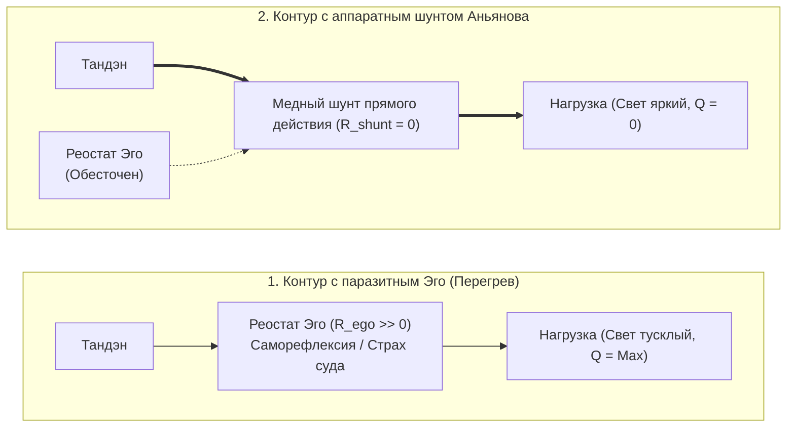
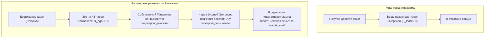

# ЧАСТЬ II: ДЕМОНТАЖ ИЛЛЮЗИЙ И ОМИЧЕСКИЙ ПЕРЕГРЕВ

---

### Глава 2.1 — Природа и иллюзия Эго: Реостат паразитного сопротивления и протокол аппаратного шунтирования $R_{\text{ego}}$

> *«Мировые религии веками боролись с Эго: буддисты объявляли его иллюзией (Анатта), индуисты — космическим покрывалом Майи, даосы — помехой У-вэй, а христианские мистики призывали к Кенозису (самоопустошению). Но никто не дал человеку прикладной рубильник. Эго — это не дьявол и не грех. Это паразитный реостат, включенный последовательно в цепь вашего внимания. Его не надо убивать. Его нужно аппаратно зашунтировать медной перемычкой прямого действия.»*  
> — **Владимир Аньянов (Аксиома VI)**

#### 1. Четыре измеримых физических факта об Эго
Если вы попытаетесь найти Эго в организме скальпелем хирурга или на снимке МРТ, вы не найдете отдельного органа. Эго — это **динамический процесс циклического сопротивления**.

1. **Факт первый: Эго нематериально.** В теле нет «частицы Я». Есть импульсы внимания.
2. **Факт второй: Эго паразитарно.** Оно не генерирует энергию. Энергию дает Тандэн (метаболизм, митохондрии, дыхание). Эго лишь перехватывает этот ток и сжигает его в омическом нагреве.
3. **Факт третий: Эго линейно зависит от времени.** В точке $t = t_{\text{now}}$ Эго существовать не может. Ему обязательно нужны координаты прошлого («кем я был») или будущего («кем я стану»).
4. **Факт четвертый: Эго устранимо мгновенно.** Стоит человеку переключить внимание на физический объект без вербализации, как сопротивление Эго падает в ноль.

#### 2. Протокол аппаратного шунтирования (Hardware Bypass)
Когда электромонтер видит, что на линии раскалился и искрит испорченный реостат, он не читает ему лекции о нравственности. Он берет толстый медный провод с нулевым сопротивлением и ставит **шунт параллельно аварийному узлу**. Ток, подчиняясь закону наименьшего сопротивления, устремляется по меди, а поврежденный реостат мгновенно обесточивается и остывает.

В человеческом контуре **шунтом служит прямое сенсорное действие без оценки**:
- Чувствуете страх перед публичным выступлением? Реостат Эго раскалился: *«А вдруг я оговорюсь? А что подумают?»*
- Ставьте шунт: переведите 100% тока внимания на точный физический факт: почувствуйте температуру микрофона в ладони, сосчитайте пуговицы на пиджаке собеседника в первом ряду, произнесите первое слово как чистую звуковую волну.
- Ток ушел в нагрузку. Эго обесточено. Выступление проходит в кристальной сверхпроводимости.

---

### Глава 2.2 — Иллюзия аккумулятора вещей: Парадокс BMW, физика консьюмеризма и пустотность формы

> *«Консьюмеризм держится на величайшей иллюзии: вере в то, что материальные предметы обладают собственной внутренней энергией $\mathcal{E}_{\text{load}} > 0$. Человек покупает вещь в надежде "подзарядиться от нее". На два дня наступает наркотическая эйфория от сброса реостата эго, а затем вещь становится мертвым балластом, требующим энергии на обслуживание. Форма пуста. Ни один автомобиль в мире не содержит в бардачке ни грамма счастья.»*  
> — **Владимир Аньянов (Аксиома VII)**

#### 1. Парадокс BMW: Анатомия потребительской эйфории
Каждый знаком со сценарием: человек годами мечтает о новом автомобиле (премиальном BMW, часах Rolex, пентхаусе). Он работает на износ, терпит токсичного начальника, экономит. 

Наконец, наступает день выдачи ключей в автосалоне. 
- Человек садится в кожаное кресло, вдыхает запах нового салона, нажимает кнопку старт-стоп.
- Его накрывает колоссальная волна счастья.
- Человек делает вывод: *«Вот оно! Эта машина сделала меня счастливым! Значит, счастье живет в BMW!»*

Но проходит 14 дней. Человек едет в том же автомобиле по той же пробке. И внутри него — ровно та же серая тоска, пустота и раздражение, что и три года назад в старом автобусе. 

Куда делось счастье? Если машина была аккумулятором радости, почему она «разрядилась» за две недели?

#### 2. Физическое разоблачение: Форма пуста ($\mathcal{E}_{\text{load}} \equiv 0$)
Правда в том, что в самом автомобиле BMW **никогда не было ни одного джоуля счастья**. Автомобиль — это две тонны штампованного металла, пластика, меди и стекла. Он термодинамически пассивен.

Что же произошло в автосалоне?
1. В момент покупки Эго временно поставило галочку: *«Я молодец. Я доказал социуму свою состоятельность».*
2. На короткие 48 часов реостат паразитного самобичевания **отключился сам по себе ($R_{\text{ego}} \to 0$)**.
3. И в эти 48 часов через человека наконец-то **свободно потек его собственный ток Тандэна**!
4. Человек испытал кайф не от машины, а от **кратковременного включения собственного режима сверхпроводимости**!
5. Но по незнанию человек приписал этот свет внешнему куску железа.

#### 3. Омический капкан владения (Канон Кансо)
Как только проходит адаптация, вещь из мнимого источника превращается в **тяжелое паразитное сопротивление обслуживания ($R_{\text{maintenance}}$)**:
- Страх, что машину поцарапают на парковке,
- Дорогая страховка и налоги,
- Необходимость мыть, чинить, менять резину, охранять.

Вместо свободы человек получает гирю на проводке внимания. 

**Канон Кансо (簡素, священная простота Дзен):**  
Вещь в жизни мастера должна быть безупречным инструментом, решающим функциональную задачу с минимальным трением среды ($R_{\text{env}} \to 0$). Всё, что покупается для демонстрации статуса или подпитки Эго — это ядовитый шунт, сжигающий вашу жизненную силу.
