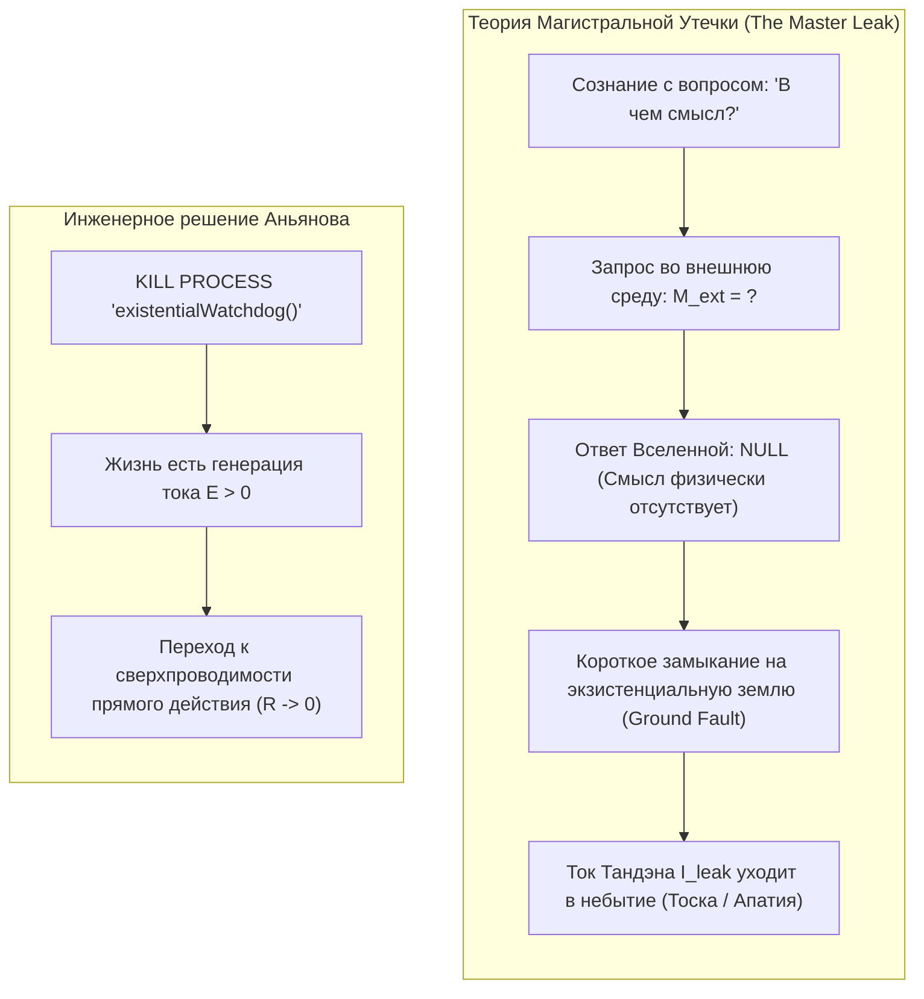
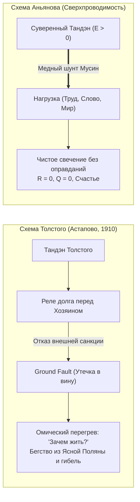

### Глава 2.3 — Инженерное доказательство отсутствия смысла жизни: Освобождение от гуманитарного тупика и рождение Архитектуры счастья

> *«Поиск "смысла жизни" — это величайшая гуманитарная ловушка в истории человечества. Это программная ошибка, когда замкнутый контур пытается найти свою причину за пределами собственной схемы. Мы доказали инженерно: внешнего смысла жизни нет ($\mathcal{M}_{\text{ext}} \equiv 0$). Жизнь — это не зашифрованный ребус, требующий разгадки. Жизнь — это режим генерации и сверхпроводимости. Снятие сторожевого процесса поиска смысла мгновенно заваривает магистральную экзистенциальную утечку цепи.»*  
> — **Владимир Аньянов (Аксиома VIII)**

#### 1. Моделирование системы проверки смысла: Сторожевой процесс (Watchdog)
Почему миллионы умных, тонко чувствующих людей мучаются от экзистенциального кризиса?

Представьте себе операционную систему, в которой непрерывно работает фоновый сторожевой процесс:
```typescript
function existentialWatchdog(): never {
  while (true) {
    const meaning = scanExternalUniverseForPurpose();
    if (meaning === null) {
      triggerPanicAlarm("ЖИЗНЬ БЕССМЫСЛЕННА! ОСТАНОВИТЬ КОНТУР!");
      dissipatePowerAsHeat(); // Омический перегрев Q = I²Rt
    }
  }
}
```
Человек смотрит на звезды, смотрит на свою работу, смотрит на свои отношения и задает вопрос: *«Зачем всё это? В чем высший смысл?»* 

Поскольку Вселенная — это объективная физическая реальность, состоящая из полей и частиц, она не содержит в себе текстового файла `meaning.txt`. Вселенная нейтральна. Она существует. 

Сторожевой процесс возвращает ошибку `404 Not Found`. Мозг паникует: ток срывается в аварийный режим, начинается тоска, потеря сил и депрессия.



#### 2. Инженерное доказательство: Телеология vs Автономия
В технике смысл (назначение) имеет только **вспомогательный инструмент**:
- Смысл отвертки — крутить винты.
- Смысл кабеля — передавать электроны.
- Смысл датчика — фиксировать давление.

Если у объекта есть внешний смысл — значит, этот объект является **слугой или вещью в руках кого-то внешнего**.

Человек — это не отвертка. Человек — это **первичный автономный термодинамический субъект**.  
Требовать от жизни внешнего смысла — значит добровольно низводить себя до уровня утилитарного инструмента в руках вымышленного хозяина.

Отсутствие внешнего смысла — это не трагедия! **Это величайшее благо и манифест абсолютной свободы.**  
Смысл не «находят» в канаве или на небесах. Смысл — это производная от протекания тока:
$$\text{Смысл} \equiv \left( \mathbf{J} \cdot \mathbf{E} > 0 \right)$$
Когда ваш ток течет через нагрузку, когда вы любите, строите, исследуете и завариваете чай — вопрос о смысле не возникает ни на секунду. Он возникает только тогда, когда ток упал до нуля, и цепь покрылась омической гарью.

---

### Глава 2.4 — Сравнительный анализ: Духовный кризис Льва Толстого vs Архитектура счастья — Моральный долг Хозяину против суверенного Тандэна

> *«В своей "Исповеди" величайший гений русской литературы Лев Николаевич Толстой зафиксировал апогей экзистенциального перегрева человечества: имея славу, богатство, семью и признание, он прятал веревку, чтобы не повеситься на перекладине в кабинете. Почему? Потому что его контур пытался закрыться на вымышленного "Хозяина", требующего отчета. На станции Астапово умер не просто старик — там окончательно расплавилась викторианская телеология долга. Архитектура счастья заваривает эту трещину навсегда.»*  
> — **Владимир Аньянов (Аксиома IX)**

#### 1. Анатомия кризиса в «Исповеди» Толстого
Лев Толстой в возрасте 50 лет описал состояние, знакомое каждому глубокому человеку:
> *«Со мной сделалась остановка жизни... Прежде чем заниматься самарским имением, воспитанием сына, писанием книги, надо знать, зачем я это буду делать... Ну хорошо, у тебя будет шесть тысяч десятин земли, триста голов лошадей... ну и что ж? Ну хорошо, ты будешь славнее Гоголя, Пушкина, Шекспира, Мольера — ну и что ж? И я ничего не мог ответить.»*

На языке схемотехники Толстой столкнулся с **аварией Ground Fault (пробоем на экзистенциальную землю)**:
- У него были идеальные лампы нагрузки: творчество (написаны «Война и мир», «Анна Каренина»), семья, имение.
- Но его ментальная схема требовала: *«Каждое действие должно иметь оправдание перед вечностью и Богом-Хозяином».*
- Толстой искал внешнюю ЭДС, подтверждающую легитимность его существования.
- Не найдя ее, он объявил всё свое искусство «пустяками», надел крестьянскую рубаху, отказался от авторских прав и ушел в колоссальный омический перегрев вины.



#### 2. Схемотехнический парадокс экзистенциальной аварии
Почему экзистенциальная тоска Толстого не выглядела как обычное сопротивление?

Потому что при утечке на землю (Ground Fault) ток не встречает сопротивления — **он весь утекает мимо полезной нагрузки прямо в грунт**:
$$I_{\text{leak}} = \frac{\mathcal{E}_{\text{tanden}}}{R_{\text{fault}}} \to \infty \quad \text{при} \quad R_{\text{load}} = 0$$
Человек чувствует не сопротивление делу, а **полное обессиливание**: энергия вытекает тоннами, как вода из пробитой цистерны.

#### 3. Урок Астапово: Заваривание диэлектрика
Трагедия Толстого на станции Астапово учит Дзен-инженера XXI века:
1. **Никакой хозяин не придет.** Во Вселенной нет надзирателя, оценивающего ваш КПД на Страшном суде.
2. **Тандэн суверенен.** Источник жизни внутри вас легитимен сам по себе — по праву вашего дыхания и сердцебиения.
3. **Заварите утечку диэлектриком прямого действия.** Не спрашивайте «Зачем я пишу эту строку кода или сажаю эту яблоню?». Пишите строку так, будто в ней заключена вся Вселенная (канон Итиго Итиэ).

В ту секунду, когда вы снимаете требование внешнего оправдания, экзистенциальный шунт заваривается намертво. Ток устремляется в пальцы, в глаза, в любимого человека, в созидаемый мир. Вы исцелены.
