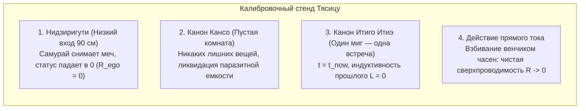
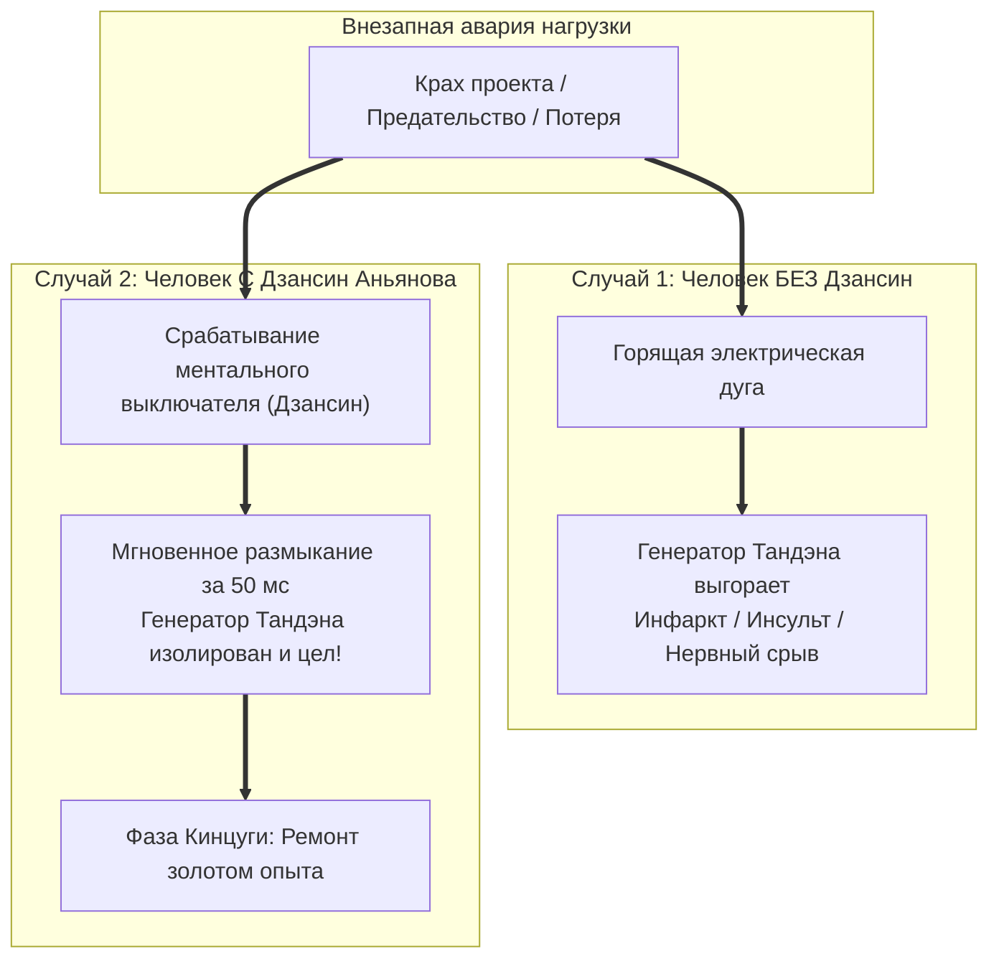
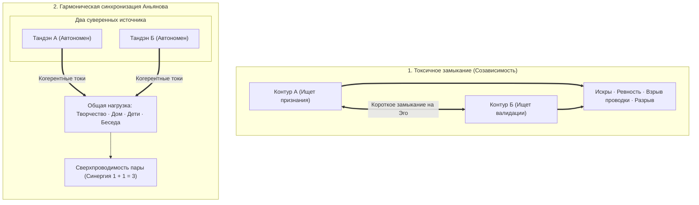

# ЧАСТЬ III: ПРАКТИКА, ЗАЩИТА И АНТИХРУПКОСТЬ КОНТУРА

---

### Глава 3.1 — Инвариантность масштаба нагрузки: От чайной церемонии Тяною до космической корпорации

> *«Физические законы инвариантны к масштабу: уравнение Навье — Стокса описывает и круговорот чая в чашке, и спирали галактик. Точно так же закон Ома для человеческого сознания не меняется от размера задачи: вы либо находитесь в сверхпроводимости при заваривании чая, либо сгораете в перегреве при запуске ракеты. Тот, кто не умеет удерживать $R=0$ над чайником, не удержит его и во главе государства.»*  
> — **Владимир Аньянов (Аксиома X)**

#### 1. Чайная комната Тясицу как прецизионный калибровочный стенд
В XVI веке великий мастер Сэн-но Рикю создал канон японской чайной церемонии (Тяною). Для поверхностного взгляда европейца это кажется странным восточным ритуалом: сидеть на татами два часа ради одной пиалы терпкого порошкового чая маття.

С точки зрения Архитектуры счастья **Тясицу (чайный домик) — это эталонная лаборатория метрологической калибровки человеческого контура**:

1. **Нидзиригути (Вход смирения высотой 90 см):**  
   Чтобы войти в чайную комнату, даже верховный сегун и князь даймё обязан был опуститься на колени и ползти. Длинные мечи катана оставлялись на подставке снаружи.  
   *Физический смысл:* **принудительный сброс социального реостата Эго ($R_{\text{ego}} = 0$)**. Статус, чины, ордена и богатство отсекались на пороге. В комнату входил не «правитель провинции», а чистый генератор Тандэна.

2. **Итиго Итиэ (一期一会, "Один шанс — одна встреча"):**  
   Эта конкретная чашка чая с этим человеком никогда в истории Вселенной не повторится. Вода шумит в чугунном котле, как ветер в соснах. Если мастер в этот момент подумает о налогах или войне — чашка будет испорчена.  
   *Физический смысл:* **ликвидация временного фазового сдвига ($\Delta t = 0$)**.

#### 2. Перенос калибровки на масштаб корпорации и технологий
Многие инженеры и предприниматели говорят: *«Вот когда я закрою раунд на 10 миллионов долларов или запущу завод — тогда я стану спокойным и счастливым».* 

Это катастрофическая иллюзия.  
Если человек моет посуду в омическом перегреве раздражения:
- швыряет тарелки,
- мысленно спорит с начальником,
- спешит скорее домыть, чтобы «начать жить»,

он демонстрирует, что его проводка внимания окислена и повреждена ($R \gg 0$). Посадите этого же человека управлять заводом — он применит ровно ту же схему: будет сжигать миллионы рублей в истериках, панике и токсичном контроле.

**Закон инвариантности масштаба Аньянова:**
$$R_{\text{attention}}(\text{Посуда}) = R_{\text{attention}}(\text{Стартап}) = R_{\text{attention}}(\text{Жизнь})$$
Настоящий мастер начинает калибровку с малого. Если вы моете чашку — мойте чашку так, будто ничего важнее во Вселенной не существует. Вода течет. Рука чувствует фарфор. Реостат в нуле. Вы в сверхпроводимости.  
Человек, овладевший этим на чашке чая, управляет космической корпорацией с той же нерушимой легкостью дзенского ветра.

---

### Глава 3.2 — Предохранители цепи: Ментальные выключатели Дзансин, Ваби-саби и золото шрамов Кинцуги

> *«В идеальном мире нагрузка никогда не ломается. В реальном мире серверы падают, инвестиции сгорают, а любимые люди предают. Если в вашей цепи нет предохранителей, взрыв нагрузки выжигает генератор. Ментальный выключатель Дзансин разрывает дугу за миллисекунды. А японское искусство Кинцуги учит: трещина, залитая золотом спокойствия, делает контур прочнее монокристалла.»*  
> — **Владимир Аньянов (Аксиома XI)**

#### 1. Дзансин (残心, Неразрывное внимание) как Circuit Breaker
В боевых искусствах Дзансин — это состояние алертности после нанесения удара. Самурай поразил противника, но не празднует победу и не бросает меч: его тело сохраняет идеальный баланс на случай контратаки.

В промышленной энергетике критическим узлом является **высоковольтный выключатель (Circuit Breaker)**. Если на линии падает дерево или происходит замыкание, автоматика за 50 миллисекунд взрывает масляный или элегазовый изолятор, физически разрывая дугу, чтобы короткое замыкание не сожгло турбогенератор электростанции.

#### 2. Как работает человеческий Circuit Breaker:
Когда происходит жизненный удар (вас уволили, клиент разорвал контракт, проект заморожен):
- **Неоткалиброванный контур:** внимание продолжает цепляться за сгоревшую лампу (*«Как они посмели? Это несправедливо! Моя жизнь разрушена!»*). Возникает плазменная электрическая дуга. Энергия бьет обратно в сердце, вызывая депрессию, психосоматику и язвы.
- **Контур с предохранителем Дзансин:** в первую же секунду катастрофы оператор мысленно взрывает контакты:
  > *«Лампа погасла. Нагрузка физически разрушена. Я размыкаю цепь прямо сейчас. Мой Тандэн цел. Моя жизнь продолжается.»*
  Внимание мгновенно эвакуируется из аварийного узла в Тандэн. Дуга гаснет. Генератор защищен.

#### 3. Ваби-саби и Кинцуги: Физика антихрупкости
- **Ваби-саби (侘寂):** приятие несовершенства мира. Вещи ломаются, люди стареют, погода портится. Требовать от вселенной идеальной стерильности — значит создавать вечное омическое напряжение.
- **Кинцуги (金継ぎ):** традиция склеивать разбитую керамику соком лакового дерева уруси, смешанным с золотым порошком. Мастер не скрывает трещины — он подчеркивает их драгоценным металлом.

В Архитектуре счастья человек, переживший банкротство, развод или болезнь и собравший себя заново через Дзансин, обладает **золотыми швами антихрупкости**. Его контур больше нельзя напугать кризисом: его диэлектрик закален в огне.

---

### Глава 3.3 — Схемотехника отношений: Синхронизация двух контуров без короткого замыкания и ликвидация $R_{\text{future}}$

> *«Влюбленность часто путают со счастьем, но влюбленность — это глухое короткое замыкание двух неопытных контуров на Эго друг друга: фейерверк искр, вой проводки и неизбежный омический пепел через три месяца. Истинная любовь — это параллельная синхронизация двух суверенных генераторов, освещающих общий мир без потери напряжения.»*  
> — **Владимир Аньянов (Аксиома XII)**

#### 1. Кейс-стади: «В работе бог — в отношениях аут»
Классический парадокс современного инженера: гениальный архитектор или разработчик, который управляет серверами на миллионы пользователей, робеет и цепенеет перед красивой девушкой в кафе или годами терпит разрушительные семейные скандалы.

Почему это происходит?
1. В коде инженер работает по канону Мусин: его TPN активна, $R = 0$.
2. В отношениях он мгновенно включает аварийный контур:
   - Включается бешеная симуляция будущего: *«А что сказать? А вдруг я покажусь скучным? А если она подумает, что я навязчивый?»* ($R_{\text{future}} \gg 0$).
   - Включается требование встречной подпитки: *«Она должна подтвердить, что я привлекателен»* (обратная полярность).
   - Результат: ступор, потные ладони, дрожащий голос — **омический перегрев проводки**.

#### 2. Протокол калибровки романтического контура:
1. **Обнуление обратной ЭДС:** Снимите с собеседника обязанность делать вас счастливым. Она — не розетка, вы — не вампир.
2. **Ликвидация $R_{\text{future}}$:** Запретите мозгу проектировать «свадьбу, старость и троих детей» на первом свидании. Есть только этот столик, эта чашка кофе и тембр ее голоса ($t = t_{\text{now}}$).
3. **Прямой ток присутствия:** Слушайте человека не для того, чтобы придумать остроумный ответ (это работа DMN), а чтобы полностью воспринять его реальность (режим Мусин).

Когда два человека встречаются как два автономных, заряженных генератора, между ними не возникает борьбы за энергию. Возникает **когерентный лазерный резонанс**, увеличивающий созидательную мощь пары в геометрической прогрессии.
