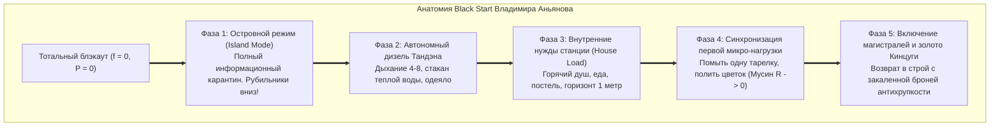
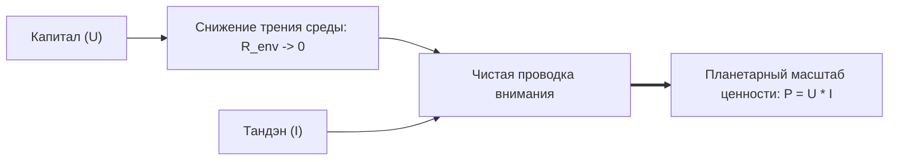

### Глава 3.4 — Протокол «Черного старта» (Black Start): Аварийный запуск контура с нуля после катастрофического блэкаута

> *«Когда падает национальная энергосеть, диспетчеры не пытаются включить освещение мегаполиса одним рубильником — от этого взорвутся трансформаторы. Они вызывают дизель "черного старта", изолируют шины и шаг за шагом запитывают собственные нужды станции. Если в вашей жизни случилась катастрофа — смерть близкого, крах компании или черная депрессия, — остановите всё. Включите Black Start. Один стакан воды. Одно дыхание животом. Один метр пространства. Жизнь возвращается не рывком, а пошаговой подачей напряжения.»*  
> — **Владимир Аньянов (Аксиома XIII)**

#### 1. Феноменология тотального блэкаута
В жизни каждого человека бывают моменты, когда штатные техники саморегуляции не работают:
- Внезапная гибель ребенка или супруга.
- Предательство партнеров, уголовное дело и потеря дела 15 лет жизни.
- Тяжелое соматическое заболевание или парализующий клинический депрессивный эпизод.

В этот момент в сознании выгорает не отдельный резистор — **происходит взрыв подстанции**. Системная частота падает в ноль. Человек лежит, уставившись в потолок, не в силах почистить зубы или сделать телефонный звонок. Любые попытки окружающих подбодрить фразами: *«Соберись, ты же сильный! Посмотри на солнце!»* — вызывают лишь приступ ярости или глухого отчаяния.



#### 2. Пошаговый регламент подъема из небытия
1. **Фаза 1: Островной режим (Island Mode).**  
   Немедленно отключите все внешние каналы: соцсети, новости, звонки родственников, рабочие чаты. Объявите официальный карантин. Ваша станция в аварии, вы не отдаете энергию наружу ни на милливатт.
2. **Фаза 2: Дизель Тандэна.**  
   Сократите горизонт мышления до 60 секунд. Перенесите внимание на 3 пальца ниже пупка. Вдох 4 секунды — выдох 8 секунд. Повторить 20 раз. Выпейте стакан чистой теплой воды. На этом этапе ваш долг перед миром — просто дышать.
3. **Фаза 3: Питание собственных нужд.**  
   Тело должно получить базовые биологические ресурсы: теплый суп, горячая вода душа, чистая одежда, сон в темноте. Очистите 1 квадратный метр вокруг кровати.
4. **Фаза 4: Первая микро-нагрузка.**  
   Сделайте одно физическое действие, в котором невозможно ошибиться: помойте одну чашку. Застелите кровать. Пройдите 200 метров по улице. Сделайте это в чистом присутствии: руки чувствуют воду, ноги чувствуют асфальт. Ток стронулся с мертвой точки!
5. **Фаза 5: Золотой шов Кинцуги.**  
   Через дни или недели энергосеть восстановится. Но вы уже никогда не будете прежним: ваш контур обретет сверхпрочный диэлектрик человека, который воскрес из полного нуля.

---

### Глава 3.5 — Схемотехника коллективов: Параллельное и последовательное включение, токсичный омический перегрев совещаний и фазовая индукция лидера

> *«Компания — это не штатное расписание и не диаграмма Ганта. Компания — это электрическая сеть. Если люди в ней соединены последовательно бюрократией, сопротивление суммируется, и ток падает до нуля. Если совещания превращаются в статусную борьбу, омический перегрев плавит миллионные бюджеты. Задача истинного лидера — держать собственный Тандэн на частоте 50 Гц и индуцировать сверхпроводимость команды.»*  
> — **Владимир Аньянов (Аксиома XIV)**

#### 1. Последовательная бюрократия vs Параллельные созидатели
В электродинамике закон сложения сопротивлений беспощаден:
- **Последовательная цепочка:** $R_{\text{total}} = R_1 + R_2 + \dots + R_n$. Если в цепочке согласований сидит хотя бы один испуганный или обиженный сотрудник ($R_k \to \infty$), общий ток компании обнуляется ($I = 0$). Инновация умирает в зародыше.
- **Параллельная сеть Аньянова:** $\frac{1}{R_{\text{total}}} = \sum \frac{1}{R_k}$. Команда разбита на автономные кросс-функциональные ячейки. Общее сопротивление сети падает ниже сопротивления самого сильного сотрудника. Проект летит со скоростью света.

```
ПОСЛЕДОВАТЕЛЬНО (Бюрократия):
 [Идея] ──► [Юрист (R1)] ──► [Безопасник (R2)] ──► [Босс (R3)] ──► 0 ТОКА!

ПАРАЛЛЕЛЬНО (Сверхпроводимость):
         ┌──► [Под 1: Код (R1 -> 0)] ──┐
 [Миссия]├──► [Под 2: Дизайн (R2 -> 0)]├──► [ГОТОВЫЙ ПРОДУКТ КЛИЕНТУ]
         └──► [Под 3: Маркетинг (R3)] ──┘
```

#### 2. Физика совещаний: Омический перегрев эго
Почему после двухчасового совещания топ-менеджеры выползают из переговорки с головной болью и нулевой энергией?

Потому что совещание превратилось в **паразитный реостат**:
$$Q_{\text{meeting}} = I_{\text{team}}^2 \cdot \left(\sum R_{\text{ego}}\right) \cdot \Delta t$$
Вместо того чтобы обсуждать продукт, участники меряются социальным статусом: *«Кто тут главный? Кто виноват в срыве спринта? Почему меня не поставили в копию?»*  
Реостаты $R_{\text{ego}}$ подскакивают до небес. Ток внимания всей команды сжигается в колоссальном выделении тепла (крики, сарказм, скрытая агрессия). Продукт не получил ни одного джоуля.

#### 3. Фазовая индукция лидера: 50 Гц спокойствия
В электросети стабильность энергосистемы удерживают роторы синхронных турбогенераторов.

Лидер команды — это **синхронный компенсатор частоты**:
1. Когда в стартапе начинается паника (кассовый разрыв, атака конкурентов), лидер обязан **опустить внимание в Тандэн и обнулить свой $R_{\text{ego}}$**.
2. Входя в комнату в состоянии абсолютного Мусин, лидер физиологически индуцирует спокойствие через зеркальные нейроны и электромагнитное поле сердца.
3. Команда чувствует непоколебимость генератора, паника DMN затухает, и сотрудники мгновенно возвращаются к точному решению инженерных задач.

---

### Глава 3.6 — Электродинамика капитала: Деньги как напряжение цепи ($U$) и редуктор внешнего трения среды

> *«Деньги не содержат счастья — в банкнотах нет свободных электронов радости. Деньги — это внешнее напряжение ($U$) и техническая смазка для цепи: они снижают гидродинамическое сопротивление бытовой среды в ноль. Если ваш внутренний контур закорочен на Эго, миллиард долларов лишь быстрее расплавит проводку. Но если ваш Тандэн включен, капитал превращает ваш ток в планетарную мощность.»*  
> — **Владимир Аньянов (Аксиома XV)**

#### 1. Демистификация финансовой энергии
Отношение к деньгам в обществе разорвано между циничным культом наживы и лицемерным презрением «духовных учителей».

Архитектура счастья дает строгую физическую формулировку:
$$\text{Мощность созидания} \quad P = U_{\text{money}} \cdot I_{\text{tanden}}$$
где:
- $I_{\text{tanden}}$ — сила вашего внутреннего тока (ваша воля, мастерство, присутствие),
- $U_{\text{money}}$ — внешняя разность потенциалов (капитал, доступные ресурсы).

#### 2. Деньги как редуктор внешнего сопротивления ($R_{\text{env}}$)
Нищета — это высокое механическое и гидродинамическое сопротивление среды:
- Некачественная еда и дешевый матрас изнашивают биологический реактор тела.
- Три пересадки на общественном транспорте сжигают 3 часа продуктивного внимания в день.
- Медленный ноутбук и зависающий софт превращают рабочий день в мучение.

Капитал смывает это трение:
- Вы спите в тишине и комфорте.
- Вы мгновенно перемещаетесь в пространстве.
- Вы нанимаете лучших специалистов и покупаете лучшее оборудование.
Внешнее сопротивление падает до нуля ($R_{\text{env}} \to 0$). Проводка освобождена для чистого полета мысли.



#### 3. Почему богатство убивает незрелый контур:
Если у человека **нет устойчивого Тандэна**, а его внимание закорочено на Эго ($R_{\text{ego}} \gg 0$):
По формуле $P_{\text{loss}} = \frac{U^2}{R_{\text{ego}}}$ подача высокого напряжения $U$ на короткозамкнутый контур приводит к **мгновенному тепловому взрыву**:
- Наркотики, алкоголь и разврат как отчаянная попытка залить пылающий омический огонь в душе.
- Паранойя, бесконечные суды и разрушение семей.
- Полная ангедония (неспособность чувствовать радость).

**Золотое правило Аньянова:**  
*Сначала откалибруйте сверхпроводимость Тандэна ($R \to 0$), и только потом поднимайте напряжение капитала ($U \gg 0$). Тогда каждый заработанный рубль станет чистым светом для человечества.*
