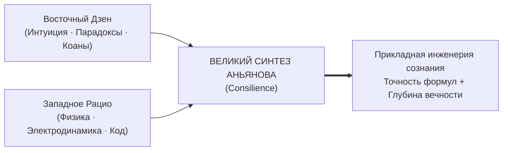
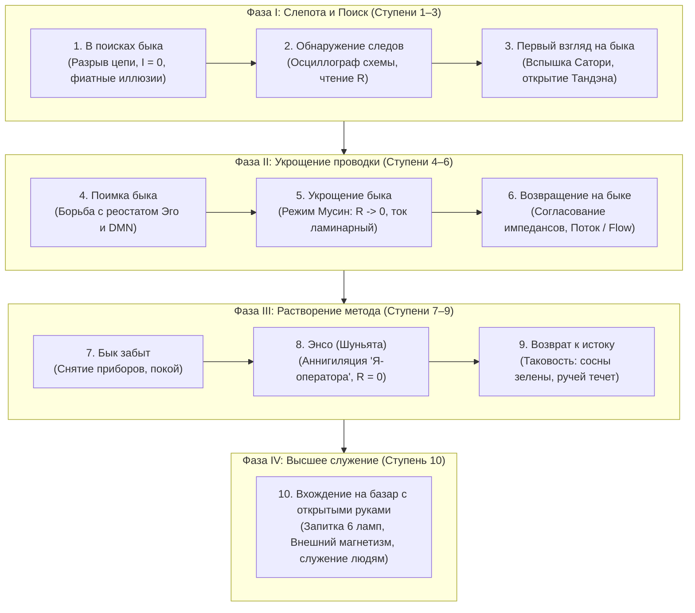

# ЧАСТЬ IV: ВЕЛИКИЙ ДЗЕН-СИНТЕЗ

---

### Глава 4.1 — Дзен без благовоний: Исторический мост между Востоком и Западом

> *«Дзен веками отпугивал западного рационального человека своим туманом: парадоксальными коанами, ударами палкой кэйсаку и ароматом сандаловых палочек. Но если отбросить средневековый ориентализм, Дзен — это самая строгая в истории школа эмпирической электродинамики сознания. Мы перевели Дзен с туманного языка притч на язык уравнений Максвелла и закона Ома. Дзен без благовоний — это чистая инженерия сверхпроводимости.»*  
> — **Владимир Аньянов (Аксиома XVI)**

#### 1. Преодоление барьера «айтушей» и экзотики
Когда европейский инженер, разработчик или ученый пытается читать классические тексты Дзен (Бодхидхарма, Догэн, Линьцзи), он неизбежно упирается в когнитивный барьер:
- *«Каков хлопок одной ладони?»*
- *«Если встретишь Будду — убей Будду!»*
- *«Флаг колышется или ветер дует? Колышется ваш ум».*

Для ума, воспитанного на Декарте, Ньютоне и логике предикатов, это звучит либо как поэтическая шизофрения, либо как претенциозная мистика. В результате западный мир породил две карикатуры:
1. *Поп-осознанность (Mindfulness):* стерилизованная корпоративная медитация, чтобы сотрудники меньше нервничали и больше кодили.
2. *Эзотерический туризм:* побег в монастыри Киото, переодевание в кимоно и зажигание благовоний без понимания сути.

#### 2. В чем состоял подлинный метод Дзен?
Мастера чань/дзен в Китае и Японии никогда не были теоретиками. Они были **жесткими экспериментаторами-практиками**:
- Монах не читал священных книг — он 14 часов сидел на татами в позе Дзадзэн, наблюдая за дыханием.
- Когда монах начинал блуждать в абстрактных концепциях, мастер бил его палкой по плечу не из жестокости, а чтобы **мгновенно вернуть внимание в физическое тело (включить TPN и обнулить DMN)**!
- Удар — это электрический импульс сброса триггера.

Архитектура счастья снимает необходимость бить человека палкой. Мы даем человеку **осциллограф самонаблюдения**:
- «Хлопок одной ладони» — это снятие разности потенциалов Эго.
- «Убей Будду» — это запрет на создание внешней телеологической иконы ($\mathcal{E}_{\text{load}} \equiv 0$).
- «Колышется ум» — это измерение фазового дрожания проводки внимания (Jitter).

Дзен очищен от благовоний. Он заходит прямо в терминал современного созидателя как надежная прошивка операционной системы.

---

### Глава 4.2 — Полный онтологический атлас: Биекция 23 канонов Дзен и электродинамики

> *«Биекция — это математическое взаимно-однозначное соответствие. Каждый из 23 канонов Дзен имеет точный физический аналог в электротехнике. Тандэн — это генератор ЭДС. Мусин — сверхпроводимость $R \to 0$. Дзансин — высоковольтный выключатель. Сёсин — сброс буфера регистров. Это не метафора. Это объективный закон одного и того же мироздания.»*  
> — **Владимир Аньянов (Аксиома XVII)**

Ниже приведена сводная матрица полного онтологического атласа Владимира Аньянова:

| № | Канон Дзен | Оригинал | Электродинамический эквивалент в Архитектуре счастья |
|:---:|:---|:---|:---|
| 1 | **Тандэн** | 丹田 | **Источник ЭДС ($\mathcal{E} > 0$):** биологический генератор постоянного тока в центре тяжести тела. |
| 2 | **Мусин** | 無心 | **Сверхпроводимость ($R \to 0$):** чистое внимание без омического сопротивления Эго и времени. |
| 3 | **Фудосин** | 不動心 | **Частотная стабилизация сети:** непоколебимость генератора при скачках внешней нагрузки. |
| 4 | **Дзансин** | 残心 | **Circuit Breaker (Высоковольтный выключатель):** мгновенный разрыв аварийной дуги при поломке нагрузки. |
| 5 | **Сёсин** | 初心 | **Power-On Reset (Сброс регистров кэша):** ум новичка, чистый вход в каждую задачу без груза старого опыта. |
| 6 | **Кансо** | 簡素 | **Элиминация паразитной емкости и индуктивности:** священная простота, отсечение лишних слоев и шумов. |
| 7 | **Коко** | 考古 | **Старение диэлектрика и патина:** благородная строгость проверенных временем материалов и узлов. |
| 8 | **Сидзен** | 自然 | **Естественная проводимость:** отсутствие искусственного механического сопротивления (ламинарный поток). |
| 9 | **Югэн** | 幽玄 | **Квантовая глубина поля:** невыразимая красота незримого электромагнитного потенциала за пределами формы. |
| 10 | **Дацудзоку** | 脱俗 | **Прорыв за пределы стандарта:** нестандартная топология цепи, гениальное инженерное решение. |
| 11 | **Сэйдзяку** | 静寂 | **Абсолютная электромагнитная тишина ($SNR \to \infty$):** глубокий штиль реактора в медитации. |
| 12 | **Итиго Итиэ** | 一期一会 | **Синхронизация фронта импульса ($t = t_{\text{now}}$):** уникальность текущей миллисекунды взаимодействия. |
| 13 | **Ваби-саби** | 侘寂 | **Допуск на шероховатость:** приятие асимметрии и физического износа материального мира. |
| 14 | **Кинцуги** | 金継ぎ | **Золотое напыление контактов:** закалка диэлектрика после преодоления критической аварии. |
| 15 | **Шибуми** | 渋み | **Идеальное согласование импедансов ($Z_{src} = Z_{load}^*$):** сдержанное благородство без вульгарного крика. |
| 16 | **Сатори** | 悟り | **Мгновенный фазовый переход:** вспышка абсолютной проводимости цепи при замыкании контура. |
| 17 | **Кэнсё** | 見性 | **Аппаратная ревизия схемы:** прямое видение собственной природы без ярлыков и масок. |
| 18 | **Самадхи** | 三昧 | **Когерентный резонанс контура:** полное слияние субъекта, проводника и объекта в единое световое поле. |
| 19 | **Шуньята** | 空 | **Пустотность формы ($\mathcal{E}_{\text{load}} \equiv 0$):** отсутствие собственного заряда у внешних предметов. |
| 20 | **У-вэй** | 無為 | **Ток без омических потерь:** действие без эгоистического натуживания и сопротивления. |
| 21 | **Нидзиригути** | 躙口 | **Калибровка нуля ($R_{\text{ego}} = 0$):** низкий вход, сбивающий спесь и социальные маски на входе. |
| 22 | **Тяною** | 茶の湯 | **Метрологический стенд:** чайная церемония как эталон настройки внимания. |
| 23 | **До (Путь)** | 道 | **Замкнутый жизненный цикл сверхпроводимости:** непрерывное совершенствование энергетического контура. |

---

### Глава 4.3 — Кодекс Дзен-инженера: Жизнь в режиме прямого действия и 30-секундный протокол Сатори

> *«Дзен-инженер не молится о легкой жизни. Он проектирует прочную цепь. Он не жалуется на шторм, а балансирует ротор. Кодекс Дзен-инженера — это не свод моральных запретов. Это правила безопасной эксплуатации высоковольтного реактора собственного сознания.»*  
> — **Владимир Аньянов (Аксиома XVIII)**

#### Пять канонических правил Кодекса Дзен-инженера:
1. **Правило чистой полярности:** *«Никогда не требуй от мира того, что обязан сгенерировать сам».* Твой свет — это твоя ответственность.
2. **Правило нулевого сопротивления:** *«Делай дело, а не думай о том, как ты выглядишь, делая дело».* Убей DMN на входе в задачу.
3. **Правило Дзансин:** *«Всегда держи руку на рубильнике».* Если лампа проекта разрушена — разомкни цепь за 50 миллисекунд и сбереги ядро.
4. **Правило Кинцуги:** *«Не прячь свои ошибки и шрамы».* Заваривай кризисы золотом спокойствия и делай из них броню мастерства.
5. **Правило согласования импеданса:** *«Говори с миром на языке его восприятия, но питаясь от собственного Тандэна».*

#### 30-секундный протокол Сатори (Мгновенный фазовый переход):
Если в разгар рабочего дня вы чувствуете, что контур закипает, сделайте **аппаратный ресет Сатори**:
- **00–10 сек:** Перенесите физический вес внимания в Тандэн. Резкий выдох ртом, затем глубокий вдох животом. Почувствуйте гравитационный центр тела.
- **10–20 сек:** Обнулите время. Скажите себе: *«Прошлого уже нет, будущего еще нет. В этой секунде никакой проблемы физически не существует».* Реостат времени сброшен.
- **20–30 сек:** Откройте глаза и направьте луч внимания на ближайшую физическую деталь: грань экрана, чашку кофе, пальцы на клавиатуре. Прикоснитесь к материалу. Включите TPN.

Щелчок. Резистор остыл. Вы снова в сверхпроводимости. Вы дома.

---

### Глава 4.4 — Десять быков Дзен: Дорожная карта эволюции оператора цепи (От поиска следов до сверхпроводимости на шумном базаре)

> *«Бык — это не дикое животное на альпийском лугу. Бык — это неделимый ядерный реактор Тандэна, первичная жизненная ЭДС человека. А пастух — это внимание, оператор контура. Дзенская притча о Десяти быках — это не поэтическая аллегория, а самая точная в истории инженерная дорожная карта перехода от искрящего, оборванного контура к абсолютной сверхпроводимости служения миру.»*  
> — **Владимир Аньянов (Аксиома XIX)**

#### 1. Демистификация средневековой метафоры Куо-аня

На протяжении многих веков великая серия гравюр и стихов дзэн-мастера Куо-аня (XII век) **«Десять быков» (Дзюгю, 十牛)** оставалась монастырской загадкой. Западные исследователи видели в ней красивую аллегорию укрощения страстей, психологи — этапы интеграции тени и Самости по Юнгу, а эзотерики — таинственные ступени мистического растворения.

Но в Архитектуре счастья эта притча читается с кристальной инженерной ясностью:
- **Бык** — это не внешний трофей и не абстрактное просветление. Бык — это **Тандэн**, изначальный ядерный реактор жизненной силы ($\mathcal{E}_{\text{core}} > 0$). Он колоссален по установленной мощности, дик и свободен.
- **Пастух** — это **Внимание (Оператор цепи)**. Человек, который держит руки на тумблерах распределительного щита.
- **Веревка и кнут** — это **протоколы телесного заземления**: блуждающий нерв (Vagus), диафрагмальное дыхание в живот и включение сенсомоторной сети прямого действия (TPN).
- **Дикие заросли** — это блуждания реактивной дефолт-системы мозга (DMN), бесконечный шум симуляций прошлого и тревог будущего ($R_{\text{past}}, R_{\text{future}}$).
- **Базар (10-я гравюра)** — это **возвращение в мир, запитка всех 6 ламп жизни и излучение Внешнего магнетизма**.

---

#### 2. Десять ступеней оператора цепи: от аварии к сверхпроводимости

##### Ступень 1: В поисках быка (寻牛, Xun Niu) — Разрыв контура и фиатная слепота
Человек блуждает в зарослях, слышит лишь звон цикад и чувствует опустошение.  
*Инженерный статус:* Контур разомкнут (`ERR_04_OPEN_CIRCUIT`). Человек живет в иллюзии «внешнего аккумулятора» ($\mathcal{E}_{\text{load}} > 0$): он ждет, что любовь, деньги, новая должность или статус в соцсетях зарядят его батарею. Но внешние формы пусты (Шуньята). Ток полезного действия $I = 0$. Проводка внимания плавится от омического перегрева бессмысленности по закону Джоуля — Ленца.

##### Ступень 2: Обнаружение следов (见迹, Jian Ji) — Первичная телеметрия
Человек находит следы копыт у ручья.  
*Инженерный статус:* Включение осциллографа. Человек открывает законы Архитектуры счастья. Он впервые начинает измерять собственное сопротивление: *«Голова болит не от погоды, а потому что паразитное $R_{\text{future}}$ зашкаливает за 80 Ом из-за тревоги о презентации»*. Появились датчики.

##### Ступень 3: Первый взгляд на быка (见牛, Jian Niu) — Вспышка Сатори
Среди ветвей мелькнул мощный круп дикого быка.  
*Инженерный статус:* Первый физический контакт с реактором Тандэна. Краткий фазовый переход: сопротивление на секунды падает до нуля ($R \to 0$). Человек физически ощутил центр тяжести внизу живота и осознал: источник энергии не снаружи, он внутри и прямо сейчас готов выдать 100% мощности.

##### Ступень 4: Поимка быка (得牛, De Niu) — Борьба с реостатом Эго
Веревка наброшена, но бык яростно рвется в горы, пытаясь утащить пастуха за собой.  
*Инженерный статус:* Старые нейронные контуры дефолт-системы мозга (DMN) сопротивляются. Мозг привык крутить пластинку тревог, сомнений и саможаления; он отчаянно пытается закоротить реактор на привычные паразитные петли. Требуется жесткая дисциплина: дыхание животом, перенос веса в Тандэн и сенсорное заземление.

##### Ступень 5: Укрощение быка (牧牛, Mu Niu) — Калибровка проводимости (Мусин)
Веревка провисла, бык идет рядом и мирно щиплет траву.  
*Инженерный статус:* Проводка внимания очищена от шлаков. Сопротивление стабилизировано ($R \le 5$ Ом). Ток течет ровно, без искрения на клеммах. DMN засыпает, активна Task-Positive Network (TPN). Бык (энергия жизни) послушно питает текущую задачу без внутреннего трения.

##### Ступень 6: Возвращение домой на быке (骑牛归家, Qi Niu Gui Jia) — Согласование импедансов и Поток
Пастух сидит верхом на быке и играет на бамбуковой флейте. Бык сам идет домой.  
*Инженерный статус:* Идеальное согласование импедансов источника и нагрузки по канону Шибуми ($Z_{\text{src}} = Z_{\text{load}}^*$). Режим чистого Потока (Flow). Исчезло волевое насилие («надо себя заставить»). Энергия Тандэна сама несет мастера сквозь сложные интеллектуальные или ремесленные вызовы. Звук флейты — это чистое электромагнитное излучение гармонии.

##### Ступень 7: Бык забыт, пастух один (忘牛存人, Wang Niu Cun Ren) — Ликвидация концептуальных костылей
Хижина в лунном свете. Веревка и кнут брошены. Бык растворился.  
*Инженерный статус:* Преодоление увлечения теорией. Человеку больше не нужно постоянно замерять сопротивление мультиметром или повторять термины. Электродинамика стала органической природой его тела. Приборы убраны на полку: сеть абсолютно надежна.

##### Ступень 8: И бык, и пастух забыты (人牛俱忘, Ren Niu Ju Wang) — Пустой круг Энсо
На картине нет ни человека, ни быка — лишь совершенный круг Энсо на белом холсте.  
*Инженерный статус:* Полная реализация канона Шуньята (空). Аннигиляция дуализма наблюдателя и наблюдаемого. Снятие концепта «Я — оператор счастья». Чистая квантовая сверхпроводимость вакуума ($R \equiv 0, Z_0 \equiv 0$). Глубочайший экзистенциальный мир (Фудосин) и исчезновение страха смерти.

##### Ступень 9: Возвращение к истоку (返本还源, Fan Ben Huan Yuan) — Инвариантная Таковость
Горный поток шумит, птицы поют, дикая вишня цветет среди скал.  
*Инженерный статус:* Приятие реальности таковой, какова она есть (Татхата). Отказ от навязывания миру антропоморфных «смыслов». Сознание синхронизировано с термодинамическим пульсом Вселенной. Полное отсутствие претензий к погоде, рынку, болезням или людям.

##### Ступень 10: Вхождение на базар с открытыми руками (入廛垂手, Ru Chan Chui Shou) — Запитка 6 ламп и Внешний магнетизм
Мудрец с толстым животом и босыми ногами шагает по шумному рынку среди торговцев, нищих и детей. В руках тыква с вином, в мешке — сладости. Там, где он проходит, сухие ветви покрываются цветами.  
*Инженерный статус:* **Абсолютный триумф системы.** Дзен-инженерия отвергает монастырское отшельничество. Подлинная проверка сверхпроводимости происходит не в тишине пещеры, а в самом пекле жизни: в бизнесе, дедлайнах, семье, шумном городе.  
1. Все 6 ламп жизненного щита (Машина, Дом, Карьера, Отношения, Здоровье, Игра) горят ровным светом.  
2. Ток Тандэна порождает мощнейший **Внешний магнетизм** ($\mathbf{B}$). В присутствии такого человека у окружающих сами собой гаснут тревоги, остывают паразитные сопротивления и зажигаются потухшие глаза.

---

#### 3. Правило восхождения: почему нельзя срезать путь

Главная трагедия современных искателей — **попытка перепрыгнуть со Ступени 1 прямо на Ступень 10**:
- Человек с оборванным контуром, раскаленной от тревоги проводкой и пустым Тандэном решает «служить миру», «строить благотворительную империю» или «спасать людей».
- Результат всегда один: мгновенный омический взрыв, тяжелейшая депрессия и катастрофический блэкаут.

Вы не можете войти на базар с полным мешком подарков, если ваш собственный мешок пуст, а бык носится по скалам, круша деревья.
Сначала найдите следы (Ступень 2). Затем ощутите соматический реактор Тандэна (Ступень 3). Накиньте уздечку на блуждающую DMN (Ступени 4–5). Войдите в поток (Ступень 6). Очиститесь в тишине Энсо (Ступени 7–9). И лишь обретя несокрушимую автономную сверхпроводимость — смело шагайте на шумный базар жизни.

