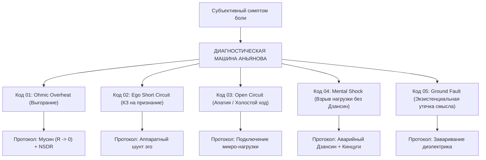

# ЧАСТЬ V: ДИАГНОСТИЧЕСКАЯ МАШИНА, ТЕЛЕМЕТРИЯ И ПРАКТИКУМ

---

### Глава 5.1 — Диагностическая машина: Принцип Pain-First, 5 кодов поломок человеческого контура и ремонтные протоколы

> *«Когда горит чек двигателя на приборной панели автомобиля, водитель не читает аффирмации и не медитирует на колесо. Он подключает сканер OBD-II и считывает код ошибки: P0300 — пропуск зажигания в третьем цилиндре. Архитектура счастья дает человеку такую же диагностическую машину: мы переводим душевную боль из абстрактного страдания в конкретный код схемотехнической аварии и даем четкую технологическую карту ремонта.»*  
> — **Владимир Аньянов (Аксиома XIX)**

#### 1. Принцип Pain-First: Отталкивание от боли
В большинстве психологических систем человеку пытаются навязать идеал: *«Будь осознанным, будь любящим, будь успешным».* 

Инженерный подход диаметрально противоположен: **мы начинаем с локализации боли (Pain-First Architecture)**:
1. Боль — это не враг. Боль — это сигнал измерительного прибора (гальванометра), кричащий: *«В цепи невязка! Проводка перегрета!»*
2. Не надо терпеть боль. Ее надо расшифровать и устранить причину сбоя.



#### 2. Реестр 5 базовых кодов поломок человеческого контура:

##### 🔴 Код ошибки 01: OHMIC_OVERHEAT (Омический перегрев / Выгорание)
- **Субъективное ощущение:** Голова раскалена, в глазах песок, бессонница, раздражение на малейший звук, ощущение, что «шестеренки крутятся вхолостую».
- **Схемотехническая причина:** Закон Джоуля — Ленца: $Q = I^2 R t$. Ток внимания пытается преодолеть колоссальное сопротивление вины за прошлое ($R_{\text{past}}$) или страха перед будущим ($R_{\text{future}}$).
- **Ремонтный протокол:** Немедленный сброс временного фазового сдвига. Возврат в координату $t_{\text{now}}$ (3 сенсорных фиксации TPN) + сеанс глубокого физиологического отдыха (NSDR).

##### 🔴 Код ошибки 02: EGO_SHORT_CIRCUIT (Короткое замыкание на Эго)
- **Субъективное ощущение:** Острая обида, ревность, ступор перед авторитетами, зависимость от лайков и чужого мнения, стыд.
- **Схемотехническая причина:** Контур закорочен на бесконечно малое плечо саморефлексии (DMN). Ток циркулирует по кольцу: *«Как я выгляжу? Достаточно ли я хорош?»*, не отдавая ни джоуля в нагрузку.
- **Ремонтный протокол:** Постановка медного шунта прямого действия. Перенос 100% внимания на физические свойства объекта работы.

##### 🔴 Код ошибки 03: OPEN_CIRCUIT (Разомкнутая цепь / Апатия)
- **Субъективное ощущение:** Бессмысленность, лежание на диване, бесконечный скроллинг ленты, лень, потеря жизненного тонуса.
- **Схемотехническая причина:** Генератор Тандэна работает на холостом ходу. Нагрузка физически отключена ($R_{\text{load}} \to \infty$). Цепь разомкнута.
- **Ремонтный протокол:** Принудительное подключение элементарной физической нагрузки: застелить постель, 50 приседаний, помыть посуду. Ток пошел — цепь замкнулась.

##### 🔴 Код ошибки 04: MENTAL_SHOCK (Разрушение генератора без Дзансин)
- **Субъективное ощущение:** Паника, ощущение, что «земля ушла из-под ног», истерика, физическая боль в сердце после потери проекта или предательства.
- **Схемотехническая причина:** Внезапное разрушение нагрузки вызвало электрическую дугу обратной связи, пробившую изоляцию Тандэна из-за отсутствия предохранителя.
- **Ремонтный протокол:** Включение аварийного размыкателя Дзансин (отсечение дуги за 50 мс) + переход на протокол Black Start и сборку золотом Кинцуги.

##### 🔴 Код ошибки 05: GROUND_FAULT (Экзистенциальная утечка / «Зачем жить?»)
- **Субъективное ощущение:** Тотальное обессиливание, холод в груди, ангедония, мысли о самоубийстве, кризис Толстого.
- **Схемотехническая причина:** Пробой изоляции на экзистенциальную землю. Ток Тандэна утекает в параллельный шунт несуществующего внешнего смысла ($\mathcal{M}_{\text{ext}} \equiv 0$).
- **Ремонтный протокол:** Отключение сторожевого процесса телеологии. Признание абсолютной автономии собственного Тандэна.

---

### Глава 5.2 — Дашборд счастья: Телеметрия сверхпроводимости, формула $\mathcal{H}$ и датчики контура

> *«То, что нельзя измерить, невозможно улучшить. До сих пор счастье оценивали субъективными опросниками с вопросом: "Оцените от 1 до 10, насколько вы довольны жизнью". Это то же самое, что определять давление в паровом котле голосованием рабочих на фабрике. Архитектура счастья выводит на экран оператора объективный инженерный дашборд с приборами реального времени.»*  
> — **Владимир Аньянов (Аксиома XX)**

#### 1. Интегральная формула Индекса Счастья ($\mathcal{H}$) Владимира Аньянова
В Системе Аньянова Индекс Счастья $\mathcal{H}$ — это **термодинамический и электродинамический КПД замкнутого человеческого контура**:

$$\mathcal{H} = \left( 1 - \frac{R_{\text{ego}}}{R_{\text{total}}} \right) \cdot \left( \frac{I_{\text{actual}}}{I_{\text{nominal}}} \right) \cdot \cos(\varphi) \cdot \mathcal{Z}_{\text{safety}}$$

где:
- $\left( 1 - \frac{R_{\text{ego}}}{R_{\text{total}}} \right)$ — **фактор чистоты проводки** (отсутствие паразитного сопротивления эго и DMN),
- $\left( \frac{I_{\text{actual}}}{I_{\text{nominal}}} \right)$ — **фактор активности генератора Тандэн** (наличие реального тока действия, а не апатии),
- $\cos(\varphi)$ — **коэффициент мощности** (синхронизация с моментом $t_{\text{now}}$, отсутствие реактивных потерь прошлого и будущего),
- $\mathcal{Z}_{\text{safety}} \in [0, 1]$ — **статус предохранителей Дзансин** (готовность к безаварийной работе).

```
   ИНДЕКС СЧАСТЬЯ H = 94.2% [СВЕРХПРОВОДИМОСТЬ]
 ┌──────────────────────────────────────────────────────────┐
 │ [ГЕНЕРАТОР]   ЭДС Тандэна:       E = 12.0 V  [OK]        │
 │ [ПРОВОДКА]    Сопротивление Эго: R_ego = 0.02 Ω [MUSHIN] │
 │ [ТОК]         Сила тока внимания:I = 4.8 A   [ACTIVE]    │
 │ [ТЕПЛО]       Омические потери:  Q = 0.46 W  [COLD]      │
 │ [ФАЗА]        Синхронизация t:   cos(φ) = 0.99 [NOW]     │
 │ [ЗАЩИТА]      Предохранитель:    ZANSHIN ARMED [ONLINE]  │
 └──────────────────────────────────────────────────────────┘
```

#### 2. Пять ключевых приборов Дашборда:
1. **Амперметр внимания ($I$):** показывает интенсивность вашего присутствия в физическом действии.
2. **Омметр эго ($R$):** фиксирует появление мыслей о себе, страха оценки и обид.
3. **Калориметр Джоуля ($Q$):** регистрирует накопленное паразитное тепло усталости и стресса.
4. **Фазометр присутствия ($\cos \varphi$):** отслеживает, где находится внимание — в текущей миллисекунде ($\cos \varphi = 1$) или в фантомах памяти/тревоги ($\cos \varphi \to 0$).
5. **Щит 6 ламп (Баланс фаз):** шестиканальный анализатор, показывающий равномерность распределения энергии по сферам жизни:
   - Лампа 1: Тело (Соматика)
   - Лампа 2: Труд (Мастерство)
   - Лампа 3: Близость (Отношения)
   - Лампа 4: Среда (Пространство)
   - Лампа 5: Мысль (Познание)
   - Лампа 6: Игра (Творчество)

Если одна из ламп горит на 100%, а остальные в нуле (например, трудоголик, забросивший тело и семью), дашборд немедленно сигнализирует: **«ВНИМАНИЕ! Перекос фаз! Риск термического разрушения изоляции!»**

Человек видит перекос заранее и мягко перераспределяет ток, не доводя дело до инфаркта или развода.
