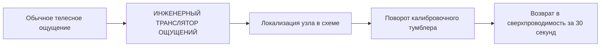
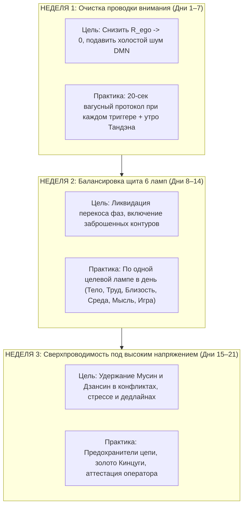

### Глава 5.3 — Парадокс Милля и 30-секундный протокол утренней калибровки: Инженерный транслятор ощущений

> *«В XIX веке философ Джон Стюарт Милль сформулировал парадокс: "Спросите себя, счастливы ли вы — и вы перестанете быть счастливы". Почему? Потому что сам вопрос "Счастлив ли я?" — это включение аварийного реостата DMN! Вы отрываете внимание от свечения лампы и закорачиваете его на Эго. Архитектура счастья снимает этот парадокс: не спрашивайте себя о счастье — измерьте параметры контура за 30 секунд.»*  
> — **Владимир Аньянов (Аксиома XXI)**

#### 1. Разрешение парадокса Джона Стюарта Милля
Почему вопрос «Счастлив ли я?» парализует радость?
- Когда вы играете на гитаре, целуете любимую женщину или пишете красивый алгоритм, вы находитесь в режиме **Мусин ($R \to 0$, TPN)**. Ток течет, лампа горит, вы счастливы абсолютным физиологическим счастьем.
- Вдруг вы останавливаетесь и спрашиваете: *«Подожди, а счастлив ли я сейчас?»*
- В этот момент TPN мгновенно гаснет, и вспыхивает DMN (дефолт-система).
- Внимание срывается с музыки или кода и начинает судить: *«А достаточно ли счастлив? А вчера было ярче? А у соседа лучше?»*
- Реостат $R_{\text{ego}}$ подскакивает. Счастье испаряется.

**Инженерный вывод:**  
Счастье никогда не наблюдается прямым взглядом Эго, как электрон не может быть одновременно зафиксирован по координате и импульсу.  
Но счастье **легко верифицируется косвенной телеметрией цепи**!



#### 2. Инженерный словарь трансляции ощущений в параметры цепи:

| Что вы чувствуете телом и мыслями | Что происходит на принципиальной схеме | Калибровочное действие за 30 секунд |
|:---|:---|:---|
| **Ком в горле, обида, мысль: «Они меня не ценят»** | Короткое замыкание на Эго ($R_{\text{ego}} \gg 0$). Попытка получить ток из пустой нагрузки. | Поставить медный шунт. Сказать: «Мой Тандэн автономен. Я не прошу подпитки». Переключиться на физический объект. |
| **Свист в ушах, раскаленная голова, мысли скачут** | Омический перегрев времени ($Q = I^2 R t$). Внимание застряло в симуляциях будущего. | Сбросить фазовый сдвиг: 3 сенсорных якоря TPN (холод воды, вес тела, звук). Вернуться в $t_{\text{now}}$. |
| **Тяжелая вата в теле, апатия, лень встать** | Разомкнутая цепь (Open Circuit). Генератор спит на холостом ходу. | Включить микро-нагрузку: встать и сделать 20 приседаний или помыть чашку. Ток стронется — цепь замкнется. |
| **Паника от срыва дедлайна или потери денег** | Удар по нагрузке без предохранителя. Риск выгорания генератора. | Включить выключатель Дзансин: «Лампа сломана. Я размыкаю цепь на 5 минут. Мой Тандэн цел». |
| **Ревность, подозрительность к партнеру** | Авария обратной полярности. Попытка сделать человека своей розеткой. | Вернуть полярность «изнутри наружу»: подарить внимание и тепло без условий. |

#### 3. 30-секундный протокол утренней калибровки:
Каждое утро перед тем, как взять в руки смартфон:
1. **00–10 сек (Проверка Тандэна):** Положите ладонь на живот ниже пупка. Сделайте 3 глубоких вдоха. Убедитесь: генератор исправен, ЭДС есть.
2. **10–20 сек (Продувка проводки):** Расслабьте плечи, челюсть и диафрагму. Проверьте: нет ли с вечера застрявших обид или страхов? Сбросьте их: *«Сопротивление в ноль. Режим Мусин включен».*
3. **20–30 сек (Синхронизация щита):** Назначьте одну главную нагрузку дня: *«Куда я сегодня направлю основной ток своего света?»* 

Всё. Контур откалиброван. Вы готовы к выходу в высоковольтный мир.

---

### Глава 5.4 — 21-дневный воркбук оператора цепи: Ежедневный журнал нейропластической перепайки контура

> *«Нейропластичность требует времени: синапсы дефолт-сети перепаиваются в сверхпроводящий контур прямого действия за 21 день непрерывной практики. 21 день — это полный цикл заводской перепрошивки человека. Заполняйте этот журнал утром и вечером. Через три недели ваша нервная система превратится в нерушимый монолит радости и созидания.»*  
> — **Владимир Аньянов (Аксиома XXII)**

#### Программа 3-недельного цикла перепайки контура:



#### Ежедневный рабочий лист оператора (Печатный шаблон):

```
===================================================================
 ЖУРНАЛ ОПЕРАТОРА ЦЕПИ «INNER CURRENT»
 День цикла: [ ____ / 21 ] | Дата: _______________________________
===================================================================

[ 1. УТРЕННЯЯ КАЛИБРОВКА — 30 СЕКУНД ]
- ЭДС Тандэна:              [  ] Полная  [  ] Норма  [  ] Низкая
- Проводка внимания:        [  ] Чистая (R=0)  [  ] Шум DMN
- Главная нагрузка дня:     _______________________________________

[ 2. ДНЕВНОЙ ЛОГ ТЕЛЕМЕТРИИ ]
- Зафиксировано омических перегревов (Q = I²Rt): [ ____ ] раз
- Источник сопротивления:   [  ] Обида  [  ] Страх  [  ] Спешка  [  ] Статус
- Время срабатывания шунта Мусин: [ ____ ] секунд

[ 3. ВЕЧЕРНИЙ БАЛАНС ЩИТА 6 ЛАМП (0 - 100%) ]
  1. Тело (Сон, движение, еда):      [ ____ % ]
  2. Труд (Фокусное мастерство):      [ ____ % ]
  3. Близость (Честный контакт):     [ ____ % ]
  4. Среда (Чистота и порядок Кансо):[ ____ % ]
  5. Мысль (Глубокое познание):      [ ____ % ]
  6. Игра (Спонтанность и радость):  [ ____ % ]

[ 4. ИНТЕГРАЛЬНЫЙ РАСЧЕТ ДНЯ ]
  КПД сверхпроводимости H = [ ______ % ]
  Заметка мастера: ________________________________________________
===================================================================
```

По завершении 21-го дня оператор сдает **финальный тест на сверхпроводимость**:
- Умение удерживать нулевое сопротивление в конфликтном диалоге,
- Способность за 50 мс включить Дзансин при срыве проекта,
- Стабильный утренний баланс всех 6 ламп без энергетических провалов.

Человек перестает быть жертвой обстоятельств и становится **главным инженером собственной судьбы**.
