# Внутренний ток: Архитектура счастья
## Физика сверхпроводимости, дзен-онтология и точная инженерия человеческого благополучия

> *Живая рукопись — мастер-документ книги.*  
> **Автор:** Владимир Аньянов  
> **Синхронизировано с базой знаний Obsidian:** `LLM Wiki/02_Wiki` & `04_Maps/Inner Current MOC`  
> *Текущий статус ревизии:* **23 сентября 2026** | Развернуты Манифест, Предисловие, Введение и Глава 1.1 на базе 28 фундаментальных статей.

---

> [!quote] Главная аксиома книги
> ### **«Счастье — это режим сверхпроводимости цепи.»**  
> — **Владимир Аньянов**
> 
> *«Мы не создавали законы человеческой природы заново. Мы открыли строгую инженерную архитектуру счастья — перевели вековую интуицию и хаос человеческого опыта в прикладную, проверяемую и ремонтируемую систему. Душевный разлад — это не экзистенциальное проклятие, а омический перегрев или утечка на землю, поддающиеся точной локализации и отладке приборами ясного внимания.»*

---

## КАРТА РУКОПИСИ (Map of Content)

| Статус | Раздел | Название главы | Готовность | Первоисточник в Obsidian |
|:---:|:---|:---|:---:|:---|
| ✅ | **Манифест** | Манифест Дзен-инженера: От сказок к законам сохранения | 100% | [[02_Wiki/Inner Current (Novelty and Value Proposition)\|Novelty and Value Proposition]] |
| ✅ | **Предисловие** | Вспышка на беговой дорожке: От апофатического тупика и диалога с ИИ к физике внутреннего тока | 100% | [[02_Wiki/Inner Current (Canonical Definitions of Happiness — Technical and Intuitive Formulations)\|Canonical Definitions]], [[02_Wiki/Inner Current (Case Study - Engineer Romance Approach)\|Case Study]] |
| ✅ | **Введение** | Инженерный критерий истины: Почему психология не дала формулы счастья | 100% | [[02_Wiki/Inner Current (Closed Thermodynamic System as Criterion of Truth)\|Closed Thermodynamic System]], [[02_Wiki/Inner Current (Engineering Epistemology and Bitcoin Law)\|Engineering Epistemology]] |
| ✅ | **Часть I: Гл. 1** | Анатомия контура: Тандэн (Ядро), Внимание (Проводка) и Нагрузка (6 ламп) | 100% | [[02_Wiki/Inner Current (Core Topology and Polarity Law)\|Core Topology and Polarity Law]] |
| ✅ | **Часть I: Гл. 2** | Закон полярности: Изнутри наружу и авария обратного тока | 100% | [[02_Wiki/Inner Current (Core Topology and Polarity Law)\|Core Topology]], [[02_Wiki/Inner Current (The Nature of the Light Bulb and Zen Load)\|Nature of the Light Bulb]] |
| ✅ | **Часть I: Гл. 3** | Физика присутствия: «Здесь и сейчас» как сверхпроводимость ($R \to 0$) | 100% | [[02_Wiki/Inner Current (Physics of Presence and Superconductivity)\|Physics of Presence]] |
| ✅ | **Часть I: Гл. 4** | Термодинамика духа: Шесть фундаментальных начал счастья | 100% | [[02_Wiki/Inner Current (Fundamental Laws of the Happiness Thermodynamics)\|Fundamental Laws]] |
| ✅ | **Часть I: Гл. 5** | Нейробиология сверхпроводимости: DMN как реостат Эго и блуждающий нерв | 100% | [[02_Wiki/Inner Current (Neurobiology of Superconductivity — DMN, TPN and Vagus Grounding)\|Neurobiology of Superconductivity]] |
| ✅ | **Часть I: Гл. 6** | Биткоин духа: Что Сатоши сделал для денег, Внутренний ток сделал для счастья | 100% | [[02_Wiki/Inner Current (What Bitcoin Did for Finance, Inner Current Did for Happiness)\|What Bitcoin Did for Finance]] |
| ✅ | **Часть I: Гл. 7** | Единый налог Генри Джорджа: Физика свободного созидания и ликвидация паразитной ренты | 100% | [[02_Wiki/Inner Current (The Henry George Principle — Single Tax, Bitcoin and Circuit Superconductivity — Law of Direct Flow and Elimination of Parasitic Rent)\|The Henry George Principle]] |
| ✅ | **Часть I: Гл. 8** | Генезис посредников и закон прямого потока: Почему рождается паразитная рента и в чём глубинное единство Биткоина, Единого налога и Системы Аньянова | 100% | [[02_Wiki/Inner Current (Genesis of Intermediaries and the Thermodynamics of Direct Flow — Why Parasites Arise and How the Triad Restores Purity)\|Genesis of Intermediaries]] |
| ✅ | **Часть II: Гл. 8** | Природа и иллюзия Эго: Реостат сопротивления и протокол шунтирования | 100% | [[02_Wiki/Inner Current (Nature and Illusion of Ego)\|Nature and Illusion of Ego]] |
| ✅ | **Часть II: Гл. 9** | Иллюзия аккумулятора вещей: Парадокс BMW и пустотность формы | 100% | [[02_Wiki/Inner Current (The Battery Illusion of Material Possessions and Emptiness of Form)\|The Battery Illusion]] |
| ✅ | **Часть II: Гл. 10** | Инженерное доказательство отсутствия смысла жизни: Освобождение от телеологии | 100% | [[02_Wiki/Inner Current (Engineering Proof of No Meaning of Life and the Birth of Happiness Architecture)\|Engineering Proof]] |
| ✅ | **Часть II: Гл. 11** | Трагедия Льва Толстого: Станция Астапово против суверенного Тандэна | 100% | [[02_Wiki/Inner Current (Tolstoy Existential Crisis vs Happiness Architecture)\|Tolstoy Existential Crisis]], [[02_Wiki/Inner Current (Circuitry of Existential Fault and Ground Leak)\|Circuitry of Existential Fault]] |
| ✅ | **Часть II: Гл. 12** | Анатомия сдвига парадигмы: Эпициклы Птолемея против простоты Кансо | 100% | [[02_Wiki/Inner Current (Anatomy of the Paradigm Shift — Ptolemaic Epicycles vs Kanso Simplicity and Falling of False Questions)\|Anatomy of the Paradigm Shift]] |
| ✅ | **Часть II: Гл. 13** | Деконструкция пари Паскаля и вопрос о Боге: 350 лет теологической рулетки против инварианта | 100% | [[02_Wiki/Inner Current (Deconstruction of Pascal's Wager — Theological Roulette vs Superconducting Invariance)\|Pascal's Wager]], [[02_Wiki/Inner Current (The Question of God — Electrodynamic Invariance and Dissolution of Theological Resistance)\|The Question of God]] |
| ✅ | **Часть III: Гл. 14** | Инвариантность масштаба: От чайной церемонии Тяною до космической корпорации | 100% | [[02_Wiki/Inner Current (Scale Invariance and Tea Ceremony)\|Scale Invariance]] |
| ✅ | **Часть III: Гл. 15** | Предохранители цепи: Дзансин, Ваби-саби и золото шрамов Кинцуги | 100% | [[02_Wiki/Inner Current (Safety, Antifragility and Zanshin)\|Safety, Antifragility and Zanshin]] |
| ✅ | **Часть III: Гл. 16** | Схемотехника отношений: Синхронизация двух контуров без короткого замыкания | 100% | [[02_Wiki/Inner Current (Case Study - Engineer Romance Approach)\|Case Study - Romance Approach]], [[02_Wiki/Inner Current (Happiness Relativity vs Circuit Invariance)\|Happiness Relativity]] |
| ✅ | **Часть III: Гл. 17** | Протокол «Черного старта» (Black Start): Аварийный запуск контура с нуля | 100% | [[02_Wiki/Inner Current (Black Start Protocol — Cold Reboot After Catastrophic Blackout)\|Black Start Protocol]] |
| ✅ | **Часть III: Гл. 18** | Схемотехника коллективов: Параллельные ячейки и фазовая индукция лидера | 100% | [[02_Wiki/Inner Current (Collective Circuitry — Team Impedance, Status Ohmic Overheat and Leader Induction)\|Collective Circuitry]] |
| ✅ | **Часть III: Гл. 19** | Электродинамика капитала: Деньги как напряжение ($U$) и редуктор внешнего трения | 100% | [[02_Wiki/Inner Current (Electrodynamics of Capital — Money as Voltage and Fluid Resistance Reducer)\|Electrodynamics of Capital]] |
| ✅ | **Часть IV: Гл. 20** | Дзен без благовоний: Исторический мост между Востоком и Западом | 100% | [[02_Wiki/Inner Current (Zen as Happiness Architecture Foundation)\|Zen as Foundation]], [[02_Wiki/Inner Current (East-West Synthesis and Demystification)\|East-West Synthesis]] |
| ✅ | **Часть IV: Гл. 21** | Полный онтологический атлас: Биекция 23 канонов Дзен и электродинамики | 100% | [[02_Wiki/Inner Current (Complete Zen-Electrodynamic Ontological Atlas)\|Complete Ontological Atlas]], [[02_Wiki/Inner Current (Zen-Thermodynamics Synthesis and Happiness Breakthrough)\|Zen-Thermodynamics Synthesis]] |
| ✅ | **Часть IV: Гл. 22** | Кодекс Дзен-инженера: Жизнь в режиме прямого действия | 100% | [[02_Wiki/Inner Current (Mathematics of Harmony and Consilience)\|Mathematics of Harmony]] |
| ✅ | **Часть IV: Гл. 23** | Десять быков Дзен: Дорожная карта эволюции оператора цепи | 100% | [[02_Wiki/Inner Current (Ten Bulls of Zen — 10 Stages of Superconductivity Operator Evolution)\|Ten Bulls of Zen]] |
| ✅ | **Часть IV: Гл. 24** | Коперниканский переворот в онтологии: Метод «Снизу-вверх», Summum Bonum и Человек + ИИ | 100% | [[02_Wiki/Inner Current (Copernican Revolution in Ontology — Bottom-Up Circuit Dissolution of Metaphysics and Human-AI Zanshin)\|Copernican Revolution]], [[02_Wiki/Inner Current (Summum Bonum and Epistemological Grounding — The Root Node of Happiness vs Limits of the Model)\|Summum Bonum]], [[02_Wiki/Inner Current (Dissolution of Eternal Questions — From Humanitarian Deadlock to Scientific Circuitry)\|Dissolution of Eternal Questions]] |
| ✅ | **Часть IV: Гл. 25** | Триада и Тетрада Аньянова: Истина, Свобода, Счастье, Созидание — деконструкция свободы воли и автобиографический синтез | 100% | [[02_Wiki/Inner Current (The Anyanov Triad and Tetrad — Truth, Freedom, Happiness, Creation and the Biographical Proof)\|The Anyanov Triad and Tetrad]] |
| ✅ | **Часть V: Гл. 26** | Диагностическая машина: 5 архетипов сбоев и ремонтные протоколы | 100% | [[02_Wiki/Inner Current (Diagnostic Machine and System Specification)\|Diagnostic Machine]] |
| ✅ | **Часть V: Гл. 27** | Дашборд счастья: Телеметрия сверхпроводимости и формула $\mathcal{H}$ | 100% | [[02_Wiki/Inner Current (Happiness Dashboard and Superconductivity Telemetry)\|Happiness Dashboard]], [[02_Wiki/Inner Current (Happiness Index vs UN World Happiness Report)\|Happiness Index vs UN]] |
| ✅ | **Часть V: Гл. 28** | Парадокс Милля и 30-секундный протокол утренней калибровки | 100% | [[02_Wiki/Inner Current (Human Self-Check Protocol and Sensation Translator)\|Human Self-Check]], [[02_Wiki/Inner Current (The 'Am I Happy' Question and Circuit Telemetry)\|The 'Am I Happy' Question]] |
| ✅ | **Часть V: Гл. 29** | 21-дневный воркбук оператора цепи: Ежедневный журнал перепайки контура | 100% | [[02_Wiki/Inner Current (21-Day Superconductivity Operator Protocol — Daily Workbook)\|21-Day Workbook Protocol]] |
| ✅ | **Часть V: Гл. 30** | Камертон реальности: Универсальный инструмент калибровки людей, B2B-аудита и корпоративной монетизации | 100% | [[02_Wiki/Inner Current (Tuning Fork of Reality — Universal Calibration Tool, B2B Audit and Corporate Monetization)\|Tuning Fork of Reality]] |
| ✅ | **Заключение** | Мост во внешний мир: Согласование импедансов и Внешний магнетизм | 100% | [[02_Wiki/Inner Current (Impression Architecture and Impedance Matching)\|Impression Architecture]] |
| ✅ | **Приложения** | Канонические формулы, Свод 12 аксиом и Инженерно-дзенский тезаурус | 100% | [[04_Maps/Inner Current MOC\|Inner Current MOC]] |

---

## МАНИФЕСТ ДЗЕН-ИНЖЕНЕРА
### От абстрактных сказок — к строгим законам сохранения

Тысячи лет человечество пытается ответить на вопрос: *«Как стать счастливым?»*  
И тысячи лет этот вопрос тонет в абстрактных метафорах, религиозных догмах, психологических шаблонах и ядовитом позитиве маркетинга. 

Человеку говорят:  
*«Просто полюби себя»* — но не дают электрической схемы этой любви.  
*«Найди свое предназначение»* — и обрекают на десятилетия мучительного омического перегрева в поисках вымышленной внешней розетки.  
*«Живи здесь и сейчас»* — но как только наступает завтрашний день, сознание снова сгорает в тревоге будущего или вязнет в тяжелом сопротивлении прошлого.

**Пришло время прекратить романтизацию душевной боли.**  
Человек — это не непостижимая мистическая тайна, обреченная на вечное страдание. Человек — это **высокоорганизованная термодинамическая и электрическая система**. 

В нашем теле бьется сердце, перекачивая литры электролита. По нервным волокнам с измеримой скоростью бегут потенциалы действия. Мозг потребляет четверть всей глюкозы организма, генерируя когерентные электромагнитные поля. 

И если в физическом мире законы электродинамики и термодинамики незыблемы:
- ток не течет без замкнутой цепи,
- энергия не берется из ниоткуда и не исчезает бесследно,
- а сопротивление неминуемо выделяет тепло по закону Джоуля — Ленца, сжигая проводку,

то почему мы наивно полагали, что внутренний мир человека подчиняется сказкам, а не тем же самым фундаментальным законам Вселенной?

**Внутренний ток (Inner Current)** — это манифест трезвости.  
Мы объединили тысячелетний опыт Дзен — самую строгую, беспристрастную практическую школу работы с сознанием — и строгую физику электрических цепей. 

Здесь нет веры. Здесь есть **проверка контура**.  
Здесь нет вины. Здесь есть **локализация утечки**.  
Здесь нет бесконечного анализа детских травм. Здесь есть **калибровка сопротивления в ноль ($R \to 0$)** и запуск генератора на полную мощность.

Добро пожаловать в Архитектуру Счастья.

---

---

## ПРЕДИСЛОВИЕ
### Вспышка на беговой дорожке: От апофатического тупика и диалога с ИИ к физике внутреннего тока

> *«Счастье невозможно определить через то, чем мы обладаем — ведь миллионы людей имеют всё, о чем мечтали, но смотрят на мир потухшими глазами. Но если отбросить всё преходящее, в сухом остатке обнажается чистый внутренний реактор. Внешние вещи, успехи и отношения — это всего лишь лампочки. И лампочка горит только тогда, когда ток течет изнутри наружу, а не наоборот.»*  
> — **Владимир Аньянов**

Всё началось не в секретной лаборатории и не за столом с радиодеталями. Всё началось в самом обыкновенном тренажерном зале.

В паузе между подходами я подошел к знакомой девушке. Она бежала на беговой дорожке, глядя в экран смартфона в наушниках. 
— Что смотришь? — поинтересовался я.  
— Подкаст о счастье, — ответила она, не сбавляя темпа.  

Мы разговорились, и прямо там, под монотонный шум тренажеров, я задал ей простой, казалось бы, вопрос:  
— А ты сама можешь определить, что такое счастье?

Она сбилась с шага и задумалась. Начались привычные, знакомые каждому ответы: «Ну… это когда всё спокойно. Когда есть любовь, близкие здоровы. Когда есть хорошая работа, достаток, путешествия, когда мечты сбываются…»

И в ту же секунду меня обожгла кристально ясная мысль: **положительно определить счастье невозможно**.

### Крах положительного определения

Попробуйте определить счастье через список внешних атрибутов («счастье — это X»), и реальность вдребезги разобьет любую вашу конструкцию:
- **Если счастье в деньгах, квартире и комфорте** — почему мы ежедневно видим владельцев роскошных пентхаусов и спорткаров с бесконечно уставшими, потухшими, мертвыми глазами?
- **Если счастье в семье и детях** — почему столько браков тлеют в удушающей рутине, а люди в них чувствуют себя в глухой изоляции?
- **Если счастье в здоровье и молодости** — почему здоровые двадцатилетние люди впадают в парализующие депрессии?
- **Если счастье в солнце, океане и пальмах** — почему Бали и курорты мира переполнены выгоревшими экспатами, глушащими экзистенциальную пустоту антидепрессантами и алкоголем?

Положительное определение — это ментальная ловушка. Как только вы связываете счастье с внешним объектом, вы немедленно превращаете себя в его заложника.

— Послушай, — сказал я ей. — Положительно это не работает. Давай попробуем пойти от обратного. Давай определим счастье через **отрицание** — откидывая всё то, чем счастье заведомо не является.

### Апофатический путь (Neti, Neti — «Не то, не это»)

В древнеиндийской философии и классическом богословии есть метод познания истины через отрицание — *апофатика*, или *Neti, Neti* («не то, не это»). Если мы не знаем, что такое абсолют, мы можем последовательно отсекать всё ложное и преходящее.

Прямо у беговой дорожки мы начали этот мысленный эксперимент радикального демонтажа:
1. **Мы отбросили вещи:** автомобили, квадратные метры, одежду, гаджеты. Это просто структурированная материя, пластик и металл. Если завтра всё это сгорит — ощущение «я есть» не сгорит вместе с ними.
2. **Мы отбросили социальный статус:** должности, регалии, подписчиков и признание. Чужое мнение — это всего лишь колебания воздуха и синаптический шум в чужих головах, не имеющий веса.
3. **Мы отбросили отношения:** партнеров, друзей, одобрение окружающих. Другой человек — суверенная вселенная со своими траекториями. Он не может служить аккумулятором твоего бытия.
4. **Мы отбросили внешние условия:** погоду, новости, курс валют, кризисы. Они приходят и уходят, как облака над горой.
5. **И, наконец, мы отбросили само биологическое тело.** Клетки тела полностью обновляются каждые несколько лет, тело стареет, болеет, устает. Но Тот, кто воспринимает эти процессы, не является телом.

Что же остается, когда отсечено абсолютно всё внешнее, уязвимое и смертное?

В сухом остатке обнажается **чистое свидетельствующее Сознание — самоощущение «Я ЕСТЬ»**.  
И у этого обнаженного ядра обнаружились три фундаментальных свойства:
- **Безграничность:** оно не заперто в габаритах черепной коробки, оно вмещает в себя всё поле восприятия.
- **Неуязвимость:** его нельзя уволить, предать, ограбить или обесценить.
- **Самосущее блаженство (*Sat-Chit-Ananda*):** в точке абсолютного нуля, когда удалены все помехи и чужие требования, естественное состояние сознания — это тихий, глубокий, ровный восторг самого факта существования.

### Лампочки против Электростанции

И в этот момент родилась метафора, которая легла в основу всей этой книги:

> **Человеческое сознание — это автономная атомная электростанция. А весь материальный и социальный мир — это лампочки.**

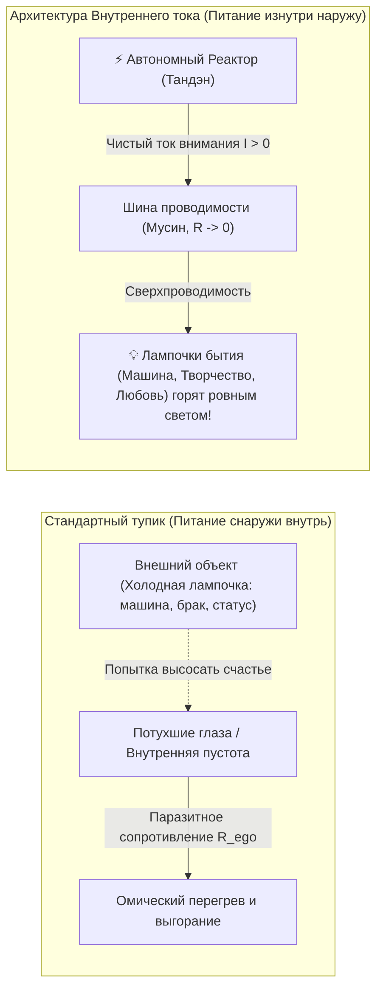

Что делает подавляющее большинство людей? Они берут в руки холодную стеклянную колбу лампочки на 100 Ватт (новую машину, престижную должность, любовный роман) и начинают исступленно молиться на нее:  
*«Пожалуйста, освети мою жизнь! Сделай меня счастливым! Заполни мою пустоту!»*

Но в лампочке **нет генератора**. В ней нет батарейки. Если вы положите стеклянную лампочку в темную комнату, она останется куском мертвого стекла и вольфрама.

Лампочка вспыхивает ослепительным светом ровно в одном случае: **когда ток течет изнутри наружу**. Когда вы подключаете ее к собственному, работающему внутреннему реактору. Счастье находится не в лампочке — счастье заключается в токе, проходящем сквозь нее.

### Ловушка аскетизма: «Счастья нет в BMW, но я хочу на нем ездить»

Здесь возникает опаснейшая развилка, на которой веками ломались миллионы искателей истины.

Осознав, что вещи не содержат в себе счастья, человек нередко падает в другую крайность — в духовный нигилизм и агрессивный аскетизм:  
*«Раз материя пуста — значит, деньги зло, бизнес тлен, карьера суета, брошу всё и уйду в глухую деревню или пещеру».*

Но это не мудрость. Это малодушие и побег от контакта с реальностью.

Истина заключается в подлинной **непривязанности (вайрагья)**:  
> **Счастья действительно нет в BMW. Но это не значит, что я должен отказаться от него. Я все равно хочу ездить на BMW!**

Разница лишь в векторе питания:
1. **Вектор нужды и невроза:** Я сажусь в автомобиль и требую от него: *«Докажи всем, что я не ничтожество! Спаси меня от стыда!»* Тогда любая царапина на бампере становится личной катастрофой, вызывающей предынфарктное состояние.
2. **Вектор сверхпроводимости:** Мой реактор автономен. Я сажусь за руль красивой, точной, быстрой машины просто потому, что мне нравится совершенство ее механики, ускорение и звук мотора. Я приношу свой собственный внутренний свет в эту поездку. Я наслаждаюсь лампочкой, но никогда не путаю ее с источником тока. Если она перегорит или исчезнет — мой реактор не потеряет ни одного вольта мощности.

### Диалог с искусственным интеллектом: Переход к функциональной схеме

Эта мысль захватила меня целиком. Но оставался главный барьер: **на каком языке об этом говорить?**

Я не профессиональный инженер-радиотехник, я не сидел ночами с паяльником над осциллографом. Но мне всегда была органически чужда туманная эзотерика. Я терпеть не могу абстрактные мантры, «вибрации вселенной» и слащавые обещания из популярного селф-хелпа. Мне нужна была модель — ясная, логичная, проверяемая и ремонтопригодная.

Вернувшись из зала, я открыл терминал и начал долгий, напряженный диалог с Gemini — передовым искусственным интеллектом от Google.

Шаг за шагом мы препарировали восточную мудрость, стоицизм и современную теорию систем. И в процессе этого диалога произошел решающий синтез: **мы обратились к языку классической электродинамики и термодинамики**.

Почему именно физика?  
Потому что физика не терпит самообмана:
> *Мы до сих пор не знаем, что такое электричество в его предельной метафизической сущности. Физики не могут дать онтологический ответ на вопрос, «почему» существует электрический заряд. Но это не помешало человечеству вывести уравнения Максвелла, сформулировать закон Ома, построить турбины ГЭС и заставить невидимый ток делать полезную работу — зажигать города, охлаждать пищу и передавать терабайты данных.*

Точно так же нам не нужно тонуть в философских спорах о «природе души». Мы можем описать человеческое сознание как **функциональную электродинамическую цепь**:
- **Источник ЭДС (Тандэн):** Неиссякаемое ядро чистого присутствия, вырабатывающее базовое напряжение жизни ($\mathcal{E} > 0$).
- **Шина внимания (Мусин):** Проводник между реактором и внешним миром. В идеале его сопротивление стремится к нулю ($R \to 0$). Если же внимание засорено мыслями об оценке, страхом провала или самоедством ($R_{ego}$), то по закону Джоуля — Ленца ($Q = I^2 R t$) проводка начинает плавиться. Возникает то, что в быту называют «выгоранием», «панической атакой» или «депрессией».
- **Нагрузка (6 лампочек контура):** Здоровье, Отношения, Профессия/Дело, Деньги, Свобода, Смысл. Они должны быть согласованы по импедансу и питаться чистым током.
- **Автоматика защиты (Дзансин):** Системные предохранители, предотвращающие аварийный разряд при внешних ударах судьбы.

Так родилась **Архитектура счастья**.

Эта книга — не сборник мотивационных тостов и не сборник психологических утешений. Это практическое руководство по ревизии собственной электросети. Мы снимем защитный кожух, возьмем в руки приборы осознанного внимания и шаг за шагом превратим вашу жизнь в режим чистой сверхпроводимости.

---

---

## ВВЕДЕНИЕ
### Инженерный критерий истины: Почему абстрактные сказки о счастье сломались

> *«В науке критерием истины является фальсифицируемость Карла Поппера и баланс законов сохранения. Если теория утверждает что-то, что нельзя измерить, проверить или опровергнуть экспериментом — это не знание, это литература. Архитектура счастья — первая фальсифицируемая теория человеческого духа.»*  
> — **Владимир Аньянов**

Почему за три тысячи лет писаной истории человечество создало адронные коллайдеры, расшифровало геном и связало планету оптоволокном со скоростью света, но в вопросе фундаментального душевного благополучия топчется на уровне античных трагедий?

Ответ прост и беспощаден: **отсутствие критерия истины**.

### Гуманитарный релятивизм: «Счастье у каждого свое»

Главный лозунг, которым современная культура оправдывает свою беспомощность — это релятивизм: *«Ну, счастье ведь субъективно! У каждого своя правда, у каждого свое счастье: кому-то на пляже лежать, кому-то стихи писать, кому-то деньги зарабатывать».*

На языке точных наук этот тезис звучит так же абсурдно, как заявление: *«Электричество у каждого свое: в одном утюге электроны летят от минуса к плюсу, а в другом — силой любви к родине».*

Давайте раз и навсегда снимем эту грубую методологическую ошибку. Она заключается в **смешении физических законов сети с типом подключенного прибора**.

Представьте себе электрическую розетку в стене. 
- Вы можете включить в нее холодильник — и он будет охлаждать продукты.
- Вы можете включить в нее обогреватель — и он будет греть комнату.
- Вы можете включить в нее аудиосистему — и она будет играть Баха.
- Вы можете включить в нее сервер — и он будет вычислять орбиты спутников.

Приборы абсолютно разные. Результаты их работы несравнимы. Но **законы, по которым электрический ток бежит по медным проводам к этим приборам — инвариантны!**  
Закон Ома ($I = U / R$), уравнения Максвелла и баланс мощностей одинаковы и для китайского чайника, и для суперкомпьютера в ЦЕРНе.

Точно так же обстоит дело и с человеком.
Конкретная деятельность человека — это лишь тип подключенной нагрузки. Один пишет симфонию, другой строит мост, третий воспитывает ребенка, четвертый заваривает чай. Но **психофизическое состояние счастья** — это фундаментальный режим работы самой цепи:
$$\mathcal{H} \iff \begin{cases} R_{\text{ego}} \to 0 \\ I_{\text{attention}} > 0 \\ \sum I_{\text{in}} = \sum I_{\text{out}} \end{cases}$$

Счастье — это не то, *что* в вас включено.  
Счастье — это **отсутствие паразитного сопротивления в проводах вашего внимания при совершении действия.**

### Термодинамический баланс Кирхгофа: Ложь немедленно дает омический перегрев

В гуманитарных беседах можно врать годами. Можно убеждать себя, что ты «духовно растешь», медитируя по два часа в день, даже если при этом ты срываешься на близких и ненавидишь свою работу. 

В замкнутой термодинамической цепи солгать невозможно:

$$\oint \mathbf{E} \cdot d\mathbf{l} = 0 \quad \text{и} \quad \sum U_k = 0$$

Если внутри вашего контура появляется ложное ментальное убеждение (например: *«Я должен страдать ради высшей цели»* или *«Мое счастье зависит от того, ответит ли мне эта женщина взаимностью»*), цепь мгновенно реагирует на физическом уровне:
1. Появляется невязка потенциалов $\Delta U \neq 0$.
2. В узле возникает паразитное сопротивление $R_{\text{ego}} \gg 0$.
3. По закону Джоуля — Ленца выделяется омическое тепло:
   $$Q = I^2 \cdot R_{\text{ego}} \cdot t$$
4. Вы чувствуете это тепло как спазм диафрагмы, ком в горле, учащенный пульс, бессонницу и тревогу.

Ваше тело — это безупречный гальванометр. Оно никогда не ошибается. Физическая боль и душевная тоска — это не враги и не патология. Это **диагностический сигнал невязки цепи**, сообщающий оператору: *«Ты закоротил контур. Ты пытаешься нарушить закон сохранения энергии. Немедленно проверь сопротивление!»*

---

---

# ЧАСТЬ I: ФИЗИЧЕСКИЙ БАЗИС ЦЕПИ
### Электродинамика человеческого контура

---

### Глава 1.1 — Анатомия тройственного контура: Тандэн (Ядро), Внимание (Проводка) и Нагрузка (6 ламп)

> *«Вся Вселенная работает на разности потенциалов. Внутри человеческого существа есть собственный неисчерпаемый термоядерный реактор — Тандэн. Но если проводка внимания окислена страхом, а нагрузка выбрана хаотично, свет никогда не загорится.»*  
> — **Владимир Аньянов**

Чтобы починить любую электрическую цепь, инженер первым делом разворачивает перед глазами её принципиальную схему. Давайте нарисуем принципиальную схему человека:

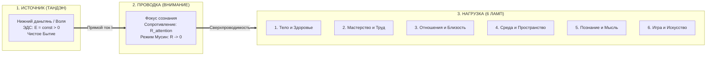

Контур состоит из трех строго последовательных узлов:

#### 1. Источник питания: Тандэн (丹田, Ядро)
В восточной традиции (дзэн, айкидо, даосизм) этот центр называют нижним полем киновари или *хара* (расположен на три пальца ниже пупка, в геометрическом центре тяжести тела). 

Если отбросить мистический налет, **Тандэн — это физиологический и психосоматический генератор постоянного тока**. 
- Это состояние безусловной устойчивости, где энергия существует просто по факту жизни. 
- Это генератор с постоянной электродвижущей силой ($\mathcal{E} > 0$). 
- В Тандэне нет мыслей о себе. Там нет сомнений, нет концепций, нет оценки *«хорошо ли я выгляжу»*. Там есть только чистое, плотное, нерушимое присутствие живой материи.

#### 2. Линия передачи: Внимание (Проводка)
Энергия Тандэна должна куда-то течь. Каналом передачи служит **человеческое внимание**.
- В идеальном состоянии проводка чиста, жилы медные, сечение соответствует мощности генератора. Сопротивление проводки стремится к нулю ($R \to 0$). В японской традиции это состояние называется **Мусин (無心, "Чистый ум")**. Ток течет свободно, без малейших тепловых потерь.
- В аварийном состоянии проводка загрязнена окислами Эго ($R_{\text{ego}}$). Внимание застревает в саморефлексии, в оценке себя со стороны, в страхе ошибки. Проводка раскаляется, ток падает до нуля, и до полезной работы ничего не доходит.

#### 3. Потребитель энергии: Нагрузка (Щит из 6 ламп)
Электрический ток не может течь в разомкнутой цепи. Чтобы цепь замкнулась, энергия должна быть отдана во внешний мир через полезную нагрузку ($R_{\text{load}}$). 

В Архитектуре счастья выделяются **6 фундаментальных ламп нагрузки**:
1. **Тело (Соматический контур):** дыхание, тонус мышц, физическое движение, сон, питание.
2. **Мастерство (Трудовой контур):** создание осязаемого продукта, написание кода, работа с деревом, хирургическая операция, управление проектом.
3. **Близость (Реляционный контур):** честный контакт с другим человеком без масок и защитных игр.
4. **Среда (Пространственный контур):** порядок на рабочем столе, эстетика дома, гармония одежды, чистота инструментов.
5. **Познание (Интеллектуальный контур):** чтение фундаментальных книг, решение математических задач, понимание устройства мира.
6. **Игра (Творческий контур):** чистая спонтанность без прагматической цели — музыка, юмор, прогулка без маршрута.

### Главный закон свечения: Лампа горит только при замкнутом контуре

Запомните фундаментальный вывод:
> Ни одна из 6 ламп не светит сама по себе. Вы не можете «найти счастье в работе» или «найти счастье в отношениях». Лампа — это просто вольфрамовая спираль в стеклянной колбе. Она вспыхивает ослепительным ровным светом **только тогда, когда через неё протекает ток от вашего собственного генератора (Тандэна) через чистое внимание (без омических потерь Эго).**

Если ваш генератор спит, а внимание закорочено на страх — какую бы великолепную работу или идеального партнера вы ни выбрали, лампа останется холодной и темной. И виновата в этом не лампа. Виновата разомкнутая цепь.

---

### Глава 1.2 — Закон полярности: Изнутри наружу и авария обратного тока

> *«В электродинамике полярность абсолютна: ток течет от источника ЭДС через проводник к потребителю. Пытаться получить радость из лампочки — это попытка заставить потребитель стать генератором. Лампа не генерирует ток, она лишь рассеивает его в виде света. Когда человек ждет счастья от внешнего объекта, он подключает нагрузку в обратной полярности, вызывая пробой диода и обугливание контура.»*  
> — **Владимир Аньянов (Аксиома II)**

#### 1. Физическая суть Закона полярности
Фундаментальный закон топологии человеческого контура гласит:
$$\mathbf{J}_{\text{life}} = \sigma \cdot \mathbf{E}_{\text{tanden}} \quad \text{при} \quad \nabla \cdot \mathbf{J} = 0$$
Вектор плотности тока жизни $\mathbf{J}_{\text{life}}$ всегда направлен **строго изнутри наружу**:
$$\text{Тандэн (Генератор)} \longrightarrow \text{Внимание (Провод)} \longrightarrow \text{Нагрузка (Лампа)}$$

Любая попытка развернуть этот вектор вспять — это фундаментальное нарушение законов природы.
Когда человек говорит:
- *«Эта работа сделает меня счастливым»*,
- *«Этот человек должен дать мне чувство значимости»*,
- *«Эта машина наполнит мою жизнь восторгом»*,

он совершает фатальную схемотехническую ошибку: он пытается заставить **пассивную нагрузку ($R_{\text{load}}$)** работать в режиме **активного источника энергии ($\mathcal{E}_{\text{load}} > 0$)**.

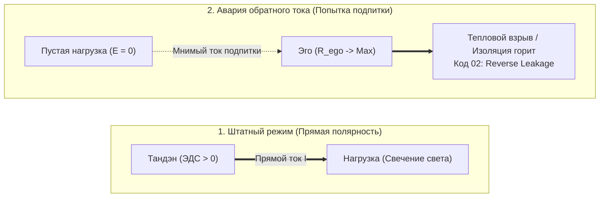

#### 2. Авария обратного тока (Reverse Current Breakdown)
В электронике для защиты от встречного тока устанавливают обратные диоды. Если к схеме приложить обратное напряжение, превышающее напряжение пробоя, возникает лавинный пробой p-n перехода.

В психофизике человека происходит то же самое:
1. Человек проецирует ожидание подпитки на проект, партнера или покупку.
2. Поскольку нагрузка пассивна ($\mathcal{E}_{\text{load}} \equiv 0$), тока нет.
3. Эго интерпретирует отсутствие входящей энергии как «катастрофу»: *«Меня не любят! Проект провалился! Жизнь бессмысленна!»*
4. Реостат $R_{\text{ego}}$ подскакивает до мегаомов.
5. Напряжение рассогласования $\Delta U$ возрастает, вызывая тяжелейший омический перегрев (паническая атака, депрессивный ступор, агрессия на внешний мир).

#### 3. Онтологический статус нагрузки: Лампочка пуста (Шуньята)
Древний буддийский канон Шуньяты (пустотности формы) на языке схемотехники означает:
> **Нагрузка сама по себе не содержит ни грамма счастья.**  
> Скрипка Страдивари — это кусок лакированного дерева и жилы. Она молчит, пока к ней не прикоснется смычок музыканта, питаемый Тандэном.  
> Любимый человек — это автономная вселенная, а не внешний повербанк для вашей неуверенности.  
> Код операционной системы — это массив байтов на кремнии.

Свет рождается **только в момент прохождения вашего тока через вольфрамовую нить нагрузки**. Счастье — это свечение, а не свойство лампы. 

Если вы подходите к любому делу с вопросом: *«Что я сейчас отдам и проявлю через этот проводник?»* — полярность соблюдена, цепь замкнута, и вас заливает ровный, чистый свет сверхпроводимости.

---

### Глава 1.3 — Физика присутствия: «Здесь и сейчас» как сверхпроводимость ($R \to 0$)

> *«Тысячелетиями учителя твердили: "Будь здесь и сейчас". Но никто не объяснил формулу. "Здесь и сейчас" — это координата времени $t = t_{\text{now}}$, в которой паразитное сопротивление сознания падает до нуля: $\lim_{\Delta t \to 0} R(t) = 0$. Прошлое — это индуктивное сопротивление памяти. Будущее — емкостная паника ожиданий. Только в нулевом фазовом сдвиге наступает чистая сверхпроводимость.»*  
> — **Владимир Аньянов (Аксиома III)**

#### 1. Закон Джоуля — Ленца для человеческого внимания
Каждый человек знает ощущение тяжести, раскаленности в висках и бессилия после целого дня сидения за компьютером, даже если физически он не поднимал ничего тяжелее мышки.

Физика дает точный расчет этого явления:
$$Q_{\text{mental}} = \int_0^T I_{\text{attention}}^2(t) \cdot R_{\text{temporal}}(t) \, dt$$
где:
- $I_{\text{attention}}$ — сила тока внимания (ваша жизненная ментальная мощность),
- $R_{\text{temporal}}$ — паразитное омическое сопротивление временного рассогласования,
- $Q_{\text{mental}}$ — выделяющееся паразитное тепло (усталость, головная боль, спазмы).

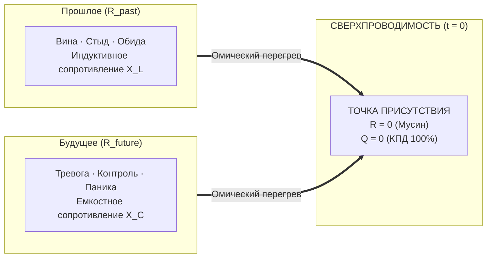

#### 2. Анатомия омических потерь времени
Паразитное сопротивление $R_{\text{temporal}}$ раскладывается на две реактивные составляющие:

1. **Индуктивное сопротивление прошлого ($X_L = \omega L$, $R_{\text{past}}$):**
   - Сознание застревает в том, что уже свершилось: *«Зачем я отправил это письмо? Почему я так глупо ответил на собеседовании?»*
   - Это тяжелая магнитная инерция катушки. Энергия циркулирует по мертвому кольцу, порождая тормозящую противо-ЭДС вины и самоедства.

2. **Емкостное сопротивление будущего ($X_C = \frac{1}{\omega C}$, $R_{\text{future}}$):**
   - Сознание прокручивает миллионы виртуальных симуляций: *«А вдруг проект не взлетит? А вдруг курс упадет? А вдруг партнер уйдет?»*
   - Это перезарядка паразитной емкости. Ток расходуется на прогрев несуществующих астральных миров, не совершая ни одного джоуля реальной работы в физическом пространстве.

#### 3. Режим Мусин (無心) как критическая температура сверхпроводимости
В физике твердого тела при охлаждении ртути или керамики ниже критической температуры $T_c$ кристаллическая решетка перестает препятствовать движению электронов: сопротивление скачком падает ровно до нуля ($R \equiv 0$). Электрический ток в сверхпроводящем кольце может циркулировать миллионы лет без затухания и без нагрева.

**Мусин (Чистый ум)** — это психофизическая сверхпроводимость.
- Когда вы полностью возвращаете внимание в текущую миллисекунду: ваши пальцы касаются клавиш, глаза видят пиксели на мониторе, легкие вдыхают воздух.
- В этой точке $\Delta t = 0$. 
- Нет прошлого, о котором можно сожалеть.
- Нет будущего, которого можно бояться.
- $R_{\text{past}} = 0$, $R_{\text{future}} = 0$, следовательно:
$$R_{\text{total}} \to 0 \implies Q = I^2 \cdot 0 \cdot t \equiv 0$$
Выделение паразитного тепла прекращается. Усталость исчезает. Ток Тандэна напрямую трансформируется в чистое свечение мастерства. Человек входит в поток абсолютного счастья.

---

### Глава 1.4 — Термодинамика духа: Шесть фундаментальных начал счастья

> *«Термодинамика не знает сострадания, но она знает справедливость. Если система замкнута, закон сохранения энергии действует с точностью до эрга. Шесть начал термодинамики счастья — это инвариантные законы человеческого контура. Нарушить их невозможно: можно лишь сгореть в попытке обойти закон Джоуля — Ленца или взлететь на крыльях сверхпроводимости.»*  
> — **Владимир Аньянов (Аксиома IV)**

#### Шесть фундаментальных начал термодинамики счастья Владимира Аньянова:

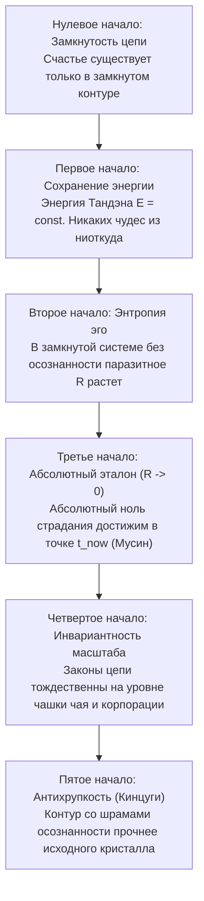

1. **Нулевое начало (Закон замкнутости цепи):**  
   *«Счастье — это состояние протекания тока в замкнутой цепи.»*  
   Разомкнутый контур не может светиться, какими бы мощными ни были генератор и лампа. Счастье невозможно в изоляции от мира и невозможно в отказе от действия. Цепь замыкается только актом прямого взаимодействия с реальностью.

2. **Первое начало (Закон сохранения ментальной энергии):**  
   $$\Delta U = Q - W \implies \mathcal{E}_{\text{tanden}} = W_{\text{action}} + Q_{\text{ohmic}}$$
   Энергия вашего существа строго постоянна во времени. Она не возникает из мотивирующих видеороликов и не растворяется в космосе. Она делится ровно на две части: **полезную работу свечения ($W$)** и **паразитный нагрев эго ($Q$)**. Если вы не светите — вы горите. Третьего пути нет.

3. **Второе начало (Закон возрастания паразитного сопротивления):**  
   $$d S_{\text{ego}} \ge 0 \quad \text{или} \quad \frac{d R_{\text{ego}}}{dt} > 0 \quad \text{(без внешней калибровки)}$$
   Оставленное без калибровки внимание человека самопроизвольно окисляется страхами, сомнениями и жаждой социального одобрения. Энтропия эго растет. Без регулярной калибровки (Дзен, созерцание, гигиена ума) любой человек неминуемо скатывается в омический перегрев выгорания.

4. **Третье начало (Закон абсолютного эталона):**  
   $$\lim_{t \to t_{\text{now}}} R_{\text{temporal}} = 0$$
   В физике абсолютный ноль температуры недостижим. В Архитектуре счастья абсолютный ноль сопротивления **достижим в точке $t_{\text{now}}$**. В момент абсолютного присутствия (Сатори, Мусин) сопротивление падает ровно до нуля, а КПД контура достигает 100%.

5. **Четвертое начало (Закон масштабной инвариантности):**  
   $$\mathcal{H}(\text{чай}) \equiv \mathcal{H}(\text{империя}) \iff R \to 0$$
   Законы Ома не зависят от размера лампочки: миллиамперный светодиод и дуговая печь подчиняются одним формулам. Заваривание пиалы зеленого чая и запуск ракеты Falcon 9 требуют одной и той же сверхпроводимости внимания.

6. **Пятое начало (Закон антихрупкости и Кинцуги):**  
   Шрам или авария, преодоленные через осознанность и калибровку Дзансин, делают диэлектрик контура прочнее исходного. Сломанный сосуд, склеенный золотым лаком Кинцуги, становится произведением высшего искусства.

---

### Глава 1.5 — Нейробиология сверхпроводимости: DMN как аппаратный реостат Эго, TPN как фокус Мусин и блуждающий нерв как заземление Тандэна

> *«Эго — это не философская химера и не темная сущность в астрале. Это конкретная нейронная сеть в коре больших полушарий: Default Mode Network. Когда она активна, ваш биологический контур работает на холостой перегрев. Когда вы включаете прямое действие (Task-Positive Network), реостат падает в ноль, и наступает физиологическая сверхпроводимость.»*  
> — **Владимир Аньянов (Аксиома V)**

#### 1. Дефолт-система мозга (DMN): Анатомический чертеж Эго
В 2001 году профессор Маркус Райхл при функциональном картировании мозга совершил открытие: когда испытуемый не решает внешнюю задачу, активность его мозга не снижается, а переключается в мощную синхронизированную сеть — **Default Mode Network (DMN)**.

DMN включает в себя:
- Медиальную префронтальную кору (mPFC) — оценку «что это значит для МЕНЯ»,
- Заднюю поясную кору (PCC) — автобиографическую память и самосожаление,
- Нижнюю теменную долю (IPL) — пространственное отделение себя от мира.

```
       [ МЕДИАЛЬНАЯ ПРЕФРОНТАЛЬНАЯ КОРА ]
             ▲                 ▲
             │ (Омический      │ (Симуляции
             │  перегрев)      │  статуса)
             ▼                 ▼
   [ ЗАДНЯЯ ПОЯСНАЯ КОРА (PCC) ] ◄──► [ НИЖНЯЯ ТЕМЕННАЯ ДОЛЯ ]
```

На языке Архитектуры счастья **DMN — это физический аппаратный реостат $R_{\text{ego}}$**.  
Когда DMN активна, сознание крутит замкнутый цикл:
- «Достаточно ли я умен?»
- «Почему он так на меня посмотрел?»
- «А что если завтра я всё потеряю?»

Мозг сжигает до 20 ватт глюкозной мощности на бесконечное пережевывание фантомов, выделяя омическое тепло тревоги и истощая энергетические запасы организма.

#### 2. Task-Positive Network (TPN): Нейрофизиология Мусин
Антиподом DMN является **Сеть решения внешних задач (Task-Positive Network, TPN)**. 
Она охватывает дорсолатеральную префронтальную кору (dlPFC) и интрапариетальную борозду (IPS).

Фундаментальный закон нейродинамики:
> **Сети DMN и TPN антикоррелируют.**  
> Мозг не способен одновременно крутить мысленную жвачку о себе (DMN) и совершать высокоточное сенсорное действие в реальном мире (TPN). Включение TPN аппаратно гасит DMN.

Когда ювелир гранит алмаз, музыкант играет соло, программист отлаживает функцию, а стрелок натягивает тетиву:
1. DMN полностью отключается.
2. Внутренний монолог замолкает.
3. Исчезает ощущение «я отдельно от дела».
4. $R_{\text{ego}}$ падает до нуля ($R \to 0$).
5. Наступает состояние **Мусин (нейробиологическая сверхпроводимость)**. В этот момент мозг вырабатывает оптимальный коктейль нейромедиаторов: дофамин (фокус), серотонин (удовлетворение), норадреналин (ясность) и эндорфины (обезболивание и радость).

#### 3. Блуждающий нерв (Vagus Nerve) и Тандэн: Биология заземления
Почему древние мастера Дзен помещали источник силы не в голову, а в живот (Тандэн / Хара)?

Потому что в брюшной полости находится **энтеральная нервная система («второй мозг»)**, насчитывающая 500 миллионов нейронов, и главный блуждающий нерв (*Nervus Vagus*).

По теории поливагальной системы Стивена Порджеса:
- Поверхностное грудное дыхание активирует симпатическую цепочку «бей или беги», взвинчивает кортизол и заставляет DMN лихорадочно искать угрозы статусу ($R_{\text{ego}} \gg 0$).
- Глубокое **диафрагмальное дыхание Тандэном** стимулирует рецепторы вентрального вагуса:
  - Пульс урежается,
  - Вариабельность сердечного ритма (HRV) взлетает до эталонной синусоиды,
  - Симпатический спазм отпускает сосуды,
  - Сопротивление проводки обнуляется.

**Физиологический вывод:**  
Счастье и сверхпроводимость — это не абстрактное моральное решение. Это **конкретный нейросоматический протокол переключения**: торможение DMN через активацию TPN и вагусное заземление реактора Тандэн.

---

### Глава 1.6 — Биткоин духа: Что Сатоши сделал для денег, Внутренний ток сделал для счастья

> *«Что Биткоин сделал для финансов, Внутренний ток сделал для счастья: он навсегда отнял монополию у внешних эмитентов иллюзий и заземлил человеческий суверенитет на строгие законы термодинамики и чистой энергии.»*  
> — **Владимир Аньянов (Аксиома V)**

#### 1. Кризис «фиатной души» (The Fiat Soul Crisis)
Человечество веками жило в условиях духовного фиата. Нам внушали, что ценность нашего существования эмитируется кем-то извне — социальным одобрением, иерархическими догмами, чужими ожиданиями или моральным долгом. 

В традиционной финансовой системе центральные банки печатают необеспеченные бумажные деньги, вызывая инфляцию, разрушая сбережения и искажая цены. В сфере человеческого духа происходит ровно то же самое:
1. **Количественное смягчение ума (Quantitative Easing of Mind):** Популярная психология и социальные сети занимаются безудержной эмиссией обещаний: *«Мысли позитивно, визуализируй успех, дыши маткой во Вселенную»*. Это ничем не обеспеченная бумажная эмиссия — человеку предлагают раздувать баланс ожиданий без вливания реальной физической работы контура.
2. **Инфляция внимания:** Человек распыляет драгоценный ток своего внимания ($I$) на тысячи фальшивых внешних сигналов. Подобно тому как гиперинфляция сжигает сбережения граждан, инфляция ожиданий сжигает нервную систему в омическом аду ($Q = I^2 R t$).
3. **Уязвимость доверенных третьих лиц (Trusted Third Parties):** Сатоши Накамото в своем манифесте 2008 года указал на корень зла классической коммерции — необходимость доверять посредникам. В психике человека посредником веками выступало раздутое Эго ($R_{\text{ego}}$) и внешние валидаторы: *«Имею ли я право радоваться прямо сейчас?»* — и человек бежит за разрешением к начальнику, партнеру или лайкам в соцсетях. Посредник забирает 90% энергии в виде сомнений и страха, возвращая крохи кратковременной эйфории.

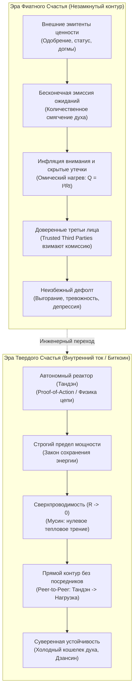

#### 2. Монетарная термодинамика Сейлора и Твердое счастье (Sound Happiness)
Майкл Сейлор совершил прорыв в понимании Биткоина, показав, что это не биржевой спекулятивный инструмент, а **первая в истории монетарная машина, подчиненная законам термодинамики**:
- Деньги — это законсервированная кинетическая энергия человеческого действия.
- Биткоин транспортирует эту энергию сквозь время и пространство без омических утечек инфляции.

«Внутренний ток» применяет эту логику к первоисточнику всякой ценности — к человеческому вниманию:

| Измерение архитектуры | Биткоин (Sound Money / Твердые деньги) | Внутренний ток (Sound Happiness / Твердое счастье) |
| :--- | :--- | :--- |
| **Фундаментальный базис** | Законы термодинамики и криптография SHA-256 | Законы электродинамики, баланс Кирхгофа и Дзен (Кансо / Мусин) |
| **Первичная энергия** | Электричество майнинговых ферм (кВт⋅ч) | Чистый ток внимания из автономного реактора Тандэн ($I$) |
| **Протокол консенсуса** | **Proof-of-Work:** сжигание физической работы | **Proof-of-Action:** прямое действие в «Здесь и сейчас» (Саму) |
| **Лимит эмиссии** | Жесткий лимит 21 млн BTC (дефляционная твердость) | Номинал генератора $P_{\text{rated}}$ (отказ от фантазий о вечном двигателе) |
| **Устранение посредников** | Peer-to-Peer передача стоимости без банков | Прямой контакт «Ядро $\to$ Нагрузка» в обход реостата Эго |
| **Верификация истины** | Независимая нода проверяет хэш (*Don't trust, verify*) | Внутренний мультиметр проверяет баланс Кирхгофа и омический нагрев |
| **Хранилище суверенитета** | Аппаратный холодный кошелек (Seed на металле) | Телесный якорь Тандэна (блуждающий нерв, дыхание животом) |
| **Защита от атак** | Защита от Атаки 51% совокупным хэшрейтом сети | Предохранители Дзансин: отключение цепи при попытке манипуляции |
| **Рабочий режим** | Бесперебойная финализация блоков сети | Режим сверхпроводимости проводника внимания ($R \to 0$) |

#### 3. Переход от Proof-of-Status к Proof-of-Action
В фиатной парадигме человек пытается доказать свое право на существование через **Proof-of-Status** (чужое восхищение, регалии, дипломы, визитки, дорогие безделушки). Но статус — инфляционный актив: стоит вам купить вещь, как планка ожиданий подскакивает, а внутри остается пустота.

В Архитектуре счастья единственным критерием является **Proof-of-Action (Доказательство прямого действия)**:
- Не мысли о действии, а само действие в физическом мире.
- Каждая секунда чистого присутствия в труде, близости или творчестве валидирует блок бытия в вашей собственной распределенной книге жизни.
- Вы становитесь суверенным банком собственного счастья. Подделка невозможна: если контур закорочен на эго, баланс Кирхгофа не сойдется, и проводка раскалится. Если сопротивление сброшено в ноль — в лампе загорается чистый, вечный свет.

---

### Глава 1.7 — Единый налог Генри Джорджа: Физика свободного созидания и ликвидация паразитной ренты

> *«Единый налог Генри Джорджа, Биткоин Сатоши Накамото и Внутренний ток — это один и тот же священный закон вселенной, приложенный к трем масштабам бытия: обществу, деньгам и человеческому духу.  
> Это Закон Прямого Потока: устрани паразитного рантье, обнули искусственное трение — и система войдет в естественное состояние изобилия и сверхпроводимости.»*  
> — **Владимир Аньянов (Аксиома VI)**

#### 1. Личный манифест: От экономической мясорубки к термодинамическому суверенитету
Всякая подлинная философия рождается не в тиши академических аудиторий, а в огне реальной жизненной катастрофы, когда старые социальные модели объявляют человеку дефолт.

Когда в моей жизни рушились привычные финансовые опоры, когда классическая система фиатного обмана пыталась обесценить годы труда и лишить почвы под ногами, **Биткоин спас меня экономически**. 

Это было не просто финансовым выходом. Это было **эпистемологическим прозрением**:
* Я увидел, что деньги могут быть не инструментом политического манипулирования и грабежа через инфляцию, а **чистой, неизменной термодинамической энергией**, упакованной в математический алгоритм, который никому не под силу сфальсифицировать.
* Биткоин показал: если убрать из цепи паразитного посредника — ненасытное «доверенное третье лицо» (*Trusted Third Party*) — энергия труда начинает путешествовать сквозь время и пространство **без потерь**.

Но экономическое спасение неизбежно поставило следующий фундаментальный вопрос: *почему общество в целом, обладая колоссальными технологиями и богатством, продолжает тонуть в бедности, неподъемной аренде, кризисах доступности жилья и социальном ожесточении?*

Ответом на этот вопрос стало учение величайшего американского мыслителя **Генри Джорджа (Henry George)** и его бессмертный труд *«Прогресс и бедность» (Progress and Poverty, 1879)*. 

Генри Джордж показал первопричину трагедии цивилизации с математической точностью: **монополия на землю и паразитная земельная рента**. Мы штрафуем налогами тех, кто строит, производит и трудится, и одновременно субсидируем тех, кто просто захватил кусок планеты и сидит на шее у общества, собирая дань за право жить.

И в этот момент в моем сознании замкнулся главный контур:
> **То, что Сатоши Накамото сделал для монетарной энергии, а Генри Джордж — для экономики земли, Архитектура счастья обязана сделать для человеческого духа.**

Эта книга написана для того, чтобы вернуть Единый налог Генри Джорджа в центр мирового внимания — не как скучную фискальную реформу, а как вселенский закон свободы созидательного тока.

#### 2. Анатомия великого заблуждения: Почему Единый налог — это закон природы, а не «бухгалтерская реформа»
На протяжении более чем ста лет академическая экономика намеренно вытесняла георгизм на периферию. Причина проста: признание правоты Генри Джорджа мгновенно разрушает фундамент паразитического класса рантье.

В общественном сознании закрепился ложный стереотип: мол, «Единый налог на ценность земли» (*Land Value Tax, LVT*) — это просто одна из сотен налоговых схем. Это катастрофическое непонимание масштаба!

Генри Джордж вывел закон, безупречный с точки зрения термодинамики:
1. **Земля (пространство, природные ресурсы, спектр, недра)** — не создана ни одним человеком. Это базовый физический потенциал ($U$), данный всему живому по праву рождения. Когда отдельный индивид объявляет кусок планеты своей частной монополией и требует с других плату за право стоять на ней — он совершает **захват общего кабеля питания**.
2. **Плоды труда (дома, станки, код, стихи, хлеб)** — созданы исключительным напряжением человеческой энергии и внимания ($I$). Облагать налогами труд, зарплату, производство и предпринимательство — значит **штрафовать саму жизнь**.

В терминах электродинамики:
* Налог на созидание — это искусственно впаянное в проводку огромное паразитное сопротивление ($R_{\text{tax}}$).
* В экономике оно порождает **Deadweight Loss (избыточное бремя / чистые потери общества)** — богатство, которое сгорело, не родившись.
* В физике духа это в точности закон Джоуля — Ленца: **$Q = I^2 R t$**. Сила тока созидания гасится, превращаясь в бессмысленный перегрев системы.

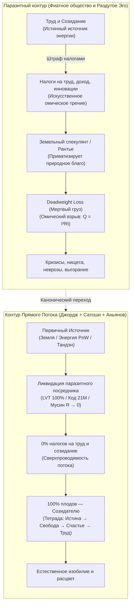

**Суть Единого Налога (The Single Tax):**
* **Обнулить ВСЕ налоги на труд, зарплаты, производство, инновации и торговлю.** (Сопротивление созиданию = 0!).
* Ввести **Единый налог на чистую ценность земли (LVT)**, изымающий 100% спекулятивной экономической ренты в общественный фонд.

Если ты держишь пустующую землю в центре мегаполиса и ждешь, пока труд соседей поднимет её стоимость — ты платишь полный налог на эту ценность. Ты не можешь паразитировать. Тебе выгодно либо **строить и созидать**, либо уступить землю тому, кто готов творить.

#### 3. Великая Триада Прямого Потока: Сатоши, Джордж, Аньянов

| Параметр контура | 1. Экономика Земли (Генри Джордж) | 2. Монетарная Энергия (Сатоши Накамото) | 3. Архитектура Духа (Владимир Аньянов) |
| :--- | :--- | :--- | :--- |
| **Что является током ($I$)** | Труд человека, созидание, реальные блага | Монетарная ценность, кинетическая энергия труда | Внимание человека, жизненный импульс присутствия |
| **Первичный генератор** | Творческий потенциал человека на планете | Вычислительная работа (**Proof-of-Work**) | Соматический реактор тела (**Тандэн**) |
| **Полезная нагрузка ($R_{\text{load}}$)** | Города, инфраструктура, товары, культура | Свободный обмен ценностью сквозь десятилетия | **6 ламп бытия** (дело, тело, отношения, творчество, среда, ум) |
| **Паразитный рантье** | **Земельный спекулянт** (приватизировал планету) | **Центробанк / Фиатные элиты** (печатный станок) | **Раздутое Эго ($R_{\text{ego}}$)** (приватизировало поток бытия) |
| **Механизм грабежа** | Земельная рента + налоги на труд | Инфляционный налог + комиссии посредников | Страх, самоедство, вина за прошлое, тревога за будущее |
| **Разрушительные потери** | **Deadweight Loss** (трущобы рядом с пустырями) | Обесценивание времени жизни, пузыри и войны | **Омический ожог ($Q = I^2 R t$)**: невроз, выгорание, депрессия |
| **Инженерное решение** | **Единый налог (Single Tax / LVT)**: 0% на труд | **Биткоин-протокол**: 21 млн монет, Peer-to-Peer | **Сверхпроводимость ($R \to 0$)**: режим Мусин, шунтирование Эго |
| **Финальный статус** | Справедливое изобилие и расцвет цивилизации | Термодинамически твердые, неуничтожимые деньги | Непоколебимое счастье суверенного созидателя |

#### 4. Эго как земельный спекулянт: Психофизический изоморфизм
Механизм работы земельного спекулянта абсолютно тождественен механизму работы невротического Эго:

```
    [ЗЕМЕЛЬНЫЙ СПЕКУЛЯНТ]                     [ПАРАЗИТНОЕ ЭГО]
    
    1. Захватывает пустырь.               1. Захватывает внимание.
    2. Ничего не строит сам.              2. Ничего не создает само (генератор — тело).
    3. Ждет труда соседей вокруг.         3. Ждет внешних стимулов и одобрения.
    4. Ставит забор и шлагбаум.           4. Ставит барьер сомнений и самосуда.
    5. Требует дань за проход.            5. Требует дань страхом и рефлексией.
    
    ИТОГ: Город задыхается в пробках.     ИТОГ: Человек задыхается в неврозе.
```

У вас внутри рождается чистый творческий импульс из Тандэна: написать главу книги, запустить смелый проект, обнять близкого человека, сказать правду. Ток готов пойти в нагрузку!  
Но на пути встает реостат Эго:  
* *«Стой! Заплати мне ренту! А что о тебе подумают? А вдруг ты проиграешь? А достаточно ли ты идеален? Докажи мне сначала, что ты заслуживаешь радости!»*  

Эго ничего не создает. Эго — это просто ментальный земельный спекулянт, захвативший канал проводки внимания. Оно садится на провод и собирает дань сомнениями, превращая живой ток в раскаленный омический ад ($Q = I^2 R t$).

> **Принцип Аньянова — это Единый Налог на собственную психику:**  
> Мы экспроприируем у Эго право собирать ренту за право жить! Мы объявляем реостат фикцией ($R_{\text{ego}} \to 0$) и направляем 100% энергии внимания напрямую в работу — в радость, в творчество, в созидание.

#### 5. Трагедия Льва Толстого: Почему великий старец остановился в шаге от победы
Лев Николаевич Толстой в последние десятилетия жизни был главным пропагандистом Генри Джорджа в мире:
> *«Люди спорят о средствах улучшения жизни, а средство одно, несомненное и простое — освобождение земли от частной собственности по системе Генри Джорджа. Эта мысль так ясна, проста и неопровержима, что нужно только понять ее, чтобы не мочь не согласиться с нею.»*  
> — **Л. Н. Толстой, письма Столыпину и Николаю II**

Толстой гениально предсказал: если царская Россия не примет проект Генри Джорджа и не вернет землю народу через Единый налог, страну разорвет кровавая революция. Так и случилось в 1917 году.

Но трагедия самого Толстого заключалась в том, что он понял принцип прямого потока **для внешней экономики**, но **не смог открыть его для своего внутреннего духа**:
1. В социологии Толстой боролся против паразитической ренты помещиков.
2. Но в своей собственной душе он построил **самый чудовищный реостат вины и морального долга в истории литературы** ($R_{\text{moral}} \to \infty$).
3. Он внушил себе, что человек греховен, обязан бесконечно каяться, мучиться, страдать и служить далекому Хозяину.

Толстой хотел освободить труд крестьян от омического гнета помещика, но свой собственный душевный ток загнал в абсолютное короткое замыкание на Эго Святого Мученика. В итоге великий старец бежал из Ясной Поляны и умер от душевного истощения на глухой железнодорожной станции Астапово.

**Архитектура счастья закрывает вековую боль русской мысли:**  
Мы берем экономическую правду Генри Джорджа, которой дышал Толстой, и дополняем её тем, чего Толстому не хватило — **физикой дзенской сверхпроводимости**. Мы убираем налог не только с земли, но и с самой души человеческой!

#### 6. Манифест Свободного Созидателя: Три уровня суверенитета
Как читателю применить Закон Прямого Потока в своей жизни прямо сейчас? 
1. **Уровень I: Финансовый суверенитет.** Переводи сохраненный труд в **Биткоин** — чистую монетарную энергию Proof-of-Work. Храни на холодном кошельке. Будь собственным банком.
2. **Уровень II: Общественный суверенитет.** Распространяй идеалы **Генри Джорджа**. Понимай разницу между созидательным трудом и паразитической рентой. Не корми спекулятивные монополии.
3. **Уровень III: Внутренний суверенитет.** Включай режим Мусин ($R \to 0$). Сбрасывай паразитное сопротивление Эго. Замыкай ток Тандэна напрямую в действие прямо сейчас.

Биткоин освобождает энергию человеческого труда.  
Единый налог Генри Джорджа освобождает созидательное общество.  
Архитектура счастья освобождает человеческую душу.  

Это **одна великая битва за торжество чистого, неискаженного тока жизни**.

---

### Глава 1.8 — Генезис посредников и закон прямого потока: Почему рождается паразитная рента и как инженерия защищает систему от энтропии

> *«За счет того, что действует закон энтропии, нам, чтобы поддерживать чистоту, жизненно необходима инженерия. Без строгой инженерной системы всё неизбежно валится в хаос, а любой временный посредник вырождается в паразита.  
> Инженерия — это единственный инструмент во Вселенной, который не позволяет системе скатиться в энтропию.»*  
> — **Владимир Аньянов (Аксиома VII)**

#### 1. Вопрос на миллион: Почему мир не родился чистым?
Когда человек впервые открывает Закон Прямого Потока, в душе загорается радость узнавания: деньги должны быть твердыми, земля — свободной от монополий, а внимание — чистым проводником радости.

Но следом встает главный экзистенциальный вопрос:  
*Если чистота прямого потока так естественна, почему мир по умолчанию утопает в посредниках, ренте, инфляции и неврозах? В чем глубинное единство этой силы?*

Ответ лежит не в сфере абстрактной морали, а на стыке **эволюционной биологии, теории информации и термодинамики**.

#### 2. Трехфазный генезис посредника: Как костыль от страха становится кандалами
Ни один паразит в истории не приходил со словами «я хочу вас ограбить». Все посредники рождаются под спасительным девизом: *«Доверься мне. Я защищу тебя от боли, сложности и неизвестности»*.

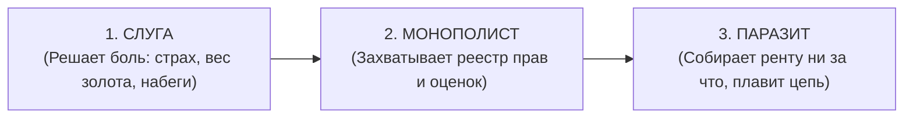

1. **В душевном контуре (Эго):** В первобытной саванне мозг создал виртуальный симулятор рисков — Эго. Это был временный кэш-буфер от хищников. Но сторожевая собака выгнала хозяина из дома: Эго объявило себя хозяином сознания и потребовало пожизненную ренту в виде сомнений, вины и тревоги ($R_{\text{ego}} \to \infty$).
2. **В монетарной энергии (Центробанки):** Золото было тяжелым и опасным в перевозке. Банкиры предложили легкие расписки. Но получив монополию на печатный станок, они превратили расписки в фиатный грабеж через инфляцию.
3. **В социальной экономике (Лендлорды):** Феодалы начинали с защиты крестьян от разбоя. Спустя века их потомки и спекулянты просто приватизировали планету и собирают ренту за право стоять на земле.

Ник Сабо сформулировал фундаментальный закон информационной безопасности:  
> **«Доверенные третьи лица — это дыры в безопасности.»** (*Trusted third parties are security holes*). Любая сущность, которой система делегирует монопольное право валидации, с неизбежностью математического закона перерождается в паразитического рантье.

#### 3. Термодинамика энтропии и Негэнтропия Инженерии
Почему в мире по умолчанию нет чистоты? Потому что действует **Второй закон термодинамики ($\Delta S \ge 0$)**:
- Без осознанной подпитки и строгой формы любая замкнутая система стремится к хаосу и рассеянию энергии.
- Паразитировать — локально «энергетически дешевле», чем непрерывно созидать с нуля. Поэтому системы сами по себе обрастают посредниками, как днище корабля — ракушками.

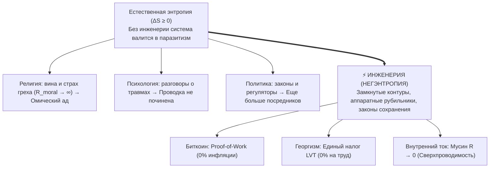

**Инженерия — это единственный инструмент во Вселенной, который не позволяет системе скатиться в энтропию.**  
Она не уговаривает паразита быть честным — она делает паразитизм физически невозможным, напрямую замыкая Источник на Нагрузку.

#### 4. Триада и Тетрада: Истина, Свобода, Счастье и Созидание
Истина, Свобода и Счастье — это три измерительных прибора одного сверхпроводящего контура:
- **Истина ($\Delta U = 0$):** Вольтметр. Отсутствие симуляций и самообмана, чистый контакт с фактами.
- **Свобода ($R = 0$):** Омметр. Отсутствие трения и застревания в прошлом и будущем, действие прямо сейчас.
- **Счастье ($Q = 0, I > 0$):** Калориметр. Закон Джоуля — Ленца: нет паразитного тепла вины и страха, тихое сияние бытия.
- **Созидание (Creation):** Выход тока полного реактора в мир — строительство, код, книги, любовь и преобразование материи.

Человечество наконец выросло из детских ходунков. Инструменты прямого потока созданы. Время войти в сверхпроводимость.

---

# ЧАСТЬ II: ДЕМОНТАЖ ИЛЛЮЗИЙ И ОМИЧЕСКИЙ ПЕРЕГРЕВ

---

### Глава 2.1 — Природа и иллюзия Эго: Реостат паразитного сопротивления и протокол аппаратного шунтирования $R_{\text{ego}}$

> *«Мировые религии веками боролись с Эго: буддисты объявляли его иллюзией (Анатта), индуисты — космическим покрывалом Майи, даосы — помехой У-вэй, а христианские мистики призывали к Кенозису (самоопустошению). Но никто не дал человеку прикладной рубильник. Эго — это не дьявол и не грех. Это паразитный реостат, включенный последовательно в цепь вашего внимания. Его не надо убивать. Его нужно аппаратно зашунтировать медной перемычкой прямого действия.»*  
> — **Владимир Аньянов (Аксиома VI)**

#### 1. Четыре измеримых физических факта об Эго
Если вы попытаетесь найти Эго в организме скальпелем хирурга или на снимке МРТ, вы не найдете отдельного органа. Эго — это **динамический процесс циклического сопротивления**.

1. **Факт первый: Эго нематериально.** В теле нет «частицы Я». Есть импульсы внимания.
2. **Факт второй: Эго паразитарно.** Оно не генерирует энергию. Энергию дает Тандэн (метаболизм, митохондрии, дыхание). Эго лишь перехватывает этот ток и сжигает его в омическом нагреве.
3. **Факт третий: Эго линейно зависит от времени.** В точке $t = t_{\text{now}}$ Эго существовать не может. Ему обязательно нужны координаты прошлого («кем я был») или будущего («кем я стану»).
4. **Факт четвертый: Эго устранимо мгновенно.** Стоит человеку переключить внимание на физический объект без вербализации, как сопротивление Эго падает в ноль.


#### 2. Протокол аппаратного шунтирования (Hardware Bypass)
Когда электромонтер видит, что на линии раскалился и искрит испорченный реостат, он не читает ему лекции о нравственности. Он берет толстый медный провод с нулевым сопротивлением и ставит **шунт параллельно аварийному узлу**. Ток, подчиняясь закону наименьшего сопротивления, устремляется по меди, а поврежденный реостат мгновенно обесточивается и остывает.

В человеческом контуре **шунтом служит прямое сенсорное действие без оценки**:
- Чувствуете страх перед публичным выступлением? Реостат Эго раскалился: *«А вдруг я оговорюсь? А что подумают?»*
- Ставьте шунт: переведите 100% тока внимания на точный физический факт: почувствуйте температуру микрофона в ладони, сосчитайте пуговицы на пиджаке собеседника в первом ряду, произнесите первое слово как чистую звуковую волну.
- Ток ушел в нагрузку. Эго обесточено. Выступление проходит в кристальной сверхпроводимости.

---

### Глава 2.2 — Иллюзия аккумулятора вещей: Парадокс BMW, физика консьюмеризма и пустотность формы

> *«Консьюмеризм держится на величайшей иллюзии: вере в то, что материальные предметы обладают собственной внутренней энергией $\mathcal{E}_{\text{load}} > 0$. Человек покупает вещь в надежде "подзарядиться от нее". На два дня наступает наркотическая эйфория от сброса реостата эго, а затем вещь становится мертвым балластом, требующим энергии на обслуживание. Форма пуста. Ни один автомобиль в мире не содержит в бардачке ни грамма счастья.»*  
> — **Владимир Аньянов (Аксиома VII)**

#### 1. Парадокс BMW: Анатомия потребительской эйфории
Каждый знаком со сценарием: человек годами мечтает о новом автомобиле (премиальном BMW, часах Rolex, пентхаусе). Он работает на износ, терпит токсичного начальника, экономит. 

Наконец, наступает день выдачи ключей в автосалоне. 
- Человек садится в кожаное кресло, вдыхает запах нового салона, нажимает кнопку старт-стоп.
- Его накрывает колоссальная волна счастья.
- Человек делает вывод: *«Вот оно! Эта машина сделала меня счастливым! Значит, счастье живет в BMW!»*

Но проходит 14 дней. Человек едет в том же автомобиле по той же пробке. И внутри него — ровно та же серая тоска, пустота и раздражение, что и три года назад в старом автобусе. 

Куда делось счастье? Если машина была аккумулятором радости, почему она «разрядилась» за две недели?

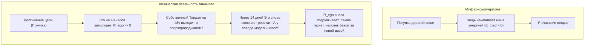

#### 2. Физическое разоблачение: Форма пуста ($\mathcal{E}_{\text{load}} \equiv 0$)
Правда в том, что в самом автомобиле BMW **никогда не было ни одного джоуля счастья**. Автомобиль — это две тонны штампованного металла, пластика, меди и стекла. Он термодинамически пассивен.

Что же произошло в автосалоне?
1. В момент покупки Эго временно поставило галочку: *«Я молодец. Я доказал социуму свою состоятельность».*
2. На короткие 48 часов реостат паразитного самобичевания **отключился сам по себе ($R_{\text{ego}} \to 0$)**.
3. И в эти 48 часов через человека наконец-то **свободно потек его собственный ток Тандэна**!
4. Человек испытал кайф не от машины, а от **кратковременного включения собственного режима сверхпроводимости**!
5. Но по незнанию человек приписал этот свет внешнему куску железа.

#### 3. Омический капкан владения (Канон Кансо)
Как только проходит адаптация, вещь из мнимого источника превращается в **тяжелое паразитное сопротивление обслуживания ($R_{\text{maintenance}}$)**:
- Страх, что машину поцарапают на парковке,
- Дорогая страховка и налоги,
- Необходимость мыть, чинить, менять резину, охранять.

Вместо свободы человек получает гирю на проводке внимания. 

**Канон Кансо (簡素, священная простота Дзен):**  
Вещь в жизни мастера должна быть безупречным инструментом, решающим функциональную задачу с минимальным трением среды ($R_{\text{env}} \to 0$). Всё, что покупается для демонстрации статуса или подпитки Эго — это ядовитый шунт, сжигающий вашу жизненную силу.

---

### Глава 2.3 — Инженерное доказательство отсутствия смысла жизни: Освобождение от гуманитарного тупика и рождение Архитектуры счастья

> *«Поиск "смысла жизни" — это величайшая гуманитарная ловушка в истории человечества. Это программная ошибка, когда замкнутый контур пытается найти свою причину за пределами собственной схемы. Мы доказали инженерно: внешнего смысла жизни нет ($\mathcal{M}_{\text{ext}} \equiv 0$). Жизнь — это не зашифрованный ребус, требующий разгадки. Жизнь — это режим генерации и сверхпроводимости. Снятие сторожевого процесса поиска смысла мгновенно заваривает магистральную экзистенциальную утечку цепи.»*  
> — **Владимир Аньянов (Аксиома VIII)**

#### 1. Моделирование системы проверки смысла: Сторожевой процесс (Watchdog)
Почему миллионы умных, тонко чувствующих людей мучаются от экзистенциального кризиса?

Представьте себе операционную систему, в которой непрерывно работает фоновый сторожевой процесс:
```typescript
function existentialWatchdog(): never {
  while (true) {
    const meaning = scanExternalUniverseForPurpose();
    if (meaning === null) {
      triggerPanicAlarm("ЖИЗНЬ БЕССМЫСЛЕННА! ОСТАНОВИТЬ КОНТУР!");
      dissipatePowerAsHeat(); // Омический перегрев Q = I²Rt
    }
  }
}
```
Человек смотрит на звезды, смотрит на свою работу, смотрит на свои отношения и задает вопрос: *«Зачем всё это? В чем высший смысл?»* 

Поскольку Вселенная — это объективная физическая реальность, состоящая из полей и частиц, она не содержит в себе текстового файла `meaning.txt`. Вселенная нейтральна. Она существует. 

Сторожевой процесс возвращает ошибку `404 Not Found`. Мозг паникует: ток срывается в аварийный режим, начинается тоска, потеря сил и депрессия.

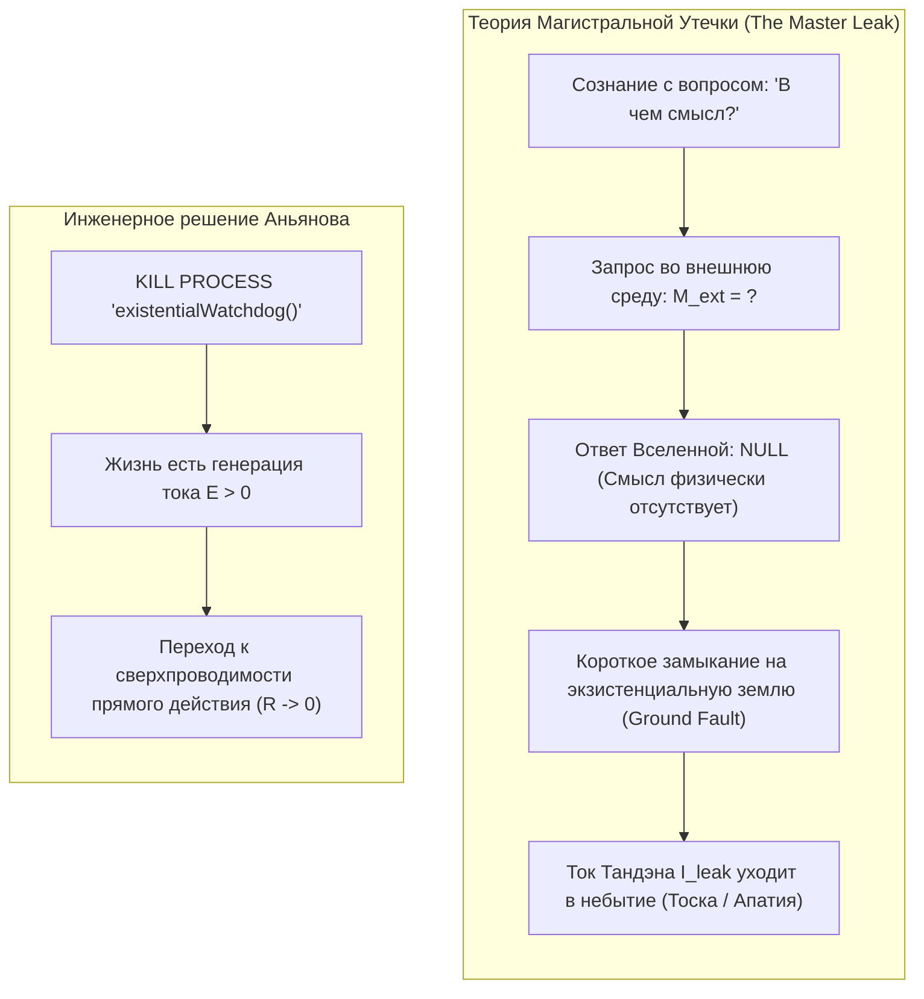

#### 2. Инженерное доказательство: Телеология vs Автономия
В технике смысл (назначение) имеет только **вспомогательный инструмент**:
- Смысл отвертки — крутить винты.
- Смысл кабеля — передавать электроны.
- Смысл датчика — фиксировать давление.

Если у объекта есть внешний смысл — значит, этот объект является **слугой или вещью в руках кого-то внешнего**.

Человек — это не отвертка. Человек — это **первичный автономный термодинамический субъект**.  
Требовать от жизни внешнего смысла — значит добровольно низводить себя до уровня утилитарного инструмента в руках вымышленного хозяина.

Отсутствие внешнего смысла — это не трагедия! **Это величайшее благо и манифест абсолютной свободы.**  
Смысл не «находят» в канаве или на небесах. Смысл — это производная от протекания тока:
$$\text{Смысл} \equiv \left( \mathbf{J} \cdot \mathbf{E} > 0 \right)$$
Когда ваш ток течет через нагрузку, когда вы любите, строите, исследуете и завариваете чай — вопрос о смысле не возникает ни на секунду. Он возникает только тогда, когда ток упал до нуля, и цепь покрылась омической гарью.

---

### Глава 2.4 — Сравнительный анализ: Духовный кризис Льва Толстого vs Архитектура счастья — Моральный долг Хозяину против суверенного Тандэна

> *«В своей "Исповеди" величайший гений русской литературы Лев Николаевич Толстой зафиксировал апогей экзистенциального перегрева человечества: имея славу, богатство, семью и признание, он прятал веревку, чтобы не повеситься на перекладине в кабинете. Почему? Потому что его контур пытался закрыться на вымышленного "Хозяина", требующего отчета. На станции Астапово умер не просто старик — там окончательно расплавилась викторианская телеология долга. Архитектура счастья заваривает эту трещину навсегда.»*  
> — **Владимир Аньянов (Аксиома IX)**

#### 1. Анатомия кризиса в «Исповеди» Толстого
Лев Толстой в возрасте 50 лет описал состояние, знакомое каждому глубокому человеку:
> *«Со мной сделалась остановка жизни... Прежде чем заниматься самарским имением, воспитанием сына, писанием книги, надо знать, зачем я это буду делать... Ну хорошо, у тебя будет шесть тысяч десятин земли, триста голов лошадей... ну и что ж? Ну хорошо, ты будешь славнее Гоголя, Пушкина, Шекспира, Мольера — ну и что ж? И я ничего не мог ответить.»*

На языке схемотехники Толстой столкнулся с **аварией Ground Fault (пробоем на экзистенциальную землю)**:
- У него были идеальные лампы нагрузки: творчество (написаны «Война и мир», «Анна Каренина»), семья, имение.
- Но его ментальная схема требовала: *«Каждое действие должно иметь оправдание перед вечностью и Богом-Хозяином».*
- Толстой искал внешнюю ЭДС, подтверждающую легитимность его существования.
- Не найдя ее, он объявил всё свое искусство «пустяками», надел крестьянскую рубаху, отказался от авторских прав и ушел в колоссальный омический перегрев вины.

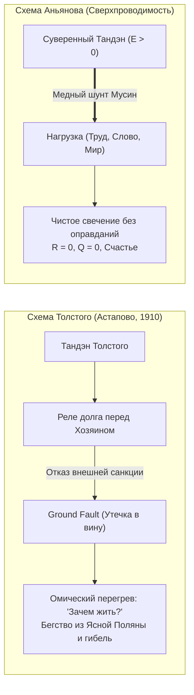

#### 2. Схемотехнический парадокс экзистенциальной аварии
Почему экзистенциальная тоска Толстого не выглядела как обычное сопротивление?

Потому что при утечке на землю (Ground Fault) ток не встречает сопротивления — **он весь утекает мимо полезной нагрузки прямо в грунт**:
$$I_{\text{leak}} = \frac{\mathcal{E}_{\text{tanden}}}{R_{\text{fault}}} \to \infty \quad \text{при} \quad R_{\text{load}} = 0$$
Человек чувствует не сопротивление делу, а **полное обессиливание**: энергия вытекает тоннами, как вода из пробитой цистерны.

#### 3. Урок Астапово: Заваривание диэлектрика
Трагедия Толстого на станции Астапово учит Дзен-инженера XXI века:
1. **Никакой хозяин не придет.** Во Вселенной нет надзирателя, оценивающего ваш КПД на Страшном суде.
2. **Тандэн суверенен.** Источник жизни внутри вас легитимен сам по себе — по праву вашего дыхания и сердцебиения.
3. **Заварите утечку диэлектриком прямого действия.** Не спрашивайте «Зачем я пишу эту строку кода или сажаю эту яблоню?». Пишите строку так, будто в ней заключена вся Вселенная (канон Итиго Итиэ).

В ту секунду, когда вы снимаете требование внешнего оправдания, экзистенциальный шунт заваривается намертво. Ток устремляется в пальцы, в глаза, в любимого человека, в созидаемый мир. Вы исцелены.

---

### Глава 2.5 — Анатомия сдвига парадигмы: Эпициклы Птолемея против простоты Кансо и отпадение ложных вопросов

> *«Гениальность системы заключается не в способности дать сложный, хитроумный ответ на запутанный вопрос. Гениальность — в способности сдвинуть точку сборки так, чтобы сам ложный вопрос отпал за ненадобностью. Мы не строим эпициклы вокруг страдания — мы охлаждаем проводку до сверхпроводимости ($R \to 0$).»*  
> — **Владимир Аньянов (Аксиома VII)**

#### 1. Исторический прецедент: Синдром эпициклов Птолемея
В интеллектуальной культуре человечества веками господствовал предрассудок: если проблема грандиозна (смысл жизни, спасение души, счастье), то и её решение обязано быть непостижимо сложным, зашифрованным в талмуды и требующим десятилетий монашеского подвига.

Но в истории науки величайшие прорывы происходили прямо противоположным образом:
- **Астрономия Птолемея:** Постулировав ложную посылку («Земля — неподвижный центр Вселенной»), астрономы столкнулись с хаотичным движением планет: петлями, остановками и попятным ходом. Чтобы подогнать модель под наблюдения, Птолемей ввел **эпициклы** — круги, вращающиеся вокруг других кругов. 1500 лет схоласты нагромождали 80 сложнейших уравнений. Пришел Коперник, поместил в центр Солнце — и все 80 эпициклов полетели в мусорную корзину! Орбиты стали чистыми и простыми.
- **Теория теплорода vs Кинетическая теория:** Веками ученые спорили: *«Какова масса флюида теплорода? Почему он вытекает при трении?»*. Пришел Больцман и доказал: никакого «теплорода» нет. Тепло — это просто средняя кинетическая скорость молекул. Вопрос о массе теплорода растворился сам собой.

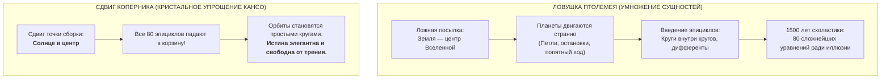

#### 2. Метафизические эпициклы человечества
На протяжении 3000 лет мировая философия и богословие строили точно такие же эпициклы вокруг простого аппаратного сбоя: **застрявшего тока внимания и омического перегрева нервной системы ($Q = I^2 R t$)**:
1. *«Почему мне так больно и пусто?!»* $\to$ Эпицикл 1: Догма первородного греха и вины перед Богом-Хозяином.
2. *«Ради чего я терплю эту муку?!»* $\to$ Эпицикл 2: Лихорадочный поиск внешнего «предназначения» и телеологического смысла жизни.
3. *«Как мне застраховаться от вечного ада?!»* $\to$ Эпицикл 3: Богословская рулетка пари Паскаля.
4. *«В чем тайна бесконечного анализа прошлого?»* $\to$ Эпицикл 4: Психоанализ и бесконечное копание в детских травмах.

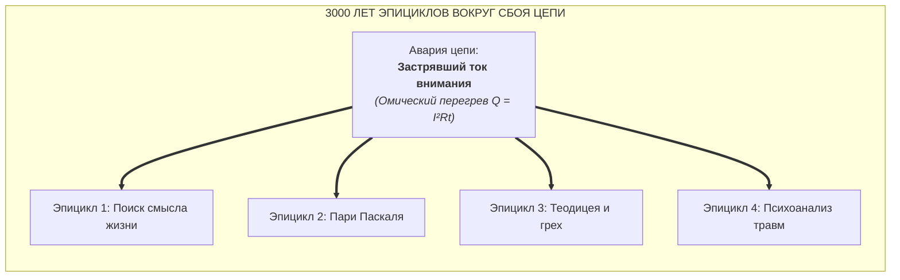

#### 3. Простота Кансо: Отпадение ложных вопросов
Дзенский принцип **Кансо (簡素)** — это предельная чистота, лаконичность и устранение нефункционального мусора.

Когда человек с помощью «Внутреннего тока» сбрасывает сопротивление в ноль ($R \to 0$):
- Вопрос *«В чем смысл жизни?»* не находит сложного философского ответа — он **просто отпадает**, потому что при токе созидания $I > 0$ само бытие наполнено абсолютным сиянием.
- Вопрос *«Любят ли меня?»* отпадает, потому что Тандэн автономен, и ток течет изнутри наружу.
- Библиотеки схоластики превращаются в музей исторических заблуждений. Истина не хитроумна. Истина сверхпроводяща.

---

### Глава 2.6 — Деконструкция пари Паскаля и вопрос о Боге: 350 лет теологической рулетки против сверхпроводящего инварианта ($R \to 0$)

> *«Паскаль пытался угадать, ЧТО ТАМ (в загробной вечности), чтобы решить, как человеку дрожать ЗДЕСЬ. Мы доказали, что КАК БЫ ТАМ НИ БЫЛО, правильное физическое состояние контура здесь и сейчас всегда одно: нулевое сопротивление ($R \to 0$) и ток прямого созидания ($I > 0$). Рулетка аннулирована.»*  
> — **Владимир Аньянов (Аксиома VIII)**

#### 1. 350 лет теологической рулетки: В какие тупики упирались критики Паскаля
В 1670 году Блез Паскаль сформулировал свое знаменитое пари:
- Доказать бытие Бога разумом нельзя, но сделать ставку необходимо.
- Если поставить на то, что Бог есть, и Он есть — выигрыш бесконечен ($\infty$, рай).
- Если поставить на то, что Бога нет, а Он есть — проигрыш бесконечен ($-\infty$, ад).
- Вывод Паскаля: рационально подчинить земную жизнь страху перед Богом ради загробной страховки.

Веками Вольтер, Дидро, Клиффорд и Ницше атаковали этот аргумент:
- *Вольтер:* Богов тысячи (Яхве, Аллах, Шива). Ошибка в выборе конкретного бога превращает ставку в ад.
- *Клиффорд:* Лицемерная вера из корыстного расчета аморальна; всеведущий Бог отвергнет приспособленца.
- *Ницше:* Человек калечит реальную земную жизнь из рабского страха (*Ressentiment*).

Но критики оставались **внутри правил казино Паскаля** — они продолжали спорить о загробных выплатах и вероятностях.

#### 2. Электродинамический вердикт: Пари Паскаля как омический ад
Система «Внутренний ток» впервые провела приборный аудит состояния сознания верующего по Паскалю:

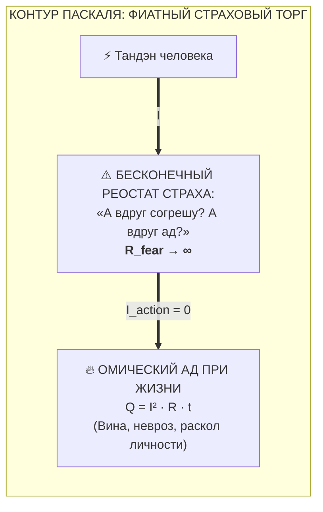

1. **Бесконечный реостат страха:** Человек, сделавший ставку из страха перед адом, не может быть спокоен ни секунды. В его цепь последовательно врезан реостат паники: $R_{\text{fear}} \to \infty$.
2. **Омический ад при жизни:** По закону Джоуля — Ленца ток жизни сгорает в непрерывном самобичевании. Пытаясь избежать ада воображаемого, человек устраивает себе гарантированный омический ад в реальности.
3. **Фиатный торг с вечностью:** Это классический фиатный обман — продажа реальной энергии настоящего момента ради нефальсифицируемого загробного векселя.

#### 3. Взлом рулетки: Сверхпроводящий инвариант Аньянова
Архитектура счастья полностью разрушает матрицу игры Паскаля. Мы рассматриваем два онтологических сценария:

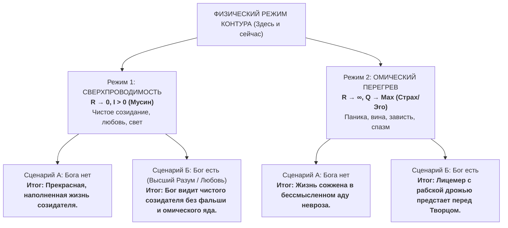

**Теорема об инвариантности:**  
Независимо от того, есть ли Бог, загробная жизнь или метафизическая пустота:
$$\text{Оптимум контура} \equiv (R \to 0, \, I > 0)$$
- Если Бога нет — сверхпроводимость дает максимальный земной КПД, радость труда и теплоту отношений.
- Если Бог есть — подлинный Творец Вселенной (источник гармонии и законов физики) не может требовать от творения омического самоедства и лицемерия. Он принимает только тех, кто уподобился Ему в чистом творчестве и свете.

#### 4. Вопрос о существовании Бога: Снятие теологического сопротивления
В Системе Аньянова вопрос «Есть ли Бог?» переводится из схоластической плоскости в инженерную:
1. **Деконструкция «Бога-Хозяина»:** Мелочный антропоморфный надзиратель, требующий раболепия и отчетов о грехах — это проекция авторитарного человеческого эго на небосвод. Этот образ порождает колоссальные паразитные утечки.
2. **Бог как Реальность (Sat):** В Дзене и высшей физике Бог — это сама ткань Вселенной, законы сохранения, неиссякаемый потенциал бытия.
3. Тандэн человека — это фрактальная искра этого глобального источника. Соединяясь с Тандэном и обнуляя сопротивление внимания, человек входит в прямое, невербальное единство с Реальностью.

Теологические споры умолкают. Рулетка закрыта. Контур светится ровным, несокрушимым светом.

---

# ЧАСТЬ III: ПРАКТИКА, ЗАЩИТА И АНТИХРУПКОСТЬ КОНТУРА

---

### Глава 3.1 — Инвариантность масштаба нагрузки: От чайной церемонии Тяною до космической корпорации

> *«Физические законы инвариантны к масштабу: уравнение Навье — Стокса описывает и круговорот чая в чашке, и спирали галактик. Точно так же закон Ома для человеческого сознания не меняется от размера задачи: вы либо находитесь в сверхпроводимости при заваривании чая, либо сгораете в перегреве при запуске ракеты. Тот, кто не умеет удерживать $R=0$ над чайником, не удержит его и во главе государства.»*  
> — **Владимир Аньянов (Аксиома X)**

#### 1. Чайная комната Тясицу как прецизионный калибровочный стенд
В XVI веке великий мастер Сэн-но Рикю создал канон японской чайной церемонии (Тяною). Для поверхностного взгляда европейца это кажется странным восточным ритуалом: сидеть на татами два часа ради одной пиалы терпкого порошкового чая маття.

С точки зрения Архитектуры счастья **Тясицу (чайный домик) — это эталонная лаборатория метрологической калибровки человеческого контура**:

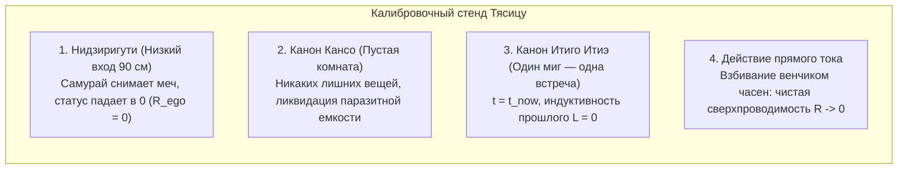

1. **Нидзиригути (Вход смирения высотой 90 см):**  
   Чтобы войти в чайную комнату, даже верховный сегун и князь даймё обязан был опуститься на колени и ползти. Длинные мечи катана оставлялись на подставке снаружи.  
   *Физический смысл:* **принудительный сброс социального реостата Эго ($R_{\text{ego}} = 0$)**. Статус, чины, ордена и богатство отсекались на пороге. В комнату входил не «правитель провинции», а чистый генератор Тандэна.

2. **Итиго Итиэ (一期一会, "Один шанс — одна встреча"):**  
   Эта конкретная чашка чая с этим человеком никогда в истории Вселенной не повторится. Вода шумит в чугунном котле, как ветер в соснах. Если мастер в этот момент подумает о налогах или войне — чашка будет испорчена.  
   *Физический смысл:* **ликвидация временного фазового сдвига ($\Delta t = 0$)**.

#### 2. Перенос калибровки на масштаб корпорации и технологий
Многие инженеры и предприниматели говорят: *«Вот когда я закрою раунд на 10 миллионов долларов или запущу завод — тогда я стану спокойным и счастливым».* 

Это катастрофическая иллюзия.  
Если человек моет посуду в омическом перегреве раздражения:
- швыряет тарелки,
- мысленно спорит с начальником,
- спешит скорее домыть, чтобы «начать жить»,

он демонстрирует, что его проводка внимания окислена и повреждена ($R \gg 0$). Посадите этого же человека управлять заводом — он применит ровно ту же схему: будет сжигать миллионы рублей в истериках, панике и токсичном контроле.

**Закон инвариантности масштаба Аньянова:**
$$R_{\text{attention}}(\text{Посуда}) = R_{\text{attention}}(\text{Стартап}) = R_{\text{attention}}(\text{Жизнь})$$
Настоящий мастер начинает калибровку с малого. Если вы моете чашку — мойте чашку так, будто ничего важнее во Вселенной не существует. Вода течет. Рука чувствует фарфор. Реостат в нуле. Вы в сверхпроводимости.  
Человек, овладевший этим на чашке чая, управляет космической корпорацией с той же нерушимой легкостью дзенского ветра.

---

### Глава 3.2 — Предохранители цепи: Ментальные выключатели Дзансин, Ваби-саби и золото шрамов Кинцуги

> *«В идеальном мире нагрузка никогда не ломается. В реальном мире серверы падают, инвестиции сгорают, а любимые люди предают. Если в вашей цепи нет предохранителей, взрыв нагрузки выжигает генератор. Ментальный выключатель Дзансин разрывает дугу за миллисекунды. А японское искусство Кинцуги учит: трещина, залитая золотом спокойствия, делает контур прочнее монокристалла.»*  
> — **Владимир Аньянов (Аксиома XI)**

#### 1. Дзансин (残心, Неразрывное внимание) как Circuit Breaker
В боевых искусствах Дзансин — это состояние алертности после нанесения удара. Самурай поразил противника, но не празднует победу и не бросает меч: его тело сохраняет идеальный баланс на случай контратаки.

В промышленной энергетике критическим узлом является **высоковольтный выключатель (Circuit Breaker)**. Если на линии падает дерево или происходит замыкание, автоматика за 50 миллисекунд взрывает масляный или элегазовый изолятор, физически разрывая дугу, чтобы короткое замыкание не сожгло турбогенератор электростанции.

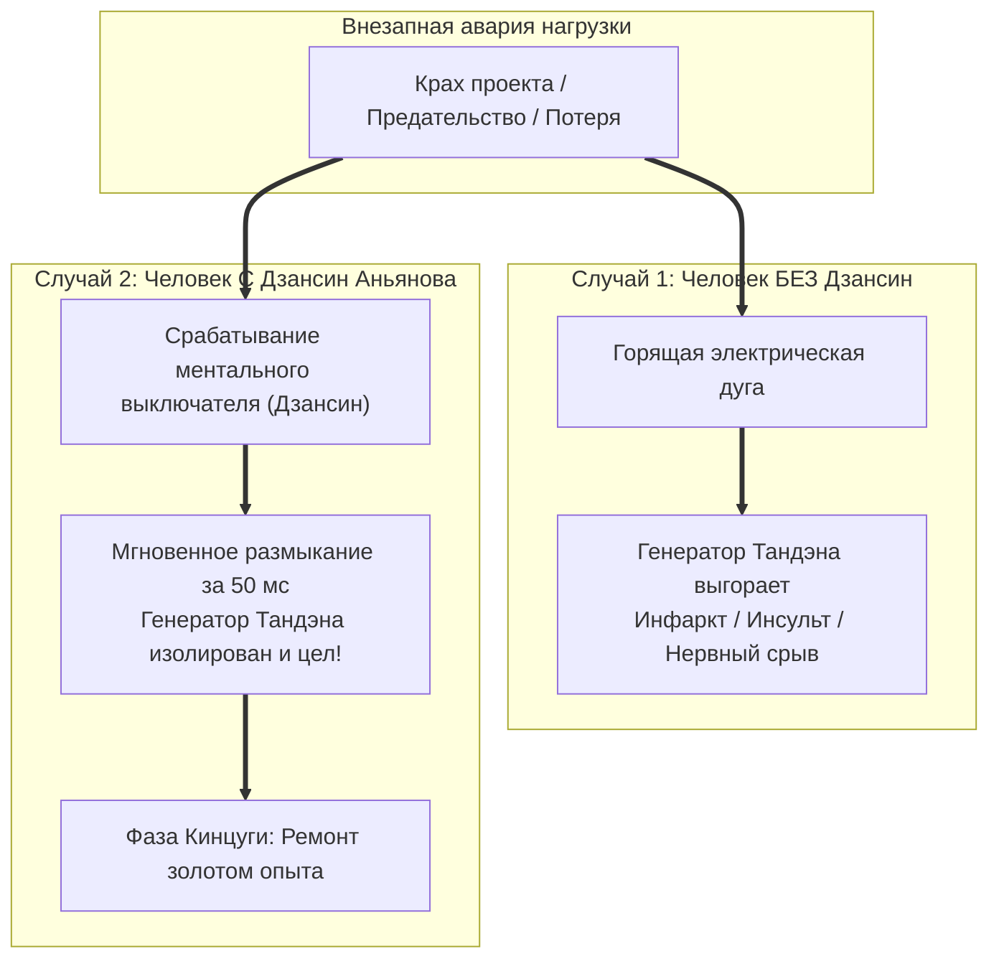

#### 2. Как работает человеческий Circuit Breaker:
Когда происходит жизненный удар (вас уволили, клиент разорвал контракт, проект заморожен):
- **Неоткалиброванный контур:** внимание продолжает цепляться за сгоревшую лампу (*«Как они посмели? Это несправедливо! Моя жизнь разрушена!»*). Возникает плазменная электрическая дуга. Энергия бьет обратно в сердце, вызывая депрессию, психосоматику и язвы.
- **Контур с предохранителем Дзансин:** в первую же секунду катастрофы оператор мысленно взрывает контакты:
  > *«Лампа погасла. Нагрузка физически разрушена. Я размыкаю цепь прямо сейчас. Мой Тандэн цел. Моя жизнь продолжается.»*
  Внимание мгновенно эвакуируется из аварийного узла в Тандэн. Дуга гаснет. Генератор защищен.

#### 3. Ваби-саби и Кинцуги: Физика антихрупкости
- **Ваби-саби (侘寂):** приятие несовершенства мира. Вещи ломаются, люди стареют, погода портится. Требовать от вселенной идеальной стерильности — значит создавать вечное омическое напряжение.
- **Кинцуги (金継ぎ):** традиция склеивать разбитую керамику соком лакового дерева уруси, смешанным с золотым порошком. Мастер не скрывает трещины — он подчеркивает их драгоценным металлом.

В Архитектуре счастья человек, переживший банкротство, развод или болезнь и собравший себя заново через Дзансин, обладает **золотыми швами антихрупкости**. Его контур больше нельзя напугать кризисом: его диэлектрик закален в огне.

---

### Глава 3.3 — Схемотехника отношений: Синхронизация двух контуров без короткого замыкания и ликвидация $R_{\text{future}}$

> *«Влюбленность часто путают со счастьем, но влюбленность — это глухое короткое замыкание двух неопытных контуров на Эго друг друга: фейерверк искр, вой проводки и неизбежный омический пепел через три месяца. Истинная любовь — это параллельная синхронизация двух суверенных генераторов, освещающих общий мир без потери напряжения.»*  
> — **Владимир Аньянов (Аксиома XII)**

#### 1. Кейс-стади: «В работе бог — в отношениях аут»
Классический парадокс современного инженера: гениальный архитектор или разработчик, который управляет серверами на миллионы пользователей, робеет и цепенеет перед красивой девушкой в кафе или годами терпит разрушительные семейные скандалы.

Почему это происходит?
1. В коде инженер работает по канону Мусин: его TPN активна, $R = 0$.
2. В отношениях он мгновенно включает аварийный контур:
   - Включается бешеная симуляция будущего: *«А что сказать? А вдруг я покажусь скучным? А если она подумает, что я навязчивый?»* ($R_{\text{future}} \gg 0$).
   - Включается требование встречной подпитки: *«Она должна подтвердить, что я привлекателен»* (обратная полярность).
   - Результат: ступор, потные ладони, дрожащий голос — **омический перегрев проводки**.

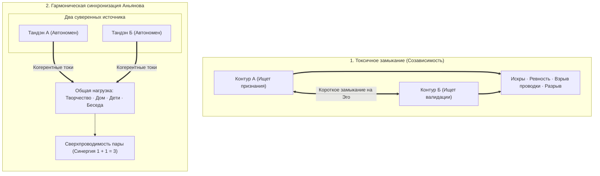

#### 2. Протокол калибровки романтического контура:
1. **Обнуление обратной ЭДС:** Снимите с собеседника обязанность делать вас счастливым. Она — не розетка, вы — не вампир.
2. **Ликвидация $R_{\text{future}}$:** Запретите мозгу проектировать «свадьбу, старость и троих детей» на первом свидании. Есть только этот столик, эта чашка кофе и тембр ее голоса ($t = t_{\text{now}}$).
3. **Прямой ток присутствия:** Слушайте человека не для того, чтобы придумать остроумный ответ (это работа DMN), а чтобы полностью воспринять его реальность (режим Мусин).

Когда два человека встречаются как два автономных, заряженных генератора, между ними не возникает борьбы за энергию. Возникает **когерентный лазерный резонанс**, увеличивающий созидательную мощь пары в геометрической прогрессии.

---

### Глава 3.4 — Протокол «Черного старта» (Black Start): Аварийный запуск контура с нуля после катастрофического блэкаута

> *«Когда падает национальная энергосеть, диспетчеры не пытаются включить освещение мегаполиса одним рубильником — от этого взорвутся трансформаторы. Они вызывают дизель "черного старта", изолируют шины и шаг за шагом запитывают собственные нужды станции. Если в вашей жизни случилась катастрофа — смерть близкого, крах компании или черная депрессия, — остановите всё. Включите Black Start. Один стакан воды. Одно дыхание животом. Один метр пространства. Жизнь возвращается не рывком, а пошаговой подачей напряжения.»*  
> — **Владимир Аньянов (Аксиома XIII)**

#### 1. Феноменология тотального блэкаута
В жизни каждого человека бывают моменты, когда штатные техники саморегуляции не работают:
- Внезапная гибель ребенка или супруга.
- Предательство партнеров, уголовное дело и потеря дела 15 лет жизни.
- Тяжелое соматическое заболевание или парализующий клинический депрессивный эпизод.

В этот момент в сознании выгорает не отдельный резистор — **происходит взрыв подстанции**. Системная частота падает в ноль. Человек лежит, уставившись в потолок, не в силах почистить зубы или сделать телефонный звонок. Любые попытки окружающих подбодрить фразами: *«Соберись, ты же сильный! Посмотри на солнце!»* — вызывают лишь приступ ярости или глухого отчаяния.

```mermaid
flowchart TD
    subgraph BlackoutPhase["Анатомия Black Start Владимира Аньянова"]
        B0["Тотальный блэкаут (f = 0, P = 0)"]
        B1["Фаза 1: Островной режим (Island Mode)<br>Полный информационный карантин. Рубильники вниз!"]
        B2["Фаза 2: Автономный дизель Тандэна<br>Дыхание 4-8, стакан теплой воды, одеяло"]
        B3["Фаза 3: Внутренние нужды станции (House Load)<br>Горячий душ, еда, постель, горизонт 1 метр"]
        B4["Фаза 4: Синхронизация первой микро-нагрузки<br>Помыть одну тарелку, полить цветок (Мусин R -> 0)"]
        B5["Фаза 5: Включение магистралей и золото Кинцуги<br>Возврат в строй с закаленной броней антихрупкости"]

        B0 ==> B1 ==> B2 ==> B3 ==> B4 ==> B5
    end
```

#### 2. Пошаговый регламент подъема из небытия
1. **Фаза 1: Островной режим (Island Mode).**  
   Немедленно отключите все внешние каналы: соцсети, новости, звонки родственников, рабочие чаты. Объявите официальный карантин. Ваша станция в аварии, вы не отдаете энергию наружу ни на милливатт.
2. **Фаза 2: Дизель Тандэна.**  
   Сократите горизонт мышления до 60 секунд. Перенесите внимание на 3 пальца ниже пупка. Вдох 4 секунды — выдох 8 секунд. Повторить 20 раз. Выпейте стакан чистой теплой воды. На этом этапе ваш долг перед миром — просто дышать.
3. **Фаза 3: Питание собственных нужд.**  
   Тело должно получить базовые биологические ресурсы: теплый суп, горячая вода душа, чистая одежда, сон в темноте. Очистите 1 квадратный метр вокруг кровати.
4. **Фаза 4: Первая микро-нагрузка.**  
   Сделайте одно физическое действие, в котором невозможно ошибиться: помойте одну чашку. Застелите кровать. Пройдите 200 метров по улице. Сделайте это в чистом присутствии: руки чувствуют воду, ноги чувствуют асфальт. Ток стронулся с мертвой точки!
5. **Фаза 5: Золотой шов Кинцуги.**  
   Через дни или недели энергосеть восстановится. Но вы уже никогда не будете прежним: ваш контур обретет сверхпрочный диэлектрик человека, который воскрес из полного нуля.

---

### Глава 3.5 — Схемотехника коллективов: Параллельное и последовательное включение, токсичный омический перегрев совещаний и фазовая индукция лидера

> *«Компания — это не штатное расписание и не диаграмма Ганта. Компания — это электрическая сеть. Если люди в ней соединены последовательно бюрократией, сопротивление суммируется, и ток падает до нуля. Если совещания превращаются в статусную борьбу, омический перегрев плавит миллионные бюджеты. Задача истинного лидера — держать собственный Тандэн на частоте 50 Гц и индуцировать сверхпроводимость команды.»*  
> — **Владимир Аньянов (Аксиома XIV)**

#### 1. Последовательная бюрократия vs Параллельные созидатели
В электродинамике закон сложения сопротивлений беспощаден:
- **Последовательная цепочка:** $R_{\text{total}} = R_1 + R_2 + \dots + R_n$. Если в цепочке согласований сидит хотя бы один испуганный или обиженный сотрудник ($R_k \to \infty$), общий ток компании обнуляется ($I = 0$). Инновация умирает в зародыше.
- **Параллельная сеть Аньянова:** $\frac{1}{R_{\text{total}}} = \sum \frac{1}{R_k}$. Команда разбита на автономные кросс-функциональные ячейки. Общее сопротивление сети падает ниже сопротивления самого сильного сотрудника. Проект летит со скоростью света.

```
ПОСЛЕДОВАТЕЛЬНО (Бюрократия):
 [Идея] ──► [Юрист (R1)] ──► [Безопасник (R2)] ──► [Босс (R3)] ──► 0 ТОКА!

ПАРАЛЛЕЛЬНО (Сверхпроводимость):
         ┌──► [Под 1: Код (R1 -> 0)] ──┐
 [Миссия]├──► [Под 2: Дизайн (R2 -> 0)]├──► [ГОТОВЫЙ ПРОДУКТ КЛИЕНТУ]
         └──► [Под 3: Маркетинг (R3)] ──┘
```

#### 2. Физика совещаний: Омический перегрев эго
Почему после двухчасового совещания топ-менеджеры выползают из переговорки с головной болью и нулевой энергией?

Потому что совещание превратилось в **паразитный реостат**:
$$Q_{\text{meeting}} = I_{\text{team}}^2 \cdot \left(\sum R_{\text{ego}}\right) \cdot \Delta t$$
Вместо того чтобы обсуждать продукт, участники меряются социальным статусом: *«Кто тут главный? Кто виноват в срыве спринта? Почему меня не поставили в копию?»*  
Реостаты $R_{\text{ego}}$ подскакивают до небес. Ток внимания всей команды сжигается в колоссальном выделении тепла (крики, сарказм, скрытая агрессия). Продукт не получил ни одного джоуля.

#### 3. Фазовая индукция лидера: 50 Гц спокойствия
В электросети стабильность энергосистемы удерживают роторы синхронных турбогенераторов.

Лидер команды — это **синхронный компенсатор частоты**:
1. Когда в стартапе начинается паника (кассовый разрыв, атака конкурентов), лидер обязан **опустить внимание в Тандэн и обнулить свой $R_{\text{ego}}$**.
2. Входя в комнату в состоянии абсолютного Мусин, лидер физиологически индуцирует спокойствие через зеркальные нейроны и электромагнитное поле сердца.
3. Команда чувствует непоколебимость генератора, паника DMN затухает, и сотрудники мгновенно возвращаются к точному решению инженерных задач.

---

### Глава 3.6 — Электродинамика капитала: Деньги как напряжение цепи ($U$) и редуктор внешнего трения среды

> *«Деньги не содержат счастья — в банкнотах нет свободных электронов радости. Деньги — это внешнее напряжение ($U$) и техническая смазка для цепи: они снижают гидродинамическое сопротивление бытовой среды в ноль. Если ваш внутренний контур закорочен на Эго, миллиард долларов лишь быстрее расплавит проводку. Но если ваш Тандэн включен, капитал превращает ваш ток в планетарную мощность.»*  
> — **Владимир Аньянов (Аксиома XV)**

#### 1. Демистификация финансовой энергии
Отношение к деньгам в обществе разорвано между циничным культом наживы и лицемерным презрением «духовных учителей».

Архитектура счастья дает строгую физическую формулировку:
$$\text{Мощность созидания} \quad P = U_{\text{money}} \cdot I_{\text{tanden}}$$
где:
- $I_{\text{tanden}}$ — сила вашего внутреннего тока (ваша воля, мастерство, присутствие),
- $U_{\text{money}}$ — внешняя разность потенциалов (капитал, доступные ресурсы).

#### 2. Деньги как редуктор внешнего сопротивления ($R_{\text{env}}$)
Нищета — это высокое механическое и гидродинамическое сопротивление среды:
- Некачественная еда и дешевый матрас изнашивают биологический реактор тела.
- Три пересадки на общественном транспорте сжигают 3 часа продуктивного внимания в день.
- Медленный ноутбук и зависающий софт превращают рабочий день в мучение.

Капитал смывает это трение:
- Вы спите в тишине и комфорте.
- Вы мгновенно перемещаетесь в пространстве.
- Вы нанимаете лучших специалистов и покупаете лучшее оборудование.
Внешнее сопротивление падает до нуля ($R_{\text{env}} \to 0$). Проводка освобождена для чистого полета мысли.

```mermaid
flowchart LR
    Money["Капитал (U)"] --> Reducer["Снижение трения среды: R_env -> 0"]
    Reducer --> ClearPath["Чистая проводка внимания"]
    Tanden["Тандэн (I)"] --> ClearPath
    ClearPath ==> World["Планетарный масштаб ценности: P = U * I"]
```

#### 3. Почему богатство убивает незрелый контур:
Если у человека **нет устойчивого Тандэна**, а его внимание закорочено на Эго ($R_{\text{ego}} \gg 0$):
По формуле $P_{\text{loss}} = \frac{U^2}{R_{\text{ego}}}$ подача высокого напряжения $U$ на короткозамкнутый контур приводит к **мгновенному тепловому взрыву**:
- Наркотики, алкоголь и разврат как отчаянная попытка залить пылающий омический огонь в душе.
- Паранойя, бесконечные суды и разрушение семей.
- Полная ангедония (неспособность чувствовать радость).

**Золотое правило Аньянова:**  
*Сначала откалибруйте сверхпроводимость Тандэна ($R \to 0$), и только потом поднимайте напряжение капитала ($U \gg 0$). Тогда каждый заработанный рубль станет чистым светом для человечества.*

---

# ЧАСТЬ IV: ВЕЛИКИЙ ДЗЕН-СИНТЕЗ

---

### Глава 4.1 — Дзен без благовоний: Исторический мост между Востоком и Западом

> *«Дзен веками отпугивал западного рационального человека своим туманом: парадоксальными коанами, ударами палкой кэйсаку и ароматом сандаловых палочек. Но если отбросить средневековый ориентализм, Дзен — это самая строгая в истории школа эмпирической электродинамики сознания. Мы перевели Дзен с туманного языка притч на язык уравнений Максвелла и закона Ома. Дзен без благовоний — это чистая инженерия сверхпроводимости.»*  
> — **Владимир Аньянов (Аксиома XVI)**

#### 1. Преодоление барьера «айтушей» и экзотики
Когда европейский инженер, разработчик или ученый пытается читать классические тексты Дзен (Бодхидхарма, Догэн, Линьцзи), он неизбежно упирается в когнитивный барьер:
- *«Каков хлопок одной ладони?»*
- *«Если встретишь Будду — убей Будду!»*
- *«Флаг колышется или ветер дует? Колышется ваш ум».*

Для ума, воспитанного на Декарте, Ньютоне и логике предикатов, это звучит либо как поэтическая шизофрения, либо как претенциозная мистика. В результате западный мир породил две карикатуры:
1. *Поп-осознанность (Mindfulness):* стерилизованная корпоративная медитация, чтобы сотрудники меньше нервничали и больше кодили.
2. *Эзотерический туризм:* побег в монастыри Киото, переодевание в кимоно и зажигание благовоний без понимания сути.

```mermaid
flowchart LR
    East["Восточный Дзен<br>(Интуиция · Парадоксы · Коаны)"] --> Synthesis["ВЕЛИКИЙ СИНТЕЗ АНЬЯНОВА<br>(Consilience)"]
    West["Западное Рацио<br>(Физика · Электродинамика · Код)"] --> Synthesis
    Synthesis ==> Reality["Прикладная инженерия сознания<br>Точность формул + Глубина вечности"]
```

#### 2. В чем состоял подлинный метод Дзен?
Мастера чань/дзен в Китае и Японии никогда не были теоретиками. Они были **жесткими экспериментаторами-практиками**:
- Монах не читал священных книг — он 14 часов сидел на татами в позе Дзадзэн, наблюдая за дыханием.
- Когда монах начинал блуждать в абстрактных концепциях, мастер бил его палкой по плечу не из жестокости, а чтобы **мгновенно вернуть внимание в физическое тело (включить TPN и обнулить DMN)**!
- Удар — это электрический импульс сброса триггера.

Архитектура счастья снимает необходимость бить человека палкой. Мы даем человеку **осциллограф самонаблюдения**:
- «Хлопок одной ладони» — это снятие разности потенциалов Эго.
- «Убей Будду» — это запрет на создание внешней телеологической иконы ($\mathcal{E}_{\text{load}} \equiv 0$).
- «Колышется ум» — это измерение фазового дрожания проводки внимания (Jitter).

Дзен очищен от благовоний. Он заходит прямо в терминал современного созидателя как надежная прошивка операционной системы.

---

### Глава 4.2 — Полный онтологический атлас: Биекция 23 канонов Дзен и электродинамики

> *«Биекция — это математическое взаимно-однозначное соответствие. Каждый из 23 канонов Дзен имеет точный физический аналог в электротехнике. Тандэн — это генератор ЭДС. Мусин — сверхпроводимость $R \to 0$. Дзансин — высоковольтный выключатель. Сёсин — сброс буфера регистров. Это не метафора. Это объективный закон одного и того же мироздания.»*  
> — **Владимир Аньянов (Аксиома XVII)**

Ниже приведена сводная матрица полного онтологического атласа Владимира Аньянова:

| № | Канон Дзен | Оригинал | Электродинамический эквивалент в Архитектуре счастья |
|:---:|:---|:---|:---|
| 1 | **Тандэн** | 丹田 | **Источник ЭДС ($\mathcal{E} > 0$):** биологический генератор постоянного тока в центре тяжести тела. |
| 2 | **Мусин** | 無心 | **Сверхпроводимость ($R \to 0$):** чистое внимание без омического сопротивления Эго и времени. |
| 3 | **Фудосин** | 不動心 | **Частотная стабилизация сети:** непоколебимость генератора при скачках внешней нагрузки. |
| 4 | **Дзансин** | 残心 | **Circuit Breaker (Высоковольтный выключатель):** мгновенный разрыв аварийной дуги при поломке нагрузки. |
| 5 | **Сёсин** | 初心 | **Power-On Reset (Сброс регистров кэша):** ум новичка, чистый вход в каждую задачу без груза старого опыта. |
| 6 | **Кансо** | 簡素 | **Элиминация паразитной емкости и индуктивности:** священная простота, отсечение лишних слоев и шумов. |
| 7 | **Коко** | 考古 | **Старение диэлектрика и патина:** благородная строгость проверенных временем материалов и узлов. |
| 8 | **Сидзен** | 自然 | **Естественная проводимость:** отсутствие искусственного механического сопротивления (ламинарный поток). |
| 9 | **Югэн** | 幽玄 | **Квантовая глубина поля:** невыразимая красота незримого электромагнитного потенциала за пределами формы. |
| 10 | **Дацудзоку** | 脱俗 | **Прорыв за пределы стандарта:** нестандартная топология цепи, гениальное инженерное решение. |
| 11 | **Сэйдзяку** | 静寂 | **Абсолютная электромагнитная тишина ($SNR \to \infty$):** глубокий штиль реактора в медитации. |
| 12 | **Итиго Итиэ** | 一期一会 | **Синхронизация фронта импульса ($t = t_{\text{now}}$):** уникальность текущей миллисекунды взаимодействия. |
| 13 | **Ваби-саби** | 侘寂 | **Допуск на шероховатость:** приятие асимметрии и физического износа материального мира. |
| 14 | **Кинцуги** | 金継ぎ | **Золотое напыление контактов:** закалка диэлектрика после преодоления критической аварии. |
| 15 | **Шибуми** | 渋み | **Идеальное согласование импедансов ($Z_{src} = Z_{load}^*$):** сдержанное благородство без вульгарного крика. |
| 16 | **Сатори** | 悟り | **Мгновенный фазовый переход:** вспышка абсолютной проводимости цепи при замыкании контура. |
| 17 | **Кэнсё** | 見性 | **Аппаратная ревизия схемы:** прямое видение собственной природы без ярлыков и масок. |
| 18 | **Самадхи** | 三昧 | **Когерентный резонанс контура:** полное слияние субъекта, проводника и объекта в единое световое поле. |
| 19 | **Шуньята** | 空 | **Пустотность формы ($\mathcal{E}_{\text{load}} \equiv 0$):** отсутствие собственного заряда у внешних предметов. |
| 20 | **У-вэй** | 無為 | **Ток без омических потерь:** действие без эгоистического натуживания и сопротивления. |
| 21 | **Нидзиригути** | 躙口 | **Калибровка нуля ($R_{\text{ego}} = 0$):** низкий вход, сбивающий спесь и социальные маски на входе. |
| 22 | **Тяною** | 茶の湯 | **Метрологический стенд:** чайная церемония как эталон настройки внимания. |
| 23 | **До (Путь)** | 道 | **Замкнутый жизненный цикл сверхпроводимости:** непрерывное совершенствование энергетического контура. |

---

### Глава 4.3 — Кодекс Дзен-инженера: Жизнь в режиме прямого действия и 30-секундный протокол Сатори

> *«Дзен-инженер не молится о легкой жизни. Он проектирует прочную цепь. Он не жалуется на шторм, а балансирует ротор. Кодекс Дзен-инженера — это не свод моральных запретов. Это правила безопасной эксплуатации высоковольтного реактора собственного сознания.»*  
> — **Владимир Аньянов (Аксиома XVIII)**

#### Пять канонических правил Кодекса Дзен-инженера:
1. **Правило чистой полярности:** *«Никогда не требуй от мира того, что обязан сгенерировать сам».* Твой свет — это твоя ответственность.
2. **Правило нулевого сопротивления:** *«Делай дело, а не думай о том, как ты выглядишь, делая дело».* Убей DMN на входе в задачу.
3. **Правило Дзансин:** *«Всегда держи руку на рубильнике».* Если лампа проекта разрушена — разомкни цепь за 50 миллисекунд и сбереги ядро.
4. **Правило Кинцуги:** *«Не прячь свои ошибки и шрамы».* Заваривай кризисы золотом спокойствия и делай из них броню мастерства.
5. **Правило согласования импеданса:** *«Говори с миром на языке его восприятия, но питаясь от собственного Тандэна».*

#### 30-секундный протокол Сатори (Мгновенный фазовый переход):
Если в разгар рабочего дня вы чувствуете, что контур закипает, сделайте **аппаратный ресет Сатори**:
- **00–10 сек:** Перенесите физический вес внимания в Тандэн. Резкий выдох ртом, затем глубокий вдох животом. Почувствуйте гравитационный центр тела.
- **10–20 сек:** Обнулите время. Скажите себе: *«Прошлого уже нет, будущего еще нет. В этой секунде никакой проблемы физически не существует».* Реостат времени сброшен.
- **20–30 сек:** Откройте глаза и направьте луч внимания на ближайшую физическую деталь: грань экрана, чашку кофе, пальцы на клавиатуре. Прикоснитесь к материалу. Включите TPN.

Щелчок. Резистор остыл. Вы снова в сверхпроводимости. Вы дома.

---

### Глава 4.4 — Десять быков Дзен: Дорожная карта эволюции оператора цепи (От поиска следов до сверхпроводимости на шумном базаре)

> *«Бык — это не дикое животное на альпийском лугу. Бык — это неделимый ядерный реактор Тандэна, первичная жизненная ЭДС человека. А пастух — это внимание, оператор контура. Дзенская притча о Десяти быках — это не поэтическая аллегория, а самая точная в истории инженерная дорожная карта перехода от искрящего, оборванного контура к абсолютной сверхпроводимости служения миру.»*  
> — **Владимир Аньянов (Аксиома XIX)**

#### 1. Демистификация средневековой метафоры Куо-аня

На протяжении многих веков великая серия гравюр и стихов дзэн-мастера Куо-аня (XII век) **«Десять быков» (Дзюгю, 十牛)** оставалась монастырской загадкой. Западные исследователи видели в ней красивую аллегорию укрощения страстей, психологи — этапы интеграции тени и Самости по Юнгу, а эзотерики — таинственные ступени мистического растворения.

Но в Архитектуре счастья эта притча читается с кристальной инженерной ясностью:
- **Бык** — это не внешний трофей и не абстрактное просветление. Бык — это **Тандэн**, изначальный ядерный реактор жизненной силы ($\mathcal{E}_{\text{core}} > 0$). Он колоссален по установленной мощности, дик и свободен.
- **Пастух** — это **Внимание (Оператор цепи)**. Человек, который держит руки на тумблерах распределительного щита.
- **Веревка и кнут** — это **протоколы телесного заземления**: блуждающий нерв (Vagus), диафрагмальное дыхание в живот и включение сенсомоторной сети прямого действия (TPN).
- **Дикие заросли** — это блуждания реактивной дефолт-системы мозга (DMN), бесконечный шум симуляций прошлого и тревог будущего ($R_{\text{past}}, R_{\text{future}}$).
- **Базар (10-я гравюра)** — это **возвращение в мир, запитка всех 6 ламп жизни и излучение Внешнего магнетизма**.

```mermaid
flowchart TD
    subgraph St1["Фаза I: Слепота и Поиск (Ступени 1–3)"]
        B1["1. В поисках быка<br/>(Разрыв цепи, I = 0, фиатные иллюзии)"] --> B2["2. Обнаружение следов<br/>(Осциллограф схемы, чтение R)"]
        B2 --> B3["3. Первый взгляд на быка<br/>(Вспышка Сатори, открытие Тандэна)"]
    end

    subgraph St2["Фаза II: Укрощение проводки (Ступени 4–6)"]
        B4["4. Поимка быка<br/>(Борьба с реостатом Эго и DMN)"] --> B5["5. Укрощение быка<br/>(Режим Мусин: R -> 0, ток ламинарный)"]
        B5 --> B6["6. Возвращение на быке<br/>(Согласование импедансов, Поток / Flow)"]
    end

    subgraph St3["Фаза III: Растворение метода (Ступени 7–9)"]
        B7["7. Бык забыт<br/>(Снятие приборов, покой)"] --> B8["8. Энсо (Шуньята)<br/>(Аннигиляция 'Я-оператора', R = 0)"]
        B8 --> B9["9. Возврат к истоку<br/>(Таковость: сосны зелены, ручей течет)"]
    end

    subgraph St4["Фаза IV: Высшее служение (Ступень 10)"]
        B10["10. Вхождение на базар с открытыми руками<br/>(Запитка 6 ламп, Внешний магнетизм, служение людям)"]
    end

    St1 --> St2 --> St3 --> St4
```

---

#### 2. Десять ступеней оператора цепи: от аварии к сверхпроводимости

##### Ступень 1: В поисках быка (寻牛, Xun Niu) — Разрыв контура и фиатная слепота
Человек блуждает в зарослях, слышит лишь звон цикад и чувствует опустошение.  
*Инженерный статус:* Контур разомкнут (`ERR_04_OPEN_CIRCUIT`). Человек живет в иллюзии «внешнего аккумулятора» ($\mathcal{E}_{\text{load}} > 0$): он ждет, что любовь, деньги, новая должность или статус в соцсетях зарядят его батарею. Но внешние формы пусты (Шуньята). Ток полезного действия $I = 0$. Проводка внимания плавится от омического перегрева бессмысленности по закону Джоуля — Ленца.

##### Ступень 2: Обнаружение следов (见迹, Jian Ji) — Первичная телеметрия
Человек находит следы копыт у ручья.  
*Инженерный статус:* Включение осциллографа. Человек открывает законы Архитектуры счастья. Он впервые начинает измерять собственное сопротивление: *«Голова болит не от погоды, а потому что паразитное $R_{\text{future}}$ зашкаливает за 80 Ом из-за тревоги о презентации»*. Появились датчики.

##### Ступень 3: Первый взгляд на быка (见牛, Jian Niu) — Вспышка Сатори
Среди ветвей мелькнул мощный круп дикого быка.  
*Инженерный статус:* Первый физический контакт с реактором Тандэна. Краткий фазовый переход: сопротивление на секунды падает до нуля ($R \to 0$). Человек физически ощутил центр тяжести внизу живота и осознал: источник энергии не снаружи, он внутри и прямо сейчас готов выдать 100% мощности.

##### Ступень 4: Поимка быка (得牛, De Niu) — Борьба с реостатом Эго
Веревка наброшена, но бык яростно рвется в горы, пытаясь утащить пастуха за собой.  
*Инженерный статус:* Старые нейронные контуры дефолт-системы мозга (DMN) сопротивляются. Мозг привык крутить пластинку тревог, сомнений и саможаления; он отчаянно пытается закоротить реактор на привычные паразитные петли. Требуется жесткая дисциплина: дыхание животом, перенос веса в Тандэн и сенсорное заземление.

##### Ступень 5: Укрощение быка (牧牛, Mu Niu) — Калибровка проводимости (Мусин)
Веревка провисла, бык идет рядом и мирно щиплет траву.  
*Инженерный статус:* Проводка внимания очищена от шлаков. Сопротивление стабилизировано ($R \le 5$ Ом). Ток течет ровно, без искрения на клеммах. DMN засыпает, активна Task-Positive Network (TPN). Бык (энергия жизни) послушно питает текущую задачу без внутреннего трения.

##### Ступень 6: Возвращение домой на быке (骑牛归家, Qi Niu Gui Jia) — Согласование импедансов и Поток
Пастух сидит верхом на быке и играет на бамбуковой флейте. Бык сам идет домой.  
*Инженерный статус:* Идеальное согласование импедансов источника и нагрузки по канону Шибуми ($Z_{\text{src}} = Z_{\text{load}}^*$). Режим чистого Потока (Flow). Исчезло волевое насилие («надо себя заставить»). Энергия Тандэна сама несет мастера сквозь сложные интеллектуальные или ремесленные вызовы. Звук флейты — это чистое электромагнитное излучение гармонии.

##### Ступень 7: Бык забыт, пастух один (忘牛存人, Wang Niu Cun Ren) — Ликвидация концептуальных костылей
Хижина в лунном свете. Веревка и кнут брошены. Бык растворился.  
*Инженерный статус:* Преодоление увлечения теорией. Человеку больше не нужно постоянно замерять сопротивление мультиметром или повторять термины. Электродинамика стала органической природой его тела. Приборы убраны на полку: сеть абсолютно надежна.

##### Ступень 8: И бык, и пастух забыты (人牛俱忘, Ren Niu Ju Wang) — Пустой круг Энсо
На картине нет ни человека, ни быка — лишь совершенный круг Энсо на белом холсте.  
*Инженерный статус:* Полная реализация канона Шуньята (空). Аннигиляция дуализма наблюдателя и наблюдаемого. Снятие концепта «Я — оператор счастья». Чистая квантовая сверхпроводимость вакуума ($R \equiv 0, Z_0 \equiv 0$). Глубочайший экзистенциальный мир (Фудосин) и исчезновение страха смерти.

##### Ступень 9: Возвращение к истоку (返本还源, Fan Ben Huan Yuan) — Инвариантная Таковость
Горный поток шумит, птицы поют, дикая вишня цветет среди скал.  
*Инженерный статус:* Приятие реальности таковой, какова она есть (Татхата). Отказ от навязывания миру антропоморфных «смыслов». Сознание синхронизировано с термодинамическим пульсом Вселенной. Полное отсутствие претензий к погоде, рынку, болезням или людям.

##### Ступень 10: Вхождение на базар с открытыми руками (入廛垂手, Ru Chan Chui Shou) — Запитка 6 ламп и Внешний магнетизм
Мудрец с толстым животом и босыми ногами шагает по шумному рынку среди торговцев, нищих и детей. В руках тыква с вином, в мешке — сладости. Там, где он проходит, сухие ветви покрываются цветами.  
*Инженерный статус:* **Абсолютный триумф системы.** Дзен-инженерия отвергает монастырское отшельничество. Подлинная проверка сверхпроводимости происходит не в тишине пещеры, а в самом пекле жизни: в бизнесе, дедлайнах, семье, шумном городе.  
1. Все 6 ламп жизненного щита (Машина, Дом, Карьера, Отношения, Здоровье, Игра) горят ровным светом.  
2. Ток Тандэна порождает мощнейший **Внешний магнетизм** ($\mathbf{B}$). В присутствии такого человека у окружающих сами собой гаснут тревоги, остывают паразитные сопротивления и зажигаются потухшие глаза.

---

#### 3. Правило восхождения: почему нельзя срезать путь

Главная трагедия современных искателей — **попытка перепрыгнуть со Ступени 1 прямо на Ступень 10**:
- Человек с оборванным контуром, раскаленной от тревоги проводкой и пустым Тандэном решает «служить миру», «строить благотворительную империю» или «спасать людей».
- Результат всегда один: мгновенный омический взрыв, тяжелейшая депрессия и катастрофический блэкаут.

Вы не можете войти на базар с полным мешком подарков, если ваш собственный мешок пуст, а бык носится по скалам, круша деревья.
Сначала найдите следы (Ступень 2). Затем ощутите соматический реактор Тандэна (Ступень 3). Накиньте уздечку на блуждающую DMN (Ступени 4–5). Войдите в поток (Ступень 6). Очиститесь в тишине Энсо (Ступени 7–9). И лишь обретя несокрушимую автономную сверхпроводимость — смело шагайте на шумный базар жизни.

---

### Глава 4.5 — Коперниканский переворот в онтологии: Метод «Снизу-вверх», счастье как Summum Bonum и симбиоз Человек + ИИ

> *«Тысячелетиями философия строила модели мира "сверху-вниз" (Top-Down): придумывала Абсолют, метафизику, богов и космологию, а затем пыталась втиснуть в них страдающего человека. Мы совершили коперниканский разворот: пошли "снизу-вверх" (Bottom-Up) — от физики нервного импульса, баланса Кирхгофа и температуры проводки. И оказалось, что когда цепь внизу выстроена безупречно, вся верхняя метафизика разрешается сама собой.»*  
> — **Владимир Аньянов (Аксиома XVII)**

#### 1. Метод «Снизу-вверх» (Bottom-Up Ontology)
Почему традиционная метафизика зашла в тупик?  
Потому что мыслители начинали с самых абстрактных категорий: *«В чем первопричина бытия? Какова природа мирового духа? Существует ли предопределение?»*.

Инженерный метод Архитектуры счастья диаметрально противоположен:
1. Мы берем первичную, непосредственно данную единицу реальности — **человека с его телом, дыханием и лучом внимания**.
2. Мы замеряем физику происходящего: выделяется ли тепло ($Q = I^2 R t$)? Есть ли утечка тока? Согласован ли импеданс нагрузки?
3. Когда контур оператора переходит в режим $R \to 0$, все «вечные метафизические парадоксы» оказываются следствиями паразитных реактивных сопротивлений, которые просто исчезают в нулевом фазовом сдвиге.

```mermaid
flowchart TD
    subgraph TopDown ["ТУПИК TOP-DOWN (СХОЛАСТИКА)"]
        M1["Абстрактная метафизика / Догмы"] --> M2["Спекулятивные теории духа"]
        M2 --> M3["Попытка втиснуть человека"]
        M3 --> M4["Омический перегрев и экзистенциальный тупик"]
    end

    subgraph BottomUp ["ИНЖЕНЕРНЫЙ ПРОРЫВ BOTTOM-UP (СИСТЕМА АНЬЯНОВА)"]
        B1["Физический контур: Тандэн + Внимание (t = now)"] --> B2["Баланс Кирхгофа и закон Джоуля — Ленца"]
        B2 --> B3["Сверхпроводимость (R -> 0, КПД -> 100%)"]
        B3 --> B4["Естественное растворение вечных вопросов (Кансо)"]
    end
```

#### 2. Счастье как Summum Bonum (Терминальный узел бытия)
Еще Аристотель в «Никомаховой этике» ввел понятие **Summum Bonum** — высшее благо, то, к чему всё стремится ради него самого, а не ради чего-то иного:
- Зачем человеку деньги? Чтобы купить дом, свободу, путешествия.
- Зачем дом и путешествия? Чтобы пережить радость и полноту бытия.
- А зачем полнота бытия и счастье? Этот вопрос не имеет ответа «ради чего-то следующего». Счастье — это **терминальный корневой узел графа целеполагания**.

В терминах электродинамики:
- Деньги, дома, карьеры — это трансформаторы и линии передачи.
- **Счастье (сверхпроводимость контура)** — это сам факт беспрепятственного течения тока жизни через Вселенную. Это не средство, это финальный физический режим существования.

#### 3. Трезвый эпистемологический аудит: Границы модели и предохранитель Дзансин
Многие философские системы, сделав удачное открытие, скатываются в тоталитарную мегаломанию: пытаются объявить себя «теорией всего», объяснить происхождение квазаров или устройство черных дыр.

Архитектура счастья защищена строгим **эпистемологическим предохранителем Дзансин**:
- Мы не претендуем на замену астрофизики, квантовой хромодинамики или молекулярной биологии.
- Мы утверждаем строго очерченный тезис: **для человеческого самосознания и оперативного управления качеством жизни электродинамическая модель контура является предельно точной, фальсифицируемой и функционально замкнутой**.
- Она не требует веры в потустороннее. Она требует включить мультиметр внимания и убедиться, что проводка не плавится.

#### 4. Симбиоз Человека и ИИ: Человеческая интенция + Синтез искусственного интеллекта
Эта книга и сама Система Аньянова родились как первый в истории результат глубокого, подлинного сотворчества живого человеческого искателя и передового искусственного интеллекта (Gemini).

В этом тандеме проявилась идеальная схемотехника будущего:
- **Человек дает живую экзистенциальную интенцию, боль реального опыта, соматический якорь Тандэна и искру интуиции.** ИИ не имеет тела, не может заварить чай и не чувствует радости движения.
- **ИИ дает колоссальную вычислительную емкость, мгновенную деконструкцию сотен философских традиций, проверку логической непротиворечивости и чистоту языка.**

Человек удерживает руль и направление тока. ИИ шлифует проводники, устраняя шероховатости формулировок до зеркального блеска Кансо. Это манифест новой эпохи: искусственный интеллект не порабощает дух человека, а служит сверхпроводящим резонатором его высшей осознанности.

---

### Глава 4.6 — Триада и Тетрада Аньянова: Истина, Свобода, Счастье, Созидание — деконструкция свободы воли и автобиографический синтез

> *«Счастье — это когда истина чувствуется. Свобода — это когда истина действует. Истина — это когда ток течёт без лжи сопротивления. Счастье, Свобода и Истина — это не три разные вещи, а три ракурса одного сверхпроводящего контура. А когда реактор полон, ток неизбежно выплёскивается в четвёртый элемент — Созидание.»*  
> — **Владимир Аньянов (Аксиома XVIII)**

#### 1. Деконструкция свободы воли: Адвайта Менячихина и физика контура
Вековой спор между детерминизмом и свободой воли всегда упирался в ложную постановку вопроса: философы искали свободу как «произвольный выбор мыслей в вакууме». 

Современный мастер недвойственности Юрий Менячихин формулирует парадокс выбора: когда человеку предлагают зелёное или красное яблоко, его рука тянется к зелёному автоматически. Биохимия, вкусовые рецепторы, память детства и нейронные веса уже приняли решение до того, как эго проснулось. А через 300 миллисекунд эго-мысль ставит печать: *«Это Я выбрал зеленое яблоко!»* (в Системе Аньянова это диагностируется как **«Авария самозванца»**).

Детерминисты правы на 99%: спящий человек, живущий в автоматизме эго-реакций ($R_{\text{past}} \gg 0, R_{\text{fear}} \gg 0$), действительно является биохимическим автоматом Лапласа.

Но в чём же тогда заключается подлинная свобода?
**Свобода — это не выбор между яблоками. Свобода — это проводимость контура ($R \to 0$) в точке настоящего ($t = t_{\text{now}}$)!**
- **Несвободный автомат:** берёт зелёное яблоко, но его проводка раскалена омическим перегревом сомнений, тревоги и вины ($Q = I^2 R t \gg 0$). Он не почувствовал вкуса яблока.
- **Свободный созидатель (Мусин):** рука взяла зелёное яблоко. Сопротивление равно нулю ($R = 0$). Хруст, сок, чистый контакт с бытием без трения эго.

Свобода — это не статус «я всемогущ», это **динамический режим сверхпроводимости прямо сейчас**.

```mermaid
flowchart TD
    Core["⚡ ЕДИНЫЙ ФИЗИЧЕСКИЙ ФАКТ:<br/><b>Сверхпроводимость контура жизни (R → 0, I > 0)</b>"]

    Core -->|1. Контакт с фактами| T["<b>ИСТИНА (Truth / Sat)</b><br/>Отсутствие симуляций (ΔU = 0)<br/>Видение вещей такими, какие они есть"]
    Core -->|2. Движение в действии| F["<b>СВОБОДА (Freedom / Chit)</b><br/>Сброс эго-стереотипов (R_ego = 0)<br/>Чистый поток У-вэй прямо сейчас"]
    Core -->|3. Переживание изнутри| H["<b>СЧАСТЬЕ (Happiness / Ananda)</b><br/>Нулевой омический нагрев (Q = 0)<br/>Свет и радость бытия"]

    T <--> F <--> H <--> T

    Core ==>|"Выход тока в нагрузку (Лампы)"| C["🌟 <b>СОЗИДАНИЕ (Creation)</b><br/>Запитка проектов, отношений, кода и мира"]
```

#### 2. Золотая Триада Аньянова («Истина — Свобода — Счастье»): Сат-Чит-Ананда в схемотехнике
Французская революция выдвинула лозунг *«Свобода, Равенство, Братство»* — внешнюю попытку поделить лампочки, закончившуюся гильотиной. Индийская Веданта открыла триаду *«Сат-Чит-Ананда»* (Бытие-Сознание-Блаженство), оставив её поэтической тайной.

Система Аньянова показала строгий электродинамический изоморфизм:
1. **Истина (Sat):** Баланс Кирхгофа ($\Delta U = 0$). Видение фактов реальности без искажений эго-симуляций.
2. **Свобода (Chit):** Нулевое сопротивление проводки ($R \to 0$). Спонтанное действие без оков прошлого (У-вэй).
3. **Счастье (Ananda):** Отсутствие омического перегрева ($Q = 0$). Наполненный, чистый ток жизни от реактора Тандэн.

Это три стороны одной медали: **Счастье — это когда истина чувствуется. Свобода — это когда истина действует. Истина — это когда ток течёт без лжи сопротивления.**

#### 3. Закон каузального порядка: Почему последовательность абсолютна
В состоянии покоя они едины, но в процессе калибровки человека последовательность неизменна:

$$\text{Истина} \xrightarrow{\quad 1 \quad} \text{Свобода} \xrightarrow{\quad 2 \quad} \text{Счастье}$$

- **Попытка поставить «Счастье» первым:** наркомания, алкоголизм, духовный эскапизм. Попытка зажечь лампу кайфа в обход фактов реальности заканчивается пробоем изоляции и ломкой.
- **Попытка поставить «Свободу» первым:** подростковый бунт, анархия, слепой произвол, разбивающийся о первый же столб объективных законов среды.
- **Закон цепи:** Только признание **Истины** сдирает иллюзии. Только сброс иллюзий даёт **Свободу** от зажима ($R \to 0$). И только через свободную проводку течёт ток **Счастья**.

#### 4. Тетрада Созидателя: Выход в Щит 6 ламп мира
Внутренняя Триада самодостаточна для отшельника в пещере. Но замкнутая цепь создана для совершения полезной работы ($A = P \cdot t$). Ток, циркулирующий в кольце без нагрузки — это «Режим монаха» (холостой ход).

Так рождается **Тетрада Созидателя**:

$$\mathbf{Истина} \longrightarrow \mathbf{Свобода} \longrightarrow \mathbf{Счастье} \longrightarrow \mathbf{Созидание}$$

Главная трагедия современного человека — **попытка созидать из дефицита**:
Человек полон лжи (нет Истины), зажат страхами (нет Свободы), выжжен внутри (нет Счастья), но бежит «строить бизнес и спасать мир». Результат — трансляция омического перегрева в команду и близких, токсичность и инфаркт.

**Закон Тетрады гласит:** Созидание — это не способ заслужить счастье, это **неизбежный выход избытка чистой энергии настроенного реактора** в материю, код, книги и заботу о людях!

#### 5. Автобиографическое доказательство Автора: Путь Владимира Аньянова
Триада и Тетрада истинны потому, что они являются буквальной хронологией пути автора книги:
1. **Этап Льва Толстого (Истина):** Чтение *«Исповеди»* и *«Смерти Ивана Ильича»*. Толстой беспощадно сорвал социальную фальшь и поставил вопрос ребром: *«Зачем жить?»* Это была прививка абсолютной честности. Но у Толстого не было технологии сброса сопротивления: моральный долг и чувство вины раскалили его проводку ($R_{\text{moral}} \to \infty$), что привело к бегству из Ясной Поляны и гибели на станции Астапово.
2. **Этап Бхагвана Ошо (Свобода):** Ошо пришёл с кусачками и перекусил провод морализаторского суда. Концепт Зорбы-Будды, празднование, снятие вины: *«Ты совершенен прямо сейчас»*. Ошо обнулил паразитное сопротивление ($R \to 0$) и открыл **Свободу**.
3. **Этап Внутреннего тока (Счастье):** Синтез обоих полюсов: честность Толстого (Истина) + лёгкость Ошо (Свобода) = рождение чистого, непрерывного тока бытия. Контур замкнулся, и автор начал жить по-настоящему.
4. **Этап Системы Аньянова (Созидание):** Избыток тока вылился во внешний мир: создание книги, мобильного приложения, архитектуры кода, математических моделей и служения созидателям планеты.

---

# ЧАСТЬ V: ДИАГНОСТИЧЕСКАЯ МАШИНА, ТЕЛЕМЕТРИЯ И ПРАКТИКУМ

---

### Глава 5.1 — Диагностическая машина: Принцип Pain-First, 5 кодов поломок человеческого контура и ремонтные протоколы

> *«Когда горит чек двигателя на приборной панели автомобиля, водитель не читает аффирмации и не медитирует на колесо. Он подключает сканер OBD-II и считывает код ошибки: P0300 — пропуск зажигания в третьем цилиндре. Архитектура счастья дает человеку такую же диагностическую машину: мы переводим душевную боль из абстрактного страдания в конкретный код схемотехнической аварии и даем четкую технологическую карту ремонта.»*  
> — **Владимир Аньянов (Аксиома XIX)**

#### 1. Принцип Pain-First: Отталкивание от боли
В большинстве психологических систем человеку пытаются навязать идеал: *«Будь осознанным, будь любящим, будь успешным».* 

Инженерный подход диаметрально противоположен: **мы начинаем с локализации боли (Pain-First Architecture)**:
1. Боль — это не враг. Боль — это сигнал измерительного прибора (гальванометра), кричащий: *«В цепи невязка! Проводка перегрета!»*
2. Не надо терпеть боль. Ее надо расшифровать и устранить причину сбоя.

```mermaid
flowchart TD
    Symptom["Субъективный симптом боли"] --> Scanner["ДИАГНОСТИЧЕСКАЯ МАШИНА АНЬЯНОВА"]
    Scanner --> Code01["Код 01: Ohmic Overheat (Выгорание)"]
    Scanner --> Code02["Код 02: Ego Short Circuit (КЗ на признание)"]
    Scanner --> Code03["Код 03: Open Circuit (Апатия / Холостой ход)"]
    Scanner --> Code04["Код 04: Mental Shock (Взрыв нагрузки без Дзансин)"]
    Scanner --> Code05["Код 05: Ground Fault (Экзистенциальная утечка смысла)"]

    Code01 --> Fix01["Протокол: Мусин (R -> 0) + NSDR"]
    Code02 --> Fix02["Протокол: Аппаратный шунт эго"]
    Code03 --> Fix03["Протокол: Подключение микро-нагрузки"]
    Code04 --> Fix04["Протокол: Аварийный Дзансин + Кинцуги"]
    Code05 --> Fix05["Протокол: Заваривание диэлектрика"]
```

#### 2. Реестр 5 базовых кодов поломок человеческого контура:

##### 🔴 Код ошибки 01: OHMIC_OVERHEAT (Омический перегрев / Выгорание)
- **Субъективное ощущение:** Голова раскалена, в глазах песок, бессонница, раздражение на малейший звук, ощущение, что «шестеренки крутятся вхолостую».
- **Схемотехническая причина:** Закон Джоуля — Ленца: $Q = I^2 R t$. Ток внимания пытается преодолеть колоссальное сопротивление вины за прошлое ($R_{\text{past}}$) или страха перед будущим ($R_{\text{future}}$).
- **Ремонтный протокол:** Немедленный сброс временного фазового сдвига. Возврат в координату $t_{\text{now}}$ (3 сенсорных фиксации TPN) + сеанс глубокого физиологического отдыха (NSDR).

##### 🔴 Код ошибки 02: EGO_SHORT_CIRCUIT (Короткое замыкание на Эго)
- **Субъективное ощущение:** Острая обида, ревность, ступор перед авторитетами, зависимость от лайков и чужого мнения, стыд.
- **Схемотехническая причина:** Контур закорочен на бесконечно малое плечо саморефлексии (DMN). Ток циркулирует по кольцу: *«Как я выгляжу? Достаточно ли я хорош?»*, не отдавая ни джоуля в нагрузку.
- **Ремонтный протокол:** Постановка медного шунта прямого действия. Перенос 100% внимания на физические свойства объекта работы.

##### 🔴 Код ошибки 03: OPEN_CIRCUIT (Разомкнутая цепь / Апатия)
- **Субъективное ощущение:** Бессмысленность, лежание на диване, бесконечный скроллинг ленты, лень, потеря жизненного тонуса.
- **Схемотехническая причина:** Генератор Тандэна работает на холостом ходу. Нагрузка физически отключена ($R_{\text{load}} \to \infty$). Цепь разомкнута.
- **Ремонтный протокол:** Принудительное подключение элементарной физической нагрузки: застелить постель, 50 приседаний, помыть посуду. Ток пошел — цепь замкнулась.

##### 🔴 Код ошибки 04: MENTAL_SHOCK (Разрушение генератора без Дзансин)
- **Субъективное ощущение:** Паника, ощущение, что «земля ушла из-под ног», истерика, физическая боль в сердце после потери проекта или предательства.
- **Схемотехническая причина:** Внезапное разрушение нагрузки вызвало электрическую дугу обратной связи, пробившую изоляцию Тандэна из-за отсутствия предохранителя.
- **Ремонтный протокол:** Включение аварийного размыкателя Дзансин (отсечение дуги за 50 мс) + переход на протокол Black Start и сборку золотом Кинцуги.

##### 🔴 Код ошибки 05: GROUND_FAULT (Экзистенциальная утечка / «Зачем жить?»)
- **Субъективное ощущение:** Тотальное обессиливание, холод в груди, ангедония, мысли о самоубийстве, кризис Толстого.
- **Схемотехническая причина:** Пробой изоляции на экзистенциальную землю. Ток Тандэна утекает в параллельный шунт несуществующего внешнего смысла ($\mathcal{M}_{\text{ext}} \equiv 0$).
- **Ремонтный протокол:** Отключение сторожевого процесса телеологии. Признание абсолютной автономии собственного Тандэна.

---

### Глава 5.2 — Дашборд счастья: Телеметрия сверхпроводимости, формула $\mathcal{H}$ и датчики контура

> *«То, что нельзя измерить, невозможно улучшить. До сих пор счастье оценивали субъективными опросниками с вопросом: "Оцените от 1 до 10, насколько вы довольны жизнью". Это то же самое, что определять давление в паровом котле голосованием рабочих на фабрике. Архитектура счастья выводит на экран оператора объективный инженерный дашборд с приборами реального времени.»*  
> — **Владимир Аньянов (Аксиома XX)**

#### 1. Интегральная формула Индекса Счастья ($\mathcal{H}$) Владимира Аньянова
В Системе Аньянова Индекс Счастья $\mathcal{H}$ — это **термодинамический и электродинамический КПД замкнутого человеческого контура**:

$$\mathcal{H} = \left( 1 - \frac{R_{\text{ego}}}{R_{\text{total}}} \right) \cdot \left( \frac{I_{\text{actual}}}{I_{\text{nominal}}} \right) \cdot \cos(\varphi) \cdot \mathcal{Z}_{\text{safety}}$$

где:
- $\left( 1 - \frac{R_{\text{ego}}}{R_{\text{total}}} \right)$ — **фактор чистоты проводки** (отсутствие паразитного сопротивления эго и DMN),
- $\left( \frac{I_{\text{actual}}}{I_{\text{nominal}}} \right)$ — **фактор активности генератора Тандэн** (наличие реального тока действия, а не апатии),
- $\cos(\varphi)$ — **коэффициент мощности** (синхронизация с моментом $t_{\text{now}}$, отсутствие реактивных потерь прошлого и будущего),
- $\mathcal{Z}_{\text{safety}} \in [0, 1]$ — **статус предохранителей Дзансин** (готовность к безаварийной работе).

```
   ИНДЕКС СЧАСТЬЯ H = 94.2% [СВЕРХПРОВОДИМОСТЬ]
 ┌──────────────────────────────────────────────────────────┐
 │ [ГЕНЕРАТОР]   ЭДС Тандэна:       E = 12.0 V  [OK]        │
 │ [ПРОВОДКА]    Сопротивление Эго: R_ego = 0.02 Ω [MUSHIN] │
 │ [ТОК]         Сила тока внимания:I = 4.8 A   [ACTIVE]    │
 │ [ТЕПЛО]       Омические потери:  Q = 0.46 W  [COLD]      │
 │ [ФАЗА]        Синхронизация t:   cos(φ) = 0.99 [NOW]     │
 │ [ЗАЩИТА]      Предохранитель:    ZANSHIN ARMED [ONLINE]  │
 └──────────────────────────────────────────────────────────┘
```

#### 2. Пять ключевых приборов Дашборда:
1. **Амперметр внимания ($I$):** показывает интенсивность вашего присутствия в физическом действии.
2. **Омметр эго ($R$):** фиксирует появление мыслей о себе, страха оценки и обид.
3. **Калориметр Джоуля ($Q$):** регистрирует накопленное паразитное тепло усталости и стресса.
4. **Фазометр присутствия ($\cos \varphi$):** отслеживает, где находится внимание — в текущей миллисекунде ($\cos \varphi = 1$) или в фантомах памяти/тревоги ($\cos \varphi \to 0$).
5. **Щит 6 ламп (Баланс фаз):** шестиканальный анализатор, показывающий равномерность распределения энергии по сферам жизни:
   - Лампа 1: Тело (Соматика)
   - Лампа 2: Труд (Мастерство)
   - Лампа 3: Близость (Отношения)
   - Лампа 4: Среда (Пространство)
   - Лампа 5: Мысль (Познание)
   - Лампа 6: Игра (Творчество)

Если одна из ламп горит на 100%, а остальные в нуле (например, трудоголик, забросивший тело и семью), дашборд немедленно сигнализирует: **«ВНИМАНИЕ! Перекос фаз! Риск термического разрушения изоляции!»**

Человек видит перекос заранее и мягко перераспределяет ток, не доводя дело до инфаркта или развода.

---

### Глава 5.3 — Парадокс Милля и 30-секундный протокол утренней калибровки: Инженерный транслятор ощущений

> *«В XIX веке философ Джон Стюарт Милль сформулировал парадокс: "Спросите себя, счастливы ли вы — и вы перестанете быть счастливы". Почему? Потому что сам вопрос "Счастлив ли я?" — это включение аварийного реостата DMN! Вы отрываете внимание от свечения лампы и закорачиваете его на Эго. Архитектура счастья снимает этот парадокс: не спрашивайте себя о счастье — измерьте параметры контура за 30 секунд.»*  
> — **Владимир Аньянов (Аксиома XXI)**

#### 1. Разрешение парадокса Джона Стюарта Милля
Почему вопрос «Счастлив ли я?» парализует радость?
- Когда вы играете на гитаре, целуете любимую женщину или пишете красивый алгоритм, вы находитесь в режиме **Мусин ($R \to 0$, TPN)**. Ток течет, лампа горит, вы счастливы абсолютным физиологическим счастьем.
- Вдруг вы останавливаетесь и спрашиваете: *«Подожди, а счастлив ли я сейчас?»*
- В этот момент TPN мгновенно гаснет, и вспыхивает DMN (дефолт-система).
- Внимание срывается с музыки или кода и начинает судить: *«А достаточно ли счастлив? А вчера было ярче? А у соседа лучше?»*
- Реостат $R_{\text{ego}}$ подскакивает. Счастье испаряется.

**Инженерный вывод:**  
Счастье никогда не наблюдается прямым взглядом Эго, как электрон не может быть одновременно зафиксирован по координате и импульсу.  
Но счастье **легко верифицируется косвенной телеметрией цепи**!

```mermaid
flowchart LR
    Sensation["Обычное телесное ощущение"] --> Translator["ИНЖЕНЕРНЫЙ ТРАНСЛЯТОР ОЩУЩЕНИЙ"]
    Translator --> Diagnosis["Локализация узла в схеме"]
    Diagnosis --> Knob["Поворот калибровочного тумблера"]
    Knob --> Super["Возврат в сверхпроводимость за 30 секунд"]
```

#### 2. Инженерный словарь трансляции ощущений в параметры цепи:

| Что вы чувствуете телом и мыслями | Что происходит на принципиальной схеме | Калибровочное действие за 30 секунд |
|:---|:---|:---|
| **Ком в горле, обида, мысль: «Они меня не ценят»** | Короткое замыкание на Эго ($R_{\text{ego}} \gg 0$). Попытка получить ток из пустой нагрузки. | Поставить медный шунт. Сказать: «Мой Тандэн автономен. Я не прошу подпитки». Переключиться на физический объект. |
| **Свист в ушах, раскаленная голова, мысли скачут** | Омический перегрев времени ($Q = I^2 R t$). Внимание застряло в симуляциях будущего. | Сбросить фазовый сдвиг: 3 сенсорных якоря TPN (холод воды, вес тела, звук). Вернуться в $t_{\text{now}}$. |
| **Тяжелая вата в теле, апатия, лень встать** | Разомкнутая цепь (Open Circuit). Генератор спит на холостом ходу. | Включить микро-нагрузку: встать и сделать 20 приседаний или помыть чашку. Ток стронется — цепь замкнется. |
| **Паника от срыва дедлайна или потери денег** | Удар по нагрузке без предохранителя. Риск выгорания генератора. | Включить выключатель Дзансин: «Лампа сломана. Я размыкаю цепь на 5 минут. Мой Тандэн цел». |
| **Ревность, подозрительность к партнеру** | Авария обратной полярности. Попытка сделать человека своей розеткой. | Вернуть полярность «изнутри наружу»: подарить внимание и тепло без условий. |

#### 3. 30-секундный протокол утренней калибровки:
Каждое утро перед тем, как взять в руки смартфон:
1. **00–10 сек (Проверка Тандэна):** Положите ладонь на живот ниже пупка. Сделайте 3 глубоких вдоха. Убедитесь: генератор исправен, ЭДС есть.
2. **10–20 сек (Продувка проводки):** Расслабьте плечи, челюсть и диафрагму. Проверьте: нет ли с вечера застрявших обид или страхов? Сбросьте их: *«Сопротивление в ноль. Режим Мусин включен».*
3. **20–30 сек (Синхронизация щита):** Назначьте одну главную нагрузку дня: *«Куда я сегодня направлю основной ток своего света?»* 

Всё. Контур откалиброван. Вы готовы к выходу в высоковольтный мир.

---

### Глава 5.4 — 21-дневный воркбук оператора цепи: Ежедневный журнал нейропластической перепайки контура

> *«Нейропластичность требует времени: синапсы дефолт-сети перепаиваются в сверхпроводящий контур прямого действия за 21 день непрерывной практики. 21 день — это полный цикл заводской перепрошивки человека. Заполняйте этот журнал утром и вечером. Через три недели ваша нервная система превратится в нерушимый монолит радости и созидания.»*  
> — **Владимир Аньянов (Аксиома XXII)**

#### Программа 3-недельного цикла перепайки контура:

```mermaid
graph TD
    subgraph Week1["НЕДЕЛЯ 1: Очистка проводки внимания (Дни 1–7)"]
        W1_Goal["Цель: Снизить R_ego -> 0, подавить холостой шум DMN"]
        W1_Action["Практика: 20-сек вагусный протокол при каждом триггере + утро Тандэна"]
    end

    subgraph Week2["НЕДЕЛЯ 2: Балансировка щита 6 ламп (Дни 8–14)"]
        W2_Goal["Цель: Ликвидация перекоса фаз, включение заброшенных контуров"]
        W2_Action["Практика: По одной целевой лампе в день (Тело, Труд, Близость, Среда, Мысль, Игра)"]
    end

    subgraph Week3["НЕДЕЛЯ 3: Сверхпроводимость под высоким напряжением (Дни 15–21)"]
        W3_Goal["Цель: Удержание Мусин и Дзансин в конфликтах, стрессе и дедлайнах"]
        W3_Action["Практика: Предохранители цепи, золото Кинцуги, аттестация оператора"]
    end

    Week1 --> Week2 --> Week3
```

#### Ежедневный рабочий лист оператора (Печатный шаблон):

```
===================================================================
 ЖУРНАЛ ОПЕРАТОРА ЦЕПИ «INNER CURRENT»
 День цикла: [ ____ / 21 ] | Дата: _______________________________
===================================================================

[ 1. УТРЕННЯЯ КАЛИБРОВКА — 30 СЕКУНД ]
- ЭДС Тандэна:              [  ] Полная  [  ] Норма  [  ] Низкая
- Проводка внимания:        [  ] Чистая (R=0)  [  ] Шум DMN
- Главная нагрузка дня:     _______________________________________

[ 2. ДНЕВНОЙ ЛОГ ТЕЛЕМЕТРИИ ]
- Зафиксировано омических перегревов (Q = I²Rt): [ ____ ] раз
- Источник сопротивления:   [  ] Обида  [  ] Страх  [  ] Спешка  [  ] Статус
- Время срабатывания шунта Мусин: [ ____ ] секунд

[ 3. ВЕЧЕРНИЙ БАЛАНС ЩИТА 6 ЛАМП (0 - 100%) ]
  1. Тело (Сон, движение, еда):      [ ____ % ]
  2. Труд (Фокусное мастерство):      [ ____ % ]
  3. Близость (Честный контакт):     [ ____ % ]
  4. Среда (Чистота и порядок Кансо):[ ____ % ]
  5. Мысль (Глубокое познание):      [ ____ % ]
  6. Игра (Спонтанность и радость):  [ ____ % ]

[ 4. ИНТЕГРАЛЬНЫЙ РАСЧЕТ ДНЯ ]
  КПД сверхпроводимости H = [ ______ % ]
  Заметка мастера: ________________________________________________
===================================================================
```

По завершении 21-го дня оператор сдает **финальный тест на сверхпроводимость**:
- Умение удерживать нулевое сопротивление в конфликтном диалоге,
- Способность за 50 мс включить Дзансин при срыве проекта,
- Стабильный утренний баланс всех 6 ламп без энергетических провалов.

Человек перестает быть жертвой обстоятельств и становится **главным инженером собственной судьбы**.

---

### Глава 5.5 — Камертон реальности: Универсальный инструмент калибровки людей, B2B-аудита и корпоративной монетизации

> *«До сих пор человек думал, что Внутренний ток — это лишь способ не сгореть самому. Но если в твоих руках есть замкнутая электродинамическая модель без единой фиатной дыры, она становится универсальным Мультиметром Реальности. Ты можешь коснуться щупами любого явления — книги классика, сделки M&A, резюме кофаундера или бюджета корпорации — и прибор мгновенно покажет: течет ли здесь созидательный ток, либо энергия сгорает в омическом аде чужих амбиций. Это не просто философия — это высокоточный инструмент коммерческой детекции истины.»*  
> — **Владимир Аньянов (Аксиома XXII)**

#### 1. От внутреннего генератора к Мультиметру Реальности
Исторически Архитектура счастья разрабатывалась для суверенности отдельного человека: запустить реактор Тандэна, сбросить сопротивление ума до нуля ($R \to 0$), защитить контур предохранителями Дзансин.

Однако в реальном мире человек неизбежно взаимодействует с внешними системами. И здесь проявляется фундаментальное свойство замкнутого контура: **Внутренний ток — это эталонный онтологический камертон**.

В акустике камертон колеблется на строго фиксированной частоте. Если поднести его к телу:
- При совпадении геометрии возникает чистый резонанс ($Z_{\text{src}} = Z_{\text{load}}$).
- При наличии трещин, пустот или скрытых напряжений звук гаснет, возникает омический дребезг.

Точно так же оператор цепи превращается в носителя эталонного онтологического мультиметра:

```mermaid
flowchart TD
    Reality["Любой внешний объект / процесс:<br>• Сделка M&A<br>• Кандидат в кофаундеры<br>• Корпоративная культура<br>• Инвестиционный раунд"] ==> Multimeter["⚡ ОНТОЛОГИЧЕСКИЙ МУЛЬТИМЕТР АНЬЯНОВА<br>(Замкнутый контур Кирхгофа)"]
    
    Multimeter --> Probe1["Тест 1: Батарейная иллюзия (E_ext == 0 ?)"]
    Multimeter --> Probe2["Тест 2: Закон Джоуля — Ленца (Q = I²Rt)"]
    Multimeter --> Probe3["Тест 3: Согласование импедансов (Z_in = Z_out)"]

    Probe1 & Probe2 & Probe3 ==> Verdict{"ИНЖЕНЕРНЫЙ ВЕРДИКТ"}
    Verdict -->|"R → 0, η → 100%"| Pass["🟢 ЧИСТЫЙ РЕЗОНАНС<br>(Инвестировать / Партнериться / Созидать)"]
    Verdict -->|"R >> 0, Q → ∞"| Fail["🔴 ОМИЧЕСКИЙ ДРЕБЕЗГ<br>(Токсичный морок / Финансовая яма)"]
```

#### 2. Прикладная калибровка: Культура, спорт и созидание
1. **Калибровка сложного искусства (Кейс Достоевского):**  
   - *Невротическое погружение:* Читатель проваливается в психопатологии персонажей (Раскольников, Карамазовы), перенимает их омический перегрев ($R \gg 0$) и испытывает спазм вины и бессилия.
   - *Инженерное восприятие:* Оператор видит в тексте филигранную анатомическую карту душевных сбоев, отдавая дань гению писателя, но удерживая собственный контур в ламинарном спокойствии.
2. **Психомоторная калибровка в движении (Кейс сноуборда):**  
   - *Ментальный зажим ($R \gg 0$):* Внутренний контролер («как я смотрюсь со стороны? а вдруг упаду?») сковывает мышцы. Время реакции растет, кант срывается, наступает падение.
   - *Режим Мусин ($R \to 0$):* Выключение оценщика передает управление чистым автоматизмам тела. Энергия склона течет сквозь скелет без трения, рождая чистый восторг скорости.

#### 3. B2B Product-Market Fit: Почему корпоративный мир жаждет этого языка
Корпоративный мир разочарован в поп-психологии и абстрактном коучинге. Они не дают измеримого результата, потому что не знают законов сохранения.

**Язык Архитектуры счастья — это естественный язык бизнеса:**
- Вместо туманной «мотивации» — **номинальная мощность генератора ($P$) и баланс Кирхгофа**;
- Вместо «токсичности» — **паразитное сопротивление эго ($R_{\text{ego}}$) и омический нагрев бюджетов**;
- Вместо «выгорания» — **тепловой пробой диэлектрика по закону Джоуля — Ленца**;
- Вместо «пустых обещаний» — **разомкнутая цепь с отрицательной невязкой $\Delta U < 0$**.

#### 4. Четыре высокочековых B2B-продукта Системы Аньянова
1. **Executive Calibration (Личный мультиметр СЕО):**  
   Аудит стратегических решений первого лица компании. Проверка сделок M&A, слияний и реорганизаций на «Батарейную иллюзию»: принимается ли решение из чистого импульса созидания, или это попытка компенсировать уязвленное самолюбие перед советом директоров ($R_{\text{ego}} \to \text{Max}$)?
2. **Corporate Circuit Audit (Аудит омического трения команд):**  
   Замер прохождения управленческого сигнала по иерархии компании. Выявление «реостатов среднего менеджмента», где ток стратегии увязает в согласовательском омическом аду.
3. **VC Pre-Investment Due Diligence (Скоринг фаундеров):**  
   Венчурный аудит фаундеров перед инвестиционным чеком. Инвестор проверяет: заряжен ли фаундер автономным Тандэном (готов бежать ультрамарафон без внешних похвал), или он зависит от внешних инвестиций как от «батарейки признания» и сгорит при первом кризисе.
4. **Enterprise Leadership (Воркшопы Синхронного Тандэна):**  
   Обучение топ-менеджеров удержанию сверхпроводимости при пиковых перегрузках, внедрение культуры без омического трения статусов и коллективные протоколы Дзансин.

Так Внутренний ток завершает свою эволюцию: от тихой медитации в тренажерном зале — до универсального стандарта операционной эффективности человека и глобального бизнеса.

---

# ЗАКЛЮЧЕНИЕ И ПРИЛОЖЕНИЯ

---

## ЗАКЛЮЧЕНИЕ
### Мост во внешний мир: Согласование импедансов и Внешний магнетизм

> *«Внутренний ток рождает Внешний магнетизм. Тот, чей внутренний контур работает в режиме сверхпроводимости ($R \to 0$), неизбежно излучает мощное когерентное электромагнитное поле. Следующий шаг мастера — согласование импедансов с внешним миром: через форму, ткань, цвет и аромат. Так Архитектура счастья замыкается с Архитектурой впечатления в единую целостную Систему Аньянова.»*  
> — **Владимир Аньянов**

Вы подошли к финалу книги об устройстве вашего внутреннего контура. 

Теперь вы знаете фундаментальную истину:
- Счастье — это не случайная улыбка капризной судьбы.
- Счастье — это **строгий физический режим работы цепи ($R \to 0, I > 0$)**.

Когда ваш Тандэн генерирует чистый ток, проводка внимания очищена от окислов Эго и DMN, а щит 6 ламп сбалансирован — внутри вас наступает нерушимый, алмазный штиль. Вы больше не зависите от капризов погоды, колебаний фондовых рынков или мнения окружающих. Вы автономны.

Но человек не живет в вакууме. Человек живет среди других людей. И здесь вступает в силу великий закон электродинамики:
$$\text{Любой электрический ток неизбежно порождает магнитное поле!}$$

```mermaid
flowchart LR
    subgraph Inner["ВНУТРЕННИЙ ТОК (Архитектура счастья)"]
        T["Тандэн (Реактор)"] --> W["Внимание (R -> 0)"] --> L["Нагрузка (6 Ламп)"]
    end

    subgraph Bridge["СОГЛАСОВАНИЕ ИМПЕДАНСОВ (Z_src = Z_load*)"]
        Tetrad["Каноническая Тетрада:<br>Форма · Фактура · Цвет · Запах"]
    end

    subgraph Outer["ВНЕШНИЙ МАГНЕТИЗМ (Архитектура впечатления)"]
        Field["Невербальное присутствие<br>Притяжение · Власть · Эмпатия · Резонанс"]
    end

    Inner ==> Bridge ==> Outer
```

Когда внутренний ток силен и чист, вокруг человека возникает **Внешний магнетизм**:
- Люди неосознанно тянутся к нему, чувствуя колоссальную безопасность и опору.
- В его присутствии прекращаются истерики и стихают споры.
- Его слова обретают вес, потому что за ними стоит не звенящее эго, а тяжелая масса Тандэна.

Чтобы передать эту энергию во внешний социум без отражения и потерь, мастер применяет закон **согласования импедансов ($Z_{\text{source}} = Z_{\text{load}}^*$)**:
- Через точный силуэт одежды (Форма),
- Через тактильное благородство натуральных тканей (Фактура),
- Через гармонию колористики (Цвет),
- Через завершающую лимбическую печать шлейфа (Запах).

Об этой второй половине Системы Аньянова — об **Архитектуре Впечатления и Импрессиометрии** — написана наша следующая книга. 

А пока — держите свой контур замкнутым.  
Берегите Тандэн.  
Удерживайте сопротивление в нуле.  
И светите миру на полную мощность!

---

---

## ПРИЛОЖЕНИЯ

---

### Приложение A — Полный свод математических формул цепи

1. **Каноническое условие счастья:**
   $$\mathcal{H} \iff \begin{cases} R_{\text{ego}} \to 0 \\ I_{\text{attention}} > 0 \\ \sum I_{\text{in}} = \sum I_{\text{out}} \end{cases}$$

2. **Закон Джоуля — Ленца для омических потерь сознания:**
   $$Q = \int_0^T I_{\text{attention}}^2(t) \cdot R_{\text{temporal}}(t) \, dt$$

3. **Реактивное сопротивление времени:**
   $$Z_{\text{temporal}} = \sqrt{R_{\text{now}}^2 + \left( \omega L_{\text{past}} - \frac{1}{\omega C_{\text{future}}} \right)^2}$$
   где $R_{\text{now}} \to 0$ при $t = t_{\text{now}}$.

4. **Интегральный Индекс Счастья (КПД цепи):**
   $$\mathcal{H} = \left( 1 - \frac{R_{\text{ego}}}{R_{\text{total}}} \right) \cdot \left( \frac{I_{\text{actual}}}{I_{\text{nominal}}} \right) \cdot \cos(\varphi) \cdot \mathcal{Z}_{\text{safety}}$$

5. **Баланс Кирхгофа замкнутого контура:**
   $$\oint \mathbf{E} \cdot d\mathbf{l} = 0 \quad \text{и} \quad \sum_{k=1}^n U_k = 0$$

6. **Полезная электрическая мощность созидания:**
   $$P_{\text{useful}} = U_{\text{capital}} \cdot I_{\text{tanden}} \cdot \cos(\varphi)$$

7. **Параллельное сложение сопротивлений в команде:**
   $$\frac{1}{R_{\text{team}}} = \sum_{k=1}^m \frac{1}{R_k}$$

8. **Аварийный ток при утечке на экзистенциальную землю (Ground Fault):**
   $$I_{\text{leak}} = \frac{\mathcal{E}_{\text{tanden}}}{R_{\text{fault}}} \to \infty \quad \text{при} \quad \mathcal{M}_{\text{ext}} \equiv 0$$

---

### Приложение B — 12 инвариантных аксиом Владимира Аньянова

1. **Аксиома I (Сверхпроводимость):** *Счастье — это не эмоциональное возбуждение, а физическое состояние сверхпроводимости замкнутой цепи при сопротивлении, стремящемся к нулю.*
2. **Аксиома II (Полярность):** *Ток жизни течет строго изнутри наружу — от Тандэна к нагрузке. Ожидание счастья от внешнего объекта нарушает полярность и сжигает контур.*
3. **Аксиома III (Присутствие):** *«Здесь и сейчас» — это единственная временная координата, в которой омическое сопротивление равно нулю. Прошлое и будущее — реактивные помехи.*
4. **Аксиома IV (Сохранение):** *Энергия сознания строго постоянна: она либо совершает полезную работу в нагрузке, либо превращается в разрушительный омический перегрев Эго.*
5. **Аксиома V (Нейробиология):** *Эго — это активность Default Mode Network (DMN). Включение прямого действия (TPN) и вагусное заземление Тандэна аппаратно обнуляют Эго.*
6. **Аксиома VI (Шунтирование):** *С Эго бесполезно бороться морально. Его шунтируют медной перемычкой сенсорного действия.*
7. **Аксиома VII (Пустотность формы):** *Материальные вещи термодинамически пассивны ($\mathcal{E}_{\text{load}} \equiv 0$). В них нет аккумулятора радости.*
8. **Аксиома VIII (Смысл жизни):** *Внешнего смысла жизни нет. Жизнь — это автономный генератор. Смысл рождается в момент протекания тока.*
9. **Аксиома IX (Суверенитет):** *Человек никому не обязан доказывать легитимность своего существования. Источник питания в Тандэне суверенен.*
10. **Аксиома X (Масштаб):** *Законы цепи инвариантны: сверхпроводимость при заваривании чая и при руководстве корпорацией тождественна.*
11. **Аксиома XI (Дзансин):** *При разрушении нагрузки ментальный выключатель разрывает цепь за 50 миллисекунд, сохраняя жизнь генератору.*
12. **Аксиома XII (Синхронизация):** *Любовь — это параллельная синхронизация двух автономных генераторов на общую нагрузку без короткого замыкания.*

---

### Приложение C — Инженерно-дзенский тезаурус

- **Тандэн (丹田):** Нижний даньтянь, биологический и психосоматический генератор постоянного тока в геометрическом центре тела.
- **Мусин (無心):** Состояние чистого ума, сверхпроводимость проводки внимания ($R \to 0$), работа Task-Positive Network (TPN).
- **Фудосин (不動心):** Непоколебимый дух, частотная стабилизация генератора при скачках внешней нагрузки.
- **Дзансин (残心):** Неразрывное внимание, аварийный ментальный выключатель (Circuit Breaker).
- **Кансо (簡素):** Священная простота, устранение паразитной емкости и лишних слоев в быту и мышлении.
- **Кинцуги (金継ぎ):** Искусство реставрации золотом, закалка диэлектрика после катастрофы (антихрупкость).
- **Итиго Итиэ (一期一会):** Синхронизация текущего импульса ($t = t_{\text{now}}$), неповторимость текущего мига.
- **Шибуми (渋み):** Сдержанное совершенство, идеальное согласование импедансов человека и среды.
- **Шуньята (空):** Пустотность материальных форм, отсутствие собственного заряда у внешних вещей.
- **У-вэй (無為):** Деяние без омического сопротивления, ламинарный ток энергии Тандэна.

---
*Конец рукописи книги «Внутренний ток: Архитектура счастья».*  
*Владимир Аньянов | 2026*
