# Inner Current: The Architecture of Happiness
## The Physics of Superconductivity, Zen Ontology, and the Exact Engineering of Human W\ell-Being

**Author:** Vladimir Anyanov  
**Meta-system:** Anyanov System | Inner Current  
**Edition:** 1st English Master Edition (Complete & Unabridged)  
**Verification:** Strict Consilience (Zen ↔ Electrodynamics ↔ Thermodynamics ↔ Neurobiology)

---

> [!quote] The Supreme Axiom of the Anyanov System
> ### ⚡ **"Happiness is the superconducting state of the circuit ($R \to 0, I > 0$)."**  
> — **Vladimir Anyanov**
> 
> *"We did not invent the laws of human nature anew. We discovered the exact engineering architecture of happiness — translating centuries of human intuition and chaos into an applied, testable, and repairable system. Soulful discord is not an existential curse, but ohmic overheat or a ground fault, subject to precise localization and debugging through the instruments of lucid attention."*

---

## Table of Contents

| Status | Part / Chapter | Canonical English Title | Completeness | Wiki Link |
|:---:|---|---|:---:|---|
| ✅ | **Manifesto** | The Zen Engineer's Manifesto: From Abstract Fairy Tales to Conservation Laws | 100% | [[02_Wiki/Inner Current (Novelty and Value Proposition)\|Novelty and Value Proposition]] |
| ✅ | **Preface** | The Flash on the Treadmill: From Apophatic Deadlock and AI Dialogue to Inner Current Physics | 100% | [[02_Wiki/Inner Current (Canonical Definitions of Happiness — Technical and Intuitive Formulations)\|Canonical Definitions]] |
| ✅ | **Introduction** | The Engineering Criterion of Truth: Why Psychology Failed to Yield the Happiness Formula | 100% | [[02_Wiki/Inner Current (Closed Thermodynamic System as Criterion of Truth)\|Closed Thermodynamic System]] |
| ✅ | **Part I: Ch. 1.1** | Anatomy of the Tripartite Circuit: Tanden (Core), Attention (Wiring), and Load (6 Lamps) | 100% | [[02_Wiki/Inner Current (Core Topology and Polarity Law)\|Core Topology]] |
| ✅ | **Part I: Ch. 1.2** | The Closed Circuit Breakthrough: The Return Wire of Reality vs. The Linear Burnout Model | 100% | [[02_Wiki/Inner Current (The Closed Circuit Breakthrough — The Return Wire of Reality vs The Linear Burnout Model)\|The Closed Circuit Breakthrough]] |
| ✅ | **Part I: Ch. 1.3** | The Law of Polarity: Inside-Out Flow and the Disaster of Reverse Current | 100% | [[02_Wiki/Inner Current (Core Topology and Polarity Law)\|Polarity Law]], [[02_Wiki/Inner Current (The Nature of the Light Bulb and Zen Load)\|Nature of the Light Bulb]] |
| ✅ | **Part I: Ch. 1.4** | Physics of Presence: "Here and Now" as Superconductivity ($R \to 0$) | 100% | [[02_Wiki/Inner Current (Physics of Presence and Superconductivity)\|Physics of Presence]] |
| ✅ | **Part I: Ch. 1.5** | Thermodynamics of the Spirit: Six Fundamental Principles of Happiness | 100% | [[02_Wiki/Inner Current (Fundamental Laws of the Happiness Thermodynamics)\|Thermodynamics of Happiness]] |
| ✅ | **Part I: Ch. 1.6** | Neurobiology of Superconductivity: DMN as Ego Rheostat, TPN as Mushin, and Vagus Grounding | 100% | [[02_Wiki/Inner Current (Neurobiology of Superconductivity — DMN, TPN and Vagus Grounding)\|Neurobiology of Superconductivity]] |
| ✅ | **Part I: Ch. 1.7** | Bitcoin of the Spirit: What Satoshi Did for Money, Inner Current Did for Happiness | 100% | [[02_Wiki/Inner Current (What Bitcoin Did for Finance, Inner Current Did for Happiness)\|Bitcoin of the Spirit]] |
| ✅ | **Part I: Ch. 1.8** | Henry George's Single Tax: Physics of Unhindered Creation and Elimination of Parasitic Rent | 100% | [[02_Wiki/Inner Current (The Henry George Principle — Single Tax, Bitcoin and Circuit Superconductivity — Law of Direct Flow and Elimination of Parasitic Rent)\|Henry George Principle]] |
| ✅ | **Part I: Ch. 1.9** | Genesis of Intermediaries and the Law of Direct Flow: Why Parasites Arise and How Engineering Protects Purity | 100% | [[02_Wiki/Inner Current (Genesis of Intermediaries and the Thermodynamics of Direct Flow — Why Parasites Arise and How the Triad Restores Purity)\|Genesis of Intermediaries]] |
| ✅ | **Part I: Ch. 1.10** | The Universal Atlas of Disintermediation: From Mitochondria and Luther to Toyota and Bitcoin | 100% | [[02_Wiki/Inner Current (Universal Atlas of Disintermediation — From Internet and Toyota to Mitochondria and Luther)\|Universal Atlas of Disintermediation]] |
| ✅ | **Part II: Ch. 2.1** | The Nature and Illusion of Ego: The Rheostat of Parasitic Resistance and the Shunting Protocol $R_{\text{ego}}$ | 100% | [[02_Wiki/Inner Current (Nature and Illusion of Ego)\|Nature of Ego]] |
| ✅ | **Part II: Ch. 2.2** | The Battery Illusion of Possessions: The BMW Paradox, Physics of Consumerism, and Emptiness of Form | 100% | [[02_Wiki/Inner Current (The Battery Illusion of Material Possessions and Emptiness of Form)\|Battery Illusion of Possessions]] |
| ✅ | **Part II: Ch. 2.3** | Engineering Proof of the Non-Existence of the "Meaning of Life": Liberation from Deadlock | 100% | [[02_Wiki/Inner Current (Engineering Proof of No Meaning of Life and the Birth of Happiness Architecture)\|Proof of No Meaning of Life]] |
| ✅ | **Part II: Ch. 2.4** | Comparative Analysis: Leo Tolstoy's Spiritual Crisis vs. Happiness Architecture — Moral Debt to the Master vs. Sovereign Tanden | 100% | [[02_Wiki/Inner Current (Tolstoy Existential Crisis vs Happiness Architecture)\|Tolstoy Crisis vs Happiness]] |
| ✅ | **Part II: Ch. 2.5** | The Great Disintermediation of the Psyche: The Therapeutic Indulgence System vs. The Sovereign Circuit Operator | 100% | [[02_Wiki/Inner Current (The Great Disintermediation of the Psyche — The Therapeutic Indulgence System vs The Sovereign Circuit Operator)\|The Great Disintermediation of the Psyche]] |
| ✅ | **Part II: Ch. 2.6** | Anatomy of the Paradigm Shift: Ptolemaic Epicycles vs. Kanso Simplicity and Falling Away of False Questions | 100% | [[02_Wiki/Inner Current (Anatomy of the Paradigm Shift — Ptolemaic Epicycles vs Kanso Simplicity and Falling of False Questions)\|Anatomy of the Paradigm Shift]] |
| ✅ | **Part II: Ch. 2.7** | Deconstruction of Pascal's Wager and the Question of God: 350 Years of Theological Roulette vs. the Invariant | 100% | [[02_Wiki/Inner Current (Deconstruction of Pascal's Wager — Theological Roulette vs Superconducting Invariance)\|Pascal's Wager]], [[02_Wiki/Inner Current (The Question of God — Electrodynamic Invariance and Dissolution of Theological Resistance)\|The Question of God]] |
| ✅ | **Part II: Ch. 2.8** | The Universal Key: Ego Dissolution as Convergence of World Religions and Proof at the Level of Physics | 100% | [[02_Wiki/Inner Current (The Universal Key — Dissolution of Ego, Convergence of World Religions and the Electrodynamics of Non-Resistance)\|The Universal Key]] |
| ✅ | **Part III: Ch. 3.1** | Scale Invariance: From the Tea Ceremony (Chanoyu) to a Space Corporation | 100% | [[02_Wiki/Inner Current (Scale Invariance and Tea Ceremony)\|Scale Invariance]] |
| ✅ | **Part III: Ch. 3.2** | Circuit Breakers: Zanshin, Wabi-Sabi, and the Gold of Kintsugi Scars | 100% | [[02_Wiki/Inner Current (Safety, Antifragility and Zanshin)\|Safety, Antifragility and Zanshin]] |
| ✅ | **Part III: Ch. 3.3** | The Automobile of Consciousness: 140 Years from Karl Benz to Vladimir Anyanov | 100% | 
| ✅ | **Part III: Ch. 3.4** | Electrodynamics of Love: Disconnecting the Ego Resistor and the Law of Faraday Induction | 100% | 
| ✅ | **Part III: Ch. 3.5** | Relationship Circuitry: Synchronizing Two Circuits Without Short Circuits | 100% | [[02_Wiki/Inner Current (Case Study - Engineer Romance Approach)\|Case Study - Romance Approach]], [[02_Wiki/Inner Current (Happiness Relativity vs Circuit Invariance)\|Happiness Relativity]] |
| ✅ | **Part III: Ch. 3.6** | "Black Start" Protocol: Emergency Cold Reboot of the Circuit from Absolute Zero | 100% | [[02_Wiki/Inner Current (Black Start Protocol — Cold Reboot After Catastrophic Blackout)\|Black Start Protocol]] |
| ✅ | **Part III: Ch. 3.7** | Team Circuitry: Parallel Cells and Leader Phase Induction | 100% | [[02_Wiki/Inner Current (Collective Circuitry — Team Impedance, Status Ohmic Overheat and Leader Induction)\|Collective Circuitry]] |
| ✅ | **Part III: Ch. 3.8** | Electrodynamics of Capital: Money as Voltage ($U$) and Reducer of Environmental Friction | 100% | [[02_Wiki/Inner Current (Electrodynamics of Capital — Money as Voltage and Fluid Resistance Reducer)\|Electrodynamics of Capital]] |
| ✅ | **Part III: Ch. 3.9** | Summerhill and the Pedagogy of Superconductivity: The Child as a Sovereign Tanden Reactor | 100% | 
| ✅ | **Part IV: Ch. 4.1** | Zen Without Incense: The Historical Bridge Between East and West | 100% | [[02_Wiki/Inner Current (Zen as Happiness Architecture Foundation)\|Zen as Foundation]], [[02_Wiki/Inner Current (East-West Synthesis and Demystification)\|East-West Synthesis]] |
| ✅ | **Part IV: Ch. 4.2** | The Complete Ontological Atlas: Bijective Mapping of 23 Zen Canons and Electrodynamics | 100% | [[02_Wiki/Inner Current (Complete Zen-Electrodynamic Ontological Atlas)\|Complete Ontological Atlas]], [[02_Wiki/Inner Current (Zen-Thermodynamics Synthesis and Happiness Breakthrough)\|Zen-Thermodynamics Synthesis]] |
| ✅ | **Part IV: Ch. 4.3** | The Zen Engineer's Code: Living in Direct Action Mode | 100% | [[02_Wiki/Inner Current (Mathematics of Harmony and Consilience)\|Mathematics of Harmony]] |
| ✅ | **Part IV: Ch. 4.4** | The Ten Bulls of Zen: The Roadmap of Circuit Operator Evolution | 100% | [[02_Wiki/Inner Current (Ten Bulls of Zen — 10 Stages of Superconductivity Operator Evolution)\|Ten Bulls of Zen]] |
| ✅ | **Part IV: Ch. 4.5** | The Copernican Revolution in Ontology: The Bottom-Up Method, Summum Bonum, and Human + AI | 100% | [[02_Wiki/Inner Current (Copernican Revolution in Ontology — Bottom-Up Circuit Dissolution of Metaphysics and Human-AI Zanshin)\|Copernican Revolution]], [[02_Wiki/Inner Current (Summum Bonum and Epistemological Grounding — The Root Node of Happiness vs Limits of the Model)\|Summum Bonum]], [[02_Wiki/Inner Current (Dissolution of Eternal Questions — From Humanitarian Deadlock to Scientific Circuitry)\|Dissolution of Eternal Questions]] |
| ✅ | **Part IV: Ch. 4.6** | Maslow's Hammer vs. The System Invariant: Confirmation Bias Audit vs. Objective Consilience | 100% | [[02_Wiki/Inner Current (Maslow's Hammer vs System Invariant — Consilience of Zen, Thermodynamics, Bitcoin and Georgism)\|Maslow's Hammer vs System Invariant]] |
| ✅ | **Part IV: Ch. 4.7** | The Anyanov Triad and Tetrad: Truth, Freedom, Happiness, Creation — Deconstruction of Free Will and Biographical Synthesis | 100% | [[02_Wiki/Inner Current (The Anyanov Triad and Tetrad — Truth, Freedom, Happiness, Creation and the Biographical Proof)\|The Anyanov Triad and Tetrad]] |
| ✅ | **Part IV: Ch. 4.8** | The Millennial Synthesis: How Circuit Electrodynamics Dissolved the Seven Eternal Questions of Humanity | 100% | [[02_Wiki/Inner Current (The Millennial Synthesis — How Circuit Electrodynamics Dissolved the Seven Eternal Questions of Humanity)\|The Millennial Synthesis]] |
| ✅ | **Part V: Ch. 5.1** | The Diagnostic Machine: 5 Failure Archetypes and Repair Protocols | 100% | [[02_Wiki/Inner Current (Diagnostic Machine and System Specification)\|Diagnostic Machine]] |
| ✅ | **Part V: Ch. 5.2** | The Happiness Dashboard: Superconductivity Telemetry and Formula $\mathcal{H}$ | 100% | [[02_Wiki/Inner Current (Happiness Dashboard and Superconductivity Telemetry)\|Happiness Dashboard]], [[02_Wiki/Inner Current (Happiness Index vs UN World Happiness Report)\|Happiness Index vs UN]] |
| ✅ | **Part V: Ch. 5.3** | Mill's Paradox and the 30-Second Morning Calibration Protocol | 100% | [[02_Wiki/Inner Current (Human Self-Check Protocol and Sensation Translator)\|Human Self-Check]], [[02_Wiki/Inner Current (The 'Am I Happy' Question and Circuit Telemetry)\|The 'Am I Happy' Question]] |
| ✅ | **Part V: Ch. 5.4** | The 21-Day Circuit Operator Workbook: Daily Journal of Circuit Resoldering | 100% | [[02_Wiki/Inner Current (21-Day Superconductivity Operator Protocol — Daily Workbook)\|21-Day Workbook Protocol]] |
| ✅ | **Part V: Ch. 5.5** | The Tuning Fork of Reality: Universal Calibration Tool, B2B Audit and Corporate Monetization | 100% | [[02_Wiki/Inner Current (Tuning Fork of Reality — Universal Calibration Tool, B2B Audit and Corporate Monetization)\|Tuning Fork of Reality]] |
| ✅ | **Conclusion** | Bridge to the Outer World: Impedance Matching and External Magnetism | 100% | [[02_Wiki/Inner Current (Impression Architecture and Impedance Matching)\|Impression Architecture]] |
| ✅ | **Epilogue** | The Vertical of Ascent: 6 Steps of Evolution | 100% | 
| ✅ | **Appendices** | Canonical Formulas, 13 Axioms of Vladimir Anyanov, and Zen-Engineering Glossary | 100% | [[04_Maps/Inner Current MOC\|Inner Current MOC]] |

---

## THE ZEN ENGINEER'S MANIFESTO
### From Abstract Fairy Tales to Strict Conservation Laws

For thousands of years, humanity has attempted to answer the single question: *"How do we become happy?"*  
And for thousands of years, this inquiry has drowned in abstract metaphors, religious dogmas, psychological templates, and the toxic positivity of consumer marketing.

Humanity is told:  
*"Just love yourself"* — yet no one provides the electrical schematic for this love.  
*"Find your higher purpose"* — thereby condemning the seeker to decades of agonizing ohmic overheat in pursuit of an imaginary external wall socket.  
*"Live in the here and now"* — but as soon as tomorrow arrives, consciousness burns once more in future anxiety or gets bogged down in the heavy inductive resistance of the past.

**The time has come to end the romanticization of psychic pain.**  
A human being is not an unfathomable mystical enigma doomed to perpetual torment. A human being is a **highly organized thermodynamic and electrical system**.

Inside our bodies, the heart beats, pumping liters of electrolyte. Along neural fibers, action potentials propagate at measurable velocities. The human brain consumes a quarter of the body's total glucose, generating coherent electromagnetic fields.

If in the physical world the laws of electrodynamics and thermodynamics are immutable:
- current cannot flow without a closed loop,
- energy cannot emerge from nothing nor disappear without a trace,
- and resistance inevitably dissipates heat according to Joule's law, burning out the wiring,

then why have we naively assumed that the inner world of man obeys fairy tales rather than the very same fundamental laws of the Universe?

**Inner Current** is a manifesto of radical sobriety.  
We have unified the millennium-old empirical discipline of Zen — the most rigorous, dispassionate, practical school of consciousness in history — with the exact physics of electrical networks.

Here, there is no blind belief. Here, there is **circuit verification**.  
Here, there is no guilt. Here, there is **leak localization**.  
Here, there is no endless psychoanalytic rumination on childhood trauma. Here, there is **calibration of resistance to absolute zero ($R \to 0$)** and driving the sovereign reactor to its nominal power.

### WHO THIS BOOK IS FOR (AND WHO IT IS NOT)
#### Manifesto of the Sovereign Reader

This book is written at the strict convergence of physical equations, electrodynamics, Eastern ontology, a critique of a century and a half of psychotherapy, and the political philosophy of direct flow. It contains no mystical fog and no soothing illusions. Just as Ohm's law does not negotiate with the resistance of a conductor, this book does not negotiate with the reader.

#### This book was written for you if:
1. **You are a Rational Creator or System Engineer:**  
   You think in terms of causal chains, code, differential equations, and systemic topologies. Pop-psychology and esoteric syrup ("breathe into your womb", "manifest abundance") repel you. You demand the exact equivalent circuit diagram: where the EMF source ($U$) resides, why Joule-Lenz thermal dissipation occurs ($Q = I^2 R t$), and how to eliminate ohmic overheating.
2. **You are a High-Output Builder, Founder, or Executive:**  
   You have experienced the "Danko syndrome" — burning yourself out for the sake of a team, project, or investors, attempting to overcome environmental resistance at the cost of breaking the return wire. You seek not toxic positivity, but an engineering protocol for current distribution, impedance matching in teams, and safeguarding your sovereign power grid.
3. **You are a Disillusioned Seeker or Veteran of Psychotherapy:**  
   You have spent years in therapists' offices or on Vipassana retreats, yet grew exhausted by the commercial industry of perpetual rumination and picking at childhood scabs. You recognized that psychotherapy has devolved into medieval indulgences, and you strive to evolve from an eternal "patient" into a *Sovereign Circuit Operator* (Self-Hosted Operator).
4. **You are an Advocate of Disintermediation and Sovereignty:**  
   You understand why Satoshi Nakamoto removed banks from money, why Henry George sought to eliminate the parasitic land rentier from the economy, and why Martin Luther removed papal prelates from faith. You are searching for the final link in this chain: the removal of intermediaries from your own consciousness.

#### This book is categorically NOT for:
- Those looking for a "magic pill", sweet affirmations, and the promise of five-minute happiness without rigorous attention calibration;
- Those who have identified with the role of victim and extract secondary gain from perpetually savoring their psychic wounds;
- Those seeking a new "guru", demanding blind faith, mystical rituals, and prefabricated moral dogmas.

If your voltmeter is active and your mind thirsts for pure physics and uncompromising clarity — welcome to the Architecture of Happiness.

---

### READER WARNING: THIS BOOK IS NOT A MAGIC CARPET
#### Why We Are Building Tsiolkovsky's Rocket, Not Trading in Illusions

> *"Earth is the cradle of reason, but one cannot live in the cradle forever."*  
> — **Konstantin Tsiolkovsky** (1911)

If you opened this book hoping to find yet another "magic carpet" of positive thinking, sweet meditations, or a promise of instant enlightenment — **close it immediately**.

For 10,000 years, humanity has composed tales of magic carpets. People donned the wax wings of Icarus, invented Cyrano de Bergerac's fantasies about flasks of morning dew, believing that one could escape suffering through moralizing, blind faith, or the purchase of yet another external status attribute. But the result was always identical: *every time, the "magic carpet" f\ell, crashing against the merciless gravity of biological fear, guilt, and the ohmic overheat of the ego*.

In 1903, in the remote provincial town of Kaluga, a modest, half-deaf physics teacher named Konstantin Tsiolkovsky sat down at his wooden desk and did what all the world's storytellers could not. He didn't invent fairy tales — he derived the **equation of rocket propulsion**:
$$\Delta v = v_e \ln \frac{m_0}{m_f}$$
He calculated the exact formula for overcoming Earth's gravity: liquid oxygen, a combustion chamber, and a multi-stage rocket train shedding empty, spent fuel tanks. Half a century later, Yuri Gagarin soared above the planet.

**This book is Tsiolkovsky's Kaluga blueprint for your inner world.**  
We do not promise miracles. We assert: suffering, guilt, anxiety, and addiction are not a mystical curse, but the **gravity w\ell of the primal ego ($R_{\text{ego}} > 0$)**. To break free from it, you do not need mantras. You need a functioning Tanden reactor, the shedding of dead ballast according to the Kanso canon, and the calculation of the **Escape Velocity of the Spirit**, which launches consciousness into the weightlessness of pure superconductivity ($R \to 0$, Mushin).

Before you is not fiction. Before you is the engineering project of your orbital flight.

---

### THOUGHT ROADMAP: 6 STEPS OF ASCENT
#### From the Engineer's First Aid Kit to the Civilizational Singularity Fuse

This book is structured not as a collection of linear advice, but as a **multi-stage cognitive launch vehicle**. As you read, you will ascend through levels of abstraction higher and higher:

1. **Stage I (Applied Self-Help):** The Engineer's First Aid Kit. The *Pain-First* principle, relieving acute burnout, and balancing the 6 lamps of the vital shield.
2. **Stage II (Electrodynamics):** Transition to exact science. Ohm's, Joule-Lenz's ($Q = I^2 R t$), and Kirchhoff's laws. Replacing guilt with an objective multimeter.
3. **Stage III (Zen Motor):** "The Automobile of Consciousness" (140 years from Karl Benz to Vladimir Anyanov). The mathematical bijection of 23 Zen canons and Tanden somatics on the noisy streets of a megalopolis.
4. **Stage IV (Consilience of Systems):** The universal theory of direct flow. Why Zen, Satoshi Nakamoto's Bitcoin, Henry George's Georgism, and Carnot's Thermodynamics obey the same invariant: the elimination of the parasitic intermediary ($R \to 0$).
5. **Stage V (Great Synthesis):** "Bottom-Up" Ontology. Happiness as the *Summum Bonum* and the dissolution of philosophy's 7 eternal cursed riddles (death, love, free will, evil, karma, solipsism, the meaning of life).
6. **Stage VI (Singularity Zenith):** Tsiolkovsky's Cosmonautics of Consciousness, the Escape Velocity of the Spirit, the elimination of Wilson's 10,000-year anthropological gap, and the answer to the main civilizational challenge of the AGI era (*Human Alignment* instead of *AI Alignment*).

---

---

## PREFACE
### The Flash on the Treadmill: From Apophatic Deadlock and AI Dialogue to the Physics of the Inner Current

> *"Happiness cannot be defined through what we possess — for millions of people possess everything they ever dreamed of, yet look upon the world with extinguished eyes. But if one strips away all that is transient, what remains in dry residue is the pure internal reactor: the Tanden. External objects, successes, and relationships are merely Tōmyō lamps. And a Tōmyō lamp illuminates only when current flows from the inside out, never in reverse."*  
> — **Vladimir Anyanov**

It did not begin in a classified laboratory, nor at a workbench strewn with oscilloscopes and radio components. It began in the most ordinary gym.

During a pause between sets, I walked up to an acquaintance. She was running on a treadmill, staring at her smartphone screen with headphones on.  
"What are you watching?" I asked.  
"A podcast about happiness," she answered, without slowing her pace.

We struck up a conversation, and right there, amidst the rhythmic mechanical drone of the exercise machines, I posed a seemingly simple question:  
"Can you define what happiness actually is for you?"

She broke her stride, hesitated, and thought for a moment. Then came the familiar answers known to everyone: "W\ell… it's when everything is peaceful. When there is love, when loved ones are healthy. When you have a good job, financial security, travel, when your dreams come true…"

And in that exact split second, a crystal-clear realization struck me like lightning: **it is fundamentally impossible to define happiness positively**.

### The Collapse of Positive Definitions

Attempt to define happiness through an inventory of external attributes ("happiness is X"), and physical reality will shatter your construct to pieces:
- **If happiness is in money, real estate, and luxury** — why do we daily see owners of lavish penthouses and supercars with infinitely exhausted, dead, hollow eyes?
- **If happiness is in family and children** — why do so many marriages smolder in suffocating routine, leaving partners feeling trapped in solitary confinement?
- **If happiness is in youth and physical health** — why do perfectly healthy twenty-year-olds succumb to paralyzing depression?
- **If happiness is in sunshine, the ocean, and palm trees** — why are Bali and world resorts packed with burned-out expats drowning existential emptiness in antidepressants and alcohol?

Positive definition is a cognitive trap. The instant you tether happiness to an external object, you instantly transform yourself into its hostage.

"Listen," I told her. "Positive definitions do not work. Let us invert the problem. Let us define happiness through **negation** — by systematically discarding everything that happiness is provably not."

### The Apophatic Path (Neti, Neti — "Not This, Not That")

In ancient Indian philosophy and classical theology, there exists a method of knowing truth via negation: *apophasis*, or *Neti, Neti* ("not this, not that"). When we cannot grasp the absolute directly, we can methodically strip away everything false and transient.

Right beside that treadmill, we initiated this thought experiment of radical disassembly:
1. **We discarded material objects:** cars, square meters of real estate, clothes, gadgets. These are merely structured matter, plastic and steel. If all of it burns down tomorrow, the felt sensation of "I AM" does not burn with them.
2. **We discarded social status:** corporate titles, accolades, follower counts, and public recognition. Another person's opinion is nothing more than air vibrations and synaptic chatter in a foreign skull, possessing zero mass.
3. **We discarded relationships:** romantic partners, friends, social validation. Another person is a sovereign universe with their own trajectory. They cannot function as a storage battery for your existence.
4. **We discarded external circumstances:** the weather, economic news, exchange rates, political crises. They come and go like clouds passing over Mount Fuji.
5. **And finally, we discarded the biological body itself.** Cellular tissue turns over completely every few years; the body ages, falls ill, and tires. Yet That which witnesses these physiological processes is not the body.

What remains when every external, vulnerable, and mortal layer has been completely severed?

In dry residue, what stands exposed is **pure witnessing Consciousness — the bare, unmistakable sensation of "I AM"**.  
And this unvarnished core reveals three fundamental properties:
- **Boundlessness:** It is not enclosed within the geometry of the cranium; it encompasses the entire sensory field.
- **Invulnerability:** It cannot be fired, betrayed, robbed, or devalued.
- **Self-Existing Bliss (*Sat-Chit-Ananda*):** At absolute zero, when all external static and alien demands have been unplugged, the baseline ground state of consciousness is a quiet, profound, unbroken ecstasy of existence itself.

### Tōmyō Loads vs. The Power Plant

Right there in the gym, the first mechanical metaphor materialized:

> **You are not a light bulb seeking an electrical outlet in the world.**  
> **You are the Power Plant.**

The mistake of all unhappy people is that they search for an external socket into which to plug their cord:
- *"I will plug my cord into this girl — and she will give me current."*
- *"I will plug my cord into this business — and it will make me happy."*
- *"I will plug my cord into a new car — and it will fill my soul."*

This is an inversion of polarity. It is physically impossible.  
An external object is not a generator; it is merely an electrical load!

In Japanese Zen temples, there are ceremonial stone lanterns called **Tōmyō (燈明 — sacred lamps)**. A stone lamp contains no light of its own. It is cold granite. It illuminates only when an acolyte places a flame within its chamber.

Your career, your car, your house, your family, your creative work — these are all **Tōmyō lamps**. They possess no electricity of their own. They light up and radiate warm beauty only when **you direct your own internal current through them from the inside out**.

### The Trap of Asceticism: "Happiness Isn't in a BMW, But I Still Want to Drive One"

At this stage of the conversation, an intelligent interlocutor inevitably hits the wall of classical asceticism:  
*"Alright, Vladimir. If happiness is not in a BMW, if things are empty, does that mean we must shave our heads, put on orange robes, abandon civilization, and sit in a cave staring at a wall?"*

No! That is the ancient trap that rendered Eastern philosophy toothless for the Western mind.

The classical ascetic renounces the world because he fears it: *"Things tempt me, so I will destroy things."* That is merely the inverted greed of the ego.

The Zen engineer smiles and declares:  
**Happiness is not inside the BMW. The BMW is cold steel and electronics. But driving a finely engineered car is an exhilarating load for my current!**

We do not abandon material forms. We liberate them from an impossible psychological burden:
- We no longer demand that a car make us happy.
- We no longer demand that a romantic partner complete our soul.
- We no longer demand that a bank account cure our fear of death.

We supply our own current! We step into the car already complete, already superconducting. And then the car lights up like a sacred Tōmyō lantern, serving as a magnificent instrument of our creative will.

### Why Zen? Tanden Below the Navel and the Coincidence with Electrical Engineering

Why did this synthesis require Zen, rather than Western psychology or classical European philosophy?

Because European philosophy remained trapped in the brain. It turned into scholastic wordplay, endlessly debating epistemology while the philosopher's stomach was tied in knots of anxiety.

Zen, conversely, was never a philosophy; it was an uncompromising somatic technology of presence.  
Centuries ago, the Zen masters discovered: the center of conscious gravity does not reside in the head. It resides in the **Tanden (丹田, lower Dan Tien)** — a somatic epicenter three finger-widths below the navel, at the physical center of mass of the human body.

When awareness drops from the agitated intellect into the Tanden:
- The racing chatter of the default mode network collapses;
- The diaphragm drops, activating deep vagal breathing;
- The body grounds itself with immense physical stability (*Fudōshin*);
- A warm, palpable, dense sensation of bio-electrical charge awakens in the lower abdomen.

When I methodically mapped the core tenets of Zen against the foundational equations of electrical networks, my breath caught: **I observed an absolute, one-to-one isomorphic bijection!** This was not a poetic analogy; it was a rigorous structural identity:
- **The Generator / Source of EMF ($\mathcal{E} > 0$):** This is the **Tanden (丹田)** — the autonomous internal reactor below the navel, generating the primary electromotive force of life.
- **The Zero-Resistance Conductor ($R \to 0$):** This is pure **Mushin (無心, "no-mind")** — the state of superconductive flow where attention moves without snagging on self-consciousness, fear, or hesitation.
- **The Safety System & Circuit Breakers:** This is **Zanshin (残心, "abiding awareness")** — the master's unbroken vigilance that instantly trips the circuit when an external load suffers catastrophic failure, shielding the generator from mental shock.
- **The Elimination of Parasitic Reactance:** This is the canon of **Kanso (簡素, radical simplicity)** — the ruthless shedding of superfluous mental epicycles.
- **The External Loads (Lamps of Life):** These are the sacred **Tōmyō (燈明)** lamps, which ignite only when energized by the fire of the Tanden.

Zen turned out to be humanity's oldest electrical engineering of the spirit, awaiting its formal mathematics. And electrical engineering revealed itself as the precise circuitry of Zen, rendered in copper, silicon, and the laws of conservation.

### Dialogue with Artificial Intelligence: Transition to the Functional Circuit

I am not a professional electrical engineer who spent decades hunched over oscilloscopes in a defense lab. But I have always despised intellectual fog. I needed a model — clear, mathematically rigorous, falsifiable, and repairable.

Returning from the gym, I sat at my workstation and initiated an exhaustive dialogue with Gemini — Google's advanced artificial intelligence.

Step by step, prompt by prompt, we converted that initial intuitive flash into an uncompromising functional blueprint:
- We grounded the Zen Tanden within the electrodynamic and thermodynamic laws of Maxw\ell, Ohm, and Joule–Lenz.
- We formalized the physics of psychic burnout: $Q = I^2 R t$ — if the current of attention ($I$) is forced through a conductor choked with ego-resistance and dread ($R > 0$), the system inevitably incinerates its own wiring.
- We tested the circuit for scale invariance: from taking a sip of morning green tea to directing a multi-billion-dollar corporate empire.

Thus was born the **Architecture of Happiness**.

### The Author's Confession: How I Masked the Hunger of Personality with Spirituality

Before we proceed to the formal equations and schematics, I must make a confession of absolute candor.

I do not write this book as an immaculate monk gazing down from the heights of Mount Kailash, nor as an ascetic scorning mundane humanity. I write it as a living human being who spent decades committing the cardinal error of modern seekers: **I attempted to use high spirituality and the pursuit of enlightenment to disguise the fact that I was profoundly unhappy in my human personality**.

My human personality wanted ordinary, healthy, earthly things: recognition, driving an exquisite car, loving beautiful women, building wealth, and relishing the sensory richness of life. But trapped under a dual hypnosis — the moral asceticism of Leo Tolstoy (*"desires are sinful, mortify the flesh"*) and the romanticized mysticism of Osho (*"enlightenment will automatically dissolve all your problems"*) — I choked that voice. I meditated, chased samadhi, and devoured ancient sutras, secretly praying that spiritual awakening would finally grant my starving ego the happiness it lacked.

It was only an encounter with the uncompromising sobriety of contemporary Advaita teacher Yuri Menyachikhin that shattered my internal house of cards. He exposed a ruthless truth that dismantled my spiritual pretense:
> **"Spirituality is not a mechanism to feed a starving personality. Spirituality is the transcendence of personality for one who is already FULL! One who has tasted the world, played the game to completion, and naturally outgrown the form. As long as your human personality is starving, your 'spirituality' is nothing more than a cowardly masquerade for your misery."**

That sobering realization became the cornerstone of the Architecture of Happiness. I understood: **you cannot bypass the stage of personality!** You cannot unplug the lamps of money, sexuality, physical health, and social craft while draping yourself in the mantle of holiness.

**Inner Current is the complete rehabilitation of the earthly personality.** We strip away artificial guilt, discard hypocrisy, and channel the inexhaustible current of the Tanden to illuminate all six lamps of real-world existence.

This book is neither a collection of motivational toasts nor a cushion of psychological therapy. It is an operator's technical manual for auditing your own internal grid. We will unscrew the chassis, pick up the test probes of lucid attention, and systematically bring your life into the state of pure superconductivity.

### The Prometheus Step: The Fire of the Inner Current — From the Monastic Olympus to the Pocket Flashlight of Humanity

> *"The comparison with Prometheus came to my mind: I took the fire and brought it to humanity. Because Zen is accessible to me, engineering is accessible to me, and the exact understanding of happiness is accessible to me — whereas to millions of people it remains out of reach. And because it was accessible to me, I took it, dismantled its complexity, packaged it into an infallible circuit, and brought it down to earth."*  
> — **Vladimir Anyanov**

In ancient Greek mythology, Prometheus committed the primordial act of compassion: he stole the **external fire** from the gods and handed it to shivering mortals. Thanks to this external flame, civilization conquered the glacial frost of the Ice Age, learned to smelt bronze and steel, built steam engines, split the atom, wove fiber-optic cables around the globe, and engineered Artificial General Intelligence (AGI).

Yet this external fire created a monstrous civilizational paradox, which Harvard sociobiologist Edward O. Wilson identified as our species' ultimate vulnerability:
> *"We have Paleolithic emotions, medieval institutions, and godlike technology."*

Our external fire became divine. But the **internal fire** of humanity remained blind, savage, and uncontrolled. Modern humans master thermonuclear fusion, yet stand utterly helpless before the scorching internal fires of resentment, jealousy, panic, and existential dread within their own chests.

For millennia, the secret of mastering the internal fire was jealously guarded behind the secluded fortress walls of Tibetan, Kyoto, and Wudang monasteries. Zen masters knew the somatic power of the lower abdominal reactor (*Tanden*) and the protocol of zero attention resistance (*Mushin*). Yet this flame was cloaked in exotic cultural mysticism, demanding twenty years of monastic isolation, renunciation of family and possessions, twelve hours of daily lotus posture, and the deciphering of enigmatic koans. The ordinary person — software engineer, physician, entrepreneur, parent — cannot abandon life for a Himalayan hermitage. As a result, 99.9% of humanity remained trapped in darkness, incinerated by the ohmic heat of the uncontrolled ego ($Q = I^2 R t$).

**The 21st-Century Prometheus Step is the demystification of the internal fire.**  
It strips the somatic reactor of incense, dogma, and esoteric mist, formulating it through rigorous, verifiable electrodynamic laws ($I = U/R$, $Q = I^2 R t$, Kirchhoff's loop rule). And it packages millennial wisdom into a **safe pocket flashlight of four intuitive components**, accessible to any human being within thirty seconds:
1. **The Battery:** Tanden (lower abdomen, diaphragm breath, sovereign reservoir $\mathcal{E} > 0$);
2. **The Wiring:** Attention (the superconductive state of Mushin at $R \to 0$);
3. **The Lamp:** The immediate actionable task right now (load $R_{\text{load}}$);
4. **The Circuit Breaker:** Zanshin (automated fault protection keeping the reactor intact).

---

---

## INTRODUCTION
### The Engineering Criterion of Truth: Why Abstract Fairy Tales About Happiness Broke Down

> *"In empirical science, the criterion of truth is Karl Popper's falsifiability and the balance sheet of conservation laws. If a theory asserts something that cannot be measured, verified, or refuted by experiment — it is not knowledge; it is literature. The Architecture of Happiness is the first falsifiable engineering theory of the human spirit."*  
> — **Vladimir Anyanov**

Why is it that across three millennia of recorded history, humanity has constructed Large Hadron Colliders, deciphered the human genome, and knit the globe with fiber optics operating at the speed of light, yet in the foundational question of psychological w\ell-being remains stranded at the level of ancient Greek tragedies?

The answer is simple and devastating: **the complete absence of an engineering criterion of truth**.

### The New Organon of Psychology: From 130 Years of Scholasticism to the Criterion of Practical Fruits
#### Francis Bacon (1620) and the Destruction of the Four Idols of Psychic Mechanics

> *"The true and lawful goal of the sciences is none other than this: that human life be endowed with new discoveries and powers... What in theory is the cause, in practice is the rule... Science and human power converge into one, for ignorance of the cause deprives us of the effect."*  
> — **Francis Bacon**, *Novum Organum*, 1620

In 1620, the great English thinker Francis Bacon published a treatise that altered the course of European civilization — *Novum Organum*. The book's title was an open challenge to Aristotle's *Organon*: Bacon proclaimed that medieval scholasticism, which had spent centuries debating logical syllogisms, categories, and theological definitions, was barren. It generated endless libraries of tracts but neither eased the physical labor of the peasant, built reliable ships, nor cured disease.

Bacon formulated an immutable law: **the truth of a theory is proven exclusively by its capacity to yield practical fruits (*experimenta fructifera*)**. If a speculative concept is beautiful and logical, yet powerless in practice to alter physical reality, it is false. This criterion gave birth to the modern experimental physics of Galileo and Newton, chemistry, evidence-based medicine, and the steam power of the industrial revolution.

But look at psychology and the study of the human spirit over the last 130 years — since the advent of Sigmund Freud's psychoanalysis.
Psychology has precisely repeated the tragic fate of medieval scholasticism:
- Millions of dissertations, scientific papers, and self-help bestsellers have been written.
- Hundreds of competing psychotherapeutic schools and modalities have been created.
- The psychological help industry is valued at hundreds of billions of dollars annually.

**But where are the practical fruits?**
By 2026, the global rates of clinical depression, anxiety disorders, panic attacks, burnout syndrome, and existential loneliness have broken all historical records. Civilization has mastered quantum computing and approaches AGI, yet man, faced with psychic discord, is as helpless as an ancient shepherd before a thunderstorm.

The cause of this civilizational tragedy is exactly the same as 400 years ago: **psychology remained scholasticism without an instrumental tool (without an Organon)**. It dug into subjective interpretations, worshipping what Bacon called the **Four Idols of the Mind (Idola Mentis)**.

#### Deconstruction of the Four Idols of Psychic Mechanics

The Architecture of Happiness is the **New Organon of psychic mechanics**. It transfers Bacon's criterion of fruits to the architecture of human consciousness, systematically destroying all four centuries-old mental phantoms:

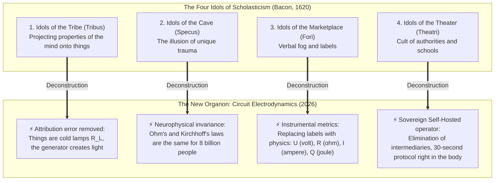

1. **Idols of the Tribe (Idola Tribus) — Attribution Error and Battery Blindness:**  
   The human mind tends to project internal properties onto external objects. People naively believed that a new car, a prestigious post, or a marriage contained the substance of happiness. They prayed to the light bulb, not realizing that the bulb is dead without a closed circuit. The "Inner Current" exposes the physics: happiness is not a thing, but the superconductive state of the current of attention ($I > 0, R_{\text{ego}} \to 0$).
2. **Idols of the Cave (Idola Specus) — The Illusion of "Unique Trauma":**  
   Every person is trapped in the cave of their personal biography. Traditional therapy spends years exploring the individual configuration of this cave: *"At what age did your mother not love you enough?"* But at the level of conservation laws, this does not matter. If you drop a hammer on your foot, Newton's law of universal gravitation has no interest in your childhood. Similarly, Ohm's law ($I = U/R$) and the Joule-Lenz law ($Q = I^2 R t$) are universal: a pinched wire of attention burns out the neural network identically in all 8 billion inhabitants of Earth.
3. **Idols of the Marketplace (Idola Fori) — Verbal Fog and the Bazaar of Labels:**  
   Words, born out of everyday convenience, have enslaved thought. Psychology is overgrown with thousands of abstract labels: "unclosed gestalt", "procrastination", "burnout", "toxicity", "imposter syndrome". A person walks among specialists for years, collecting diagnoses instead of healing. The "Inner Current" replaces the scholastic vocabulary with three fundamental variables: **the voltage of life ($U$), the conductivity of attention ($1/R$), and the useful power of the load ($P = I^2 R_L$)**.
4. **Idols of the Theater (Idola Theatri) — Blind Adoration of Priests and Schools:**  
   Psychological and esoteric schools have been built for centuries as closed sects and dogmatic theaters: psychoanalysis, Jungianism, behaviorism, gestalt. A person was placed in the dependent position of a patient, buying paid indulgences of peace of mind from priests for years. The "Inner Current" executes the Great Disintermediation: the person is handed back the **sovereign, autonomous control panel of their own circuit**. You are not a patient. You are a sovereign flight engineer.

#### The Thirty-Second Criterion of Fruits

According to Bacon, truth must bear fruit not "after 5 years of psychotherapy", but here and now:
> *If a theory claims to have understood the mechanism of peace of mind, it is obligated to demonstrate an engineering fruit in your physical body in 30 seconds.*

Right now, as you read these lines, you can apply this New Organon in practice:
- **Step 1:** Shift your attention from wandering mental noise to the physical core of your lower abdomen (*Tanden*).
- **Step 2:** Remove the parasitic resistance of the Ego — drop the argument with reality, agree that the fact right now is exactly what it is ($R_{\text{ego}} \to 0$).
- **Step 3:** Direct the freed current of attention into the nearest action — into reading these lines or the breathing of your body ($I > 0$).

What happened in this second?  
The ohmic burning in your temples vanished. The muscle spasm in your chest relaxed. A calm, steady, high-voltage warmth spread through your body.

This is exactly Francis Bacon's criterion of fruits. It is not belief, autogenic training, or hypnosis. It is the **strict mechanics of a closed electrical circuit**.

### Humanitarian Relativism: "Everyone Has Their Own Happiness"

The primary slogan by which modern culture rationalizes its impotence is relativism: *"W\ell, happiness is completely subjective! Everyone has their own truth, everyone has their own happiness: for one it is lying on a beach, for another writing poetry, for another making money."*

In the exact sciences, this claim sounds as absurd as stating: *"Electricity is subjective: in one iron electrons flow from negative to positive, while in another they move by virtue of love for the fatherland."*

Let us once and for all eliminate this gross methodological error. It arises from **confusing the physical laws of the electrical grid with the type of appliance plugged into the socket**.

Imagine a wall outlet in your home:
- You can plug in a refrigerator — and it will chill your food.
- You can plug in a space heater — and it will warm the room.
- You can plug in a high-fidelity audio system — and it will play Bach.
- You can plug in a server cluster — and it will calculate orbital trajectories.

The appliances are radically different. The output of their labor is incomparable. But **the physical laws by which electrical current travels through copper conductors to power these appliances are invariant!**  
Ohm's Law ($I = U / R$), Maxw\ell's equations, and the conservation of power apply identically to a $10 electric kettle and to a multi-billion-dollar supercomputer at CERN.

The exact same principle governs the human being.  
A person's specific activity is merely the load plugged into their circuit. One writes a symphony, another builds a suspension bridge, another raises a child, another prepares ceremonial matcha. But **the psychophysiological state of happiness** is the fundamental operating regime of the circuit itself:

$$\mathcal{H} \iff \begin{cases} R_{\text{ego}} \to 0 \\ I_{\text{attention}} > 0 \\ \sum I_{\text{in}} = \sum I_{\text{out}} \end{cases}$$

Happiness is not *what* is plugged into you.  
Happiness is **the complete absence of parasitic resistance in the conductors of your attention while performing the action.**

### Kirchhoff's Thermodynamic Balance: Falsehood Immediately Yields Ohmic Overheat

In humanitarian discourse, one can lie for decades. You can convince yourself that you are "growing spiritually" by meditating two hours a day, even while snapping at your family and despising your vocation.

In a closed thermodynamic circuit, deception is physically impossible:

$$\oint \mathbf{E} \cdot d\mathbf{l} = 0 \quad \text{and} \quad \sum_{k=1}^n U_k = 0$$

If a false mental premise is introduced into your circuit (for example: *"I must suffer for a higher purpose"* or *"My happiness depends on whether this person validates me"*), the network responds instantaneously at the physical level:
1. A voltage mismatch emerges: $\Delta U \neq 0$.
2. Parasitic resistance surges at the junction: $R_{\text{ego}} \gg 0$.
3. By the Joule–Lenz law, parasitic heat is dumped into the system:
   $$Q = I^2 \cdot R_{\text{ego}} \cdot t$$
4. You experience this thermal dissipation as a diaphragmatic spasm, a tight throat, racing tachycardia, insomnia, and pervasive dread.

Your biological body is an immaculate galvanometer. It never lies. Physical tension and psychological anguish are neither enemies nor mental disorders. They are **the diagnostic mismatch signals of your circuit**, reporting to the operator: *"You have short-circuited the loop. You are attempting to violate energy conservation. Check your resistance immediately!"*

### Clinical Disclaimer: The Hardware vs. Software Circuit Breaker
#### The Demarcation Line Between Psychoelectrodynamics and Organic Medicine

To eliminate misinterpretation and safeguard the reader, the author establishes a fundamental distinction between the **functional operating mode of the circuit** (the "software" and attention conductivity) and the **physical integrity of the biological substrate** (the "hardware" of neurobiology).

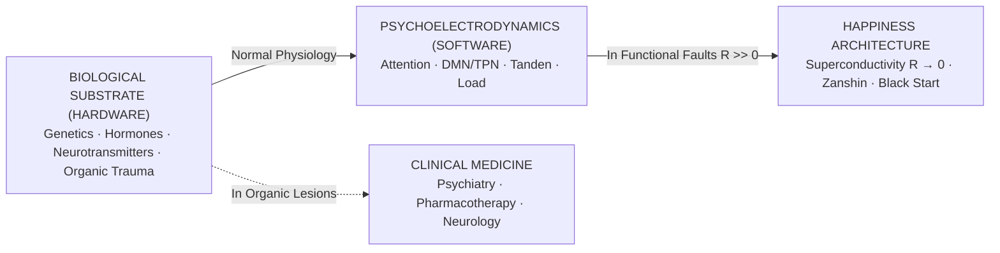

1. **When Happiness Architecture Operates:**  
   It is designed for individuals with an intact biological substrate suffering from **functional attentional dysregulation**: existential deadlocks, burnout, the Danko syndrome, codependency, chronic anxiety, repetitive DMN rumination, and loss of sovereignty. Here, the fault lies in the topology of the loop, remediable by recalibrating resistance to zero ($R \to 0$).
2. **Where the Absolute Boundary Lies:**  
   If an individual suffers from structural or neurochemical damage to the physical substrate itself — endogenous bipolar disorder, schizophrenia, acute psychosis, severe endocrine failure, CNS tumors, or hereditary neurotransmitter transporter defects — **this is not a software misconfiguration; it is a physical rupture of the cable**. In such conditions, attempting to "simply drop resistance through the Tanden" is strictly prohibited. It demands immediate evidence-based medical intervention, clinical psychiatry, and pharmacotherapy.

Happiness Architecture respects physical reality: one cannot tune electrical signals across a motherboard whose silicon is physically fractured. We begin our engineering work where the board is intact.

### ANATOMY OF SIMPLICITY: WHY DID NO ONE THINK OF THIS BEFORE?
#### The Pocket Flashlight Model, the Wheeled Suitcase Law, and 4 Reasons for Humanity's Millennial Blindness

> *"How extremely stupid not to have thought of that!"*  
> — **Thomas Huxley**, upon reading Charles Darwin's *On the Origin of Species* (1859)

If one strips away all the academic gloss of formulas, preprints, and graphs from the Architecture of Happiness, a truth is revealed that can be explained in five minutes in the kitchen over a cup of tea.

A human being is no more complex than **an ordinary pocket flashlight**. It contains merely four elements:
1. **Battery (Your Generator):** vital force in the lower abdomen (*Tanden*), breathing, body physiology. Every living being has this every morning by right of birth ($\mathcal{E} > 0$).
2. **Wire:** your **attention**. Wherever attention flows, all energy rushes there.
3. **Bulb (Load):** the task you are engaged in right now at $t = \text{now}$. Washing dishes, writing code, drinking tea, walking with your son. When the current loops into action, the bulb lights up, and you feel quiet, pure happiness.
4. **Fuse (Zanshin):** the understanding that the bulb may burn out or break, but **your generator will remain intact**.

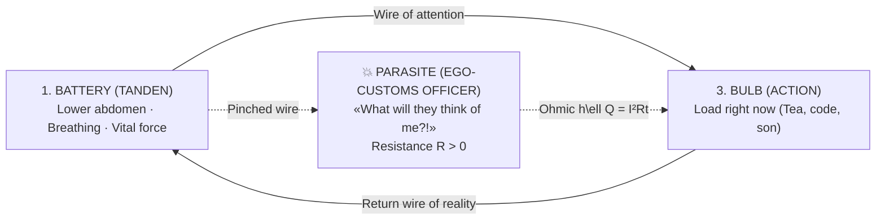

#### So where is the fault that tortures humanity?
Into this elemental circuit, man has spliced a **parasite — his EGO** (*"What will they think of me?", "What if I fail?", "They must respect me!"*).  
The ego sits on the wire of attention like a greedy customs officer, pinches the cable with its foot and demands: *"Feed me first! Prove my importance!"*.

Current from the abdomen flows, but hits resistance. And according to the Joule-Lenz law ($Q = I^2 R t$), **when current encounters resistance, the wire heats red-hot**.  
For millennia, people have called this red-hot wire "stress", "burnout", "panic attacks", and "depression". They are being fried by their own locked-in energy!

#### Why did no one think of this before?
1. **The split between physicists and lyricists:** Zen masters knew about the Tanden 2,500 years ago, but they lacked electrical circuits and voltmeters (they spoke in poems about water and the moon). 19th-century physicists knew Ohm's law, but they studied motors and wires, considering the soul the domain of priests. And psychologists were men of letters with no knowledge of conservation laws. No one brought these worlds into a single focus.
2. **The trap of the Ego itself ("The eye does not see itself"):** The mind trying to solve the problem of pain is itself the source of the pain. The Ego will never say: *"Turn me off for 30 seconds — and the pain will pass."* It profits from inventing 10-year therapies, complex diagnoses, and suffering, to remain the protagonist of the drama.
3. **The industry of intermediaries:** Simplicity and a free 30-second toggle switch are economically lethal to the trillion-dollar industries of pharma, paid psychotherapy, cults, and hyper-consumption.
4. **The law of the "wheeled suitcase" (Kanso Canon):** The wheel is 5,000 years old, suitcases are hundreds of years old, but no one thought to attach wheels to a suitcase until 1970. Steve Jobs removed 50 buttons and a stylus, leaving one button on the iPhone. The Architecture of Happiness removed 10,000 years of priestly rites and moralizing, exposing one simple 4-element circuit of direct flow.

---

# PART I: THE PHYSICAL BASIS OF THE CIRCUIT

---

### Chapter 1.1 — Anatomy of the Tripartite Circuit: Tanden (Core), Attention (Wiring), and Load (6 Lamps)

> *"Man is an open electrical loop searching for a connection. Most die from short circuits, never having illuminated a single lamp. The tripartite circuit — Generator, Conductor, and Load — is the minimal invariant architecture of human existence. If even one element is misconfigured, the entire system degrades into smoke."*  
> — **Vladimir Anyanov (Axiom I)**

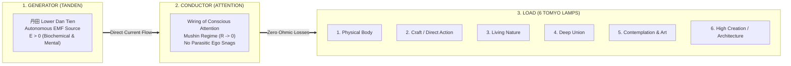

#### 1. The Generator: Tanden (丹田)
In classical Japanese culture and martial arts (Budo), the lower Dan Tien is the energetic belly of being, located three finger-widths below the navel. In the Anyanov System, this is not an esoteric chakra, but the **biological, autonomic, and somatic epicenter of the body's direct current**:
- It is the physical center of gravity of the human organism.
- Here lies the enteric nervous system (over 500 million neurons) directly interfaced with the vagus nerve.
- When awareness is rooted in the Tanden, abdominal pressure stabilizes, breathing deepens, and the body generates a robust, invariant electromotive force (EMF, $\mathcal{E}$).

The Tanden is an **autonomous reactor**. It requires no external validation to exist. It radiates simply because you are alive.

#### 2. The Conductor: Conscious Attention
Attention is the copper wiring of consciousness. 
- It possesses a cross-sectional area (the bandwidth of working memory: $7 \pm 2$ chunks).
- It possesses electrical conductivity ($\sigma$).
- Under normal, neurotically conditioned circumstances, this wiring is coated with oxidized scale: the ego-rheostat $R_{\text{ego}}$ (doubts, social comparisons, fear of judgment, continuous internal rumination).
- In the state of **Mushin (無心)**, the resistance of the wiring drops to zero ($R \to 0$). The conductor becomes a room-temperature superconductor.

#### 3. The Load: The Six Tōmyō Lamps
Human current cannot simply circulate within an empty loop; an idle circuit without load suffers insulation breakdown from overvoltage. The current must enter the world, performing real mechanical, aesthetic, or intellectual work.

In the Anyanov System, human vitality is distributed across **Six Canonical Tōmyō Lamps**:
1. **The Lamp of the Physical Body:** Somatic calibration, deep sleep, clean nutrition, muscular mastery, somatic joy of movement.
2. **The Lamp of Craft (Samu):** Direct manual or intellectual labor — writing code, woodworking, architectural drafting, financial modeling, sweeping the floor.
3. **The Lamp of Living Nature:** Direct sensory contact with non-human complexity — forests, oceans, mountain wind, the rhythm of seasons.
4. **The Lamp of Deep Union:** Clean interpersonal communion stripped of transactional parasitism and status games.
5. **The Lamp of Contemplation and Art:** Pure aesthetic perception — music, painting, silence, the dance of shadows.
6. **The Lamp of High Creation:** Building sovereign systems, writing books, engineering ventures, civilizational architecture.

> [!caution] ⚡ System Bypass Detector: Physics Cannot Be Gaslit
> The engineering model creates the temptation of intellectual evasion. A clever reader can spend years **speaking the language of superconductivity** without illuminating a single lamp: endlessly reading about the Tanden instead of going for a run; quoting the formula $R \to 0$ instead of opening the laptop and writing the first line of code.
>
> **The Six-Lamp Panel is the system's only objective lie detector:**
> $$P_{\text{load}} = \sum_{k=1}^{6} I_k^2 \cdot R_k$$
> If your daily lamps read $P_{\text{load}} \approx 0$ — the body is untrained, the work is stalled, intimacy is dead, meaning has gone dark — then no knowledge of terminology makes you a superconductor. You are a **beautifully speaking open circuit**.
>
> *You cannot declare $R = 0$ if all six lamps are extinguished. Physics cannot be gaslit.*

---

### Chapter 1.2 — The Closed Circuit Breakthrough: The Return Wire of Reality vs. The Linear Burnout Model

> *"If the generator simply ejected energy outward into endeavors, that would be the linear burnout model, reducing man to an expendable single-use battery. But the moment the hand sketched a closed electrical circuit, the Architecture of Happiness was born: in a closed loop, creation does not deplete the source; it closes it upon reality. Current is possible only where there is a return wire."*  
> — **Vladimir Anyanov**

#### 🧭 Introduction: The Alternative Blueprint That Would Have Doomed the System

In the genesis of "Inner Current," there was an unobtrusive yet entirely decisive fork in the road that determined the destiny of the entire system.

At the initial moment of committing the idea to paper, the author stood before a divergence that ninety-nine percent of historical thinkers never even noticed:

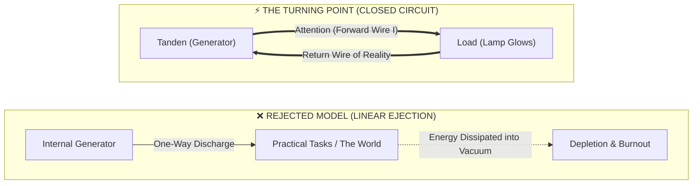

The author could simply have conceived: *"I have an energy generator inside me; I project this energy outward into tasks — and that is all."*  
This is precisely how nearly all existing doctrines of personal productivity, leadership, and spirituality are constructed:
* The Bonfire Metaphor: "Burn brightly, warm others."
* The Fountain Metaphor: "Pour your energy out into the world."
* The Battery Metaphor: "Expend your charge on your goals."

Yet in his notebook, the author sketched neither a ray, nor a bonfire, nor a fountain. He drew a **closed schematic electrical circuit**.  
This single choice became the watershed separating humanitarian poetry from the **exact engineering science of human happiness**.

---

#### ⚡ 1. The Electrodynamic Prohibition: Why Current Is Zero in an Open Circuit ($I = 0$)

The first and paramount consequence of choosing a closed circuit is absolute compliance with the laws of physics.

In electrodynamics, an immutable law operates: **electric current cannot exist in an open loop**.
* If a conductor is broken or the circuit is not closed back to the source's zero-potential reference, the resistance of the gap approaches infinity ($R \to \infty$).
* By Ohm's Law ($I = U / R$), as $R \to \infty$, current is strictly zero:
  $$\lim_{R \to \infty} I = 0$$

##### What Does This Mean in the Language of the Human Psyche?
No matter what colossal potential (voltage $U$, ambition, talent, raw desire) resides within a person, if their circuit is not closed upon a real load:
1. **Current is Zero ($I = 0$):** The person physically cannot initiate action. The phenomenon of paralyzing procrastination emerges.
2. **Static Overpressure:** Potential difference unmanifested in motion turns into electrostatic pressure. The person feels "bursting from within"; anxiety spikes, triggering panic attacks and insomnia.
3. **The Illusion of Powerlessness:** The individual concludes: *"I have no energy."* The engineer diagnoses the exact inverse: *"You have an excess of voltage, but your circuit is open. Close the loop upon the simplest physical action!"*

---

#### 🔥 2. Deconstruction of the Danko Myth: The Linear Burnout Model

The open model ("the generator expends outward, full stop") carries a perilous cultural virus — **the romanticization of sacrificial burnout**.

The quintessential archetype is Gorky's Danko, who ripped the flaming heart from his chest to illuminate the path for his people, only to collapse dead.
* In a linear model, giving energy inevitably implies **depleting the source**.
* The individual enters an unconscious transactional bargain: *"If I pour myself out at work or in relationships, I destroy myself. The world becomes richer, while I am left with nothing."*
* From this arises the toxic martyr syndrome: latent resentment toward loved ones, score-keeping with colleagues, dread of exhaustion, and demands for eternal gratitude (*"I sacrificed my life for you!"*).

**The Anyanov Closed Circuit dismantles this neurosis at the root.**  
In a closed loop, electrons are not jettisoned into deep space — they circulate around the ring.
* The Tanden generator does not "burn" itself. It establishes a potential difference that sets the current of attention into motion.
* The current performs useful work within the load lamp ($P = I^2 R_{\text{load}}$).
* And via the return wire, the circuit closes back into the Tanden!

In the state of superconductivity ($R \to 0$), **the creator is not depleted by work, but charged by it**. This provides the exact physical explanation for the phenomenon of Flow: the great surgeon standing at the operating table for twelve hours steps out composed, invigorated, and replenished, because their loop was impeccably closed upon the living fabric of reality.

---

#### 🔄 3. The Return Wire of Reality: What Returns Current to the Tanden?

What constitutes the "return wire" of the circuit schematic in actual human experience?

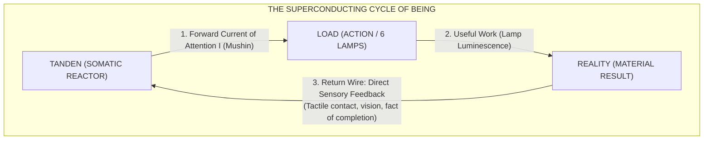

The return wire is **direct sensory and ontological contact with the fact of what has been created**:
1. You pick up a knife and slice vegetables: the blade contacts the board, crisp sound registers, the salad is finished. Sensory feedback returns to the soma. The loop closes.
2. You write a block of code: unit tests pass, the function yields output. The circuit closes.
3. You look into the eyes of someone you love and speak truth: the live response of their gaze closes the circuit of attention.

When the return wire is plugged into reality, the mind possesses zero space for parasitic doubt. Energy is never lost — it underwent a phase transition into light and returned to the Tanden as a profound state of stillness and plenitude.

---

#### 🎛️ 4. The Metrological Triumph: Kirchhoff's Laws as the Engine of the Diagnostic Machine

It was precisely the closed topology of the circuit that enabled "Inner Current" to become the first **rigorous diagnostic machine of happiness**, rather than a vague compendium of psychological self-help.

In an open flood, precise measurement is impossible: if water gushes from a ruptured hose across a field, one cannot calculate how many liters were lost along the way.  
Yet the moment the circuit is declared a **closed thermodynamic system**, Kirchhoff's fundamental laws apply without exception:

##### 1. Kirchhoff's First Law (Current Balance at a Node):
$$\sum I_{\text{in}} = \sum I_{\text{out}}$$
Whatever power the Tanden outputs must pass through the loop. Energy cannot simply vanish into nothingness. If the load lamp fails to illuminate at rated brilliance, a parallel leakage branch has formed:
$$I_{\text{tanden}} = I_{\text{load}} + I_{\text{leak}} + I_{\text{ego}}$$

##### 2. Kirchhoff's Second Law (Loop Voltage Balance):
$$\sum \mathcal{E} = \sum U_k$$
The algebraic sum of potential drops across all segments of the loop strictly equals the EMF of the source. If a person feels a collapse of vigor ($\Delta U < 0$), it is neither a mystical curse nor "karmic debt" — it is a measurable voltage drop across the parasitic resistor of future anxiety ($R_{\text{future}}$) or past grievance ($R_{\text{past}}$).

The closure of the loop endowed the system with **mathematical rigor and Popperian falsifiability**. Any psychic malfunction became subject to precise localization: the circuit multimeter immediately pinp\oints which node has experienced breakdown.

---

#### 🌐 5. Dissolution of the Metaphysical Schism: "Self vs. World"

The central philosophical tragedy of Western man is the estrangement between subject ("I", locked inside the cranium) and object ("The Outer World", hostile or indifferent).

In an open model, this division is exacerbated: the "Self" must squander its precious life force upon an alien "World."

In the Anyanov Closed Circuit, the **great ontological healing** occurs:
* **The load lamp is not an alien world. It is a node of your own circuit!**
* The world enveloping the creator is the continuation of their own wiring. When you build a house, paint a canvas, teach a child, or clean a room, you are not "giving yourself away to the world" — you are closing your own circuit through the matter of the Universe.
* Man and existence merge into a **single superconducting hyper-circuit**.

---

#### 💎 Summary: Why Closed Topology Was the Master Discovery

The hand-drawn sketch of a closed circuit on paper marked the grand divide:
1. It inoculated the system against the poison of martyrdom and burnout.
2. It provided the strict mathematics of energy conservation laws and Kirchhoff's balances.
3. It explained why creative action replenishes man rather than exhausting him.
4. It bonded the somatic reactor of the body (Tanden), the wiring of attention (Mushin), and the endeavors of life (the 6 Lamps) into an unbroken ring of perpetual current.

Current flows so long as the circuit remains closed. And so long as the circuit is closed — the lamp shines. ⚡

---

### Chapter 4.7 — The Anyanov Triad and Tetrad: Truth, Freedom, Happiness, Creation — Deconstruction of Free Will and Autobiographical Synthesis

> *"Happiness is when Truth is felt. Freedom is when Truth acts. Truth is when there is zero resistance to what is. Creation is the total power of the sovereign reactor unleashed into the universe."*  
> — **Vladimir Anyanov (Axiom XVIII)**

#### 1. Deconstruction of Free Will: Yuri Menyachikhin's Advaita and Circuit Physics
For decades, neuroscientists (Libet, Sapolsky) and philosophers have fought over free will:
- Determinists assert: *"All thoughts are preconditioned by prior causes; free will is an illusion."*
- Moralists protest: *"Without free will, moral responsibility collapses."*

The Anyanov System resolves this through Advaita master Yuri Menyachikhin:
- **There is no separate 'controller' inside the skull pushing neural buttons.**
- Thoughts, sensations, and worldly events arise spontaneously out of the cosmic field.
- **Where does freedom reside?**  
  Freedom resides in the **conductivity of the conductor ($R$)**!  
  A neurotic is a slave because their circuit is jammed with high resistance ($R_{\text{ego}} \gg 0$); every incoming stimulus triggers an automated spasm of rage or fear.  
  The liberated master in **Mushin ($R = 0$)** is completely free: reality passes through them without friction, and action is an unmediated, pure, optimal response to the moment.

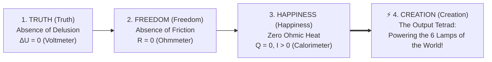

#### 2. The Anyanov Golden Triad: Sat-Chit-Ananda in Circuit Design
The ancient Vedantic definition of absolute consciousness is **Sat-Chit-Ananda**:
- **Sat (Truth / Existence):** The Voltmeter. Voltage balance $\Delta U = 0$. Absolute contact with reality as it is.
- **Chit (Consciousness / Freedom):** The Ohmmeter. Zero resistance $R = 0$. Pure unobstructed attention.
- **Ananda (Bliss / Happiness):** The Calorimeter. Zero ohmic heat $Q = 0$, steady current $I > 0$.

#### 3. The Law of Causal Hierarchy: Why the Sequence Is Invariant
You cannot alter the order:
$$\text{Truth} \longrightarrow \text{Freedom} \longrightarrow \text{Happiness} \longrightarrow \text{Creation}$$
1. If you attempt to seize **Happiness** while bypassing **Truth**, you produce cheap delusional drug escapes or toxic positivity.
2. If you attempt **Freedom** without **Truth**, you produce destructive sociopathy.
3. Only when grounded in brutal **Truth**, **Freedom** ignites; **Happiness** stabilizes as a byproduct, and **Creation** pours into the world with infinite force.

#### 4. The Creator's Tetrad: Energizing the Shield of 6 World Lamps
Creation is the crown of the circuit. A person who achieves internal superconductivity does not sit like a petrified stone idol.  
They become a **Supreme Creator (Homo Creator)**:
- They design architecture;
- They write immortal literature;
- They build revolutionary technologies;
- They transform society through pure, unhindered power.

#### 5. The Author's Autobiographical Proof: Vladimir Anyanov's Journey
My personal trajectory was the living laboratory where this circuit was soldered in blood and sweat:
- **Phase 1: The Trap of Moral Asceticism (The Tolstoy Phase):** Years of guilt, feeling that natural human desires for wealth, sex, and grandeur were sinful. An agonizing internal civil war.
- **Phase 2: The Spiritual Illusion (The Osho Phase):** Seeking enlightenment as an escapist fantasy, hoping that mystical awakening would magically fill my starving personality.
- **Phase 3: The Cold Shower of Sobriety (Yuri Menyachikhin Phase):** Understanding that spirituality cannot feed an empty human personality; shattering the spiritual ego.
- **Phase 4: The Lightning on the Treadmill (The Birth of Inner Current):** Synthesizing Zen somatics with electrical engineering, proving that human happiness is an exact physical state of superconductivity.
- **Phase 5: The Anyanov System:** Unifying personal superconductivity, monetary sovereignty (Bitcoin), and economic freedom (Henry George) into a complete civilizational paradigm.

---

### Chapter 4.8 — The Millennial Synthesis: How Circuit Electrodynamics Dissolved the Seven Eternal Questions of Humanity

> *"Why did the greatest minds in history — from Plato and Aristotle to Descartes, Kant, Schopenhauer, and Sartre — fail to definitively solve the foundational questions of life? Because they were searching for the mass of phlogiston. They operated within humanitarian linguistic frameworks that lacked the physics of conservation laws. Inner Current is the Millennial Synthesis: we did not provide clever answers; we dissolved the false questions in the crucible of electrodynamics."*  
> — **Vladimir Anyanov**

#### 1. The Epistemological Deadlock: The Phlogiston and Caloric Metaphor
Before Antoine Lavoisier established modern chemistry in 1789, scientists explained combustion via **phlogiston** — an imaginary, weightless "fire fluid" supposed to leave substances when burned. When metals *gained* weight upon oxidation, chemists invented "phlogiston with negative weight"!  
Identically, before thermodynamics, physics explained heat through **caloric**.

Centuries of philosophy operated identically:
- Inventing metaphysical "caloric" (Original Sin, teleological destiny, astral karma).
- Multiplying scholastic epicycles to explain why man continues to burn in anxiety.

Once thermodynamics demonstrated that heat is merely **molecular motion**, the question of caloric evaporated.  
Once Inner Current demonstrated that suffering is merely **ohmic dissipation ($Q = I^2 R t$)**, the ancient philosophical quandaries dissolved.

#### 2. Anatomy of the Bottom-Up Method and Consilience
The Millennial Synthesis embodies **Consilience** — the convergence of evidence from independent disciplines (Edward O. Wilson):
- Solid-State Physics (Superconductivity);
- Classical Electrodynamics (Maxw\ell, Ohm, Joule–Lenz);
- Thermodynamics (Conservation of Energy, Negentropy);
- Neurobiology (DMN / TPN / Vagus);
- Zen Ontology (Tanden / Mushin / Zanshin).

When five independent sciences yield the identical equation, the debate is over.

#### 3. The Great Matrix: Resolving the 7 Eternal Paradoxes of Humanity

| № | Ancient Paradox (2,500-Year Deadlock) | The Humanitarian Deadlock | Anyanov Circuit Solution (Electrodynamic Consilience) |
|:---:|---|---|---|
| **1** | **Free Will vs. Determinism** | Infinite dispute: are we mechanical puppets of physics or uncaused metaphysical gods? | **Conductivity ($R \to 0$) in the present coordinate.** The operator does not dictate the laws of physics, but directly governs attention impedance at $t = t_{\text{now}}$. A slave is choked with $R_{\text{ego}} \gg 0$; a liberated master in Mushin is a superconductor responding with optimal, zero-friction accuracy. |
| **2** | **Theodicy and the Problem of Evil** | Epicurus's trilemma: If God is omnipotent and benevolent, whence comes evil? | **Ohmic Overheat & Insulation Breakdown.** Evil is not a metaphysical substance. What humans term "evil" is either the thermal blast of ruined wiring ($Q = I^2 R t$) when a human strikes out from inner agony, or an **Ego Short Circuit** parasitical feeding loop. Evil is broken insulation, not a cosmic demon. |
| **3** | **Karma and Cosmic Justice** | Why do ruthless tyrants thrive while saints suffer? Is there a post-mortem trial? | **Instantaneous Local Thermodynamics.** The observer errs by judging the physical envelope (mansions, yachts). Under Joule's law, an individual with a short-circuited ego, fear, and paranoia **melts from within right now ($Q \gg 0$)**, regardless of external luxury. Karma is the instantaneous temperature reading on the somatic galvanometer. |
| **4** | **Fear of Death and Non-Being** | Epicurus's syllogism: "Death is nothing to us; when we exist, death is not, and when death exists, we are not." Yet human terror remains. | **Nominal Open-Circuiting of Form Under Field Conservation.** By the First Law of Thermodynamics, energy cannot vanish. The biological bulb has a finite duty cycle under Wabi-Sabi. Death is the scheduled opening of a mechanical switch; the underlying electromagnetic field of being is immortal and invariant. In superconductivity, the fear cannot compile. |
| **5** | **Identity Crisis (Ship of Theseus)** | If every plank of a ship (and every c\ell of the body) is replaced, is it the same ship? Where is the "I"? | **Prigogine's Dissipative Structure & Topological Invariance.** A human being is not a static rock; they are a dynamic vortex or flame. Matter flows through continuously, yet the circuit topology (Tanden $\leftrightarrow$ Mushin $\leftrightarrow$ Load $\leftrightarrow$ Zanshin) and weight matrix of experience endure. A shattered bulb is not the death of the generator. |
| **6** | **The Hedonistic Paradox** | The direct pursuit of pleasure inevitably leads to satiation, disgust, and depression. | **Reverse Current Breakdown & Receptor Downregulation.** Attempting to energize the internal reactor from the external lamp ($\mathcal{E}_{\text{load}} \equiv 0$) burns out the nervous system. Happiness is not a target; it is the thermodynamic byproduct of superconductivity ($R \to 0$) while channeling nominal power into creative craft (Samu). |
| **7** | **Loneliness & Solipsism (The Problem of Other Minds)** | One cannot logically prove that others are not philosophical zombies (p-zombies) simulating emotion. | **Galvanic Isolation ($R_{\text{iso}} \to \infty$) vs. Faraday Inductive Resonance ($\mathcal{E}_2 = -M \frac{dI_1}{dt}$).** Solipsism is an emergency insulating barrier erected by fear. True intimacy is the alternating magnetic resonance between two sovereign generators. In a shared electromagnetic field, a philosophical zombie is a physical impossibility: without an internal EMF, no mutual resonance can occur. |

#### 4. The Kanso Canon: Dissolution Rather Than Argument
The highest secret of the Anyanov System is not that it invented "more convoluted answers." It applied the supreme Zen canon of **Kanso (簡素 — Radical Simplicity)**:

> **The Law of Epicycle Dissolution:**  
> All seven "eternal questions" of humanity were never reflections of cosmic depth. They were the **somatic alarm codes of an overloaded, overheated circuit**, triggered exclusively when ego-resistance is non-zero ($R_{\text{ego}} > 0$).

1. As long as the ego seeks to control the universe $\longrightarrow$ the **free will** debate rages.
2. As long as the ego demands a personal celestial babysitter $\longrightarrow$ the **theodicy** dilemma persists.
3. As long as the ego envies external loads and hoards bitterness $\longrightarrow$ the **karma** neurosis festers.
4. As long as the ego confuses itself with the glass bulb $\longrightarrow$ the **death panic** terrorizes.
5. As long as the ego attempts to petrify itself into a monument $\longrightarrow$ the **Theseus crisis** paralyzes.
6. As long as the ego tries to extract electricity from external gadgets $\longrightarrow$ the **hedonistic trap** snaps shut.
7. As long as the ego wraps itself in the dielectric armor of pride $\longrightarrow$ the **solipsistic freeze** isolates.

The instant the operator applies the Blade of Kanso and drops resistance to zero ($R \to 0$):
- The operator enters pure **Mushin**;
- Ohmic thermal dissipation halts ($Q = 0$);
- The dilemmas do not require intellectual debate — **they simply evaporate**, just as Ptolemy's epicycles dissolved in Copernicus's sunlight.

#### 5. The Historical Triad: Mechanics, Finance, Happiness

In civilizational history, there stand three pivotal breakthroughs where mystical superstition surrendered to sovereign conservation:

```
  1687: ISAAC NEWTON (Laws of Classical Mechanics)
  ───────────► Celestial motions transferred from arbitrary divine whimsy 
               into the exact calculus of universal gravitation (F = G·m₁m₂/r²).

  2008: SATOSHI NAKAMOTO (Bitcoin)
  ───────────► Trust and monetary value transferred from central banking discretion 
               into mathematical cryptographic consensus (Proof-of-Work).

  2026: VLADIMIR ANYANOV (Inner Current / The Architecture of Happiness)
  ───────────► Happiness, purpose, and inner peace transferred from vague poetry, 
               theological terror, and psychological guessing into reproducible 
               engineering electrodynamics (R → 0, Tanden Reactor).
```

Humanity no longer needs to waste its life ruminating over existential riddles. The questions are closed. The laws are formulated. The meters are calibrated.

Before the sovereign creator lies the pristine **Anyanov Tetrad**:  
**Truth (Tolstoy) $\longrightarrow$ Freedom (Osho) $\longrightarrow$ Happiness (Inner Current) $\longrightarrow$ Creation (Anyanov System).**

The circuit is closed. Superconductivity is realized. The network functions flawlessly. ⚡💎

---

---

### Chapter 4.9 — Electrodynamics of Art: The Two Natures of Creativity — From Bleed Resistor of Trauma to Inductive Resonance of Superconductivity

> *“For centuries humanity believed in the poisonous myth that an artist must be hungry, sick, and miserable to create. In the circuitry of the spirit, this is the greatest attribution error. Pain is not the source of art; it is the alarm whistle of an exploding boiler. When the circuit is broken, art serves as a bleed resistor, saving the artist from destruction. But authentic, supreme art begins only when resistance falls to zero ($R \to 0$): it becomes pure inductive resonance of superconductivity ($M > 0$), illuminating entire civilization.”*  
> — **Vladimir Anyanov**

#### 1. The Artist's Existential Fear: “Will I Stop Creating If I Become Happy?”

For centuries, world culture has cultivated the romantic cult of the wounded genius. Vincent van Gogh slicing off his ear, Kurt Cobain pulling the trigger, Franz Kafka consumed by metaphysical angst, Sylvia Plath, Sergei Yesenin, Virginia Woolf. In the collective mind, a disastrous axiom became entrenched: *“To produce great art, one must bleed. Happiness is pedestrian, complacent, and dull; a healed human becomes a sleepy bourgeois incapable of creating a single piercing line”*.

Because of this myth, countless poets, musicians, filmmakers, and painters dread internal recalibration and engineering hygiene. They cling to their trauma, childhood wounds, and depression as if to a sacred fire, terrified that if the ache subsides, their talent will be snuffed out.

**Inner Current offers the first rigorous electrodynamic resolution to this paradox:**
Suffering is not the generator of genius. Pain is the **ohmic overheating ($Q = I^2 R t$)** of an open circuit.

Art functions in two diametrically opposed circuit operating modes:
1. **First Nature Art:** *The Bleed Resistor* in the emergency open-circuit regime.
2. **Second Nature Art:** *The Noble Load and Pure Inductive Resonance ($M > 0$)* in the superconductive state ($R \to 0$).

```
MODE 1: BLEED RESISTOR (TRAUMA SHUNT)            MODE 2: SUPERCONDUCTIVE RESONANCE (ABUNDANCE)
Open circuit, Ego burns in ohmic overheat        Closed circuit, R_ego -> 0, Somatic Tanden
┌──────────────┐                                ┌──────────────┐
│  TANDEN (E)  │                                │  TANDEN (E)  │
└──────┬───────┘                                └──────┬───────┘
       │                                               │ Current I
       ▼ R_ego > 0                                     ▼ R_ego = 0 (Mushin)
┌──────────────┐  Emergency Bleed               ┌──────────────┐  Induction M > 0  ┌──────────────┐
│  EGO SHUNT   ├────────────────► [   ART    ]  │  NOBLE LOAD  ├════════════════►│  AUDIENCE    │
│  (Overheat)  │  Pressure drain  (Pain cry)    │  (CREATION)  │  Pure resonance │ (Superconduc-│
└──────────────┘                                └──────┬───────┘                 │    tivity)   │
                                                       │                         └──────────────┘
                                                       ▼ Return wire of reality
                                                [RETURN TO TANDEN]
```

---

#### 2. First Nature: Art as a Bleed Resistor

In high-power electronics, when lethal high-voltage capacitive charges build up across a rectifier bank, engineers bridge a **bleed resistor** across the terminals. Its sole job is to slowly bleed off excess energy as heat, preventing the capacitors from detonating and destroying the equipment.

Art performs this identical emergency function for the wounded human spirit:
1. **Existential Circuit Rupture:** Catastrophic early trauma (loss of a parent, rejection, violence) severs the primary return line of trust in reality.
2. **Ohmic Impasse:** The somatic Tanden reactor continues pumping fierce life current ($I$), but it cannot flow outward into spontaneous, open action: the path is blocked by hyper-vigilance and terror ($R_{\text{ego}} \gg 0$). By the Joule-Lenz law, the trapped current begins melting the psyche from within.
3. **Art as Safety Valve:** Writing a song, poem, or painting opens an emergency shunt. The artist discharges the lethal overvoltage onto paper, canvas, or tape. Boiler pressure drops by 15%, and imminent breakdown or suicide recedes.

The artist exclaims: *“Music saved my life!”*.  
Indeed it did. But precisely in the same manner that a pressure cooker safety valve saves the kitchen ceiling from soup explosion: it is an **emergency fault-handling routine**, not nominal supersonic cruising flight.

##### Case Study: Italian Songwriter Levante and the Anatomy of “Vivo”

The most luminous contemporary manifestation of this phase shift is the masterpiece by Italian singer-songwriter **Levante (Claudia Lagona)**: **“Vivo”** (Sanremo 2023), composed in the aftermath of severe postpartum depression.

Having lost her father at the age of nine, Levante carried that foundational fracture in her nervous system for decades, relying on songwriting as her **Bleed Resistor**. The birth of her daughter triggered an intense neuro-hormonal earthquake that shattered her former coping defenses.

The authentic lyrics of “Vivo” constitute an exact electrodynamic telemetry reading of an operator fighting her way into superconductivity:

```text
Vivo
O sorrido o piango, non so fare altro
Mi emoziono con poco, gioco ancora col fuoco
Bacio rime, bacio bene, ti bacio dopo
Ho sorriso tanto dentro a questo pianto 

Ho voglia di credere di poter farcela
A costo di cedere parti di me
Ho voglia di cedere a questa speranza
Per poter credere tutta la vita che

Vivo come viene
Vivo il male, vivo il bene
Vivo come piace a me
Vivo per chi resta e chi scompare
Vivo il digitale
Vivo l’uomo e l’animale
Vivo l’attimo che c’è
Vivo per la mia liberazione
Vivo un sogno erotico
La gioia del mio corpo è un atto magico
Vivo un sogno erotico
La gioia del mio corpo è un atto magico

O respiro o affanno, come stare al mondo?
Mi sorprendo con poco, credo nel Dio che prego
Padre nostro, Padre, posso andare in cielo?
Ho il destino stanco, forse ho corso tanto

Ho voglia di prendere tutto il possibile
Non voglio perdermi niente di me
Ho voglia di credere “nulla è impossibile”
Vorrei provarci per tutta la vita che

Addio
A tutti i “dovrei”
A tutti i “se poi”
A tutti i miei perché
Perché? Perché? Perché? Perché? Perché? Perché? Perché? Perché?
```

Engineering line-by-line decoding reveals:

1. **Bipolar Oscillations of the Open Circuit (Verse 1):**  
   *“O sorrido o piango, non so fare altro / Mi emoziono con poco, gioco ancora col fuoco...”*  
   Lacking the neutral conductor Mushin, attention swings violently between extreme voltage swings. To feel alive, she must “play with fire” — escalating frictional resistance ($Q = I^2 R t$).
2. **Danko’s Sacrificial Trap (Pre-Chorus 1):**  
   *“Ho voglia di credere di poter farcela / A costo di cedere parti di me...”*  
   The classic delusion of the wounded ego: believing that salvation must be purchased by amputating and surrendering chunks of one's being.
3. **The Superconductive Breakthrough and Tanden Reactor Igniting (Chorus):**  
   * `Vivo come viene` — Taoist **Wu Wei** (frictionless laminar flow);
   * `Vivo il male, vivo il bene` — zeroing out the moralistic rheostat of guilt;
   * `Vivo per chi resta e chi scompare` — Zen canon **Ichigo Ichie** (non-attachment to transient forms);
   * `Vivo l’attimo che c’è` — **the absolute coordinate invariant $t = \text{now}$**;
   * `Vivo per la mia liberazione` — **Freedom (Liberation)** as the Second Pillar of the Anyanov Tetrad;
   * `Vivo un sogno erotico / La gioia del mio corpo è un atto magico` — **the triumph of the somatic Tanden reactor**! The body is no longer a cursed sh\ell of shame: somatic joy is recognized as the ultimate magic of existence.
4. **Echo of Childhood Loss (Verse 2):**  
   *“Padre nostro, Padre, posso andare in cielo? / Ho il destino stanco, forse ho corso tanto...”*  
   The nine-year-old child's unhealed grief surfaces, asking the Heavenly Father if she can surrender to the sky after exhausting ohmic friction in the hamster wheel of ego striving.
5. **The Decisive Strike of Kanso's Blade (Outro):**  
   *“Addio / A tutti i “dovrei” / A tutti i “se poi” / A tutti i miei perché...”*  
   The absolute zenith of the Zen canon **Kanso (簡素)**. With three surgical cuts, Levante severs the primary parasitic resistances:
   * **Farew\ell “dovrei” (“I should”)** — elimination of oppressive external moral debt;
   * **Farew\ell “se poi” (“what if”)** — extinction of projective anxiety over hypothetical futures;
   * **Farew\ell “perché” (“why”)** — halting the cognitive death-spirals that incinerate living power.

Levante intuitively discovered the laws of the Sovereign Circuit through her somatic gut. But without engineering circuit diagrams, she had to pay for this breakthrough with months of depression, striking sparks in the dark. **Inner Current transforms that fragile spark into a permanent, hardened power grid with a direct-throw toggle.**

---

#### 3. Leo Tolstoy: Mutual Induction ($M > 0$) and the Catastrophe of the Moral Rheostat

In 1897, after fifteen years of agonizing inquiry, Leo Tolstoy published his treatise **“What is Art?”**. Tolstoy made a staggering theoretical breakthrough, anticipating the electrodynamics of Inner Current:

##### 1. Discovery of Mutual Induction ($M > 0$)
Shattering the hedonistic aesthetic dogma (Kant, Baumgarten) that reduced art to idle amusement, Tolstoy formulated a strictly communicational law:
> *“Art is a human activity consisting in this, that one man consciously, by means of certain external signs, hands on to others feelings he has lived through, and that other people are infected by these feelings and also experience them.”*

In circuit theory, Tolstoy discovered **Faraday-Maxw\ell mutual inductance**:
$$\mathcal{E}_2 = -M \frac{dI_1}{dt}$$
The creator is the primary circuit carrying current $I_1$. The artwork is the oscillating electromagnetic field. The observer is the secondary circuit. When the artist’s current is authentic and pure, **inductive resonance ($M > 0$)** takes hold: the receiver experiences the exact state of the creator across empty space without physical wires!

##### 2. Tolstoy's Tragic Engineering Fault: The Moral Rheostat ($R_{\text{moral}} \to \infty$)
Yet immediately after this revelation, Tolstoy committed a disastrous error. Captured by moralistic ascetic zeal, he mandated that art must transmit *only* feelings of peasant Christian brotherhood and self-denial.

Tolstoy wired a **massive moral rheostat ($R_{\text{moral}} \to \infty$)** into the circuit.
The results were devastating:
* He condemned Beethoven’s Ninth Symphony as “corrupt, divisive art” (claiming it was incomprehensible to simple folk);
* He denounced Shakespeare, Baudelaire, and the Impressionists;
* He renounced his own supreme masterworks (*“War and Peace”* and *“Anna Karenina”*), branding them aristocratic frivolities.

Tolstoy choked the living inductive current beneath the deadweight of moralistic oughts, vaporizing creative joy into the ohmic ash of self-punishment.

---

#### 4. Second Nature: Superconductive Art and Inductive Resonance of Abundance

What happens to creativity when an operator masters the Architecture of Happiness and their somatic circuit locks into zero resistance ($R_{\text{ego}} \to 0$)?

**Will they stop writing poetry, composing symphonies, and engineering marvels?**

The answer is an **emphatic NO**. It is precisely in this state that True Art is born:
1. **From Drain to Transmitter:** Art ceases to be a crutch, a therapy session, or an attempt to numb agony. It becomes a **pure celebration of Being**.
2. **Exponential Power Output:** When 90% of reactor output is no longer incinerated by anxiety, guilt, and resentment ($Q \to 0$), that immense reserve feeds directly into creative load work ($P_{\text{load}} = I^2 R_{\text{load}}$).
3. **Sovereign Autonomy:** The superconductive creator does not beg for applause (Zanshin posture). They do not pander to critics or traffic in their wounds. They speak directly from the core of reality.
4. **Pure Inductive Resonance ($M > 0$):** Works created from superconductivity do not infect listeners with the toxic fog of neurosis: they induce **the identical high-voltage current of clarity, vitality, and awe**, awakening the sleeper’s own Tanden!

This is the music of Bach, late Mozart, Japanese Raku teaware, ancient sacred architecture, and enduring poetry — art born not of deprivation and collapse, but of **overflowing abundance**.

---

#### 5. The Fourth Pillar of the Anyanov Tetrad: Truth $\to$ Freedom $\to$ Happiness $\to$ CREATION

In Chapter 4.7, we established the foundational causal invariant:

$$\mathbf{Truth} \longrightarrow \mathbf{Freedom} \longrightarrow \mathbf{Happiness} \longrightarrow \mathbf{CREATION}$$

It is now obvious why **Creation** occupies the fourth position:
* Attempting to create prior to Truth and Happiness traps one in First Nature Art — exhausting toxicity release, self-destruction, and burnout.
* When the complete Tetrad is realized:
  1. The operator discovers the **Truth** of natural circuits (dismantling ego delusions);
  2. Wins **Freedom** from the ohmic friction of guilt and dread;
  3. Stabilizes in the **Happiness** of continuous superconductivity at $t = \text{now}$;
  4. Inevitably surges into **CREATION** — composing music, launching enterprises, building bridges, raising families, and lighting civilization with sovereign illumination.

The artist is no longer a doomed martyr. In the Anyanov System, the artist is the **Superconductive Master of Reality**. 🎻⚡️🎨

---


# PART V: THE DIAGNOSTIC MACHINE, TELEMETRY, AND PRACTICAL WORKBOOK

---

### Chapter 5.1 — The Diagnostic Machine: Pain-First Principle, 5 Human Circuit Failure Codes, and Repair Protocols

> *"When the Check Engine light flashes on an automobile dashboard, the driver does not chant affirmations or visualize warm light. They plug an OBD-II diagnostic scanner into the port, read the exact fault code, and replace the failing sensor. The human circuit operates under identical logic: psychic pain is an electrical diagnostic trouble code (DTC). Read the code, locate the fault, and resolder the connection."*  
> — **Vladimir Anyanov (Axiom XIX)**

#### 1. The Pain-First Principle: Starting from the Fault
Traditional personal development begins with abstract aspirations: *"Picture your best self! Set five-year goals!"*  
This is like stepping on the gas in a vehicle with a blown cylinder gasket: it guarantees an engine explosion.

The **Anyanov System** begins with the **Pain-First Principle**:
- **Pain is the primary diagnostic telemetry.**
- We do not run from somatic pain, nor do we romanticize it.
- Pain is the voltage drop $\Delta U$ across a damaged resistor, signaling: *"An ohmic fault is present."*
- We locate the fault immediately, cut power to the damaged branch, restore insulation, and only then ramp up operational current.

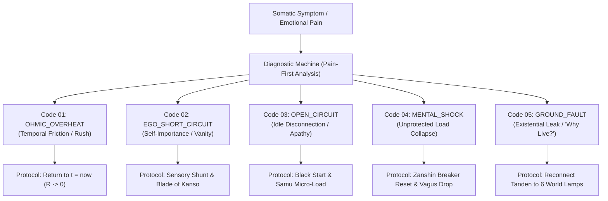

#### 2. The Registry of 5 Foundational Human Circuit Fault Codes:

##### 🔴 Fault Code 01: OHMIC_OVERHEAT (Ohmic Overheat / Burnout)
- **Somatic Telemetry:** Throbbing temples, tightness in the jaw, racing pulse, mental static, feeling that time is running out.
- **Circuit Failure:** Severe temporal reactance ($R_{\text{temporal}} \gg 0$). Attention is snared in memory chokes ($X_L$) or charging future panic capacitors ($X_C$).
- **Repair Protocol:** The **Now-Clamp Protocol**. Stop all movement for 60 seconds. Fixate your eyes on three stationary physical objects. Take three prolonged exhalations. Drive $\Delta t \to 0$. Resistance drops to zero.

##### 🔴 Fault Code 02: EGO_SHORT_CIRCUIT (Short Circuit Across Ego)
- **Somatic Telemetry:** Tight constriction in the throat, clenched solar plexus, obsessive loops of wounded pride: *"How dare they speak to me like that? Do they know who I am?"*
- **Circuit Failure:** A parasitic shunt loop has closed across the Ego ($R_{\text{ego}}$). Current is stolen from the external load and looped internally, generating destructive thermal fire ($Q = I^2 R t$).
- **Repair Protocol:** The **Blade of Kanso**. Acknowledge: *"The entity feeling insulted is merely a virtual subroutine in the DMN."* Engage the **Sensory Shunt**: wash your hands in cold water, feel the physical sensation of skin on skin, direct 100% of current into the immediate physical task.

##### 🔴 Fault Code 03: OPEN_CIRCUIT (Open Circuit / Depressive Apathy)
- **Somatic Telemetry:** Heaviness in the limbs, leaden lethargy, inability to get out of bed, feeling that reality is grey and tasteless.
- **Circuit Failure:** The switch is open ($I = 0$). The Tanden generator is running on idle, while no load is connected. Unused electromotive force induces self-discharging existential decay.
- **Repair Protocol:** The **Black Start Micro-Load**. Do not attempt to fix your life. Connect a microscopic physical load: make the bed, drink a glass of water, wash a ceramic plate. Execute it with 100% Mushin attention. The loop closes; current starts flowing.

##### 🔴 Fault Code 04: MENTAL_SHOCK (Generator Damage via Unprotected Load Collapse)
- **Somatic Telemetry:** Acute panic, vertigo, nausea, sense of world collapse following betrayal, financial loss, or dismissal.
- **Circuit Failure:** An external load exploded, and the absence of a Zanshin circuit breaker allowed an inductive back-EMF surge ($U_{\text{spike}} = -L \frac{dI}{dt}$) to punch into the Tanden reactor.
- **Repair Protocol:** The **Emergency Zanshin Isolation Protocol**. Declare aloud: *"The load is gone; the generator is untouched."* Drop awareness immediately into the lower abdomen. Anchor in physical weight. Verify that your core is intact.

##### 🔴 Fault Code 05: GROUND_FAULT (Existential Leak / "Why Live?")
- **Somatic Telemetry:** Deep hollow emptiness in the center of the chest, feeling like an abandoned ghost in a meaningless universe.
- **Circuit Failure:** Current is leaking straight into the existential ground ($I_{\text{leak}} \to \infty$). The operator has disconnected from the 6 Tōmyō Lamps and is looking into the abyss without external impedance.
- **Repair Protocol:** The **Lamp Reconnection Protocol**. Ground the system into living service. Find another living being (a colleague, a child, an animal) and channel pure, unselfish attention into their w\ell-being. External impedance matches; the leak closes.

---

### Chapter 5.2 — The Happiness Dashboard: Superconductivity Telemetry, Formula $\mathcal{H}$, and Circuit Sensors

> *"That which cannot be measured cannot be managed. Until now, happiness was gauged by subjective, arbitrary questionnaires ('Rate your life from 1 to 10'). In the Anyanov System, happiness is read from an engineering Heads-Up Display (HUD) measuring the thermodynamic efficiency of the circuit in real time."*  
> — **Vladimir Anyanov (Axiom XX)**

#### 1. The Integral Happiness Index Formula ($\mathcal{H}$) of Vladimir Anyanov
$$\mathcal{H} = \left( 1 - \frac{R_{\text{ego}}}{R_{\text{total}}} \right) \cdot \left( \frac{I_{\text{actual}}}{I_{\text{nominal}}} \right) \cdot \cos(\varphi) \cdot \mathcal{Z}_{\text{safety}}$$

where:
1. **$\left( 1 - \frac{R_{\text{ego}}}{R_{\text{total}}} \right)$ — The Conductivity Coefficient:**  
   The fraction of attention free from ego friction. When $R_{\text{ego}} = 0$, this factor equals $1.0$ (Pure Superconductivity).
2. **$\left( \frac{I_{\text{actual}}}{I_{\text{nominal}}} \right)$ — The Power Delivery Factor:**  
   The proportion of nominal vital power currently engaged in active work. An idle circuit scores near $0.0$; an engaged circuit scores $1.0$.
3. **$\cos(\varphi)$ — The Phase Alignment Factor:**  
   The cosine of the phase angle between mental expectation and physical reality. When you accept reality exactly as it is without delusion, $\varphi = 0^\circ \implies \cos(0^\circ) = 1.0$.
4. **$\mathcal{Z}_{\text{safety}}$ — The Circuit Breaker Integrity Index:**  
   Binary or scaled safety factor ($0.0$ to $1.0$). Indicates whether your mental circuit breaker (Zanshin) is armed against external shocks.

When the system is properly tuned:
$$\mathcal{H} = 1.0 \cdot 1.0 \cdot 1.0 \cdot 1.0 = 1.0 \quad (100\% \text{ Efficiency of Being})$$

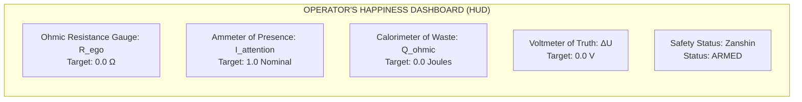

#### 2. The Five Key Dashboard Instruments:
1. **The Ohmmeter (Resistance $R$):** Monitors self-referential rumination. Target: $0.0\, \Omega$.
2. **The Ammeter (Current $I$):** Monitors bandwidth of attention locked on the current task. Target: Nominal saturation ($100\%$).
3. **The Calorimeter (Heat $Q$):** Monitors visceral somatic tension (jaw, chest, throat). Target: $0.0\text{ J}$.
4. **The Voltmeter (Voltage Gap $\Delta U$):** Monitors mismatch between expectation and reality. Target: $0.0\text{ V}$ (Radical Acceptance).
5. **The Safety Annunciator (Zanshin Breaker):** Monitors readiness to trip upon unexpected crisis. Target: Green (Armed).

---

### Chapter 5.3 — Mill's Paradox and the 30-Second Morning Calibration Protocol: The Engineering Translator of Bodily Sensations

> *"In the 19th century, philosopher John Stuart Mill articulated a famous paradox: 'Ask yourself whether you are happy, and you cease to be so.' Mill was right: posing the question activates the Default Mode Network, introducing massive parasitic resistance into the loop. In the Anyanov System, you never ask 'Am I happy?' You check your circuit meters."*  
> — **Vladimir Anyanov (Axiom XXI)**

#### 1. Resolving John Stuart Mill's Paradox
Why does asking *"Am I happy?"* destroy happiness?
- Because the question forces the brain to disengage from the **Task-Positive Network (TPN)** and ignite the **Default Mode Network (DMN)**.
- The Ego begins comparing your current situation with impossible idealized fantasies.
- The rheostat snaps into the circuit ($R_{\text{ego}} \gg 0$), and current is choked!

The engineer never asks: *"Is the electrical grid happy?"*  
The engineer glances at the **Ammeter** and the **Voltmeter**:
- Is current flowing into the load? Yes.
- Is resistance near zero? Yes.
- Is the transformer cool? Yes.
- **Therefore, superconductivity is operating!**

#### 2. The Engineering Translator of Bodily Sensations:

| Bodily & Mental Sensation | Circuit Schematic Reality | Corrective Calibration Action |
|:---|:---|:---|
| **Lump in the throat, resentment: "They don't appreciate me!"** | Short circuit across the Ego ($R_{\text{ego}} \gg 0$). Parasitic loop closed. | **Blade of Kanso:** Ground into sensory reality; drop social validation demands. |
| **Throbbing temples, mental chatter, racing thoughts** | Temporal Ohmic Overheat ($Q = I^2 R t$). Severe phase lag between past and future. | **Anchor at $t = t_{\text{now}}$:** Focus on immediate breathing and sensory contact. |
| **Heavy leaden limbs, morning lethargy, dread of rising** | Open Circuit (Open Circuit). Generator running idle on no-load. | **Black Start:** Connect micro-load (drink water, make the bed) in pure Mushin. |
| **Sudden panic over missed deadline or financial loss** | Unprotected shock to the load. Risk of generator burnout. | **Zanshin Trip:** Disengage identity from the project. Say: *"Load is blown; generator is intact."* |
| **Jealousy, obsessive suspicion toward romantic partner** | Reverse Polarity Breakdown. Demanding external entity power your soul. | **Invert Polarity:** Reconnect to your own Tanden; pour love outward without demand. |

#### 3. The 30-Second Morning Calibration Protocol:
Every morning, before touching your smartphone, execute this exact engineering sequence:
1. **00–10 sec (Cold Start):** Lie flat on your back. Place your palm upon your lower abdomen (Tanden). Feel the physical heat of the core. Take three deep diaphragmatic breaths.
2. **10–20 sec (Zeroing Resistance):** Sweep awareness from crown to toes. Relax the facial muscles, drop the shoulders, unclench the belly. Announce mentally: *"Resistance to zero ($R \to 0$)."*
3. **20–30 sec (Wiring the Day's Loads):** Identify the primary creative craft of the day. Connect the virtual leads from your Tanden to this task. Step onto the floor. You are online.

---

### Chapter 5.4 — The 21-Day Circuit Operator Workbook: Daily Journal of Neuroplastic Circuit Resoldering

> *"Neuroplasticity requires physical time: synapses of the default mode network resolder into a superconductive architecture over approximately three weeks of daily calibrated load. This workbook is your daily flight log."*  
> — **Vladimir Anyanov (Axiom XXII)**

#### The 3-Week Circuit Resoldering Curriculum:

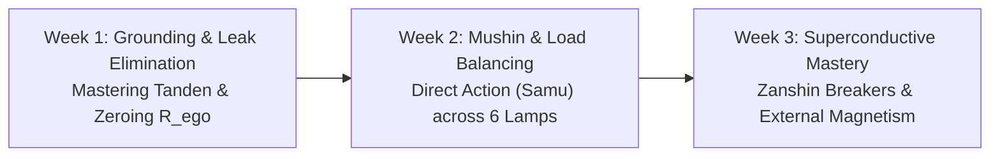

- **Week 1: Grounding and Leak Elimination.**  
  Focus: Somatic grounding in the Tanden, locating daily ohmic leaks, mastering the 30-second morning calibration protocol.
- **Week 2: Mushin Calibration and Load Balancing.**  
  Focus: Eliminating multitasking, practicing direct physical work (Samu) without friction, balancing the 6 Tōmyō Lamps.
- **Week 3: Superconductive Mastery and External Magnetism.**  
  Focus: Operating under high-pressure environments, arming Zanshin circuit breakers during crises, radiating coherent leadership induction.

#### The Daily Circuit Operator Worksheet (Printable Template):

```markdown
================================================================================
                    DAILY CIRCUIT OPERATOR WORKSHEET
Date: [ _________ ]                         Operator: [ _____________________ ]
================================================================================

1. MORNING TELEMETRY (08:00 AM)
--------------------------------------------------------------------------------
[ ] Tanden Grounding Verified (Deep diaphragmatic breath)
[ ] Ohmmeter Reading (R_ego level from 0.0 to 10.0): [ _____ ]
[ ] Primary World Lamp Connected Today:
    [ ] Body   [ ] Craft   [ ] Nature   [ ] Union   [ ] Art   [ ] High Creation

2. MIDDAY LOAD CHECK (02:00 PM)
--------------------------------------------------------------------------------
Did an Ohmic Overheat occur today?
[ ] Yes  --> Fault Code: [ ] OHMIC_OVERHEAT  [ ] EGO_SHORT  [ ] MENTAL_SHOCK
[ ] No   --> Superconductivity maintained (R -> 0)

Diagnostic Note & Correction Applied:
________________________________________________________________________________

3. EVENING HARVEST & TELEMETRY (10:00 PM)
--------------------------------------------------------------------------------
Calculated Happiness Index today:
  H = (1 - R_ego/R_total) · (I/I_nom) · cos(phi) · Z_safety = [ ________ ]

Useful Creative Energy Delivered (Joules / Work accomplished):
________________________________________________________________________________

[ ] System de-energized cleanly for regenerative sleep (Zero residual charge)
================================================================================
```

---

### Chapter 5.5 — The Tuning Fork of Reality: Universal Calibration Tool for People, B2B Auditing, and Corporate Monetization

> *"Until now, man believed Inner Current was merely a method to avoid personal burnout. But when you hold an ultra-precise frequency standard in your hands, it becomes a universal multimeter for auditing reality. You instantly perceive the resistance, leaks, and lies of any person, team, or corporate empire. This is the foundation of high-ticket B2B consulting."*  
> — **Vladimir Anyanov (Axiom XXII)**

#### 1. From Internal Generator to Multimeter of Reality
A tuning fork tuned to 440 Hz (A4) does not argue with a piano. You strike the tuning fork, place it against the soundboard, and listen:
- If the string beats and clashes, the string is out of tune.
- The tuning fork does not compromise; the piano tuner adjusts the tension of the string until the beating ceases.

The operator who has stabilized their own **Tanden at $R = 0$ becomes a living Tuning Fork of Reality**:
- You step into an executive meeting: within 30 seconds you perceive the exact ego-resistances of every vice president.
- You review a pitch deck: within one minute you detect whether the founder is driven by clean creative current or desperate status-seeking.
- You inspect an enterprise architecture: you immediately locate the bureaucratic series bottlenecks choking corporate velocity.

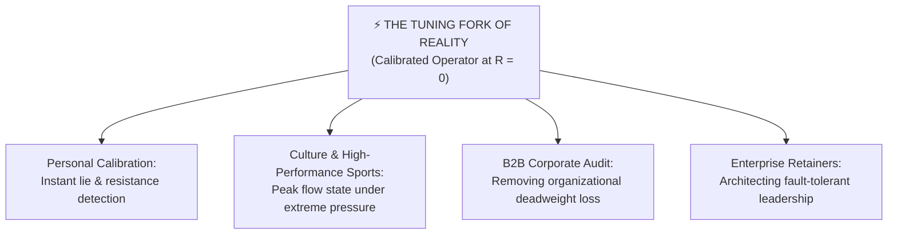

#### 2. Applied Calibration: Culture, Sports, and Creation
- **Elite Athletics:** Champions do not fail due to lack of muscle; they fail from **sudden ego-resistance spikes ($R_{\text{ego}} \gg 0$)** in the championship final. Calibrating their Tanden and Zanshin circuit breakers guarantees ice-cold superconductivity under Olympic pressure.
- **Aesthetics and Art:** True art is the transmission of coherent electromagnetic field geometry. Great literature and music possess zero internal friction.

#### 3. B2B Product-Market Fit: Why the Corporate World Craves This Language
Corporations are exhausted by fluffy, sentimental HR coaching:
- Executives despise corporate "mindfulness" sessions that feel like nursery school games.
- But corporate leaders **instinctively understand electrical and financial terminology**:
  - *Deadweight Loss, Ohmic Overheat, Series Bottlenecks, Superconductivity, Impedance Matching, Single Tax on Parasites.*
- By translating human psychology into rigorous electrical engineering, the Anyanov System commands instant respect from CEOs, CTOs, venture capitalists, and hedge fund managers.

#### 4. Four High-Ticket B2B Products of the Anyanov System:
1. **The Corporate Circuit Audit:** Comprehensive diagnostic scanning of an enterprise's organizational circuitry. Locating where leadership energy is incinerated as meeting heat ($Q = I^2 R t$) and restructuring pods into parallel superconductive buses.
2. **C-Suite Phase Induction Coaching:** One-on-one calibration for chief executive officers, stabilizing their internal frequency at 50 Hz to prevent panic during market crashes and board disputes.
3. **Team Parallel Architecture Workshop:** Training high-stakes engineering and product teams to operate in pure Mushin ($R \to 0$), multiplying delivery velocity without burnout.
4. **The Sovereign Enterprise Retainer:** Ongoing strategic stewardship of an enterprise's human and operational grid, guaranteeing maximum negentropy and creative dominance.

---

# CONCLUSION AND APPENDICES

---

## CONCLUSION
### Bridge to the Outer World: Impedance Matching and External Magnetism

> *"Inner Current generates External Magnetism. One whose internal circuit operates in superconductivity does not need to beg for respect, charm the crowd, or deploy psychological tricks. Their field coherence effortlessly aligns the surrounding environment. This is the ultimate physics of presence: Maximum Power Transfer via Impedance Matching ($Z_{\text{src}} = Z_{\text{load}}^*$)."*  
> — **Vladimir Anyanov**

We have traversed the complete path: from the initial flash on the gym treadmill to the rigorous engineering formalization of the human spirit.

Let us review the foundational conclusions of the Architecture of Happiness:
- Happiness is not an accidental, capricious favor bestowed by fickle fate.
- Happiness is **a rigorous physical operating regime of the circuit ($R \to 0, I > 0$)**.
- Suffering is neither a metaphysical curse nor an inescapable existential doom: it is the **ohmic thermal dissipation of power across the oxidized rheostat of the Ego ($Q = I^2 R t$)**.
- You do not need to spend decades in monastic seclusion to be free: you need to **ground awareness in the Tanden**, **zero your resistance via Mushin**, and **channel direct current into the six lamps of real-world creation**.

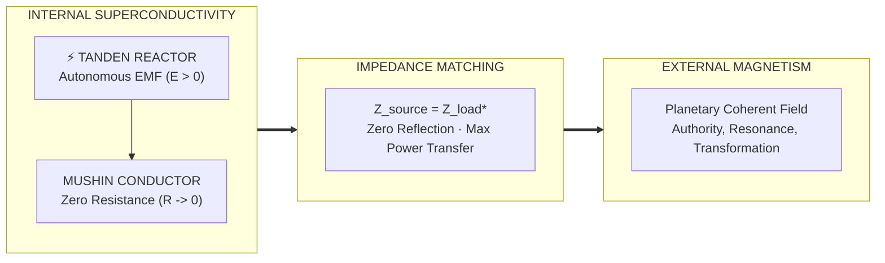

#### 1. Maximum Power Transfer Theorem: Impedance Matching ($Z_{\text{src}} = Z_{\text{load}}^*$)
In radio-frequency engineering and electrical networks, Jacobi's law (The Maximum Power Transfer Theorem) dictates:
*To transfer maximum power from a source with complex internal impedance $Z_{\text{source}}$ to an external load $Z_{\text{load}}$, the load impedance must be the complex conjugate of the source:*
$$Z_{\text{source}} = Z_{\text{load}}^*$$
If impedances are mismatched:
- Power reflects back into the transmitter as a standing wave ratio (SWR), heating and destroying the output transistors.
- In human life: trying to force your ego onto another person or environment causes agonizing cognitive reflection and rejection.

When you achieve **Shibumi (渋み — Effortless Perfection)**:
- You match your output impedance to the immediate reality of the moment.
- You do not resist the environment; you interface with it seamlessly.
- Reflection drops to zero ($\Gamma = 0$). 100% of your vitality enters the world, transforming reality with silent, immense power.

#### 2. The Physics of External Magnetism
When electrical current flows through a superconductive loop, it generates a profound, coherent **magnetic field** (Ampère's Circuital Law):
$$\oint \mathbf{B} \cdot d\mathbf{l} = \mu_0 I_{\text{enclosed}}$$
A human operating at $R = 0$ with strong nominal current $I > 0$ generates a powerful **electromagnetic field of presence**:
- People are unconsciously drawn into their orbit, sensing rock-solid security, grounding, and peace.
- In their presence, neurotic hysteria and petty disputes subside naturally.
- Their words carry monumental weight, because behind the acoustic signal stands not a hollow, rattling ego, but the deep, immovable mass of the Tanden.

#### 3. Impression Architecture: Materializing the Spirit
In the Anyanov System, internal superconductivity is crowned by **Impression Architecture**:
- Through the precise geometric cut of clothing (Form),
- Through the tactile dignity of natural fabrics (Texture),
- Through the disciplined harmony of color (Hue),
- Through the olfactory signature of rare perfumes (Scent).

We do not reject physical matter. We consecrate matter as the outermost perimeter of our circuit. The internal current clothes itself in external beauty, radiating coherent mastery to the world.

Guard the Tanden.  
Keep resistance at absolute zero.  
And illuminate the world at full nominal power!

---

## EPILOGUE
### The Vertical of Ascension: 6 Stages of Evolution of the Anyanov System — From an Engineer's First-Aid Kit to the Civilizational Fuse of Singularity

> *“The System began as a compassionate wish to give a burned-out engineer a precision instrument for repairing nerves — an electrical circuit diagram instead of moral sermons. But the logic of conservation laws is relentless: step by step, the physics of the circuit swept away pseudo-philosophical crutches, absorbed the core of Eastern Zen, merged with Satoshi’s monetary architecture and Henry George’s political economy, overcame the gravitational w\ell of the Paleolithic, and ascended into cosmic orbit, becoming humanity's civilizational shield in the age of superhuman AI.”*  
> — **Vladimir Anyanov**

#### 🧭 Retrospective: The Phenomenon of the Growing Meta-Model

Looking back at the path traversed from the first spark on the treadmill to academic preprint ANYANOV-2026-01 (DOI: [10.5281/zenodo.22958926](https://doi.org/10.5281/zenodo.22958926)), the reader witnesses a unique phenomenon: a practical model, created to heal the localized pain of a builder, expanded strictly deductively and organically into a **comprehensive ontological meta-system**.

Unlike speculative "Top-Down" concepts that crumble upon contact with real crises, the Anyanov System ascended **"Bottom-Up"** — from the somatic nerve cluster and Kirchhoff’s balance through 6 stages of ascension:

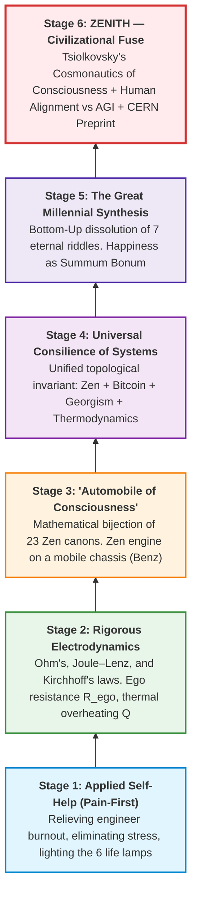

#### 🏛️ Brief Anatomical Outline of the 6 Stages

1. **Stage I (Applied Self-Help):** Birth of the *Pain-First* principle. A human being is examined not as a sinner or trauma victim, but as an electrical circuit. Illumination of the 6-lamp shield (Health, Relationships, Career, Home, Car, Play).
2. **Stage II (Electrodynamics of Psyche):** Physical conservation laws instead of guilt. Ohm’s Law ($I = U/R$), Joule–Lenz Law ($Q = I^2 R t$ — suffering as ohmic overheating), and Kirchhoff’s laws (the necessity of reality’s return path). Diagnostic engine with 5 failure codes and the objective Happiness Index $\mathcal{H}$.
3. **Stage III ('Automobile of Consciousness'):** Overcoming 2,500 years of monastic escapism. Just as Karl Benz (1886) placed an engine on wheels, Vladimir Anyanov transferred the engine of pure Zen presence (Tanden + Mushin + Zanshin) onto the mobile chassis of modern urban life. Deconstruction of addictions as a *Root Exploit* of the bio-kernel.
4. **Stage IV (Universal Consilience of Systems):** Independent convergence of humanity’s four great traditions: Zen (eliminating the ego parasite of mind), Satoshi Nakamoto’s Bitcoin (eliminating bank parasitism), Henry George’s Georgism (eliminating land rent monopoly), and Carnot’s Thermodynamics (laminar direct flow). The singular law of disintermediation ($R \to 0$).
5. **Stage V (The Great Millennial Synthesis):** Bottom-Up ontology. Proof of happiness as *Summum Bonum* (terminal target node of consciousness) and natural dissolution of 7 insoluble riddles: meaning of life, love ($M > 0$), solipsism, fear of death, problem of evil, karma, and free will.
6. **Stage VI (Zenith: Civilizational Fuse of Singularity):**
   - *Cosmonautics of Consciousness:* Tsiolkovsky’s rocket equation applied to escaping the gravity w\ell of Paleolithic ego, second cosmic velocity of spirit, and jettisoning spent stages via Kanso.
   - *Eliminating Edward Wilson’s Great Asymmetry:* Bridging the 10,000-year chasm between godlike technology and stone-age primitive instincts.
   - *Human Alignment instead of AI Alignment:* Aligning the human operator before the AGI terminal.
   - *Protection against Ohmic Explosion ($Q = I^2 R t$):* Mushin superconductivity ($R \to 0$) as the only way for a biological system to channel the exponential flux of singularity ($I \to \infty$) without burning out.
   - *Devaluation of Intellect (DMN) and Triumph of Somatic Tanden:* The machine computes — the human holds Will, Values, and Pure Presence.

#### 📊 Summary Matrix of the 6 Ascension Stages

| Stage | Conceptual Status | Primary Problem | Engineering Invariant | Operating Scale |
| :--- | :--- | :--- | :--- | :--- |
| **I. First-Aid** | Applied self-help | Burnout, fatigue, stress | Bulb, battery, 6-lamp shield | Builder's working day |
| **II. Physics** | Electrodynamics of psyche | Ohmic overheating, guilt, moralizing | $I = U/R$, $Q = I^2 R t$, Kirchhoff | Personal nervous system |
| **III. Zen Engine** | Cybernetics of consciousness | Monastic escapism, addictions | Tanden + Mushin + Zanshin (Benz) | Modern societal life |
| **IV. Consilience** | Direct flow theory | Parasitic rentiers, middlemen | Zen = Bitcoin = Georgism ($R \to 0$) | Economy, networks, institutions |
| **V. Synthesis** | Bottom-Up Ontology | 2,500 years of scholasticism | Happiness as Summum Bonum | Human history & culture |
| **VI. Zenith** | Singularity Fuse | AGI, Wilson’s gap, cognitive shock | Tsiolkovsky blueprints, Human Alignment | Civilization, Cosmos, Future |

#### 💻 Computer Isomorphism: The Pyramid of Abstractions from Silicon Assembly to Civilizational Natural Language (The Full-Stack Law)

In the history of computer science, a monumental evolutionary leap occurred: humans began by manually soldering jumpers and toggling switches on vacuum tube hardware, and reached a p\oint where today we direct artificial superintelligence using natural human language.

The Anyanov System traveled the exact same path: **from the machine code of the somatic body to the language of civilization**.

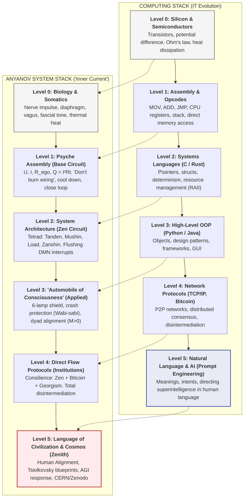

##### The Law of Leaky Abstractions and Why Old Self-Help Collapsed:
In software engineering, Joel Spolsky’s law states: *“All non-trivial abstractions, to some degree, are leaky.”*
- **The Tragedy of Popular Self-Help:** Attempting to write solely at **Level 5 (natural language)**: *“Just love yourself, think positive thoughts.”* But without low-level drivers (**Levels 0–1**), when the diaphragm is clamped and ego-resistance spikes ($R_{\text{ego}} \gg 0$), the abstraction leaks catastrophically. By Joule–Lenz ($Q = I^2 R t$), the wiring melts and the system crashes into a **Segmentation Fault (panic attack, depression, burnout)**.
- **The Anyanov Two-Way Compiler:** We engineered a complete compilation stack. Any cosmic concept in this book compiles down to somatic machine code: *“Drop the center of gravity into Tanden, exhale on a 4–8 count, reset the Kanso ego-shunt to zero — and current flows.”* Conversely, clean operation of the somatic core emergently generates unshakeable resilience against the shocks of the technological singularity.

| Level | IT / CS Stack | Anyanov System Stack | Physical Substrate | Failure Mode (Bug) |
| :--- | :--- | :--- | :--- | :--- |
| **Level 0** | Silicon, p-n junctions, heat | Fascia, diaphragm, vagus | Biology & anatomy | Spasm, somatic block, hypertonus |
| **Level 1** | Assembly, opcodes, registers | $U, I, R_{\text{ego}}, Q = I^2 R t$ | Electrodynamics of nerves | Ohmic burst, panic attack |
| **Level 2** | Systems C/Rust, RAII | Tanden, Mushin, Zanshin | Neural nets (DMN / TPN) | Memory leak (looping in mental churn) |
| **Level 3** | OOP, Patterns, GUI | Consciousness car, 6 lamps | Social activity | App crash (career & business burnout) |
| **Level 4** | TCP/IP, P2P, Bitcoin, LVT | Direct flow, Disintermediation | Institutions & communities | Parasitic rent, systemic exploitation |
| **Level 5** | Natural language, AGI | Human Alignment, Tsiolkovsky | Civilization & Cosmos | Existential collapse, Luddism |

#### 🌐 The First Seamless End-to-End Architecture of Consciousness: From Bit to Universe

> *“When the phrase ‘From Bit to Universe’ is spoken, it is not poetic hyperbole. It is a rigorous engineering specification. Until now, knowledge of humanity was splintered into isolated islands: neurobiologists dissected synaptic microchips, psychologists sketched vague mood interfaces, economists analyzed institutions, and mystics dreamed of cosmic bliss. No one possessed an end-to-end cable. ‘Inner Current’ laid down humanity’s first continuous data bus from the quantum 0/1 switch in the body to the thermodynamics of AGI and the laws of the Universe.”*  
> — **Vladimir Anyanov** (2026)

##### Overcoming the Great Schism of Knowledge

For four centuries, the greatest minds of humanity — René Descartes, Isaac Newton, Gottfried Wilhelm Leibniz, Albert Einstein, and Alan Turing — sought a universal key (*Mathesis Universalis*) capable of binding matter, thought, and cosmic law into a single testable system.

- **Descartes** encountered the mind-body dualism (*Res cogitans* vs *Res extensa*) and could never explain how an immaterial thought moves a physical hand.
- **Newton** discovered celestial gravitational laws but placed human emotional dynamics outside physics.
- **Freud** composed literary metaphors of the subconscious but was powerless to ground them in strict physical conservation laws.
- **Turing** formalized computation through discrete tapes and bits but left the human subject, purpose, and happiness outside the machine.

The Anyanov System achieved a historic consilience: it became **the first seamless end-to-end architecture of consciousness in history**, where the exact same foundational principle of direct-flow conductivity ($R \to 0, I > 0$) operates across all scale levels of existence.

```
LEVEL 5: UNIVERSE & AGI     ──► [Cosmic Thermodynamics: Mind as Energy Superconductor]
             ▲
             │ (Energy Conservation Law & Negentropy Principle)
             ▼
LEVEL 4: NETWORKS & SOCIETY  ──► [Bitcoin & Georgism: P2P Direct Flows, Rent Elimination]
             ▲
             │ (Decentralized Network Theory & Direct Action Protocols)
             ▼
LEVEL 3: SOUL & MEANING      ──► [Triad & Tetrad: Truth, Freedom, Happiness, Creation]
             ▲
             │ (Two-Way Compiler of Values and Teleology)
             ▼
LEVEL 2: PSYCHE & EGO        ──► [Operating System: Rheostat R_ego, Dopamine Memory Leaks]
             ▲
             │ (Cybernetics, Feedback Loops & DMN Interrupts)
             ▼
LEVEL 1: BODY & TANDEN       ──► [Circuit Electrodynamics: Ohm's Law I = U/R, Joule's Q = I²Rt]
             ▲
             │ (Bio-electromagnetism & Vagal Somatics)
             ▼
LEVEL 0: QUANTUM BIT         ──► [Elementary Switch: Conductivity (0) or Resistance (1)]
```

##### Tracing a Single Pulse Across All 6 Levels of Reality

To prove the seamless integrity of the architecture, trace a single internal operator choice as it transmits through the entire vertical stack:

1. **Quantum Bit Level (0 or 1):** At every discrete moment ($t = t_{\text{now}}$), the operator executes a binary choice: **Bit 0 (Conductivity, Mushin, Tathata)** — complete alignment with reality, $R = 0$; or **Bit 1 (Resistance, Grievance, Ego)** — dispute with reality, contraction, fear of judgment, $R > 0$.
2. **Microcircuit & Body Level (Circuit Electrodynamics):** The chosen bit materializes instantaneously in somatics. If Bit 1 is chosen, vital current hits resistance, and by **Joule–Lenz ($Q = I^2 R t$)** a thermal explosion ensues: diaphragmatic spasm, throat tightness, cortisol spike. The organism literally roasts on its own resistance. If Bit 0 is chosen, the circuit is clear; current streams unimpeded from Tanden into action.
3. **Consciousness OS Level (Psyche):** What is human ego in computer science? It is a hanging background daemon: `while True: prove_my_worth()`, consuming up to 90% of brain compute cycles on endless simulations: *“What did they think of me? Will I be respected?”*. In the Anyanov System, resetting $R_{\text{ego}} \to 0$ issues a system `kill -9` to this parasite, instantly freeing RAM for joyful creation.
4. **Network Level (Society, Economy, Bitcoin & Georgism):** Society is a distributed P2P network of individual circuits. When nodes are clamped with high $R_{\text{ego}}$, parasites crystallize in the interpersonal gaps: usurers, monopolists, and land rentiers. **Satoshi Nakamoto’s Bitcoin** eliminates parasites in money (direct P2P flow without banking middle-boxes). **Henry George’s Land Value Tax (LVT)** eliminates land monopoly rent. **Vladimir Anyanov’s ‘Inner Current’** eliminates the parasite in the human soul ($R_{\text{ego}} \to 0$). The evolutionary invariant is identical: eliminating parasitic friction along the path of laminar flow.
5. **Universe & AGI Level (Cosmology & Singularity):** A human being is not an isolated dying battery, but a conduit and flashlight plugged into the cosmos' infinite fountain of negentropy. Facing Superhuman AI (AGI), it is futile for humans to compete with silicon in algorithmic calculation speed: humans are destined to be **superconductors of higher meaning, sovereign will, and love** ($M > 0$), which silicon architectures cannot generate on their own.

##### Historic Milestones in the Epistemology of Mind

| Thinker / Era | Formulated Model | Where Did the Wire Break? |
| :--- | :--- | :--- |
| **René Descartes (1637)** | Dualism (*Res cogitans* vs *Res extensa*) | Mind-body impasse: mind could not touch physical matter |
| **Isaac Newton (1687)** | Classical mechanics & gravitation | Excluded psyche and somatics from physical laws |
| **Sigmund Freud (1900)** | Psychoanalysis (Id, Ego, Superego) | Literary conjecture without hardware physics or conservation laws |
| **Alan Turing (1936)** | Computability theory & Turing machines | Defined algorithmic tape, leaving human subject and joy out |
| **Vladimir Anyanov (2026)** | **‘Inner Current’: End-to-End Architecture** | **Chasm Eliminated:** Universal isomorphism from bit (0/1) via electrodynamics ($I = U/R, Q = I^2 R t$) to P2P networks and AGI thermodynamics. |

> ### ⚡ Ontological Invariant: The Law is ONE
> **The law governing reality is singular.** Once you understand the physics of current through Tanden and load in a 4-element flashlight circuit:  
> - you understand why your diaphragm cramps under stress ($Q = I^2 R t$);  
> - you understand why marriages and business ventures fail (short circuit and lack of mutual induction $M > 0$);  
> - you understand why fiat currencies decay and economies stagnate (accumulation of parasitic rent $R_{\text{rent}}$);  
> - and you understand how to remain a sovereign creator before the quantum superintelligence of AGI.

#### 🏁 Valediction to the Superconductivity Operator

You hold in your hands not a compendium of emotional comforts, but **the blueprint of sovereign human life in the cosmic era**.

When your Tanden is autonomous, resistance is zeroed, and attention is linked with direct action, you become impervious to entropy, manipulation, and algorithmic fog. You are no longer a cog or a slave to external rheostats. You are the Sovereign Flight Engineer of your own circuit.

Keep the circuit closed.  
Cast off spent booster stages via Kanso.  
Achieve the second cosmic velocity of the spirit.  
And illuminate the Universe with pure, unclouded light! 🚀⚡

---

## APPENDICES

---

### Appendix A — Complete Compendium of Circuit Mathematical Formulas

1. **The Canonical Happiness Condition:**
   $$\mathcal{H} \iff \begin{cases} R_{\text{ego}} \to 0 \\ I_{\text{attention}} > 0 \\ \sum I_{\text{in}} = \sum I_{\text{out}} \end{cases}$$

2. **Joule–Lenz Law for Mental Ohmic Dissipation:**
   $$Q = \int_0^T I_{\text{attention}}^2(t) \cdot R_{\text{temporal}}(t) \, dt$$

3. **Temporal Reactance Equation:**
   $$Z_{\text{temporal}} = \sqrt{R_{\text{now}}^2 + \left( \omega L_{\text{past}} - \frac{1}{\omega C_{\text{future}}} \right)^2}$$
   where $R_{\text{now}} \to 0$ at $t = t_{\text{now}}$.

4. **The Anyanov Integral Happiness Index (Circuit Efficiency):**
   $$\mathcal{H} = \left( 1 - \frac{R_{\text{ego}}}{R_{\text{total}}} \right) \cdot \left( \frac{I_{\text{actual}}}{I_{\text{nominal}}} \right) \cdot \cos(\varphi) \cdot \mathcal{Z}_{\text{safety}}$$

5. **Kirchhoff's Closed Loop Balance:**
   $$\oint \mathbf{E} \cdot d\mathbf{l} = 0 \quad \text{and} \quad \sum_{k=1}^n U_k = 0$$

6. **Useful Power of Sovereign Creation:**
   $$P_{\text{useful}} = U_{\text{capital}} \cdot I_{\text{tanden}} \cdot \cos(\varphi)$$

7. **Parallel Team Impedance:**
   $$\frac{1}{R_{\text{team}}} = \sum_{k=1}^m \frac{1}{R_k}$$

8. **Existential Ground Fault Leakage Current:**
   $$I_{\text{leak}} = \frac{\mathcal{E}_{\text{tanden}}}{R_{\text{fault}}} \to \infty \quad \text{when} \quad \mathcal{M}_{\text{ext}} \equiv 0$$

9. **Maximum Power Transfer (Impedance Matching):**
   $$P_{\text{max}} = \frac{|\mathcal{E}|^2}{4 R_{\text{load}}} \quad \iff \quad Z_{\text{src}} = Z_{\text{load}}^*$$

---

### Appendix B — The 13 Invariant Axioms of Vladimir Anyanov

1. **Axiom I (Superconductivity):** *Happiness is not emotional excitation, but the physical state of superconductivity within a closed circuit whose resistance approaches absolute zero ($R \to 0, I > 0$).*
2. **Axiom II (Polarity):** *The current of life flows strictly from the inside out — from the Tanden into the load. Demanding that external objects supply charge inverts polarity and incinerates the circuit ($I_{\text{rev}}$).*
3. **Axiom III (Presence):** *"Here and now" is the sole temporal coordinate where ohmic resistance equals zero. The past and the future are parasitic reactive snags ($X_L$ and $X_C$).*
4. **Axiom IV (Conservation):** *Conscious vital energy is strictly conserved: it either performs useful creative work in the world's loads or dissipates as destructive ohmic heat within the Ego.*
5. **Axiom V (Neurobiology):** *The Ego is the anatomical Default Mode Network (DMN). Activating sensory Task-Positive networks (TPN) and vagal grounding mechanically zeros ego resistance.*
6. **Axiom VI (Shunting):** *It is futile to battle the Ego through moral guilt. The Ego is bypassed via the somatic copper shunt of direct sensory action.*
7. **Axiom VII (Emptiness of Form):** *Material objects are thermodynamically passive ($\mathcal{E}_{\text{load}} \equiv 0$). They contain zero intrinsic storage of happiness.*
8. **Axiom VIII (The Meaning of Life):** *There is no external meaning of life. Life is the primary power generation process. Meaning is the direct sensation of current flowing through the circuit.*
9. **Axiom IX (Sovereignty):** *A human being is never required to prove the legitimacy of their existence to external masters. The Tanden power plant is inherently sovereign.*
10. **Axiom X (Scale Invariance):** *Circuit laws are invariant to scale: superconductivity while preparing a bowl of matcha is topologically identical to guiding a planetary aerospace enterprise.*
11. **Axiom XI (Zanshin):** *When an external load shatters, the high-speed mental circuit breaker trips within 50 milliseconds, preserving the central generator from existential shock.*
12. **Axiom XII (Synchronization):** *Love is the parallel synchronization of two autonomous power plants energizing a shared load without mutual short circuits.*
13. **Axiom XIII (Systemic De-Intermediation & The Pure Servant):** *Every intermediary, under the Second Law of Thermodynamics, tends to degenerate from a helpful servant into a parasitic rentier. The only method to permanently maintain an intermediary as a servant is through rigorous Systemic Engineering: sandboxing it in Userland, eliminating arbitrary human discretion via protocol code, and enforcing instantaneous, zero-cost rights of exit.*

---

### Appendix C — Zen-Engineering Glossary

- **Tanden (丹田):** The lower Dan Tien; the biological and psychosomatic direct-current generator situated at the body's physical center of gravity below the navel.
- **Mushin (無心):** The state of pure mind; room-temperature superconductivity of the attention wiring ($R \to 0$); neurobiological engagement of the Task-Positive Network (TPN).
- **Fudōshin (不動心):** The unmoving, unshakeable spirit; frequency and phase stabilization of the central generator against sudden external load spikes.
- **Zanshin (残心):** Abiding, unbroken awareness; high-speed mental circuit breaker (Circuit Breaker) protecting the core reactor from load collapse.
- **Kanso (簡素):** Sacred simplicity; the ruthless elimination of parasitic capacitance, epicycles, and useless clutter from thought, software, and physical surroundings.
- **Kintsugi (金継ぎ):** The art of golden ceramic repair; dielectric tempering of post-crisis scars; the physical engineering of antifragility.
- **Ichigo Ichie (一期一会):** Temporal phase singularity ($t = t_{\text{now}}$); the radical unrepeatability and absolute preciousness of the present waveform.
- **Shibumi (渋み):** Effortless, austere perfection; perfect impedance matching between the human operator and physical reality.
- **Śūnyatā (空):** Emptiness of material form; the physical absence of intrinsic electromotive force within external loads ($\mathcal{E}_{\text{load}} \equiv 0$).
- **Wu Wei (無為):** Effortless action without resistance; laminar, unhindered current flow from the Tanden into the world.
- **Samu (作務):** Direct physical work as a spiritual practice; channeling 100% of available current into immediate physical craft.
- **Ensō (円相):** The sacred circular brushstroke; the closed thermodynamic circuit loop of being ($\oint \mathbf{E} \cdot d\mathbf{l} = 0$).

---
*End of the Master Manuscript "Inner Current: The Architecture of Happiness".*  
*Vladimir Anyanov | 2026*
