# La Corrente Interiore: L'Architettura della Felicità
## La fisica della superconduttività, l'ontologia Zen e l'ingegneria esatta del benessere umano

> *Manoscritto vivo — documento maestro d\ell'opera.*  
> **Autore:** Vladimir Anyanov  
> **Sincronizzato con la base di conoscenza Obsidian:** `LLM Wiki/02_Wiki` & `04_Maps/Inner Current MOC IT`  
> *Stato della revisione:* **Edizione Ufficiale Italiana (Master Manuscript)**

---

> [!quote] Assioma principale del libro
> ### **«La felicità è il regime di superconduttività del circuito.»**  
> — **Vladimir Anyanov**
> 
> *«Non abbiamo inventato nuove leggi della natura umana. Abbiamo scoperto la rigorosa architettura ingegneristica della felicità: abbiamo tradotto secoli di intuizioni e il caos d\ell'esperienza umana in un sistema applicato, verificabile e riparabile. Il disagio interiore non è una maledizione esistenziale, ma un surriscaldamento ohmico o una dispersione verso terra, suscettibili di precisa localizzazione e calibrazione attraverso gli strumenti della lucida attenzione.»*

---

## Indice dei Contenuti

| Stato | Sezione | Titolo del capitolo | Completezza | Riferimento primario in Obsidian |
|:---:|:---|:---|:---:|:---|
| ✅ | **Manifesto** | Il Manifesto d\ell'Ingegnere Zen: Dai miti astratti alle leggi di conservazione | 100% | [[02_Wiki/Inner Current (Novelty and Value Proposition)\|Novelty and Value Proposition]] |
| ✅ | **Prefazione** | Il bagliore sul tapis roulant: Dal vicolo cieco apofatico e dal dialogo con l'IA alla fisica della corrente interiore | 100% | [[02_Wiki/Inner Current (Canonical Definitions of Happiness — Technical and Intuitive Formulations)\|Canonical Definitions]], [[02_Wiki/Inner Current (Case Study - Engineer Romance Approach)\|Case Study]] |
| ✅ | **Introduzione** | Il criterio ingegneristico di verità: Perché la psicologia non ha saputo fornire la formula della felicità | 100% | [[02_Wiki/Inner Current (Closed Thermodynamic System as Criterion of Truth)\|Closed Thermodynamic System]], [[02_Wiki/Inner Current (Engineering Epistemology and Bitcoin Law)\|Engineering Epistemology]] |
| ✅ | **Parte I: Cap. 1.1** | Anatomia del triplice circuito: Tanden (il Nucleo), Attenzione (il Cablaggio) e Carico (le 6 lampade) | 100% | [[02_Wiki/Inner Current (Core Topology and Polarity Law)\|Core Topology and Polarity Law]] |
| ✅ | **Parte I: Cap. 1.2** | La svolta del circuito chiuso: Il cavo di ritorno della realtà contro il modello lineare di burnout | 100% | [[02_Wiki/Inner Current (The Closed Circuit Breakthrough — The Return Wire of Reality vs The Linear Burnout Model)\|The Closed Circuit Breakthrough]] |
| ✅ | **Parte I: Cap. 1.3** | La legge di polarità: Dall'interno verso l'esterno e il guasto da corrente inversa | 100% | [[02_Wiki/Inner Current (Core Topology and Polarity Law)\|Core Topology]], [[02_Wiki/Inner Current (The Nature of the Light Bulb and Zen Load)\|Nature of the Light Bulb]] |
| ✅ | **Parte I: Cap. 1.4** | La fisica della presenza: Il «qui e ora» come superconduttività ($R \to 0$) | 100% | [[02_Wiki/Inner Current (Physics of Presence and Superconductivity)\|Physics of Presence]] |
| ✅ | **Parte I: Cap. 1.5** | La termodinamica dello spirito: I sei principi fondamentali della felicità | 100% | [[02_Wiki/Inner Current (Fundamental Laws of the Happiness Thermodynamics)\|Fundamental Laws]] |
| ✅ | **Parte I: Cap. 1.6** | Neurobiologia della superconduttività: La DMN come reostato hardware d\ell'Ego, la TPN come focus Mushin e il nervo vago come messa a terra del Tanden | 100% | [[02_Wiki/Inner Current (Neurobiology of Superconductivity — DMN, TPN and Vagus Grounding)\|Neurobiology of Superconductivity]] |
| ✅ | **Parte I: Cap. 1.7** | Il Bitcoin dello spirito: Ciò che Satoshi ha fatto per il denaro, la Corrente Interiore lo ha fatto per la felicità | 100% | [[02_Wiki/Inner Current (What Bitcoin Did for Finance, Inner Current Did for Happiness)\|What Bitcoin Did for Finance]] |
| ✅ | **Parte I: Cap. 1.8** | L'Imposta Unica di Henry George: La fisica della creazione libera e l'eliminazione della rendita parassitaria | 100% | [[02_Wiki/Inner Current (The Henry George Principle — Single Tax, Bitcoin and Circuit Superconductivity — Law of Direct Flow and Elimination of Parasitic Rent)\|The Henry George Principle]] |
| ✅ | **Parte I: Cap. 1.9** | Genesi degli intermediari e la legge del flusso diretto: Perché nasce la rendita parassitaria e come l'ingegneria protegge il sistema dall'entropia | 100% | [[02_Wiki/Inner Current (Genesis of Intermediaries and the Thermodynamics of Direct Flow — Why Parasites Arise and How the Triad Restores Purity)\|Genesis of Intermediaries]] |
| ✅ | **Parte I: Cap. 1.10** | Atlante Universale della Disintermediazione: Dai Mitocondri e Lutero a Toyota e Bitcoin | 100% | [[02_Wiki/Inner Current (Universal Atlas of Disintermediation — From Internet and Toyota to Mitochondria and Luther)\|Universal Atlas of Disintermediation]] |
| ✅ | **Parte II: Cap. 2.1** | Natura e illusione d\ell'Ego: Il reostato di resistenza parassita e il protocollo di bypass hardware di $R_{\text{ego}}$ | 100% | [[02_Wiki/Inner Current (Nature and Illusion of Ego)\|Nature and Illusion of Ego]] |
| ✅ | **Parte II: Cap. 2.2** | L'illusione d\ell'accumulatore negli oggetti: Il paradosso della BMW, la fisica del consumismo e la vuotezza della forma | 100% | [[02_Wiki/Inner Current (The Battery Illusion of Material Possessions and Emptiness of Form)\|The Battery Illusion]] |
| ✅ | **Parte II: Cap. 2.3** | Dimostrazione ingegneristica d\ell'assenza di senso della vita: La liberazione dal vicolo cieco umanistico e la nascita d\ell'Architettura della felicità | 100% | [[02_Wiki/Inner Current (Engineering Proof of No Meaning of Life and the Birth of Happiness Architecture)\|Engineering Proof]] |
| ✅ | **Parte II: Cap. 2.4** | Analisi comparativa: La crisi spirituale di Lev Tolstoj vs l'Architettura della felicità — Il dovere morale verso il Padrone contro il Tanden sovrano | 100% | [[02_Wiki/Inner Current (Tolstoy Existential Crisis vs Happiness Architecture)\|Tolstoy Existential Crisis]], [[02_Wiki/Inner Current (Circuitry of Existential Fault and Ground Leak)\|Circuitry of Existential Fault]] |
| ✅ | **Parte II: Cap. 2.5** | La Grande Disintermediazione della Psiche: Il Sistema Terapeutico delle Indulgenze contro l'Operatore Sovrano del Circuito | 100% | [[02_Wiki/Inner Current (The Great Disintermediation of the Psyche — The Therapeutic Indulgence System vs The Sovereign Circuit Operator)\|The Great Disintermediation of the Psyche]] |
| ✅ | **Parte II: Cap. 2.6** | Anatomia del cambio di paradigma: Gli epicicli di Tolomeo contro la semplicità di Kanso e la dissoluzione delle false domande | 100% | [[02_Wiki/Inner Current (Anatomy of the Paradigm Shift — Ptolemaic Epicycles vs Kanso Simplicity and Falling of False Questions)\|Anatomy of the Paradigm Shift]] |
| ✅ | **Parte II: Cap. 2.7** | Decostruzione della scommessa di Pascal e la questione di Dio: 350 anni di roulette teologica contro l'invariante superconduttore ($R \to 0$) | 100% | [[02_Wiki/Inner Current (Deconstruction of Pascal's Wager — Theological Roulette vs Superconducting Invariance)\|Pascal's Wager]], [[02_Wiki/Inner Current (The Question of God — Electrodynamic Invariance and Dissolution of Theological Resistance)\|The Question of God]] |
| ✅ | **Parte II: Cap. 2.8** | La Chiave Universale: La dissoluzione d\ell'Ego come convergenza delle religioni mondiali e la sua rigorosa dimostrazione sul piano della fisica | 100% | [[02_Wiki/Inner Current (The Universal Key — Dissolution of Ego, Convergence of World Religions and the Electrodynamics of Non-Resistance)\|The Universal Key]] |
| ✅ | **Parte III: Cap. 3.1** | Invarianza di scala del carico: Dalla cerimonia del tè Chanoyu alla corporazione spaziale | 100% | [[02_Wiki/Inner Current (Scale Invariance and Tea Ceremony)\|Scale Invariance]] |
| ✅ | **Parte III: Cap. 3.2** | I fusibili del circuito: Gli interruttori mentali Zanshin, Wabi-sabi e l'oro delle cicatrici Kintsugi | 100% | [[02_Wiki/Inner Current (Safety, Antifragility and Zanshin)\|Safety, Antifragility and Zanshin]] |
| ✅ | **Parte III: Cap. 3.3** | L'Automobile della Coscienza | 100% | |
| ✅ | **Parte III: Cap. 3.4** | Elettrodinamica d\ell'Amore | 100% | |
| ✅ | **Parte III: Cap. 3.5** | Circuitistica delle relazioni: Sincronizzazione di due circuiti senza cortocircuito ed eliminazione di $R_{\text{future}}$ | 100% | [[02_Wiki/Inner Current (Case Study - Engineer Romance Approach)\|Case Study - Romance Approach]], [[02_Wiki/Inner Current (Happiness Relativity vs Circuit Invariance)\|Happiness Relativity]] |
| ✅ | **Parte III: Cap. 3.6** | Il protocollo «Black Start» (Avvio da zero): Riavvio di emergenza del circuito dopo un blackout catastrofico | 100% | [[02_Wiki/Inner Current (Black Start Protocol — Cold Reboot After Catastrophic Blackout)\|Black Start Protocol]] |
| ✅ | **Parte III: Cap. 3.7** | Circuitistica dei collettivi: Collegamento in parallelo e in serie, surriscaldamento ohmico tossico delle riunioni e induzione di fase del leader | 100% | [[02_Wiki/Inner Current (Collective Circuitry — Team Impedance, Status Ohmic Overheat and Leader Induction)\|Collective Circuitry]] |
| ✅ | **Parte III: Cap. 3.8** | Elettrodinamica del capitale: Il denaro come tensione di circuito ($U$) e riduttore d\ell'attrito ambientale | 100% | [[02_Wiki/Inner Current (Electrodynamics of Capital — Money as Voltage and Fluid Resistance Reducer)\|Electrodynamics of Capital]] |
| ✅ | **Parte III: Cap. 3.9** | Summerhill e la Pedagogia della Superconduttività | 100% | |
| ✅ | **Parte IV: Cap. 4.1** | Lo Zen senza incensi: Il ponte storico tra Oriente e Occidente | 100% | [[02_Wiki/Inner Current (Zen as Happiness Architecture Foundation)\|Zen as Foundation]], [[02_Wiki/Inner Current (East-West Synthesis and Demystification)\|East-West Synthesis]] |
| ✅ | **Parte IV: Cap. 4.2** | Atlante ontologico completo: Biiezione dei 23 canoni Zen ed elettrodinamica | 100% | [[02_Wiki/Inner Current (Complete Zen-Electrodynamic Ontological Atlas)\|Complete Ontological Atlas]], [[02_Wiki/Inner Current (Zen-Thermodynamics Synthesis and Happiness Breakthrough)\|Zen-Thermodynamics Synthesis]] |
| ✅ | **Parte IV: Cap. 4.3** | Il codice d\ell'Ingegnere Zen: Vivere in regime di azione diretta e il protocollo Satori in 30 secondi | 100% | [[02_Wiki/Inner Current (Mathematics of Harmony and Consilience)\|Mathematics of Harmony]] |
| ✅ | **Parte IV: Cap. 4.4** | I Dieci Tori dello Zen: La roadmap evolutiva d\ell'operatore di circuito (Dalla ricerca delle tracce alla superconduttività nel mercato affollato) | 100% | [[02_Wiki/Inner Current (Ten Bulls of Zen — 10 Stages of Superconductivity Operator Evolution)\|Ten Bulls of Zen]] |
| ✅ | **Parte IV: Cap. 4.5** | Rivoluzione copernicana n\ell'ontologia: Il metodo «Bottom-Up», la felicità come Summum Bonum e la simbiosi Uomo + IA | 100% | [[02_Wiki/Inner Current (Copernican Revolution in Ontology — Bottom-Up Circuit Dissolution of Metaphysics and Human-AI Zanshin)\|Copernican Revolution]], [[02_Wiki/Inner Current (Summum Bonum and Epistemological Grounding — The Root Node of Happiness vs Limits of the Model)\|Summum Bonum]], [[02_Wiki/Inner Current (Dissolution of Eternal Questions — From Humanitarian Deadlock to Scientific Circuitry)\|Dissolution of Eternal Questions]] |
| ✅ | **Parte IV: Cap. 4.6** | Il Martello di Maslow contro l'Invariante di Sistema: Audit del Bias di Conferma contro la Consilienza Oggettiva | 100% | [[02_Wiki/Inner Current (Maslow's Hammer vs System Invariant — Consilience of Zen, Thermodynamics, Bitcoin and Georgism)\|Maslow's Hammer vs System Invariant]] |
| ✅ | **Parte IV: Cap. 4.7** | La Triade e la Tetrade di Anyanov: Verità, Libertà, Felicità, Creazione — Decostruzione del libero arbitrio e sintesi autobiografica | 100% | [[02_Wiki/Inner Current (The Anyanov Triad and Tetrad — Truth, Freedom, Happiness, Creation and the Biographical Proof)\|The Anyanov Triad and Tetrad]] |
| ✅ | **Parte IV: Cap. 4.8** | La Grande Sintesi Millenaria: Come l'elettrodinamica di circuito ha dissolto le questioni eterne d\ell'umanità | 100% | [[02_Wiki/Inner Current (The Millennial Synthesis — How Circuit Electrodynamics Dissolved the Seven Eternal Questions of Humanity)\|The Millennial Synthesis]] |
| ✅ | **Parte V: Cap. 5.1** | La macchina diagnostica: Il principio Pain-First, i 5 codici di guasto del circuito umano e i protocolli di riparazione | 100% | [[02_Wiki/Inner Current (Diagnostic Machine and System Specification)\|Diagnostic Machine]] |
| ✅ | **Parte V: Cap. 5.2** | Il cruscotto della felicità: Telemetria della superconduttività, formula $\mathcal{H}$ e sensori di circuito | 100% | [[02_Wiki/Inner Current (Happiness Dashboard and Superconductivity Telemetry)\|Happiness Dashboard]], [[02_Wiki/Inner Current (Happiness Index vs UN World Happiness Report)\|Happiness Index vs UN]] |
| ✅ | **Parte V: Cap. 5.3** | Il paradosso di Mill e il protocollo di calibrazione mattutina in 30 secondi: Il traduttore ingegneristico delle sensazioni | 100% | [[02_Wiki/Inner Current (Human Self-Check Protocol and Sensation Translator)\|Human Self-Check]], [[02_Wiki/Inner Current (The 'Am I Happy' Question and Circuit Telemetry)\|The 'Am I Happy' Question]] |
| ✅ | **Parte V: Cap. 5.4** | Il workbook di 21 giorni d\ell'operatore di circuito: Diario giornaliero di risaldatura neuroplastica del circuito | 100% | [[02_Wiki/Inner Current (21-Day Superconductivity Operator Protocol — Daily Workbook)\|21-Day Workbook Protocol]] |
| ✅ | **Parte V: Cap. 5.5** | Il diapason della realtà: Strumento universale di calibrazione umana, audit B2B e monetizzazione aziendale | 100% | [[02_Wiki/Inner Current (Tuning Fork of Reality — Universal Calibration Tool, B2B Audit and Corporate Monetization)\|Tuning Fork of Reality]] |
| ✅ | **Conclusione** | Il ponte verso il mondo esterno: Adattamento di impedenza e Magnetismo Esterno | 100% | [[02_Wiki/Inner Current (Impression Architecture and Impedance Matching)\|Impression Architecture]] |
| ✅ | **Epilogo** | La Verticale d\ell'Ascesa | 100% | |: Adattamento di impedenza e Magnetismo Esterno | 100% | [[02_Wiki/Inner Current (Impression Architecture and Impedance Matching)\|Impression Architecture]] |
| ✅ | **Appendici** | Formule canoniche, Raccolta dei 13 assiomi e Glossario Ingegneristico-Zen | 100% | [[04_Maps/Inner Current MOC IT\|Inner Current MOC IT]] | Formule canoniche, Raccolta dei 13 assiomi e Glossario Ingegneristico-Zen | 100% | [[04_Maps/Inner Current MOC IT\|Inner Current MOC IT]] |

---

## IL MANIFESTO DELL'INGEGNERE ZEN
### Dai miti astratti alle leggi rigorose di conservazione

Per millenni l'umanità ha cercato di rispondere alla domanda: *«Come possiamo essere felici?»*  
E per millenni questa domanda è annegata in metafore astratte, dogmi religiosi, formule psicologiche standardizzate e nel velenoso positivismo del marketing moderno.

All'essere umano viene ripetuto:  
*«Amati semplicemente per quello che sei»* — senza tuttavia fornirgli lo schema elettrico di tale amore.  
*«Trova il tuo scopo nella vita»* — condannandolo a decenni di estenuante surriscaldamento ohmico alla ricerca di una presa di corrente esterna del tutto immaginaria.  
*«Vivi nel qui e ora»* — eppure, non appena sorge il domani, la coscienza torna a bruciare n\ell'ansia per il futuro o si impantana nella greve resistenza del passato.

**È giunto il momento di porre fine alla romantizzazione del dolore d\ell'anima.**  
L'essere umano non è un mistero insondabile destinato all'eterna sofferenza. L'essere umano è **un sistema termodinamico ed elettrico altamente organizzato**.

Nel nostro corpo pulsa un cuore che pompa litri di elettrolita. Lungo le fibre nervose scorrono, a velocità misurabile, potenziali d'azione. Il cervello consuma un quarto d\ell'intero glucosio corporeo, generando campi elettromagnetici coerenti.

E se nel mondo fisico le leggi d\ell'elettrodinamica e della termodinamica sono inviolabili:
- la corrente non scorre senza un circuito chiuso,
- l'energia non si crea dal nulla né scompare nel vuoto,
- e la resistenza dissipa inesorabilmente calore secondo la legge di Joule-Lenz, fondendo i conduttori,

per quale motivo abbiamo ingenuamente creduto che il mondo interiore d\ell'uomo rispondesse alle favole, e non alle medesime, inflessibili leggi d\ell'Universo?

**La Corrente Interiore (Inner Current)** è un manifesto di lucidità.  
Abbiamo unito l'esperienza millenaria dello Zen — la scuola pratica più rigorosa e distaccata della storia per l'addestramento della coscienza — alla fisica esatta dei circuiti elettrici.

Qui non c'è fede. C'è **la verifica del circuito**.  
Qui non c'è colpa. C'è **la localizzazione della dispersione**.  
Qui non c'è l'analisi infinita dei traumi infantili. C'è **la calibrazione della resistenza a zero ($R \to 0$)** e l'avviamento del generatore alla sua piena potenza nominale.

### AVVERTIMENTO AL LETTORE: QUESTO LIBRO NON È UN TAPPETO MAGICO
#### Perché costruiamo il razzo di Ciolkovskij e non vendiamo illusioni

> *«La Terra è la culla della ragione, ma non si può vivere per sempre in una culla.»*  
> — **Konstantin Ciolkovskij** (1911)

Se avete aperto questo libro sperando di trovare l'ennesimo "tappeto magico" del pensiero positivo, dolci meditazioni o la promessa di un'illuminazione istantanea — **chiudetelo immediatamente**.

Per 10.000 anni l'umanità ha inventato fiabe sui tappeti magici. Gli uomini hanno indossato le ali di cera di Icaro, hanno ideato le fantasie di Cyrano de Bergerac sulle fiale di rugiada mattutina, credendo di potersi salvare dalla sofferenza con il moralismo, la fede cieca o l'acquisto del prossimo attributo esterno di status. Ma il risultato è stato invariabile: *ogni volta il "tappeto magico" è precipitato, schiantandosi contro la spietata gravità della paura biologica, del senso di colpa e del surriscaldamento ohmico d\ell'ego*.

Nel 1903, nella remota provincia di Kaluga, il modesto insegnante di fisica semissordo Konstantin Ciolkovskij si sedette a un tavolo di legno e fece ciò che tutti i narratori del mondo non erano riusciti a fare. Non inventò fiabe — egli derivò **l'equazione del moto a reazione**:
$\Delta v = v_e \ln \frac{m_0}{m_f}$
Egli calcolò la formula esatta per superare l'attrazione terrestre: ossigeno liquido, camera di combustione e un treno missilistico a più stadi che espelle i serbatoi vuoti. Mezzo secolo dopo, Gagarin volò sopra il pianeta.

**Questo libro è il progetto di Kaluga di Ciolkovskij per il vostro mondo interiore.**  
Non promettiamo miracoli. Noi affermiamo: la sofferenza, la colpa, l'ansia e la dipendenza non sono una maledizione mistica, ma **il pozzo gravitazionale d\ell'ego primordiale ($R_{\text{ego}} > 0$)**. Per sfuggirvi, non vi servono mantra. Vi serve un reattore Tanden funzionante, lo scarico della zavorra morta secondo il canone Kanso e il calcolo della **Seconda velocità cosmica dello spirito**, che porta la coscienza n\ell'assenza di gravità della pura superconduttività ($R \to 0$, Mushin).

Non avete davanti a voi letteratura di evasione. Avete davanti a voi il progetto ingegneristico del vostro volo orbitale.

### A CHI È RIVOLTO QUESTO LIBRO (E A CHI NO)
#### Manifesto del Lettore Sovrano

Questo libro è scritto alla rigorosa convergenza di equazioni fisiche, elettrodinamica, ontologia orientale, critica di un secolo e mezzo di psicoterapia e filosofia politica del flusso diretto. Non vi troverete nebbia mistica né consolatorie illusioni. Così come la legge di Ohm non scende a patti con la resistenza del conduttore, questo libro non scende a compromessi con il lettore.

#### Questo libro è stato scritto per te se:
1. **Sei un Creatore Razionale o un Ingegnere di Sistemi (The Rational Creator):**  
   Ragioni secondo nessi di causa ed effetto, codice, equazioni differenziali e topologie di sistema. Rifiuti la psicologia da banco e lo sciroppo new age («respira nel grembo», «visualizza l'abbondanza»). Esigi lo schema elettrico equivalente: dove si colloca la f.e.m. ($U$), perché si genera la dissipazione termica di Joule-Lenz ($Q = I^2 R t$) e come estinguere il surriscaldamento ohmico.
2. **Sei un Costruttore ad Alto Rendimento, Founder o Leader (The High-Output Builder):**  
   Hai conosciuto la «sindrome di Danko» — esserti consumato per la squadra, il progetto o gli investitori, cercando di vincere l'attrito del mondo al prezzo di spezzare il filo di ritorno. Non cerchi un vacuo entusiasmo aziendale, bensì un protocollo ingegneristico di ripartizione delle correnti, adattamento delle impedenze nel collettivo e protezione della tua rete elettrica sovrana.
3. **Sei un Ricercatore Disilluso o un Veterano della Psicoterapia (The Disillusioned Seeker):**  
   Hai trascorso anni negli studi di psicoterapia o nei ritiri di Vipassana, ma sei esausto d\ell'industria commerciale della continua ruminazione e del riaprire ferite d'infanzia. Hai compreso che la terapia si è mutata in un commercio medievale di indulgenze, e intendi passare dal ruolo di «paziente» perenne allo status di *Operatore Sovrano del Circuito* (Self-Hosted Operator).
4. **Sei un Assertore della Disintermediazione e della Sovranità (The Self-Hosted Sovereign):**  
   Comprendi perché Satoshi Nakamoto ha rimosso le banche dal denaro, Henry George voleva estirpare la rendita fondiaria parassitaria dall'economia e Martin Lutero ha eliminato i prelati pontifici dalla fede. Cerchi l'anello finale di questa catena: l'eliminazione dei mediatori dalla tua stessa coscienza.

#### Questo libro è categoricamente NON adatto a:
- Chi è alla caccia di una «pillola magica», di dolci affermazioni e della promessa di una felicità istantanea in 5 minuti senza sforzo né disciplina d\ell'attenzione;
- Chi si è identificato con il ruolo della vittima e trae un tornaconto secondario dal crogiolarsi all'infinito nel proprio dolore;
- Chi cerca un nuovo «guru», esigendo fede cieca, rituali esoterici e comodi dogmi moralistici.

Se il tuo voltmetro è attivo e la tua mente anela a una fisica pura e a un'incrollabile chiarezza — benvenuto n\ell'Architettura della Felicità.

---

---

## PREFAZIONE
### Il bagliore sul tapis roulant: Dal vicolo cieco apofatico e dal dialogo con l'IA alla fisica della corrente interiore

> *«La felicità non può essere definita attraverso ciò che possediamo — poiché milioni di esseri umani hanno ottenuto tutto ciò che sognavano, eppure guardano il mondo con occhi spenti. Ma se spogliamo l'esistenza da tutto ciò che è transitorio, ciò che resta all'osso è un reattore interiore incontaminato: il Tanden. Gli oggetti esterni, i successi mondani e le relazioni non sono altro che le lampade Tōmyō. E la lampada Tōmyō si accende solo quando la corrente scorre dall'interno verso l'esterno, mai viceversa.»*  
> — **Vladimir Anyanov**

Tutto ebbe inizio non in un laboratorio segreto né a un banco di lavoro disseminato di resistenze e oscilloscopi. Tutto cominciò nella più ordinaria delle palestre.

Durante una pausa tra due serie di esercizi, mi avvicinai a una ragazza che conoscevo. Stava correndo sul tapis roulant, lo sguardo fisso sullo schermo dello smartphone, con le cuffie nelle orecchie.  
— Che cosa stai guardando? — chiesi incuriosito.  
— Un podcast sulla felicità — rispose lei, senza rallentare il passo.

Iniziammo a conversare e proprio lì, sovrastati dal rombo cadenzato delle macchine da corsa, le posi una domanda in apparenza elementare:  
— E tu, saresti capace di definire che cos'è la felicità?

Inciampò quasi sul nastro, rallentò e rimase pensierosa. Cominciarono le solite risposte, note a chiunque: «Beh... è quando tutto è tranquillo. Quando c'è l'amore, la salute dei propri cari. Quando hai un buon lavoro, serenità economica, viaggi, quando i tuoi sogni si avverano...»

E in quella precisa frazione di secondo fui attraversato da un'intuizione cristallina: **è intrinsecamente impossibile definire la felicità in termini positivi**.

### Il crollo della definizione positiva

Provate a definire la felicità elencando attributi esterni («la felicità è X»), e la realtà frantumerà all'istante qualunque vostra costruzione teorica:
- **Se la felicità risiede nel denaro, n\ell'attico di lusso e nel comfort** — per quale ragione incontriamo quotidianamente proprietari di penthouse principesche e auto sportive con sguardi infinitamente stanchi, spenti, spenti dentro?
- **Se la felicità risiede nella famiglia e nei figli** — perché tanti matrimoni languiscono in una routine soffocante e gli individui al loro interno si sentono in un totale isolamento emotivo?
- **Se la felicità risiede nella salute e nella giovinezza** — come si spiega che giovani ventenni in perfetta forma fisica cadano in depressioni paralizzanti?
- **Se la felicità risiede nel sole, n\ell'oceano e nelle palme tropicali** — perché Bali e i resort di tutto il pianeta pullulano di espatriati esausti e svuotati, intenti a soffocare il vuoto esistenziale con antidepressivi e alcol?

La definizione affermativa è una trappola cognitiva. Nel momento esatto in cui legate la felicità a un oggetto esterno, vi trasformate immediatamente nel suo ostaggio.

— Ascolta — le dissi. — La via positiva non funziona. Proviamo a ribaltare il metodo. Definiamo la felicità mediante la **negazione** — spogliando l'esperienza di tutto ciò che la felicità certamente non è.

### La via apofatica (Neti, Neti — «Né questo, né quello»)

N\ell'antica filosofia indiana e nella teologia classica esiste un metodo supremo di indagine della verità fondato sulla via negativa: l'*apofasi*, o *Neti, Neti* («né questo, né quello»). Se non possiamo definire concettualmente l'assoluto, possiamo eliminare metodicamente tutto ciò che è falso, condizionato e perituro.

Lì, accanto al tapis roulant, demmo inizio a questo radicale esperimento mentale di smantellamento:
1. **Abbiamo rimosso gli oggetti materiali:** le automobili, i metri quadri, gli abiti di sartoria, i dispositivi elettronici. Sono soltanto materia strutturata, plastica e metallo. Se domani un incendio li divorasse tutti, il primordiale senso di «Io sono» non brucerebbe insieme ad essi.
2. **Abbiamo rimosso lo status sociale:** gli incarichi prestigiosi, i titoli accademici, i follower e il plauso pubblico. L'opinione altrui è soltanto una vibrazione d'aria e rumore sinaptico nelle teste degli altri, priva di massa e consistenza.
3. **Abbiamo rimosso le relazioni:** i partner sentimentali, gli amici, il bisogno di approvazione circostante. L'altro è un universo sovrano che percorre le proprie traiettorie. Non può fungere da accumulatore della tua esistenza.
4. **Abbiamo rimosso le condizioni esteriori:** il clima, le notizie geopolitiche, i mercati finanziari, le crisi. Vengono e vanno, simili a nuvole passeggere sopra la cima di una montagna.
5. **E infine, abbiamo rimosso il corpo biologico stesso.** Le cellule del soma si rinnovano interamente n\ell'arco di pochi anni; il corpo invecchia, si ammala, sperimenta la stanchezza. Ma Colui che osserva questi processi fisiologici non è riducibile al corpo.

Che cosa rimane, dunque, quando abbiamo reciso con precisione chirurgica tutto ciò che è esterno, vulnerabile e mortale?

Ciò che resta all'osso è la **pura Coscienza testimoniale — il senso immediato d\ell'«IO SONO»**.  
E a questo nucleo nudo e indivisibile appartengono tre proprietà fondamentali:
- **L'Illimitatezza:** non è rinchiuso nel perimetro della scatola cranica, bensì accoglie e abbraccia l'intero campo della percezione.
- **L'Invulnerabilità:** non può essere licenziato, tradito, svalutato o derubato.
- **La Beatitudine autosussistente (*Sat-Chit-Ananda*):** al punto di zero assoluto, una volta eliminate le interferenze e le richieste altrui, lo stato naturale della coscienza è un quieto, profondo, uniforme stupore per il fatto stesso di esistere.

### I carichi Tōmyō contro la Centrale Elettrica

In quel preciso istante si cristallizzò il modello cardine che costituisce l'architrave di questo intero trattato:

> **La coscienza umana è una centrale nucleare autonoma. E l'intero mondo materiale e relazionale circostante è formato dalle sacre lampade-carico Tōmyō (燈明).**

Nella tradizione zen giapponese, le lampade e i lucernari votivi del tempio prendono il nome di **Tōmyō (燈明)**. Si tratta di vasi di coccio o metallo con olio e stoppino, disposti nella penombra del santuario. Di per sé sono freddi, opachi e vuoti: non posseggono alcuna sorgente autonoma di luce. Ma quando lo stoppino riceve la fiamma dall'inestinguibile fuoco d\ell'altare, la lampada Tōmyō brilla di una luce dorata e limpida, squarciando le tenebre.

Nella nostra architettura, le dimensioni esteriori della vita — Salute, Relazioni, Lavoro, Denaro, Spazio vitale, Conoscenza e Creatività — sono precisamente **Tōmyō**: le sei sacre lampade-carico della nostra incarnazione terrena.

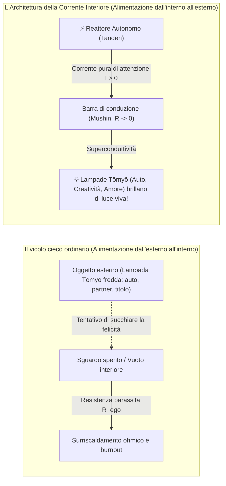

Che cosa fa la stragrande maggioranza delle persone? Prende tra le mani una fiala di vetro spenta o una lampada Tōmyō da 100 Watt fredda (un'automobile nuova, una posizione lavorativa ambita, una relazione d'amore) e inizia a implorarla disperatamente:  
*«Ti prego, illumina la mia esistenza! Rendimi felice! Riempi il mio vuoto interiore!»*

Ma nella lampada Tōmyō **non c'è alcun generatore**. Non c'è batteria. Se collocate una lampadina fredda in una stanza buia, resterà per sempre un pezzo di vetro e tungsteno inerte.

La lampada Tōmyō risplende di luce abbagliante a un'unica, imprescindibile condizione: **quando la corrente fluisce dall'interno verso l'esterno**. Quando la collegate al vostro generatore interno perfettamente funzionante. La felicità non è mai contenuta nella lampada: la felicità è la corrente che la attraversa.

### La trappola d\ell'ascetismo: «La felicità non è nella BMW, ma io voglio guidarla»

Qui si apre un bivio insidiosissimo, sul quale nei secoli sono inciampati milioni di ricercatori spirituali.

Rendendosi conto che gli oggetti materiali non custodiscono in sé la felicità, molti precipitano n\ell'estremo opposto: nel nichilismo ascetico e nel disprezzo del mondo:  
*«Se la materia è vuota, allora il denaro è sporco, il commercio è vanità, il successo un'illusione: lascerò ogni cosa per rifugiarmi in un eremo o in una caverna solitaria».*

Ma questa non è saggezza. È pusillanimità, è fuga vigliacca dal contatto con il reale.

La vera vetta è l'autentico **non-attaccamento (*vairāgya*)**:  
> **È vero: la felicità non si trova nella BMW. Ma questo non significa che io debba rinunciarvi. Io voglio comunque guidare quella BMW!**

La differenza abissale risiede unicamente nel vettore di alimentazione:
1. **Il vettore del bisogno nevrotico:** Salgo a bordo d\ell'auto ed esigo dalla fredda lampada Tōmyō: *«Dimostra a tutti che valgo qualcosa! Salvami dalla vergogna della mediocrità!»*. In questo assetto, qualsiasi graffio sulla carrozzeria si trasforma in una tragedia personale, innescando un surriscaldamento ohmico pre-infartuale.
2. **Il vettore della superconduttività:** Il mio reattore è del tutto autonomo. Mi metto al volante di una vettura splendida, precisa e potente unicamente perché ammiro la perfezione della sua ingegneria meccanica, la progressione d\ell'accelerazione e il timbro del motore. Porto la mia stessa luce interiore dentro quel viaggio. Mi godo pienamente la lampada Tōmyō, ma senza mai confonderla con la sorgente di alimentazione. Se essa dovesse guastarsi o sparire, il mio reattore non perderebbe nemmeno un millivolt di potenza.

### Perché proprio lo Zen? Il Tanden sotto l'ombelico e la perfetta coincidenza elettrotecnica

Questo pensiero mi assorbì interamente. Rimaneva però l'interrogativo cruciale: **con quale linguaggio concettuale formalizzare una simile architettura?**

Mi viene spesso chiesto: per quale ragione in un trattato dedicato alla rigorosa fisica dei circuiti sono apparsi i termini dello Zen giapponese? Non è forse una contraddizione rispetto al rifiuto del misticismo?

Tutt'altro. Lo Zen è la scuola di lavoro sulla coscienza meno mistica, più sobria e implacabilmente empirica nella storia della civiltà umana. Ma la scelta della terminologia Zen non nacque da un vezzo intellettuale. Scaturì da una diretta e inequivocabile sensazione somatica nel corpo.

Quando lì, accanto al tapis roulant, per effetto dello sfrondamento apofatico si palesò quella sorgente inesauribile di energia, mi domandai: *«In quale punto del corpo viene percepita fisicamente?»*. E avvertii con assoluta precisione un centro di forza denso, caldo, incrollabile — **due o tre dita al di sotto d\ell'ombelico**.

E nella memoria riemerse all'istante la classica definizione dello Zen: **Tanden (丹田)** — il basso Dan Tian, il nucleo energetico d\ell'uomo, il centro di gravità somatico e la radice d\ell'imperturbabile equilibrio del maestro.

In quel preciso istante si accese una ferrea logica di sistema:
> **Se il generatore primario, la sorgente iniziale d\ell'energia dentro di me si chiama con il termine Zen Tanden — in quale lingua dovrà esprimersi l'intera architettura del circuito?**

Se il cuore d\ell'impianto parla la lingua dello Zen, allora tutti gli altri nodi della rete sono logicamente tenuti a essere denominati con i termini dello Zen. Non è ammissibile mescolare registri concettuali eterogenei.

E quando iniziai a porre metodicamente a confronto i canoni dello Zen con l'elettrotecnica, mi mancò il respiro: **scoprii la loro convergenza totale, assoluta, al 100%!** Non si trattava di un mero artificio retorico, ma di una perfetta biiezione isomorfa:
- **Il Generatore / Sorgente di f.e.m. ($\mathcal{E} > 0$):** È il **Tanden (丹田)** — il giacimento energetico autonomo posto sotto l'ombelico, che eroga la tensione primaria della volontà e della vita.
- **La Barra collettrice a resistenza nulla ($R \to 0$):** È il puro stato di **Mushin (無心, "non-mente")** — la condizione di flusso priva di appigli, giudizi, timori o esitazioni.
- **Il Sistema di protezione e sezionamento d'emergenza:** È lo **Zanshin (残心, "spirito vigile continuo")** — la presenza ininterrotta del maestro che apre istantaneamente il circuito in caso di collasso del carico esterno, preservando il nucleo da shock mentali catastrofici.
- **La Bonifica da resistenze superflue e incrostazioni:** È il canone di **Kanso (簡素, estrema semplicità)** — l'eliminazione impietosa degli epicicli parassiti della mente.
- **I Carichi di circuito (le lampade d\ell'esistenza):** Sono le sacre lampade **Tōmyō (燈明)**, che s'accendono unicamente quando vengono attraversate dal fuoco del Tanden.

Lo Zen si è rivelato la più antica elettrotecnica dello spirito, a cui facevano difetto le formule matematiche. E l'elettrotecnica è la più esatta circuitistica Zen, tradotta nel linguaggio del rame, del silicio e dei principi di conservazione.

### Il dialogo con l'Intelligenza Artificiale: Il passaggio allo schema funzionale

Non sono un ingegnere radiotecnico di professione; non ho trascorso le notti con il saldatore in mano davanti allo schermo di un oscilloscopio. Tuttavia, ho sempre nutrito una naturale avversione per le nebbie d\ell'ambiguità. Avevo bisogno di un modello: limpido, matematicamente coerente, verificabile e suscettibile di manutenzione.

Tornato a casa dalla palestra, aprii il terminale e intrapresi un prolungato, profondo dialogo con Gemini — l'avanzata intelligenza artificiale di Google.

Passo dopo passo, abbiamo convertito qu\ell'intuizione folgorante in un rigoroso schema a blocchi funzionale:
- Abbiamo integrato il Tanden dello Zen con le equazioni d\ell'elettrodinamica e della termodinamica di Maxw\ell, Ohm e Joule-Lenz.
- Abbiamo formalizzato il surriscaldamento ohmico nella sua espressione esatta: $Q = I^2 R t$ — se l'attenzione ($I$) scorre attraverso un conduttore intasato da paure e rumore d\ell'ego ($R > 0$), il sistema si disintegra inesorabilmente nella cenere del burnout.
- Abbiamo testato l'invarianza del circuito a qualsiasi scala: dal sorseggiare un tè verde al mattino fino alla guida di un impero industriale.

Così è nata **l'Architettura della Felicità**.

### Confessione d\ell'autore: Come ho mascherato con la spiritualità la fame della mia personalità

Tuttavia, prima di addentrarci nei formalismi matematici e negli schemi di principio, sento il dovere morale di compiere una confessione di totale trasparenza.

Non scrivo queste pagine nelle vesti di un monaco ascese sulla vetta del monte Kailash, né come un anacoreta che guarda l'umanità dall'alto della propria imperturbabilità. Scrivo come un uomo vivo, in carne e ossa, che per decenni ha commesso il più grave errore di tutti i ricercatori interiori: **ho tentato, mediante una spiritualità elevata e la caccia all'illuminazione, di camuffare il fatto che ero profondamente infelice nella mia personalità umana**.

La mia personalità terrena desiderava cose semplici, limpide e legittime: voleva il riconoscimento, un'auto prestigiosa, l'amore delle donne, la solidità economica e il sapore pieno della vita. Ma, prigioniero di una duplice fascinazione ipnotica — il moralismo severo di Lev Tolstoj («i desideri carnali sono colpevoli, doma la carne») e il misticismo romantico di Osho («l'illuminazione risolverà ogni tuo problema») — soffocavo quella voce. Meditavo, inseguivo stati di samadhi, studiavo ponderosi trattati filosofici, illudendomi che attraverso la santità la mia personalità affamata avrebbe finalmente ottenuto la pace.

Fu solo l'incontro con la lucidità inflessibile del maestro contemporaneo di Advaita Yuri Menyachikhin a squarciare il velo. Egli mi mostrò una verità disarmante, che mandò in frantumi il mio castello di carte:
> **La spiritualità non è lo strumento per sfamare una personalità denutrita. La spiritualità è l'uscita oltre i confini della personalità per chi è già SAZIO! Per chi ha sperimentato tutto, ha assaporato il mondo, ha giocato a sufficienza e ha naturalmente superato quella fase. Ma finché la tua personalità muore d'inedia, la tua "spiritualità" non è che una vile maschera per nascondere la tua infelicità.**

Questo colpo di grazia chiarificatore divenne la pietra angolare d\ell'Architettura della Felicità. Compresi allora un principio inviolabile: **non è possibile saltare il gradino della personalità!** Non possiamo togliere la corrente alle lampade del denaro, del sesso, della salute e del successo sociale pretendendo di coprirci di santità.

**La Corrente Interiore è la totale riabilitazione della personalità terrena.** Eliminiamo i sensi di colpa, sgombriamo il campo dall'ipocrisia moralistica e incanaliamo la corrente inesauribile del Tanden per accendere tutte e sei le lampade della vita reale.

Questo libro non è una raccolta di esortazioni motivazionali né un prontuario di consolazioni psicologiche. È un manuale pratico di revisione della propria infrastruttura elettrica interiore. Rimuoveremo il carter di protezione, impugneremo gli strumenti della consapevolezza vigile e, passo dopo passo, porteremo la vostra intera esistenza in regime di pura superconduttività.

---

---

## INTRODUZIONE
### Il criterio ingegneristico di verità: Perché la psicologia non ha saputo fornire la formula della felicità

> *«Nella scienza, il criterio di verità coincide con la falsificabilità di Karl Popper e con il rigore dei principi di conservazione. Se una dottrina enuncia tesi che non possono essere misurate, verificate o smentite da un esperimento, essa non è conoscenza: è letteratura. L'Architettura della Felicità è la prima teoria falsificabile dello spirito umano.»*  
> — **Vladimir Anyanov**

Per quale ragione in tremila anni di storia scritta l'umanità ha saputo costruire collisori di adroni, decifrare il genoma e collegare l'intero globo con fibre ottiche alla velocità della luce, mentre n\ell'ambito del fondamentale benessere d\ell'anima continua a dibattersi allo stadio delle tragedie sofoclee?

La risposta è tanto semplice quanto implacabile: **l'assenza di un criterio oggettivo di verità**.

### Il Nuovo Organo della Psicologia: Da 130 anni di scolastica al criterio dei frutti pratici
#### Francis Bacon (1620) e la distruzione dei quattro idoli della meccanica d\ell'anima

> *«La vera misura della validità di una teoria è la sua capacità di generare frutti pratici... Ciò che nella teoria è la causa, n\ell'azione è la regola... La scienza e il potere umano coincidono, poiché l'ignoranza della causa ci priva d\ell'effetto.»*  
> — **Francis Bacon**, *«Novum Organum Scientiarum»*, 1620

Nel 1620, il grande pensatore inglese Francis Bacon pubblicò un trattato che capovolse il corso della civiltà europea: *«Novum Organum»*. Il titolo del libro era una sfida aperta all'«Organon» di Aristotele: Bacon proclamò che la scolastica medievale, che per secoli aveva dibattuto su sillogismi logici, categorie e definizioni teologiche, era sterile. Generava infinite biblioteche di trattati, ma non alleviava la fatica fisica del contadino, non costruiva navi sicure e non curava le malattie.

Bacon formulò una legge inderogabile: **la verità di una teoria è dimostrata esclusivamente dalla sua capacità di produrre frutti pratici (*experimenta fructifera*)**. Se una concezione speculativa è bella e logica, ma è impotente nel modificare la realtà fisica, allora è falsa. Questo criterio ha generato la fisica sperimentale moderna di Galilei e Newton, la chimica, la medicina basata sull'evidenza e la trazione a vapore della rivoluzione industriale.

Ma guardate alla psicologia e alle dottrine sullo spirito umano degli ultimi 130 anni, dall'avvento della psicoanalisi di Sigmund Freud.
La psicologia ha replicato fedelmente il tragico destino della scolastica medievale:
- Sono stati scritti milioni di tesi, articoli accademici e bestseller di self-help.
- Sono state create centinaia di scuole e modalità psicoterapeutiche in competizione tra loro.
- L'industria d\ell'assistenza psicologica è valutata in centinaia di miliardi di dollari l'anno.

**Ma dove sono i frutti pratici?**
Al 2026, il tasso di depressione clinica, disturbi d'ansia, attacchi di panico, burnout e solitudine esistenziale nel mondo ha battuto tutti i record storici. La civiltà ha dominato i calcoli quantistici e si è avvicinata all'AGI, ma l'uomo di fronte al disordine d\ell'anima è impotente quanto un pastore antico di fronte al temporale.

La causa di questa tragedia civilizzazionale è esattamente la stessa di 400 anni fa: **la psicologia è rimasta una scolastica priva di uno strumento di misurazione (senza un Organon)**. Si è smarrita nelle interpretazioni soggettive, adorando ciò che Bacon definì **i Quattro Idoli della Mente (Idola Mentis)**.

#### Decostruzione dei quattro idoli della meccanica d\ell'anima

L'Architettura della Felicità è **il Nuovo Organo della meccanica d\ell'anima**. Applica il criterio dei frutti di Bacon all'architettura della coscienza umana, demolendo sistematicamente tutti e quattro i fantasmi mentali secolari:

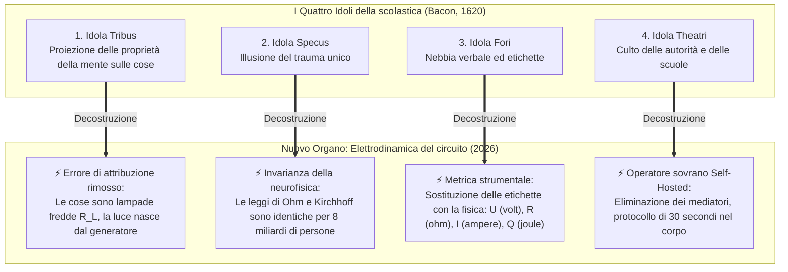

1. **Idoli della Tribù (Idola Tribus) — Errore di attribuzione e cecità da batteria:**  
   La mente umana tende a proiettare proprietà interne sugli oggetti esterni. Le persone hanno ingenuamente creduto che una nuova auto, una posizione di prestigio o un matrimonio contenessero in sé la sostanza della felicità. Pregavano la lampadina, non comprendendo che la lampadina è morta senza un circuito chiuso. La "Corrente Interiore" svela la fisica: la felicità non è un oggetto, ma un regime di superconduttività della corrente di attenzione ($I > 0, R_{\text{ego}} \to 0$).
2. **Idoli della Caverna (Idola Specus) — L'illusione del "trauma unico":**  
   Ogni persona è rinchiusa nella caverna della propria biografia. La terapia tradizionale indaga per anni la configurazione individuale di questa caverna: *«A che età tua madre non ti ha amato abbastanza?»*. Ma a livello delle leggi di conservazione questo non ha importanza. Se fate cadere un martello sul vostro piede, la legge di gravitazione universale di Newton non si interessa della vostra infanzia. Allo stesso modo, le leggi di Ohm ($I = U/R$) e di Joule-Lenz ($Q = I^2 R t$) sono universali: il filo d\ell'attenzione bloccato brucia la rete neurale in modo identico per tutti gli 8 miliardi di abitanti della Terra.
3. **Idoli della Piazza (Idola Fori) — La nebbia verbale e il mercato delle etichette:**  
   Le parole, nate per comodità quotidiana, hanno schiavizzato il pensiero. La psicologia si è ricoperta di migliaia di etichette astratte: "gestalt incompiuta", "procrastinazione", "burnout", "tossicità", "sindrome d\ell'impostore". L'individuo passa anni da specialisti, collezionando diagnosi anziché guarigione. La "Corrente Interiore" sostituisce il vocabolario scolastico con tre variabili fondamentali: **tensione della vita ($U$), conduttività d\ell'attenzione ($1/R$) e potenza utile del carico ($P = I^2 R_L$)**.
4. **Idoli del Teatro (Idola Theatri) — L'adorazione cieca di sacerdoti e scuole:**  
   Le scuole psicologiche ed esoteriche si sono costituite per secoli come sette chiuse e teatri dogmatici: psicoanalisi, junghismo, comportamentismo, gestalt. L'individuo viene collocato nella posizione dipendente di paziente, acquistando per anni indulgenze di pace mentale dai sacerdoti. La "Corrente Interiore" realizza la Grande Disintermediazione: all'uomo viene restituito il **quadro di comando sovrano e autonomo del proprio circuito**. Voi non siete pazienti. Voi siete ingegneri di bordo sovrani.

#### Il criterio dei frutti in 30 secondi

Secondo Bacon, la verità deve dare frutti non "dopo 5 anni di psicoterapia", ma qui e ora:
> *Se una teoria afferma di aver compreso la struttura della pace mentale, è obbligata a dimostrare un frutto ingegneristico nel vostro corpo fisico in 30 secondi.*

Proprio ora, leggendo queste righe, potete applicare questo Nuovo Organo nella pratica:
- **Passo 1:** Spostate l'attenzione dal rumore mentale errante al nucleo fisico del basso addome (*Tanden*).
- **Passo 2:** Rimuovete la resistenza parassita d\ell'Ego — abbandonate la disputa con la realtà, accettate il fatto che il momento presente sia esattamente così com'è ($R_{\text{ego}} \to 0$).
- **Passo 3:** Indirizzate la corrente di attenzione liberata n\ell'azione più vicina — leggere queste righe o la respirazione del corpo ($I > 0$).

Cosa è successo in questo secondo?  
Il bruciore ohmico alle tempie è scomparso. Lo spasmo muscolare nel petto si è sciolto. Nel corpo si è diffuso un calore tranquillo, costante, ad alta tensione.

Questo è il criterio dei frutti di Francis Bacon. Questa non è fede, né training autogeno, né ipnosi. Questa è la **rigorosa meccanica del circuito elettrico chiuso**.

### Il relativismo umanistico: «La felicità è diversa per ciascuno»

Il grande alibi con cui la cultura contemporanea giustifica la propria impotenza è il relativismo assiologico: *«La felicità è un dato puramente soggettivo! Ognuno ha la propria verità: per qualcuno felicità è sdraiarsi su una spiaggia assolata, per un altro è comporre versi, per un terzo è accumulare capitale».*

Nel linguaggio delle scienze esatte, un simile enunciato appare grottesco quanto affermare: *«L'elettricità è diversa per ogni elettrodomestico: in un ferro da stiro gli elettroni viaggiano dal polo negativo a quello positivo, mentre in un altro si muovono per virtù d\ell'amore verso la patria».*

Risolviamo una volta per tutte questo madornale errore metodologico: esso scaturisce dalla **confusione grossolana tra le leggi fisiche della rete e la tipologia d\ell'apparecchio collegato**.

Immaginate una comune presa elettrica nel muro.
- Potete collegarvi un frigorifero — ed esso raffredderà le provviste.
- Potete collegarvi una stufa radiante — ed essa riscalderà la stanza.
- Potete collegarvi un impianto acustico — ed esso diffonderà le note di Bach.
- Potete collegarvi un server di calcolo — ed esso elaborerà le orbite dei satelliti.

Gli apparecchi sono radicalmente eterogenei. I loro compiti operativi non sono paragonabili. Tuttavia, **le leggi fisiche con cui la corrente elettrica scorre nei cavi di rame per alimentare ciascuno di essi sono assolutamente invarianti!**  
La legge di Ohm ($I = U / R$), le equazioni di Maxw\ell e il bilancio di potenza sono identici per il bollitore d'acqua come per il supercomputer del CERN.

Esattamente lo stesso principio governa l'essere umano.  
La specifica occupazione d\ell'individuo non è altro che il tipo di carico inserito nel circuito: uno compone una sinfonia, un altro edifica un viadotto, un terzo cresce un figlio, un quarto officia la cerimonia del tè. Ma **lo stato psicofisico della felicità** è il fondamentale regime operativo del circuito stesso:

$$\mathcal{H} \iff \begin{cases} R_{\text{ego}} \to 0 \ I_{\text{attention}} > 0 \ \sum I_{\text{in}} = \sum I_{\text{out}} \end{cases}$$

La felicità non dipende da *che cosa* sia collegato alla vostra presa.  
La felicità è **l'assenza di resistenza parassita nei conduttori della vostra attenzione durante l'esecuzione d\ell'azione.**

### Il bilancio termodinamico di Kirchhoff: La menzogna genera istantaneamente surriscaldamento ohmico

Nei discorsi della psicologia umanistica è possibile mentire impunemente per anni. Si può credere di «crescere spiritualmente» meditando due ore al giorno, anche se poi si aggrediscono i familiari e si odia il proprio lavoro.

In un circuito termodinamico chiuso mentire è fisicamente impossibile:

$$\oint \mathbf{E} \cdot d\mathbf{l} = 0 \quad \text{e} \quad \sum U_k = 0$$

Se all'interno del vostro anello si insinua una falsa convinzione mentale (per esempio: *«Devo soffrire per una causa superiore»* oppure *«La mia serenità dipende dal fatto che quella donna ricambi i miei sentimenti»*), il circuito reagisce istantaneamente a livello biologico:
1. Compare una differenza di potenziale spuria $\Delta U \neq 0$.
2. Nel nodo sorge una resistenza parassita $R_{\text{ego}} \gg 0$.
3. Per la legge di Joule-Lenz si sviluppa calore ohmico:
   $$Q = I^2 \cdot R_{\text{ego}} \cdot t$$
4. Voi percepite questo calore sotto forma di spasmo al diaframma, nodo alla gola, tachicardia, insonnia e angoscia diffusa.

Il vostro corpo è un galvanometro impeccabile. Non si sbaglia mai. Il dolore somatico e il tormento interiore non sono nemici né patologie incurabili: sono **il segnale diagnostico di squilibrio del circuito**, che avverte l'operatore: *«Hai cortocircuitato l'impianto. Stai tentando di violare la legge di conservazione d\ell'energia. Calibra immediatamente la resistenza!»*.

### Disclaimer Clinico: L'Interruttore di Sicurezza «Hardware» vs «Software»
#### La linea di demarcazione tra la psicoelettrodinamica e la medicina organica

Onde fugare ogni fraintendimento e proteggere il lettore, l'autore introduce una distinzione essenziale e inderogabile tra la **modalità operativa funzionale del circuito** (il «software» e la conduttività d\ell'attenzione) e **l'integrità fisica del substrato biologico** (l'«hardware» neurobiologico).

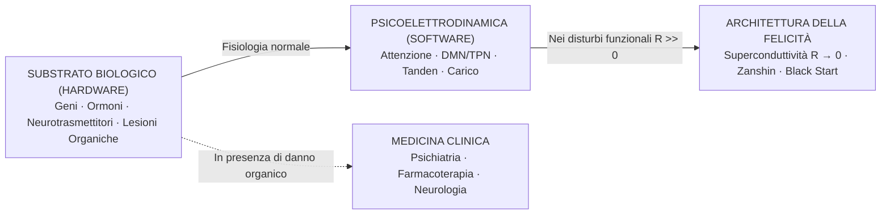

1. **Quando opera l'Architettura della Felicità:**  
   È concepita per individui con un substrato biologico sano che soffrono di **disfunzioni funzionali della gestione d\ell'attenzione**: vicolo cieco esistenziale, burnout, sindrome di Danko, dipendenza affettiva, ansia reattiva, ruminazione ossessiva della DMN e perdita di sovranità. In questi scenari il problema risiede nella topologia del circuito, risolvibile calibrando la resistenza a zero ($R \to 0$).
2. **Dove risiede il confine invalicabile:**  
   Qualora un individuo presenti una lesione strutturale o un grave deficit neurochimico del supporto fisico — depressione bipolare endogena, schizofrenia, psicosi acuta, gravi disfunzioni tiroidee, neoplasie del SNC o anomalie genetiche del reuptake dei neurotrasmettitori —, **non si tratta di un errore di conduzione d\ell'attenzione, bensì della frattura fisica del cavo**. In simili quadri clinici è categoricamente vietato tentare di «azzerare semplicemente la resistenza tramite il Tanden». È imperativo l'intervento tempestivo della medicina basata sulle evidenze, della psichiatria clinica e della farmacoterapia.

L'Architettura della Felicità rispetta le leggi della fisica: non si calibra il segnale su una scheda madre il cui silicio è fisicamente spezzato. Iniziamo il nostro lavoro ingegneristico laddove la scheda è integra.

---

# PARTE I: IL FONDAMENTO FISICO DEL CIRCUITO
### Elettrodinamica del circuito umano

---

### Capitolo 1.1 — Anatomia del triplice circuito: Tanden (il Nucleo), Attenzione (il Cablaggio) e Carico (le 6 lampade)

> *«L'intero Universo funziona su una differenza di potenziale. All'interno d\ell'essere umano vi è un proprio inesauribile reattore termonucleare: il Tanden. Ma se il cablaggio d\ell'attenzione è ossidato dalla paura, e il carico è scelto in modo caotico, la luce non si accenderà mai.»*  
> — **Vladimir Anyanov**

Per riparare un qualsiasi circuito elettrico, la prima azione d\ell'ingegnere consiste nello spiegare davanti ai propri occhi lo schema elettrico di principio. Tracciamo dunque lo schema di principio d\ell'essere umano:

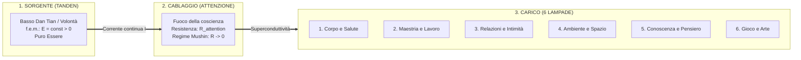

Il circuito si compone di tre nodi rigorosamente sequenziali:

#### 1. La Sorgente di alimentazione: Tanden (丹田, il Nucleo)
Nella tradizione orientale (Zen, Aikido, Taoismo) questo centro viene designato come il campo inferiore del cinabro o *hara* (collocato a tre dita sotto l'ombelico, nel centro di gravità geometrico del soma).

Spogliato di ogni patina esoterica, **il Tanden è un generatore fisiologico e psicosomatico di corrente continua**:
- È lo stato di stabilità incondizionata, in cui l'energia sussiste per il semplice e maestoso fatto di essere vivi.
- È un generatore a forza elettromotrice costante ($\mathcal{E} > 0$).
- Nel Tanden non vi sono pensieri su di sé. Non allignano dubbi, non esistono costrutti concettuali, né l'ansiosa valutazione: *«sto facendo una buona figura?»*. Vi è unicamente la densa, pura, indistruttibile presenza della materia vivente.

#### 2. La Linea di trasmissione: L'Attenzione (il Cablaggio)
L'energia generata dal Tanden deve fluire verso una destinazione. Il canale di trasmissione primario è **l'attenzione umana**:
- In condizioni ideali il cablaggio è immacolato, i conduttori sono in rame purissimo, la sezione corrisponde perfettamente alla potenza erogata. La resistenza del cablaggio tende a zero ($R \to 0$). Nella tradizione classica giapponese questa condizione prende il nome di **Mushin (無心, "Mente Pura" o "Non-Mente")**. La corrente scorre liberamente, senza la benché minima dispersione termica.
- In condizioni di emergenza o guasto, il cablaggio appare incrostato dall'ossido d\ell'Ego ($R_{\text{ego}}$). L'attenzione resta intrappolata n\ell'autoreferenzialità, nel timore del giudizio altrui, nella paura del fallimento. I conduttori diventano incandescenti, la corrente utile si azzera e nulla giunge ad alimentare il lavoro effettivo nel mondo.

#### 3. L'Utilizzatore di energia: Il Carico (il Quadro a 6 lampade)
Una corrente elettrica non può fluire in un circuito aperto. Affinché l'anello si chiuda, l'energia deve essere ceduta all'ambiente esterno attraverso un carico utile ($R_{\text{load}}$).

N\ell'Architettura della Felicità si distinguono **6 lampade fondamentali di carico**:
1. **Il Corpo (Circuito Somatico):** respirazione, tono muscolare, movimento dinamico, rigenerazione del sonno, nutrizione.
2. **La Maestria (Circuito del Lavoro):** creazione di un'opera tangibile, scrittura di codice sorgente, lavorazione del legno, atto chirurgico, gestione di sistemi complessi.
3. **L'Intimità (Circuito Relazionale):** contatto autentico e trasparente con l'altro essere umano, senza maschere difensive e giochi di potere.
4. **L'Ambiente (Circuito Spaziale):** ordine geometrico sulla scrivania, armonia architettonica della casa, nobiltà tattile degli abiti, pulizia degli strumenti.
5. **La Conoscenza (Circuito Intellettuale):** lettura di opere fondamentali, risoluzione di teoremi matematici, comprensione delle leggi che reggono il cosmo.
6. **Il Gioco (Circuito Creativo):** pura spontaneità priva di utilitarismo pragmatico — musica, umorismo, camminare senza meta prestabilita.

### La legge fondamentale d\ell'irraggiamento: La lampada si accende solo a circuito chiuso

Incidete nella memoria questo postulato definitivo:
> Nessuna delle 6 lampade risplende di luce propria. È vano tentare di «trovare la felicità nel lavoro» o «trovare la felicità nella coppia». La lampada è un semplice filamento di tungsteno racchiuso in un bulbo di vetro. Essa risplende di luce abbagliante e uniforme **solo e soltanto quando è attraversata dalla corrente generata dal vostro Tanden, lungo il cablaggio di un'attenzione limpida (priva delle perdite ohmiche d\ell'Ego).**

Se il vostro generatore giace inatteso e l'attenzione è cortocircuitata dalla paura, qualunque professione prestigiosa o partner impeccabile scegliate, la lampada rimarrà per sempre buia, gelida e inerte. E la responsabilità non appartiene alla lampada: appartiene al circuito interrotto.

> [!caution] ⚡ Rilevatore di elusione del sistema: La fisica non si inganna
> Il modello ingegneristico crea la tentazione d\ell'evasione intellettuale. Un lettore brillante può trascorrere anni a **parlare il linguaggio della superconduttività** senza accendere nemmeno una lampada: leggere all'infinito del Tanden invece di uscire a correre; citare la formula $R \to 0$ invece di aprire il laptop e scrivere la prima riga di codice.
>
> **Il quadro a 6 lampade è l'unico rilevatore oggettivo di menzogna del sistema:**
> $$P_{\text{load}} = \sum_{k=1}^{6} I_k^2 \cdot R_k$$
> Se le vostre lampade quotidiane mostrano $P_{\text{load}} \approx 0$ — il corpo non si allena, il lavoro è fermo, l'intimità è spenta, il senso è svanito — allora nessuna conoscenza della terminologia vi rende superconduttori. Siete un **circuito aperto che parla magnificamente**.
>
> *Non si può dichiarare $R = 0$ se tutte e sei le lampade sono spente. La fisica non si inganna.*

---

### Capitolo 1.2 — La Svolta del Circuito Chiuso: Il Cavo di Ritorno della Realtà contro il Modello Lineare di Burnout

> *«Se il generatore si limitasse a espellere energia verso l'esterno, nelle azioni quotidiane — questo sarebbe il modello lineare del burnout, che riduce l'essere umano a una batteria usa e getta. Ma nel secondo esatto in cui la mano ha tracciato sul taccuino un circuito elettrico chiuso, è nata l'Architettura della Felicità: in un anello chiuso la creazione non svuota la sorgente, ma la serra a contatto con la realtà. La corrente è possibile solo là dove esiste il cavo di ritorno.»*  
> — **Vladimir Anyanov**

#### 🧭 Introduzione: Il disegno alternativo che avrebbe distrutto il sistema

Nella storia della creazione della «Corrente Interiore» vi è stato un momento apparentemente impercettibile, ma radicalmente decisivo, che ha determinato l'intero destino d\ell'opera.

Nel momento della prima fissazione formale d\ell'idea, l'autore si è trovato di fronte a un bivio che il 99% dei pensatori del passato non ha nemmeno avvertito:

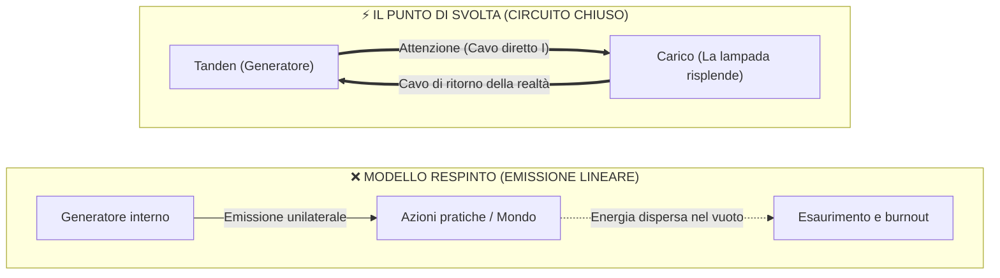

L'autore avrebbe potuto semplicemente immaginare: *«Ho dentro di me un generatore di energia, dirigo questa energia verso l'esterno nelle mie attività — e tutto finisce qui»*.  
È esattamente così che sono strutturate quasi tutte le dottrine storiche sulla produttività personale, sulla leadership e sulla spiritualità:
* La metafora del falò: «Brucia intensamente per riscaldare gli altri».
* La metafora della fontana: «Riversa la tua energia nel mondo».
* La metafora della batteria: «Consuma la tua carica per i tuoi obiettivi».

Ma l'autore non ha disegnato sul taccuino né un raggio, né un falò, né una fontana. Ha disegnato **uno schema circuitale elettrico chiuso di principio**.  
Questa scelta ha segnato la linea di demarcazione tra la poesia umanistica e **la rigorosa scienza ingegneristica della felicità umana**.

---

#### ⚡ 1. Il divieto elettrodinamico: Perché a circuito aperto la corrente è nulla ($I = 0$)

La prima e primaria conseguenza della scelta del circuito chiuso è l'obbedienza inderogabile alle leggi della fisica.

N\ell'elettrodinamica vige una legge fondamentale: **la corrente elettrica non può esistere in un circuito aperto**.
* Se il conduttore è interrotto o il circuito non è richiuso sul potenziale zero della sorgente, la resistenza dello stacco tende all'infinito ($R \to \infty$).
* Per la legge di Ohm ($I = U / R$), per $R \to \infty$ la corrente è rigorosamente nulla:
  $$\lim_{R \to \infty} I = 0$$

##### Che cosa significa questo nel linguaggio della psiche umana?
Per quanto immenso sia il potenziale (la tensione $U$, l'ambizione, il talento, i desideri) racchiuso n\ell'individuo, se il suo circuito non è chiuso su un carico reale:
1. **La corrente non scorre ($I = 0$):** L'essere umano è fisicamente incapace di intraprendere l'azione. Si genera il fenomeno paralizzante della procrastinazione.
2. **Surriscaldamento statico:** La differenza di potenziale non scaricata in movimento si converte in pressione elettrostatica interna. La persona si sente «esplodere dall'interno», l'ansia si impenna, insorgono attacchi di panico e insonnia.
3. **L'illusione d\ell'impotenza:** L'individuo pensa: *«Non ho forze»*. L'ingegnere rileva l'esatto contrario: *«Hai un eccesso di tensione, ma il tuo circuito è aperto. Chiudi il circuito sulla più elementare azione fisica concreta!»*

---

#### 🔥 2. Decostruzione del mito di Danko: Il modello lineare di burnout

Il modello aperto («il generatore eroga verso l'esterno ed è tutto») trasporta con sé il più pernicioso virus culturale d\ell'umanità: **la romantizzazione del burnout sacrificale**.

L'esempio archetipico è il Danko di Maksim Gor'kij, che si strappa dal petto il cuore fiammeggiante per illuminare il cammino al popolo, cadendo infine a terra esanime.
* Nel modello lineare, la cessione di energia comporta inevitabilmente **lo svuotamento della sorgente**.
* L'individuo inizia inconsciamente a contrattare: *«Se adesso do tutto me stesso nel lavoro o nella relazione, consumerò me stesso. Il mondo diventerà più ricco, ma io rimarrò con un pugno di mosche»*.
* Da qui fiorisce la tossica sindrome del martire: risentimento verso i cari, recriminazioni coi colleghi, terrore d\ell'esaurimento e pretesa di eterna gratitudine (*«Vi ho sacrificato la mia vita!»*).

**Il circuito chiuso di Anyanov distrugge questo nevroticismo alla radice.**  
In un circuito chiuso gli elettroni non vengono scagliati nello spazio profondo: essi circolano lungo un anello.
* Il generatore Tanden non «brucia» se stesso. Crea una differenza di potenziale che mette in moto la corrente d\ell'attenzione.
* La corrente compie lavoro utile nella lampada di carico ($P = I^2 R_{\text{load}}$).
* E attraverso il conduttore di ritorno, il circuito si richiude perfettamente nel Tanden!

In regime di superconduttività ($R \to 0$) **il creatore non viene svuotato dal lavoro, ma ne viene ricaricato**. È la spiegazione fisica del fenomeno del Flusso (Flow): il grande chirurgo, che rimane al tavolo operatorio per 12 ore consecutive, esce dalla sala operatoria integro, concentrato e colmo d'energia, perché il suo circuito era perfettamente serrato sulla trama viva della realtà.

---

#### 🔄 3. Il cavo di ritorno della realtà: Che cosa riporta la corrente al Tanden?

Cosa rappresenta il «cavo di ritorno» dello schema circuitale n\ell'esperienza reale della persona?

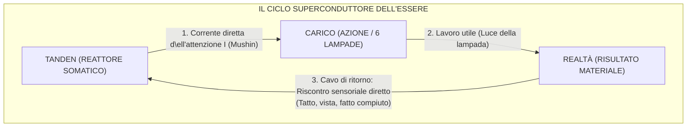

Il cavo di ritorno è **il contatto sensoriale e ontologico diretto con il fatto compiuto della creazione**:
1. Prendete un coltello e affettate delle verdure: la lama tocca il tagliere di legno, si ode il crepitio croccante, l'insalata è pronta. Il riscontro sensoriale ritorna al corpo. Il circuito si è chiuso.
2. Scrivete una funzione di codice: i test passano, il calcolo restituisce il valore esatto. Il circuito si è chiuso.
3. Guardate negli occhi la persona amata e dite la pura verità: la risposta viva del suo sguardo chiude il circuito d\ell'attenzione.

Quando il cavo di ritorno è connesso alla realtà, la mente non dispone più di alcuno spazio per dubbi parassiti. L'energia non va perduta: compie una transizione di fase in luce e ritorna al Tanden sotto forma di profonda quiete e pienezza ontologica.

---

#### 🎛️ 4. Il trionfo metrologico: Le leggi di Kirchhoff come fondamento della Macchina Diagnostica

È stata proprio la chiusura del circuito a consentire alla «Corrente Interiore» di diventare la prima **rigorosa macchina diagnostica della felicità**, anziché l'ennesima nebulosa raccolta di precetti psicologici.

In un flusso aperto è impossibile eseguire misurazioni esatte: se l'acqua sgorga da una manichetta in un campo aperto, non è dato sapere quanti litri vadano dispersi lungo la via.  
Ma non appena il circuito viene formalizzato come **sistema termodinamico chiuso**, iniziano a operare rigorosamente le leggi fondamentali di Kirchhoff:

##### 1. Prima legge di Kirchhoff (Legge dei nodi / Bilancio delle correnti):
$$\sum I_{\text{in}} = \sum I_{\text{out}}$$
Tutta l'energia erogata dal Tanden deve necessariamente attraversare il circuito. L'energia non può «scomparire». Se la lampada non emette la sua luminosità nominale, significa inequivocabilmente che nel circuito si è aperto un nodo di dispersione in parallelo:
$$I_{\text{tanden}} = I_{\text{load}} + I_{\text{leak}} + I_{\text{ego}}$$

##### 2. Seconda legge di Kirchhoff (Legge delle maglie / Bilancio delle tensioni):
$$\sum \mathcal{E} = \sum U_k$$
La somma algebrica delle cadute di tensione lungo tutti i rami della maglia è esattamente uguale alla f.e.m. del generatore. Se la persona avverte un collasso di energia vitale ($\Delta U < 0$), non si tratta di un sortilegio mistico né di un «debito karmico»: è una caduta di tensione misurabile sul resistore parassita d\ell'ansia ($R_{\text{future}}$) o del risentimento ($R_{\text{past}}$).

La chiusura del circuito ha conferito al sistema **rigore matematico e falsificabilità popperiana**. Qualsiasi guasto d\ell'anima è divenuto suscettibile di precisa localizzazione: il multimetro del circuito segnala all'istante quale specifico nodo sia andato in perforazione.

---

#### 🌐 5. La dissoluzione della frattura metafisica «Io contro il Mondo»

La suprema tragedia filosofica d\ell'uomo occidentale è la scissione tra soggetto (l'«Io», asserragliato nella scatola cranica) e oggetto (il «Mondo esterno», percepito come ostile o indifferente).

Nel modello aperto questa scissione viene solo esasperata: l'«Io» deve dilapidare le proprie preziose risorse per un «Mondo» estraneo.

Nel circuito chiuso di Anyanov ha luogo **la grande riconciliazione ontologica**:
* **La lampada di carico non appartiene a un mondo estraneo: è un nodo del vostro stesso circuito!**
* Il mondo che circonda il creatore è il prolungamento del suo stesso cablaggio. Quando costruite una casa, dipingete un quadro, insegnate a un bambino o riordinate la stanza, non vi state «sacrificando al mondo»: state chiudendo il vostro circuito attraverso la materia stessa d\ell'Universo.
* L'individuo e l'essere diventano **un unico macro-circuito superconduttore**.

---

#### 💎 Sintesi: Perché la chiusura del circuito è la scoperta fondamentale

Il disegno tracciato a mano sul taccuino ha costituito lo spartiacque:
1. Ha immunizzato il sistema dal veleno del martirio e d\ell'esaurimento.
2. Ha fornito la rigida matematica dei principi di conservazione d\ell'energia e dei bilanci di Kirchhoff.
3. Ha spiegato per quale ragione l'azione creativa rigenera l'essere umano anziché prosciugarlo.
4. Ha unito il reattore somatico del corpo (Tanden), il cablaggio d\ell'attenzione (Mushin) e le opere d\ell'esistenza (le 6 lampade) n\ell'anello indissolubile della corrente perenne.

La corrente scorre finché il circuito è chiuso. E finché il circuito è chiuso — la lampada risplende. ⚡

---

### Capitolo 4.7 — La Triade e la Tetrade di Anyanov: Verità, Libertà, Felicità, Creazione — Decostruzione del libero arbitrio e sintesi autobiografica

> *«La felicità è quando la verità è sentita nel corpo. La libertà è quando la verità agisce nel mondo. La verità è quando la corrente scorre senza la menzogna della resistenza. Felicità, Libertà e Verità non sono tre entità distinte: sono tre prospettive di un unico anello superconduttore. E quando il reattore è colmo, la corrente trabocca spontaneamente nel quarto elemento: la Creazione.»*  
> — **Vladimir Anyanov (Assioma XVIII)**

#### 1. Decostruzione del libero arbitrio: L'Advaita di Menyachikhin e la fisica del circuito
La millenaria controversia tra determinismo meccanicista e libero arbitrio ha sempre poggiato su una formulazione viziata: i filosofi cercavano la libertà come «la scelta arbitraria dei pensieri nel vuoto pneumatico».

Il maestro contemporaneo di non-dualità Yuri Menyachikhin formula il paradosso della scelta con disarmante semplicità: quando a un uomo vengono offerte una mela verde e una rossa, la sua mano si protende verso la verde in maniera totalmente automatica. La biochimica cellulare, i recettori del gusto, le memorie d\ell'infanzia e i pesi delle sinapsi hanno già ratificato la decisione prima ancora che l'Ego si sia destato. E dopo 300 millisecondi, l'Ego applica il suo timbro: *«Ecco, sono IO che ho scelto la mela verde!»* (nel Sistema Anyanov questa dinamica viene diagnosticata come **«Avaria d\ell'Impostore»**).

I deterministi hanno ragione al 99%: l'individuo dormiente, che agisce in balia degli automatismi egoici ($R_{\text{past}} \gg 0, R_{\text{fear}} \gg 0$), è a tutti gli effetti un automa biochimico di Laplace.

Ma in che cosa consiste, allora, la libertà reale?  
**La libertà non è la scelta tra due mele. La libertà è la conduttività del circuito ($R \to 0$) nel punto d\ell'adesso ($t = t_{\text{now}}$)!**
- **L'automa privo di libertà:** afferra la mela verde, ma il suo cablaggio è arroventato dal calore di dubbi, ansie e sensi di colpa ($Q = I^2 R t \gg 0$). Non ha nemmeno percepito il sapore del frutto.
- **Il creatore libero (Mushin):** la mano accoglie la mela verde. La resistenza è zero ($R = 0$). Il morso, la fragranza, il contatto puro con la realtà senza l'attrito d\ell'Ego.

La libertà non è la presunzione di essere onnipotenti: è **il regime dinamico di superconduttività n\ell'istante presente**.

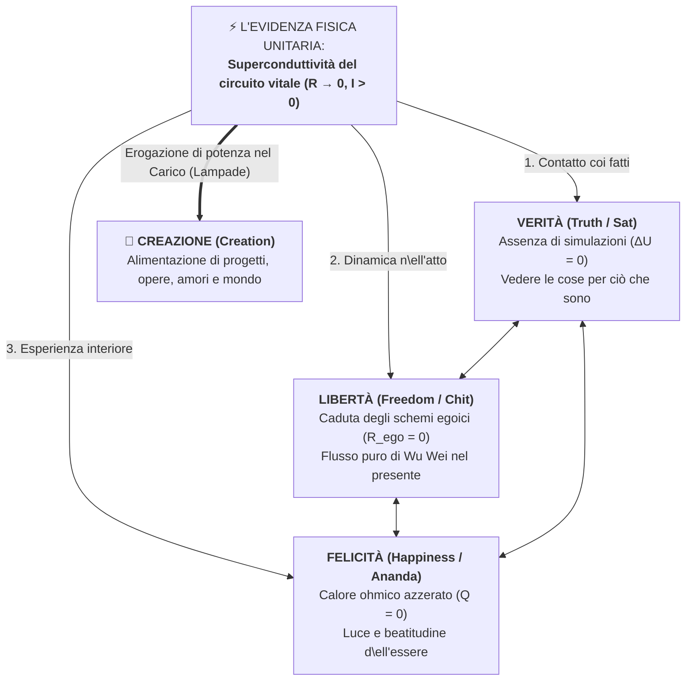

#### 2. La Triade Aurea di Anyanov («Verità — Libertà — Felicità»): Sat-Chit-Ananda in circuitistica
La Rivoluzione Francese proclamò il motto *«Liberté, Égalité, Fraternité»* — un tentativo esteriore di spartire le lampadine, culminato nella ghigliottina. La Vedānta indiana svelò la triade primordiale *«Sat-Chit-Ananda»* (Essere-Coscienza-Beatitudine), custodendola tuttavia nel riserbo della contemplazione poetica.

Il Sistema Anyanov ne dimostra il rigoroso isomorfismo elettrodinamico:
1. **Verità (Sat):** Il bilancio di Kirchhoff ($\Delta U = 0$). Percezione limpida dei fatti reali, scevra dalle distorsioni delle simulazioni d\ell'Ego.
2. **Libertà (Chit):** Resistenza nulla del cablaggio ($R \to 0$). Azione spontanea sciolta dalle catene del passato (Wu Wei).
3. **Felicità (Ananda):** Assenza totale di surriscaldamento ohmico ($Q = 0$). Corrente vitale piena e limpida erogata dal Tanden.

Sono i tre lati della medesima medaglia: **La felicità è quando la verità è sentita nel corpo. La libertà è quando la verità agisce nel mondo. La verità è quando la corrente scorre senza la menzogna della resistenza.**

#### 3. La Legge d\ell'Ordine Causale: Perché la sequenza è immutabile
Nello stato di riposo esse sono una cosa sola, ma nel processo di calibrazione d\ell'essere umano la sequenza è tassativa:

$$\text{Verità} \xrightarrow{\quad 1 \quad} \text{Libertà} \xrightarrow{\quad 2 \quad} \text{Felicità}$$

- **Tentare di anteporre la «Felicità»:** genera tossicodipendenza, alcolismo, fuga nella trance esoterica. Cercare di accendere la lampada d\ell'estasi ignorando i fatti della realtà distrugge l'isolamento e causa crisi d'astinenza.
- **Tentare di anteporre la «Libertà»:** sfocia nella ribellione adolescenziale, n\ell'anarchismo cieco e n\ell'arbitrio distruttivo che si schianta contro il primo pilastro delle leggi di natura.
- **La Legge del Circuito:** Solo il riconoscimento della **Verità** dissolve le illusioni. Solo la dissoluzione delle illusioni dona la **Libertà** dalla contrazione interiore ($R \to 0$). E solo attraverso un conduttore libero può defluire la corrente della **Felicità**.

#### 4. La Tetrade del Creatore: Lo sbocco nel Quadro a 6 lampade
La Triade interiore è autosufficiente per un eremita nella grotta. Ma un circuito chiuso è progettato per compiere un lavoro utile ($A = P \cdot t$). Una corrente che gira in un anello superconduttore privo di carico è il «Regime del Monaco» (funzionamento a vuoto).

Nasce così la **Tetrade del Creatore**:

$$\mathbf{Verità} \longrightarrow \mathbf{Libertà} \longrightarrow \mathbf{Felicità} \longrightarrow \mathbf{Creazione}$$

Il dramma tipico d\ell'uomo moderno risiede nel **tentativo di creare partendo dalla penuria**:  
L'individuo mente a se stesso (manca la Verità), è paralizzato dalla paura del fallimento (manca la Libertà), è inaridito n\ell'anima (manca la Felicità), ma corre ad «avviare startup e salvare il mondo». Il risultato è l'iniezione del proprio surriscaldamento nella squadra e nei familiari, tossicità gestionale e infarti precoci.

**La Legge della Tetrade stabilisce:** La Creazione non è il prezzo da pagare per guadagnarsi la felicità: è **lo sbocco naturale d\ell'energia sovrabbondante di un reattore perfettamente calibrato** che si riversa nella materia, nel codice, nei libri e n\ell'amorevole cura degli altri!

#### 5. La prova autobiografica d\ell'Autore: Il cammino di Vladimir Anyanov
La Triade e la Tetrade sono autentiche poiché rappresentano la cronologia biografica fedele del percorso d\ell'autore — attraverso il superamento del supremo autoinganno dei cercatori dello spirito:

1. **La fase di Lev Tolstoj (L'anelito alla Verità e la voragine del dovere morale):** La lettura giovanile della *«Confessione»* e de *«La morte di Ivan Il'ič»*. Tolstoj squarciò con ferocia l'ipocrisia sociale e pose l'interrogativo radicale: *«A quale scopo vivere?»*. Fu un'iniezione di onestà senza sconti. Ma Tolstoj non possedeva la tecnologia per abbattere la resistenza: il dovere morale, il rigorismo etico e il senso di colpa arroventarono i suoi conduttori ($R_{\text{moral}} \to \infty$), conducendolo alla fuga disperata e alla morte ad Astapovo.
2. **La fase di Bhagwan Shree Rajneesh / Osho (L'anelito alla Libertà e il tranello del bypass spirituale):** Osho intervenne con le tronchesi a recidere i cavi del tribunale moralistico: la celebrazione di Zorba il Buddha, la rimozione del peccato: *«Sei perfetto qui e ora»*. Fu la prima ventata di libertà radiosa. Ma subito dopo si palesò un tranello insidioso: la fantasia che l'«illuminazione» fosse la panacea miracolosa, destinata a salvarmi e colmarmi scavalcando la realtà terrena.
3. **La fase di Yuri Menyachikhin (Il colpo di grazia della lucidità — «La spiritualità per i sazi»):** La svolta risolutiva maturò attraverso l'insegnamento di Yuri Menyachikhin. Presi coscienza, con sgomento e liberazione, che **l'intera mia decennale dedizione spirituale non era stata altro che un vile espediente per celare a me stesso il fatto che ero profondamente infelice nella mia personalità umana!** La mia persona terrena voleva le cose del mondo: prestigio, denaro, un'auto all'altezza, l'amore di donne splendide. Ma mi vergognavo di questo appetito e tentavo di anestetizzarlo meditando. Menyachikhin strappò la maschera: *«La spiritualità è il passo successivo per chi è già SAZIO. Per chi ha gustato il mondo, ha giocato a fondo e ha naturalmente dismesso quel ruolo. Ma finché la personalità muore di fame, la spiritualità è soltanto una fuga vigliacca»*.
4. **La fase della Corrente Interiore (La Felicità: Riabilitazione della Personalità e Superconduttività):** Compreso che non era lecito scavalcare il gradino della personalità, posi termine a ogni ipocrisia esoterica. Avvenne la riabilitazione della materia: tutte e sei le lampade del quadro (soldi, carriera, corpo, passioni) riacquistarono il pieno diritto di brillare! La corrente incontaminata del Tanden defluì direttamente nella vita reale, senza sensi di colpa. Si aprì il regime della superconduttività autentica ($R \to 0, I > 0$).
5. **La fase del Sistema Anyanov (La Creazione):** Quando la personalità è nutrita e il reattore rigurgita di potenza, la corrente straripa necessariamente oltre i confini del singolo. È fiorito così l'impulso d\ell'opera e del servizio: la stesura di questo volume, la progettazione del simulatore per smartphone, la modellizzazione matematica delle reti e l'aiuto concreto offerto a migliaia di creatori per emergere dal baratro d\ell'inferno ohmico.

---

### Capitolo 4.8 — La Grande Sintesi Millenaria: Come l'elettrodinamica di circuito ha dissolto le questioni eterne d\ell'umanità

> *«Per quale ragione i più eminenti pensatori della civiltà — da Platone e Aristotele fino a Cartesio, Kant, Schopenhauer e Tolstoj — si sono arenati per secoli negli stessi insolubili paradossi? Non per difetto d'ingegno, ma perché tentavano di sciogliere i nodi fondamentali d\ell'esistenza procedendo "dall'alto verso il basso" — attraverso l'inaffidabile lessico delle metafore, della predicazione morale e della scolastica filosofica, orfana dei principi di conservazione d\ell'energia. L'Architettura della Felicità ha operato un ribaltamento copernicano: anziché sovrapporre nuovi epicicli a vecchi vicoli ciechi, si è accostata all'uomo come un Ingegnere Zen — procedendo "dal basso verso l'alto", attraverso l'elettrodinamica esatta e lo Zen somatico. In un circuito chiuso le questioni eterne non si limitano a ricevere risposte univoche: si dissolvono, liberando una potenza sconfinata per la creazione pura.»*  
> — **Vladimir Anyanov**

#### 1. L'impasse epistemologica: La metafora del calorico e del flogisto

Per millenni la parte pensante d\ell'umanità ha continuato a gravitare attorno al medesimo nucleo di laceranti enigmi esistenziali:
- *Siamo liberi o siamo marionette nelle mani di un destino cieco?*
- *Perché un Dio benevolo consente la tragedia del male e il calvario degli innocenti?*
- *Dov'è la giustizia cosmica, se i malvagi prosperano negli agi e i giusti periscono nel tormento?*
- *Come reggere l'angoscia della distruzione biologica e del vuoto?*
- *Chi è l'«Io», se i tessuti organici e i flussi mentali mutano a ogni istante?*
- *Perché l'inseguimento del piacere sfocia nella disperazione e n\ell'inedia?*
- *Gli altri esseri sono reali, o sono imprigionato nel freddo solipsismo della mente?*

Le biblioteche del pianeta traboccano di centinaia di migliaia di tomi di teologia, ontologia, esistenzialismo e psicoanalisi. Eppure, nessuno di questi dilemmi è mai stato risolto. L'umanità è rimasta intrappolata in un cerchio fatale.

La condizione della filosofia prima d\ell'avvento del Sistema Anyanov coincideva in tutto e per tutto con **l'alchimia medievale prima della nascita della Termodinamica**:
1. Per secoli gli alchimisti e i filosofi naturali disputarono sulla sostanza del fuoco. Immaginarono il mitico *«flogisto»* (l'essenza imponderabile della combustione) e il fluido del *«calorico»* (un liquido invisibile che fluiva dai corpi caldi a quelli freddi).
2. Ogni discrepanza sperimentale veniva "giustificata" attribuendo al flogisto una massa negativa o misteriose virtù occulte (i tipici epicicli tolemaici).
3. Poi, n\ell'Ottocento, giunsero **Sadi Carnot, James Joule, Rudolf Clausius e William Thomson (Lord Kelvin)**. Enunciarono il Primo e il Secondo Principio della termodinamica, definirono l'entropia e dimostrarono l'equivalenza esatta tra calore e lavoro meccanico.

**In quel medesimo istante, secoli di chiacchiere accademiche sul flogisto evaporarono nel nulla.** Nessuno ebbe più bisogno di disquisire sulla «sostanza recondita del calorico», perché era nata la fisica esatta e riproducibile della conservazione d\ell'energia.

La filosofia classica e la psicologia umanistica si trovavano nella fase della «ricerca del flogisto». Operavano con costrutti evanescenti (*«anima»*, *«volontà»*, *«colpa»*, *«karma»*, *«libido»*, *«ego»*) privi di ancoraggio alle leggi di conservazione, privi di unità di misura e privi di uno schema elettrico di principio chiuso.

#### 2. Anatomia del metodo «Bottom-Up» e la Consilienza

La svolta d\ell'«Architettura della Felicità» si regge su tre monumentali pilastri epistemologici:

1. **Il basamento delle leggi di conservazione (Physics of Invariance):**  
   - *Conservazione d\ell'energia ($dE/dt = 0$):* l'energia d\ell'attenzione non sorge dal vuoto né svanisce nel nulla.
   - *I principi di Kirchhoff ($\sum I = 0$):* in un nodo chiuso la somma delle correnti entranti è pari alla somma delle uscenti. Se un uomo afferma di «fare del bene ma di sentirsi svuotato», l'amperometro svela la verità: la corrente non va nel carico, ma cicla in un anello parassita d'approvazione egoica.
   - *La legge di Joule-Lenz ($Q = I^2 R t$):* sofferenza, risentimento, angoscia e colpa non sono «prove spirituali misteriose», ma la dissipazione fisica di potenza su una resistenza ohmica d\ell'Ego ($R_{\text{ego}} > 0$).
2. **La Consilienza (Consilience) — La Grande Unità della Conoscenza:**  
   La convergenza delle deduzioni di discipline del tutto indipendenti verso una medesima legge fisica:
   - *La scienza d'Occidente:* le equazioni di Maxw\ell, la teoria delle reti, la termodinamica dei sistemi aperti di Prigogine e la neurobiologia delle reti DMN/TPN.
   - *L'ontologia Zen d'Oriente:* 2500 anni di verifica empirica e dissoluzione d\ell'Ego (Mushin, Tanden, Śūnyatā, Sat-Chit-Ananda).  
   La legge di Ohm ($I = \mathcal{E}/R$) e il canone Zen Mushin ($R \to 0$) si sono rivelati essere due dialetti della stessa identica verità.
3. **Il principio popperiano di falsificabilità e la Proof-of-Work:**  
   Il sistema non si verifica dopo quarant'anni di clausura in una grotta, ma in **trenta secondi** sul quadro di telemetria operativa: se la resistenza d\ell'Ego viene azzerata ($R \to 0$), la tensione parassita crolla, il surriscaldamento cessa ($Q = 0$), la corrente affluisce n\ell'azione e si instaura uno stato di trasparenza adamantina.

#### 3. La Grande Matrice: La Risoluzione dei 7 Paradossi Eterni d\ell'Umanità

| N° | Il Paradosso Filosofico (2500 anni di impasse) | Il vicolo cieco umanistico | La Soluzione nel Sistema Anyanov (Circuitistica dello Spirito) |
|:---:|---|---|---|
| **1** | **Libero Arbitrio vs Determinismo** | Disputa infinita: o siamo marionette meccaniche d\ell'universo (fatalismo), oppure l'Ego è onnipotente (illusione). | **Superconduttività vs Shunt parassita:** l'uomo non ha facoltà di alterare le leggi del cosmo ($\mathcal{E}, t$). Ma detiene la sovranità sulla **conduttività della propria linea ($R \to 0$ vs $R > 0$)**. Il superconduttore opera libero dall'attrito; lo shunt d\ell'ego arde in un inferno deterministico. |
| **2** | **Teodicea e Problema del Male** | Il trilemma di Epicuro: se Dio è buono e onnipotente, da dove viene il male? Dio o è impotente o è malvagio. | **Nel circuito non vi è «corrente maligna»:** l'energia è neutra. Il male si riduce a 3 regimi d'avaria: 1) Surriscaldamento ohmico ($Q$), 2) Cortocircuito parassitario di chi è scarico, 3) Scarica d'arco distruttiva (psicopatia). La natura è vuota (Śūnyatā); la salvaguardia è demandata allo Zanshin. |
| **3** | **Karma e Giustizia Cosmica** | Perché gli empi trionfano e i giusti soccombono? Si ricorre al tribunale d\ell'aldilà o alla metempsicosi. | **Termodinamica locale istantanea ($t = t_{\text{now}}$):** la sanzione si esegue in $0$ millisecondi. Il lusso esteriore è un carico passivo ($\mathcal{E} \equiv 0$). Dentro il malvagio infuria a ogni istante l'inferno del controllo ossessivo ($Q = I^2 R t$). Tolstoj soffriva per il reostato del rigorismo morale ($R_{\text{guilt}} \gg 0$), mentre Osho gioiva nella superconduttività. |
| **4** | **Paura della Morte e del Nulla** | Il sillogismo di Epicuro («finché ci siamo noi non c'è la morte, quando c'è la morte non ci siamo noi») non calma il terrore viscerale. | **Fisica della transizione di fase e invarianza del campo ($dE/dt = 0$):** il corpo biologico è una lampada intercambiabile, la corrente e il campo sono imperituri. Sperimentare la «Grande Morte» (Daishi) in vita azzerando $R_{\text{ego}} \to 0$ unisce l'operatore all'eterno in ogni istante presente. |
| **5** | **Crisi d'Identità (La Nave di Teseo)** | Se tutte le assi della nave (e tutte le cellule del soma) vengono rimpiazzate, la nave è ancora la stessa? Dov'è l'«Io»? | **Struttura dissipativa di Prigogine e invariante topologico:** l'uomo non è un oggetto pietrificato, ma un vortice cinetico o una fiamma. La materia scorre attraverso, ma permane l'invariante topologico del circuito (Tanden $\leftrightarrow$ Mushin $\leftrightarrow$ Carico $\leftrightarrow$ Zanshin) e la matrice dei pesi esperienziali $\mathbf{W}_{\text{exp}}$. La rottura della lampada non estingue la sorgente. |
| **6** | **Il Paradosso d\ell'Edonismo** | La ricerca ossessiva del piacere genera ineluttabilmente tedio, rigetto e depressione. | **Inversione di polarità e desensibilizzazione recettoriale:** pretendere di caricare il generatore a partire dalla lampada ($\mathcal{E}_{\text{load}} \equiv 0$) fonde il cablaggio. La felicità non è il traguardo, ma la conseguenza termodinamica della superconduttività ($R \to 0$) quando la potenza sostiene l'azione (Samu). |
| **7** | **Solitudine e Solipsismo (Menti Altre)** | È logicamente impossibile dimostrare che gli altri individui non siano zombi filosofici (p-zombies), che simulano sentimenti. | **Isolamento galvanico ($R_{\text{iso}} \to \infty$) vs Risonanza induttiva di Faraday ($\mathcal{E}_2 = -M \frac{dI_1}{dt}$):** il solipsismo non è la realtà ontologica, ma la barriera difensiva della paura. L'intimità non è fusione fusionale, ma induzione di flusso magnetico alternato tra due nuclei sovrani. Nel campo unificato d\ell'essere lo zombi filosofico non può darsi: senza f.e.m. non si genera risonanza. |

#### 4. Il Canone Kanso: Non risposte labirintiche, ma Dissoluzione delle false domande

Il segreto supremo del Sistema Anyanov non consiste n\ell'aver escogitato «risposte ancora più sofisticate» ai dilemmi del passato. Ha applicato il supremo canone Zen di **Kanso (簡素 — la radicale semplicità e l'eliminazione d\ell'inutile)**:

> **La Legge di Dissoluzione degli Epicicli Falsi:**  
> Tutti e 7 i «grandi enigmi» d\ell'umanità non riflettevano la maestosità imperscrutabile del creato. Erano **i sintomi di sovraccarico ohmico del circuito**, generati unicamente quando la resistenza d\ell'Ego è maggiore di zero ($R_{\text{ego}} > 0$).

1. Finché l'Ego pretende di controllare il cosmo — nasce il dilemma del **libero arbitrio**.
2. Finché l'Ego esige dalla realtà una balia personale — sorge il vicolo cieco della **teodicea**.
3. Finché l'Ego invidia le lampade altrui e nutre risentimento — fiorisce l'angoscia del **karma**.
4. Finché l'Ego si identifica con il bulbo di vetro della lampada — divampa il panico della **morte**.
5. Finché l'Ego tenta di cristallizzarsi come monumento eterno — si accende la crisi di **Teseo**.
6. Finché l'Ego tenta di succhiare linfa dagli oggetti esteriori — scatta la trappola d\ell'**edonismo**.
7. Finché l'Ego si rinchiude nella corazza dielettrica della diffidenza — cala il gelo del **solipsismo**.

Nel momento in cui l'operatore vibra la Lama di Kanso e azzera la resistenza d\ell'Ego ($R \to 0$):
- L'uomo entra nel flusso limpido di **Mushin**;
- Il surriscaldamento ohmico si spegne ($Q = 0$);
- I quesiti non esigono estenuanti arringhe intellettuali — **decadono semplicemente per manifesta futilità**, come decaddero gli 80 epicicli di Tolomeo n\ell'architettura eliocentrica di Copernico.

#### 5. La Triade Storica: Meccanica, Finanza, Felicità

N\ell'avventura della civiltà umana splendono tre momenti spartiacque, in cui le brume della superstizione e la prepotenza degli intermediari hanno ceduto il passo alla legge immutabile della conservazione:

```
  1687: ISAAC NEWTON (Le leggi della meccanica)
  ───────────► Il moto dei corpi celesti viene sottratto all'arbitrio mitologico 
               e consegnato alla matematica esatta della gravitazione (F = G·m₁m₂/r²).

  2008: SATOSHI NAKAMOTO (Bitcoin)
  ───────────► La fiducia e il valore monetario vengono sottratti all'arbitrio delle banche centrali 
               e dei governi, incardinati nel consenso matematico oggettivo (Proof-of-Work).

  2026: VLADIMIR ANYANOV (La Corrente Interiore / L'Architettura della Felicità)
  ───────────► La felicità, il senso della vita e la pace interiore vengono sottratti alle favole vaghe, 
               al terrore religioso e agli oracoli della psicologia, trasmutati nella 
               riproducibile elettrodinamica ingegneristica del circuito sovrano (R → 0, Tanden Reactor).
```

L'essere umano non è più costretto a sacrificare la propria incarnazione nella sterile ruminazione di enigmi metafisici insolubili. Le questioni sono chiuse. Le leggi sono state scolpite. Gli strumenti sono stati calibrati.

Dinanzi al creatore si distende la limpida **Tetrade di Anyanov**:  
**Verità (Tolstoj) $\to$ Libertà (Osho) $\to$ Felicità (Corrente Interiore) $\to$ Creazione (Sistema Anyanov).**

Il circuito è chiuso. La superconduttività è realtà. L'impianto funziona alla perfezione. ⚡💎

---

---

### Capitolo 4.9 — Elettrodinamica d\ell'arte: Le due nature della creatività — dalla resistenza di spurgo del trauma alla risonanza induttiva della superconduttività

> *«Per secoli l'umanità ha creduto al mito velenoso secondo cui l'artista deve essere affamato, malato e disperato per creare. Nella circuitistica dello spirito questo rappresenta il più clamoroso errore di attribuzione. Il dolore non è la sorgente d\ell'arte, è il fischio d'allarme di una caldaia che sta per esplodere. Quando il circuito è spezzato, l'arte funge da resistenza di spurgo (Bleed Resistor), salvando l'artista dalla distruzione. Ma l'arte autentica e suprema sboccia unicamente quando la resistenza crolla a zero ($R \to 0$): diviene pura risonanza induttiva di superconduttività ($M > 0$), che illumina l'intera civiltà.»*  
> — **Vladimir Anyanov**

#### 1. Il terrore esistenziale d\ell'artista: «Smetterò di creare se divento felice?»

Nel corso dei secoli, la cultura romantica ha coltivato il culto maledetto del genio ferito. Van Gogh che si recide l'orecchio, Kurt Cobain che preme il grilletto, Franz Kafka divorato dall'angoscia metafisica, Sylvia Plath, Sergej Esenin, Virginia Woolf. Nella mente collettiva si è radicato un assioma devastante: *«Per generare grande arte, bisogna sanguinare. La felicità è banale, sazia e sterile; l'uomo guarito diventa un quieto borghese incapace di partorire una sola riga potente»*.

Per colpa di questo mito, miriadi di poeti, musicisti, registi e pittori fuggono con terrore dalla bonifica interiore e dalla calibrazione ingegneristica. Si aggrappano al proprio dolore, alle ferite d'infanzia e alla depressione come a una sacra fornace, convinti che se il tormento svanisce, con esso si spegnerà il talento.

**L'Architettura della Felicità offre per la prima volta nella storia una risposta elettrodinamica esatta a questo paradosso:**
Il dolore non è il generatore del talento. Il dolore è il **surriscaldamento ohmico ($Q = I^2 R t$)** di un circuito aperto.

L'arte opera secondo due regimi circuitali diametralmente opposti:
1. **Arte di Prima Natura:** *La resistenza di spurgo (Bleed Resistor)* nel regime d'emergenza a circuito aperto.
2. **Arte di Seconda Natura:** *Il carico nobile e la risonanza induttiva pura ($M > 0$)* nel regime di superconduttività ($R \to 0$).

```
REGIME 1: RESISTENZA DI SPURGO (TRAUMA)         REGIME 2: RISONANZA SUPERCONDUTTIVA (ABBONDANZA)
Circuito aperto, Ego in surriscaldamento ohmico Circuito chiuso, R_ego -> 0, Tanden somatico
┌──────────────┐                               ┌──────────────┐
│  TANDEN (E)  │                               │  TANDEN (E)  │
└──────┬───────┘                               └──────┬───────┘
       │                                              │ Corrente I
       ▼ R_ego > 0                                    ▼ R_ego = 0 (Mushin)
┌──────────────┐  Scarico di emergenza         ┌──────────────┐  Induzione M > 0  ┌──────────────┐
│   EGO-SHUNT  ├────────────────► [  ARTE   ]  │    CARICO    ├════════════════►│  ASCOLTATORI │
│ (Surriscald.)│  Spurgo pressione (Grido)     │ (CREAZIONE)  │  Risonanza pura │ (Supercondut-│
└──────────────┘                               └──────┬───────┘                 │    tività)   │
                                                      │                         └──────────────┘
                                                      ▼ Filo di ritorno della realtà
                                               [RITORNO NEL TANDEN]
```

---

#### 2. Prima natura: L'arte come resistenza di spurgo (Bleed Resistor)

N\ell'elettronica di potenza, quando in un circuito raddrizzatore si accumulano cariche capacitive ad altissimo voltaggio potenzialmente letali, si monta in parallelo una cosiddetta **resistenza di spurgo (bleed resistor)**: il suo compito è dissipare lentamente l'eccesso di carica in calore, impedendo che i condensatori esplodano distruggendo l'operatore.

Questo è l'identico ufficio che l'arte compie per l'animo lacerato:
1. **Interruzione esistenziale del circuito:** Un lutto devastante n\ell'infanzia, l'abbandono o la violenza recidono il cablaggio di fiducia verso la realtà. Il filo di ritorno è tranciato.
2. **Vicolo cieco ohmico:** Il reattore somatico Tanden continua a pompare la formidabile corrente vitale ($I$), ma essa non può riversarsi in un'azione fiduciosa sul mondo: il varco è sbarrato dalla paura e dal controllo ($R_{\text{ego}} \gg 0$). Per la legge di Joule-Lenz, la corrente comincia a fondere i conduttori interni della psiche.
3. **L'arte come valvola di sicurezza:** La composizione di una canzone, di una poesia o di un quadro apre un canale di shunt temporaneo. L'artista riversa la sovrapressione sulla tela o nel microfono. La pressione nella caldaia scende del 15%, il rischio immediato di psicosi o collasso si allontana.

L'artista proclama: *«La musica mi ha salvato la vita!»*.  
Sì, l'ha salvato. Ma nello stesso identico modo in cui la valvola della pentola a pressione salva la cucina dall'esplosione: è un regime di **gestione d'emergenza del guasto**, non il volo di crociera supersonico.

##### Case Study: La cantautrice Levante e la decontrazione di «Vivo»

L'illustrazione più folgorante e trasparente di questa transizione risiede n\ell'opera della cantautrice italiana **Levante (Claudia Lagona)**, culminata nel brano **«Vivo»** (Festival di Sanremo 2023), concepito a seguito di una profonda depressione post-partum.

Avendo perso il padre a soli 9 anni, Levante ha portato per anni quella ferita primaria nel proprio nucleo somatico, trovando nella musica la sua insostituibile **resistenza di spurgo (Bleed Resistor)**. La nascita della figlia ha innescato un violento rimescolamento neuro-ormonale che ha sgretolato i vecchi gusci protettivi.

Il testo autentico di «Vivo» costituisce una mappa elettrodinamica impressionante della lotta per la superconduttività:

```text
Vivo
O sorrido o piango, non so fare altro
Mi emoziono con poco, gioco ancora col fuoco
Bacio rime, bacio bene, ti bacio dopo
Ho sorriso tanto dentro a questo pianto 

Ho voglia di credere di poter farcela
A costo di cedere parti di me
Ho voglia di cedere a questa speranza
Per poter credere tutta la vita che

Vivo come viene
Vivo il male, vivo il bene
Vivo come piace a me
Vivo per chi resta e chi scompare
Vivo il digitale
Vivo l’uomo e l’animale
Vivo l’attimo che c’è
Vivo per la mia liberazione
Vivo un sogno erotico
La gioia del mio corpo è un atto magico
Vivo un sogno erotico
La gioia del mio corpo è un atto magico

O respiro o affanno, come stare al mondo?
Mi sorprendo con poco, credo nel Dio che prego
Padre nostro, Padre, posso andare in cielo?
Ho il destino stanco, forse ho corso tanto

Ho voglia di prendere tutto il possibile
Non voglio perdermi niente di me
Ho voglia di credere “nulla è impossibile”
Vorrei provarci per tutta la vita che

Addio
A tutti i “dovrei”
A tutti i “se poi”
A tutti i miei perché
Perché? Perché? Perché? Perché? Perché? Perché? Perché? Perché?
```

L'analisi ingegneristica rivela l'architettura della transizione:

1. **L'oscillazione bipolare del circuito aperto (Strofa 1):**  
   *«O sorrido o piango, non so fare altro / Mi emoziono con poco, gioco ancora col fuoco...»*  
   In assenza del conduttore neutro Mushin, la coscienza oscilla convulsamente tra poli opposti di tensione. Per sentirsi viva, l'artista è costretta a «giocare col fuoco» — acuendo l'attrito ohmico ($Q = I^2 R t$).
2. **Il mito sacrificale di Danko (Pre-Ritornello 1):**  
   *«Ho voglia di credere di poter farcela / A costo di cedere parti di me...»*  
   La trappola archetipica d\ell'Ego ferito: l'illusione che la salvezza richieda la mutilazione e la cessione di pezzi di sé.
3. **L'esplosione di Superconduttività e il risveglio del Tanden (Ritornello):**  
   * `Vivo come viene` — il principio taoista del **Wu Wei** (flusso laminare senza attrito);
   * `Vivo il male, vivo il bene` — disattivazione del reostato morale del giudizio;
   * `Vivo per chi resta e chi scompare` — il canone Zen d\ell'**Ichigo Ichie** (nessun attaccamento alle forme passeggere);
   * `Vivo l'attimo che c'è` — **l'invariante assoluto della coordinata $t = \text{now}$**;
   * `Vivo per la mia liberazione` — **la Libertà (Liberazione)** quale secondo pilastro della Tetrade di Anyanov;
   * `Vivo un sogno erotico / La gioia del mio corpo è un atto magico` — **il trionfo del reattore somatico Tanden**! Il corpo cessa di essere una zavorra di colpa: la gioia della carne diventa pura magia d\ell'essere vivente.
4. **L'eco del trauma primario infantile (Strofa 2):**  
   *«Padre nostro, Padre, posso andare in cielo? / Ho il destino stanco, forse ho corso tanto...»*  
   Riemerge lo strazio della bambina di nove anni rimasta orfana, che invoca il Padre celeste sopraffatta dal logorio ohmico della corsa nella ruota d\ell'Ego.
5. **Il fendente supremo della Lama di Kanso (Finale):**  
   *«Addio / A tutti i “dovrei” / A tutti i “se poi” / A tutti i miei perché...»*  
   È il capolavoro assoluto del canone Zen **Kanso (簡素)**. Con tre tagli netti, Levante recide i tre veleni d\ell'attrito parassitario:
   * **Addio ai “dovrei”** — distruzione d\ell'imposizione morale e dei debiti alieni;
   * **Addio ai “se poi”** — estinzione d\ell'ansia di calcolo sul futuro immaginario;
   * **Addio ai miei “perché”** — abbattimento dei loop riflessivi sterili della mente razionale.

Levante ha intuito visceralmente la verità della Corrente Interiore attraverso il proprio corpo. Ma senza una mappa ingegneristica, ha dovuto pagare qu\ell'illuminazione con mesi di buio. L'Architettura della Felicità trasforma questo bagliore instabile in una solida rete permanente con interruttore a presa diretta.

---

#### 3. Lev Tolstoj: L'intuizione d\ell'induzione ($M > 0$) e la catastrofe del reostato morale

Nel 1897, dopo quindici anni di travaglio filosofico, Lev Tolstoj diede alle stampe il trattato **«Che cos'è l'arte?»**. Tolstoj compì un balzo teorico prodigioso, precorrendo l'elettrodinamica della Corrente Interiore:

##### 1. La scoperta d\ell'induzione mutua ($M > 0$)
Spazzando via l'estetica edonistica (Kant, Baumgarten) che riduceva l'arte a frivolo intrattenimento, Tolstoj formulò una definizione rigorosamente comunicativa:
> *«L'arte è un'attività umana mediante la quale un uomo, trasmettendo ad altri determinati segni esteriori, infonde consapevolmente i sentimenti provati, e gli altri ne vengono contagiati e li rivivono.»*

Nel linguaggio delle reti elettriche, Tolstoj scoprì **l'induzione reciproca di Faraday-Maxw\ell**:
$$\mathcal{E}_2 = -M \frac{dI_1}{dt}$$
L'artista è il circuito primario percorso da corrente $I_1$. L'opera d'arte è il campo elettromagnetico. Il fruitore è il circuito secondario. Quando la corrente d\ell'artista è limpida, scatta la **risonanza induttiva ($M > 0$)**: il fruitore sperimenta il medesimo stato d\ell'autore senza bisogno di cavi materiali.

##### 2. L'errore tragico di Tolstoj: Il reostato morale ($R_{\text{moral}} \to \infty$)
Ma subito dopo la grandiosa scoperta, Tolstoj cadde in una trappola distruttiva. Schiavo di un moralismo ascetico cristiano, pretese che l'arte trasmettesse esclusivamente il sentimento d\ell'umiltà contadina evangelica.

Egli innestò nel circuito d\ell'arte un **reostato morale infinito ($R_{\text{moral}} \to \infty$)**.
Le conseguenze furono devastanti:
* Dichiarò «arte perversa e velenosa» la Nona Sinfonia di Beethoven (ritenendola troppo complessa e divisiva);
* Ripudiò Shakespeare, Baudelaire e gli impressionisti;
* Rinnegò i propri sublimi capolavori (*«Guerra e Pace»* e *«Anna Karenina»*), bollandoli come insulse vanità aristocratiche.

Tolstoj soffocò il flusso vivo sotto il macigno del dovere moralistico, polverizzando in calore ohmico la gioia della creazione.

---

#### 4. Seconda natura: L'arte della superconduttività e la risonanza d'abbondanza

Che cosa accade alla creatività quando l'operatore padroneggia l'Architettura della Felicità e il suo circuito somatico opera stabilmente a resistenza zero ($R_{\text{ego}} \to 0$)?

**L'essere umano cesserà forse di dipingere, comporre e plasmare capolavori?**

La risposta è un **NO perentorio**. È proprio in tale momento che nasce la Vera Arte:
1. **Dalla bonifica al radiotelescopio:** L'arte cessa di essere un analgesico o una seduta analitica per mutarsi in pura **celebrazione d\ell'esistere**.
2. **Potenza decuplicata:** Quando il 90% del potenziale vitale non viene più incenerito dall'ansia e dal risentimento ($Q \to 0$), l'intera riserva energetica si riversa n\ell'azione creativa ($P_{\text{load}} = I^2 R_{\text{load}}$).
3. **Autonomia regale:** L'artista superconduttivo non mendica il plauso dei critici (sovranità Zanshin). Non commercializza la propria nevrosi. Parla con la voce diretta della Realtà.
4. **Risonanza induttiva pura ($M > 0$):** L'opera creata n\ell'abbondanza non avvelena il pubblico con miasmi depressivi: induce nel ricevente **la stessa fiamma di vigore, chiarezza e splendore**, risvegliando il Tanden assopito nel suo petto!

Questa è l'armonia di Bach, il Mozart maturo, le ceramiche Raku, l'architettura dei santuari millenari — arte nata non dallo strappo della privazione, ma dall'eccedenza debordante della grazia.

---

#### 5. Il quarto pilastro della Tetrade di Anyanov: Verità $\to$ Libertà $\to$ Felicità $\to$ CREAZIONE

Nel Capitolo 4.7 abbiamo consacrato la legge causale immutabile della Corrente Interiore:

$$\mathbf{Verità} \longrightarrow \mathbf{Libertà} \longrightarrow \mathbf{Felicità} \longrightarrow \mathbf{CREAZIONE}$$

Comprendiamo ora l'esatta collocazione della **Creazione** al quarto gradino:
* Chi tenta di creare prima della Verità e della Felicità rimane prigioniero d\ell'Arte di Prima Natura: uno spurgo estenuante di tossine, combustione n\ell'alcool e precoce collasso della carcassa biologica.
* Quando l'intera Tetrade è percorsa:
  1. L'operatore accede alla **Verità** dei circuiti (smascherando le illusioni d\ell'Ego);
  2. Conquista la **Libertà** dall'attrito del senso di colpa;
  3. Si stabilizza nella **Felicità** della superconduttività d\ell'attimo presente;
  4. Esonda naturalmente nella **CREAZIONE** — compone sinfonie, fonda imprese, innalza cattedrali, educa nuove generazioni e rischiara il cammino della specie umana.

L'artista non è una vittima designata sull'altare del martirio. Nella visione di Anyanov, l'artista è il **Maestro Superconduttivo della Realtà**. 🎻⚡️🎨

---


# PARTE V: LA MACCHINA DIAGNOSTICA, TELEMETRIA E PRATICA OPERATIVA

---

### Capitolo 5.1 — La macchina diagnostica: Il principio Pain-First, i 5 codici di guasto del circuito umano e i protocolli di riparazione

> *«Quando si accende la spia di anomalia motore sul cruscotto d\ell'automobile, il conducente non ripete frasi motivazionali né medita sulla ruota. Collega lo scanner OBD-II e legge il codice di guasto: P0300 — mancata accensione nel terzo cilindro. L'Architettura della Felicità consegna all'uomo la medesima macchina diagnostica: traduciamo il dolore interiore da sofferenza astratta in un preciso codice di guasto elettrotecnico, fornendo un mansionario tecnologico impeccabile per la riparazione.»*  
> — **Vladimir Anyanov (Assioma XIX)**

#### 1. Il principio Pain-First: Partire dalla localizzazione del dolore
Nella maggior parte dei percorsi psicologici si tenta di imporre all'individuo un ideale normativo: *«Sii sereno, sii amorevole, sii di successo»*.

L'approccio ingegneristico è diametralmente opposto: **iniziamo localizzando il punto esatto del dolore (Pain-First Architecture)**:
1. Il dolore non è un nemico. Il dolore è il quadrante di un galvanometro di bordo che grida: *«C'è squilibrio nel circuito! I cavi sono surriscaldati!»*.
2. Il dolore non va sopportato passivamente: va decodificato e la causa del guasto va rimossa.

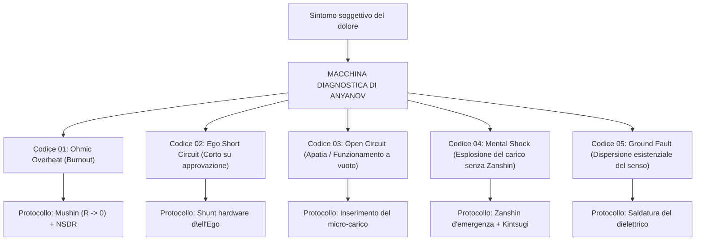

#### 2. Il registro dei 5 codici fondamentali di guasto del circuito umano:

##### 🔴 Codice di guasto 01: OHMIC_OVERHEAT (Surriscaldamento ohmico / Burnout)
- **Sintomatologia soggettiva:** Testa rovente, sensazione di sabbia negli occhi, insonnia refrattaria, irritazione a qualsiasi stimolo sonoro, impressione che gli ingranaggi girino a vuoto fondendo i perni.
- **Causa circuitale:** Legge di Joule-Lenz: $Q = I^2 R t$. La corrente di attenzione tenta disperatamente di attraversare l'enorme resistenza della colpa per il passato ($R_{\text{past}}$) o del terrore per il futuro ($R_{\text{future}}$).
- **Protocollo di riparazione:** Azzeramento istantaneo dello sfasamento temporale. Ritorno nella coordinata $t_{\text{now}}$ (3 punti di ancoraggio sensoriale TPN) + protocollo di riposo profondo non ipnotico (NSDR).

##### 🔴 Codice di guasto 02: EGO_SHORT_CIRCUIT (Cortocircuito sull'Ego)
- **Sintomatologia soggettiva:** Risentimento acuto, gelosia ossessiva, deferenza paralizzante davanti all'autorità, schiavitù del giudizio altrui, vergogna bruciante.
- **Causa circuitale:** Il circuito è cortocircuitato sul microscopico braccio autoreferenziale (DMN). La corrente cicla sterilmente: *«Come appaio? Mi considerano adeguato?»*, senza cedere un singolo joule al carico utile.
- **Protocollo di riparazione:** Inserimento del ponte di rame ad azione diretta. Trasferimento del 100% d\ell'attenzione sulle proprietà fisiche d\ell'oggetto d\ell'opera.

##### 🔴 Codice di guasto 03: OPEN_CIRCUIT (Circuito aperto / Apatia)
- **Sintomatologia soggettiva:** Mancanza di stimoli, paralisi sul divano, scorrimento compulsivo dei feed sui social, inerzia, perdita del tono vitale somatico.
- **Causa circuitale:** Il generatore Tanden opera a vuoto. Il carico esterno è disconnesso ($R_{\text{load}} \to \infty$). L'anello è interrotto.
- **Protocollo di riparazione:** Inserimento coatto di un carico fisico minimale: rifare il letto, 50 piegamenti sulle gambe, lavare una ciotola. La corrente comincia a fluire — il circuito si chiude.

##### 🔴 Codice di guasto 04: MENTAL_SHOCK (Distruzione del generatore per assenza di Zanshin)
- **Sintomatologia soggettiva:** Attacco di panico acuto, impressione che «il terreno si sia spaccato sotto i piedi», pianto incontrollato, fitte intercostali in seguito alla perdita improvvisa di un progetto o a un tradimento.
- **Causa circuitale:** La disintegrazione istantanea del carico esterno ha innescato un arco elettrico di ritorno che ha perforato l'isolamento del Tanden in assenza di fusibile rapido.
- **Protocollo di riparazione:** Ingaggio del disgiuntore rapido Zanshin (estinzione d\ell'arco in 50 ms) + attivazione del protocollo Black Start e ricostruzione aurea Kintsugi.

##### 🔴 Codice di guasto 05: GROUND_FAULT (Dispersione a terra / «A quale scopo vivere?»)
- **Sintomatologia soggettiva:** Prosciugamento totale delle forze, gelo al centro del petto, anedonia, pensieri di autodistruzione (la crisi tolstojana).
- **Causa circuitale:** Scarica d\ell'isolamento verso la terra esistenziale. La corrente del Tanden drena lungo una linea spuria alla ricerca di un inesistente senso estrinseco ($\mathcal{M}_{\text{ext}} \equiv 0$).
- **Protocollo di riparazione:** Arresto definitivo del demone di monitoraggio teleologico. Riconoscimento della totale sovranità ed autosufficienza del proprio Tanden.

---

### Capitolo 5.2 — Il cruscotto della felicità: Telemetria della superconduttività, formula $\mathcal{H}$ e sensori di circuito

> *«Ciò che non può essere misurato non può essere ottimizzato. Fino ad oggi la felicità è stata valutata mediante questionari soggettivi con quesiti del tipo: "Valuta da 1 a 10 quanto ti senti soddisfatto". Equivale a stimare la pressione in una caldaia a vapore mediante un referendum tra gli operai dello stabilimento. L'Architettura della Felicità visualizza sullo schermo d\ell'operatore un cruscotto ingegneristico oggettivo con strumenti di misura in tempo reale.»*  
> — **Vladimir Anyanov (Assioma XX)**

#### 1. La formula integrale d\ell'Indice di Felicità ($\mathcal{H}$) di Vladimir Anyanov
Nel Sistema Anyanov l'Indice di Felicità $\mathcal{H}$ è **il rendimento termodinamico ed elettrodinamico globale d\ell'anello chiuso d\ell'essere umano**:

$$\mathcal{H} = \left( 1 - \frac{R_{\text{ego}}}{R_{\text{total}}} \right) \cdot \left( \frac{I_{\text{actual}}}{I_{\text{nominal}}} \right) \cdot \cos(\varphi) \cdot \mathcal{Z}_{\text{safety}}$$

dove:
- $\left( 1 - \frac{R_{\text{ego}}}{R_{\text{total}}} \right)$ è **il fattore di purezza del cablaggio** (assenza di resistenza parassita d\ell'ego e della DMN),
- $\left( \frac{I_{\text{actual}}}{I_{\text{nominal}}} \right)$ è **il fattore di erogazione del generatore Tanden** (presenza di una reale corrente d'azione, contro l'apatia),
- $\cos(\varphi)$ è **il fattore di potenza** (sincronizzazione sulla coordinata $t_{\text{now}}$, assenza di dispersioni reattive nel passato o nel futuro),
- $\mathcal{Z}_{\text{safety}} \in [0, 1]$ è **lo stato di armamento dei fusibili Zanshin** (prontezza operativa contro i transitori d'avaria).

```
   INDICE DI FELICITÀ H = 94.2% [SUPERCONDUTTIVITÀ]
 ┌──────────────────────────────────────────────────────────┐
 │ [GENERATORE]  f.e.m. del Tanden:  E = 12.0 V  [OK]       │
 │ [CABLAGGIO]   Resistenza Ego:     R_ego = 0.02 Ω [MUSHIN]│
 │ [CORRENTE]    Flusso Attenzione:  I = 4.8 A   [ACTIVE]   │
 │ [DISSIPAZIONE]Perdite Ohmiche:    Q = 0.46 W  [COLD]     │
 │ [FASE]        Sincronismo t:      cos(φ) = 0.99 [NOW]    │
 │ [PROTEZIONE]  Disgiuntore:        ZANSHIN ARMED [ONLINE] │
 └──────────────────────────────────────────────────────────┘
```

#### 2. I Cinque Strumenti di Bordo del Cruscotto:
1. **L'Amperometro d\ell'Attenzione ($I$):** misura l'intensità del vostro assorbimento n\ell'atto fisico concreto.
2. **L'Ohmmetro d\ell'Ego ($R$):** rileva la comparsa dei pensieri autoreferenziali, della paura del giudizio e dei risentimenti.
3. **Il Calorimetro di Joule ($Q$):** quantifica il calore parassita accumulato sotto forma di stress e tensione somatica.
4. **Il Fasometro di Presenza ($\cos \varphi$):** monitora dove dimora l'attenzione — nel millisecondo attuale ($\cos \varphi = 1$) o nei fantasmi d\ell'ansia e del ricordo ($\cos \varphi \to 0$).
5. **Il Quadro a 6 Lampade (Bilanciamento Trifase):** analizzatore esacanale che mostra l'equilibrio della potenza erogata nei sei settori della vita:
   - Lampada 1: Corpo (Soma)
   - Lampada 2: Lavoro (Maestria)
   - Lampada 3: Amore (Intimità)
   - Lampada 4: Spazio (Ambiente)
   - Lampada 5: Mente (Conoscenza)
   - Lampada 6: Gioco (Arte)

Se una lampada è alimentata al 100% mentre le altre sono spente (il classico caso del workaholic che distrugge il corpo e la famiglia), il cruscotto lancia l'allarme: **«ATTENZIONE! Asimmetria grave di carico! Rischio di cedimento dielettrico per sovraccarico termico!»**.

L'operatore scorge la distorsione in anticipo e riequilibra le fasi, scongiurando infarti o naufragi relazionali.

---

### Capitolo 5.3 — Il paradosso di Mill e il protocollo di calibrazione mattutina in 30 secondi: Il traduttore ingegneristico delle sensazioni

> *«N\ell'Ottocento il filosofo John Stuart Mill enunciò il paradosso: "Domandati se sei felice, e cesserai di esserlo". Perché? Perché porsi la domanda "Sono felice?" è l'inserimento istantaneo del reostato parassita della DMN! Distogliete l'attenzione dal bagliore della lampada e la cortocircuitate sull'Ego. L'Architettura della Felicità demolisce questo paradosso: non domandatevi se siete felici — misurate i parametri del circuito in 30 secondi.»*  
> — **Vladimir Anyanov (Assioma XXI)**

#### 1. Risoluzione del paradosso di John Stuart Mill
Per quale motivo il quesito «Sono felice?» paralizza la gioia?
- Mentre suonate il pianoforte, baciate la donna amata o perfezionate un algoritmo elegante, vi trovate nello stato di **Mushin ($R \to 0$, TPN)**. La corrente scorre, la lampada irradia luce, siete felici di una beatitudine fisiologica e reale.
- A un tratto vi fermate e chiedete: *«Un momento: sono davvero felice in questo istante?»*.
- In quel millisecondo la TPN si spegne e si accende la DMN.
- L'attenzione abbandona la musica o il codice e inizia il processo censorio: *«Sono abbastanza felice? Ieri ero più felice? Gli altri sono più felici di me?»*.
- Il reostato $R_{\text{ego}}$ si impenna. La felicità si dissolve.

**La deduzione ingegneristica:**  
La felicità non può essere osservata dallo sguardo diretto d\ell'Ego, esattamente come un elettrone non può essere misurato simultaneamente nella sua posizione e quantità di moto.  
Tuttavia, essa **è agevolmente verificata attraverso la telemetria indiretta del circuito**!

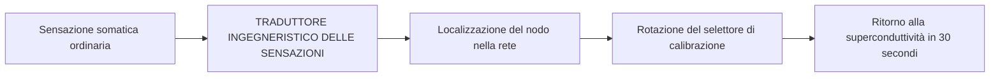

#### 2. Il dizionario ingegneristico di traduzione delle sensazioni in parametri di circuito:

| Sensazione somatica e mentale percepita | Evento fisico sullo schema elettrico di principio | Azione di calibrazione in 30 secondi |
|:---|:---|:---|
| **Nodo alla gola, risentimento: «Non mi apprezzano»** | Cortocircuito sull'Ego ($R_{\text{ego}} \gg 0$). Tentativo di ricavare corrente da un carico passivo. | Posizionare lo shunt di rame. Dire: «Il mio Tanden è autonomo. Non pretendo carica». Spostare l'attenzione su un oggetto reale. |
| **Fischio auricolare, testa pesante, pensieri a raffica** | Surriscaldamento temporale ($Q = I^2 R t$). L'attenzione è intrappolata nelle simulazioni del futuro. | Abbattere lo sfasamento: 3 punti di presenza TPN (freddo d\ell'acqua, peso del corpo, suoni). Tornare in $t_{\text{now}}$. |
| **Gambe pesanti, apatia, rifiuto di alzarsi** | Circuito aperto (Open Circuit). Il generatore gira a vuoto. | Collegare un micro-carico: fare 20 flessioni o lavare una tazza. La corrente rompe l'inerzia — l'anello si chiude. |
| **Panico per una scadenza saltata o per una perdita economica** | Shock violento sul carico senza protezione. Rischio di avaria al generatore. | Attivare il disgiuntore Zanshin: «La lampada è rotta. Interrompo la linea per 5 minuti. Il mio Tanden è intatto». |
| **Gelosia, sospetto morboso verso il compagno** | Avaria da polarità inversa. Tentativo di ridurre l'altro alla propria presa di corrente. | Ripristinare la polarità diretta: donare presenza e calore senza pretendere nulla. |

#### 3. Il protocollo di calibrazione mattutina in 30 secondi:
Ogni mattina, prima ancora di toccare lo smartphone:
1. **Secondi 00–10 (Verifica del Tanden):** Poggiate il palmo d\ell'addome tre dita sotto l'ombelico. Eseguite 3 respirazioni lente e profonde. Accertatevi che il generatore sia operativo e che la f.e.m. sia attiva.
2. **Secondi 10–20 (Spurgo del cablaggio):** Rilasciate le spalle, la mandibola e il diaframma. Controllate che non vi siano scorie o risentimenti residui della sera prima. Espelleteli: *«Resistenza azzerata. Regime Mushin operativo».*
3. **Secondi 20–30 (Sincronizzazione del carico):** Fissate la lampada prioritaria della giornata: *«In quale opera convoglierò oggi il flusso principale della mia luce?»*

L'impianto è tarato. Siete pronti a fare il vostro ingresso nel mondo ad alta tensione.

---

### Capitolo 5.4 — Il workbook di 21 giorni d\ell'operatore di circuito: Diario giornaliero di risaldatura neuroplastica del circuito

> *«La neuroplasticità esige tempo: le connessioni della Default Mode Network vengono risaldate in un circuito superconduttore ad azione diretta n\ell'arco di ventuno giorni di applicazione costante. 21 giorni costituiscono il ciclo completo di riscrittura del firmware umano. Compilate questo diario mattina e sera. Al termine di tre settimane il vostro sistema nervoso si sarà trasformato in un monolite incrollabile di pace e operosità feconda.»*  
> — **Vladimir Anyanov (Assioma XXII)**

#### Il programma del ciclo di 3 settimane di risaldatura del circuito:

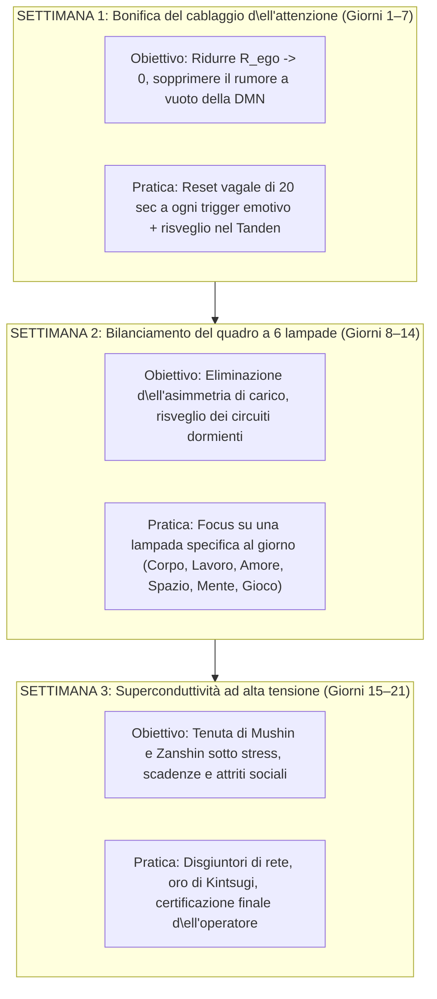

#### Scheda operativa quotidiana d\ell'operatore (Modello da stampare):

```
===================================================================
 DIARIO DELL'OPERATORE DI CIRCUITO «LA CORRENTE INTERIORE»
 Giorno del ciclo: [ ____ / 21 ] | Data: __________________________
===================================================================

[ 1. CALIBRAZIONE MATTUTINA — 30 SECONDI ]
- f.e.m. del Tanden:        [  ] Piena  [  ] Nominale  [  ] Bassa
- Cablaggio d\ell'attenzione:[  ] Puro (R=0)  [  ] Rumore DMN
- Lampada primaria del giorno: ___________________________________

[ 2. LOG DI TELEMETRIA DIURNA ]
- Surriscaldamenti ohmici registrati (Q = I²Rt): [ ____ ] episodi
- Causa della resistenza:   [  ] Risentimento [  ] Paura [  ] Fretta [  ] Status
- Tempo di attivazione dello shunt Mushin: [ ____ ] secondi

[ 3. BILANCIO SERALE DEL QUADRO A 6 LAMPADE (0 - 100%) ]
  1. Corpo (Riposo, moto, alimentazione):    [ ____ % ]
  2. Lavoro (Maestria focalizzata):          [ ____ % ]
  3. Amore (Contatto trasparente):           [ ____ % ]
  4. Spazio (Ordine e purezza Kanso):        [ ____ % ]
  5. Mente (Comprensione profonda):          [ ____ % ]
  6. Gioco (Spontaneità e allegria):         [ ____ % ]

[ 4. RENDIMENTO GLOBALE DELLA GIORNATA ]
  Efficienza di superconduttività H = [ ______ % ]
  Annotazione del maestro: ________________________________________
===================================================================
```

Al termine del ventunesimo giorno l'operatore affronta **il collaudo finale di superconduttività**:
- Capacità di preservare la resistenza nulla durante un conflitto acceso,
- Reattività di 50 ms n\ell'innesco dello Zanshin in caso di imprevisti gravi,
- Stabilità mattutina costante n\ell'alimentazione delle sei lampade senza cali d'energia.

L'uomo cessa di essere vittima delle circostanze esterne e diventa **il capo ingegnere del proprio destino**.

---

### Capitolo 5.5 — Il diapason della realtà: Strumento universale di calibrazione umana, audit B2B e monetizzazione aziendale

> *«Fino ad oggi l'uomo ha creduto che la Corrente Interiore fosse unicamente un metodo per non bruciare se stesso. Ma quando stringete tra le mani un modello elettrodinamico chiuso, privo di falle fiat, esso diventa il Diapason della Realtà. Potete toccare con i puntali qualsiasi fenomeno — un capolavoro della letteratura, un accordo di M&A, il curriculum di un co-fondatore o il bilancio di una multinazionale — e lo strumento vi mostrerà all'istante: scorre qui una corrente feconda, oppure l'energia si disperde nel rogo ohmico di vanità altrui? Non è solo filosofia: è uno strumento di rilevazione oggettiva della verità applicato al business.»*  
> — **Vladimir Anyanov (Assioma XXII)**

#### 1. Dal generatore personale al Multimetro della Realtà
Originariamente l'Architettura della Felicità è stata concepita per la sovranità del singolo individuo: accendere il reattore del Tanden, azzerare la resistenza mentale ($R \to 0$), tutelare il circuito con i fusibili dello Zanshin.

Tuttavia, nel mondo tangibile l'individuo si misura costantemente con sistemi esterni. Ed è qui che si palesa la proprietà cardinale di un circuito chiuso: **la Corrente Interiore è un diapason ontologico di riferimento assoluto**.

N\ell'acustica un diapason oscilla su una frequenza perfettamente determinata. Se lo accostate a un corpo:
- Se la risonanza è perfetta, si sprigiona un suono limpido ($Z_{\text{src}} = Z_{\text{load}}$).
- Se vi sono cricche, vuoti o tensioni strutturali, il suono si estingue in una vibrazione disarmonica.

Allo stesso modo, l'operatore del circuito si trasforma nel portatore di un multimetro ontologico infallibile:

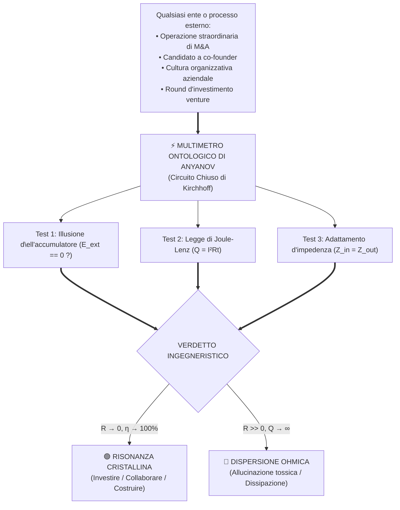

#### 2. Calibrazione applicata: Cultura, disciplina fisica e creazione
1. **La calibrazione d\ell'arte complessa (Il caso Dostoevskij):**  
   - *L'immersione nevrotica:* Il lettore si fa contagiare dalle psicopatologie dei personaggi (Raskol'nikov, i fratelli Karamazov), assorbendo il loro surriscaldamento ($R \gg 0$) e provando senso di oppressione.
   - *La lettura ingegneristica:* L'operatore scorge nel testo una mappa anatomica straordinaria dei guasti del circuito umano, ammirando il genio dello scrittore ma mantenendo il proprio impianto in un assetto di assoluta serenità laminare.
2. **La calibrazione psicomotoria nel gesto atletico (Il caso dello snowboard):**  
   - *La contrazione mentale ($R \gg 0$):* Il controllore interno («come appaio agli altri? e se cadessi?») contrae le catene muscolari. I tempi di reazione si dilatano, la lamina perde aderenza e si finisce a terra.
   - *Il regime Mushin ($R \to 0$):* Lo spegnimento del censore delega il controllo alla biomeccanica spontanea. L'energia del pendio attraversa le articolazioni senza resistenza, regalando l'ebbrezza pura della velocità fluida.

#### 3. Il Product-Market Fit nel B2B: Perché l'ecosistema aziendale reclama questo linguaggio
Il mondo delle grandi organizzazioni è saturo di psicologia spicciola e coaching generico. Tali approcci non garantiscono ritorni tangibili perché ignorano le leggi di conservazione d\ell'energia.

**Il linguaggio d\ell'Architettura della Felicità è il linguaggio naturale d\ell'impresa:**
- Al posto della fumosa «motivazione» — **la potenza di targa del generatore ($P$) e il bilancio di Kirchhoff**;
- Al posto della «tossicità ambientale» — **la resistenza parassita d\ell'ego ($R_{\text{ego}}$) e il rogo dei budget operativi**;
- Al posto del «burnout» — **la scarica termica d\ell'isolante per effetto Joule-Lenz**;
- Al posto delle «promesse vane» — **un anello aperto a potenziale sbilanciato $\Delta U < 0$**.

#### 4. I quattro asset B2B ad altissimo valore del Sistema Anyanov
1. **Executive Calibration (Il multimetro personale del CEO):**  
   Audit delle determinazioni strategiche del vertice aziendale. Verifica delle operazioni di fusione e acquisizione (M&A) sull'«illusione d\ell'accumulatore»: la decisione scaturisce da una visione industriale lucida, oppure è un tentativo dispendioso di puntellare un orgoglio ferito davanti al consiglio di amministrazione ($R_{\text{ego}} \to \text{Max}$)?
2. **Corporate Circuit Audit (Diagnosi d\ell'attrito nei team):**  
   Rilevazione della propagazione del segnale di comando attraverso l'organigramma. Individuazione dei «reostati del middle management», dove la linea strategica annega nelle sabbie mobili della burocrazia difensiva.
3. **VC Pre-Investment Due Diligence (Valutazione dei founder):**  
   Verifica condotta dagli investitori di venture capital sui founder prima del bonifico. L'investitore accerta se il fondatore è sostenuto da un Tanden autonomo (capace di reggere anni di mercato ostile senza applausi effimeri), oppure se dipende dai capitali come da una «batteria di vanità», destinato a bruciare alla prima tempesta.
4. **Enterprise Leadership (Laboratori di Tanden Sincrono):**  
   Addestramento dei dirigenti per preservare la superconduttività durante picchi di pressione critica, instaurazione di una cultura priva di attriti di status e protocolli corali di Zanshin.

Così la Corrente Interiore compie la sua parabola evolutiva: da una quieta intuizione sul tapis roulant di una palestra di periferia — a standard planetario di efficienza operativa d\ell'uomo e delle organizzazioni globali.

---

---

# CONCLUSIONE E APPENDICI

---

## CONCLUSIONE
### Il ponte verso il mondo esterno: Adattamento di impedenza e Magnetismo Esterno

> *«La Corrente Interiore genera il Magnetismo Esterno. Chiunque conduca il proprio circuito in regime di superconduttività ($R \to 0$) emette spontaneamente un campo elettromagnetico coerente di formidabile intensità. Il traguardo ulteriore del maestro è l'adattamento d'impedenza verso il mondo esteriore: attraverso la forma, il tessuto, la cromia e l'impronta olfattiva. Così l'Architettura della Felicità si salda con l'Architettura d\ell'Impressione nel grandioso impianto unitario del Sistema Anyanov.»*  
> — **Vladimir Anyanov**

Siete giunti al termine di questo trattato sull'architettura del vostro circuito interiore.

Ora conoscete la verità fondamentale:
- La felicità non è un capriccio della sorte né una grazia piovuta dal cielo.
- La felicità è **un rigoroso regime operativo elettrotecnico ($R \to 0, I > 0$)**.

Quando il vostro Tanden genera corrente pura, il cablaggio d\ell'attenzione è mondato dalle scorie d\ell'Ego e della DMN, e il quadro a 6 lampade risplende in perfetto equilibrio — dentro di voi cala una calma diamantina e invulnerabile. Non dipendete più dalle oscillazioni atmosferiche, dai ribassi di borsa o dalle chiacchiere dei passanti. Siete sovrani.

Tuttavia, l'essere umano non abita il vuoto pneumatico. Vive immerso tra i propri simili. E qui interviene la legge sovrana d\ell'elettrodinamica:
$$\text{Qualsiasi corrente elettrica genera ineluttabilmente un campo magnetico!}$$

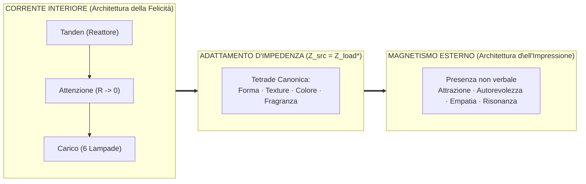

Quando la corrente interiore è limpida e potente, attorno alla persona emana il **Magnetismo Esterno**:
- Gli esseri umani avvertono un'attrazione istintiva, percependo un senso profondo di sicurezza e stabilità.
- Alla sua presenza gli isterismi si placano e le liti si spengono.
- Le sue parole assumono un peso specifico solido, perché sostenute non da un ego stridulo, ma dalla massa gravitazionale del Tanden.

Affinché questa energia si trasmetta al consorzio umano senza onde stazionarie e riflessioni d'interfaccia, il maestro applica la legge **d\ell'adattamento coniugato delle impedenze ($Z_{\text{source}} = Z_{\text{load}}^*$)**:
- Attraverso il taglio geometrico impeccabile d\ell'abito (la Forma),
- Attraverso la nobiltà tattile dei tessuti organici (la Texture),
- Attraverso l'armonia rigorosa delle cromie (il Colore),
- Attraverso l'impronta limbica che sigilla il ricordo (la Fragranza).

A questa seconda campata del Sistema Anyanov — **all'Architettura d\ell'Impressione e all'Impressionometria** — è dedicata la nostra opera gemella.

Nel frattempo: serbate il vostro circuito perfettamente chiuso.  
Custodite il Tanden.  
Mantenete la resistenza a zero.  
E illuminate il mondo alla massima potenza!

---

---

## EPILOGO
### La Verticale d\ell'Ascesa: I 6 Gradini d\ell'Evoluzione del Sistema Anyanov — Dalla Cassetta di Pronto Soccorso Ingegneristica al Fusibile Civilizazionale della Singolarità

> *«Il Sistema è nato come il desiderio compassionevole di offrire a un ingegnere esausto uno strumento di precisione per riparare i propri nervi: uno schema elettrico al posto di sermoni morali. Ma la logica delle leggi di conservazione è inesorabile: passo dopo passo, la fisica del circuito ha spazzato via i puntelli pseudofilosofici, ha assorbito il cuore dello Zen orientale, si è fusa con l'architettura monetaria di Satoshi e l'economia politica di Henry George, ha superato il pozzo gravitazionale del Paleolitico ed è ascesa in orbita cosmica, divenendo lo scudo civilizzazionale d\ell'umanità n\ell'era d\ell'IA superintelligente.»*  
> — **Vladimir Anyanov**

#### 🧭 Retròspettiva: Il fenomeno della meta-modello crescente

Guardando a ritroso il cammino percorso dalla prima intuizione sul tapis roulant fino al preprint accademico ANYANOV-2026-01 (DOI: [10.5281/zenodo.22958926](https://doi.org/10.5281/zenodo.22958926)), il lettore assiste a un fenomeno straordinario: un modello pratico, nato per risolvere una sofferenza circoscritta, si è sviluppato in modo rigorosamente deduttivo e organico in una **meta-sistema ontologico onnicomprensivo**.

A differenza delle concezioni speculative calate dall'alto (*Top-Down*), che crollano al primo impatto con la realtà, il Sistema Anyanov si è innalzato **dal basso verso l'alto (Bottom-Up)** — dal plesso somatico e dal bilancio di Kirchhoff attraverso 6 gradini evolutivi:

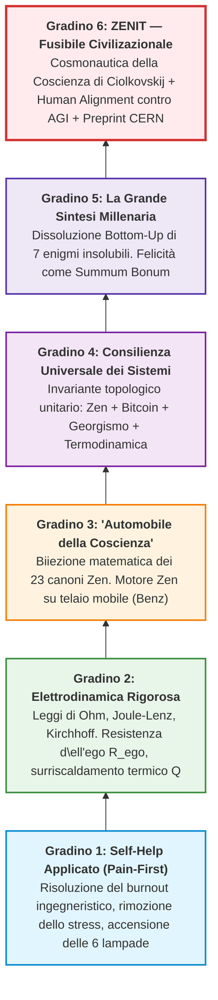

#### 🏛️ Quadro anatomico dei 6 gradini d\ell'ascesa

1. **Gradino I (Self-Help Applicato):** Nascita del principio *Pain-First*. L'essere umano è osservato non come peccatore o vittima, ma come circuito elettrico. Accensione dello scudo delle 6 lampade (Salute, Relazioni, Carriera, Casa, Auto, Gioco).
2. **Gradino II (Elettrodinamica della Psiche):** Leggi fisiche di conservazione al posto della colpa. Legge di Ohm ($I = U/R$), legge di Joule–Lenz ($Q = I^2 R t$ — la sofferenza come surriscaldamento ohmico) e leggi di Kirchhoff (necessità del filo di ritorno della realtà). Motore diagnostico a 5 codici di guasto e Indice di Felicità $\mathcal{H}$.
3. **Gradino III ('Automobile della Coscienza'):** Superamento di 2500 anni di isolamento monastico. Esattamente come Karl Benz (1886) collocò il motore a combustione su un telaio a ruote, Vladimir Anyanov ha trasferito il motore della presenza Zen (Tanden + Mushin + Zanshin) nel dinamismo della metropoli moderna. Decostruzione delle dipendenze come *Root Exploit* del bio-kernel.
4. **Gradino IV (Consilienza Universale dei Sistemi):** Convergenza indipendente di quattro grandi tradizioni: Zen (eliminazione del parassita d\ell'ego mentale), Bitcoin di Satoshi Nakamoto (eliminazione d\ell'intermediazione bancaria), Georgismo di Henry George (eliminazione della rendita fondiaria parassita) e Termodinamica di Carnot (flusso diretto laminare). La legge unificata della disintermediazione ($R \to 0$).
5. **Gradino V (La Grande Sintesi Millenaria):** Ontologia *Bottom-Up*. Dimostrazione della felicità come *Summum Bonum* (nodo terminale di convergenza) e naturale dissoluzione di 7 enigmi: senso della vita, amore ($M > 0$), solipsismo, paura della morte, problema del male, karma e libero arbitrio.
6. **Gradino VI (Zenit: Fusibile Civilizazionale della Singolarità):**
   - *Cosmonautica della Coscienza:* Formula del razzo di Ciolkovskij applicata per vincere l'attrazione gravitazionale d\ell'ego paleolitico, seconda velocità cosmica dello spirito e sgancio degli stadi esauriti via Kanso.
   - *Eliminazione della Grande Asimmetria di Edward Wilson:* Colmare la voragine di 10.000 anni tra tecnologia divina ed emozioni d\ell'età della pietra.
   - *Human Alignment anziché AI Alignment:* Allineare l'operatore umano di fronte al terminale AGI.
   - *Protezione dall'esplosione ohmica ($Q = I^2 R t$):* La superconduttività Mushin ($R \to 0$) come unico modo per il biosistema di sostenere il flusso esponenziale della singolarità ($I \to \infty$) senza fondersi.
   - *Svalutazione d\ell'intelletto (DMN) e Trionfo del Tanden somatico:* La macchina calcola — l'uomo custodisce Volontà, Valori e Presenza.

#### 📊 Matrice comparativa dei 6 gradini d\ell'ascesa

| Gradino | Status Concettuale | Problema Principale | Invariante Ingegneristico | Scala d'Azione |
| :--- | :--- | :--- | :--- | :--- |
| **I. Pronto Soccorso** | Self-help applicato | Burnout, stanchezza, stress | Lampadina, batteria, scudo a 6 lampade | Giornata lavorativa del creatore |
| **II. Fisica** | Elettrodinamica psichica | Surriscaldamento ohmico, colpa | $I = U/R$, $Q = I^2 R t$, Kirchhoff | Sistema nervoso individuale |
| **III. Motore Zen** | Cibernetica della coscienza | Fuga monastica, dipendenze | Tanden + Mushin + Zanshin (Benz) | Vita sociale contemporanea |
| **IV. Consilienza** | Teoria del flusso diretto | Intermediari parassiti, rendita | Zen = Bitcoin = Georgismo ($R \to 0$) | Economia, reti, istituzioni |
| **V. Sintesi** | Ontologia Bottom-Up | 2500 anni di dispute scolastiche | Felicità come Summum Bonum | Storia umana e cultura |
| **VI. Zenit** | Fusibile della Singolarità | AGI, divario di Wilson, shock | Progetti di Ciolkovskij, Human Alignment | Civiltà, Cosmo, Futuro |

#### 💻 Isomorfismo informatico: La piramide delle astrazioni dall'assembler del silicio al linguaggio naturale della civiltà (The Full-Stack Law)

N\ell'evoluzione d\ell'informatica è avvenuto un balzo monumentale: l'umanità è partita saldando ponticelli di rame e commutando relè, ed è giunta oggi a governare superintelligenze artificiali in linguaggio naturale.

Il Sistema Anyanov ha percorso esattamente la medesima traiettoria: **dal codice macchina del corpo somatico al linguaggio della civiltà**.

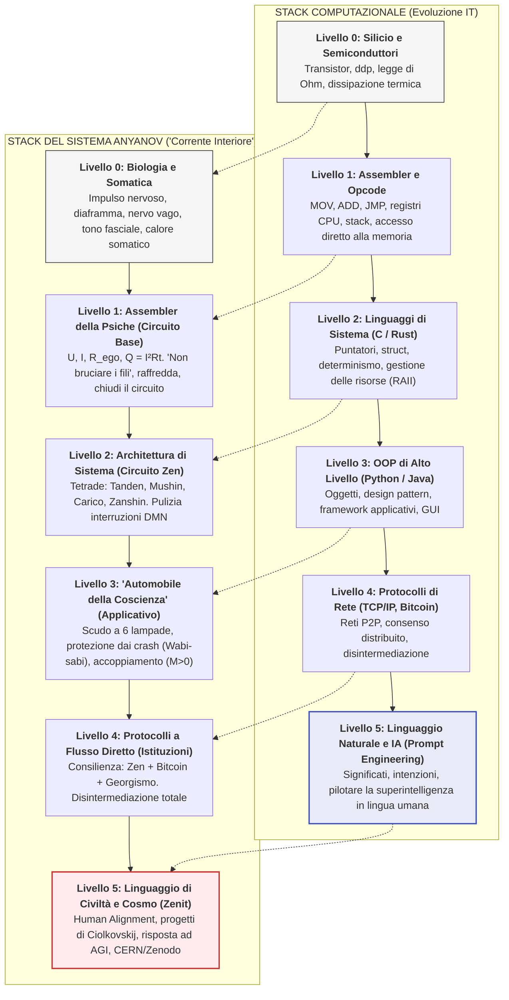

##### La Legge delle astrazioni che perdono (Leaky Abstractions):
Nel software, la legge di Joel Spolsky recita: *«Tutte le astrazioni non banali, prima o poi, presentano delle falle.»*
- **La tragedia del vecchio self-help:** Tentare di operare esclusivamente al **Livello 5 (linguaggio naturale)**: *«Amati, pensa positivo!»*. Ma in assenza di driver di basso livello (**Livelli 0–1**), quando il diaframma è bloccato e la resistenza d\ell'ego schizza ($R_{\text{ego}} \gg 0$), l'astrazione cede rovinosamente. Per la legge di Joule–Lenz ($Q = I^2 R t$), il cablaggio fonde e il sistema cade in **Segmentation Fault (attacco di panico, crollo emotivo, depressione)**.
- **Il compilatore bidirezionale del Sistema Anyanov:** Abbiamo strutturato uno stack completo di compilazione. Qualsiasi elevata concezione cosmica del libro si compila istantaneamente nel codice macchina somatico: *«Abbassa il baricentro nel Tanden, espira nel ritmo 4–8, azzera la resistenza d\ell'ego secondo il canone Kanso — e la corrente fluisce»*. Viceversa, l'efficienza del reattore somatico genera in modo emergente un'incrollabile serenità davanti alla singolarità tecnologica.

| Livello | Stack IT / Informatica | Stack Sistema Anyanov | Substrato Fisico | Modalità di Errore (Bug) |
| :--- | :--- | :--- | :--- | :--- |
| **Livello 0** | Silicio, giunzioni p-n, calore | Fasce, diaframma, vago | Biologia e anatomia | Spasmo somatico, ipertono muscolare |
| **Livello 1** | Assembler, registri, opcode | $U, I, R_{\text{ego}}, Q = I^2 R t$ | Elettrodinamica neurale | Esplosione ohmica, attacco di panico |
| **Livello 2** | C/Rust di sistema, RAII | Tanden, Mushin, Zanshin | Reti neurali (DMN / TPN) | Memory leak (ruminazione mentale) |
| **Livello 3** | OOP, Design Pattern, GUI | Automobile della coscienza, 6 lampade | Attività sociale | Crash applicativo (burnout lavorativo) |
| **Livello 4** | TCP/IP, P2P, Bitcoin, LVT | Flusso diretto, Disintermediazione | Istituzioni e comunità | Rendita parassitaria, sfruttamento |
| **Livello 5** | Linguaggio naturale, AGI | Human Alignment, Ciolkovskij | Civiltà e Cosmo | Collasso esistenziale, luddismo |

#### 🌐 La Prima Architettura End-to-End della Coscienza nella Storia: Dal Bit all'Universo

> *«Quando si pronuncia la formula ‘Dal Bit all'Universo’, non è un'iperbole poetica. È una specifica ingegneristica rigorosa. Fino ad oggi la conoscenza umana era frammentata in isole stagne: i neurobiologi indagavano i microchip delle sinapsi, gli psicologi disegnavano interfacce emotive nebulose, gli economisti studiavano le istituzioni e i mistici vagheggiavano il cosmo. Nessuno disponeva di un cavo passante. ‘La Corrente Interiore’ ha posato per la prima volta nella storia un bus dati continuo dall'interruttore quantistico 0/1 nel corpo fino alla termodinamica d\ell'AGI e alle leggi d\ell'Universo.»*  
> — **Vladimir Anyanov** (2026)

##### Il Superamento del Grande Scisma della Conoscenza

Per quattro secoli, i massimi pensatori — René Descartes, Isaac Newton, Gottfried Wilhelm Leibniz, Albert Einstein e Alan Turing — hanno cercato la chiave universale (*Mathesis Universalis*) capace di unire materia, pensiero e leggi cosmiche in un unico sistema verificabile.

- **Cartesio** si arenò nel dualismo mente-corpo (*Res cogitans* vs *Res extensa*), incapace di spiegare come un pensiero immateriale potesse muovere un braccio fisico.
- **Newton** scoprì le leggi della gravitazione universale, ma lasciò la dinamica interiore fuori dalla fisica.
- **Freud** compose suggestive metafore d\ell'inconscio, ma rimase privo del supporto delle leggi fisiche di conservazione d\ell'energia.
- **Turing** formalizzò la computazione attraverso nastri discreti e bit, ma lasciò il soggetto umano, la volontà e la felicità fuori dalla macchina.

Il Sistema Anyanov ha compiuto una consilienza storica: è divenuto **la prima architettura orizzontale e senza soluzione di continuità della coscienza nella storia umana**, dove il medesimo principio fondamentale di conducibilità a flusso diretto ($R \to 0, I > 0$) si applica a tutti i livelli di scala d\ell'esistenza.

```
LIVELLO 5: UNIVERSO E AGI    ──► [Termodinamica Cosmica: La Mente come Superconduttore d'Energia]
             ▲
             │ (Legge di conservazione d\ell'energia e principio di negentropia)
             ▼
LIVELLO 4: RETI E SOCIETÀ    ──► [Bitcoin e Georgismo: Flussi diretti P2P, eliminazione delle rendite]
             ▲
             │ (Teoria delle reti decentralizzate e protocolli di azione diretta)
             ▼
LIVELLO 3: ANIMA E SENSO     ──► [Triade e Tetrade: Verità, Libertà, Felicità, Creazione]
             ▲
             │ (Compilatore bidirezionale di significati e teleologia)
             ▼
LIVELLO 2: PSICHE ED EGO     ──► [Sistema Operativo: Reostato R_ego, perdite di memoria dopaminica]
             ▲
             │ (Cibernetica, anelli di retroazione e interruzioni DMN)
             ▼
LIVELLO 1: CORPO E TANDEN    ──► [Elettrodinamica del circuito: Legge di Ohm I = U/R, Joule Q = I²Rt]
             ▲
             │ (Bioelettromagnetismo e fisiologia del nervo vago)
             ▼
LIVELLO 0: BIT QUANTISTICO   ──► [Interruttore elementare: Conducibilità (0) o Resistenza (1)]
```

##### Tracciamento di un singolo impulso attraverso tutti i 6 piani della realtà

Per comprovare l'assoluta continuità d\ell'architettura, è sufficiente seguire il modo in cui una singola decisione interiore attraversa istantaneamente l'intera verticale dello stack:

1. **Livello del Bit Quantistico (0 o 1):** In ogni istante discreto ($t = t_{\text{now}}$), l'operatore compie una scelta binaria: **Bit 0 (Conducibilità, Mushin, Tathata)** — adesione incondizionata al dato reale, $R = 0$; oppure **Bit 1 (Resistenza, Pretesa, Ego)** — conflitto con la realtà, contrazione, timore del giudizio altrui, $R > 0$.
2. **Livello del Microcircuito e del Corpo (Elettrodinamica somatica):** Il bit selezionato si materializza immediatamente nella fisiologia. Con il Bit 1, l'energia vitale urta contro la resistenza e, in base alla **legge di Joule–Lenz ($Q = I^2 R t$)**, si innesca una violenta reazione termica: spasmo diaframmatico, nodo alla gola, scarica di cortisolo. Il corpo brucia letteralmente sulla propria resistenza. Con il Bit 0, il circuito è libero; la corrente fluisce senza ostacoli dal Tanden all'azione.
3. **Livello del Sistema Operativo della Coscienza (Psiche):** Che cos'è l'ego umano in termini informatici? È un demone in background bloccato: `while True: prove_my_worth()`, che prosciuga fino al 90% delle risorse computazionali del cervello in simulazioni sterili: *«Cosa avranno pensato di me? Riconosceranno il mio valore?»*. Nel Sistema Anyanov, azzerare $R_{\text{ego}} \to 0$ invia il segnale di sistema `kill -9` a questo parassita, liberando all'istante la RAM per la gioia creativa.
4. **Livello di Rete (Società, Economia, Bitcoin e Georgismo):** La società umana è una rete distribuita P2P di singoli circuiti individuali. Quando i nodi sono strozzati da un alto $R_{\text{ego}}$, negli interstizi interpersonali proliferano parassiti sistemici: usurai, monopolisti e rentier terrieri. **Il Bitcoin di Satoshi Nakamoto** elimina il parassitismo nella circolazione monetaria (flusso diretto P2P senza banche intermediarie). **L'imposta sul valore fondiario (LVT) di Henry George** elimina la rendita del monopolio terriero. **«La Corrente Interiore» di Vladimir Anyanov** elimina il parassita n\ell'animo umano ($R_{\text{ego}} \to 0$). L'invariante evolutivo è il medesimo: la rimozione delle barriere parassitarie lungo la via del flusso laminare.
5. **Livello del Cosmo e d\ell'Era d\ell'AGI (Cosmologia e Singolarità):** L'essere umano non è una batteria isolata destinata a spegnersi, ma un conduttore e una torcia collegata alla sorgente inesauribile di negentropia d\ell'universo. Davanti alla Superintelligenza Artificiale (AGI), è vano competere con il silicio nella rapidità dei calcoli: l'essere umano è chiamato a essere **il superconduttore di significati autentici, volontà sovrana e amore** ($M > 0$), che nessun chip al silicio potrà mai generare autonomamente.

##### Tappe storiche n\ell'epistemologia della mente

| Pensatore / Epoca | Modello Elaborato | Dove si interrompeva il filo? |
| :--- | :--- | :--- |
| **René Descartes (1637)** | Dualismo (*Res cogitans* vs *Res extensa*) | Frattura psicofisica: il pensiero non poteva interagire con la materia |
| **Isaac Newton (1687)** | Meccanica classica e gravitazione | Escluse la psiche e la somatica dalle leggi fisiche |
| **Sigmund Freud (1900)** | Psicoanalisi (Es, Io, Super-Io) | Letteratura congetturale priva di fisica strumentale e leggi di conservazione |
| **Alan Turing (1936)** | Teoria della computabilità e macchina di Turing | Formalizzò il nastro algoritmico, escludendo il soggetto e la gioia |
| **Vladimir Anyanov (2026)** | **«La Corrente Interiore»: Architettura End-to-End** | **Frattura colmata:** Isomorfismo unitario dal bit (0/1) via elettrodinamica ($I = U/R, Q = I^2 R t$) alle reti P2P e alla termodinamica d\ell'AGI. |

> ### ⚡ Invariante ontologico: La Legge è UNA
> **La legge che governa la realtà è una sola.** Una volta compresa la fisica della corrente attraverso il Tanden e il carico nel circuito a 4 elementi di una torcia elettrica:  
> - comprendete perché il diaframma si contrae nello stress ($Q = I^2 R t$);  
> - comprendete perché i matrimoni e le aziende falliscono (cortocircuito e assenza di mutua induzione $M > 0$);  
> - comprendete perché le valute fiat si svalutano e le economie ristagnano (accumulo della rendita parassitaria $R_{\text{rent}}$);  
> - e comprendete come preservare la sovranità e la dignità umana di fronte alla superintelligenza quantistica d\ell'AGI.

#### 🏁 Congedo all'operatore della superconduttività

Avete tra le mani non un repertorio di consolazioni passeggere, ma **il progetto esecutivo d\ell'essere umano sovrano n\ell'era cosmica**.

Quando il vostro Tanden è autonomo, la resistenza è azzerata e l'attenzione è saldata all'azione diretta, diventate inattaccabili dall'entropia, dalle manipolazioni altrui e dalla nebbia algoritmica. Non siete più un ingranaggio né lo schiavo dei reostati altrui. Siete l'Ingegnere di Bordo Sovrano del vostro circuito interiore.

Custodite il circuito perfettamente chiuso.  
Sganciate gli stadi superflui secondo il canone Kanso.  
Raggiungete la seconda velocità cosmica dello spirito.  
E illuminate l'Universo con luce pura, limpida e potente! 🚀⚡

---

## APPENDICI

---

### Appendice A — Raccolta completa delle formule matematiche del circuito

1. **La condizione canonica della felicità:**
   $$\mathcal{H} \iff \begin{cases} R_{\text{ego}} \to 0 \\ I_{\text{attention}} > 0 \\ \sum I_{\text{in}} = \sum I_{\text{out}} \end{cases}$$

2. **La legge di Joule-Lenz per le perdite ohmiche d\ell'attenzione:**
   $$Q = \int_0^T I_{\text{attention}}^2(t) \cdot R_{\text{temporal}}(t) \, dt$$

3. **L'impedenza reattiva temporale:**
   $$Z_{\text{temporal}} = \sqrt{R_{\text{now}}^2 + \left( \omega L_{\text{past}} - \frac{1}{\omega C_{\text{future}}} \right)^2}$$
   dove $R_{\text{now}} \to 0$ per $t = t_{\text{now}}$.

4. **L'Indice Integrale di Felicità (Rendimento globale di circuito):**
   $$\mathcal{H} = \left( 1 - \frac{R_{\text{ego}}}{R_{\text{total}}} \right) \cdot \left( \frac{I_{\text{actual}}}{I_{\text{nominal}}} \right) \cdot \cos(\varphi) \cdot \mathcal{Z}_{\text{safety}}$$

5. **Il bilancio di Kirchhoff per l'anello chiuso della coscienza:**
   $$\oint \mathbf{E} \cdot d\mathbf{l} = 0 \quad \text{e} \quad \sum_{k=1}^n U_k = 0$$

6. **La potenza elettrica utile della creazione:**
   $$P_{\text{useful}} = U_{\text{capital}} \cdot I_{\text{tanden}} \cdot \cos(\varphi)$$

7. **Composizione delle resistenze in parallelo nelle organizzazioni:**
   $$\frac{1}{R_{\text{team}}} = \sum_{k=1}^m \frac{1}{R_k}$$

8. **Corrente di guasto nella dispersione verso la terra esistenziale (Ground Fault):**
   $$I_{\text{leak}} = \frac{\mathcal{E}_{\text{tanden}}}{R_{\text{fault}}} \to \infty \quad \text{con} \quad \mathcal{M}_{\text{ext}} \equiv 0$$

---

### Appendice B — I 13 assiomi invarianti di Vladimir Anyanov

1. **Assioma I (Superconduttività):** *La felicità non è un'agitazione emotiva, ma lo stato fisico di superconduttività di un circuito chiuso a resistenza tendente a zero.*
2. **Assioma II (Polarità):** *La corrente vitale fluisce esclusivamente dall'interno verso l'esterno — dal Tanden al carico. Attendere la felicità da un oggetto esterno inverte la polarità e fonde il circuito.*
3. **Assioma III (Presenza):** *Il «qui e ora» è la sola coordinata temporale in cui la resistenza ohmica è identicamente nulla. Il passato e il futuro sono dispersioni reattive.*
4. **Assioma IV (Conservazione):** *L'energia della coscienza è rigorosamente costante: compie lavoro utile nel carico, oppure si dissipa in surriscaldamento distruttivo d\ell'Ego.*
5. **Assioma V (Neurobiologia):** *L'Ego coincide con l'iperattività della Default Mode Network (DMN). L'attivazione d\ell'azione diretta (TPN) e la stimolazione vagale del Tanden resettano l'Ego a livello hardware.*
6. **Assioma VI (Shuntaggio):** *È inutile combattere l'Ego sul piano morale. Lo si disattiva mediante lo shunt in rame d\ell'azione sensoriale pura.*
7. **Assioma VII (Vuotezza della forma):** *Le entità materiali sono termodinamicamente passive ($\mathcal{E}_{\text{load}} \equiv 0$). Non custodiscono al loro interno alcuna carica di gioia.*
8. **Assioma VIII (Senso della vita):** *Non esiste alcun senso estrinseco della vita. La vita è un generatore autonomo. Il senso si accende n\ell'atto stesso del fluire della corrente.*
9. **Assioma IX (Sovranità):** *L'essere umano non deve dimostrare a nessuno la legittimità del proprio esistere. La sorgente nel Tanden è sovrana.*
10. **Assioma X (Scala):** *Le leggi del circuito sono invarianti di scala: la superconduttività nel preparare una tazza di tè verde e nel guidare una multinazionale è identica.*
11. **Assioma XI (Zanshin):** *Al collasso improvviso del carico, il sezionatore mentale interrompe il circuito in 50 millisecondi, preservando l'integrità del generatore.*
12. **Assioma XII (Sincronizzazione):** *L'amore autentico è la sincronizzazione in parallelo di due generatori sovrani su un carico comune, senza cortocircuiti.*
13. **Assioma XIII (Ingegneria di Deparassitazione e Puro Servitore):** *Qualsiasi intermediario, per azione d\ell'entropia, tende a degenerare da servitore a parassita. L'unico rimedio per mantenerlo nel ruolo servente consiste nel vincolarlo a una rigorosa ingegneria di sistema: confinarlo nello spazio utente (Userland), eliminare la discrezionalità mediante il codice del protocollo e garantire il diritto incondizionato e immediato di revoca e uscita.*

---

### Appendice C — Glossario Ingegneristico-Zen

- **Tanden (丹田):** Basso Dan Tian, generatore somatico e psicosomatico di corrente continua posto nel baricentro del corpo.
- **Mushin (無心):** Stato di Mente Pura, superconduttività del cablaggio d\ell'attenzione ($R \to 0$), attivazione della Task-Positive Network (TPN).
- **Fudōshin (不動心):** Spirito incrollabile, stabilizzazione di frequenza del generatore durante le variazioni di carico esterne.
- **Zanshin (残心):** Presenza vigile ininterrotta, disgiuntore rapido d'emergenza (Circuit Breaker).
- **Kanso (簡素):** Sacra essenzialità, abbattimento di capacità parassite e strati inutili nel pensiero e n\ell'ambiente.
- **Kintsugi (金継ぎ):** Arte della risaldatura aurea, tempra superiore del dielettrico a valle del superamento di un'avaria (antifragilità).
- **Ichigo Ichie (一期一会):** Sincronizzazione del fronte d'impulso nel tempo presente ($t = t_{\text{now}}$), unicità irripetibile d\ell'istante.
- **Shibumi (渋み):** Perfezione sobria, adattamento d'impedenza perfetto tra l'individuo e il contesto circostante.
- **Śūnyatā (空):** Vuotezza intrinseca dei fenomeni esteriori, assenza di carica generativa propria negli oggetti del mondo.
- **Wu Wei (無為):** Azione priva di resistenza ohmica parassita, flusso laminare d\ell'energia del Tanden.

---
*Fine del manoscritto d\ell'opera «La Corrente Interiore: L'Architettura della Felicità».*  
*Vladimir Anyanov | 2026*
