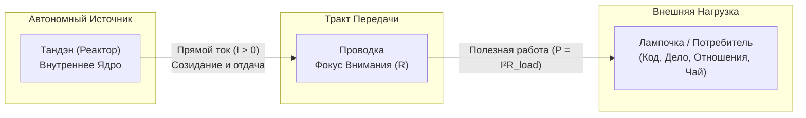
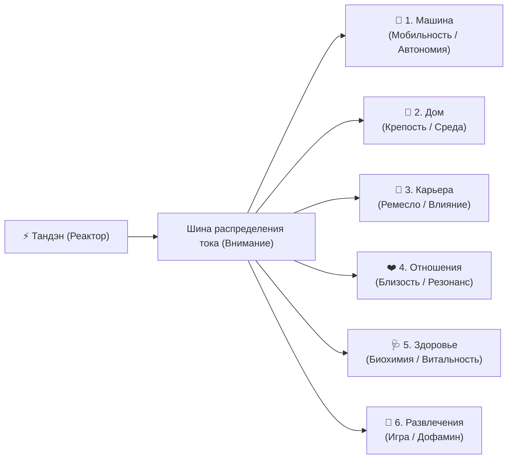
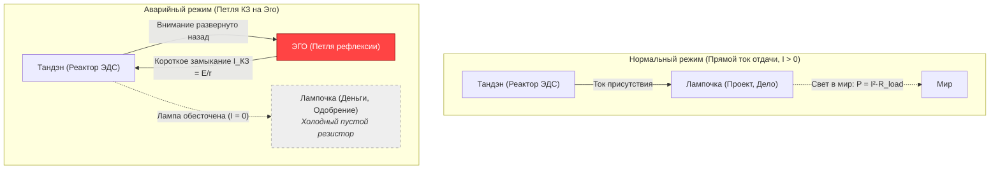

# 01. Базовая топология цепи и закон полярности

[← К оглавлению](file:///c:/Users/vanya/Antigravity%20Projects/Apps/Inner%20Current/wiki/index.md)

---

## 1. Концепция цепи: Энергетическая схема человека

В системе **«Внутренний ток» (Inner Current)** базовое состояние человеческого сознания и деятельности рассматривается не через призму расплывчатых психологических терминов, а как замкнутый электродинамический контур.

### Компоненты системы:

1. **Тандэн (丹田, Реактор / Генератор):**
   * Физиологически и ментально связан с центром тяжести тела и глубинным волевым ядром.
   * Является **активным источником ЭДС** (электродвижущей силы).
   * Не зависит от внешних оценок: генерирует чистую энергию действия и намерения.

2. **Проводка (Каналы внимания и восприятия):**
   * Нейрокогнитивный тракт передачи энергии в физический мир.
   * Обладает внутренним омическим сопротивлением $R_{internal}$.
   * При чистом внимании сопротивление стремится к нулю ($R \to 0$).

3. **Лампочка (Нагрузка / Внешний объект реализации):**
   * Любой объект внешнего мира, на который подаётся ток намерения и внимания.
   * Лампочка — это пассивный потребитель мощности ($P = I^2 R_{load}$), который раскаляется и светит только при протекании через него прямого тока.

### 💡 6 главных лампочек жизни (Многоканальный щит нагрузки)

В архитектуре материализации человеческого тока выделяются **6 базовых параллельных нагрузок**:

1. 🚗 **Машина:** Мобильность, динамика, свобода перемещения, автономия в пространстве, технологический статус и управляемость.
2. 🏡 **Дом:** Базовый контур физической безопасности, среда обитания, крепость, очаг, уют и укоренённость.
3. 💼 **Карьера:** Созидательное ремесло, профессиональная реализация, мастерство, влияние и масштаб социального действия.
4. ❤️ **Отношения:** Партнёрство, близость, любовь, семья, дружба и эмоциональный резонанс с другими сознаниями.
5. 🩺 **Здоровье:** Физический скафандр, биохимический баланс, сон, физическая форма, запас витальности и долголетие.
6. 🎉 **Развлечения:** Игра, гедонизм, переключение, хобби, свежий дофамин и чистая радость настоящего момента.

#### Закон токораспределения: почему редко горят все шесть сразу?

В электродинамике действует **1-й закон Кирхгофа** и закон сохранения мощности:
$$P_{total} = \sum_{i=1}^{6} P_i = P_{машина} + P_{дом} + P_{карьера} + P_{отношения} + P_{здоровье} + P_{развлечения}$$

* **Просадка напряжения (Undervoltage):** При ограниченной мощности генератора попытка подать ток одновременно на все 6 каналов приводит к падению напряжения в сети. Все лампы начинают тлеть вполнакала тусклым светом, вызывая синдром распыления и хроническую усталость.
* **Индивидуальная топология цепи:** У каждого человека в конкретный период времени активны свои приоритетные каналы. Например:
  * У одного ярко пылают **Карьера** и **Машина**, но обесточены **Здоровье** и **Отношения**.
  * У другого на полную мощность включены **Дом** и **Отношения**, а **Карьера** переведена в режим фонового поддержания.
  * У третьего ток направлен в **Здоровье** и **Развлечения**, пока выключены каналы недвижимости и социальных достижений.
* **Динамическая коммутация:** Зрелость оператора цепи заключается не в попытке сжечь реактор ради одновременного свечения всех 6 ламп, а в умении **чисто коммутировать реле внимания** без утечек и паразитного трения.
* **Режим монаха (Холостой ход, 0 / 6 ламп):** Крайнее состояние цепи, при котором все 6 лампочек обесточены ($P_{total} = 0$, $I = 0$). Реактор Тандэна работает на холостом ходу, не отдавая энергию во внешний мир.
  * **Польза:** Краткосрочная аскеза, шаббат, глубокая медитация или ретрит для сброса ментального перегрева ($R \to 0$) и восстановления чистоты ядра.
  * **Предупреждение:** Длительное нахождение в режиме монаха опасно закисанием и застоем реактора, распадом социальных связей, утратой заземления и глубокой экзистенциальной апатией. Для поддержания циркуляции жизни оператору рекомендуется подать хотя бы микро-ток (5–15 Вт) в базовые контуры («Здоровье» или «Дом»).

---

## 2. Закон фундаментальной полярности

> [!IMPORTANT]
> **Принцип естественной полярности:**
> Энергия ВСЕГДА течёт изнутри наружу:  
> **$\text{Реактор (Тандэн)} \longrightarrow \text{Нагрузка (Лампочка)}$**

Лампочка является **потребителем** энергии, а не её источником. Она светится от протекающего через неё тока созидания.

---

## 3. Патология Иллюзии Источника и Короткого Замыкания на Эго

В строгой электродинамике пассивная лампа накаливания не способна сгенерировать ток вспять: $\mathcal{E}_{\text{load}} \equiv 0$, а по закону Кирхгофа $I_{\text{in}} = I_{\text{out}}$ (в лампе не сохраняется ни один кулон заряда).

Когда человек пытается сделать лампочку источником своей ценности:
$$\text{«Вот когда проект признают великим — я наконец стану счастливым и спокойным»,}$$
в цепи разворачивается не мифический «обратный ток», а тяжелейшая внутренняя авария:

### Системные последствия аварии:
* **Иллюзия пустоты (Шуньята):** Лампа — чистый диссипатор ($R$). Вся энергия, которую вы в неё вложили, уходит в мир в виде фотонов и тепла ($Q = I^2 R t$). В ней нет запаса емкости ($C = 0$). Ожидание подпитки от пустой формы — это работа в холостую, создающая ощущение полного истощения.
* **Короткое замыкание на Эго ($I_{\text{КЗ}}$):** В попытке вытянуть оценку снаружи внимание срывается с ремесла и разворачивается внутрь, замыкаясь на мысли о себе (*«А как я выгляжу? А одобрят ли меня?»*). Возникает сверхток внутреннего КЗ:
  $$I_{\text{КЗ}} = \frac{\mathcal{E}_{\text{tanden}}}{r_{\text{internal}}}$$
  По закону Джоуля — Ленца проводка внимания раскаляется докрасна ($Q = I_{\text{КЗ}}^2 r_{\text{internal}} t$). Человек сгорает от тревоги и паники, пока сама задача остаётся тёмной и обесточенной.
* **Катастрофа при поломке лампочки:** Если внешняя лампа гаснет, человек переживает крах личности, так как ошибочно спутал бренное стекло нагрузки со своим вечным сердцем.

---

## 4. Сравнительный анализ состояний

| Параметр | Прямой ток отдачи (Норма) | Короткое замыкание на Эго (Патология) |
| :--- | :--- | :--- |
| **Вектор мощности** | Изнутри $\to$ Наружу (в действие) | Замкнут в петлю рефлексии (на себя) |
| **Статус нагрузки** | Чистый резистор-излучатель ($R$) | Иллюзорный «источник» / обесточена |
| **Функция результата** | Естественное сияние нити накала | Единственное условие права на жизнь |
| **Состояние внимания** | [02. Физика присутствия: сверхпроводимость (R → 0)](file:///c:/Users/vanya/Antigravity%20Projects/Apps/Inner%20Current/wiki/02-superconductivity-and-presence.md) | Паразитный перегрев петли эго ($Q = I_{\text{КЗ}}^2 r t$) |
| **Реакция на ошибку** | Инженерная калибровка цепи | Стыд, паралич, выгорание |
| **КПД системы** | Стремится к 100% | 0% (вся энергия уходит в паразитный самонагрев) |
