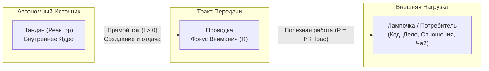
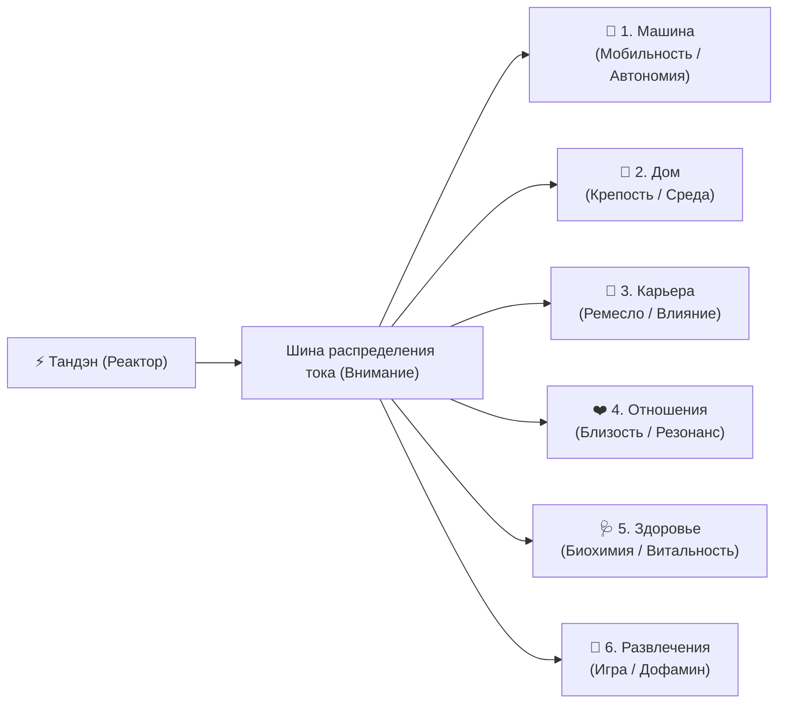
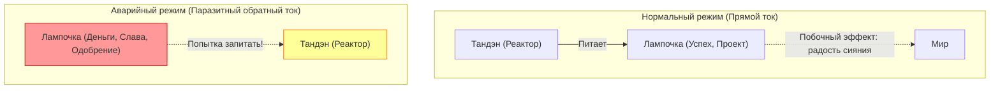

# 01. Базовая топология цепи и закон полярности

[← К оглавлению](file:///c:/Users/vanya/Antigravity%20Projects/Apps/Inner%20Current/wiki/index.md)

---

## 1. Концепция цепи: Энергетическая схема человека

В системе **«Внутренний ток» (Inner Current)** базовое состояние человеческого сознания и деятельности рассматривается не через призму расплывчатых психологических терминов, а как замкнутый электродинамический контур.

### Компоненты системы:

1. **Тандэн (丹田, Реактор / Генератор):**
   * Физиологически и ментально связан с центром тяжести тела и глубинным волевым ядром.
   * Является **активным источником ЭДС** (электродвижущей силы).
   * Не зависит от внешних оценок: генерирует чистую энергию действия и намерения.

2. **Проводка (Каналы внимания и восприятия):**
   * Нейрокогнитивный тракт передачи энергии в физический мир.
   * Обладает внутренним омическим сопротивлением $R_{internal}$.
   * При чистом внимании сопротивление стремится к нулю ($R \to 0$).

3. **Лампочка (Нагрузка / Внешний объект реализации):**
   * Любой объект внешнего мира, на который подаётся ток намерения и внимания.
   * Лампочка — это пассивный потребитель мощности ($P = I^2 R_{load}$), который раскаляется и светит только при протекании через него прямого тока.

### 💡 6 главных лампочек жизни (Многоканальный щит нагрузки)

В архитектуре материализации человеческого тока выделяются **6 базовых параллельных нагрузок**:

1. 🚗 **Машина:** Мобильность, динамика, свобода перемещения, автономия в пространстве, технологический статус и управляемость.
2. 🏡 **Дом:** Базовый контур физической безопасности, среда обитания, крепость, очаг, уют и укоренённость.
3. 💼 **Карьера:** Созидательное ремесло, профессиональная реализация, мастерство, влияние и масштаб социального действия.
4. ❤️ **Отношения:** Партнёрство, близость, любовь, семья, дружба и эмоциональный резонанс с другими сознаниями.
5. 🩺 **Здоровье:** Физический скафандр, биохимический баланс, сон, физическая форма, запас витальности и долголетие.
6. 🎉 **Развлечения:** Игра, гедонизм, переключение, хобби, свежий дофамин и чистая радость настоящего момента.

#### Закон токораспределения: почему редко горят все шесть сразу?

В электродинамике действует **1-й закон Кирхгофа** и закон сохранения мощности:
$$P_{total} = \sum_{i=1}^{6} P_i = P_{машина} + P_{дом} + P_{карьера} + P_{отношения} + P_{здоровье} + P_{развлечения}$$

* **Просадка напряжения (Undervoltage):** При ограниченной мощности генератора попытка подать ток одновременно на все 6 каналов приводит к падению напряжения в сети. Все лампы начинают тлеть вполнакала тусклым светом, вызывая синдром распыления и хроническую усталость.
* **Индивидуальная топология цепи:** У каждого человека в конкретный период времени активны свои приоритетные каналы. Например:
  * У одного ярко пылают **Карьера** и **Машина**, но обесточены **Здоровье** и **Отношения**.
  * У другого на полную мощность включены **Дом** и **Отношения**, а **Карьера** переведена в режим фонового поддержания.
  * У третьего ток направлен в **Здоровье** и **Развлечения**, пока выключены каналы недвижимости и социальных достижений.
* **Динамическая коммутация:** Зрелость оператора цепи заключается не в попытке сжечь реактор ради одновременного свечения всех 6 ламп, а в умении **чисто коммутировать реле внимания** без утечек и паразитного трения.

---

## 2. Закон фундаментальной полярности

> [!IMPORTANT]
> **Принцип естественной полярности:**
> Энергия ВСЕГДА течёт изнутри наружу:  
> **$\text{Реактор (Тандэн)} \longrightarrow \text{Нагрузка (Лампочка)}$**

Лампочка является **потребителем** энергии, а не её источником. Она светится от протекающего через неё тока созидания.

---

## 3. Феномен Обратного Тока (Reverse Current)

### Определение:
**Обратный ток** — критическая системная ошибка, при которой сознание пытается превратить внешнюю лампочку (статус, признание, прибыль, чужую валидацию) в генератор жизненной силы для своего реактора.

### Формула иллюзии:
$$\text{«Вот когда проект выстрелит (или меня похвалят) — я наконец наполнюсь и стану счастливым».}$$

### Физические последствия обратного тока:
1. **Эффект заклинивания генератора:** Внешний потребитель не обладает ЭДС. Попытка высосать энергию из внешней формы создает разрежение и депрессивное истощение.
2. **Плавление изоляции проводов:** Внимание приковывается к внешнему датчику чужого мнения. Возникает тревога ожидания, паника и синдром самозванца.
3. **Коллапс при аварии лампочки:** Если внешняя лампочка гаснет (проект закрыт, инвестор отказал, критик оставил негативный отзыв), человек с обратным током испытывает экзистенциальную катастрофу, так как считал эту лампочку своим сердцем.

---

## 4. Сравнительная таблица состояний цепи

| Параметр | Прямой ток (Здоровая цепь) | Обратный ток (Аварийный контур) |
| :--- | :--- | :--- |
| **Направление вектора** | Изнутри $\to$ Наружу | Снаружи $\to$ Внутрь |
| **Роль результата** | Естественное сияние нити накала | Единственное условие права на жизнь |
| **Состояние внимания** | Мусин (Поток, чистота проводки) | Постоянный мониторинг внешних оценок |
| **Реакция на ошибку** | Калибровка параметров системы | Обрушение самооценки, стыд, паралич |
| **КПД энергосистемы** | Стремится к 100% | Стремится к 0% (вся энергия уходит в трение) |
