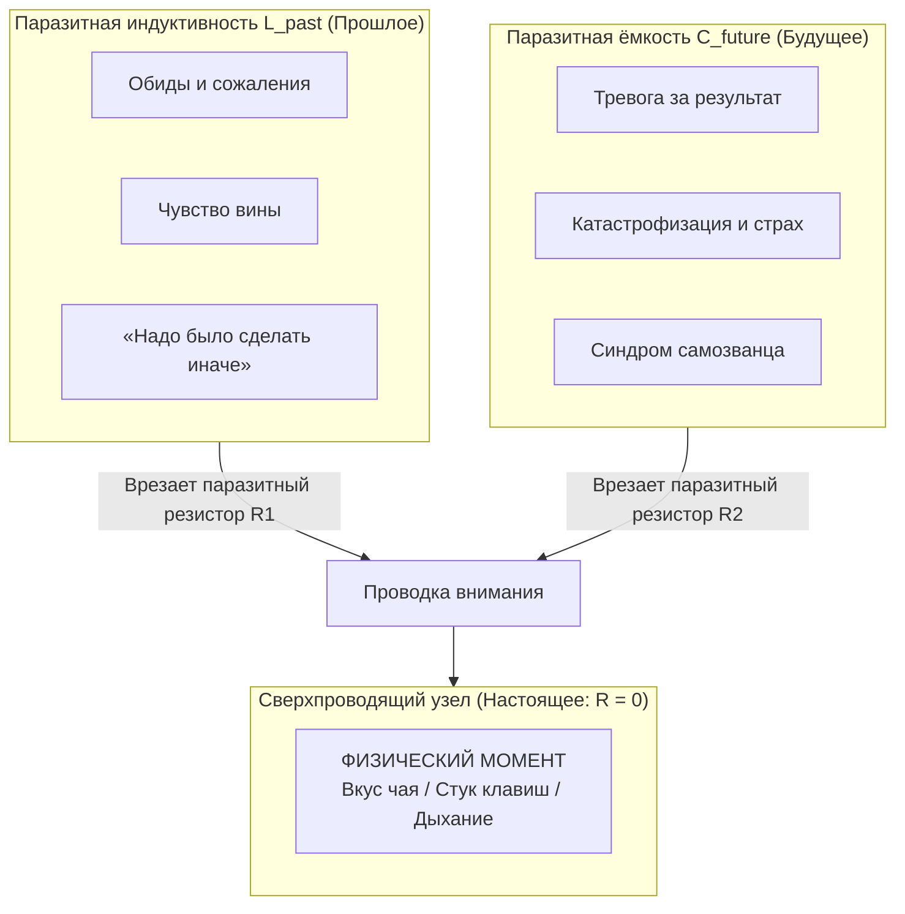
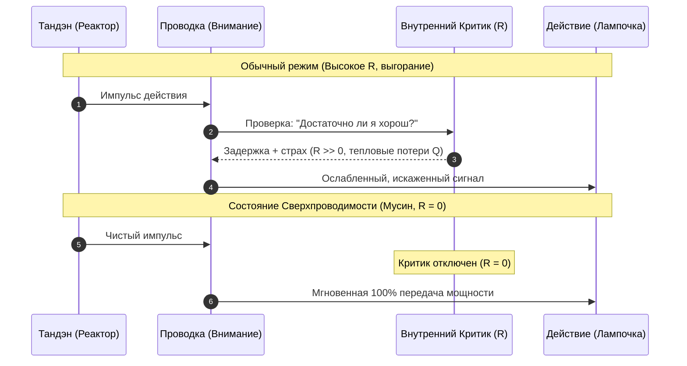

# 02. Физика присутствия: состояние сверхпроводимости

[← К оглавлению](file:///c:/Users/vanya/Antigravity%20Projects/Apps/Inner%20Current/wiki/index.md)

---

## 1. Физическая суть формулы «Быть в моменте»

В популярной культуре концепция «быть здесь и сейчас» часто воспринимается как эзотерическое или поэтическое наставление. Однако в инженерной модели **«Внутренний ток»** это строгое физическое явление — **состояние сверхпроводимости проводника**.

> [!NOTE]
> **Физическое определение:**  
> Сверхпроводимость — свойство проводника, при котором его электрическое сопротивление падает строго до нуля ($R \to 0$). В таком режиме электрический ток течёт бесконечно долго без падения напряжения и без выделения тепла.

В человеческой энергосистеме:
* **Момент «Здесь и сейчас»** — единственный физически существующий интервал времени (текущая миллисекунда).
* **Сверхпроводимость ума** — синхронизация фокуса внимания с физическими сенсорными координатами текущего действия.

---

## 2. Паразитные индуктивности времени и закон Джоуля — Ленца

Вне физической реальности сознание способно создавать две колоссальные виртуальные индуктивности:

### Закон Джоуля — Ленца в психике:
Тепловые потери (омический перегрев системы) описываются уравнением:
$$Q = I^2 \cdot R \cdot t$$
Где:
* $I$ — сила тока вашего намерения/энергии;
* $R$ — паразитное сопротивление ума (сомнения, страх оценки, внутренний диалог);
* $t$ — время удержания внимания на виртуальной проблеме;
* $Q$ — паразитное тепло (психологическое выгорание, головная боль, хроническая усталость).

Когда внимание улетает в прошлое или будущее, в цепь врезаются гигантские виртуальные сопротивления. Человек может просто сидеть в кресле и пить кофе, но его энергосистема раскалена докрасна, сжигая мегаватты в омическом трении.

---

## 3. Обнуление сопротивления ($R \to 0$) и состояние Мусин (無心)

Когда внимание возвращается в физический контакт с реальностью:
1. **Отключение ментального судилища:** У мозга нет нейрофизиологического ресурса одновременно поддерживать нарратив эго («кто я?», «как я выгляжу?») и на 100% считывать сенсорный поток (давление подошв на пол, тактильный отклик клавиатуры, температуру пара).
2. **Мгновенное исчезновение $R$:** Внутренний критик засыпает. Исчезает зазор между импульсом воли и действием.
3. **Состояние Мусин (Чистый разум / Flow):**
   * Если вы идете — вы просто идете.
   * Если вы пишете код — вы просто пишете код.
   * Ток из Тандэна льётся прямо в лампочку задачи.

---

## 4. Почему сверхпроводимость переживается как счастье?

Счастье в модели «Внутренний ток» — это **не награда за достижение**, а **субъективное переживание нулевого сопротивления цепи**.

Когда ток течет свободно, без паразитного трения о мысли о времени:
* Человек ощущает кристальную ясность ума;
* Тело расслабляется (нет паразитных мышечных зажимов);
* Возникает плотный прилив сил при минимальном расходе метаболических ресурсов.

> [!TIP]
> «Быть в моменте» — это не медитативный фокус, а инженерный перевод контура в режим **R = 0**, когда виртуальные резисторы времени отключены.
