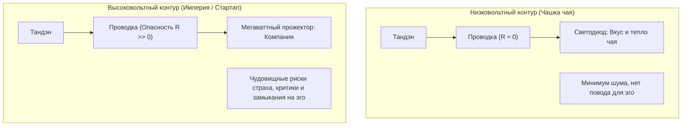
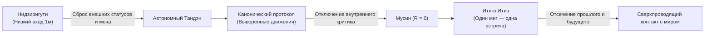

# 03. Инвариантность масштаба нагрузки: от чая до империи

[← К оглавлению](file:///c:/Users/vanya/Antigravity%20Projects/Apps/Inner%20Current/wiki/index.md)

---

## 1. Фундаментальный принцип инвариантности масштаба

> [!IMPORTANT]
> **Инженерная аксиома системы:**  
> Масштаб нагрузки не изменяет базовых законов электродинамики контура:
> $$\text{Тандэн (Реактор)} \xrightarrow{\quad \text{Внимание} \quad} \text{Лампочка (Нагрузка)}$$

Законы движения тока остаются **строго идентичными**, пьёте ли вы чашку улуна утром или управляете строительством международной цифровой корпорации. Разница заключается исключительно в **номинале мощности** и **уровне паразитных шумов**.

---

## 2. Почему в «простых вещах» счастье видно невооружённым глазом

Люди веками повторяют формулу: *«Счастье — в простых вещах»* (это наглядно показано и в документальных свидетельствах, например, в фильме «Cosa è felicità?», где стеклодувы, крестьяне и пожилые люди говорят о чашке эспрессо, тишине и любимой работе).

Инженерная модель «Внутренний ток» дает этому математическое объяснение:

1. **Отсутствие давления эго:**
   * Держа в руках чашку чая, человек не задается вопросом: *«А достаточно ли я успешен в этом глотке?»*, *«Что скажут инвесторы о том, как я держу чашку?»*.
   * Отсутствие социального давления приводит к **естественному падению внутреннего сопротивления ($R \to 0$)**.
2. **Отсутствие иллюзии источника:**
   * Никто не ожидает, что чашка чая решит все экзистенциальные проблемы и придаст величие. Никому не приходит в голову требовать от фарфора подпитки своего «Я». Ток спокойно течёт из человека в восприятие напитка ($I > 0$).

---

## 3. Почему «империя» разрушает неподготовленного человека

Когда человек подключает к своему контуру мощнейшую высоковольтную нагрузку (масштабный бизнес, публичность, миллионные контракты):

* **Всплеск паразитных сопротивлений:** В кабелях внимания мгновенно возникают массивные индуктивности: страх банкротства, зависть к конкурентам, зависимость от внешних оценок. Провода начинают плавиться от омического перегрева.
* **Искушение иллюзией источника:** Человек начинает ждать: *«Вот когда капитализация достигнет \$100M, я наконец стану великим и спокойным»*. В этот момент внимание срывается в петлю КЗ на эго, реактор глушится мыслями о себе, а внутри наступает тьма и опустошение.

---

## 4. Японская чайная церемония (Садо) как калибровочный стенд

Японская традиция чаепития (тяною), созданная мастером Сэн-но Рикю, — это не фольклорный ритуал, а **исторический инженерный полигон калибровки сверхпроводимости**.

### Архитектурные элементы калибровки:

1. **Нидзиригути (Низкий вход около 1 метра):**
   * Даже великий сёгун или князь даймё обязан был снять самурайские мечи, опуститься на колени и вползти в комнату.
   * **Инженерный смысл:** Принудительный сброс внешней нагрузки. В комнату входит только чистый Реактор, оставив социальные маски снаружи.
2. **Строгий канон движений:**
   * Форма взбивания матча венчиком отточена до миллиметра.
   * **Инженерный смысл:** Когда алгоритм моторики зашит на уровне автоматизма, лобные доли отключают сомнения. Исчезает вопрос «как я выгляжу?». Проводка становится идеальным проводником.
3. **Итиго Итиэ (一期一会 — «Один миг, одна встреча»):**
   * Осознание, что этот состав людей, этот пар и этот вкус никогда больше не повторятся в истории Вселенной.
   * **Инженерный смысл:** Полный запрет на подключение виртуальных индуктивностей прошлого и будущего. Вся мощность подаётся в текущую миллисекунду.

---

## 5. Вывод для созидателя

> [!TIP]
> **Чашка чая — это калибровочная лаборатория.**  
> Если человек не умеет держать нулевое сопротивление ($R = 0$) и прямую полярность на светодиоде чашки чая, он неминуемо спалит проводку при попытке запитать мегаваттный реактор крупного продукта. Научившись держать чистый ток в малом, инженер переносит этот же навык на код, архитектуру и руководство империями.
