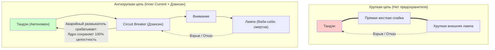
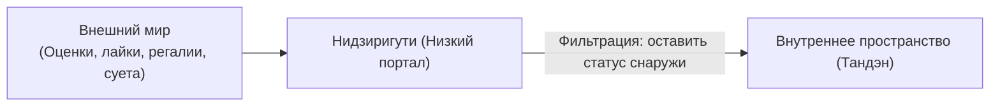

# 04. Предохранители цепи, ваби-саби и антихрупкость

[← К оглавлению](file:///c:/Users/vanya/Antigravity%20Projects/Apps/Inner%20Current/wiki/index.md)

---

## 1. Проблема короткого замыкания внешней нагрузки

В реальном мире любые внешние объекты (проекты, серверы, компании, отношения, материальные предметы) подвержены энтропии и разрушению.

Если у человека **нет изоляции между ядром и внешней нагрузкой**, авария на объекте вызывает короткое замыкание (Short Circuit) во всей его энергосистеме:
* Проект закрылся $\to$ человек впадает в депрессию;
* Критик написал разгромный отзыв $\to$ внутренний реактор глушится;
* Чашка разбилась $\to$ истерика и потеря покоя.

---

## 2. Принцип Ваби-Саби и Кинцуги: встроенное принятие смертности

Традиционная японская эстетика чаепития намеренно избегает безупречного китайского фарфора. В церемонии используют грубые, асимметричные глиняные чаши, а разбитые чаши склеивают лаком с золотым порошком (**кинцуги**, 金継ぎ).

### Инженерное значение Ваби-саби:
1. **Снятие идеализации с нагрузки:** Внешняя лампочка изначально признается временной, несовершенной и уязвимой.
2. **Отсутствие катастрофизации:** Если чашка треснула или сервер упал — ткань бытия не разорвана. Ценность заключалась не в молекулах глины, а в непрерывном присутствии духа мастера.
3. **Золотой шов:** Ошибки и шрамы становятся элементом архитектуры опыта, а не поводом для самоуничтожения.

---

## 3. Дзансин (残心): ментальный Circuit Breaker

В японских боевых искусствах (кюдо, кэндо) и чайной традиции **Дзансин** означает «сохраняющееся сознание» — состояние бдительной устойчивости после выполнения действия (после выстрела из лука или нанесения удара).

В инженерной архитектуре программного обеспечения аналогом Дзансин является паттерн **Circuit Breaker** (автоматический выключатель цепи) и принцип **Graceful Degradation** (плавная деградация):

* Когда внешняя подсистема перестает отвечать, Circuit Breaker изолирует сбойный узел, не позволяя каскадному падению обрушить главный сервер или ядро приложения.
* В человеческой практике Дзансин означает: стрела выпущена, код задеплоен, проект запущен — но реактор не «улетает» вместе с проектом. Сознание остается укорененным в Тандэне.

---

## 4. Архитектурный паттерн Нидзиригути (Входной фильтр)

Входная защита контура требует соблюдения правила:
* Никакой внешний статус (диплом, должность, богатство, обида) не имеет права проникать в область генерации тока.
* Человек подходит к работе «на коленях» — чистым учеником, созидателем, свободным от бремени собственного величия.

---

## 5. Свод правил безопасности для создателя

> [!CAUTION]
> 1. **Никогда не делайте внешнюю оценку датчиком обратной связи для своего реактора.** Оценка — это лишь параметр настройки освещения в комнате, но не источник напряжения в батарее.
> 2. **Проектируйте каждую внешнюю задачу с допущением её потенциального сбоя.** Если проект рухнет, ваш внутренний генератор должен продолжать бесперебойную выработку энергии.
> 3. **Шрамы и сбои — это золото кинцуги.** Любая ошибка в коде или в жизни — это калибровочные данные для следующей итерации контура.
