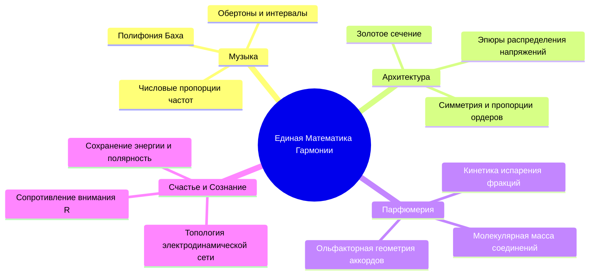
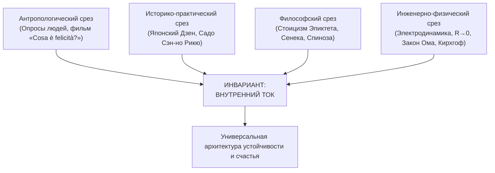

# 05. Синтез физики и духа: математика гармонии

[← К оглавлению](file:///c:/Users/vanya/Antigravity%20Projects/Apps/Inner%20Current/wiki/index.md)

---

## 1. Преодоление исторической трещины «физиков и лириков»

В эпоху Просвещения европейская мысль совершила искусственное разделение единого универсума на два изолированных лагеря:
* **«Физики» (Технари):** исследуют материю через строгие формулы, считая чувства, эстетику и духовность иррациональной иллюзией.
* **«Лирики» (Гуманитарии и мистики):** описывают переживания туманными метафорами, отвергая математику как бездушный сухой инструмент.

До этого раскола великие цивилизации видели мир нераздельным:
* **Пифагорейцы** доказывали, что музыкальные интервалы — это чистые числовые дроби ($\frac{1}{2}$ — октава, $\frac{2}{3}$ — квинта, $\frac{3}{4}$ — кварта). Музыка и геометрия были формой познания божественного порядка.
* **Бенедикт Спиноза** в трактате «Этика» выводил законы душевного покоя и человеческой свободы через строгие геометрические аксиомы и теоремы (*more geometrico*).
* **Мастера Дзен и боевых искусств** не отделяли медитацию от анатомии, биомеханики и физики упругости лука.

> [!NOTE]
> **Цель системы «Внутренний ток»:**  
> Вернуть человеку утраченную целостность. Материализовать дух (дать ему законы эксплуатации) и одухотворить материю (увидеть в физических законах отражение внутреннего опыта).

---

## 2. Математика невидимого: парфюмерия, стиль и архитектура

Красота не является хаотичной случайностью. За каждой эстетической субстанцией стоит строгая геометрия и кинетика.

### Парфюмерия как химическая стереометрия:
Парфюмерная пирамида — это не поэтическая выдумка маркетологов, а прямое отражение физико-химических свойств:
* **Верхние ноты:** низкомолекулярные терпены и летучие цитрусовые эфиры (высокое давление пара, быстрое испарение $0\text{–}15$ мин).
* **Ноты сердца:** соединения со средней молекулярной массой (цветочные спирты, альдегиды, $2\text{–}4$ часа).
* **Базовые ноты:** тяжелые смолы, мускусы, древесные изомеры с низкой кинетикой десорбции ($8\text{–}24$ часа).

Гармоничный аромат рассчитывается как полифонический звуковой аккорд: баланс молярных масс и скоростей испарения создает непрерывную мелодию запаха. Оцифровка стиля и ароматов в веб-сервисах — это раскрытие скрытой математики природы.

---

## 3. Принцип независимой сходимости (Consilience)

В эпистемологии и философии науки существует фундаментальный критерий истинности: **принцип независимой сходимости (Consilience)**.  
Если гипотеза независимо подтверждается данными из совершенно не связанных областей знания, разделенных тысячелетиями и географией, речь идет об **объективном законе реальности**, а не о субъективном «самоделе».

1. **Документальные свидетельства («Cosa è felicità?»):** Мастер-стеклодув находит счастье в создании совершенной формы раскаленного стекла и независимости от миллиардов. Винодел — в лозе. Бабушка — в утреннем покое. Все они эмпирически описывают состояние, когда ток течет без омического трения в любимое дело.
2. **Стоицизм:** Дихотомия контроля Эпиктета («то, что зависит от нас» = Реактор, «то, что не зависит» = Внешние нагрузки).
3. **Электродинамика:** Замкнутость цепи, падение сопротивления, тепловыделение Джоуля — Ленца.

---

## 4. Место автора: Инженер-Изобретатель

Изобретение системы «Внутренний ток» подобно изобретению паровой машины:
* Свойства расширения водяного пара наблюдались людьми тысячелетиями в обычном кипящем чайнике.
* Но инженеры **Ньюкомен и Уатт** создали цилиндр, поршень и клапаны, превратив рассеянное наблюдение в функциональную, повторяемую технологию, изменившую ход истории.

Система «Внутренний ток» делает то же самое со стихийным опытом человеческого счастья: переводит его из разряда туманных бесед в категорию **проверяемой инженерной топологии, диагностического алгоритма и прикладного программного продукта**.
