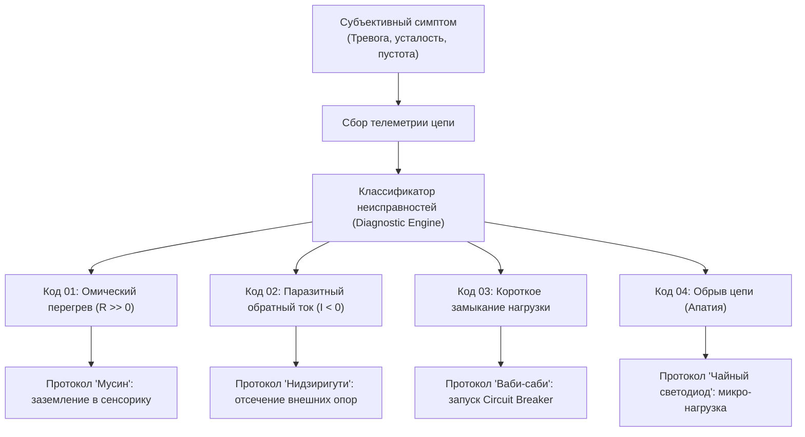
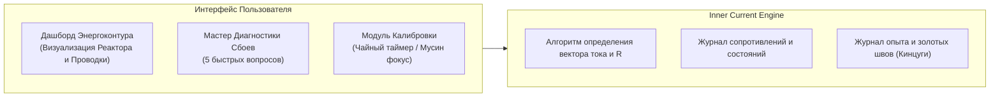

# 06. Машина для диагностики счастья: системная спецификация

[← К оглавлению](file:///c:/Users/vanya/Antigravity%20Projects/Apps/Inner%20Current/wiki/index.md)

---

## 1. Концепция «Машины диагностики»

Как паровая машина превратила тепловое расширение пара в полезную механическую работу, так **«Машина диагностики счастья»** переводит душевное состояние человека из категории субъективной драмы в категорию **инженерного мониторинга телеметрии и поузловой отладки цепи**.

---

## 2. Классификатор неисправностей контура

### Неисправность 01: Омический перегрев проводки ($R \gg 0$)
* **Физическая суть:** В цепь врезаны виртуальные сопротивления мыслей о прошлом и будущем. Согласно закону Джоуля — Ленца ($Q = I^2 R t$), колоссальная мощность рассеивается в паразитное тепло.
* **Симптомы пользователя:** Ментальное выгорание, тяжесть в голове, рассеянность, суета, хроническая усталость при отсутствии физической работы.
* **Протокол отладки:**
  1. Выдернуть из внимания виртуальные ветки симуляций ($t_{past} \to 0$, $t_{future} \to 0$).
  2. Перевести фокус на физические рецепторы: тактильный отклик тела, дыхание, звук клавиш.
  3. Добиться режима сверхпроводимости $R \to 0$.

---

### Неисправность 02: Паразитный обратный ток (Reverse Polarity, $I_{load \to core}$)
* **Физическая суть:** Попытка использовать внешнюю лампочку (деньги, похвалу, охваты, статус) в качестве генератора собственной ценности.
* **Симптомы пользователя:** Синдром самозванца, панический страх критики, болезненная зависимость от реакций аудитории, прокрастинация.
* **Протокол отладки:**
  1. Активация портала **Нидзиригути**: мысленно отрезать внешний статус.
  2. Принудительное размыкание обратной линии: вспомнить, что лампочка не имеет собственного генератора.
  3. Разворот вектора: отдавать качество и свет в проект просто ради совершенства формы, а не ради подзарядки.

---

### Неисправность 03: Короткое замыкание при отказе нагрузки (Short Circuit)
* **Физическая суть:** Внешняя нагрузка сгорела или разбилась (увольнение, отказ клиента, срыв сделки, разбитая чаша), а у пользователя не был включен предохранитель **Дзансин**.
* **Симптомы пользователя:** Ощущение «мир рухнул», экзистенциальный шок, депрессивный паралич.
* **Протокол отладки:**
  1. Срабатывание ментального **Circuit Breaker**: автоматическая изоляция сбойного узла.
  2. Применение философии **Ваби-саби**: констатация смертности внешних форм.
  3. Процедура **Кинцуги**: интеграция опыта скола золотым швом без остановки работы Тандэна.

---

### Неисправность 04: Обрыв цепи / Застой реактора (Open Circuit)
* **Физическая суть:** Ток не подаётся ни на один внешний объект. Реактор работает на холостом ходу, энергия застаивается.
* **Симптомы пользователя:** Апатия, прокрастинация, экзистенциальная скука, «не знаю, зачем вставать по утрам».
* **Протокол отладки:**
  1. Не пытаться сразу запустить мегаваттную фабрику.
  2. Подключить минимальную низковольтную нагрузку (заварить чашку чая, помыть пол, написать 3 строки чистого кода).
  3. Замкнуть цепь на простом действии и восстановить циркуляцию тока.

---

## 3. Архитектурный каркас для будущего приложения «Inner Current»

На основе этой базы знаний планируется разработка клиент-серверного веб-сервиса и мобильного приложения:

### Ключевые фичи будущего сервиса:
1. **Диагностический монитор цепи (Circuit Visualizer):** Интерактивная схема в реальном времени, показывающая состояние Тандэна, уровень сопротивления $R$, направление вектора (прямой/обратный) и подключенные нагрузки.
2. **Аварийный чеклист сброса обратного тока:** Быстрый 2-минутный интерактивный сценарий отключения паразитных напряжений.
3. **Калибровочный тренажер микронагрузок:** Практики сверхпроводимости на простых бытовых действиях (чай, дыхание, одиночная кодовая функция) перед началом высоковольтных задач.
4. **Кинцуги-лог:** Превращение ошибок и сбоев в каталог архитектурного опыта.
