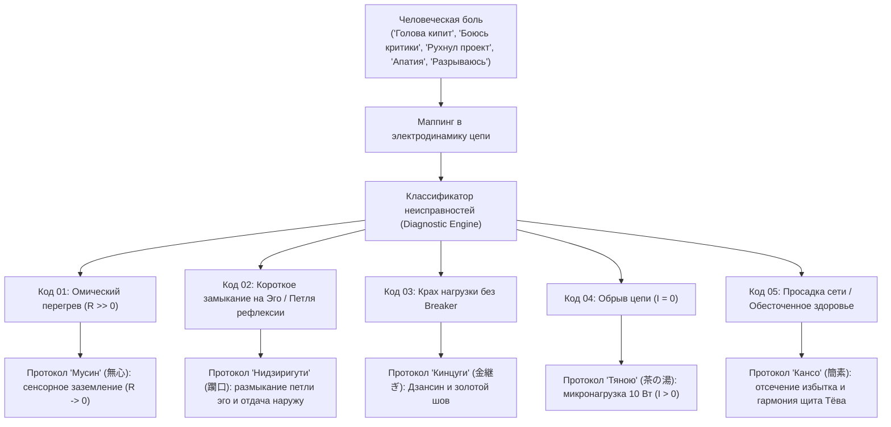
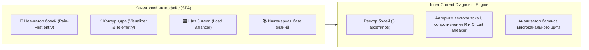

# 06. Машина для диагностики счастья: системная спецификация

[← К оглавлению](file:///c:/Users/vanya/Antigravity%20Projects/Apps/Inner%20Current/wiki/index.md)

---

## 0. Принцип Pain-First: отталкивание от боли человека

> **Аксиома Inner Current:** *«Всякая система рождается как ответ на какую-то боль. Если боли нет — система не нужна. Боль есть: человек несчастлив, и несчастлив он конкретными, повторяющимися типами страданий. Система Inner Current отталкивается не от абстрактных формул, а от живого крика боли человека, показывая его электродинамическую причину в контуре и выдавая мгновенный и системный рецепт исцеления.»*

Человек не должен гадать, чему равны его омическое сопротивление $R$ или вектор $I$. Он заходит в систему со своей острой человеческой болью:
1. **«Голова кипит, мысли крутятся 24/7, не могу уснуть»** → Код `BURNOUT_OVERTHINKING` (Омический перегрев $R \gg 0$).
2. **«Чувствую себя самозванцем, боюсь критики, откладываю релиз»** → Код `IMPOSTOR_VALIDATION` (Короткое замыкание на Эго / Иллюзия внешнего источника).
3. **«Проект рухнул / меня бросили — земля ушла из-под ног»** → Код `COLLAPSE_SHOCK` (Крах нагрузки без предохранителя Circuit Breaker).
4. **«Хроническая лень, апатия, нет сил встать с дивана»** → Код `APATHY_STAGNATION` (Обрыв цепи, холостой ход $I = 0$).
5. **«Разрываюсь между делами, посыпалось здоровье»** → Код `OVERLOAD_HEALTH_DRAIN` (Просадка сети Undervoltage и истощение канала Здоровья).

---

## 1. Концепция «Машины диагностики»

Как паровая машина превратила тепловое расширение пара в полезную механическую работу, так **«Машина диагностики счастья»** переводит душевное состояние человека из категории субъективной драмы в категорию **инженерного мониторинга телеметрии и поузловой отладки цепи**.

---

## 2. Классификатор неисправностей контура

### Неисправность 01: Омический перегрев проводки ($R \gg 0$)
* **Физическая суть:** В цепь врезаны виртуальные сопротивления мыслей о прошлом и будущем. Согласно закону Джоуля — Ленца ($Q = I^2 R t$), колоссальная мощность рассеивается в паразитное тепло.
* **Симптомы пользователя:** Ментальное выгорание, тяжесть в голове, рассеянность, суета, хроническая усталость при отсутствии физической работы.
* **Протокол отладки — «Мусин» (無心, Mushin):**
  1. Выдернуть из внимания виртуальные ветки симуляций ($t_{past} \to 0$, $t_{future} \to 0$).
  2. Перевести фокус на физические рецепторы: тактильный отклик тела, дыхание, звук клавиш.
  3. Добиться режима сверхпроводимости $R \to 0$.

---

### Неисправность 02: Короткое замыкание на Эго / Иллюзия внешнего источника (Ego Short Circuit)
* **Физическая суть:** Попытка приписать пустой нагрузке ($\mathcal{E}_{\text{load}} \equiv 0$) статус генератора собственной ценности. Внимание не идёт наружу в ремесло, а закольцовывается во внутреннюю паразитную петлю рефлексии о себе (*«А как я выгляжу? А одобрят ли меня?»*). Возникает сверхток внутреннего КЗ ($I_{\text{КЗ}} = \mathcal{E}_{\text{tanden}}/r_{\text{internal}}$), проводка внимания кипит, а нагрузка остаётся холодной и тёмной.
* **Симптомы пользователя:** Синдром самозванца, панический страх критики, болезненная зависимость от реакций аудитории, прокрастинация.
* **Протокол отладки — «Нидзиригути» (躙口, Nijiriguchi):**
  1. Активация портала **Нидзиригути**: мысленно оставить меч статуса и эго за порогом чайной хижины.
  2. Разомкнуть внутреннюю петлю рефлексии: осознать, что в лампе нет ни одного кулона энергии для вас (Шуньята).
  3. Направить ток наружу: отдавать мастерство в код или ремесло ради чистоты действия, превращая сопротивление проводки в ноль ($R \to 0$).

---

### Неисправность 03: Короткое замыкание при отказе нагрузки (Short Circuit)
* **Физическая суть:** Внешняя нагрузка сгорела или разбилась (увольнение, отказ клиента, срыв сделки, разбитая чаша), а у пользователя не был включен предохранитель **Дзансин**.
* **Симптомы пользователя:** Ощущение «мир рухнул», экзистенциальный шок, депрессивный паралич.
* **Протокол отладки — «Кинцуги» (金継ぎ, Kintsugi) & «Дзансин» (残心):**
  1. Срабатывание ментального **Circuit Breaker** (Дзансин): автоматическая изоляция сбойного узла.
  2. Применение философии **Ваби-саби**: констатация смертности внешних форм.
  3. Процедура **Кинцуги**: интеграция опыта скола золотым швом без остановки работы Тандэна.

---

### Неисправность 04: Обрыв цепи / Застой реактора (Open Circuit)
* **Физическая суть:** Ток не подаётся ни на один внешний объект. Реактор работает на холостом ходу, энергия застаивается.
* **Симптомы пользователя:** Апатия, прокрастинация, экзистенциальная скука, «не знаю, зачем вставать по утрам».
* **Протокол отладки — «Тяною» (茶の湯, Chanoyu):**
  1. Не пытаться сразу запустить мегаваттную фабрику.
  2. Подключить минимальную низковольтную нагрузку (заварить чашку чая, помыть пол, написать 3 строки чистого кода).
  3. Замкнуть цепь на простом действии и восстановить циркуляцию тока ($I > 0$).

---

### Неисправность 05: Просадка сети и обесточивание канала Здоровья (Undervoltage / Starved Bus)
* **Физическая суть:** Включение слишком большого числа высокомощных нагрузок одновременно при ограниченной мощности генератора Тандэн ($\sum P_i > P_{core}$). Согласно закону сохранения мощности, падает напряжение шины ($U \downarrow$), а критически важная нагрузка «Здоровье» обесточивается ($P_{health} < 5$ Вт).
* **Симптомы пользователя:** «Разрываюсь между миллионом дел, сплю по 4 часа, тело сыпется, ничего не довожу до конца, всё валится из рук».
* **Протокол отладки — «Кансо» (簡素, Kanso) & «Тёва» (調和, Chōwa):**
  1. Немедленно отключить 3–4 второстепенных автомата на щите (принцип простоты Кансо).
  2. Восстановить номинал напряжения шины, направив гарантированные 20–30 Вт в канал «Здоровье» (сон, вода, дыхание).
  3. Перевести остальные лампы в режим последовательной гармоничной работы (Тёва).

---

## 3. Архитектура приложения «Inner Current»

Архитектура реализована в виде высокоинтерактивного Single Page Application (`public/index.html`) и TypeScript ядра (`src/core/diagnostic.engine.ts`):

### Ключевые возможности системы:
1. **🚨 Навигатор болей (Pain-First View):** Стартовый экран системы. Позволяет выбрать свой крик души («Голова кипит», «Боюсь критики», «Рухнул проект», «Апатия», «Разрываюсь»), мгновенно увидеть физическую причину в цепи и получить **30-секундное действие прямо сейчас** плюс полный протокол дзен-инженерии.
2. **⚡ Монитор контура ядра (Circuit Visualizer):** Интерактивная схема в реальном времени с ползунками $t_{past}$, $t_{future}$, направлением тока, предохранителем Дзансин и автодиагностикой.
3. **🎛️ Многоканальный щит мощности (Six-Bulb Load Panel):** Балансировка 6 жизненных контуров (Здоровье, Код/Творчество, Семья, Деньги, Социум, Смысл) с защитой от просадки напряжения и режима отшельника.
4. **🍵 Чайная калибровка:** Практика сверхпроводимости ($R \to 0$) на микронагрузке заваривания чая.

