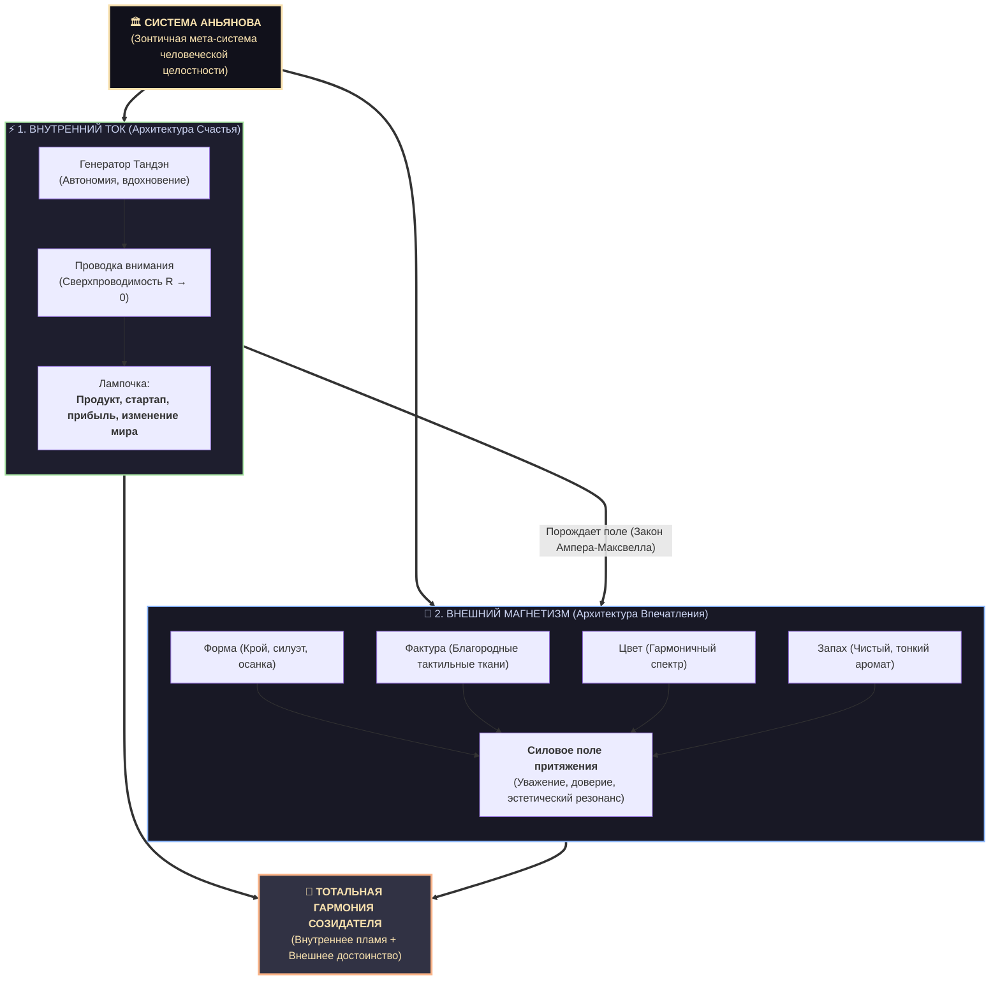
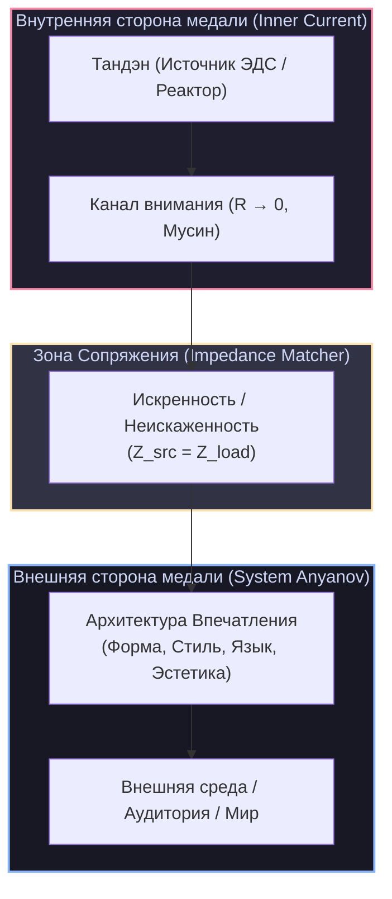

# 08. Система Аньянова: Внутренний ток и Внешний магнетизм

[← К оглавлению](file:///c:/Users/vanya/Antigravity%20Projects/Apps/Inner%20Current/wiki/index.md) | [⚡ К мастер-карте (MOC)](file:///c:/Users/vanya/Antigravity%20Projects/Apps/Inner%20Current/Inner%20Current%20-%20MOC.md)

---

> [!abstract] Зонтичная архитектура: Система Аньянова
> **Система Аньянова (Anyanov System)** — это всеобъемлющая мета-система и зонтичная архитектура человеческой целостности, объединяющая два фундаментальных взаимосвязанных контура:
> 
> 1. ⚡ **Внутренний ток (Inner Current / Архитектура счастья):** генератор ЭДС (Тандэн), чистота проводки внимания ($R \to 0$), преодоление синдрома самозванца, созидание прорывного продукта и обретение вкуса к жизни.
> 2. 🧲 **Внешний магнетизм (External Magnetism / Архитектура впечатления):** силовое поле притяжения в физическом мире, формируемое через квадро-согласование **Формы, Фактуры, Цвета и Запаха**.
> 
> Это решение главного кризиса современного человека — двойного разлада (потухший взгляд внутри + запущенный вид снаружи).

---

## 1. Анатомия двойного разлада и кейс Основателя стартапа

Чтобы понять необходимость зонтичной системы, достаточно взглянуть на реальность большинства людей:

### Архитектура счастья — это полный рабочий цикл реализации
Она самодостаточна сама по себе:
$$\text{Генератор (Тандэн)} \xrightarrow{\quad \text{Внимание (R} \to \text{0)} \quad} \text{Лампочка (Продукт / Запуск AI / Прибыль)}$$

* Основатель побеждает синдром самозванца.
* У него есть неиссякаемый ток: он пишет прорывной код, выкатывает релиз, меняет индустрию и зарабатывает деньги.
* **Лампочка уже горит на полную мощность!** Внутренний контур счастлив и работоспособен.

### Но возникает слепая зона: «Гений в растянутом худи»
Этот же основатель может сидеть в мятом, грязном худи, не заботиться о гигиене и теле, и от него может дурно пахнуть. Ему кажется: *«Какая разница, главное — мой интеллект и метрики стартапа»*. 

Но пренебрежение внешней формой — это потеря огромного пласта силы, уважения и гармонии.

### И здесь вступает Внешний магнетизм:
А что, если этот сильный, реализованный, зарабатывающий стартапер будет ещё и **безупречно собран**:
* **Форма:** собранный, точный силуэт и идеальная посадка.
* **Фактура:** благородные, тактильные натуральные ткани.
* **Цвет:** выверенная, гармоничная палитра.
* **Запах:** чистый, тонкий, уместный аромат.

Тогда под зонтиком **Системы Аньянова** наступает **полная гармония**: великий продукт внутри и притягательный человек снаружи.

---

## 2. Физический закон: Согласование импедансов (Impedance Matching)

В электродинамике, акустике и теории радиосвязи существует фундаментальный закон передачи энергии:

$$\eta = \frac{P_{transmitted}}{P_{total}}, \quad \text{где } P_{max} \iff Z_{source} = Z_{load}^*$$

> [!important] Принцип согласования импедансов
> Максимальная мощность передается от источника в нагрузку (или в открытое пространство через антенну) **только тогда**, когда внутреннее сопротивление источника и внешнее сопротивление нагрузки согласованы.
> * При рассогласовании возникает **стоячая волна** и **коэффициент отражения**: энергия отражается обратно в источник, вызывая его перегрев.
> * Сигнал во внешнем мире становится искаженным, фальшивым или затухающим.

---

## 3. Матрица состояний: Внутреннее vs Внешнее

Соотношение двух сторон медали определяет четыре характерных режима человеческого проявления:

| Режим | Архитектура счастья (Inner Current) | Архитектура впечатления (System Anyanov) | Инженерный диагноз | Проявление в жизни |
| :--- | :--- | :--- | :--- | :--- |
| **I. Фасадная бутафория** | Слабый или обратный ток ($I \le 0$) | Высокая вычурность формы ($Z_{ext}$ завышен) | **«Потёмкинская деревня»**. Рассогласование: нет генератора под красивым фасадом. | Синдром самозванца, показуха, быстрое выгорание от необходимости удерживать образ. |
| **II. Замкнутый холостой ход** | Мощный внутренний ток ($I \gg 0$) | Отсутствие внешней архитектуры ($Z_{ext} \to \infty$) | **«Нераскрытый реактор»**. Замкнутость в себе без согласованной антенны излучения. | Человек глубокий и цельный, но мир его не слышит; энергия не воплощается в форму и продукты. |
| **III. Диссонанс и дребезг** | Нестабильный ток, шум эго ($R_{ego} > 0$) | Искусственная, чужая форма | **«Отраженная волна»**. Высокий КСВ (коэффициент стоячей волны). | Фальшь, неловкость, напряжение при общении, аудитория подсознательно чувствует неискренность. |
| **IV. Сверхпроводящий Резонанс** | Чистый ток Тандэна ($R \to 0$) | Точная, выверенная форма выражения | **Идеальное согласование импедансов**. | **Подлинный масштаб, харизма, магнетизм.** Внешнее впечатление является естественным продолжением внутреннего света. |

---

## 4. Почему разминка на внешнем была необходима

Частая ошибка тех, кто сразу уходит в «чистую духовность» или «внутреннюю работу» — пренебрежение внешней формой. Они объявляют впечатление «суетой» и в итоге оказываются неспособны донести до людей даже крупицу своей глубины.

1. **Понимание среды:** Архитектура впечатления учит законам физического мира — оптике человеческого глаза, законам композиции, психологии восприятия и языку знаков.
2. **Точность передатчика:** Нельзя построить мощную радиостанцию, если вы проектируете только генератор, но не умеете рассчитывать длину волны антенны.
3. **Бесшовный переход:** Когда геометрия внешней антенны уже изучена и отточена (System Anyanov), подключение к ней реактора прямого действия (Inner Current) вызывает моментальный взрывной эффект: форма мгновенно наполняется плотной, живой материей.

> [!tip] Японский принцип Шибуми (渋み)
> В японской эстетике высшим мастерством считается **Шибуми** — сдержанная, предельно выверенная внешняя простота, за которой скрывается бездонная внутренняя глубина и мощь. 
> Это и есть идеальный союз **Архитектуры счастья** (неиссякаемый ток) и **Архитектуры впечатления** (точная, ненавязчивая, благородная форма).

---

## 5. Система Аньянова: Вывод для мета-платформы

В итоговой мета-системе созидания и жизни **Система Аньянова** выступает зонтичной архитектурой, гармонизирующей оба мира:

1. ⚡ **Внутренний ток (Inner Current / Архитектура счастья):**
   * Автономный внутренний контур человека (Тандэн, проводимость внимания $R \to 0$, ликвидация утечек и выгорания).
   * Дает человеку несокрушимый внутренний покой, вдохновение и способность доводить до победы сложные продукты (AI-стартапы, бизнес, творчество).
2. 🧲 **Внешний магнетизм (External Magnetism / Архитектура впечатления):**
   * Внешнее силовое поле притяжения в физическом мире (квадро-согласование: Форма, Фактура, Цвет, Запах).
   * Предоставляет инструменты физического присутствия и эстетического суверенитета, избавляя от неряшливости и превращая создателя в человека истинного достоинства.

**Система Аньянова** снимает ложное противопоставление «духа и материи», «кода и внешности», «внутреннего и внешнего». Ток внутри рождает магнитное поле снаружи — создавая подлинного, целостного человека-созидателя.

