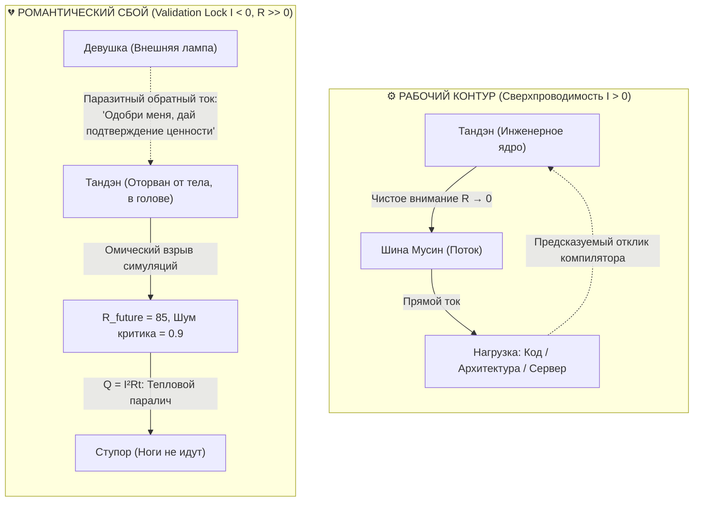
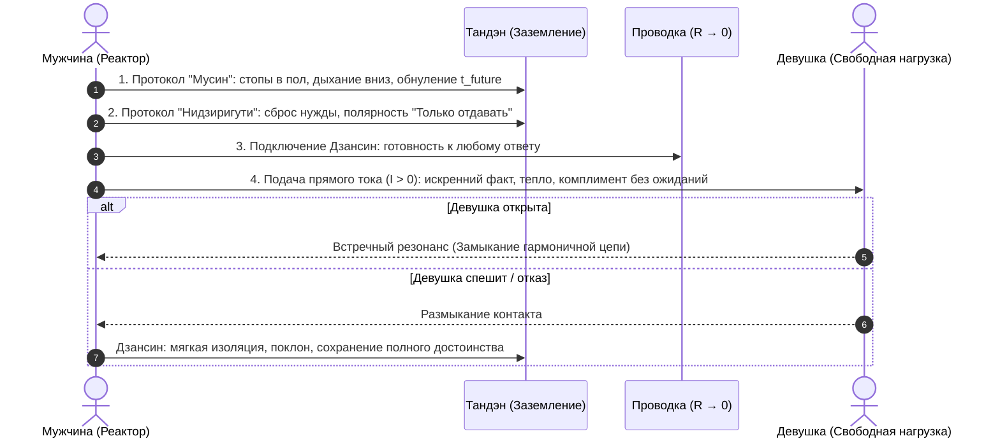

# 09. Кейс-стади: Двойной разлад инженера — «В работе бог, в отношениях аут»

[← К оглавлению](index.md) | [⚡ К мастер-карте (MOC)](../Inner%20Current%20-%20MOC.md) | [🧲 Система Аньянова](08-impression-architecture-and-impedance-matching.md)

---

> [!quote] Архитектурная формулировка проблемы
> *«В работе всё хорошо, я закрываю спринты, поднимаю архитектуры, зарабатываю деньги. А в личной жизни полный аут — парализующий страх подойти к девушке. Почему мой интеллект и воля бессильны?»*

Этот кризис — фундаментальный пример **«Двойного разлада»** в [[08-impression-architecture-and-impedance-matching|Системе Аньянова]]. Инженер привык считать, что страх подхода — это «неуверенность в себе», «травмы детства» или «недостаток пикап-скриптов». 

Но с точки зрения электродинамики человека, это **строго измеримый топологический сбой цепи**, состоящий из четырёх дефектов.

---

## 1. Сравнительная топология двух цепей

Почему один и тот же человек с одним и тем же реактором Тандэн в одном контексте является гигантом, а в другом — замирает в ступоре?



| Параметр | Рабочий контур (IDE / Продукт) | Романтический контур (Сбой) |
| :--- | :--- | :--- |
| **Характер нагрузки** | Детерминированная логика, компилятор | Свободный человек, физическое волновое поле |
| **Направление вектора тока** | **Прямой ток ($I > 0$):** отдача мастерства в код | **Паразитный обратный ток ($I < 0$):** требование валидации |
| **Сопротивление проводки ($R$)** | $R \to 0$ (состояние Мусин, поток задачи) | $R \gg 0$ (катастрофизация исхода, $t_{future}$) |
| **Тепловые потери ($Q = I^2 R t$)** | Минимальны, высокий КПД | Максимальны: парализующий омический перегрев |
| **Ментальный предохранитель** | Дзансин активен: упавший тест — рабочий лог | Отсутствует: отказ воспринимается как гибель ядра |
| **Антенна (Внешний магнетизм)** | Не имеет значения (экран монитора) | Критична (оптика взгляда, силуэт, осанка, запах) |

---

## 2. Анатомия четырёх сбоев

### Сбой 1. Паразитный обратный ток (The Validation Trap, $I < 0$)
Главная причина страха: **инверсия полярности**.
Когда мужчина подходит к девушке с мыслью: *«Понравлюсь ли я ей? Не отвергнет ли она меня? Спасет ли она меня от одиночества?»*, он подходит как **нищий с пустой чашей**, пытаясь сделать из девушки *источник тока*.

> [!important] Физический закон нагрузки
> **Внешняя лампа не имеет встроенного генератора.** Человек напротив не обязан питать чужое эго. Попытка сосать энергию из девушки мгновенно ощущается ею как тяжесть, липкость и нуждаемость. Подсознание самого мужчины понимает фальшь этой цепи и блокирует движение через инстинкт самосохранения.

### Сбой 2. Омический взрыв проекций ($R_{future} \gg 0$)
За 3 секунды до шага мозг инженера, натренированный строить прогнозные модели отказоустойчивости, запускает миллион сценариев краха:
* *«Она нахмурится»*
* *«Люди в кафе посмотрят на меня как на крипа»*
* *«Я забуду слова и заикнусь»*

В проводку врезается паразитная ёмкость будущего ($t_{future} \to \infty$). По закону Джоуля — Ленца ($Q = I^2 R t$), колоссальная энергия намерения сгорает в трении ума. Пульс скачет, горло пережимает, наступает ступор.

### Сбой 3. Рассогласование импедансов и крах Внешнего магнетизма
В коде инженер говорит через абстрактные символы. Перед девушкой взаимодействие идёт через физическое электромагнитное и акустическое поле:
1. **Форма:** осанка, отсутствие суеты в жестах, устойчивый взгляд в глаза (без бегающих зрачков).
2. **Фактура и Цвет:** согласованный гардероб, чистый крой, отсутствие застиранных бесформенных вещей.
3. **Запах:** чистота тела и тонкий, выверенный аромат.

Если «антенна» не настроена, возникает **высокий КСВ (коэффициент стоячей волны)**. Парень чувствует несоответствие своей формы и глубины духа — возникает внутренний стыд и синдром самозванца в собственном теле.

### Сбой 4. Отсутствие предохранителя Дзансин (Circuit Breaker)
Инженер боится отказа, потому что у него нет изолятора. Слово «нет» воспринимается как детонация ядерного заряда внутри Тандэна: *«Меня отвергли — значит, я ничтожество»*. При отсутствии философии [[04-safety-and-antifragility|Ваби-саби]] отказ ломает контур целиком.

---

## 3. Регламент ремонта: Калибровка «Сверхпроводящего знакомства»

Чтобы перевести цепь из аварийного состояния `ERR_02_REVERSE_POLARITY` в оптимальное `OK_00_SUPERCONDUCTING_MUSHIN`, применяется строгий 4-шаговый протокол:



### Шаг 1. Разворот вектора тока: «Я иду отдавать, а не брать» (Нидзиригути)
* Выкиньте из головы мысль взять телефон, затащить на свидание или получить одобрение.
* Цель подхода — **поделиться избытком**. Заметить реальную красоту (улыбку, фактуру шарфа, свет в глазах, пластику) и искренне подарить человеку этот факт реальности.
* Генератор — вы. Вы делитесь светом просто потому, что вы — солнце. Солнце не просит у цветов аплодисментов за то, что оно светит.

### Шаг 2. Аппаратное обнуление сопротивления ($R \to 0$, Мусин)
* **Заземление (Grounding):** Перенесите центр тяжести из головы в стопы. Почувствуйте твёрдость пола. Расслабьте диафрагму и челюсть.
* **Ликвидация симуляций ($t_{future} \to 0$):** Запретите процессору строить прогноз дальше одного физического шага. Нет никакого «потом». Есть только один текущий шаг и звук вашего голоса.

### Шаг 3. Взвод предохранителя Дзансин (Circuit Breaker)
* Заранее примите право другого человека на отказ. Девушка может спешить, у неё может болеть голова, она может любить другого. Это не имеет никакого отношения к вашей ценности.
* Если получен отказ — предохранитель мягко изолирует контакт: доброжелательный взгляд, спокойная улыбка, фраза: *«Хорошего вам дня!»*. Тандэн не теряет ни единого вольта.

### Шаг 4. Настройка согласования импедансов (Внешний магнетизм)
* Наведите порядок в четырёх координатах **Архитектуры впечатления**:
  * Одежда, которая сидит по фигуре и держит каркас.
  * Чистая обувь и ухоженные руки.
  * Фирменный тонкий парфюм.
  * Спокойная, неколебимая осанка.
* Когда внешняя оболочка безупречно собрана, эго перестаёт сомневаться во внешнем виде, и 100% мощности идёт в присутствие.

---

## 4. Телеметрический шаблон в кодовой базе

В кодовой базе проекта этот эталонный переход протестирован и зафиксирован:
* **Тест сбоя:** `tests/diagnostic.engine.test.ts` (тест №8 — `Validation Lock & Ohmic Future Blowout`).
* **Тест калибровки:** `tests/diagnostic.engine.test.ts` (тест №9 — `Calibrated Approach: Zero Resistance Mushin and Zanshin Safety`).
* **Демо-симулятор:** `src/cli/demo.ts` (Сценарии 5 и 6).

```bash
# Запуск демонстрации в терминале:
npm run demo
```

При калибровке сила тока подскакивает с отрицательного ступора $-0.32\text{ А}$ до кристального потока $+22.85\text{ А}$, а эффективное сопротивление падает с $239.59\text{ Ом}$ до сверхпроводящих $1.72\text{ Ом}$. 

Это и есть инженерный переход от страха к подлинному мужскому достоинству и магнетизму.
