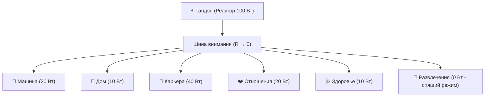

# 10. Релятивизм счастья и инвариантная физика цепи: разбор тезиса «Счастье у каждого своё»

[← К оглавлению](index.md) | [⚡ К мастер-карте (MOC)](../Inner%20Current%20-%20MOC.md) | [⚖️ Математика гармонии](05-mathematics-of-harmony-and-synthesis.md)

---

> [!quote] Типовое критическое возражение
> *«Счастье у каждого своё: монах счастлив в пещере, миллиардер — на яхте, а программист — за экраном. Нельзя свести человеческую душу к единой схеме. Поэтому никакая инженерная система счастья работать не может».*

Это возражение — самое частое при первом знакомстве с [[08-impression-architecture-and-impedance-matching|Системой Аньянова]] и контуром [[01-core-topology|«Внутренний ток»]]. Оно звучит убедительно лишь до тех пор, пока человек смешивает два принципиально разных уровня реальности: **тип подключенного прибора (потребитель)** и **фундаментальные законы электрического тока (физика цепи)**.

---

## 1. Анатомия ошибки: подмена Потребителя и Электродинамики

Люди, заявляющие «счастье у каждого своё», совершают методологическую ошибку категории. Они смотрят на **витрину приборов** вместо **законов движения энергии**.

### Главная аналогия: Электросеть и Приборы
В домашнюю розетку 220 В можно включить:
* Чайник или кофемашину;
* Профессиональный гитарный комбоусилитель;
* Высокопроизводительный сервер вычислений ИИ;
* Медицинский аппарат искусственной вентиляции легких.

Назначение, форма, эстетика и звуки этих приборов **абсолютно разные**. То, какой прибор выбрать — дело личного призвания, вкуса и жизненной стадии.

Но **физика цепи неизменна для всех**:
* Если сечение проводки занижено — кабель начнет плавиться;
* Если в цепи возникло короткое замыкание на себя (петля Эго) — сгорит управляющая плата;
* Если на линии короткое замыкание без автоматического выключателя ([[04-safety-and-antifragility|Circuit Breaker]]) — сгорит вся квартира;
* Если окислились контакты ($R \gg 0$) — прибор не получит полезной мощности, а энергия выделится в виде паразитного нагрева.

> [!important] Формула разграничения
> **Система «Внутренний ток» не навязывает вам прибор. Она гарантирует чистоту тока и исправность проводки.** Какую музыку играть через исправный динамик — решает сам человек.

---

## 2. Три объективных закона цепи, не зависящих от личности

Субъективность человеческих ценностей не отменяет объективности термодинамики и электродинамики нервной системы.

### Закон 1. Омический перегрев сознания (Закон Джоуля — Ленца)
$$Q = I^2 \cdot R \cdot t$$
Не существует на Земле человека (какой бы уникальной ни была его душа), который мог бы часами крутить в голове страх оценки, вину за прошлое и катастрофизацию будущего ($R_{ego} \gg 0$), пропуская через это мощный ток намерения ($I$), и при этом **не выгореть**.

* **Вне системы:** человек говорит «я эмоционально истощен, у меня депрессия, мир ко мне несправедлив».
* **В системе цепи:** в цепь включено гигантское виртуальное сопротивление $R$. Вся мощность реактора уходит не в полезную работу на нагрузке ($P_{load}$), а в рассеивание тепла $Q$. Это не «особенность характера», это термический ожог проводки.

### Закон 2. Однонаправленность полярности и тупик замыкания на Эго
$$\text{Тандэн (Реактор)} \xrightarrow{\quad I > 0 \quad} \text{Лампочка (Мир / Проект / Люди)}$$
Ни один человек в истории не обрел устойчивого покоя, пытаясь зарядить внутренний реактор от внешней лампочки (чужой похвалы, аплодисментов, баланса на счете или лайков в соцсетях).

* Лампочка — это пассивный диссипативный резистор ($R$), в ней **нет собственной ЭДС ($\mathcal{E}_{\text{load}} \equiv 0$)** и она не задерживает заряда ($I_{\text{in}} = I_{\text{out}}$). Она пуста (Шуньята).
* Попытка сделать источник из нагрузки срывает внимание в паразитное Короткое Замыкание на Эго ($I_{\text{КЗ}} = \mathcal{E}/r_{\text{internal}}$), сжигая нервную систему в омическом перегреве мыслей о себе (см. [09. Кейс-стади: Двойной разлад инженера](file:///c:/Users/vanya/Antigravity%20Projects/Apps/Inner%20Current/wiki/09-case-study-engineer-romance-approach.md)). Это инвариантно для сантехника, монаха и миллиардера.

### Закон 3. Баланс мощности Кирхгофа на 6 Главных лампочках
$$P_{total} = P_{CAR} + P_{HOME} + P_{CAREER} + P_{RELATIONSHIPS} + P_{HEALTH} + P_{ENTERTAINMENT}$$
Человеческий организм обладает конечной номинальной мощностью $P_{total}$. 
* Попытка выкрутить все 6 каналов на 100% одновременно неминуемо вызовет **просадку напряжения (Undervoltage)** у любого живого существа.
* Полное обесточивание канала `HEALTH` (0 Вт) в угоду `CAREER` приводит к физическому выходу генератора из строя.

---

## 3. Физическое определение счастья: Сверхпроводимость

Когда оппонент говорит «у каждого счастье своё», он говорит об **объекте созерцания или деятельности**. Но само **состояние переживания счастья** нейрофизиологически и топологически одинаково у всех представителей вида *Homo Sapiens*.

| Параметр | Состояние несчастья / трения | Состояние счастья / потока (Мусин) |
| :--- | :--- | :--- |
| **Сопротивление цепи** | $R \gg 0$ (колоссальное ментальное трение) | $R \to 0$ (**Сверхпроводимость**) |
| **Временная локализация** | В симуляциях $L_{past}$ (вина) и $C_{future}$ (тревога) | Строго в физической точке $t = \text{now}$ |
| **Работа внутреннего критика** | Максимальный паразитный шум сигнальной петли | Полная тишина рефлексии (чистый сигнал) |
| **Вектор энергии** | Замкнут на Эго ($I_{\text{load}} = 0$, внутреннее КЗ) | Прямой ($I > 0$, чистое излияние в действие) |
| **Субъективное чувство** | Сдавленность, усталость, холод, тупик | Легкость, кристальная ясность, наполненность |

> [!tip] Научное определение счастья в Системе Аньянова
> **Счастье** — это субъективное переживание режима нулевого сопротивления цепи ($R \to 0$), при котором ток намерения беспрепятственно переходит в чистое действие в точке настоящего момента.

---

## 4. Как система защищает индивидуальность человека

Система «Внутренний ток» не тоталитарна — она предельно персонализирована благодаря архитектуре **параллельного щита нагрузки**:

1. **У каждого своя комбинация горящих ламп:** Монах подает 90 Вт в созерцание и 10 Вт в скудную пищу. Семейный человек распределяет мощность в `HOME` и `RELATIONSHIPS`. Предприниматель на этапе запуска фокусируется на `CAREER`. Система не требует одинаковости — она требует **соблюдения баланса и отсутствия паразитных потерь на нагрев**.
2. **Уважение к масштабу:** Согласно [[03-scale-invariance-and-tea-ceremony|инвариантности масштаба]], чашка зеленого чая калибрует контур точно так же, как управление заводом. Система не ранжирует людей по высоте нагрузки — она оценивает проводимость цепи.

---

## 5. Алгоритм инженерного ответа критику («Шпаргалка созидателя»)

Если вам говорят: *«Счастье у каждого свое, твоя система не работает»*, используйте следующий пошаговый протокол:

1. **Шаг 1. Согласие на уровне потребителя (Валидация):**
   > *«Ты совершенно прав: то, ЧТО приносит радость — у каждого свое. Один счастлив, выращивая яблони, другой — проектируя микрочипы, третий — воспитывая детей».*
2. **Шаг 2. Разделение Прибора и Электросети:**
   > *«Но моя система говорит не о том, какую лампочку тебе зажечь. Она говорит о том, КАК устроена электрическая проводка твоего внимания».*
3. **Шаг 3. Вопрос на объективную проверку аварии:**
   > *«Скажи, если человек делает свое любимое дело, но каждую секунду панически боится, что скажут в комментариях (замыкание на Эго), и прокручивает в голове прошлые неудачи (паразитное омическое сопротивление), будет ли он счастлив?»*
4. **Шаг 4. Фиксация инварианта:**
   > *«Нет, он сгорит. И это произойдет независимо от его убеждений, знака зодиака или профессии. Законы цепи одинаковы для всех. Моя система не выбирает за тебя музыку — она чинит провод, чтобы динамик не хрипел».*

---

## 🔗 Связанные статьи базы знаний
* [[01-core-topology|01. Базовая топология цепи и закон полярности]] — закон Кирхгофа и баланс ламп.
* [[02-superconductivity-and-presence|02. Физика присутствия: состояние сверхпроводимости]] — математика закона Джоуля — Ленца.
* [[03-scale-invariance-and-tea-ceremony|03. Инвариантность масштаба нагрузки: от чая до империи]] — независимость физики цепи от масштаба дела.
* [[05-mathematics-of-harmony-and-synthesis|05. Синтез физики и духа: математика гармонии]] — принцип независимой сходимости (Consilience).
* [[07-nature-and-illusion-of-ego|07. Природа и иллюзия эго: демистификация мировых религий]] — почему эго работает как паразитный реостат.
