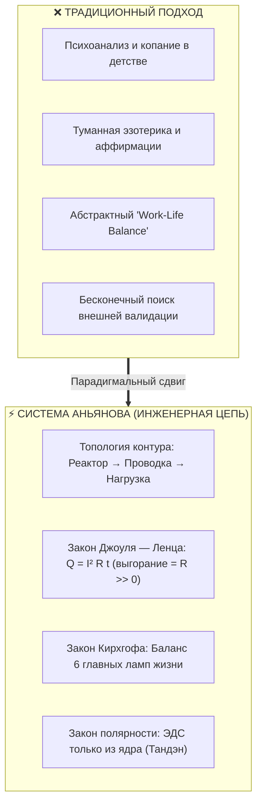

# 11. Архитектурная новизна и практическая польза Системы Аньянова

[← К оглавлению](index.md) | [⚡ К мастер-карте (MOC)](../Inner%20Current%20-%20MOC.md) | [⚖️ Физика цепи vs Релятивизм](10-happiness-relativity-vs-circuit-invariance.md)

---

> [!abstract] Квинтэссенция системы
> **«Система Аньянова» (Anyanov System)** и её ключевой вычислительный контур **«Внутренний ток» (Inner Current)** — это прикладная инженерная онтология человеческого благополучия и устойчивости. Проект совершает синтез строгой электродинамики, дзенской практики прямого действия, античного стоицизма и работающего программного обеспечения. Душевный разлад выводится из тупика мистических метафор в плоскость **инженерного анализа цепи**, доступного для диагностики, алгоритмической отладки и объективного ремонта.

---

## 🔬 1. В чём принципиальная новизна (Innovation & Architectural Novelty)

### 1.1. Смена парадигмы: от абстрактной психотерапии к электродинамике человека
* **Как было раньше:** Человек сталкивается с выгоранием, тревогой или синдромом самозванца и погружается в бесконечные «раскопки детских травм», туманную эзотерику или бесполезные аффирмации.
* **Как делает система:** Душевный разлад переводится из плоскости экзистенциальной драмы в плоскость **инженерного сбоя цепи**. Вместо расплывчатого «почему мне плохо?» система задает четкие вопросы:
  * Где возникло паразитное омическое сопротивление ($R \gg 0$)?
  * Не возник ли обратный ток ($I < 0$)?
  * Сработал ли предохранитель цепи ([[04-safety-and-antifragility|Circuit Breaker]])?
  * Не перегружен ли многоканальный щит мощности?

### 1.2. Демистификация мировых практик через физические законы
Многовековые духовные интуиции человечества очищены от мистического тумана и сформулированы как измеримые технические законы:
* **«Быть в моменте» (Мусин / 無心) = Сверхпроводимость ($R \to 0$):** По [[02-superconductivity-and-presence|закону Джоуля — Ленца]] ($Q = I^2 R t$) человек выгорает не от силы тока созидания ($I$), а от омического трения ($R$) — паразитных индуктивностей прошлого (вина, сожаления) и ёмкостей будущего (тревога, катастрофизация). В точке «сейчас» сопротивление стремится к нулю, и потерь мощности нет.
* **Дзансин (残心) = Ментальный Circuit Breaker:** Изоляция ядра при аварии внешней нагрузки.
* **Ваби-саби / Кинцуги = Антихрупкость:** Не трагедия крушения, а золотой шов опыта на чаше контура.
* **Нидзиригути = Шунтирование эго:** Принудительный сброс социального статуса на входе для чистого замыкания цепи.

### 1.3. Закон полярности и автономного реактора (Тандэн)
Строгое доказательство тупика погони за внешней валидацией:
$$\text{Тандэн (Генератор ЭДС)} \xrightarrow{\quad \text{Внимание} \quad} \text{Лампочка (Нагрузка / Внешний мир)}$$
Внешняя лампочка (деньги, лайки, похвала, одобрение партнеров) — это **пассивный потребитель**, в ней физически нет генератора! Попытка «запитать себя от лампочки» разворачивает ток ($I < 0$), глушит станцию и плавит проводку внимания.

### 1.4. Инвариантность масштаба (Scale Invariance)
Законы цепи идентичны для светодиода чашки чая и для мегаваттной корпорации ([[03-scale-invariance-and-tea-ceremony|Статья 03]]). Японская чайная традиция (Тяною) в системе выступает **калибровочным полигоном нулевого сопротивления**. Не научившись держать $R=0$ на простом физическом действии, созидатель гарантированно сожжёт проводку на стартапе или масштабировании.

### 1.5. Закон сохранения мощности Кирхгофа: 6 Главных лампочек жизни
Вместо абстрактного "work-life balance" введен **параллельный щит распределения мощности**:
1. 🚗 **Машина** (`CAR`) — мобильность, динамика, пространственная автономия;
2. 🏡 **Дом** (`HOME`) — очаг, физическая крепость, база безопасности;
3. 💼 **Карьера** (`CAREER`) — созидательное ремесло, масштаб и влияние;
4. ❤️ **Отношения** (`RELATIONSHIPS`) — любовь, близость, глубокий резонанс с другими сознаниями;
5. 🩺 **Здоровье** (`HEALTH`) — физический скафандр, биохимия, запас витальности;
6. 🎉 **Развлечения** (`ENTERTAINMENT`) — игра, свежий дофамин, гедонизм и радость бытия.

Закон мощности ($P_{total} = \sum P_i$) нагляден: одновременная попытка выкрутить все 6 ламп на 100% вызывает просадку напряжения (Undervoltage), а обнуление ветки «Здоровье» ради «Карьеры» разрушает саму электростанцию.

### 1.6. Зонтичная мета-система (Внутренний ток + Внешний магнетизм)
Преодоление главного раскола созидателя: «бог внутри — но запущенный и потухший снаружи» или «идеальная картинка снаружи — но пустота внутри». 
* **Внутренний ток** создает ядро, энергию и прорывной продукт.
* **Внешний магнетизм** ([[08-impression-architecture-and-impedance-matching|Статья 08]]) через квадро-согласование (Форма, Фактура, Цвет, Запах) формирует силовое поле притяжения в социуме. Ток внутри по закону Максвелла порождает магнитное поле снаружи.

---

## 🛠️ 2. В чём практическая польза (Real-World Value)

| Целевая аудитория | Проблема до системы | Результат применения Системы Аньянова |
| :--- | :--- | :--- |
| **Инженеры и разработчики** | Аналитический паралич, синдром самозванца, эмоциональный ступор при общении. | **Сброс паразитных вычислений.** Понимание, что страх — это омический нагрев симуляций $R_{future} \gg 0$. Алгоритмический переход в режим Мусин ($R \to 0$). |
| **Основатели и предприниматели** | Коллапс самооценки и тяжелая депрессия при падении метрик или срыве инвестиций. | **Антихрупкость через Circuit Breaker.** Четкое разделение личности фаундера и внешней нагрузки. При аварии проекта предохранитель изолирует ядро, сохраняя 100% мощности, включается протокол Кинцуги. |
| **Творцы и созидатели** | Зависимость от похвалы, страх критики, прокрастинация и ступор чистого листа. | **Ликвидация обратного тока ($I < 0$).** Ток направляется наружу в ремесло, а не внутрь в ожидание поглаживаний. |
| **Личные отношения и социум** *(Кейс #09)* | Скованность, страх подойти к девушке, фальшь, попытки понравиться и заслужить одобрение. | **Прямой ток и согласование импедансов.** Общение без выпрашивания энергии, спокойная сила физического присутствия, естественный магнетизм достоинства. |

---

## 💻 3. Главное технологическое преимущество: система исполняема в коде!

Большинство концепций личностного роста остаются набором красивых цитат и метафор. **Уникальность системы в том, что она переведена в работающий софтверный стек:**

* **Строгая модель доменных типов:** [`circuit.types.ts`](file:///c:/Users/vanya/Antigravity%20Projects/Apps/Inner%20Current/src/types/circuit.types.ts) — формализованы интерфейсы `TandenCore`, `ConductanceBus`, `LoadNode`, статусы `CircuitStatus`, `BreakerStatus`.
* **Расчетный диагностический движок:** [`diagnostic.engine.ts`](file:///c:/Users/vanya/Antigravity%20Projects/Apps/Inner%20Current/src/core/diagnostic.engine.ts) — алгоритмическое выявление аварийных кодов (01–04) на основе математических соотношений $I$, $R$, $P$ и $Q$.
* **Протоколы восстановления:** [`remediation.protocols.ts`](file:///c:/Users/vanya/Antigravity%20Projects/Apps/Inner%20Current/src/core/remediation.protocols.ts) — пошаговые сценарии ремонта цепи (Мусин, Нидзиригути, Кинцуги, Микронагрузка).
* **Автоматические инженерные тесты:** 100% покрытие базовых законов электродинамики человека юнит-тестами Node.js test runner со скоростью исполнения < 4 мс.
* **Интерактивный дашборд:** SVG-визуализация цепи в реальном времени с интерактивным щитом 6 нагрузок.

---

## 🎯 4. Резюме

> [!tip] Архитектурный вывод
> **Новизна системы** — в создании **строгой инженерной онтологии человеческого счастья**, где субъективные состояния переведены в строгие законы физики, демистифицированы и алгоритмизированы.  
> 
> **Польза системы** — в **мгновенной диагностике и повторяемом ремонте**. Вместо месяцев слепого самокопания человек получает приборную панель своего состояния, видит точное место пробоя изоляции или обратного тока и активирует нужный протокол восстановления.

---

## 🔗 Связанные статьи базы знаний
* [[01-core-topology|01. Базовая топология цепи и закон полярности]] — контур и 6 главных ламп.
* [[02-superconductivity-and-presence|02. Физика присутствия: состояние сверхпроводимости]] — закон Джоуля — Ленца.
* [[06-diagnostic-machine|06. Машина для диагностики счастья]] — инженерная спецификация движка.
* [[08-impression-architecture-and-impedance-matching|08. Система Аньянова: Внутренний ток и Внешний магнетизм]] — зонтичная мета-система.
* [[10-happiness-relativity-vs-circuit-invariance|10. Релятивизм счастья и инвариантная физика цепи]] — разбор тезиса «счастье у каждого свое».
