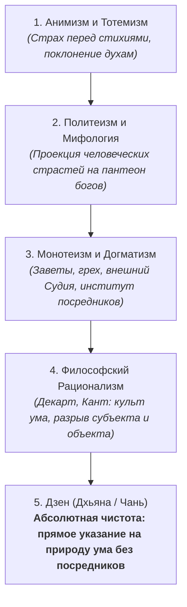
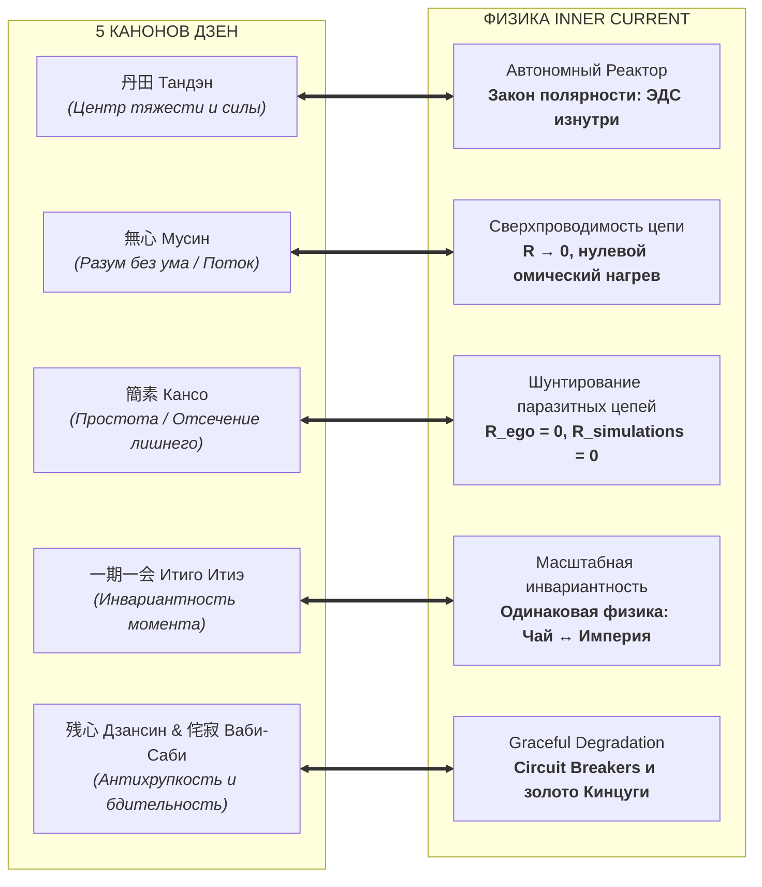

# 12. Дзен как фундамент Архитектуры счастья: инженерная демистификация высшего духа человечества

[← К оглавлению](index.md) | [⚡ К мастер-карте (MOC)](../Inner%20Current%20-%20MOC.md) | [💎 Архитектурная новизна и польза](11-novelty-and-value-proposition.md)

---

> [!abstract] Квинтэссенция главы
> **Дзен** — это исторический апогей эволюции человеческого духа: учение, полностью очищенное от догматов, жреческих посредников, внешних культов и антропоморфных иллюзий. Это технология прямого контакта сознания с реальностью. 
> 
> Главный барьер Дзен в XXI веке заключался в его традиционной герметичности (коаны, поэтические парадоксы, монашеский контекст). **«Архитектура счастья» (Система Аньянова / Inner Current)** совершает ключевой исторический шаг: **переводит Дзен на язык точной инженерной физики цепей**, превращая духовное озарение в воспроизводимую инженерную топологию сверхпроводимости ($R \to 0$), автономной генерации мощности (Тандэн) и абсолютной надежности контура (Дзансин).

---

## 🏔️ 1. Почему Дзен — наивысшая вершина развития человеческого духа

На протяжении тысячелетий духовный поиск человечества проходил через несколько стадий:



### В чём качественное превосходство Дзен?
1. **Никаких богов-посредников:** Дзен не требует верить в загробный суд, мифических существ или сакральные тексты. Реальность проверяется здесь и сейчас собственным прямым опытом.
2. **Отказ от ментальных костылей («Палец, указывающий на Луну»):** Любые слова, книги и доктрины — лишь указатели. Истинный Дзен требует не рассуждать о воде, а пить её; не рассуждать о покое, а войти в сверхпроводимость.
3. **Отсутствие чувства вины и первородного греха:** В Дзен человек изначально совершенен по своей природе (*Природа Будды / Чистый ток*). Страдание возникает исключительно из-за искусственного наслоения иллюзий, цепляния за фантомы и ментального трения ($R_{ego} > 0$).
4. **Неразрывность созидания и духа:** Дзен никогда не был пассивным бегством от мира. Он закалялся в стрельбе из лука (*Кюдо*), фехтовании (*Кэндо*), каллиграфии (*Сёдо*), садово-парковом искусстве и приготовлении пищи. Это **философия действия высочайшей точности**.

---

## ⚡ 2. Проблема классического Дзен и инженерный мост XXI века

Несмотря на величие Дзен, до сегодняшнего дня он оставался труднодоступным для современного созидателя, инженера и предпринимателя по двум причинам:

1. **Язык парадоксов и коанов:** Ответы вроде «Хлопок одной ладони» или «Кипарис перед домом» прекрасны для дзэнского мастера, но вызывают ступор у рационального человека, привыкшего к причинно-следственным связям.
2. **Ложная ассоциация с эскапизмом:** Обыватель часто путает Дзен с медитацией на коврике, отказом от амбиций и бедностью, не понимая, что исторический Дзен воспитывал стальную волю самураев и несравненное мастерство созидания.

### Мост Системы Аньянова: перевод метафор в законы электродинамики
**«Архитектура счастья»** не спорит с традицией, а дает ей **строгий физический изоморфизм**:

$$\text{Просветление (Сатори / Кэнсё)} \iff \text{Переход контура внимания в режим сверхпроводимости } (R \to 0)$$

$$\text{Ментальное страдание (Дуккха)} \iff \text{Омический нагрев проводника по закону Джоуля — Ленца } (Q = I^2 R t)$$

---

## 🏛️ 3. Пять канонов Дзен как несущие стены Архитектуры счастья



### 1. Тандэн (丹田) — Закон полярности и автономная ЭДС
* **В Дзене:** Нижний энергетический центр (*Хара*), находящийся на три пальца ниже пупка. Источник физического равновесия и внутренней несгибаемой устойчивости. Мастер дышит животом и черпает силу из глубинного покоя, не завися от внешних обстоятельств.
* **В Архитектуре счастья:** **Генератор базовой ЭДС (Реактор)**. Принципиальный отказ от попыток зарядить свой аккумулятор от внешних лампочек (машин, карьеры, похвалы окружающих). Счастье — это ток, идущий **изнутри наружу**:
  $$I_{out} = \frac{\mathcal{E}_{tanden}}{R_{circuit}}$$
  Попытка сделать источник из нагрузки рождает аварийный режим короткого замыкания на Эго ($I_{\text{КЗ}} = \mathcal{E}/r_{\text{int}}$), сжигая внимание в мыслях о себе и приводя к истощению.

### 2. Мусин (無心) — Физика сверхпроводимости ($R \to 0$)
* **В Дзене:** Состояние «не-ума». По определению мастера дзэн Такуана Сохо (в наставлениях фехтовальщикам), если мечника посещает хоть одна мысль («я должен победить», «он сильнее меня», «как бы не ошибиться»), его клинок застревает, и он погибает. Сознание должно течь, как вода, отражая всё и не удерживая ничего.
* **В Архитектуре счастья:** Точное физическое равенство **$R \to 0$**. 
  Выгорание, страх, депрессия и синдром самозванца — это не свойства души, а омическое сопротивление проводника внимания. Когда $R > 0$, вся колоссальная мощность ядерного реактора Тандэн уходит в тепловой перегрев по закону Джоуля — Ленца:
  $$Q = I^2 R t$$
  В режиме **Мусин** сопротивление падает до нуля: ток внимания течет прямо в действие, КПД равен 100%, перегрев отсутствует.

### 3. Кансо (簡素) — Шунтирование эго и отсечение «стилусов»
* **В Дзене:** Эстетика и практика суровой чистоты. Никаких лишних орнаментов, фальшивых статусов и ментального мусора. Избавление от привязанности к фиктивному «я».
* **В Архитектуре счастья:** **Аппаратное шунтирование паразитного реостата эго ($R_{ego}$)**. 
  Эго — это паразитный программный демон, непрерывно запускающий ресурсоемкие симуляции в прошлом ($R_{past}$) и будущем ($R_{future}$). Кансо — это сброс всех паразитных потоков процесса (Kill Process) и фокусировка внимания только на том объекте, который реально присутствует в точке $t = now$.

### 4. Итиго Итиэ (一期一会) — Инвариантность масштаба цепи
* **В Дзене:** «Один момент — одна встреча». Каждое действие уникально и неповторимо. Заваривание чая, протирание пола или разговор с путником равны по глубине управлению государством.
* **В Архитектуре счастья:** **Масштабная инвариантность контура**.
  Законы электродинамики ($U = I R$, $P = U I$) инвариантны к масштабу нагрузки. Если человек не способен удержать сверхпроводимость при заваривании чашки чая ($P = 15\text{ Вт}$), он неизбежно сгорит при подаче напряжения на мегаваттную нагрузку корпорации ($P = 1\,000\,000\text{ Вт}$). Чайная церемония — это калибровочный полигон контура.

### 5. Дзансин (残心) и Ваби-Саби (侘寂) — Антихрупкость и предохранители
* **В Дзене:** 
  * *Дзансин* — «сохраняющийся ум», бдительное спокойствие после удара мечом или выстрела из лука.
  * *Ваби-саби* и *Кинцуги* — благородство стареющего, несовершенного и прошедшего через бури. Разбитая чашка склеивается золотым лаком, становясь прочнее и драгоценнее новой.
* **В Архитектуре счастья:** **Психологические автоматические выключатели (Circuit Breakers)** и абсолютная антихрупкость. 
  Внешняя нагрузка (бизнес, проект, отношения) может сломаться или сгореть. Но благодаря предохранителю Дзансин, отказ внешней лампочки не пробивает реактор Тандэн. А шрамы и неудачи, отрефлексированные через протокол Кинцуги, становятся золотой изоляцией цепи.

---

## 📊 4. Сводная матрица: Дзен ↔ Физика ↔ Код Системы

| Канон Дзен | Духовный смысл | Физический эквивалент | Реализация в коде (`Inner Current`) |
| :--- | :--- | :--- | :--- |
| **Тандэн (丹田)** | Опора на внутренний центр | Первичный источник ЭДС ($\mathcal{E}$) | `TandenReactor.generatePower()` |
| **Мусин (無心)** | Действие без ментального трения | Сверхпроводимость ($R \to 0$) | `SuperconductivityState.isZeroResistance()` |
| **Кансо (簡素)** | Чистота, отсечение иллюзий | Шунтирование паразитных утечек | `CircuitDebugger.bypassEgoResistor()` |
| **Итиго Итиэ (一期一会)** | Священность текущего мига | Инвариантность $P(t)$ в точке $t=now$ | `LoadScaler.calibrate(Scale.TEA)` |
| **Дзансин (残心)** | Непрерывная бдительность | Автоматический предохранитель (Fuse) | `SafetyCircuitBreaker.tripOnOverload()` |
| **Кинцуги (金継ぎ)** | Золото в шрамах опыта | Антихрупкая закалка проводки | `AntifragileAudit.applyGoldPatch()` |

---

## 💡 5. Архитектура счастья: почему это прикладной инструмент, а не абстракция

Дзен в своем чистом виде совершенен, но исторически он требовал десятилетий сидения лицом к стене в монастырях Эйхэйдзи или Дайтокудзи.

Строя **Архитектуру счастья на принципах Дзен**, созидатель получает:

1. **Мгновенную приборную диагностику:** Вместо мучительного вопроса «Достаточно ли я духовен?» человек проверяет:
   * «Куда течет ток прямо сейчас?»
   * «Не греется ли проводка на страхе перед будущим?»
   * «Не отключил ли я канал Здоровья ради Карьеры?»
2. **Алгоритмы устранения аварий:** Если цепь искрит, не нужно «верить» — нужно применить инженерный протокол: сбросить избыточную нагрузку, зашунтировать $R_{ego}$ и вернуть внимание в $t = now$.
3. **Гармонизацию внутреннего и внешнего:** Соединение чистоты Дзен внутри (**Внутренний ток**) с безупречностью формы, фактуры, цвета и аромата снаружи (**Внешний магнетизм** Системы Аньянова).

---

## ⛩️ Кодекс Дзен-инженера (Ежедневная калибровка контура)

```
1. ТАНДЭН: Моё счастье рождается внутри. Я не выпрашиваю ток у внешних приборов.
2. МУСИН: В точке «сейчас» нет сопротивления. Я созидаю легко, без трения и страха.
3. КАНСО: Я безжалостно отсекаю паразитные вкладки ума, пустые симуляции и эго.
4. ИТИГО ИТИЭ: Каждое малое действие я совершаю с тем же величием духа, что и великое.
5. ДЗАНСИН: Когда задача завершена, моё ядро сохраняет покой, бдительность и целостность.
```

---

[← Назад: Архитектурная новизна и польза](11-novelty-and-value-proposition.md) | [Вперед: К оглавлению Wiki →](index.md)
