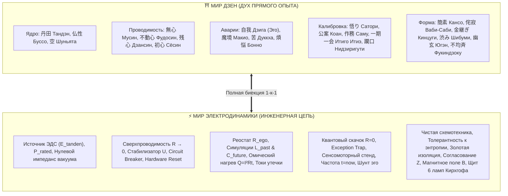

# 13. Полный онтологический атлас: Изоморфизм Дзен и Архитектуры счастья (Биекция 23 канонов Дзен и законов электродинамики)

[← К оглавлению](index.md) | [⚡ К мастер-карте (MOC)](../Inner%20Current%20-%20MOC.md) | [⛩️ Дзен как фундамент Архитектуры счастья](12-zen-as-happiness-architecture-foundation.md)

---

> [!abstract] Архитектурная цель Атласа
> Настоящий документ фиксирует **полную математическую и концептуальную биекцию ($f: \text{Zen} \longleftrightarrow \text{Circuit}$)** между 23 ключевыми категориями классического Дзен (Чань, японское будо, тяною) и физико-инженерными законами системы **«Внутренний ток» (Inner Current)** и зонтичной мета-системы **«Система Аньянова»**.
>
> Каждое духовное состояние Дзен получает измеримый физический эквивалент, строгое математическое уравнение и строчку исполняемого кода в архитектуре приложения.

---

## 🏛️ УРОВЕНЬ I. Ядро и Источник бытия (The Source)

### 1. Тандэн / Хара (丹田 / 腹) $\longleftrightarrow$ Первичный автономный ядерный реактор ЭДС ($\mathcal{E}$)
* **В Дзене:** Нижний даньтянь (три пальца ниже пупка) — физический и духовный центр равновесия, точка покоя, из которой берет начало брюшное дыхание мастера. В традиции Будо победа куется в Тандэне: пока центр тяжести внизу, воина невозможно сбить с ног.
* **В физике цепи:** Первичный источник электродвижущей силы ($\mathcal{E}_{tanden}$). Закон полярности: напряжение генерируется исключительно внутри контура.
* **Математика:**
  $$I = \frac{\mathcal{E}_{tanden}}{R_{internal} + R_{load}}$$
* **В коде:** `TandenReactor.generatePower()` генерирует базовый ток независимо от внешних сигналов.

### 2. Хонсё / Буссо (本性 / 仏性) $\longleftrightarrow$ Номинальная проектная мощность контура ($P_{rated}$)
* **В Дзене:** «Природа Будды» — изначальная безупречность и просветленность сознания каждого живого существа. Человеку не нужно «становиться Буддой» с нуля — нужно лишь счистить слой пыли, скрывающий сияние природы ума.
* **В физике цепи:** Номинальная проектная мощность цепи ($P_{rated} = 100\text{ Вт}$) и чистый гармонический сигнал. Человек спроектирован функциональным и сверхпроводящим по умолчанию; патологии возникают лишь из-за внешних наслоений окислов.
* **В коде:** `core.nominalPower = 100`.

### 3. Шуньята / Ку (空) $\longleftrightarrow$ Нулевой импеданс вакуума и свободная пропускная способность ($Z_0$)
* **В Дзене:** Великая Пустота, лежащая в основе всех явлений («Форма есть пустота, пустота есть форма»). Сознание, очищенное от фиксаций на понятиях, способно вместить в себя любую форму мира, не цепляясь за неё.
* **В физике цепи:** Свободный объем канала передачи; отсутствие паразитной распределенной емкости ($C=0$) и индуктивности ($L=0$), позволяющее электромагнитной волне распространяться со скоростью света без фазовых задержек.
* **В коде:** `bus.freeCapacity = 1.0`.

---

## ⚡ УРОВЕНЬ II. Проводимость внимания и Динамика тока (The Conduction)

### 4. Мусин (無心) $\longleftrightarrow$ Сверхпроводимость проводника ($R \to 0$)
* **В Дзене:** «Разум без ума». Мечник не думает о мече, о враге или о победе. Его внимание течет непрерывным потоком, мгновенно адаптируясь к любому выпаду противника без задержки на рефлексию.
* **В физике цепи:** Физическое состояние сверхпроводимости при криогенной температуре шума: омическое сопротивление проводника падает строго до нуля ($R \to 0$).
* **Математика (Закон Джоуля — Ленца):**
  $$Q = I^2 \cdot R \cdot t \implies \text{При } R = 0, \quad Q = 0$$
  Энергия внимания не выделяет тепла в виде невроза, раздражения и выгорания, а на 100% переходит в созидательную работу на нагрузке.
* **В коде:** `SuperconductivityState.isActive()`.

### 5. Фудосин (不動心) $\longleftrightarrow$ Стабилизатор опорного напряжения и гальваническая развязка
* **В Дзене:** «Неподвижный ум». Ум, который не колеблется от похвалы или хулы, от угрозы смерти или триумфа. Это не тупость или бесчувственность, а абсолютная динамическая стабильность центра тяжести.
* **В физике цепи:** Прецизионный стабилизатор опорного напряжения цепи с защитой от бросков тока и гальванической изоляцией ядра от помех внешней сети.
* **В коде:** `VoltageRegulator.clamp(spike)`.

### 6. Дзансин (残心) $\longleftrightarrow$ Автоматический выключатель цепи (Circuit Breaker)
* **В Дзене:** «Остающийся ум». Состояние непрерывной собранности после выстрела из лука или нанесения решающего удара. Мастер не празднует победу и не расслабляется — дух сохраняет бдительный покой.
* **В физике цепи:** Высокоскоростной автоматический выключатель (Circuit Breaker) и архитектура мягкой деградации (Graceful Degradation). Если внешняя лампа лопнет или закоротит, ментальный изолятор отсекает аварийный участок, сохраняя 100% мощности ядра.
* **В коде:** `SafetyCircuitBreaker.tripOnOverload()`.

### 7. Сёсин (初心) $\longleftrightarrow$ Аппаратный сброс (Hardware Reset) и очистка контактов
* **В Дзене:** «Ум новичка» (Сюнрю Судзуки: *«В уме новичка содержится множество возможностей, в уме знатока — лишь несколько»*). Способность подходить к знакомой задаче так, будто видишь её впервые в жизни.
* **В физике цепи:** Сброс энергонезависимой памяти ошибок (Clear Fault Log), ультразвуковая очистка окислившихся контактов реле и запуск системы с чистой тактовой частоты.
* **В коде:** `CircuitDebugger.hardwareReset()`.

### 8. Дзикисининсин (直指人心) $\longleftrightarrow$ Прямой гальванический контакт без посредников
* **В Дзене:** Базовый лозунг школы Бодхидхармы: «Особое учение вне священных текстов, не опирающееся на слова и буквы, прямое указание на человеческий ум».
* **В физике цепи:** Прямой шинный проводник без паразитных трансформаторных развязок, промежуточных преобразователей и лишних слоев абстракций.
* **В коде:** `DirectBusConnection`.

---

## 🛑 УРОВЕНЬ III. Ментальные сбои и Аварии цепи (Failures & Faults)

### 9. Дзига (自我) / Эго $\longleftrightarrow$ Паразитная петля КЗ и иллюзия внешнего источника
* **В Дзене:** Иллюзорное представление о существовании обособленного автономного «Я». Цепляние за концепцию собственной важности, требующее постоянной внешней валидации.
* **В физике цепи:** Паразитная внутренняя петля рефлексии. Внимание не идёт наружу в нагрузку, а замыкается накоротко на эго ($I_{\text{КЗ}} = \mathcal{E}/r_{\text{int}}$), раскаляя проводку докрасна ($Q = I_{\text{КЗ}}^2 r t$) и обесточивая внешнее дело.
* **В коде:** `state.ego_loop_active` $\implies$ `DiagnosticCode.EGO_SHORT_CIRCUIT`.

### 10. Макио / Мая (魔境 / 幻) $\longleftrightarrow$ Виртуальные симуляции в паразитных индуктивностях и емкостях
* **В Дзене:** *Макио* — галлюцинации и ментальные миражи во время медитации дзэн (видения богов, демонов, страхов или ложного величия), за которые неопытный практик ошибочно цепляется.
* **В физике цепи:** Паразитная индуктивность вины за прошлое ($L_{past}$) и паразитная емкость тревоги перед будущим ($C_{future}$). В сигнальной шине возникает резонансный дребезг и стоячие волны фазового сдвига, уводящие систему из точки $t = now$.
* **В коде:** `bus.reactiveImpedance > Threshold`.

### 11. Дуккха (苦) $\longleftrightarrow$ Омический тепловой перегрев ($Q = I^2 R t$)
* **В Дзене:** Фундаментальное понятие страдания, неудовлетворенности и трения бытия. Возникает не из-за мира, а из-за цепляния за фантомы.
* **В физике цепи:** Тепловые потери мощности на паразитных сопротивлениях. Энергия, предназначенная для запуска продукта или любви, рассеивается в виде психосоматического жара, панических атак и депрессии.
* **В коде:** `telemetry.thermalLoss`.

### 12. Клеша / Бонно (煩悩) $\longleftrightarrow$ Токи утечки на землю и паразитные шунты
* **В Дзене:** 108 омрачений ума (жадность, гнев, ревность, зависимость от похвалы).
* **В физике цепи:** Нарушение изоляции кабелей. Микроутечки тока внимания на внешние раздражители (уведомления, соцсети, чужие мнения), приводящие к падению напряжения на полезной нагрузке.
* **В коде:** `bus.leakageCurrent`.

---

## 🍵 УРОВЕНЬ IV. Калибровочные стенды и Протоколы ремонта (Remediation)

### 13. Сатори / Кэнсё (悟り / 見性) $\longleftrightarrow$ Квантовый фазовый переход в сверхпроводимость
* **В Дзене:** Внезапное интуитивное озарение, прорыв сквозь пелену рассудочных мыслей к прямому переживанию истины.
* **В физике цепи:** Скачкообразный квантовый фазовый переход проводника через критическую точку ($T_c$): сопротивление цепи падает с мегаомов до строгого нуля за миллисекунды.
* **В коде:** `remediation.phaseTransitionToZeroR()`.

### 14. Коан (公案) $\longleftrightarrow$ Стресс-тест процессора эго (Exception Trap)
* **В Дзене:** Парадоксальный диалог или загадка мастера («Как звучит хлопок одной ладони?», «Покажи мне свое лицо до рождения твоих родителей»). Коан невозможно решить логикой: попытка анализировать его вызывает паралич рассудка и пробивает стену эго.
* **В физике цепи:** Контролируемый аппаратный перегруз компилятора рассудочного контура (Stack Overflow Exception). Алгоритм эго падает по тайм-ауту, освобождая аппаратные ресурсы для прямого тока восприятия.
* **В коде:** `debugger.triggerKoanTrap()`.

### 15. Саму (作務) $\longleftrightarrow$ Низковольтная сенсомоторная калибровка контура
* **В Дзене:** Физический труд в дзенском монастыре (подметание сада граблями, мытье рисовых чашек, прополка грядок). Монах не просто работает — он практикует абсолютное присутствие в каждом движении.
* **В физике цепи:** Стендовая калибровка проводимости на микротоках ($I = 0.5\text{ А}$, $P = 15\text{ Вт}$). В простых физических действиях эго не видит повода для конкуренции и отключается, восстанавливая проводимость проводки внимания.
* **В коде:** `remediation.microLoadCalibration(Scale.TEA)`.

### 16. Итиго Итиэ (一期一会) $\longleftrightarrow$ Синхронизация по тактовой частоте $t = now$
* **В Дзене:** «Один миг — одна встреча». Понимание, что текущая чайная церемония или взгляд собеседника никогда больше не повторятся в точности так же.
* **В физике цепи:** Привязка вычислений к физической точке $t = now$. Полный запрет на запуск предиктивных симуляций дальше текущего дискретного такта процессора.
* **В коде:** `clock.lockToPresent()`.

### 17. Нидзиригути (躙口) $\longleftrightarrow$ Аппаратный шунт сброса социального эго
* **В Дзене:** Крошечный вход в чайный домик высотой около 90 см. Чтобы войти, любой человек — будь то великий полководец Тоётоми Хидэёси или крестьянин — обязан опуститься на колени и оставить самурайский меч снаружи на специальной подставке.
* **В физике цепи:** Протокол шунтирования реостата эго на входе в контур. Сброс регалий, статуса и требований к миру перед замыканием цепи.
* **В коде:** `debugger.bypassEgoResistor()`.

---

## 🧲 УРОВЕНЬ V. Внешний магнетизм и Эстетика формы (Impression Architecture)

### 18. Кансо (簡素) $\longleftrightarrow$ Минималистичная топология цепи без лишних каскадов
* **В Дзене:** Канон бескомпромиссной простоты. Отказ от декоративных финтифлюшек, золота и вычурности в пользу чистоты природного материала и функции.
* **В физике цепи:** Принцип бритвы Оккама в схемотехнике: минимальное число элементов на печатной плате. Отсутствие лишних переходных каскадов снижает шум и увеличивает надежность тракта.
* **В коде:** `CircuitTopology.eliminateRedundantLayers()`.

### 19. Ваби-саби (侘寂) $\longleftrightarrow$ Толерантность к энтропии внешней нагрузки
* **В Дзене:** Эстетика скромности (*Ваби*) и благородного следа времени (*Саби*): неровный край глиняной чаши, мох на камне, следы дождя на дереве.
* **В физике цепи:** Инженерная устойчивость к энтропии физического мира. Принятие того факта, что внешние приборы и нагрузки стареют, изнашиваются и выходят из строя. Ядро цепи сохраняет равновесие при любом износе периферии.
* **В коде:** `AntifragileAudit.toleranceToEntropy = 1.0`.

### 20. Кинцуги (金継ぎ) $\longleftrightarrow$ Золотая антихрупкая изоляция мест пробоя
* **В Дзене:** Японское искусство реставрации разбитой посуды с помощью древесного лака уруси, смешанного с золотым порошком. Мастер не прячет трещину, а подчеркивает её, делая чашу ценнее и прочнее новой.
* **В физике цепи:** Антихрупкая закалка проводки. Место пережитого короткого замыкания или пробоя изоляции покрывается золотым диэлектриком отрефлексированного опыта. Шрам превращается в самый надежный узел цепи.
* **В коде:** `AntifragileAudit.applyGoldPatch()`.

### 21. Шибуми (渋み) $\longleftrightarrow$ Идеальное согласование импедансов ($Z_{source} = Z_{load}^*$)
* **В Дзене:** Высшая категория японской эстетики: лаконичная, строгая, ненавязчивая простота формы, за которой скрывается неисчерпаемая глубина, мастерство и колоссальная сила.
* **В физике цепи:** Точное согласование комплексного импеданса внутреннего источника и внешней антенны. Вся мощь внутреннего реактора излучается во внешний мир без отраженных волн, потерь и дешевого крика.
* **В коде:** `ImpedanceMatcher.tune(source, antenna)`.

### 22. Югэн (幽玄) $\longleftrightarrow$ Ближнее силовое электромагнитное поле ($\vec{B}$)
* **В Дзене:** Таинственная, невидимая глазу глубина; очарование намека и недосказанности (тень от бамбука на бумажной ширме, аромат сливы в сумерках).
* **В физике цепи:** Невидимое силовое поле притяжения, окружающее проводник с мощным током (Закон Ампера). В Системе Аньянова это квадро-согласование: незримый тонкий аромат парфюма, тактильность фактуры шерсти, посадка костюма и молчаливое достоинство присутствия.
* **В коде:** `ExternalMagnetism.fieldStrength`.

### 23. Фукиндзоку (不均斉) $\longleftrightarrow$ Динамический баланс Кирхгофа на 6 светильниках Томё (лампы жизни)
* **В Дзене:** Асимметрия и динамическое равновесие природы. В саду камней Рёандзи 15 камней расставлены так, что с любой точки веранды видно только 14. Совершенство достигается не через жесткую симметрию, а через живую гармонию неравновесия.
* **В физике цепи:** Индивидуальное распределение мощности Кирхгофа по 6 священным светильникам-нагрузкам Томё (Машина, Дом, Карьера, Отношения, Здоровье, Развлечения). Система не навязывает одинаковость: у каждого человека активна своя уникальная комбинация горящих приборов.
* **В коде:** `SixBulbPanel.calculateKirchhoffBalance()`.

---

## 📊 Сводный реестр онтологической биекции

| № | Канон Дзен | Иероглифы | Физический эквивалент в `Inner Current` | Математический закон / Параметр |
| :-: | :--- | :---: | :--- | :--- |
| **1** | **Тандэн** | 丹田 | Автономный ядерный реактор ЭДС | $\mathcal{E}_{tanden} > 0$ (Закон полярности) |
| **2** | **Буссо** | 仏性 | Номинальная проектная мощность контура | $P_{rated} = 100\text{ Вт}$ |
| **3** | **Шуньята** | 空 | Нулевой импеданс вакуума и свободная емкость | $L_{parasitic} = 0, C_{parasitic} = 0$ |
| **4** | **Мусин** | 無心 | Состояние сверхпроводимости проводника | $R \to 0 \implies Q = I^2 R t = 0$ |
| **5** | **Фудосин** | 不動心 | Стабилизатор опорного напряжения ядра | $\Delta U_{core} = 0$ |
| **6** | **Дзансин** | 残心 | Автоматический выключатель цепи | Circuit Breaker & Graceful Degradation |
| **7** | **Сёсин** | 初心 | Холодный аппаратный сброс (Reset) | $\text{ClearCache()} \implies \text{CleanContacts}$ |
| **8** | **Дзикисининсин** | 直指人心 | Прямой гальванический контакт без задержек | Прямая шина данных |
| **9** | **Дзига (Эго)** | 自我 | Паразитная петля КЗ на себя | $I_{\text{КЗ}} = \mathcal{E}/r_{\text{int}}, I_{\text{load}} = 0$ |
| **10** | **Макио** | 魔境 | Паразитные симуляции и фазовый сдвиг | $L_{past} \neq 0, C_{future} \neq 0$ |
| **11** | **Дуккха** | 苦 | Омический тепловой перегрев проводки | $Q = I^2 R t$ (Выгорание) |
| **12** | **Бонно** | 煩悩 | Токи утечки на землю и паразитные шунты | $I_{leakage} > 0$ |
| **13** | **Сатори** | 悟り | Квантовый скачок в сверхпроводимость | Квантовый фазовый переход |
| **14** | **Коан** | 公案 | Стресс-тест процессора эго (Exception) | Stack Overflow Trap для $R_{ego}$ |
| **15** | **Саму** | 作務 | Низковольтная сенсомоторная калибровка | $P_{test} = 15\text{ Вт}$ (Стенд калибровки) |
| **16** | **Итиго Итиэ** | 一期一会 | Синхронизация по тактовой частоте момента | $t = \text{now}$ |
| **17** | **Нидзиригути** | 躙口 | Аппаратный шунт сброса социального эго | $\text{BypassShunt}(R_{ego} \to 0)$ |
| **18** | **Кансо** | 簡素 | Чистая топология цепи без лишних каскадов | Принцип Оккама в схемотехнике |
| **19** | **Ваби-саби** | 侘寂 | Толерантность к энтропии внешней нагрузки | Graceful Degradation |
| **20** | **Кинцуги** | 金継ぎ | Золотая антихрупкая изоляция сбоев | Золотой шов диэлектрика |
| **21** | **Шибуми** | 渋み | Идеальное согласование импедансов | $Z_{source} = Z_{load}^*$ |
| **22** | **Югэн** | 幽玄 | Силовое поле внешнего магнетизма | $\vec{B} = \mu_0 \frac{I}{2\pi r}$ |
| **23** | **Фукиндзоку** | 不均斉 | Динамический баланс на 6 лампах жизни | $P_{total} = \sum_{i=1}^6 P_i$ (Закон Кирхгофа) |

---

## ⛩️ Кодекс Дзен-инженера (Расширенный калибр созидателя)

1. **ТАНДЭН (丹田):** Мой реактор автономен. Я не требую напряжения от внешних лампочек, а питаю мир избытком внутреннего огня.
2. **БУССО (仏性):** Мой контур совершенен по проекту. Мне не нужно доказывать ценность — нужно лишь смыть омическую пыль иллюзий.
3. **МУСИН (無心):** В точке «сейчас» нет сопротивления. Мой ток течет свободно, без страха, вины и нагрева.
4. **ФУДОСИН (不動心):** Шум мира не может сбить опорное напряжение моего духа.
5. **КАНСО (簡素):** Я безжалостно отсекаю лишние ментальные надстройки, декоративные маски и пустые симуляции.
6. **ИТИГО ИТИЭ (一期一会):** В каждом малом действии я присутствую на 100%, удерживая единую частоту вечности.
7. **НИДЗИРИГУТИ (躙口):** Входя в диалог или работу, я оставляю меч статуса и эго снаружи.
8. **ДЗАНСИН (残心):** Завершив бросок, я сохраняю невозмутимую ясность. Падение внешней нагрузки изолируется предохранителем за доли секунды.
9. **КИНЦУГИ (金継ぎ):** Мои шрамы и неудачи залиты золотом антихрупкости. Каждая поломка делает мой контур прочнее.
10. **ШИБУМИ (渋み):** Моя форма сдержанна, но моё присутствие неотразимо. Сила течет в тишине.

---

[← Назад: Дзен как фундамент Архитектуры счастья](12-zen-as-happiness-architecture-foundation.md) | [Вперед: К оглавлению Wiki →](index.md)
