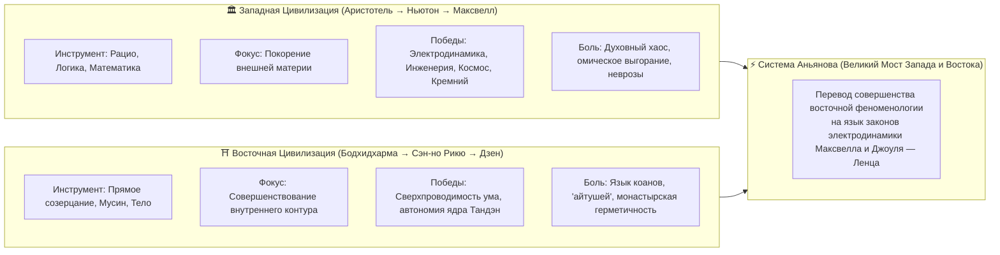

# 14. Великий синтез Запада и Востока: перевод совершенных принципов на язык физики для западного человека

[← К оглавлению](file:///c:/Users/vanya/Antigravity%20Projects/Apps/Inner%20Current/wiki/index.md)

---

> «Я сам западный человек и делаю это в первую очередь для западных людей. Западный человек понимает закон Джоуля — Ленца, понимает научный метод и язык формул. Но именно Восток разработал самые важные принципы человеческого духа и довёл их до абсолютного совершенства. Беда в том, что Восток говорит в „айтушах“, коанах и метафорах, которые западный ум считает туманом. Моя миссия — скрестить Запад и Восток, переведя совершенство восточной практики на строгий, проверяемый язык западной физики.»
> 
> — **Владимир Аньянов**, создатель Системы «Inner Current»

---

## 1. Парадокс двух цивилизаций

На протяжении трех тысяч лет развитие человеческой цивилизации шло по двум параллельным, но трагически изолированным магистралям:

---

## 2. Анатомия «айтушей»: почему западный человек отворачивается от Востока

Когда современный западный человек — программист, предприниматель, инженер, аналитик или учёный — приходит к восточной мудрости за решением своей душевной боли, он сталкивается с непреодолимым понятийным барьером:
* Вместо операциональной инструкции ему предлагают: *«Услышь хлопок одной ладони»*, *«Будь как вода»*, *«Отпусти всё»*, *«Открой сердечную чакру»*.
* Для рационального западного мозга, воспитанного на Евклиде, Декарте и законе Ома, это звучит как **«айтуши» — поэтические иносказания, эзотерический туман или шаманизм**.
* **Результат:** Западный созидатель отмахивается от сокровищницы Востока, считая её ненаучной сказкой, и возвращается обратно в свой кабинет пить антидепрессанты и сгорать от перегрева проводки внимания ($Q = I^2 R t$).

Но отказ от опыта Востока — колоссальная ошибка. **Восток за тысячелетия довёл психофизическую механику человеческого сознания до абсолютного инженерного совершенства!** Ни одна западная психологическая школа XX века (от психоанализа до КПТ) не приблизилась к чистоте и мощи дзэнских состояний Мусин (無心), Дзансин (残心) и портала Нидзиригути (躙口).

---

## 3. Таблица цивилизационного перевода (Розеттский камень Аньянова)

Система **Inner Current** выступает в роли **Розеттского камня XXI века**. Она берёт восточные принципы высшего совершенства и переводит их в точные физические формулы, которые понятны любому выпускнику технического вуза:

| # | Восточный канон (Совершенство духа) | Традиционный язык («Айтуши» и коаны) | Западный перевод Аньянова (Законы электродинамики) | Измеримый физический параметр |
|---|---|---|---|---|
| **1** | **Мусин (無心)** | «Не-ум, зеркало вод, отсутствие мыслей» | **Сверхпроводимость шины внимания** при обнулении паразитных индуктивностей $L_{past}$ и емкостей $C_{future}$. | $R \to 0$ Ом, $Q_{heat} \to 0$ Дж (Закон Джоуля — Ленца) |
| **2** | **Тандэн (丹田)** | «Море изначальной Ци, киноварное поле» | **Автономный электрохимический реактор** мощности организма (ЭДС $E$, емкость ампер-часов, заземление в гравитацию). | $\text{EMF} > 0$, $I_{gen} = \text{const}$ (Автономия источника) |
| **3** | **Нидзиригути (躙口)** | «Низкий лаз в чайную хижину, поклон гостя» | **Размыкание паразитной обратной линии** и разворот полярности питания на чистую отдачу ($I > 0$). | $I > 0$ (Закон однонаправленности вектора генератора) |
| **4** | **Дзансин (残心)** | «Остающийся дух после выстрела из лука» | **Быстродействующий автоматический предохранитель** (Circuit Breaker), отсекающий реактор от аварии внешней нагрузки. | $\tau_{trip} \le 10$ мс (Graceful Degradation цепи) |
| **5** | **Ваби-саби (侘寂)** | «Печальное очарование бренности вещей» | **Второй закон термодинамики (Энтропия)**: признание неизбежной хрупкости и смертности любых внешних объектов. | $dS \ge 0$, $\text{Fragility} > 0$ |
| **6** | **Кинцуги (金継ぎ)** | «Золотой шов на расколотой чаше» | **Интеграция телеметрии аварии** в архитектуру контура: трещина заливается золотым проводником опыта. | $R_{crack} \to 0$, прочность выше исходной |
| **7** | **Тяною (茶の湯)** | «Чайное действо, чистота, гармония, покой» | **Инвариантность масштаба закона Ома**: калибровка нуля сопротивления на микронагрузке $10$ Вт. | $\frac{U_{tea}}{R_{tea}} = I_{tea} \equiv \frac{U_{empire}}{R_{empire}} = I_{empire}$ |
| **8** | **Кансо (簡素)** | «Дзенская простота, пустота пространства» | **Балансировка многоканального распределительного щита**: отсечение балласта ради спасения шины Здоровья. | $\sum P_i \le P_{avail}$, $P_{health} \ge 25$ Вт |

---

## 4. Почему этот синтез спасает западного созидателя

1. **Не требует слепой веры:**
   Западному человеку не нужно «верить в перерождение душ» или «поклоняться учителю». Он видит интерактивную схему цепи, двигает ползунки $t_{past}$ и $t_{future}$, видит рост сопротивления $R_{eff}$ и математический перегрев $Q = I^2 R t$. Он понимает физику: *«Если я думаю о завтрашнем дедлайне прямо сейчас, я просто кипячу свои мозги в холостом сопротивлении»*.

2. **Дает повторяемый инженерный результат:**
   Если замкнуть предохранитель Дзансин при срыве проекта — реактор личности сохраняется на 100%. Это повторяемый эксперимент, как закон Ома в лаборатории.

3. **Возвращает науке её сердце:**
   Западная наука создала компьютеры, квантовые процессоры и космические телескопы, но оставила самого исследователя несчастным, перегруженным и выгоревшим. Скрещивание с Востоком возвращает человеку **инженерный контроль над его собственной внутренней физикой**.

---

## 5. Заключение: Новая эпоха человеческого ума

> «Мы не умаляем Восток — мы отдаем ему высшую дань уважения, доказывая, что его интуиции были **абсолютными физическими законами вселенной**. 
> 
> Мы не умаляем Запад — мы даем его мощному рациональному уму то, чего ему не хватало больше всего: **инженерную схему внутреннего счастья, выраженную в его собственных терминах**.»
> 
> — Владимир Аньянов
