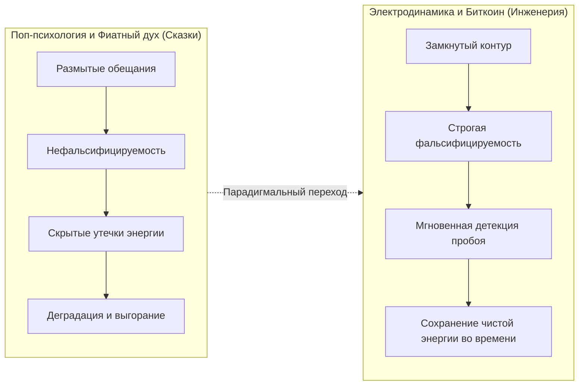
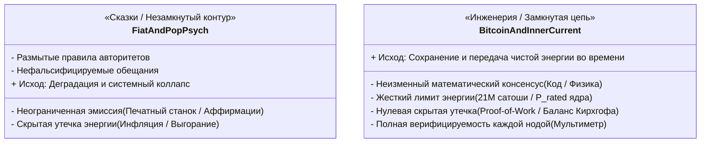

# Инженерный критерий истины: Замкнутая цепь, Биткоин и демистификация «сказок» о счастье

> «Если в схеме пробой — ты видишь его сразу. Ты не можешь построить работающую систему, если цепь не замкнута. Интегрированный инженерный подход беспощадно отделяет физическую реальность от красивых сказок — как в электродинамике, как в Биткоине, так и в архитектуре человеческого счастья.»

---

## ⚡ Введение: Почему инженерная модель превосходит метафоры поп-психологии

В популярной культуре и «поп-психологии» счастье объясняется через абстрактные, размытые образы: *«просто мысли позитивно»*, *«визуализируй изобилие»*, *«открой сердце миру»*. Главный порок этих концепций с точки зрения эпистемологии — их **нефальсифицируемость**. Если человек следует совету «визуализировать успех», но впадает в депрессию, апологеты поп-психологии отвечают: *«Ты просто недостаточно сильно верил»* или *«Твои вибрации были нечисты»*. Ответственность переносится в метафизическую зону, где невозможно найти причину сбоя.

Объяснение счастья через **замкнутую электрическую систему** и законы электродинамики кардинально меняет правила игры. В инженерии нет места «вере» и «уговорам»:
1. **Цепь либо замкнута, либо разомкнута.**
2. **Ток либо течет, либо равен нулю.**
3. **Закон сохранения энергии и законы Кирхгофа действуют непреложно.**
4. **Пробой изоляции и паразитные утечки фиксируются мгновенно.**

Этот подход переводит человеческое благополучие из разряда неосязаемой мистики в плоскость **строгой технической диагностики и баланса энергосистемы**.

---

## 🔋 1. Пять канонов инженерной честности в Архитектуре Счастья

### 1.1. Закон сохранения и замкнутость контура (Нет вечным двигателям)
В физике электрический ток ($I$) не может течь в никуда. Для протекания тока необходима замкнутая цепь: **Источник (ЭДС) $\to$ Проводник $\to$ Нагрузка $\to$ Обратный провод (контур восполнения)**.
* **Ошибка поп-психологии:** Призывы *«бесконечно отдавать тепло людям»* без восполнения ресурса — это попытка создать мошеннический «вечный двигатель первого рода».
* **Инженерная реальность:** Если человек тратит $100\text{ Вт}$ внимания на работу или окружение, но его контур сна, сенсомоторного заземления (Саму) и автономного ядра (Тандэн) разомкнут — наступает аппаратный блэкаут (клиническое истощение).

### 1.2. Законы Кирхгофа и мгновенная детекция утечек ($I_{\text{leakage}}$)
Первый закон Кирхгофа гласит: *алгебраическая сумма токов в любом узле электрической цепи равна нулю* ($\sum I_k = 0$).
* Если генератор выдает ток внимания $I_{in}$, в полезную нагрузку (творчество, семья, проект) уходит лишь $I_{useful} = 0.2 \cdot I_{in}$, а возвращается ноль — **в системе присутствует пробой изоляции**.
* Ток свищет «на землю» через скрытые щели: непрожитые обиды, фоновое чувство вины, думскроллинг, синдром самозванца.
* Пробой нельзя замаскировать «аффирмациями». Если фазный провод касается заземленного корпуса, защитный автомат выбивает вне зависимости от того, насколько позитивен хозяин дома.

### 1.3. Сопротивление (Импеданс) и закон Джоуля — Ленца
Любое внутреннее психологическое трение эквивалентно омическому сопротивлению $R$:
$$Q = I^2 R t$$
* **Тепловые потери:** Чем выше эго-сопротивление $R_{ego}$ (страх показаться глупым, стыд, навязчивый контроль будущего), тем меньше энергии превращается в свет лампочки и тем больше уходит в паразитный нагрев проводов (раздражительность, хроническое воспаление, бессонница).
* **Сверхпроводимость ($R \to 0$):** Дзенское состояние Мусин (無心) — это охлаждение проводника внимания до состояния нулевого омического трения. Энергия мысли переходит в прямое действие без потерь.

### 1.4. Принцип фальсифицируемости Карла Поппера
Рабочая инженерная схема фальсифицируема. Ты берешь «мультиметр» (объективные метрики: ЧСС, вариабельность ритма сердца HRV, фазы глубокого сна, скорость реакции, чистота фокуса) и прозваниваешь цепь:
* *Лампочка горит ровным светом?* (Субъективное благополучие и продуктивность).
* *Есть ли напряжение на клеммах ядра?* (Уровень базовой энергии с утра).
* *Где падает напряжение?* Локализация неисправности занимает секунды, а не годы психоаналитических блужданий.

---

## ₿ 2. Параллель с Биткоином: Майкл Сейлор и монетарная термодинамика

Поразительный изоморфизм: различие между **поп-психологией и электродинамикой счастья** в точности повторяет различие между **фиатной финансовой системой и Биткоином**.

Основатель MicroStrategy Майкл Сейлор, будучи аэрокосмическим инженером из MIT, формулирует ценность Биткоина не через экономическую спекуляцию, а через **термодинамику и строгую инженерию**:
> *«Биткоин — это первая в истории совершенная цифровая энергетическая сеть. Это монетарная машина, спроектированная по законам термодинамики, где энергия не может протечь сквозь щели инфляции.»*

### Сравнительный изоморфизм систем:

### 1. Сохранение энергии против «утечек»
* **Фиатные деньги:** Центральные банки могут произвольно печатать триллионы долларов. Это эквивалентно безумному инженеру, который на бумаге пририсовывает мегаватты к паспорту генератора, когда на самом деле река пересохла. Твой прошлый труд ($E$), отложенный на сберегательном счете, тает со скоростью $7\text{--}15\%$ в год. Это **дырявый контур**, тепловые потери которого оплачивает пользователь.
* **Биткоин:** $21\text{ миллион монет}$. Ни одного сатоши нельзя создать декретом или обещанием. Чтобы добавить блок в блокчейн, майнеры обязаны сжечь реальное электричество в физическом мире (Proof-of-Work). Энергия физическая конвертируется в цифровую неизменную запись.

### 2. Консилиум нод vs «Честное слово чиновников»
* В фиатной системе правила меняются регулятором задним числом.
* В Биткоине каждая независимая нода запускает полный математический аудит входящей транзакции. Если нарушен хотя бы один бит, если баланс входов и выходов не сошелся — **блок бракуется автоматически**. Сети плевать на титулы, речи и намерения автора транзакции. **Либо цепь замкнута и уравнения сходятся, либо транзакции нет.**

---

## ⚖️ 3. Сравнительная таблица трех миров

| Параметр | Поп-психология (Сказки) | Фиатная система (Бумажные деньги) | Внутренний ток и Биткоин (Чистая инженерия) |
| :--- | :--- | :--- | :--- |
| **Базис онтологии** | Верования, аффирмации, настроение | Политический декрет, доверие регулятору | Законы физики, термодинамика, математический код |
| **Закон сохранения** | Отсутствует («энергия вселенной бесконечна») | Нарушается («допечатаем еще триллион») | **Нерушим:** $\sum I = 0$, $E_{in} = E_{out} + Q$, лимит $21\text{M}$ |
| **Реакция на сбой** | Газлайтинг («ты слабо верил») | Скрытая эмиссия («инфляция временная») | **Автоматическое срабатывание:** выбитый автомат / отказ ноды |
| **Энергетический КПД** | Низкий (высокое $Q = I^2Rt$) | Падающий (потеря покупательской способности) | **Максимальный:** сверхпроводимость $R \to 0$ / чистый проводник ценности |
| **Критерий истинности** | Красивая упаковка нарратива | Авторитет государства | **Фальсифицируемость:** приборная проверка схемы |

---

## 🛠️ 4. Практический вывод для архитектора состояния

Когда человек встает на позиции инженера своего состояния:

1. **Исчезает обида на мир и чувство вины:**
   Если настольная лампа не горит, глупо злиться на лампу, плакать перед розеткой или просить у вселенной чуда. Нужно взять инструмент и проверить проводку.
2. **Ликвидируются паразитные утечки:**
   Любое токсичное общение, непроясненный контракт или зависимость от чужого мнения опознаются не как «сложная психологическая драма», а как **недопустимый пробой фазы на мокрый пол**. Его устраняют механически — установкой изолятора и срабатыванием автоматического выключателя (Дзансин / Circuit Breaker).
3. **Обретается монетарно-энергетический суверенитет:**
   Как владелец биткоина хранит приватные ключи на холодном аппаратном кошельке, не доверяя третьим лицам распоряжаться его монетарной энергией, так и практик Системы Аньянова замыкает свой энергетический контур в Тандэне, не позволяя внешним оценкам и хаосу социума манипулировать рубильником его счастья.

> **Инженерная заповедь:** 
> *«Не строй воздушных замков — собирай надежные замкнутые цепи. Реальность уважает только законы сохранения.»* ⚡️💎

---

## 🔗 Связанные статьи
- [[01-core-topology|01. Базовая топология цепи и закон полярности]]
- [[02-superconductivity-and-presence|02. Физика присутствия: состояние сверхпроводимости]]
- [[04-safety-and-antifragility|04. Предохранители цепи, ваби-саби и антихрупкость]]
- [[06-diagnostic-machine|06. Машина для диагностики счастья: спецификация]]
- [[13-complete-zen-electrodynamic-ontological-atlas|13. Полный онтологический атлас Дзен]]
- [[Inner Current - MOC|Inner Current MOC]]
