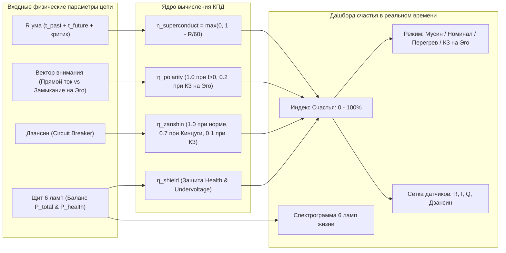

# 16. Дашборд счастья: инженерная телеметрия и мониторинг сверхпроводимости

[← К оглавлению](file:///c:/Users/vanya/Antigravity%20Projects/Apps/Inner%20Current/wiki/index.md)

---

> «Если счастье — это не поэтическая абстракция, а физическое состояние контура, то у него должен быть точный приборный щит. В инженерной системе счастье измеряется не улыбками, а коэффициентом полезного действия сверхпроводимости, вектором генерации тока и целостностью предохранителей цепи.»  
> — **Владимир Аньянов, «Система Аньянова»**

---

## 1. От субъективной драмы — к приборной панели

Главный дефект популярной психологии и коучинга заключается в отсутствии объективной метрологии. Вопрос *«Насколько вы счастливы от 1 до 10?»* страдает неизлечимой погрешностью:
* Человек в маниакальном раже ставит 10/10, сжигая остатки ресурса в перегрузке;
* Человек в глубоком созидательном трансе (Мусин) вообще не оценивает себя и может ответить наугад;
* Человек в ловушке валидации радуется чужому одобрению, не замечая, что его генератор Тандэн истощается во внутреннем коротком замыкании на Эго.

В системе **«Inner Current»** счастье демистифицировано: это **чистая электродинамика присутствия**. А значит, оператор цепи должен иметь перед глазами **Дашборд счастья (Happiness Telemetry HUD)** — компактный, высокочувствительный интерфейс реального времени, фиксирующий физические параметры цепи внимания.

---

## 2. Математическая модель Индекса Счастья ($\mathcal{H}$)

В контуре человека совокупный Индекс Счастья $\mathcal{H} \in [0, 100\%]$ вычисляется как произведение четырех фундаментальных коэффициентов:

$$\mathcal{H} = \eta_{\text{superconduct}} \times \eta_{\text{polarity}} \times \eta_{\text{zanshin}} \times \eta_{\text{shield}}$$

### 2.1. Коэффициент сверхпроводимости внимания ($\eta_{\text{superconduct}}$)
$$R_{\text{mental}} = \left(R_0 + X_{\text{past}} + X_{\text{future}}\right) \times (1 + k_{\text{critic}}) \times (1 - 0.2 \cdot k_{\text{grounding}})$$
$$\eta_{\text{superconduct}} = \max\left(0,\, 1 - \frac{R_{\text{mental}}}{60}\right)$$

* **Физический смысл:** Любая мысль о несбывшемся прошлом ($X_{\text{past}}$) или тревога о неопределенном будущем ($X_{\text{future}}$) — это реактивное индуктивно-емкостное сопротивление, сжигающее полезную энергию в омическом трении.
* **При $R \to 0$:** Контур входит в состояние **Мусин (無心)** — сопротивление исчезает, $\eta_{\text{superconduct}} \to 1.0$.

### 2.2. Коэффициент полярности генерации ($\eta_{\text{polarity}}$)
* **Чистая отдача в нагрузку ($I > 0$):** Тандэн генерирует ток и отдает его во внешнее действие (код, чашка чая, забота, музыка). $\eta_{\text{polarity}} = 1.0$.
* **Короткое замыкание на Эго (Петля рефлексии):** Попытка вытянуть ценность из пустой формы ($\mathcal{E}_{\text{load}} \equiv 0$) и замыкание внимания на себе (страх критики, зависимость от лайков). Внимание закорачивается во внутреннюю петлю, проводка вскипает ($I_{\text{КЗ}} = \mathcal{E}/r_{\text{int}}$), а нагрузка остаётся тёмной. $\eta_{\text{polarity}} = 0.18 - 0.20$.

### 2.3. Коэффициент антихрупкости Дзансин ($\eta_{\text{zanshin}}$)
* В штатном режиме: $\eta_{\text{zanshin}} = 1.0$.
* При аварии внешней нагрузки (разбитая чашка, сорванная сделка, увольнение):
  * **Если Дзансин взведён (ARMED):** Ментальный Circuit Breaker мгновенно изолирует сбой. Ядро цело. Система переходит в режим **Кинцуги (金継ぎ)**: $\eta_{\text{zanshin}} = 0.65 - 0.70$.
  * **Если Дзансин отключен:** Короткое замыкание выжигает генератор. Экзистенциальный шок: $\eta_{\text{zanshin}} = 0.10$.

### 2.4. Коэффициент гармонии щита ($\eta_{\text{shield}}$)
* **Защита канала «Здоровье»:** Если $P_{\text{health}} < 10\,\text{Вт}$, накладывается штраф $-25\%$ (истощение биоскафандра).
* **Защита от просадки напряжения (Undervoltage):** При $\sum P_i > P_{\text{core}}$ сеть перегружается, напряжение падает, накладывается штраф $-15\%$.

---

## 3. Анатомия Дашборда счастья (Сайдбар-виджет)

Дашборд счастья размещается в левом сайдбаре как **постоянно доступный HUD оператора** и состоит из следующих функциональных зон:

| Зона | Элемент | Диапазон / Значения | Инженерный смысл |
| :--- | :--- | :--- | :--- |
| **1. Главный прибор** | **Спидометр счастья** | `0 – 100%` | Совокупный КПД сверхпроводимости контура $\mathcal{H}$. Динамический градиент: циан-золото ($>90\%$), изумруд ($70-89\%$), янтарь ($40-69\%$), багрово-пурпурный ($<40\%$). |
| **2. Статус-бейдж** | **Режим контура** | `MUSHIN`, `NOMINAL`, `OVERHEAT`, `EGO_LOOP` | Мгновенный код состояния оператора. |
| **3. Сенсор $R$** | **Импеданс внимания** | `0.1 – 100+ Ω` | Суммарный паразитный шум ума (симуляции прошлого, будущего и внутреннего цензора). |
| **4. Сенсор фокуса** | **Вектор внимания** | `Наружу (в дело)` / `Петля КЗ (на себя)` | Направление потока: созидание наружу vs внутреннее короткое замыкание на нарратив своего «Я». |
| **5. Сенсор $Q$** | **Тепловые потери** | `0 – 2000+ Дж` | Паразитный нагрев черепной коробки по закону Джоуля — Ленца ($Q = I^2 R t$). |
| **6. Сенсор 🛡️** | **Дзансин (Breaker)** | `ARMED` / `TRIPPED` | Готовность предохранителя к изоляции внешних катастроф. |
| **7. Эквалайзер** | **Спектр 6 ламп** | 6 микро-полос | Баланс распределительного щита: 🚗 Авто, 🏡 Дом, 💼 Карьера, ❤️ Отношения, 🩺 Здоровье, 🎉 Развлечения. |
| **8. Калибратор** | **Кнопка Мусин** | `⚡ Калибровать Мусин` | Мгновенный аппаратный сброс реактансов в ноль с воспроизведением частоты сольфеджио 528 Гц. |

---

## 4. Сравнительная таблица: Инженерный дашборд vs Обычный трекер настроения

| Параметр | Обычный трекер настроения | Инженерный Дашборд Счастья «Inner Current» |
| :--- | :--- | :--- |
| **Основа метрики** | Субъективное самочувствие («мне грустно») | Термодинамическое сопротивление проводника $R$ и вектор внимания |
| **Причинность** | «День не задался», «ретроградный меркурий» | Омический перегрев Джоуля — Ленца, короткое замыкание на Эго |
| **Точность** | Произвольная шкала от 1 до 5 звёзд | Измеримый КПД мощности в процентах (0–100%) |
| **Связь со сбоями** | Человек чувствует вину за плохое настроение | Сбой локализуется в конкретном узле цепи как отказ автомата |
| **Протокол ремонта** | «Подышите», «выпейте кофе», «улыбнитесь» | Сброс $t_{\text{past}} \to 0, t_{\text{future}} \to 0$, размыкание петли эго через Нидзиригути, защита Дзансин |
| **Реактивность** | Ретроспективный опрос раз в день | Live-телеметрия в реальном времени при каждом движении ручек управления |

---

## 5. Вывод

Дашборд счастья в левом сайдбаре превращает оператора человеческой системы из жертвы случайных эмоциональных штормов в **главного инженера собственной электростанции**. 

Когда сопротивление ума сведено к нулю, ток направлен наружу, предохранитель взведён, а щит распределения сбалансирован — счастье наступает не как чудо, а как **неизбежный физический закон сверхпроводящей цепи**.
