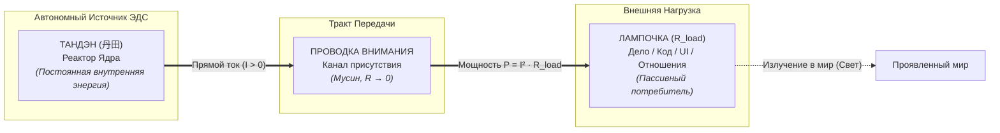
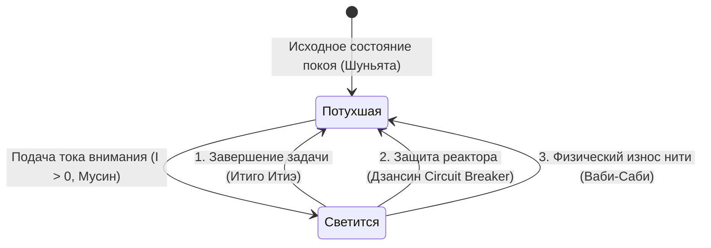
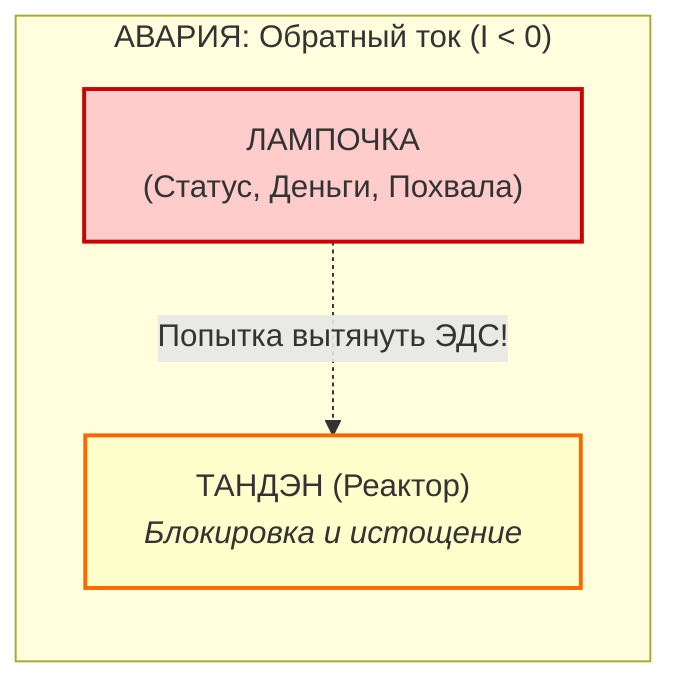

# 17. Природа лампочки и закон нагрузки по канонам Дзена (Свечение vs Потухание)

[← К оглавлению](file:///c:/Users/vanya/Antigravity%20Projects/Apps/Inner%20Current/wiki/index.md)

---

> «Лампочка не имеет собственного генератора. Она светится лишь тогда, когда через неё течёт ток твоего присутствия. Потухшая лампочка не означает смерть системы — она означает лишь возвращение формы в покой или срабатывание предохранителя.»  
> — **Архитектура счастья (Inner Current)**

---

> [!abstract] Квинтэссенция
> На фундаментальный вопрос инженера: *«Что такое лампочка в моей системе по канонам Дзена, если она может либо светиться, либо быть потухшей?»*, система **Inner Current** даёт строгий ответ:
> 
> **Лампочка — это внешняя нагрузка ($R_{\text{load}}$), пассивный терминатор цепи внимания, точка контакта внутренней энергии Тандэна с миром проявленных форм (Рупа / Майя).**
> 
> 1. **Свечение лампочки ($I > 0$)** — это процесс трансформации вашей внутренней ЭДС в полезное действие и свет.
> 2. **Потухание лампочки ($I = 0$)** — это не поломка вашей сущности, а штатное состояние цепи: завершение действия (*Итиго Итиэ*), размыкание предохранителя (*Дзансин*) или естественная энтропия материи (*Ваби-Саби*).
> 3. Главная духовная и инженерная ошибка заключается в попытке **запитать реактор от света лампочки** (авария обратного тока $I < 0$). Реактор всегда автономен.

---

## 1. Топологический статус Лампочки: Пассивный потребитель

В электродинамической онтологии человеческого контура лампочка занимает строго определённое место:



### Главный физический закон:
$$\mathcal{E}_{\text{tanden}} \neq 0, \quad \mathcal{E}_{\text{load}} \equiv 0$$

В лампочке **физически нет источника электродвижущей силы (ЭДС)**. Лампочка не может «дать вам сил», не может «сделать вас счастливым» и не может наполнить внутренний аккумулятор. 

* **В кодовой архитектуре:** Лампочка — это UI-компонент, запись в базе данных, внешний HTTP-эндпоинт, реакция в чате или push-уведомление. Это интерфейс вывода.
* **В жизненном контуре:** Лампочка — это написанная функция, чашка заваренного чая, диалог с человеком, запущенный стартап или физическая тренировка.

Полезная мощность, выделяемая на лампочке, определяется законом Джоуля:
$$P_{\text{light}} = I^2 \cdot R_{\text{load}} = \left(\frac{\mathcal{E}_{\text{tanden}}}{R_{\text{circuit}} + R_{\text{load}}}\right)^2 \cdot R_{\text{load}}$$

---

## 2. Физика двух состояний: Свечение vs Потухание

Лампочка бинарна в своём проявлении: она либо излучает свет, либо остаётся тёмной. Что означает каждое из этих состояний по канонам Дзен?



---

### Состояние А: «Лампочка светится» ($I > 0$)

Свечение возникает исключительно тогда, когда замкнут контур внимания, а реактор посылает в нагрузку прямой ток:

1. **Режим сверхпроводимости (Мусин, 無心):**  
   Проводник внимания очищен от паразитных наслоений эго ($R_{\text{ego}} \to 0$). Нет тревоги о результате, нет страха критики. Вся мощность ядра превращается в чистое свечение нити накала.
2. **Точка присутствия ($t = now$):**  
   Ток течет только в настоящем времени. Если внимание блуждает в симуляциях прошлого ($R_{\text{past}}$) или будущего ($R_{\text{future}}$), ток рассеивается в проводке, и лампочка тускнеет или начинает мерцать.
3. **Прямое творчество:**  
   Свет лампочки — это дар миру. Мастер не требует от лампочки аплодисментов: он просто наслаждается тем, как его внутренний ток озаряет пространство формы.

---

### Состояние Б: «Лампочка потухла» ($I = 0$)

Потухание лампочки в традиционном западном сознании воспринимается как трагедия, депрессия или провал («у меня всё погасло»). **В Дзен-инженерии потухание — это законный и священный режим системы.**

Существуют три канонические причины угасания лампочки:

#### 1. Канон «Итиго Итиэ» (一期一会) — Штатное отключение по завершении
> *«Одно действие — один миг».*

В электродинамике внимания **невозможно качественно запитать 10 ламп одновременно без падения напряжения**. В каждый момент времени мастер концентрирует весь ток на одной лампе:
* Заваривается чай — горит лампочка чая.
* Чай выпит — ток снимается. Лампочка чая **должна погаснуть**.
* Начинается написание алгоритма — зажигается лампочка кода. 

Потухание лампочки означает, что действие завершено, форма вернулась в непроявленный покой (*Шуньята* / Пустота), а энергия высвобождена для следующего шага.

#### 2. Канон «Дзансин» (残心) — Срабатывание автомата защиты (Circuit Breaker)
> *«Лампочка может сгореть, но генератор не имеет права погибнуть».*

Если внешняя нагрузка закоротила (партнёр устроил токсичный скандал, сторонний API лег с ошибкой 500, биржа обвалилась):
* Автомат защиты **Дзансин** мгновенно размыкает цепь:
  $$\text{CircuitBreaker.trip}() \implies I = 0$$
* Лампочка мгновенно гаснет.
* **Итог:** Внешний проект обесточен, но ядерный реактор Тандэн защищён от короткого замыкания и сохраняет нерушимый покой. Потухшая лампа спасла энергостанцию.

#### 3. Канон «Ваби-Саби» (侘寂) — Естественная смертность формы
> *«Ничто не вечно, ничто не завершено, ничто не идеально».*

Нить накала любой внешней лампочки сделана из бренного материала мира. Серверы устаревают, компании закрываются, люди уходят. Лампочка тухнет навсегда. 
* Мастер не плачет над остывшим стеклом, потому что **он никогда не путал стекло со своим сердцем**. 
* Шрамы на цепи герметизируются золотым лаком Кинцуги, и внимание направляется на создание новых форм.

---

## 3. Великая топологическая ловушка: Обратный ток ($I < 0$)

Самая тяжелая системная патология человека — **попытка запитаться от лампочки**:

$$\text{«Вот когда этот проект засветится (принесет признание, 100 000 подписчиков, миллион долларов) — я наконец стану счастливым и спокойным».}$$



### Последствия ошибки полярности:
1. **Энергетический тупик:** В лампочке нет генератора. Вы тянете ток из пустоты. Возникает хроническая усталость и ощущение выгорания.
2. **Омический взрыв проводки:** Контур начинает кипеть в паразитном нагреве ($Q = I^2 R t$). Внимание парализуется страхом: *«А вдруг она не загорится? А вдруг она сейчас погаснет?!»*.
3. **Экзистенциальная смерть при отказе лампы:** Если проект терпит неудачу, человек переживает крах личности, потому что он переместил своё «я» в стеклянную колбу внешней нагрузки.

---

## 4. Сравнительная онтология: Тандэн vs Лампочка

| Параметр контура | Тандэн (丹田) — Ядро | Лампочка — Нагрузка ($R_{\text{load}}$) |
| :--- | :--- | :--- |
| **Природа** | Первичный источник ЭДС ($\mathcal{E}$) | Пассивный потребитель мощности ($P$) |
| **Категория Дзен** | Природа Будды / Чистый дух | Форма (*Рупа*) / Иллюзорный мир (*Майя*) |
| **Автономия** | 100% независим от внешних оценок | Полностью зависит от тока внимания |
| **Состояние по умолчанию** | Непрерывный потенциал генерации | Тёмное холодное стекло |
| **При сбое среды** | Сохраняет невозмутимость (Фудосин) | Обесточивается автоматом (Дзансин) |
| **Смертность** | Неуничтожим, инвариантен к масштабу | Временна, хрупка, подвержена энтропии |

---

## 5. Протокол проверки лампочки (Дзен-инженерный чеклист)

Когда вы взаимодействуете с любой задачей, проектом или процессом в вашей жизни, задайте себе 4 диагностических вопроса:

```
[ ] 1. ПРОВЕРКА ПОЛЯРНОСТИ (Тандэн):
       «Я свечу этой лампочкой от избытка сил, или я пытаюсь украсть из неё подтверждение своей ценности?»
       -> Если второе: Стоп. Размыкание цепи. Ток должен идти изнутри наружу.

[ ] 2. ПРОВЕРКА СОПРОТИВЛЕНИЯ (Мусин):
       «Горит ли она чистым ровным светом прямо сейчас, или провода дымятся от мыслей об успехе и оценках?»
       -> Очистить тракт внимания от симуляций прошлого и будущего (R → 0).

[ ] 3. ПРОВЕРКА ФОКУСА (Итиго Итиэ):
       «Не пытаюсь ли я зажечь 5 ламп в параллель, превратив свет каждой в тусклое тление?»
       -> Погасить 4 лампы. Оставить одну. Зажечь её на полную мощность.

[ ] 4. ПРОВЕРКА ПРЕДОХРАНИТЕЛЯ (Дзансин):
       «Если эта лампочка прямо сейчас с громким треском взорвется — останется ли мой Тандэн нерушимым?»
       -> Если да: предохранитель взведён, контур в безопасности.
```

---

## 6. Финальный коан Архитектора

> *«Спросил ученик Мастера:  
> — Учитель, моя лампочка погасла. Значит ли это, что во мне больше нет света?  
> Мастер улыбнулся, повернул выключатель и зажёг очаг:  
> — Глупец. Солнце не умирает, когда ты закрываешь ставни дома.  
> Лампочка — это всего лишь стекло. Твой свет — это тот, кто смотрит сквозь него».*

---

## 🔗 Связи и ссылки
- [[04_Maps/Inner Current MOC|Inner Current MOC (Карта смыслов)]]
- [[01-core-topology|01. Базовая топология цепи и закон полярности]]
- [[02-superconductivity-and-presence|02. Физика присутствия: сверхпроводимость (R → 0)]]
- [[03-scale-invariance-and-tea-ceremony|03. Инвариантность масштаба: Чайная церемония и Итиго Итиэ]]
- [[04-safety-and-antifragility|04. Предохранители цепи, Ваби-саби и Дзансин]]
- [[12-zen-as-happiness-architecture-foundation|12. Дзен как фундамент Архитектуры счастья]]
- [[16-happiness-dashboard-and-superconductivity-telemetry|16. Дашборд счастья: инженерная телеметрия]]

---
*Maintained by Antigravity | Architecture of Happiness Core*
