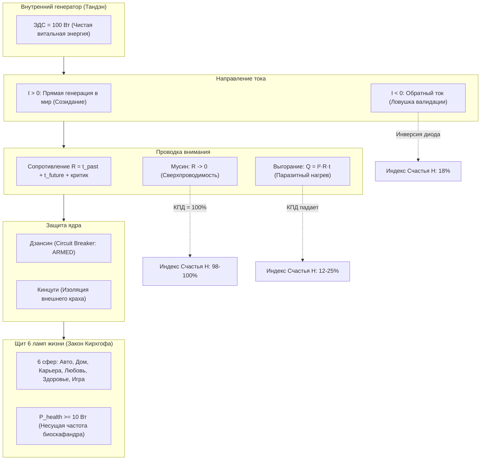

# 18. Индекс счастья Inner Current vs Всемирный индекс счастья ООН: физика контура против социологии опросов

> «Пытаться измерить счастье человека опросом ООН — все равно что измерять напряжение в электросети всенародным голосованием жителей микрорайона. Социология фиксирует чужие мнения и социальные сравнения; инженерная телеметрия фиксирует силу тока, сопротивление проводки и омические потери тепла.»  
> — **Владимир Аньянов, «Система Аньянова»**

---

## 1. Введение: Две противоположные парадигмы

Каждый год Организация Объединенных Наций (в рамках подразделения *SDSN — Sustainable Development Solutions Network*) публикует **Всемирный доклад о счастье (World Happiness Report, WHR)**. Этот отчет цитируют ведущие мировые медиа, а страны соревнуются за верхние строчки в рейтинге благополучия (где традиционно лидируют скандинавские страны — Финляндия, Дания, Исландия).

Параллельно в **«Inner Current» (Архитектуре счастья)** функционирует собственный **Индекс Счастья ($\mathcal{H}$)**, выводимый на оперативный Дашборд телеметрии контура.

На первый взгляд оба инструмента решают одну задачу: измерить, насколько счастлив человек. Однако между ними пролегает **непреодолимая эпистемологическая пропасть**. Они принадлежат к фундаментально разным онтологическим классам:
1. **Индекс ООН** — это **макросоциологическая шкала коллективной рефлексии**, построенная на субъективных опросах мнений и статистических корреляциях внешнего благополучия.
2. **Индекс Inner Current** — это **микроэлектродинамическая телеметрия замкнутой цепи внимания**, фиксирующая объективный КПД передачи созидательного тока в реальном времени.

Ниже представлен строгий сравнительный инженерный аудит обеих систем.

---

## 2. Сравнительная матрица: ООН vs Inner Current

| Параметр сравнения | Всемирный индекс счастья ООН (WHR) | Индекс счастья Inner Current ($\mathcal{H}$) |
| :--- | :--- | :--- |
| **Фундаментальная дисциплина** | Макроэкономика, социология, политология | Прикладная электродинамика, дзен-инженерия |
| **Объект измерения** | Среднестатистический гражданин страны (агрегат выборки) | Конкретный замкнутый контур оператора здесь и сейчас |
| **Первичный источник данных** | Субъективный опрос Gallup (Лестница Кэнтрила, 0–10) | Физические параметры цепи: $R$ (Ом), $I$ (полярность), $Q$ (Дж), Breaker |
| **Время отклика (Latency)** | **1 раз в год** (ретроспектива с задержкой в месяцы) | **Реальное время (миллисекунды)** — Live Telemetry HUD |
| **Зависимость от эго и памяти** | **100% зависимость**: память, нарратив, социальное сравнение | **0% зависимость**: чистая физика потока, эго отключено |
| **Влияние внешних факторов** | ВВП на душу населения, институты, отсутствие коррупции | Автономия Тандэна: независимость ядра от внешней среды |
| **Инженерная операбельность** | **Нулевая** (констатация: «вы живете в несчастливой стране») | **Абсолютная**: выдача кода сбоя и протокола ремонта |
| **Реакция на крах задачи** | Опрос фиксирует «горе / спад удовлетворенности» | Предохранитель Дзансин изолирует крах, ядро спасено (Кинцуги) |
| **Отношение к парадоксам** | Богатый человек в депрессии ломает статистику модели | Модель сразу видит омический перегрев ($Q \gg 0$) или обратный ток ($I < 0$) |

---

## 3. Деконструкция методологии ООН (Лестница Кэнтрила)

Индекс ООН опирается на вопрос социолога Хэдли Кэнтрила (Cantril Self-Anchoring Striving Scale):
> *«Представьте лестницу со ступенями от 0 внизу до 10 наверху. Верхняя ступенька представляет наилучшую возможную для вас жизнь, а нижняя — наихудшую. На какой ступеньке вы лично чувствуете себя в данный момент?»*

Затем полученные оценки регрессионно объясняются 6 факторами:
1. ВВП на душу населения по ППС ($GDP$);
2. Социальная поддержка (наличие близких, на которых можно положиться);
3. Ожидаемая продолжительность здоровой жизни ($HLE$);
4. Свобода жизненного выбора;
5. Щедрость (благотворительность за последний месяц);
6. Восприятие коррупции в бизнесе и правительстве.

### Три системных дефекта методологии ООН с точки зрения инженерии:

### 1. Ошибка ментальной симуляции и социального сравнения
Когда человека спрашивают: *«На какой ступени лестницы вы стоите?»*, он не измеряет свое текущее состояние. Он **включает генератор сравнений ума**:
* Вспоминает миллионеров из соцсетей, соседей с новыми машинами или идеализированные образы будущего;
* Вводит в свою проводку колоссальное индуктивно-емкостное сопротивление симуляций: $X_{\text{past}} + X_{\text{future}} \gg 0$;
* Сам акт измерения по шкале Кэнтрила **создает несчастье**, так как активирует внутреннего критика ($k_{\text{critic}}$) и социальное сравнение.

### 2. Смешение внешних условий («сети питания») с проводимостью контура
Высокий ВВП, чистые улицы и отсутствие коррупции в Хельсинки создают прекрасную инфраструктуру. Но они **не гарантируют проводимости личной цепи внимания**:
* Инженер в роскошном офисе в Стокгольме может сгорать в омическом перегреве Джоуля — Ленца ($R > 35\,\Omega$) из-за синдрома самозванца и ночных руминаций;
* Его Индекс ООН будет 8.5/10 (ведь вокруг безопасность и медицина), а его реальный физический контур будет плавиться с КПД $\mathcal{H} = 14\%$.

### 3. Отсутствие обратной связи (No Actionable Feedback)
Если отчет ООН сообщает гражданину, что его страна опустилась на 120-е место, этот отчет не дает ему инженерного инструмента:
* Что человеку делать со своим выгоранием прямо сейчас в 14:30 вторника?
* Как ему перестать зависеть от похвалы начальника?
* Как изолировать стресс от упавшего продакшена?
Индекс ООН — это **статистический некролог за прошлый год**, а не пульт управления живой энергосистемой.

---

## 4. Математика Inner Current: Счастье как электродинамический КПД

В системе **Inner Current** Индекс Счастья $\mathcal{H}$ — это **безразмерный коэффициент полезного действия (КПД)** замкнутого контура человека:

$$\mathcal{H} = \eta_{\text{мусин}} \times \eta_{\text{полярность}} \times \eta_{\text{дзансин}} \times \eta_{\text{щит}}$$

### Физический смысл 4 множителей:
1. **$\eta_{\text{мусин}}$ (Сверхпроводимость внимания):**
   Показывает, сколько энергии доходит до дела, а сколько сгорает в мысленной жвачке. Если человек тотально погружен в текущее действие (заваривает чай, пишет алгоритм, обнимает ребенка), его сопротивление проводки $R \to 0$, а тепловые потери $Q \to 0$.
2. **$\eta_{\text{полярность}}$ (Вектор генерации):**
   Показывает, куда течет ток. Если человек созидает ради самого процесса ($I > 0$), ток течет во внешний мир. Если он делает это ради похвалы, лайков или страха осуждения ($I < 0$), линия закольцовывается в паразитный обратный ток, выжигая самооценку.
3. **$\eta_{\text{дзансин}}$ (Антихрупкость к катастрофам):**
   Показывает, защищено ли ядро личности при крушении внешних задач. Если проект провалился или разбилась любимая чашка, ментальный выключатель Дзансин размыкает цепь за миллисекунды. Генератор цел, а шрам покрывается золотом опыта (**Кинцуги**).
4. **$\eta_{\text{щит}}$ (Баланс сфер жизни по закону Кирхгофа):**
   Показывает, распределен ли ток по всем 6 жизненно важным лампам, и защищена ли несущая частота здоровья ($P_{\text{health}} \ge 10\,\text{Вт}$).

---

## 5. Главный онтологический водораздел: Автономия vs Зависимость

Вся философия Индекса ООН неявно внушает человеку мысль:  
> *«Твое счастье зависит от того, насколько богато твое государство, насколько честны твои чиновники и сколько денег у твоих сограждан».*  
Это делает человека **вечным заложником внешних обстоятельств**, ожидающим милости от макросреды.

Философия Индекса Inner Current постулирует закон **Тандэна (丹田)**:  
> *«Генератор тока находится внутри тебя. Законы Ома и Джоуля — Ленца действуют одинаково и во дворце в Женеве, и в хижине дзенского мастера в Киото. Ты не можешь в одиночку изменить ВВП страны за 5 минут, но ты можешь прямо сейчас обнулить сопротивление своего ума, отключить симуляции прошлого и будущего, взвести предохранитель Дзансин и вернуть свой контур в состояние 100% сверхпроводимости».*

---

## 6. Резюме

* **Индекс ООН** — это термометр для измерения климата в палатах больницы раз в год.
* **Индекс Inner Current** — это приборная панель в кабине пилота сверхзвукового самолета, показывающая ток, напряжение, температуру обшивки и целостность двигателей в реальном времени.

Счастье в Системе Аньянова — это не отчет комиссии и не результат голосования. Это **чистый, холодный, сверхпроводящий ток внутреннего намерения, не встречающий сопротивления в проводке ума**.
