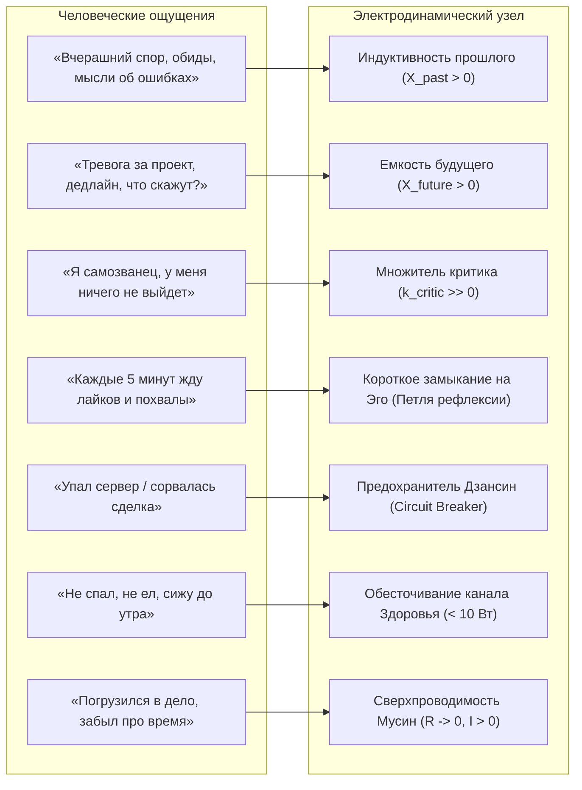

# 19. Как человеку читать свой контур: транслятор ощущений в физику цепи и 30-секундный протокол калибровки

> «Человек не рождается с вольтметром в руках и щупами на висках. Но у каждого человека есть встроенный с рождения высокочувствительный биосенсор — его непосредственные мысли, телесные ощущения и внутренние мотивы. Чтобы управлять цепью, достаточно научиться переводить свои чувства на язык электродинамики.»  
> — **Владимир Аньянов, «Система Аньянова»**

---

## 1. Проблема: «Я не знаю Омы и Амперы»

Главный барьер при первом знакомстве с инженерным подходом к счастью звучит так:  
*«Я не знаю, сколько у меня Ом сопротивления. Я не знаю, какой у меня ток в Амперах. Как мне реально пользоваться этим дашбордом в повседневной жизни?»*

Это абсолютно законный вопрос. Вам **не нужно** ничего измерять приборами. Физика цепи в «Inner Current» — это объективная изнанка субъективного опыта. 

Ниже приведен полный **Словарь-транслятор**: как ваши повседневные переживания один-в-один соответствуют узлам электродинамического контура.

---

## 2. Словарь-транслятор: От ощущений к физике цепи

### 1. Сопротивление проводки ($R_{\text{mental}}$) — Шум ума
* **Как ощущается:**  
  * *Мысли о прошлом:* Вы моете посуду или едете в метро, но мысленно доказываете бывшему коллеге свою правоту. Это **$t_{\text{past}}$ (индуктивный реактанс)**. Проводка нагревается.
  * *Мысли о будущем:* Вы открыли ноутбук писать код или отчет, но каждые 30 секунд представляете, как проект провалится или что ответит инвестор. Это **$t_{\text{future}}$ (емкостной реактанс)**.
  * *Внутренний критик:* Голос внутри шепчет: *«Ты недостаточно умен, другие круче тебя»*. Это **$k_{\text{critic}}$**, умножающий базовое сопротивление в 2–3 раза.
* **Идеал (Мусин, $R \approx 0$):**  
  Вы тотально варите кофе, чувствуя аромат зерен. Вы тотально пишете строчку кода, не думая о том, что будет через год. Ум пуст и чист. Ток реактора без сопротивления идет в материю.

### 2. Вектор генерации ($I$) — Мотив действия
* **Прямой ток ($I > 0$):**  
  *Вы делаете вещь ради самой вещи.* Решаете задачу, потому что это красиво и решает проблему. Рисуете, потому что хотите увидеть цвет. Ток идет из вашего реактора (Тандэн) наружу. Контур заряжен и стабилен.
* **Короткое замыкание на Эго (Петля рефлексии):**  
  *Вы делаете вещь, чтобы получить подтверждение собственной ценности.* Написали пост и каждые 3 минуты обновляете страницу в ожидании лайков; работаете на износ только ради того, чтобы строгий начальник сказал «молодец». Вы ожидаете, что **пустая внешняя лампа ($\mathcal{E}_{\text{load}} \equiv 0$) подтвердит вашу состоятельность**. Но лампа — пассивный потребитель. Внимание не доходит до дела, а закорачивается во внутреннюю петлю эго-рефлексии (*«А как я выгляжу? А одобрят ли меня?»*). Сверхток внутреннего КЗ ($I_{\text{КЗ}} = \mathcal{E}/r_{\text{int}}$) кипятит нервную систему по закону Джоуля — Ленца, пока лампа ремесла остаётся тёмной.

### 3. Потери тепла ($Q = I^2 R t$) — Ощущение выгорания
* **Как ощущается:**  
  Вы сидели на удобном кресле весь день, не разгружали вагоны, не бежали марафон. Но к 18:00 голова чугунная, челюсти сжаты, спина ноет, сил нет даже дойти до душа.  
  Это не физическая усталость мышц — это **омическое тепло Джоуля — Ленца**. Высокое сопротивление сомнений и страхов ($R$) при мощном генераторе желания что-то сделать ($I$) рассеяло всю вашу энергию в тепло выгорания.

### 4. Предохранитель Дзансин (Circuit Breaker) — Отношение к сбоям
* **Без предохранителя:**  
  Разбилась любимая кружка или отменилась важная встреча. Человек рыдает, уходит в запой или впадает в самобичевание: *«Всё пропало, весь мой мир рухнул!»*. Короткое замыкание внешней нагрузки сожгло внутренний генератор личности.
* **С Дзансином (ARMED):**  
  Разбилась кружка или упал продакшен. Человек делает вдох животом (Тандэн): *«Кружка разбита. Внешний объект поврежден, но мое ядро цело. Я бдителен, спокоен и убираю осколки»*. Это **Кинцуги** — трещина изолирована и залита золотом опыта.

### 5. Щит 6 ламп — Баланс жизни
* **Здоровье ($P_{\text{health}} < 10\,\text{Вт}$):** Если вы не спали 7 часов и питаетесь энергетиками — вся ваша сеть работает в режиме аварийной перегрузки. Нарушен фундаментальный закон несущей частоты биоскафандра.

---

## 3. Чек-ап за 30 секунд: Практический ритуал дня

Чтобы использовать дашборд каждый день, не нужны приборы. Достаточно **3 простых чеков**:

### Утренний чек (Калибровка на день — 10 секунд):
1. Сесть прямо, сделать 3 глубоких вдоха в низ живота (заземление Тандэн);
2. Нажать на Дашборде кнопку: `[ ⚡ Аппаратная калибровка: Мусин (R → 0) ]`;
3. Услышать чистый звук сольфеджио (528 Гц) — войти в рабочий день со 100% проводимостью.

### Чек при стрессе или ступоре (20 секунд):
1. Поймали себя на тревоге? Откройте Дашборд;
2. Ответьте на 3 вопроса в блоке **«Переводчик ощущений»**:
   * *Где внимание?* ➔ Нажмите `[⏩ В будущем]` или `[🗣️ Критик]`.
   * *Зачем делаю?* ➔ Если трясетесь от страха оценки, нажмите `[🪤 Жду похвалы]`.
   * *Что с телом?* ➔ Если не спали, нажмите `[🔴 Истощен]`.
3. Посмотрите на спидометр: он наглядно покажет вам, **почему именно** вам сейчас плохо (например, $H = 18\%$, замыкание на Эго).
4. Прочтите инженерную подсказку терминала:
   * *«Отсеките ожидание похвалы. Сделайте одно простое действие ради процесса»*.
5. Нажмите `[✨ Сбросить в Мусин]` и вернитесь к задаче.

---

## 4. Итог

Дашборд счастья — это не научная диссертация, а **зеркало вашей энергосистемы**.  
Вы управляете им не формулами, а **своим вниманием**:
* Отпустили прошлое и будущее ➔ сопротивление упало в ноль;
* Перестали выпрашивать одобрение ➔ ток пошел прямо;
* Позаботились о сне ➔ щит стабилен.

Счастье — это естественное состояние контура, из которого просто убрали лишнее сопротивление.
