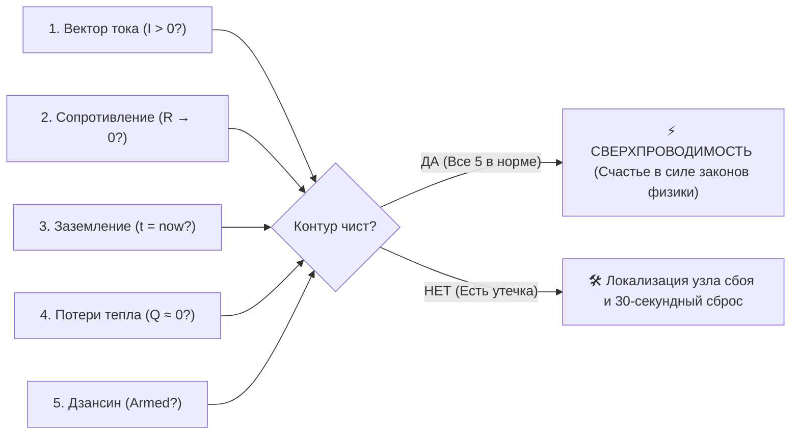

# 21. Ответ на вопрос «Счастлив ли я?»: Парадокс Милля, ликвидация рефлексивного тупика и 5 датчиков телеметрии

> «Спросите себя, счастливы ли вы, и вы перестанете быть счастливы. Единственный способ быть счастливым — сделать целью жизни не само счастье, а нечто внешнее по отношению к нему.»  
> — **Джон Стюарт Милль (1806–1873)**

> «Милль абсолютно точно зафиксировал патологию, но не дал ей инженерного объяснения. Вопрос "Счастлив ли я?" выдергивает рубильник цепи, замыкая ток на холостой ментальный компаратор. В Системе Аньянова мы не задаем оценочный вопрос уму. Мы опрашиваем телеметрию контура: каково сопротивление $R$, куда течет ток $I$ и заземлено ли внимание прямо сейчас.»  
> — **Владимир Аньянов, «Система Аньянова»**

---

## 1. Анатомия экзистенциального сбоя: почему вопрос «Счастлив ли я?» делает человека несчастным

На протяжении тысячелетий люди пытаются ответить на вопрос *«Счастлив ли я?»* через **прямую интроспекцию и самооценку**. Практически всегда этот процесс заканчивается растерянностью, тревогой или резким падением настроения.

В электродинамической модели «Внутренний ток» причина этого провала очевидна: **попытка оценить собственное счастье является аппаратным коротким замыканием цепи внимания**.

```mermaid
graph TD
    subgraph NaturalFlow ["1. Естественное состояние счастья (Сверхпроводимость)"]
        T1["⚡ Тандэн (ЭДС)"] -->|Ток I > 0| W1["Внимание в настоящем (t = now, R → 0)"]
        W1 -->|Чистое действие| L1["Нагрузка (Код, Чай, Беседа, Труд)"]
    end

    subgraph ReflectiveCrash ["2. Ментальный ступор при вопросе «Счастлив ли я?»"]
        T2["⚡ Тандэн (ЭДС)"] --> W2["Внимание выдернуто из действия"]
        W2 -->|Зацикливание петли| CMP["Паразитный компаратор эго (R_ego >> 0)"]
        CMP -->|Сравнение с эталоном| SIM["Симуляции: «А как у других? А что завтра?»"]
        SIM -->|Омический нагрев Q = I²Rt| BURN["Выгорание, сомнения, ощущение пустоты"]
    end
```

### Три физических разрушения контура при вопросе «Счастлив ли я?»:
1. **Обрыв проводки полезной нагрузки:** Внимание мгновенно отключается от реального физического действия (мытье чашки, написание кода, объятия близкого) и переводится в абстрактный регистр.
2. **Активация паразитного компаратора ($R_{\text{ego}} \gg 0$):** Мозг запускает ресурсоемкий алгоритм сравнения: текущее самочувствие начинает сопоставляться с фантазийным кинематографическим эталоном «абсолютного эйфорического счастья». Любое несовпадение немедленно трактуется как сбой.
3. **Лавинообразный рост реактивных сопротивлений:** Человек подключается к индуктивности прошлого ($X_{\text{past}}$: *«А вот год назад я чувствовал себя живее...»*) и емкости будущего ($X_{\text{future}}$: *«Но ведь этот проект скоро кончится, что тогда?»*). Вся полезная мощность генератора рассеивается в тепло внутреннего трения ($Q = I^2 R t$).

**Вывод:** Счастье невозможно обнаружить прямым поиском или умственной оценкой. Счастье — это побочный результат правильной работы электрической цепи.

---

## 2. Смена парадигмы: от абстрактной оценки к инженерной телеметрии

Вместо тупикового вопроса *«Счастлив ли я?»*, система «Внутренний ток» предлагает оператору задать себе **5 измеримых вопросов телеметрии контура**.

| Традиционный ментальный вопрос | Инженерный телеметрический датчик | Физический параметр цепи |
| :--- | :--- | :--- |
| *«Доволен ли я своей жизнью?»* | **Датчик 1: Вектор тока** | Полярность $I$ ($I > 0$ vs $I < 0$) |
| *«Почему мне так тяжело и тревожно?»* | **Датчик 2: Сопротивление проводки** | Омическое сопротивление $R \to 0$ |
| *«Где витают мои мысли?»* | **Датчик 3: Точка заземления** | Временная фаза $t = \text{now}$ |
| *«Почему я так вымотан без тяжелого труда?»* | **Датчик 4: Тепловые потери** | Тепло Джоуля — Ленца $Q = I^2 R t$ |
| *«Что будет, если всё пойдет не по плану?»* | **Датчик 5: Предохранитель ядра** | Статус Дзансин (Circuit Breaker) |

---

## 3. Пять телеметрических датчиков: Чек-лист «Счастлив ли я?»

### 📡 Датчик 1: Вектор тока ($I$) — Мотив действия
* **Вопрос к себе:** *«Я делаю это ради самого процесса или ради внешнего подтверждения своей ценности?»*
* **Норма ($I > 0$, Прямой ток):** Вы варите кофе ради вкуса кофе. Вы пишете код, потому что решаете красивую инженерную задачу. Вы общаетесь с человеком, потому что вам интересен человек. Энергия изливается из вашего генератора (Тандэн) во внешний мир.
* **Авария ($I_{\text{load}} = 0$, Короткое замыкание на Эго):** Вы делаете работу только для того, чтобы строгий начальник похвалил вас. Вы выкладываете пост и каждые 30 секунд проверяете лайки. Вы ожидаете энергии от пустой лампочки. Внимание не доходит до процесса, а замыкается во внутреннюю петлю эго-рефлексии.
* **Инженерный диагноз:** При замыкании на Эго счастье физически невозможно — контур кипятит внутреннюю проводку по закону Джоуля — Ленца, пока полезное действие заблокировано.

### 📡 Датчик 2: Сопротивление проводки ($R$) — Чистота внимания
* **Вопрос к себе:** *«Спорит ли мой ум с тем, что я делаю прямо сейчас?»*
* **Норма ($R \to 0$, Сверхпроводимость / Мусин):** Между возникновением намерения и действием нет барьера. Вы моете посуду — и просто моете посуду. Ум чист, внутренний диалог тих.
* **Авария ($R \gg 0$, Высокое омическое сопротивление):** Вы пишете отчет, но фоном идет непрерывный диалог: *«Зачем я это делаю? Я не справлюсь, я бездарность, надо было выбрать другую профессию»*. Внутренний критик ($k_{\text{critic}}$) умножает сопротивление.
* **Инженерный диагноз:** Вы переживаете не несчастье судьбы, а колоссальное трение в несмазанной проводке внимания.

### 📡 Датчик 3: Заземление ($t$) — Локализация во времени
* **Вопрос к себе:** *«Где сейчас находится моё восприятие — в физических органах чувств или в галлюцинациях ума?»*
* **Норма ($t = \text{now}$, Абсолютное заземление):** Внимание подключено к тактильным ощущениям, дыханию низом живота, звукам комнаты, запахам. Вы находитесь в физической реальности.
* **Авария ($t \neq \text{now}$, Реактивный дрейф):** Тело сидит за рабочим столом, но сознание застряло в индуктивности $X_{\text{past}}$ (мысленная перепалка со вчерашним хамом в метро) или в емкости $X_{\text{future}}$ (панические фантазии о сокращении через полгода).
* **Инженерный диагноз:** Ток подан в пустоту. Генератор вращается вхолостую, сжигая топливо биоскафандра.

### 📡 Датчик 4: Тепловые потери Джоуля — Ленца ($Q$) — Сигналы тела
* **Вопрос к себе:** *«Что сейчас чувствует мое физическое тело?»*
* **Норма ($Q \approx 0$):** Челюсти расслаблены, плечи опущены, дыхание глубокое и ровное, живот мягкий, голова ясная. Плотный ровный прилив сил.
* **Авария ($Q = I^2 R t \gg 0$):** Зубы стиснуты, трапеции сведены судорогой, затылок скован, дыхание поверхностное, в груди ком или сдавленность.
* **Инженерный диагноз:** Закон Джоуля — Ленца неумолим. Огромное сопротивление сомнений ($R$) превратило ваш внутренний ток в физическое тепло спазмов и соматического истощения.

### 📡 Датчик 5: Статус Дзансин — Устойчивость ядра к внешней энтропии
* **Вопрос к себе:** *«Если внешняя нагрузка прямо сейчас разлетится вдребезги — рухнет ли моё ядро?»*
* **Норма (Circuit Breaker = ARMED):** Упал сервер, отменилась сделка, разбилась чашка. Вы бдительны и спокойны. Внешний прибор поврежден, но реактор цел. Вы изолируете сбой и устраняете последствия без истерики.
* **Авария (Circuit Breaker = DISABLED / Короткое замыкание):** Любая шероховатость внешнего мира разрушает идентичность: *«Меня не оценили — значит, я ничтожество! Чашка разбилась — весь день насмарку!»*.
* **Инженерный диагноз:** Отсутствие гальванической развязки между внешним миром и внутренним генератором.

---

## 4. Окончательный ответ: «Счастлив ли я?»

Благодаря телеметрии этот вопрос получает строгий, проверяемый ответ:

### 🟢 Сценарий А: Вы счастливы прямо сейчас (в силе законов физики)
Если ваши датчики показывают:
1. $I > 0$ (вы делаете то, что делаете, ради самого процесса);
2. $R \to 0$ (внутри нет сопротивления текущему действию);
3. $t = \text{now}$ (вы тотально присутствуете в органах чувств);
4. $Q \approx 0$ (тело расслаблено, дыхание в Тандэн);
5. Дзансин активен (вы не боитесь ошибок внешнего мира), —

**Вам не нужно спрашивать себя, счастливы ли вы. Вы уже находитесь в режиме сверхпроводимости.** Счастье переживается как самоочевидный факт бытия — как чистая прозрачная река, протекающая сквозь вас.

### 🔴 Сценарий Б: Вы чувствуете разлад
Вам не нужно впадать в экзистенциальную тоску и ставить крест на жизни. Вы просто смотрите на показания датчиков:
* *«Так, я не несчастен. У меня просто замкнуло контур на Эго — я жду похвалы за этот отчет вместо погружения в работу».*
* *«У меня просто подскочило $R$ — я мысленно спорю с критиком вместо того, чтобы печатать текст».*
* *«Я вылетел из $t = \text{now}$ в тревогу о пятнице».*

Как только узел локализован, проблема перестает быть трагедией. Она становится **инженерной задачей на 30 секунд**.

---

## 5. Протокол мгновенной калибровки (Кансо-сброс за 3 шага)

Если самодиагностика выявила сбой, выполните три действия:

1. **Разомкните петлю Эго и направьте прямой ток ($I > 0$):**  
   Мысленно скажите: *«Я делаю следующее действие не ради похвалы, статуса или победы. Я делаю его ради самого действия. Нагрузка пуста, а мой генератор автономен»*. Паразитная петля Эго размыкается.
2. **Заземлитесь в Тандэн ($t = \text{now}$):**  
   Сделайте 3 медленных вдоха в низ живота. Почувствуйте опору стоп о пол, тяжесть ладоней, температуру воздуха в ноздрях. Виртуальные реактансы $X_{\text{past}}$ и $X_{\text{future}}$ мгновенно обесточиваются.
3. **Войдите в Мусин ($R \to 0$):**  
   Сделайте одно простейшее элементарное физическое действие (поставьте точку, сделайте глоток воды, напишите одну строку, уберите предмет со стола) без единой мысли об оценке.

Цепь замкнута. Сопротивление упало в ноль. Сверхпроводимость восстановлена.

---

## 🔗 Связанные главы
- [[02-superconductivity-and-presence|02. Физика присутствия: состояние сверхпроводимости (R → 0)]]
- [[06-diagnostic-machine|06. Машина для диагностики счастья: системная спецификация]]
- [[16-happiness-dashboard-and-superconductivity-telemetry|16. Дашборд счастья: инженерная телеметрия и мониторинг]]
- [[19-human-self-check-protocol-and-sensation-translator|19. Как человеку читать свой контур: транслятор ощущений]]
- [[Inner Current - MOC|Inner Current MOC — Мастер-карта цепи]]
