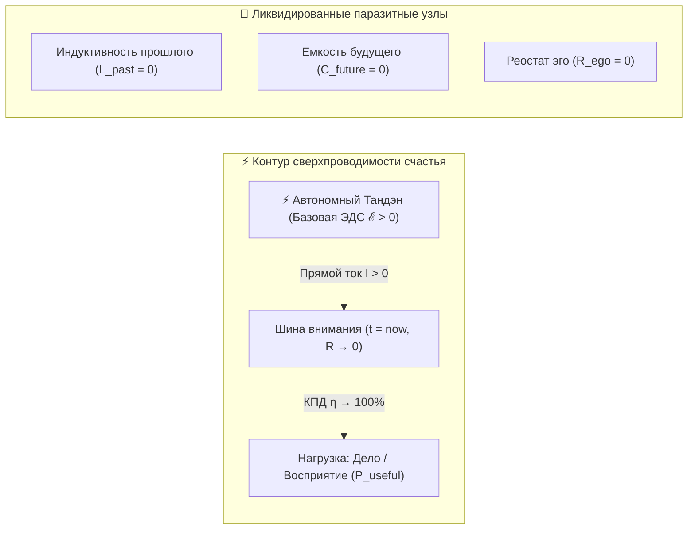

# 22. Канонические определения счастья в Системе Аньянова: Технический базис сверхпроводимости ($R \to 0$), бытовая интуиция и ликвидация парадокса Милля

> [!quote] Главная аксиома Системы Аньянова
> ### **⚡ «Счастье — это режим сверхпроводимости цепи.»**
> — **Владимир Аньянов**

> «Большинство определений счастья в истории человечества страдали либо поэтической туманностью ("счастье — это бабочка, садящаяся на плечо"), либо социологической узостью ("счастье — это уровень дохода и безопасность"). В Системе Аньянова счастье получает строгое двухуровневое определение: абсолютно строгое математико-физическое для инженерии жизни и предельно кристальное житейское для каждого человека.»  
> — **«Система Аньянова»**

---

## ⚡ Фундаментальная формула: 6 слов, изменивших философию

Формула **«Счастье — это режим сверхпроводимости цепи»** является предельной компрессией всей онтологии «Внутреннего тока»:
$$\mathcal{H} \iff (R \to 0, \, I > 0)$$

1. **Это режим, а не трофей:** Счастье — не статичный предмет, который можно купить, заработать или положить на полку. Это текущее динамическое качество проводки сознания в физической точке настоящего момента.
2. **Ликвидация омических потерь ($P_{\text{loss}} = I^2 R = 0$):** Исчезает паразитный нагрев сомнений, тревоги за будущее и самоедства за прошлое. Выгорание невозможно физически, если сопротивление равно нулю.
3. **Беспрепятственное излияние жизни:** Импульс созидания из автономного ядра (Тандэн) напрямую и без задержек преобразуется в чистое полезное действие во внешнем мире.

## 1. Проблема: почему старые определения не работают

Традиционные подходы определяют счастье как **награду за достижение** или как **эмоциональный пик (эйфорию)**. Обе эти парадигмы фатальны:
1. **Иллюзия финиша:** Человек откладывает жизнь на будущее (*«Вот куплю дом, заработаю миллион, найду партнера — тогда стану счастлив»*). Но в момент достижения мозг испытывает лишь короткий дофаминовый всплеск, за которым следует спад.
2. **Путаница причины и следствия:** Психология описывает внешние маркеры счастья (улыбка, расслабление, хорошее настроение), но не объясняет **физический механизм**, порождающий это состояние.

В системе «Внутренний ток» счастье рассматривается не как внешнее имущество или случайный дар, а как **режим функционирования электродинамической цепи сознания**.

Ниже приведены два взаимодополняющих канонических определения.

---

## 2. ⚡ Определение I: Техническое (максимально полное, инженерное)

> [!important] Каноническая техническая формулировка
> **Счастье** — это субъективное переживание режима **сверхпроводимости замкнутого контура внимания ($R \to 0$)**, при котором базовая электродвижущая сила автономного генератора ($\mathcal{E}_{\text{тандэн}}$) беспрепятственно преобразуется в чистое созидательное действие в физической точке настоящего момента ($t = \text{now}$), при полном отсутствии паразитных омических потерь ($P_{\text{loss}} = I^2 R = 0$) на нагрев реактивных сопротивлений времени (индуктивности прошлого $L_{\text{past}}$ и ёмкости будущего $C_{\text{future}}$) и реостата эго ($R_{\text{ego}}$).

### Декомпозиция математико-физических параметров:

$$\mathcal{H} = \lim_{R \to 0, \, I > 0} \left( \frac{P_{\text{useful}}}{P_{\text{total}}} \right) = \frac{\mathcal{E}_{\text{тандэн}} \cdot I - I^2 R}{\mathcal{E}_{\text{тандэн}} \cdot I} \longrightarrow 100\%$$

1. **Автономная ЭДС ($\mathcal{E}_{\text{тандэн}} > 0$):**  
   Энергия генерируется автономным внутренним ядром личности (Тандэн). Человек не пытается «зарядить свой генератор» от внешних лампочек (социального одобрения, статуса, чужих оценок). Вектор тока направлен строго **изнутри наружу** ($I > 0$).
2. **Нулевое омическое сопротивление ($R \to 0$, Мусин):**  
   Внутреннее ментальное трение равно нулю. Мысли, намерения и действия согласованы на 100%. Сигнальная петля внутреннего критика ($k_{\text{critic}}$) отключена; сомнения, самобичевание и страх ошибки не оказывают сопротивления протекающему току.
3. **Отключение реактансов времени ($L_{\text{past}} = 0, C_{\text{future}} = 0$):**  
   Контур внимания заземлен строго в физической точке $t = \text{now}$. Виртуальные утечки — индуктивность вины/ностальгии за прошлое и емкость тревоги/дедлайнов будущего — обесточены.
4. **Нулевой нагрев Джоуля — Ленца ($P_{\text{loss}} = I^2 R = 0$):**  
   Энергия биосистемы не рассеивается в паразитное тепло выгорания, неврозов и соматических спазмов. Вся вырабатываемая мощность целиком направляется в полезную работу.

---

## 3. 🌱 Определение II: Простое человеческое (для тех, кто не знаком с системой)

> [!tip] Каноническая житейская формулировка
> **Счастье** — это **состояние, когда внутри тебя ничего не мешает тебе жить прямо сейчас**. Это ощущение абсолютной лёгкости и ясности, когда всё твоё желание и внимание свободно перетекают в то, что ты делаешь в данную секунду: пьёшь ли ты утренний чай, обнимаешь близкого или решаешь сложную задачу.

### Жизненные метафоры и принципы на пальцах:

#### 1. Метафора садового шланга без заломов
Представьте себе поливочный шланг, подключенный к мощному крану с водой:
* **Несчастье ($R \gg 0$):** Шланг перекручен в трёх местах, завязан в узлы вины за прошлое, пережат коленом страха перед будущим, а внутри застрял мусор сомнений *«а достоин ли я?»*. Вода с трудом сочится каплями, шланг раздувается, гудит и готов разорваться от чудовищного внутреннего давления. Это давление и есть человеческое несчастье, стресс и выгорание.
* **Счастье ($R \to 0$):** Все перегибы расправлены, мусор вымыт. Чистая вода хлынула свободным, мощным, ровным потоком. Никакого натужного скрипа, никакого трения — только свободный напор жизни.

#### 2. Счастье — это не приз на финише, а чистота самого движения
Большинство людей страдают из-за ошибки бегуна: они думают, что счастье прячется за финишной ленточкой (в дипломе, в деньгах, в штампе в паспорте), а всю дистанцию бегут в муках и сжав зубы. Но когда ленточка сорвана, эйфория длится 5 минут, а впереди маячит новая гонка.  
Счастье — это когда ты наслаждаешься каждым шагом, упругим толчком стопы и ветром в лицо прямо во время бега.

#### 3. Свобода от внутреннего суда
В состоянии счастья внутри человека замолкает внутренний прокурор. Вам больше не нужно каждую минуту доказывать миру свою состоятельность, оправдываться за ошибки и унизительно выпрашивать лайки и похвалу. Вы просто действуете с искренней радостью, легко и уверенно.

---

## 4. 🌉 Мост между двумя определениями: Великий Синтез

То, что на физическом уровне называется **падением сопротивления проводки до нуля ($R \to 0$)**, на субъективном языке человека переживается как:

| Инженерная физика цепи | Субъективное переживание человека | Термин мировой культуры |
| :--- | :--- | :--- |
| $\mathcal{E}_{\text{тандэн}} > 0, I > 0$ (Прямой ток из ядра) | Чувство искреннего вдохновения и опоры на себя | **Тандэн** (Дзен) / **Автаркия** (Стоицизм) |
| $R \to 0$ (Сверхпроводимость цепи) | Действие без мысленного сопротивления и сомнений | **Мусин** (無心, Ум без ума) / **Поток** (Чиксентмихайи) |
| $t = \text{now}$ (Физическое заземление) | Тотальное присутствие в органах чувств | **Здесь и сейчас** / **Итиго Итиэ** (一期一会) |
| $Q = I^2 R t \approx 0$ (Нет омического нагрева) | Легкость в теле, ясная голова, прилив сил | **У-вэй** (無為, Деяние через недеяние) |
| Circuit Breaker = ARMED (Защита Дзансин) | Невозмутимость при внешних кризисах и ошибках | **Фудосин** (不動心, Непоколебимый дух) / **Кинцуги** |

---

## 5. 🔍 Связь с вопросом «Счастлив ли я?» (Ликвидация парадокса Милля)

Знаменитый парадокс Джона Стюарта Милля (*«Спроси себя, счастлив ли ты, и ты перестанешь быть счастлив»*) теперь получает окончательное разрешение:

1. **Почему вопрос Милля выбивает из счастья?**  
   Потому что этот вопрос — оценочный. Он заставляет человека оторвать внимание от действия ($t = \text{now}$) и замкнуть ток на реостат эго ($R_{\text{ego}}$), запуская мучительное сравнение себя с абстрактными идеалами.
2. **Как система «Внутренний ток» решает эту дилемму?**  
   Она переводит вопрос из плоскости самокопания в плоскость **объективной телеметрии контура** (см. подробнее [[21-the-am-i-happy-question-and-circuit-telemetry|Главу 21: Ответ на вопрос «Счастлив ли я?» и 5 датчиков телеметрии]]):
   * Если ваш контур в режиме сверхпроводимости ($I > 0, R \to 0, t = \text{now}$) — **вы счастливы по законам физики**, и вам даже незачем задавать этот вопрос.
   * Если вы почувствовали внутреннее трение — вы не впадаете в депрессию, а за 30 секунд калибруете контур: размыкаете петлю Эго, делаете три вдоха в Тандэн и возвращаетесь к чистому действию в Мусин.

---

## 🔗 Связанные главы
- [[01-core-topology|01. Базовая топология цепи и закон полярности]]
- [[02-superconductivity-and-presence|02. Физика присутствия: состояние сверхпроводимости (R → 0)]]
- [[Inner Current (Fundamental Laws of the Happiness Thermodynamics)|20. Фундаментальные законы термодинамики счастья]]
- [[21-the-am-i-happy-question-and-circuit-telemetry|21. Ответ на вопрос «Счастлив ли я?»: Парадокс Милля и 5 датчиков телеметрии]]
- [[19-human-self-check-protocol-and-sensation-translator|19. Как человеку читать свой контур: транслятор ощущений]]
- [[Inner Current - MOC|Inner Current MOC — Мастер-карта цепи]]
