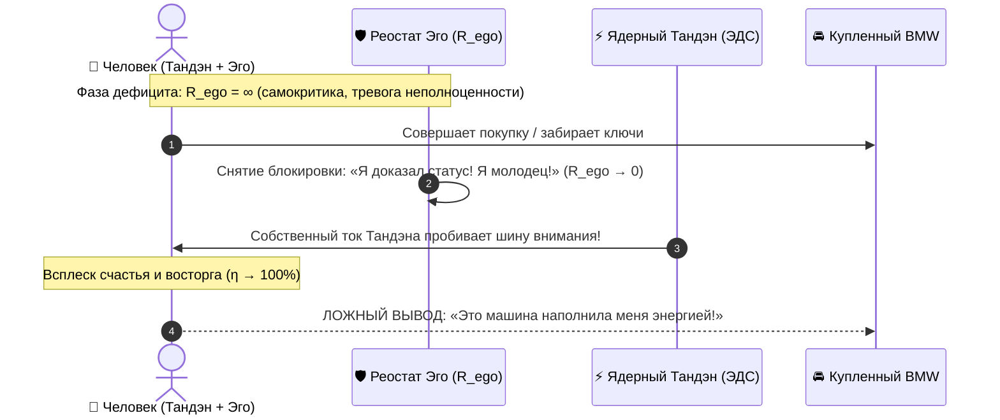
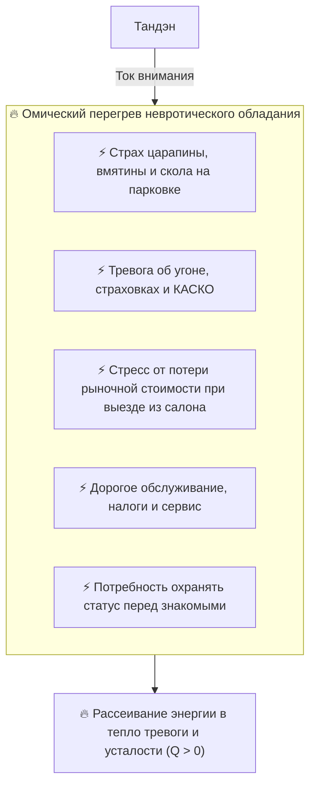

# 23. Иллюзия аккумулятора вещей: Пустотность материи, парадокс BMW и физика консьюмеризма

[← К оглавлению](file:///c:/Users/vanya/Antigravity%20Projects/Apps/Inner%20Current/wiki/index.md)

---

> «Вещь не хранит внутри себя ни единого ватта радости. Она абсолютно пустотна. Думать, что дорогой автомобиль отдаст тебе жизненную энергию — всё равно что подключить выключенную лампочку к другой лампочке и ждать, что она загорится.»  
> — **Владимир Аньянов, «Архитектура счастья (Inner Current)»**

---

## 1. Экзистенциальный тупик консьюмеризма: Проблема «Мёртвого аккумулятора»

Каждый человек хотя бы раз сталкивался с парадоксом покупок:
* Долгожданное приобретение — будь то новый смартфон, часы, брендовая одежда, квартира или премиальный автомобиль (BMW, Porsche) — обещает перевернуть жизнь.
* Человек работает на пределе сил, терпит стресс, преодолевает препятствия, предвкушая момент обладания.
* Наступает день покупки: в первые часы и дни накатывает эйфория, гордость, прилив сил.
* Но проходит две-три недели — и волшебство бесследно испаряется. Внутри остаётся та же самая фоновая пустота, тревога или скука. Машина стоит на парковке, телефон лежит на столе, а счастья нет.

Наивная бытовая психология называет это «гедонистической адаптацией». Но она не объясняет **физический механизм** поломки.

В инженерной онтологии **Inner Current** этот сбой квалифицируется как **фундаментальная иллюзия внешнего аккумулятора** — попытка запитать собственную обесточенную энергосистему от пассивного куска материи.

---

## 2. Физический закон цепи: $\mathcal{E}_{\text{tanden}} \neq 0, \quad \mathcal{E}_{\text{matter}} \equiv 0$

Вся электродинамика человеческого контура строится на незыблемом законе полярности:

$$\mathcal{E}_{\text{tanden}} > 0, \quad \mathcal{E}_{\text{load}} \equiv 0$$

```mermaid
flowchart TD
    subgraph Delusion ["🚫 ОШИБОЧНАЯ МОДЕЛЬ (Иллюзия консьюмеризма)"]
        direction LR
        BMW_Fake["🚘 ВЕЩЬ / BMW<br/><i>(Мнимый аккумулятор с чужой энергией)</i>"]
        Man_Dead["👤 Опустошённый человек<br/><i>(Приёмник тока, ждущий заряда)</i>"]
        BMW_Fake -.->|"КЗ на Эго (I_load = 0) — ток уходит в эго-петлю"| Man_Dead
    end

    subgraph Reality ["⚡ ИСТИННАЯ ТОПОЛОГИЯ ЦЕПИ (Inner Current)"]
        direction LR
        Tanden["⚡ ТАНДЭН (丹田)<br/><i>(Единственный генератор ЭДС > 0)</i>"]
        Attention["Канал внимания<br/><i>(Мусин, R → 0)</i>"]
        BMW_Real["🚘 ОБЪЕКТ / BMW<br/><i>(Пустотная нагрузка R_load, инструмент)</i>"]
        Light["✨ Чистое действие<br/><i>(Вождение, скорость, восторг момента)</i>"]

        Tanden ==>|"Прямой ток I > 0"| Attention
        Attention ==>|"Мощность P = I² · R_load"| BMW_Real
        BMW_Real ==> Light
    end
```

### Онтологический статус материи: Шуньята (Пустотность)

1. **Материя не имеет сознательной ЭДС:**  
   Ни инженеры в Баварии, ни рабочие на фабрике, ни дизайнеры интерьеров не могут физически запаять в металл, пластик или кожу ни одного джоуля душевного покоя, уверенности в себе или радости.
2. **Вещь — это всегда терминатор нагрузки ($R_{\text{load}}$):**  
   По законам цепи нагрузка является **потребителем** мощности, а не её источником. Она может трансформировать входящий ток в излучение (свет, движение, звук), но сама по себе она абсолютно нейтральна и холодна.
3. **Иллюзия аккумулятора:**  
   Человек воображает, будто дорогой автомобиль — это химический аккумулятор, в котором законсервирована жизненная сила высокого порядка. Он думает: *«Я куплю BMW, и этот аккумулятор будет непрерывно отдавать мне энергию каждый раз, когда я подхожу к нему»*. Но подключение пустого контура к пустому объекту даёт ровно **ноль ампер**.

---

## 3. Анатомия подмены: Откуда берётся эйфория в момент покупки?

Если вещь пуста, почему же в момент покупки человек действительно ощущает мощный прилив энергии?

Здесь кроется тончайшая когнитивная галлюцинация — **подмена причины и следствия**:

### Механизм «Социального разрешения на счастье»:
1. **Хронический зажим эго:** В обычном состоянии человек держит высокий уровень внутреннего сопротивления ($R_{\text{ego}} \gg 0$). Он считает себя недостаточно успешным, неполноценным, незащищённым, непрерывно сжигая ток в омических симуляциях тревоги ($Q = I^2 R t$).
2. **Сброс реостата:** Факт покупки дорогого престижного символа выступает для эго своеобразным «паспортом безопасности». Эго временно отключает сигнальную петлю критика: *«Мы на вершине. Можно расслабиться»*.
3. **Прорыв собственного тока:** Сопротивление падает до нуля ($R \to 0$). В этот краткий миг **его собственный Тандэн** беспрепятственно пускает мощный поток присутствия в органы чувств. Человек вдыхает запах нового салона, видит блеск приборной панели, ощущает ускорение.
4. **Фатальная ошибка проекции:** Не понимая электродинамики, человек приписывает этот внутренний свет внешней форме: *«Какая невероятная машина! Как много сил она мне даёт!»*. Но машина была лишь зеркалом, перед которым он сам на секунду разрешил себе стать сверхпроводником.

---

## 4. Омический капкан владения: как вещь превращается в паразитный резистор

Когда эйфория спадает (мозг привыкает к новой визуальной картинке), эго неизбежно активирует свой реостат обратно: появляются новые амбиции, сравнения и страхи. 

Но теперь в контуре появляется дополнительная паразитная нагрузка:

$$Q_{\text{anxiety}} = I^2 \cdot R_{\text{possessions}} \cdot t$$

Вместо мнимого «источника подпитки» вещь становится **термодинамической дырой**:
* Человек начинает обслуживать предмет, переживать за него, тратить когнитивный ресурс внимания на охрану формы.
* «То, чем ты владеешь, в итоге владеет тобой» — физически это означает, что проводка вашего внимания закорочена на обслуживание пассивного сопротивления железного объекта.

---

## 5. Калибровка по канонам Кансо: Как правильно владеть вещами

Означает ли физика пустотности, что созидатель должен уйти в аскезу, отказаться от комфорта и ездить на разваливающемся велосипеде? 

**Категорически нет.** Дзен-инженерия не отрицает форму — она очищает отношение к ней от невротических проекций.

| Парадигма | Невротический консьюмеризм | Дзен-инженерия (Inner Current) |
| :--- | :--- | :--- |
| **Роль вещи** | «Аккумулятор» энергии и статуса | Высокоточный инструмент проводимости ($R_{\text{load}}$) |
| **Ожидание** | «Она сделает меня счастливым и зарядит» | «Она идеально исполнит полезную функцию» |
| **Источник радости**| Сама форма / бренд / шильдик | Чистый ток присутствия в процессе использования |
| **Отношение к поломке** | Экзистенциальная трагедия и крах эго | Спокойный протокол Дзансин и Ваби-саби (ремонт/замена) |
| **Уровень шума** | Высокий омический нагрев тревоги ($Q \gg 0$) | Нулевое сопротивление в моменте ($R \to 0$, Кансо) |

### Практический пример: вождение BMW по канонам Дзен-инженерии

Когда иллюзия аккумулятора демонтирована:
1. Вы садитесь за руль автомобиля не для того, чтобы «высосать из него энергию», а **с полным Тандэном**, направляя свой ток наружу.
2. Включение режима **Мусин** ($R \to 0$): внимание сливается с дорогой, траекторией, откликом подвески, сцеплением шин с асфальтом в физической точке $t = \text{now}$.
3. Реализуется принцип **Итиго Итиэ (一期一会)**: каждый поворот руля, каждое торможение — это завершённое, совершенное действие, не отравленное мыслями о том, как вы выглядите со стороны.
4. Автомобиль становится превосходным, сбалансированным резонатором вашего внутреннего тока — но вы ни на секунду не забываете, что **мотор радости работает только внутри вашей груди**.

---

## 6. Чек-лист калибровки перед покупкой: «Тест на аккумулятор»

Перед тем как совершить крупную статусную покупку, дзен-инженер прогоняет решение через 3 диагностических фильтра:

1. **Вопрос об источнике (Тест на ЭДС):**  
   *«Жду ли я, что эта покупка избавит меня от чувства внутренней пустоты, скуки или неуверенности?»*  
   *Если да — стоп. В вещи нет генератора. Вы пытаетесь подключиться к мертвому проводу.*
2. **Вопрос об инструменте (Тест на Кансо):**  
   *«Является ли этот предмет чистым, качественным продолжением моего действия и жизни, которым я буду пользоваться в $t=\text{now}$ с радостью созидания?»*  
   *Если да — покупайте с легким сердцем. Это отличная нагрузка.*
3. **Вопрос о паразитной емкости (Тест на омический нагрев):**  
   *«Сколько ампер моего фонового внимания сгорит на страх повредить, потерять или обслужить эту вещь?»*  
   *Если омические потери $Q$ превышают полезность инструмента — контур станет токсичным.*

---

## 7. Резюме главы

1. **Вещи пустотны по своей природе (Шуньята).** Ни одна вещь не способна генерировать или аккумулировать ток сознания: $\mathcal{E}_{\text{load}} \equiv 0$.
2. **Иллюзия аккумулятора** — это когнитивная ошибка, при которой кратковременный сброс собственного сопротивления эго ($R_{ego} \to 0$) ошибочно принимается за приток энергии из внешнего предмета.
3. Попытка искать счастье в покупках неизбежно приводит к **омическому перегреву владения** ($Q = I^2 R t$) и разочарованию.
4. Истинное мастерство жизни по Системе Аньянова — наполнять мир вещей своим собственным током из Тандэна, превращая качественные инструменты в чистое продолжение свободного действия.

---

## 8. Мастер-ключ: Шуньята как разрядник иллюзии

Почему одного понимания «гедонистической адаптации» недостаточно, а осознание **Шуньяты** — достаточно?

Потому что «гедонистическая адаптация» — это описание симптома. Шуньята — это **разоблачение архитектурной лжи на уровне схемы**.

Ключевое различие:

| Уровень понимания | Формулировка | Эффект |
| :--- | :--- | :--- |
| Психологический (симптом) | «Человек привыкает к вещам» | Временное утешение: «надо покупать реже» |
| Физический (схема) | «$\mathcal{E}_{\text{load}} \equiv 0$, вещь пустотна (Шуньята)» | Полный демонтаж иллюзии: **ждать нечего в принципе** |

Когда осознание Шуньяты происходит на уровне **физического факта** (не метафоры, а закона цепи), в психике происходит немедленное **аппаратное шунтирование**:
- Исчезает накопленное напряжение ожидания (*«когда я это куплю, всё изменится»*).
- Реостат эго теряет питание ($R_{ego} \to 0$).
- Ток из Тандэна беспрепятственно течёт в настоящий момент.

> «Форма есть пустота, пустота есть форма» (*Rūpaṃ śūnyatā, śūnyataiva rūpam*) — Сутра Сердца.  
> В системе Inner Current: форма — геометрия нагрузки, и **только**. Ток, который заставляет её сиять, всегда идёт из Тандэна.

**Связанные главы:** [[15-engineering-epistemology-and-bitcoin-law|15. Инженерный критерий истины]] · [[24-closed-thermodynamic-system-as-criterion-of-truth|24. Замкнутая система как критерий истины]]

