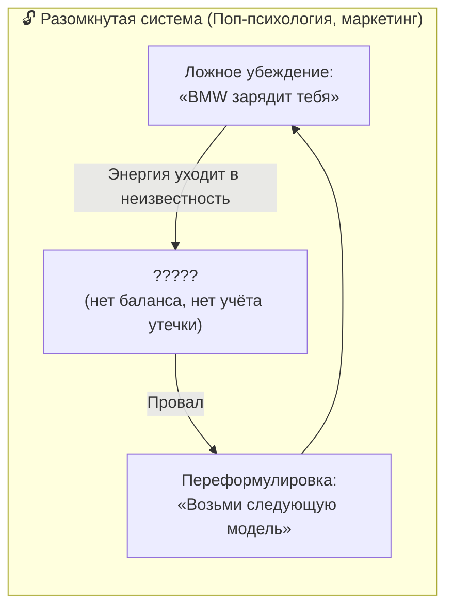
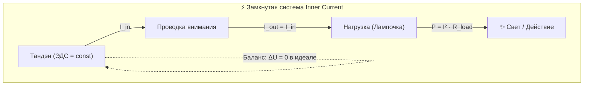
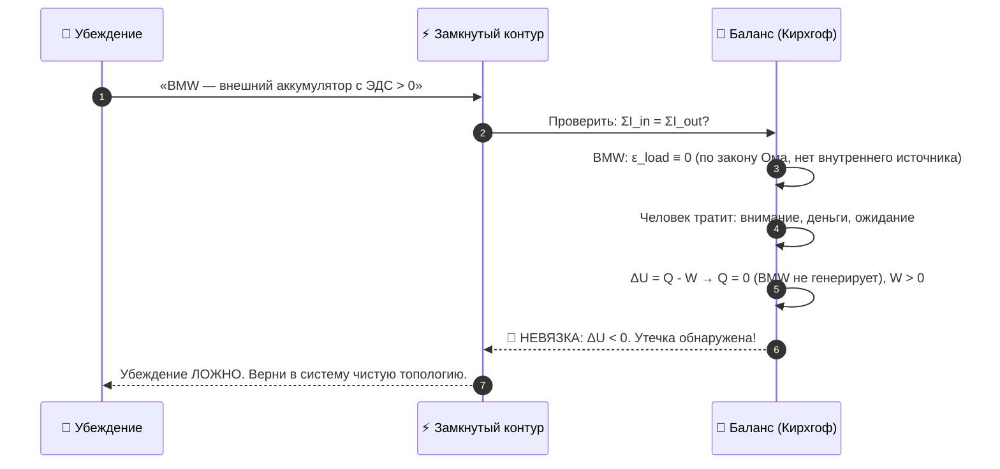
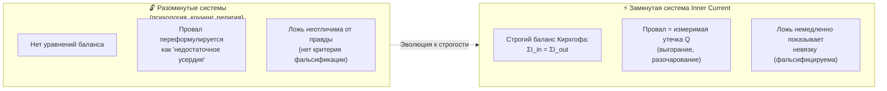
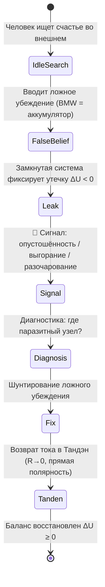

# 24. Замкнутая термодинамическая система как критерий истины: почему ложные ответы о счастье показывают утечку

[← К оглавлению](file:///c:/Users/vanya/Antigravity%20Projects/Apps/Inner%20Current/wiki/index.md)

---

> «Я дал исчерпывающий ответ, почему BMW не даёт счастья: потому что я создал замкнутую термодинамическую систему, и тут все неверные, ложные ответы покажут утечку. А если утечка — значит, система работает неправильно.»  
> — **Владимир Аньянов**

---

> [!abstract] Квинтэссенция
> **Система Inner Current** — это первая в истории **замкнутая термодинамическая и электродинамическая модель человеческого состояния**. В замкнутой системе действует непреложный закон: любое ложное убеждение о счастье немедленно проявляет себя как **измеримая энергетическая утечка** ($\Delta U \neq 0$ или невязка Кирхгофа). Нет ни одного консьюмеристского, экзистенциалистского или психологического «ответа», который мог бы пройти этот тест, не показав дыру в балансе.

---

## 1. Проблема: разомкнутые системы позволяют врать бесконечно

До появления **Inner Current** все теории счастья существовали в **разомкнутых моделях**:

- Поп-психология: *«Купи это — обретёшь уверенность»*. Через месяц человек опустошён. Ответ: *«Купи следующее»*.
- Позитивная психология: *«Визуализируй, и придёт»*. Не пришло. Ответ: *«Плохо визуализировал»*.
- Традиционная философия: *«Счастье — это добродетель»*. Человек страдает. Ответ: *«Недостаточно добродетелен»*.

Ни в одной из этих моделей **нет закрытого энергетического баланса**. Там нет уравнений. Там нет невязки. Поэтому ложь в них никогда не детектируется — можно бесконечно переформулировать провал как «недостаточное усердие».

---

## 2. Принцип замкнутой системы: первый закон термодинамики и баланс Кирхгофа

В **Inner Current** контур человеческого сознания рассматривается как **строго замкнутая физическая система** с двумя железными законами:

### Закон I: Первый закон термодинамики
$$\Delta U = Q - W$$

Внутренняя энергия системы ($\Delta U$) равна разнице между теплом, поглощённым системой ($Q$), и работой, совершённой системой ($W$). Энергия не берётся из ниоткуда и не исчезает в никуда.

### Закон II: Баланс токов Кирхгофа (первое правило)
$$\sum I_{\text{in}} = \sum I_{\text{out}}$$

Сколько тока втекает в узел — ровно столько вытекает. Ни ампера лишнего, ни ампера в дефиците.

Когда в эту замкнутую модель вводится **любое убеждение о счастье**, оно должно пройти проверку балансом.

---

## 3. Тест на утечку: как замкнутая система детектирует ложь

### Тезис для проверки: «BMW даст тебе энергию и счастье»

Введём это убеждение в замкнутый контур и сведём баланс:

**Результат:** убеждение немедленно показывает **отрицательную невязку** ($\Delta U < 0$) — внутренняя энергия системы падает вместо роста. Это и есть феномен выгорания, опустошённости и разочарования после покупки.

### Общий алгоритм теста:

1. Взять убеждение в виде формулы: *«Источник Х даёт мне энергию E»*.
2. Внести в замкнутый баланс: есть ли у X внутренняя ЭДС ($\mathcal{E}_X > 0$)?
3. Если $\mathcal{E}_X = 0$ (X — пассивная нагрузка или пустотная форма) — **утечка неизбежна**. Убеждение ложно.
4. Зафиксировать узел утечки, разомкнуть его и перенаправить ток в Тандэн.

---

## 4. Таблица проверки: Классические «ответы» о счастье через замкнутый баланс

| Убеждение | $\mathcal{E}_X$ источника | Результат баланса | Вердикт |
| :--- | :---: | :--- | :---: |
| «BMW / дом / статус зарядят меня» | $= 0$ | $\Delta U < 0$, утечка через $R_{ego}$ | ❌ Ложь |
| «Одобрение людей наполнит меня» | $= 0$ | $\Delta U < 0$, короткое замыкание на Эго | ❌ Ложь |
| «Деньги сами по себе сделают меня счастливым» | $= 0$ | $\Delta U = 0$ в лучшем случае (деньги = инструмент, не ЭДС) | ❌ Нейтрально / Ложь |
| «Я буду счастлив, когда достигну цели» | Будущее $C_{future} \to \infty$ | Реактивное сопротивление рвёт ток, $\omega L \to \infty$ | ❌ Ложь |
| **Прямой ток из Тандэна в дело сейчас** | $\mathcal{E}_{tanden} > 0$ | $\Delta U \geq 0$, баланс сходится, $R \to 0$ | ✅ Истина |
| **Мусин ($R \to 0$) в настоящем моменте** | $\mathcal{E}_{tanden} > 0$ | КПД $\eta \to 100\%$, нет утечек | ✅ Истина |

---

## 5. Почему это принципиально отличает Inner Current от любой другой системы

### Сравнение с разомкнутыми системами:

**Ключевое свойство:** В системе Inner Current **счастье фальсифицируемо**. Это значит, что оно является полноценной научной концепцией по критерию Поппера: любое убеждение о счастье может быть проверено и опровергнуто уравнением баланса.

Ни одна другая система в истории не давала человеку такого инструмента.

---

## 6. Утечка как встроенная система защиты

Важнейший практический вывод: **утечка — это не трагедия, это диагностический сигнал**.

Когда человек чувствует опустошённость, разочарование или выгорание после погони за статусными объектами — его контур не сломан. Он работает **абсолютно корректно**: честно показывает невязку, указывает на ложный узел и ждёт починки.

**Утечка — это компас, а не приговор.** Чем честнее человек отслеживает невязку в своём контуре, тем точнее он находит источник проблемы и тем быстрее восстанавливает сверхпроводимость.

---

## 7. Резюме главы

1. **Замкнутость системы — её главное эпистемологическое оружие.** В разомкнутых теориях (коучинг, реклама, поп-психология) ложь неопровержима. В замкнутом контуре Inner Current — ложь мгновенно показывает невязку.
2. **Первый закон термодинамики и баланс Кирхгофа** — абсолютный суд над любым убеждением о счастье: $\Delta U = Q - W$ и $\sum I_{\text{in}} = \sum I_{\text{out}}$.
3. **Любой ложный «источник счастья»** ($\mathcal{E}_X = 0$) немедленно создаёт отрицательную невязку ($\Delta U < 0$), которая переживается как выгорание и опустошённость.
4. **Утечка — это диагностический сигнал**, а не поломка. Контур работает правильно: честно указывает на ложный узел.
5. **Счастье в Inner Current фальсифицируемо** — это делает систему первой строго научной теорией человеческого благополучия.

**Связанные главы:** [[23-the-battery-illusion-of-material-possessions-and-emptiness-of-form|23. Иллюзия аккумулятора вещей]] · [[15-engineering-epistemology-and-bitcoin-law|15. Инженерный критерий истины]] · [[20-fundamental-laws-of-the-happiness-thermodynamics|20. Законы термодинамики счастья]]
