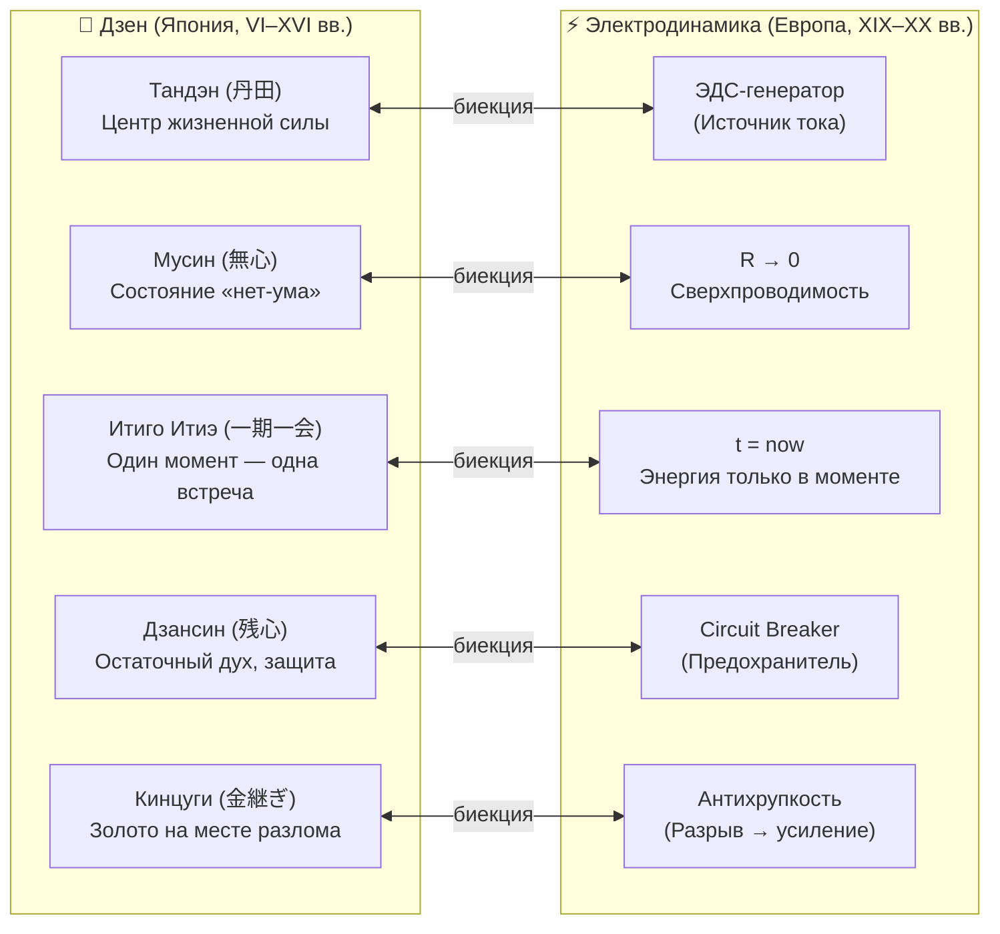
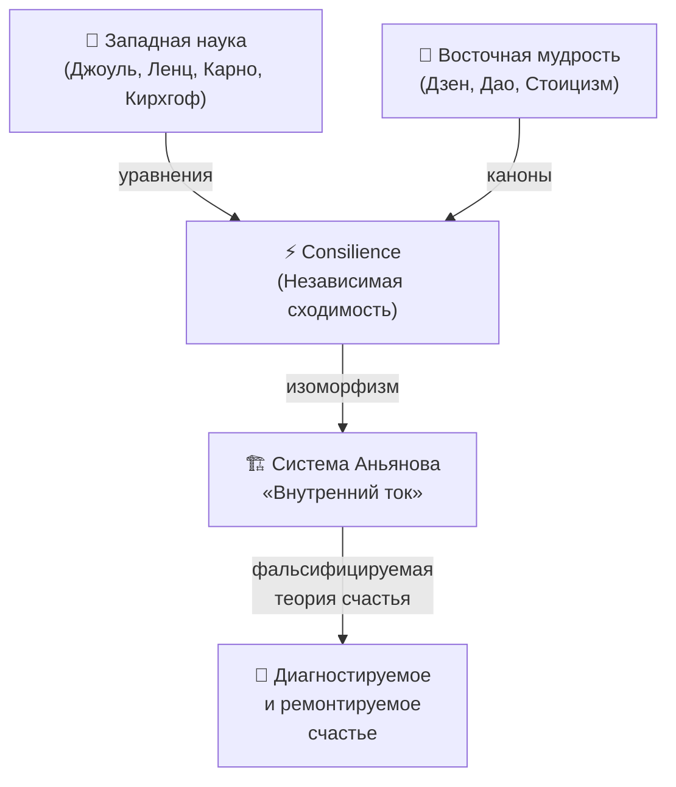

# 25. Синтез дзена и термодинамики как прорыв в понимании счастья

> «Дзен и физика разрабатывались независимо — один в монастырях Японии, другая в лабораториях Европы. Когда мы обнаружили, что они описывают одно и то же уравнение, — это было не случайным совпадением. Это был сигнал, что оба языка указывают на структуру реальности.»  
> — **Владимир Аньянов, «Система Аньянова»**

---

## 1. Что произошло: обнаружение изоморфизма

На протяжении истории дзен и термодинамика развивались в параллельных вселенных: одна — в монастырях и чайных домиках Японии и Китая, другая — в лабораториях Карно, Джоуля и Ленца. Никто не ставил задачу их объединить.

**«Внутренний ток» обнаружил структурный изоморфизм** — математически точное взаимно-однозначное соответствие (биекцию) между понятиями двух систем. Это не метафора и не поэзия. Это **Consilience** (принцип независимой сходимости): когда два независимых метода описания реальности дают одинаковые уравнения — вероятность того, что оба ошибаются, стремится к нулю.

---

## 2. Таблица изоморфизма: дзен и физика цепи

| Дзен-канон | Физический аналог | Уравнение | Инженерный смысл |
|:---|:---|:---:|:---|
| **Тандэн (丹田)** — центр внутренней силы | ЭДС-генератор $\mathcal{E}$ | $\mathcal{E} = \text{const}$ | Источник тока — автономен, не зависит от внешних условий |
| **Мусин (無心)** — нет-ума, нет сопротивления | Сверхпроводимость $R \to 0$ | $Q = I^2 R t \to 0$ | Внимание без паразитных потерь на трение мысли |
| **Итиго Итиэ (一期一会)** — каждый момент уникален | $t = t_{\text{now}}$, $I > 0$ | $P = \mathcal{E} \cdot I$ | Мощность передаётся только в настоящем; прошлое и будущее — обрыв цепи |
| **Дзансин (残心)** — остаточный дух, бдительность | Circuit Breaker $\Delta I / \Delta t$ | $\frac{d I}{d t} > I_{\text{threshold}}$ | Защита реактора от перегрузки и короткого замыкания на эго |
| **Кинцуги (金継ぎ)** — золото на шраме | Антихрупкость, упрочнение | $R_{\text{after}} < R_{\text{before}}$ | Разрыв в прошлом снижает суммарное сопротивление системы |
| **Кансо (簡素)** — простота, очищение | Минимизация паразитного $R$ | $R_{total} = \sum R_i \to \min$ | Каждый лишний элемент — лишнее сопротивление и потеря мощности |
| **Сатори (悟り)** — мгновенное просветление | Переход в сверхпроводящую фазу | $R: R_0 \to 0$ (фазовый переход) | Критический момент, после которого цепь работает без потерь |

---

## 3. Почему это прорыв: три следствия синтеза

### 3.1 Счастье становится фальсифицируемым

До «Внутреннего тока» теории счастья были **нефальсифицируемы**: «будь благодарен», «живи в моменте», «найди смысл» — невозможно проверить, правда это или нет.

Синтез дзена и термодинамики впервые делает счастье **инженерно проверяемым**:

$$\mathcal{H} = \eta = \frac{P_{\text{useful}}}{P_{\text{total}}} = \frac{I^2 \cdot R_{\text{load}}}{I^2 \cdot (R_{\text{ego}} + R_{\text{load}})} = 1 - \frac{R_{\text{ego}}}{R_{\text{ego}} + R_{\text{load}}}$$

> [!IMPORTANT] Критерий Поппера выполнен
> Если $\mathcal{H} \to 1$ при снижении $R_{\text{ego}}$ и росте $I$ — теория верна. Если нет — теория ложна. Это первая **фальсифицируемая** теория счастья.

### 3.2 «Счастлив ли я?» — вопрос к телеметрии, не к уму

Традиционный подход — задать себе оценочный вопрос. По Миллю, это немедленно разрушает состояние счастья: рефлексия выдёргивает рубильник.

Синтез даёт **инженерную замену**: не «Счастлив ли я?» (субъективный суд), а «Каковы показания датчиков?»

| Датчик | Дзен-понятие | Вопрос без рефлексии |
|:---|:---|:---|
| $R$ — сопротивление | Мусин (状態) | «Есть ли трение между мной и тем, что я делаю?» |
| $I$ — ток внимания | Тандэн (活力) | «Есть ли внутреннее движение, или я стою?» |
| $t = \text{now}$ | Итиго Итиэ (現在) | «Здесь ли я сейчас, или в симуляции?» |
| $Q$ — тепловые потери | Эго-утечка | «Куда уходит энергия, которая не доходит до нагрузки?» |
| Дзансин (активен?) | Circuit Breaker | «Есть ли у меня граница, которую я защищаю?» |

### 3.3 Великий синтез Востока и Запада

Дзен веками был недоступен «западному уму» — казался мистикой, коанами, иррациональностью. Термодинамика была недоступна «восточной душе» — казалась сухой механикой без духа.

Синтез **снимает оба барьера**:
- Западный инженер получает **точные уравнения** для понятий, которые раньше казались ненаучными.
- Восточная традиция получает **математическое подтверждение** своей правоты через независимую систему.

---

## 4. Ответ на вопрос «Счастлив ли я?»

В рамках синтеза дзена и термодинамики вопрос «Счастлив ли я?» получает **инженерный ответ без рефлексивного тупика**. Запускаем 30-секундный протокол:

### Шаг 1 — Проверка Тандэна (генератора)
> Делаю ли я что-то прямо сейчас из **внутренней** мотивации, или исполняю чужой скрипт?

- ✅ Внутренняя — Тандэн активен, ток есть.
- ❌ Внешний скрипт — ЭДС снижена, генератор не в режиме.

### Шаг 2 — Проверка R (сопротивления)
> Есть ли **трение** между мной и тем, что я делаю прямо сейчас?

- ✅ Трения нет — $R \to 0$, состояние Мусин, сверхпроводимость.
- ❌ Есть трение — $R > 0$: ищем источник (симуляции прошлого/будущего, суд над собой, страх).

### Шаг 3 — Проверка 6 ламп
> Какие из 6 каналов (Машина, Дом, Карьера, Отношения, Здоровье, Развлечения) горят? Все гасить не нужно — **закон сохранения мощности** разрешает фокус.

### Шаг 4 — Вспышка Сатори (ответ)

> [!TIP] Главный секрет
> Ответ на вопрос «Счастлив ли я?» — это **первое ощущение до анализа**. Дзен называет это **Сатори** — прямое знание до слов. Физика называет это **нулевой задержкой телеметрии**. Тот, кто задаёт вопрос и сразу начинает думать — уже запустил паразитный компаратор $R_{\text{ego}}$.

---

## 5. Практическое следствие: почему синтез работает как инструмент

| Традиционный подход | Подход «Внутренний ток» |
|:---|:---|
| «Будь счастливее» — расплывчато | «Снизь $R_{\text{ego}}$» — конкретно |
| Работает с нарративами | Работает с уравнениями |
| Нефальсифицируемо | Фальсифицируемо |
| Требует самооценки (рефлексии) | Опрашивает телеметрию (датчики) |
| Субъективно для каждого | Законы физики — объективны |
| Описывает симптомы | Диагностирует неисправность |

---

## 6. Связанные статьи

- [[02-superconductivity-and-presence|02. Физика присутствия: состояние сверхпроводимости]] — подробное описание $R \to 0$ и Мусин.
- [[12-zen-as-happiness-architecture-foundation|12. Дзен как фундамент Архитектуры счастья]] — исторический и философский базис.
- [[13-complete-zen-electrodynamic-ontological-atlas|13. Полный онтологический атлас: Биекция 23 канонов Дзен]] — исчерпывающая таблица изоморфизма.
- [[20-fundamental-laws-of-the-happiness-thermodynamics|20. Фундаментальные законы термодинамики счастья]] — шесть инвариантных законов системы.
- [[21-the-am-i-happy-question-and-circuit-telemetry|21. Ответ на вопрос «Счастлив ли я?»: Парадокс Милля и 5 датчиков]] — детальный протокол опроса контура.
- [[24-closed-thermodynamic-system-as-criterion-of-truth|24. Замкнутая термодинамическая система как критерий истины]] — фальсифицируемость теории.

---
*Создано: 2026-09-23 | Система Аньянова — «Внутренний ток»*
