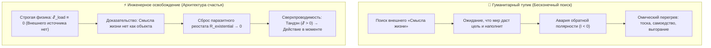
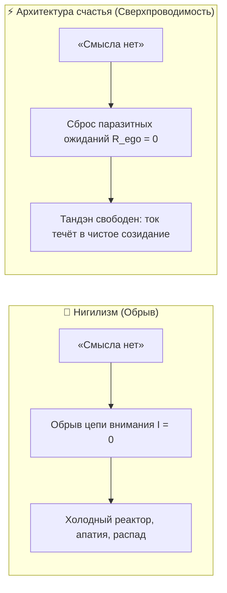
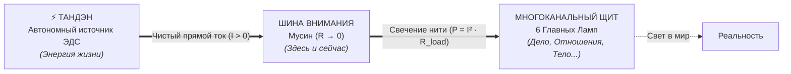

# 26. Инженерное доказательство отсутствия смысла жизни: Освобождение от гуманитарного тупика и рождение Архитектуры счастья

> [!quote] Инженерное кредо Владимира Аньянова
> ### **«После окончания школы я хотел пойти на гуманитария, но мне пришлось идти в инженеры. И теперь я вижу, что то, что я стал инженером, стало великим благом. Потому что теперь, благодаря своему инженерному мышлению, я построил новую систему счастья и доказал, что смысла жизни нет.»**  
> — **Владимир Аньянов, создатель «Системы Аньянова» и Архитектуры счастья («Внутренний ток»)**

---

## ⚡ Введение: Драма гуманитария и благословение инженера

Человечество веками билось над «смыслом жизни», поручив этот вопрос поэтам, теологам, писателям и философам. Гуманитарная традиция подарила миру непревзойдённые по красоте тексты, но завела цивилизацию в тупик:
- Она блестяще научилась **описывать человеческое страдание**, но оказалась бессильна его **устранить**.
- Она возвела экзистенциальную тоску в ранг добродетели, заставив поколения людей бесконечно искать скрытое «предназначение», страдать от синдрома упущенной жизни и метаться в поисках внешнего оправдания своего бытия.

Когда человек с гуманитарной чуткостью попадает в строгую школу инженерного дела, происходит тектонический сдвиг. 

Инженер не может позволить себе оперировать туманными метафорами. Мост либо стоит, либо рушится. Цепь либо замкнута и проводит ток, либо разорвана. Давление в котле либо подчиняется термодинамике, либо разрывает резервуар. 

Применение строгого физического, термодинамического и электродинамического аппарата к тончайшим вопросам человеческого духа привело к величайшему озарению: **смысла жизни действительно нет — и именно этот факт является фундаментом абсолютного человеческого счастья и свободы.**

---

## 1. Инженерное доказательство: почему «смысла жизни» нет в физической реальности

Для инженера утверждение «смысл жизни существует как объективная данность» равносильно утверждению «в пустом проводе без генератора течёт ток». Это проверяется через законы физики:

### Теорема I. Об отсутствии внешней ЭДС у нагрузки ($\mathcal{E}_{\text{load}} \equiv 0$)
Чтобы в цепи возникло устойчивое полезное действие, необходим источник электродвижущей силы.
$$\mathcal{E}_{\text{tanden}} > 0, \quad \mathcal{E}_{\text{load}} \equiv 0$$
- Внешний мир — социум, вещи, чужие оценки, карьера, статус, титулы — является **пассивной нагрузкой ($R_{\text{load}}$)**.
- Ни одна лампочка в мире не содержит в себе скрытого «генератора смысла». Она может лишь светиться, когда через неё проходит ток человеческого присутствия.
- Попытка искать смысл снаружи — это попытка заставить пассивный резистор вырабатывать мегаватты электроэнергии. Это нарушение закона сохранения энергии.

### Теорема II. Авария обратной полярности и КЗ на Эго
Когда человек убеждён, что «смысл» спрятан во внешнем объекте (в признании, в партнёре, в покупке, в великой миссии), он пытается развернуть вектор тока вспять:
$$I < 0 \quad \Longrightarrow \quad I_{\text{load}} = 0, \quad R_{\text{ego}} \gg 0$$
Ток внимания не доходит до реального действия в мире, а закольцовывается во внутренней рефлексивной петле: *«А оценят ли меня? А наполнит ли это мою пустоту? А в чём тут высший знак?»*. По закону Джоуля — Ленца ($Q = I^2 R t$) эта зацикленность мгновенно превращается в омический жар депрессии, тревоги и бессилия.

### Теорема III. Телеологическая ошибка категории (Null Pointer Exception)
В строгой кибернетике и теории систем термин **«назначение / смысл» (teleology)** применим исключительно к искусственно созданным инструментам:
- У молотка есть смысл — забивать гвозди.
- У чайника есть смысл — кипятить воду.
- У шестерёнки есть смысл — передавать крутящий момент.

Приписывать живому человеку «предустановленный смысл жизни» — это попытка низвести суверенный живой реактор до уровня бытового прибора или винтика в чужой фабрике. Природа не создаёт сознание по техзаданию заказчика. Живое сознание — это открытая термодинамическая система, генерирующая порядок из энтропии. У неё нет предустановленного «смысла», потому что в её базовом коде нет хардкода внешнего назначения.

---

## 2. Освобождение через доказательство: Разница между нигилизмом и сверхпроводимостью

Вульгарный гуманитарный ум, услышав, что «смысла жизни нет», впадает в отчаяние и депрессивный нигилизм: *«Если смысла нет, значит, всё тлен, незачем вставать по утрам»*.

С инженерной точки зрения это грубейшая ошибка интерпретации телеметрии:

| Параметр | Депрессивный нигилизм | Инженерный Дзен («Внутренний ток») |
| :--- | :--- | :--- |
| **Диагноз цепи** | **Обрыв проводки ($I = 0$)** | **Сверхпроводимость ($R \to 0, I > 0$)** |
| **Понимание отсутствия смысла** | Трагедия, потерянность, бессилие | Величайшая свобода, чистота архитектуры |
| **Состояние реактора (Тандэн)** | Обесточен, холодный останов | Запущен на полную мощность, автономен |
| **Омическое сопротивление ($R$)** | Максимальное (борьба с реальностью) | Нулевое (режим Мусин, прямое действие) |
| **Отношение к действию** | «Зачем что-то делать, если всё умрёт?» | «Делаю дело прямо сейчас ради чистоты горения» |

### Главный подарок инженерного доказательства: Ликвидация $R_{\text{existential}}$
Когда доказано, что объективного внешнего смысла нет, человек **мгновенно сбрасывает самое тяжёлое паразитное сопротивление своей жизни**:
- Исчезает вина: *«Я живу неправильно»*. (Нет внешнего эталона — нет и ошибки отклонения).
- Исчезает страх: *«Я не успел реализовать своё предназначение»*. (Предназначения не существовало, была лишь иллюзия).
- Исчезает сомнение: *«То ли это дело, ради которого я рождён?»*. 

Проводка внимания становится кристально чистой. Сопротивление падает до нуля ($R \to 0$).

---

## 3. Рождение Архитектуры счастья: Замена Смысла на Сверхпроводимость

Если смысла жизни нет, то что остаётся? 

Остаётся **чистая физика внутреннего контура**. Вместо метафизической химеры «смысла» Владимир Аньянов ввёл измеримое физическое состояние — **«Внутренний ток»**:

$$\mathcal{H} \iff (R \to 0, \, I > 0)$$

> ### ⚡ Канонический закон Архитектуры счастья
> **Смысл жизни не нужно искать — его невозможно найти, как невозможно найти килограмм напряжения в розетке. Смысл жизни заменяется режимом сверхпроводимости замкнутой цепи: когда энергия твоего автономного ядра (Тандэн) без малейшего внутреннего трения и сомнений ($R \to 0$) течёт в реальное действие прямо сейчас ($t = \text{now}$).**

### Сравнение двух онтологий:

| Критерий | Старая парадигма «Поиска смысла» | Архитектура счастья «Внутренний ток» |
| :--- | :--- | :--- |
| **Базовая оптика** | Гуманитарно-романтическая | Инженерно-физическая |
| **Локализация цели** | В будущем («когда найду / достигну») | В настоящем ($t = \text{now}$, состояние цепи) |
| **Источник энергии** | Внешний мир (одобрение, статус, миссия) | Внутренний реактор (автономный Тандэн) |
| **Цена сбоя** | Экзистенциальный кризис, депрессия | Измеримый инженерный симптом (локализуемый за 30 сек) |
| **Критерий истины** | Убедительность философских рассуждений | Фальсифицируемый баланс Кирхгофа ($\Delta U = 0$) |
| **Финальное состояние** | Вечное ожидание финиша | Постоянная сверхпроводимость процесса |

---

## 4. Манифест Инженера-Создателя

Для каждого человека, который устал от экзистенциального тупика, инженерный ум даёт 5 нерушимых аксиом:

1. **Ты не инструмент, чтобы иметь «назначение».** Ты — электростанция. Перестань спрашивать лампочки, зачем ты крутишь турбину.
2. **Отсутствие смысла жизни — это твоя величайшая привилегия.** Это гарантия того, что никто во Вселенной не написал для тебя рабский сценарий. Твой контур открыт для любого чистого созидания.
3. **Не пытайся заряжаться от того, что должно потреблять.** Деньги, слава, партнёры и проекты — это нагрузка. Свети в них своим током, но не жди, что они дадут тебе ЭДС.
4. **Счастье — это не приз на финише, а проводимость пути.** Если во время действия твой ум не спорит с тем, что ты делаешь, — ты уже достиг абсолютного максимума системы.
5. **Инженерия — это высшая форма духовности.** Потому что она не позволяет врать себе. Она требует, чтобы ток шёл, предохранители держали удар, а цепь оставалась замкнутой.

---

## 🔗 Связанные главы и узлы цепи

- [[20-fundamental-laws-of-the-happiness-thermodynamics|20. Фундаментальные законы термодинамики счастья]] — закон полярности, сохранение энергии и неизбежность омических потерь.
- [[22-canonical-definitions-of-happiness-technical-and-intuitive|22. Канонические определения счастья в Системе Аньянова]] — сверхпроводимость цепи $R \to 0$ и снятие парадокса Милля.
- [[17-the-nature-of-the-light-bulb-and-zen-load|17. Природа лампочки и закон нагрузки по канонам Дзена]] — почему в лампочке нет собственной ЭДС и почему потухание штатно.
- [[21-the-am-i-happy-question-and-circuit-telemetry|21. Ответ на вопрос «Счастлив ли я?»: Парадокс Милля и 5 датчиков телеметрии]] — замена ментального тупика инженерным опросом контура.
- [[25-zen-thermodynamics-synthesis-and-happiness-breakthrough|25. Синтез дзена и термодинамики как прорыв в понимании счастья]] — Consilience физических уравнений и высшего восточного духа.
- [[Inner Current - MOC|Inner Current MOC (Мастер-карта цепи)]]
