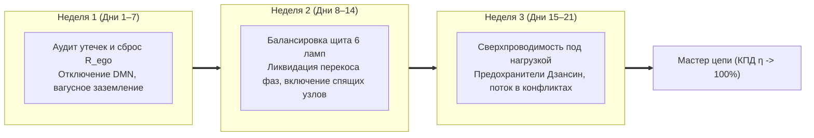

# 33. 21-дневный протокол перехода в сверхпроводимость: Ежедневный журнал оператора цепи

> [!quote] Цитата Канона
> ### ⚡ **«Теория без ежедневного измерения приборами — это просто новая религия. 21 день — это минимальный срок нейропластической перепайки синапсов: замена кольцевой дефолт-сети DMN на сверхпроводящий контур прямого действия. Заполняйте лог каждое утро и каждый вечер. Приборы не умеют льстить.»**  
> — **Владимир Аньянов**

---

## 📅 1. Архитектура 3-недельного цикла перепайки контура

Переход в режим устойчивой сверхпроводимости ($\mathcal{H} \ge 90\%$) разбит на три технологических этапа по 7 дней:



---

## ⚡ 2. Неделя 1: Очистка проводки внимания (Дни 1–7)
**Цель недели:** снизить паразитное омическое сопротивление эго ($R_{\text{ego}} \to 0$) и научиться мгновенно гасить дефолт-систему (DMN).

### Ежедневный протокол Недели 1:
1. **Утро (3 минуты):**
   - 10 циклов брюшного дыхания Тандэном (вдох 4 сек животом, выдох 8 сек ртом).
   - Активация TPN: 3 сенсорных фиксации без вербализации (ощутить вес стоп на полу, холод воды на лице, звук за окном).
   - Установка нулевого сопротивления: *«Сегодня я никому ничего не доказываю. Я провожу ток.»*
2. **День (в момент стресса / триггера):**
   - 20-секундный протокол вагусного заземления (статья 29).
   - Проверка: не замкнут ли контур на мысль *«А что они подумали?»* (при обнаружении — сброс тумблера: «Это шум DMN, возвращаюсь к объекту»).
3. **Вечер (2 минуты):**
   - Запись в журнал: сколько раз за день контур ушел в омический перегрев ($Q = I^2 R t$)? Каков был источник паразитного сопротивления?

---

## 💡 3. Неделя 2: Балансировка щита 6 ламп (Дни 8–14)
**Цель недели:** ликвидировать перекос фаз и «голодание» заброшенных контуров жизни.

### Карта ежедневного фокуса по лампам:
- **День 8:** Калибровка лампы №1 — **Тело** (сон $\ge 7.5$ ч, 2 литра чистой воды, 40 минут ходьбы).
- **День 9:** Калибровка лампы №2 — **Мастерство** (2 блока по 90 минут глубокой работы без соцсетей и мессенджеров в режиме Мусин).
- **День 10:** Калибровка лампы №3 — **Близость** (один честный, глубокий контакт без телефонов; слушать человека с нулевым $R_{\text{ego}}$).
- **День 11:** Калибровка лампы №4 — **Среда** (расчистка рабочего стола по канону Кансо; выбросить 5 вещей-вампиров).
- **День 12:** Калибровка лампы №5 — **Познание** (1 час чтения фундаментальной литературы; конспектирование законов).
- **День 13:** Калибровка лампы №6 — **Игра** (2 часа чистой спонтанности без цели: рисование, лес, музыка, бесцельная прогулка).
- **День 14:** **Аудит фазового баланса** — проверка всех 6 ламп на дашборде. Ни одна лампа не должна быть в нуле!

---

## 🛡️ 4. Неделя 3: Сверхпроводимость под высоким напряжением (Дни 15–21)
**Цель недели:** удержание состояния Мусин и включение предохранителей Дзансин в условиях реальных жизненных атак, срывов и конфликтов.

### Ежедневный протокол Недели 3:
- **День 15:** Встреча с агрессией / критикой. Использование правила согласования импедансов: чужой негатив — это чужой перегрев, ваш диэлектрик непробиваем.
- **День 16:** Стресс дедлайна. Работа на большой силе тока ($I \gg 0$) при строгом контроле $R = 0$. Никакой спешки — предельная точность каждого клика и удара по клавишам.
- **День 17:** Практика Кинцуги. Если сегодня что-то сломалось или сорвалось — заварить шрам золотом спокойствия: *«Сбой локализован. Система стала прочнее».*
- **День 18:** Тест на инвариантность масштаба. Заварить чай с тем же предельным вниманием и благоговением, с каким вы проводите совет директоров.
- **День 19:** Финансовый аудит цепи. Проверить: где деньги расходуются на подпитку Эго (вещи-вампиры), а где — на снижение трения среды ($R_{\text{env}}$)?
- **День 20:** Протокол бесконечной отдачи. Поделиться током с тем, чей генератор сейчас слаб, не требуя ничего взамен (прямой ток в нагрузку).
- **День 21:** **Финальная аттестация оператора.** Снятие телеметрии цепи. Расчет интегрального Индекса Счастья $\mathcal{H}$.

---

## 📋 5. Ежедневный бланк телеметрии (Шаблон в блокнот)

```
ДАТА: _______________ | ДЕНЬ ЦИКЛА: [ 1 .. 21 ]

[ УТРЕННИЙ ЧЕК-АП ]
1. Статус Тандэна (ЭДС):         [ ] Заряжен (1.0)   [ ] Норма (0.7)   [ ] Разряжен (0.3)
2. Чистота проводки (Мусин):     [ ] Медь (R = 0)    [ ] Окислы DMN    [ ] Спазм / Страх
3. Установка на день:            «Моя нагрузка сегодня: _________________________________»

[ ДНЕВНАЯ ТЕЛЕМЕТРИЯ ]
- Зафиксировано омических перегревов: _____ (шт.)
- Главный триггер утечки: ___________________________________________________________
- Сработал ли предохранитель Дзансин: [ ДА / НЕТ ]

[ ВЕЧЕРНИЙ БАЛАНС ЩИТА (0-100%) ]
[ ] Тело: ___%   [ ] Труд: ___%   [ ] Близость: ___%
[ ] Среда: ___%  [ ] Мысль: ___%  [ ] Игра: ___%

ИТОГОВЫЙ КПД СВЕРХПРОВОДИМОСТИ ДНЯ (H): ______%
```

---

## 🔗 Связи
- [[04_Maps/Inner Current MOC|Inner Current MOC]]
- [[02_Wiki/Inner Current (Human Self-Check Protocol and Sensation Translator)|19. Как человеку читать свой контур: транслятор ощущений]]
- [[02_Wiki/Inner Current (Happiness Dashboard and Superconductivity Telemetry)|16. Дашборд счастья: инженерная телеметрия]]
- [[02_Wiki/Inner Current (Safety, Antifragility and Zanshin)|04. Предохранители цепи, ваби-саби и антихрупкость]]

---
*Created: 2026-09-23 | Author: Vladimir Anyanov & Antigravity*
