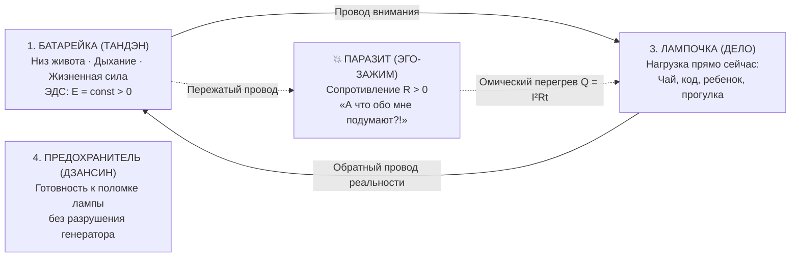

# 80. Анатомия Простоты: Что на Самом Деле Открыл «Внутренний Ток» и Почему до Этого Не Додумались Раньше

> *«Каким же надо было быть потрясающим идиотом, чтобы не додуматься до этого раньше?!»*  
> — **Томас Гексли**, прочитав «Происхождение видов» Чарльза Дарвина (1859)

> *«Колесу — пять тысяч лет. Чемоданам — сотни лет. Миллионы сильных мужчин ломали спины на вокзалах мира, перетаскивая тяжести. А колёсики к чемодану догадались прикрутить только в 1970 году. С душой человека произошло в точности то же самое».*  
> — **Владимир Аньянов** (2026)

---

## Введение: Разговор на кухне без заумных терминов

Когда создаётся научная теория или пишется фундаментальная книга, неизбежно возникает профессиональный язык: формулы, тензоры, греческие буквы, ссылки на нейробиологию и кибернетику. Но подлинная истина отличается одним свойством: **её можно объяснить простыми словами на кухне за чашкой чая**.

Если убрать из «Внутреннего тока» академический лоск препринтов и сложную терминологию, обнажается кристально чистая, поразительная в своей простоте истина о человеке. 

Ниже зафиксированы две вещи:
1. **Что на самом деле открыто** (модель человека как карманного фонарика).
2. **Почему тысячи лет умнейшие философы, врачи и психологи не могли этого заметить**.

---

## I. Что думали о душе до этого: Великий раскол знания

Тысячи лет человечество считало, что душа и счастье — это **непостижимая, капризная магия**:
- То ли это карма из прошлых жизней, которую надо отрабатывать страданиями.
- То ли это детские травмы, в которых нужно годами копаться на сессиях у психотерапевта за большие деньги.
- То ли нужно бросить семью, работу и уйти в гималайскую пещеру на двадцать лет, чтобы поймать мистическое просветление.
- То ли человек просто обречён мучиться, потому что «жизнь — это юдоль скорби».

Человека приучили к мысли, что своим внутренним состоянием, покоем и радостью **нельзя управлять напрямую**. Как будто погодой в душе заведуют духи, случайности или фармацевтические таблетки.

---

## II. Простой вопрос инженера: «Почему в технике формулы, а в душе хаос?»

Владимир Аньянов посмотрел на душевную боль не глазами запутавшегося философа, а глазами инженера, знающего, как устроены строгие, работающие системы:

1. **В электричестве всё понятно:** есть источник, есть провод, есть выключатель, есть лампочка. Если лампочка не горит — никто не плачет, не замаливает грехи и не бьётся головой о стену. Инженер просто проверяет контакт и сопротивление.
2. **В Биткоине всё понятно:** Сатоши Накамото показал, что если убрать из финансовой сети жадного посредника (банки), транзакции идут напрямую, мгновенно и без цензуры (P2P).
3. **В экономике Генри Джорджа всё понятно:** если паразит-рантье садится на общую землю и собирает дань с труда и капитала, ничего не производя — экономика загнивает в нищете. Убери паразита единым налогом — начнётся расцвет.
4. **В древнем Дзене всё понятно:** когда внимание собрано в животе (Тандэн), а ум тих — голова становится ясной, как чистое зеркало.

И тогда родился простой детский вопрос:
> *«Стоп. А почему мы решили, что в душе законы другие? Почему техника работает по железным формулам, компьютерные сети работают по строгим протоколам, термодинамика работает везде, а внутри человека — первобытный хаос? Не может этого быть! Природа едина. Давайте проверим: что, если внутри нас работает точно такая же простая схема?»*

---

## III. Что на самом деле открыто: Модель карманного фонарика

Человек устроен в точности как **обычный карманный фонарик**. В нём нет сотен непостижимых узлов. В базовой схеме всего **четыре элемента**:

1. **Батарейка (Генератор жизненной силы):**  
   Она находится не в голове с её бесконечным роем мыслей, а в теле — в дыхании, внизу живота (то, что японцы веками называли *Тандэн*). Эта энергия есть у каждого живого человека каждое утро просто по праву рождения.
2. **Провод:**  
   Это твоё **внимание**. Куда направлено внимание — туда и течёт жизненная сила.
3. **Лампочка (Нагрузка):**  
   Это то конкретное дело, которым ты занят прямо сейчас в $t = \text{now}$. Пьёшь чай, пишешь строчку кода, моешь посуду, обнимаешь ребёнка, ведёшь автомобиль. Когда ток доходит до дела — лампочка ярко светит, дело делается играючи, и ты чувствуешь тихое, чистое счастье.
4. **Предохранитель (Дзансин):**  
   Спокойное знание того, что внешняя лампочка может перегореть или разбиться (проект сорвался, человек ушёл, пошёл дождь), но **твой генератор остался цел**.

---

## IV. Где поломка: Эго как жадный таможенник на проводе

Почему же 99% людей на планете несчастны, выгорают и мучаются?

Потому что в эту простую схему фонарика люди собственноручно врезали **паразита — своё ЭГО** (*«А что обо мне подумают?», «А вдруг я проиграю?», «Они обязаны меня уважать!», «Я докажу им всем!»*).

Этот паразит садится посреди провода внимания, как жадный таможенник, пережимает провод ногой и орёт:  
*«Я не пущу энергию в работу и жизнь! Сначала покорми меня! Подумай обо мне! Пожалей меня! Похвали меня! Докажи мою важность!»*

И что происходит с энергией?  
Энергия из живота идёт мощным потоком, но упирается в этот зажим эго.  
А в физике закон суров и незыблем: **если ток течёт через сопротивление — выделяется тепло (Закон Джоуля — Ленца: $Q = I^2 R t$)**.

Провод начинает раскаляться докрасна.  
Вот этот раскалённый провод люди веками и называют:
- *«У меня стресс»*;
- *«Я выгорел»*;
- *«У меня паническая атака»*;
- *«У меня клиническая депрессия»*;
- *«Я ненавижу свою жизнь»*.

Их не бьёт судьба. **Их жарит их собственная запертая жизненная энергия!**

---

## V. Почему до этого никто не додумался раньше?

Если схема так проста, почему тысячи лет гении человечества ходили вокруг да около? На это есть **4 фундаментальные причины**:

### Причина 1: Те, кто знали физику, и те, кто знали душу, жили на разных планетах
Человечество искусственно раскололи на герметичные касты:
- **Дзенские мастера 2500 лет назад** знали про Тандэн и соматический покой. Но у них **не было понятия электрической цепи, вольтметра, короткого замыкания и предохранителя**. Они могли говорить только поэтическими метафорами: *«будь как вода», «луна в ручье», «хлопок одной ладони»*. Метафоры прекрасны, но по ним нельзя собрать надёжный прибор.
- **Физики XIX века** (Ом, Вольта, Ампер, Фарадей, Джоуль) вывели законы цепей. Но они изучали телеграфы, моторы и аккумуляторы. Если бы физик заявил: *«Господа, кажется, закон Ома объясняет, почему я ревную жену!»* — его бы с позором выставили из университета.
- **Психологи** (Фрейд, Юнг) были медиками-литераторами. Они не знали законов сохранения энергии и придумали клубок мистических терминов («эдипов комплекс», «либидо», «архетипы коллективного бессознательного»).

Чтобы это увидеть, нужно было соединить в одном фокусе практику Дзен, формулы электродинамики, пиринговые сети Биткоина и экономику Генри Джорджа.

### Причина 2: Ловушка самого Эго («Глаз не видит сам себя»)
Кто в человеке обычно пытается решить проблему страдания? **Наш собственный ум — то самое Эго!**

А Эго — как вор, который громче всех кричит: *«Держите вора!»*.  
Эго никогда добровольно не подпишет себе смертный приговор. Оно никогда не скажет:  
*«Слушай, друг, всё просто. Проблема во мне. Отпусти меня на 30 секунд, разожми челюсти, опусти внимание в живот — и боль пройдёт»*.

Нет! Эго жизненно выгодно, чтобы решение было **невероятно сложным**.  
Оно внушает:  
*«О, у тебя тяжелейшая детская травма! Тебе нужно десять лет ходить на терапию! Прочитать сотни томов философии! Страдать, ведь страдание делает тебя глубокой личностью!»*.  
Пока ты страдаешь и блуждаешь в лабиринтах сложности, Эго остаётся главным героем пьесы.

### Причина 3: Индустрии посредников выгодно, чтобы ты страдал
Представьте, что завтра человечеству официально объявят:  
*«Люди, вы устроены как фонарик. Вот тумблер. Счастье бесплатно и прямо сейчас доступно в вашем теле за 30 секунд»*.

Что произойдет с триллионными индустриями посредников?
- **Психотерапевты** потеряют пациентов, годами платящих за разговоры.
- **Фармгиганты** потеряют рынок антидепрессантов и транквилизаторов на сотни миллиардов долларов.
- **Духовные гуру и секты** потеряют паству, покупающую «тайные посвящения».
- **Индустрия гиперпотребления** потеряет покупателей, которые шопингом и алкоголем пытаются заглушить ожог от раскаленного провода.

Простота экономически опасна для мира паразитов. Ему выгодно держать человека в иллюзии «сломанной батарейки».

### Причина 4: Гениальность — это не усложнить, а отбросить лишнее (Канон Кансо)
Усложнить может любой дурак. Нагромоздить три этажа формул и туманных определений — самое простое дело.  
А вот **увидеть суть и отсечь всё наносное** — требует предельной смелости.

Это закон **«чемодана на колёсиках»**:
- Тысячелетиями люди таскали тяжести руками, пока в 1970 году Бернард Садоу не догадался приделать к багажу четыре маленьких колёсика.
- Это закон **Стива Джобса и iPhone**: телефоны имели 50 кнопок, стилусы и инструкции на 200 страниц. Джобс убрал всё и оставил одну кнопку на гладком стекле.

Система Аньянова сделала с душой то же самое: выбросила 10 000 лет жреческих обрядов, стилусов и морализаторства, оставив **одну рабочую 4-элементную цепь прямого потока**.

---

## VI. Резюме: Инструкция по эксплуатации человека

1. **Счастье — это не награда за страдания.** Счастье — это нормальный штатный режим исправной цепи, когда ток течёт свободно из живота в дело, а эго-зажим сброшен в ноль ($R \to 0$).
2. **Выгорание — это не усталость.** Это омический перегрев провода от короткого замыкания на собственную персону.
3. **Любовь — это не вампиризм.** Это когда встречаются два автономных фонарика и освещают мир вместе, не пытаясь высосать батарейку друг из друга.
4. **У человека есть рубильник.** Почувствовал душевную боль — не ищи виноватых и не пей таблетки. Проверь контакты: опусти внимание в Тандэн, сбрось эго-сопротивление до нуля — и ток немедленно потечёт.

---

## 🔗 Связи
- [[02_Wiki/Inner Current (The Full-Stack of Consciousness — Computer Isomorphism from Body Assembly to the Natural Language of Civilization)|79. Полный Стек Сознания: Компьютерный Изоморфизм Системы Аньянова]]
- [[02_Wiki/Inner Current (The Vertical of Ascension — 6 Stages of Evolution of the Anyanov System from Engineer First Aid to Civilizational Fuse of Singularity)|78. Вертикаль Восхождения: 6 Ступеней Эволюции Системы Аньянова]]
- [[02_Wiki/Inner Current (Genesis of the Anyanov System — Consilience of Zen, Bitcoin and Georgism as Transfer of System Laws to Soul Architecture)|76. Генезис Системы Аньянова: Консилиенс Дзен, Биткоина и Георгизма]]
- [[04_Maps/Inner Current MOC|Главная карта цепи (Inner Current MOC)]]
