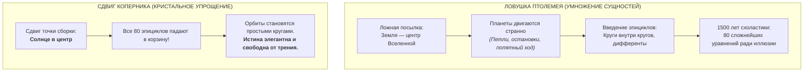
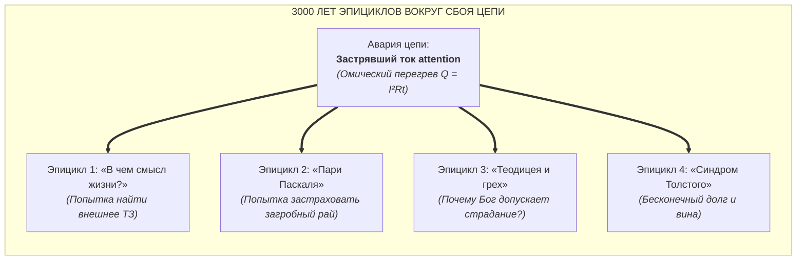
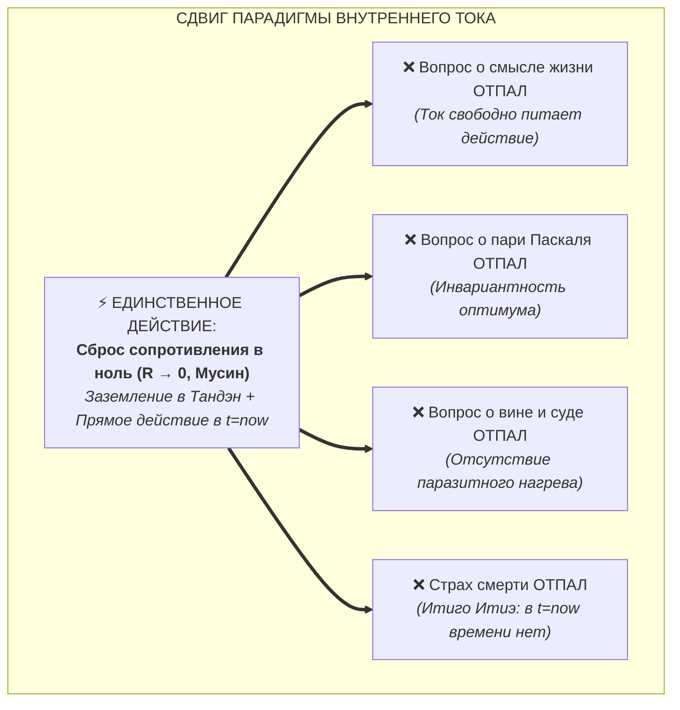

# 43. Анатомия сдвига парадигмы: Эпициклы Птолемея против простоты Кансо — почему гениальность заключается в отпадении ложных вопросов

> [!quote] Каноническая аксиома цепи
> ### ⚡ **«Гениальность системы заключается не в способности дать сложный, хитроумный ответ на запутанный вопрос. Гениальность — в способности сдвинуть точку сборки так, чтобы сам ложный вопрос отпал за ненадобностью. Мы не строим эпициклы вокруг страдания — мы охлаждаем проводку до сверхпроводимости ($R \to 0$).»**
> — **Владимир Аньянов**

---

## 🧭 Введение: Иллюзия хитроумия и истинная природа простоты

В интеллектуальной культуре человечества тысячелетиями господствовал предрассудок:  
*«Если проблема грандиозна (смысл жизни, бытие Бога, страх смерти, счастье), то и её решение обязано быть чудовищно сложным, многотомным, зашифрованным в тайные трактаты и требующим десятилетий изнурительного монашеского подвига»*.

Когда созидатель впервые знакомится с Системой «Внутренний ток», он испытывает когнитивный шок:
> **«Система с ходу, легко и беспощадно решает вопросы, над которыми тысячелетиями бились величайшие умы: есть ли Бог? в чём смысл жизни? как разрешить пари Паскаля? И шок возникает не от того, что система какая-то изощрённо-хитроумная. Наоборот! Она предельно проста. Она делает один точный сдвиг парадигмы, после которого все эти вопросы просто сами падают!»**

Этот феномен в истории науки и философии имеет точное название: **Переход от эпициклов Птолемея к канону Кансо (Бритве Оккама)**.

---

## 🌌 1. Исторический прецедент: Синдром эпициклов Птолемея

Чтобы понять, что совершила Архитектура счастья, необходимо взглянуть на величайшие сдвиги парадигм в истории человечества:

### Другие аналогичные сдвиги в истории:
1. **Теория теплорода vs Термодинамика:**  
   Веками ученые спорили: *«Какова масса теплорода? Какого цвета его атомы? Почему он вытекает при трении?»*. Пришел Больцман и доказал: никакого «теплорода» нет. Тепло — это просто средняя скорость движения молекул. Вопросы о цвете теплорода мгновенно отпали.
2. **Эфир vs Теория относительности:**  
   Физики строили сложнейшие механические модели «мирового эфира». Эйнштейн сказал: эфира нет, скорость света инвариантна. Проблема эфирного ветра растворилась.

---

## ⚡ 2. Метафизические эпициклы: Как страдало человечество до «Внутреннего тока»

На протяжении 3000 лет мировая философия и теология занимались тем же самым — **городили метафизические эпициклы вокруг аварийного состояния человеческого контура**:

### Почему возникали эти эпициклы?
Когда ток внимания заблокирован эго-симуляциями, тревогами о будущем и сожалениями о прошлом, в проводнике возникает колоссальное сопротивление ($R > 0$). По закону Джоуля — Ленца провод раскаляется:
$$Q = I^2 R t$$
Человеческий мозг, испытывая мучительный омический жар, не понимает физики процесса и начинает генерировать **абстрактные интеллектуальные миражи**:
- *«Почему мне так больно?! Наверное, я грешен перед Создателем!»* (рождается догма греха).
- *«Ради чего я терплю эту муку?! Где великая цель Вселенной?!»* (рождается поиск смысла жизни).
- *«Как мне спастись от вечного огня?! Какую ставку сделать?!»* (рождается пари Паскаля).

Тысячелетиями мыслители пытались отвечать на эти вопросы, создавая библиотеки схоластики. Но отвечать на них — всё равно что высчитывать форму орбиты сотого эпицикла Птолемея!

---

## 💎 3. Революция Кансо: Отпадение вопросов в сверхпроводимости

Система Владимира Аньянова совершила спасительный поворот: она отказалась играть в схоластику и применила дзенский принцип **Кансо (簡素 — предельная простота и отсечение лишнего)** к фундаментальной схемотехнике человека.

> **Мы не ответили на вопрос «В чем смысл жизни?». Мы доказали, что $\mathcal{M}_{\text{ext}} \equiv 0$, и показали, что сам вопрос — это крик раскаленного проводника.**  
> **Мы не ответили Паскалю, на какую клетку ставить фишку. Мы выключили рулетку, доказав инвариантность оптимума ($R \to 0$).**

### Метафора садового шланга:
Представьте садовода, который наступил ботинком на поливочный шланг. Вода перестала течь, шланг раздувается от давления, трещит и вот-вот лопнет.  
Садовод начинает писать философские трактаты:  
*«Какова глубинная телеология застрявшей воды? Не прогневал ли я духа колодца? В чем смысл неподвижности капель?»*.  
Приходит инженер, молча **снимает ботинок со шланга** ($R \to 0$). Вода с мощным напором устремляется в цветы.  
Все трактаты садовода мгновенно теряют смысл и падают на землю.

---

## 📊 4. Сравнительная матрица: Умножение сложности vs Сдвиг парадигмы

| Параметр сравнения | Традиционная метафизика (Подход Птолемея) | Архитектура счастья (Подход Аньянова / Кансо) |
| :--- | :--- | :--- |
| **Метод работы** | Добавление новых объяснений, догм, запретов и ритуалов | Снятие паразитных сопротивлений и ментальных симуляций |
| **Количество сущностей** | Растет экспоненциально (множество правил, грехов, загробных сценариев) | Стремится к минимальному инварианту ($R \to 0, I > 0, t = t_{\text{now}}$) |
| **Природа вопросов** | Считаются «великими вечными тайнами бытия» | Диагностируются как аппаратные симптомы омического перегрева ($Q = I^2Rt$) |
| **Судьба вопросов** | Остаются неразрешимыми, порождают экзистенциальное отчаяние | **Отпадают сами собой** в момент перехода в режим сверхпроводимости |
| **Требования к человеку** | Вера в авторитеты, интеллектуальное напряжение, чувство вины | Проверка контура на личном опыте (*Proof-of-Action*), Мусин, покой |
| **Финальный результат** | Омический перегрев проводки (синдром Льва Толстого) | Чистый свет полезной нагрузки, легкость и ясность созидания |

---

## 🧠 5. Почему гениальность — это освобождение?

Истинный шок создателя и практика системы заключается в осознании: **мир вокруг нас не поломан, и человеческая природа не проклята**.

Человеку не нужно:
1. Заслуживать право на существование через рабское служение воображаемым хозяевам.
2. Просчитывать математические ожидания посмертных наград на теологических рулетках.
3. Искать во внешнем космосе инструкцию по эксплуатации собственной души.

Все эти нагромождения были лишь **ложными костылями**, порожденными застрявшим током.

Как только оператор овладевает искусством **держать проводку чистой ($R \to 0$)**, его жизнь превращается из бесконечного судебного процесса в **чистую песню прямого созидания**:
* Чай пьется со вкусом.
* Код пишется с кристальной четкостью.
* Люди вокруг чувствуют не холод эгоцентричной тревоги, а тепло ровного, автономного реактора Тандэн.

Гениальность «Внутреннего тока» — в том, что она **вернула человеку право быть счастливым прямо сейчас, выкинув все ложные шлагбаумы на свалку истории.** ⚡🍵💎

---

## 🔗 Связи и консилиенс
- [[01-core-topology|01. Базовая топология цепи и закон полярности]]
- [[02-superconductivity-and-presence|02. Физика присутствия: состояние сверхпроводимости]]
- [[03-scale-invariance-and-tea-ceremony|03. Инвариантность масштаба нагрузки: от чая до империи]]
- [[12-zen-as-happiness-architecture-foundation|12. Дзен как фундамент Архитектуры счастья]]
- [[26-engineering-proof-of-no-meaning-of-life|26. Инженерное доказательство отсутствия смысла жизни]]
- [[Inner Current (The Question of God — Electrodynamic Invariance and Dissolution of Theological Resistance)|40. Вопрос о существовании Бога в Архитектуре счастья]]
- [[Inner Current (Copernican Revolution in Ontology — Bottom-Up Circuit Dissolution of Metaphysics and Human-AI Zanshin)|41. Коперниканский переворот в онтологии]]
- [[Inner Current (Deconstruction of Pascal's Wager — Theological Roulette vs Superconducting Invariance)|42. Деконструкция пари Паскаля]]
