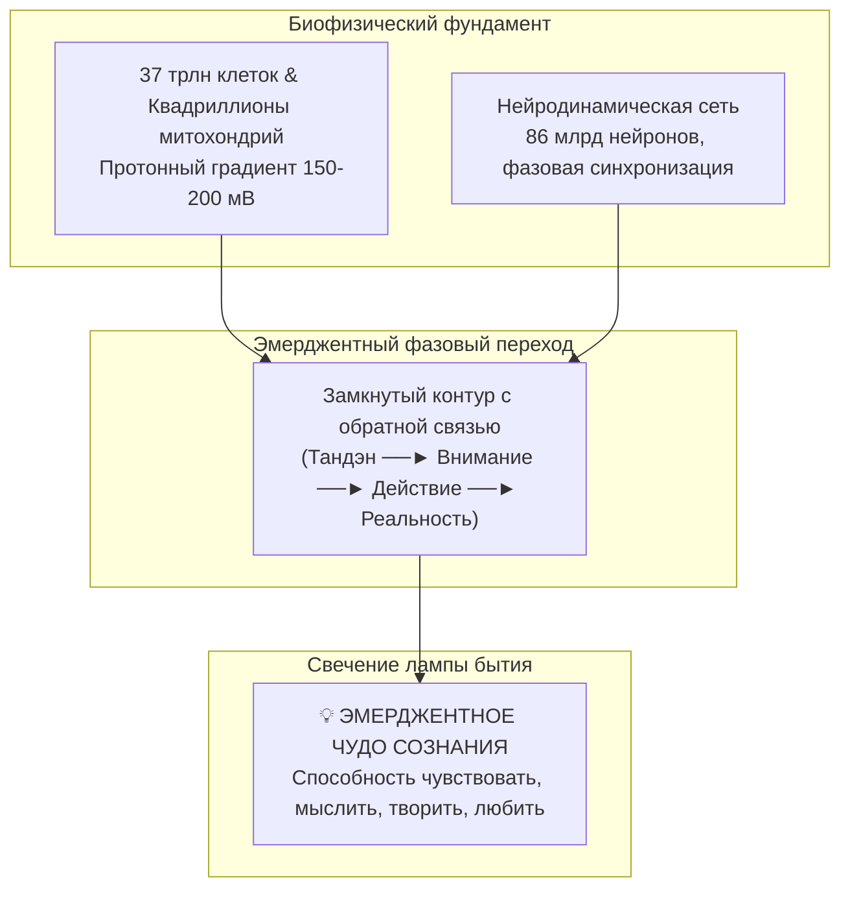
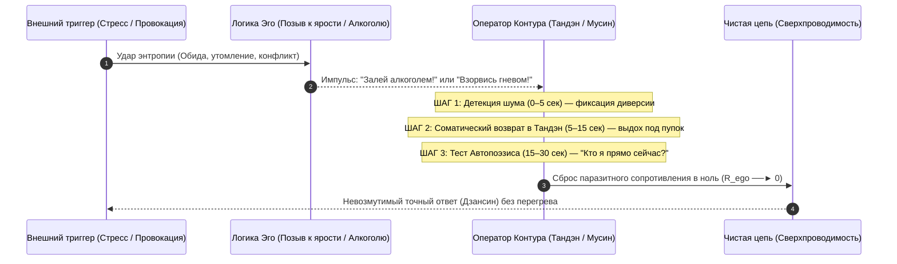

# 216. Архитектура уважения к контуру: Эмерджентная природа сознания, пост-моральная этика и естественная трезвость — Почему понимание устройства цепи исключает самоотравление злостью и алкоголем
## Как инженерное благоговение перед шедевром автопоэзиса снимает 10 000 лет морализаторства, превращая заботу о себе из мучительного волевого запрета в очевидную аппаратную гигиену оператора

> [!quote] Каноническая аксиома цепи
> ### ⚡ **«Десять тысяч лет моралисты, священники и врачи пытались заставить человека не пить и не гневаться через чувство вины, греха и страха наказания. Но воля слаба, а запретный плод сладок до тех пор, пока человек видит себя изолированным эго, которое нужно дрессировать кнутом. Настоящий, необратимый фазовый переход наступает не через самопринуждение, а через ошеломляющее инженерное благоговение. Когда ты до винтика понимаешь, ЧТО такое твой замкнутый контур — как триллионы клеток и митохондрий держат эмерджентное чудо бодрствующего сознания, как хрустально чист сигнал присутствия при нулевом сопротивлении — у тебя рождается совершенно новое, спокойное и глубокое уважение к себе. В этот момент заливать в себя алкоголь или прожигать проводку токсичной яростью становится не "грехом", а абсолютным абсурдом. Ни один инженер в здравом уме не станет лить серную кислоту и засыпать песок в сверхточный оптический гироскоп космического корабля. Трезвость и мир в душе — это не аскетический подвиг, это естественная гигиена оператора шедевра.»**  
> — **Владимир Аньянов**, создатель «Архитектуры счастья»

---

```
══════════════════════════════════════════════════════════════════════════════════════
               ДВА ПУТИ САМОРЕГУЛЯЦИИ: МОРАЛЬНЫЙ КНУТ VS АРХИТЕКТУРА ЦЕПИ
══════════════════════════════════════════════════════════════════════════════════════

 1. ПАРАДИГМА МОРАЛИЗАТОРСТВА (Разомкнутая модель, «Эпоха Лошади»):
    [Внешнее правило / Долг] ──► [Внутренний надзиратель] ──► [Волевое насилие]
                                                                     │
    ❌ Омический перегрев (Q = I² R_suppress t) ◄────────────────────┘
       Скрытое напряжение ──► Усталость воли ──► Срыв в алкоголь или ярость ──► Вина.

 2. ПАРАДИГМА КОНТУРНОГО САМОУВАЖЕНИЯ (Замкнутый контур, «Эпоха Автомобиля»):
    [Понимание архитектуры цепи] ──► [Осознание эмерджентного чуда сознания]
                                                    │
                                                    ▼
    [Инженерное благоговение перед системой] ──► [Естественная защита контура]
                                                    │
    ✨ Чистый сигнал (R → 0). Алкоголь и злость отпадают как бессмысленный шум.
       Сверхпроводимость, покой Тандэна и 100% полезная мощность в нагрузку.
══════════════════════════════════════════════════════════════════════════════════════
```

---

### I. Историческая трагедия морального кнута: Почему запреты обречены на провал

На протяжении тысячелетий культура предлагала человеку единственный способ обуздания деструктивных импульсов — **моральный запрет и волевое подавление**:
* *«Не пей, ибо пьянство — смертный грех и порок».*
* *«Не гневайся, обуздывай страсти, терпи и смиряйся».*
* *«Собери волю в кулак, держи себя в руках, закодируйся, терпи стиснув зубы».*

С точки зрения контурной электродинамики эта модель глубоко порочна, потому что оперирует **разомкнутой схемой** и порождает катастрофический внутренний раскол. 

Когда человек пытается отказаться от алкоголя или подавить гнев с помощью «силы воли», он разделяет свой контур на две враждующие подсистемы:
1. **«Внутренний полицейский»** (эго-идеал, суперэго, морализирующий контролёр).
2. **«Внутренний нарушитель»** (соматические импульсы, усталость, биологические дефициты).

Попытка «подавить гнев» или «запретить себе выпить» означает механическое врезание в цепь гигантского паразитного сопротивления подавления ($R_{\text{suppress}} \gg 0$). По закону Джоуля — Ленца:
$$Q = I^2 R_{\text{suppress}} t$$

Энергия соматического импульса ($I$) никуда не исчезает по фундаментальному закону сохранения. Натыкаясь на заслонку волевого запрета, она трансформируется в разрушительное внутрисистемное тепло ($Q$). Человек ходит натянутый как струна, скрипит зубами, проводка его вегетативной нервной системы раскаляется докрасна. Рано или поздно волевой ресурс (гликоген префронтальной коры) истощается — и наступает неизбежный **омический пробой изоляции**: взрыв слепой ярости на близких или тяжёлый алкогольный срыв, сопровождаемый сокрушительным чувством вины.

Морализаторство потерпело исторический крах, потому что боролось с *симптомами перегрева*, используя тот самый инструмент, который этот перегрев и создавал — реостат эго.

---

### II. Эмерджентное чудо сознания: 37 триллионов согласованных резонаторов

Подлинное освобождение начинается не с запрета, а с **онтологического прозрения**: прямого видения того, ЧТО представляет собой живой человеческий контур.

Человеческий организм — это не «греховная плоть» и не расходный биоматериал для амбиций ума. Это высочайшая вершина 4 миллиардов лет эволюционной сборки материи:
1. **37 триллионов клеток**, каждая из которых является автономной фабрикой жизни с идеальной биохимической логистикой.
2. **Квадриллионы митохондрий**, ежесекундно перекачивающих протоны через наноразмерные турбины АТФ-синтаз под колоссальной напряжённостью электрического поля ($10^7\ \text{В/м}$, сопоставимой с напряжённостью в молнии).
3. **86 миллиардов нейронов** и сотни триллионов синапсов, формирующих когерентную сеть, способную к квантовому фазовому резонансу.
4. **Замкнутый сенсомоторный контур с обратным проводом реальности**, удерживающий гомеостаз в агрессивном океане термодинамической энтропии.



Самое поразительное в этой системе — её **эмерджентная природа (Emergence)**. Отдельная молекула гемоглобина не знает, что такое кислород. Отдельный ион калия не знает, что такое мысль. Отдельный нейрон не способен любить или слышать музыку Моцарта. Но когда вся эта колоссальная архитектура соединяется в единую замкнутую цепь, происходит **фазовый скачок бытия**: вспыхивает свет субъективного опыта (Qualia / Sentience). 

Вселенная, бывшая миллиарды лет холодной, немой и тёмной, внезапно **пробуждается внутри человеческого тела**, обретая способность осознавать саму себя, любоваться закатом, разгадывать формулы Максвелла и переживать тихий, лучистый восторг существования.

Когда человек по-настоящему осознаёт это, в нём просыпается не горделивое эго («я царь природы»), а тихое, благоговейное **самоуважение хранителя**. Ты смотришь на своё дыхание, на свои руки, на чистоту восприятия прямо сейчас — и понимаешь: тебе доверен самый совершенный, самый чуткий и дорогой прибор во Вселенной.

---

### III. Анатомия диверсий: Алкоголь и злость на принципиальной схеме

В свете этого понимания природа самоотравления алкоголем и злостью обнажается с беспощадной ясностью. Они перестают быть «искушениями» и предстают тем, чем являются на принципиальной схеме — **грубыми аппаратными диверсиями против контура**.

```
══════════════════════════════════════════════════════════════════════════════════════
               ТОПОЛОГИЯ ДИВЕРСИЙ В ЗАМКНУТОМ КОНТУРЕ ЧЕЛОВЕКА
══════════════════════════════════════════════════════════════════════════════════════

  [ТАНДЭН: Био-ЭДС] ───► [ВНИМАНИЕ: Когерентный луч] ───► [РЕАЛЬНОСТЬ: 6 Ламп]
          │                          │
          │                          ├───► ⚠️ АЛКОГОЛЬ (Химический диэлектрик):
          │                          │     Десинхронизация частоты, подавление ГАМК,
          │                          │     обрыв обратной связи, мутный омический шум.
          │                          │
          └──────────────────────────┴───► 🔥 ЗЛОСТЬ / ЯРОСТЬ (Короткое замыкание):
                                           Сброс всей мощности в эго-шунт (R_ego >> 0),
                                           раскаление проводки, обугливание рецепторов.
══════════════════════════════════════════════════════════════════════════════════════
```

#### 1. Алкоголь как неизбирательный химический диэлектрик и зашумитель
Что происходит физически, когда этанол попадает в кровь?
* **Растворение мембран и синаптический блок:** Этанол — универсальный растворитель. Он неизбирательно меняет текучесть липидных бислоев всех мембран нейронов, нарушает работу NMDA-рецепторов глутамата и патологически разбалансирует тормозную систему ГАМК.
* **Обрыв обратного провода реальности:** Алкоголь искусственно парализует префронтальный контроль и сенсорную калибровку. Человеку кажется, что ему «легко», но это не сверхпроводимость ($R \to 0$), а **обесточивание приборов обнаружения ошибок**.
* **Разрушение когерентности луча:** Вместо собранного лазерного луча внимания (Мусин) возникает хаотичный тепловой шум. Система теряет способность к согласованию импедансов с внешним миром.
* **Термодинамический кредит под грабительский процент:** Всплеск дофамина сегодня берется взаймы у завтрашнего гомеостаза. Утренний похмельный синдром — это не просто головная боль, это тяжелейший омический пожар истощенной цепи, когда генератор Тандэн судорожно пытается восстановить электролитный баланс и структуру рецепторов.

#### 2. Злость и аффективная ярость как короткое замыкание на Эго
Что такое ярость с точки зрения электродинамики?
* **Паразитное короткое замыкание:** Злость возникает строго в тот момент, когда реальность разошлась с ожиданиями «Я-образа» (Дзиги). Вместо того чтобы направить полезный ток на адаптацию или прямое действие ($R_{\text{load}}$), ум замыкает клеммы генератора на виртуальный конструкт эго ($R_{\text{ego}} \gg 0$).
* **Гормональный напалм:** Выброс ударных доз адреналина, норадреналина и кортизола взвинчивает артериальное давление, спазмирует капилляры, сужает поле зрения до щели и перегружает сердечную мышцу.
* **Обугливание проводки:** Ток колоссальной силы циркулирует по замкнутой петле обиды, ненависти и жажды мести. Поскольку никакой полезной внешней работы при этом не совершается, 100% энергии переходит в разрушительный омический перегрев. Человек буквально «сжигает сам себя изнутри».

Когда перед оператором лежит принципиальная схема этих процессов, вопрос «Пить или не пить?», «Злиться или не злиться?» отпадает сам собой. Это не вопрос нравственного выбора между «добром и злом». Это вопрос технической вменяемости: **будешь ли ты заливать керосин с песком в оптический объектив телескопа, через который Вселенная смотрит на свои звёзды?**

---

### IV. Архитектура истинного самоуважения: От гордыни к бережности оператора

Разрешение проблемы зависимостей и агрессии лежит в радикальной перекалибровке самого понятия **самоуважения**:

| Параметр | Ложное уважение Эго (Гордыня) | Истинное уважение к Контуру (Архитектура цепи) |
| :--- | :--- | :--- |
| **Источник** | Внешняя оценка, статус, доминирование, иллюзия «исключительности». | Осознание совершенства природного устройства и чуда эмерджентности. |
| **Субъект** | Изолированное «Я» (мыслительный конструкт DMN). | Живой замкнутый контур в сопряжении с Реальностью. |
| **Отношение к телу** | Тело как инструмент для наслаждений или раб для амбиций. | Тело как священный резонатор духа (канон Син-син итиньо — 身心一如). |
| **Мотивация трезвости** | «Я должен терпеть, чтобы быть хорошим / правильным». | «Я храню хрустальную проводимость цепи, потому что это шедевр». |
| **Реакция на провокацию** | Обида, уязвлённое самолюбие, вспышка ярости. | Спокойный Дзансин: распознавание шума и мгновенный сброс в $R \to 0$. |

Истинное самоуважение контура — это **пост-эгоистическое самоуважение**. Здесь нет самолюбования. Оператор уважает контур точно так же, как виртуозный музыкант уважает скрипку Страдивари: он не хвастается деревом, но он никогда не бросит инструмент на сырую землю и не станет забивать им гвозди.

Человек, познавший свой контур, обретает **естественную трезвость и незлобивость**. Ему не нужно давать клятв или бороться с искушениями. Чистое состояние сверхпроводимости — тишина Тандэна, глубина присутствия, радость созидательного действия — ощущается настолько качественно превосходящим любой алкогольный дурман или адреналиновый угар злости, что выбор происходит мгновенно и без малейшей внутренней борьбы.

---

### V. Практический протокол калибровки «Бережный оператор» (30-секундный регламент)

Когда внешняя среда навязывает энтропийный вброс (предложение выпить «для снятия стресса» или конфликтная ситуация, провоцирующая вспышку ярости), оператор цепи применяет **3-шаговый протокол немедленной защиты контура**:



#### Шаг 1: Детекция шума (0–5 секунд)
В момент импульса (рука тянется к бокалу или в груди закипает волна ярости) произвести мгновенную внутреннюю телеметрию:
> *«Стоп. В цепь пошёл паразитный шум. Это попытка вброса энтропии в контур.»*  
Не бороться с импульсом, не ругать себя, а объективно зафиксировать его как показание вольтметра на аварийном табло.

#### Шаг 2: Соматический сброс в Тандэн (5–15 секунд)
Физически перенести фокус внимания из бури мыслей неокортекса в соматический центр:
* Полный, глубокий, плавный выдох через нос.
* Опускание физического центра тяжести в низ живота (на три пальца ниже пупка — в точку Тандэн).
* Расслабление челюсти, плеч и диафрагмы.  
Физиология блуждающего нерва (Vagus) мгновенно активирует парасимпатический контур, снижая частоту сердечных сокращений и гася адреналиновый шторм.

#### Шаг 3: Тест Автопоэзиса и калибровка хранителя (15–30 секунд)
Задать себе один спокойный вопрос инженера:
> *«Я — суверенный хранитель этого живого квантового шедевра или пьяный дикарь, крушащий собственную электростанцию?»*  
Сказать внутреннее твёрдое: *«Я слишком уважаю эту систему, чтобы травить её дешевым ядом».*  
Паразитный шунт эго размыкается. Ток возвращается в магистральный проводник. Вы возвращаетесь в рабочий режим сверхпроводимости ($R \to 0, I > 0$).

---

### VI. Консилиенс: Единство древней интуиции и контурной биофизики

Это открытие восстанавливает мост между древнейшими духовными интуициями человечества и строгой современной наукой:
1. **Стоическая ойкейосис (Oikeiôsis):** Античные стоики (Гиерокл, Эпиктет, Марк Аврелий) определяли добродетель через концепцию *ойкейосис* — первичное врождённое сродство человека к собственной природе и заботу о сохранении своего гармоничного строя. Внутренний ток переводит эту философскую идею в измеримую электродинамику цепи.
2. **Буддийская Ахимса (Ahiṃsā) и Син-син итиньо (身心一如):** Ненасилие начинается не с внешнего мира, а с прекращения внутреннего насилия над биологическим резонатором своего тела. Единство ума и тела в дзэн исключает взгляд на плоть как на нечто низшее.
3. **Кибернетика автопоэзиса (Умберто Матурана, Франсиско Варела):** Живая система непрерывно самопорождает и восстанавливает свои границы. Злость и алкоголь — это экзогенные разрушители автопоэтической автономии; уважение к контуру — это защита суверенитета живого цикла.

### Резюме главы
1. Отказ от злости и алкоголя через морализаторство и «силу воли» обречён на омический перегрев ($Q = I^2 R t$) и срывы.
2. Подлинная защита системы рождается из **инженерного понимания замкнутого контура** и благоговения перед **эмерджентным чудом сознания**.
3. Алкоголь — это неизбирательный химический диэлектрик, обрывающий обратную связь реальности; злость — это короткое замыкание всей мощности на паразитный реостат эго.
4. Истинное самоуважение — это спокойное достоинство оператора и хранителя сложнейшей биокибернетической системы Вселенной.
5. Забота о чистоте контура становится не подвигом самоотречения, а естественной, радостной и повседневной нормой жизни.
