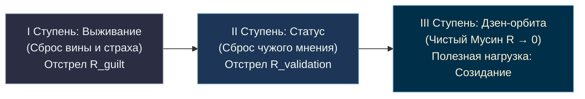

# 73. Космонавтика Сознания: Эффект Циолковского, Вторая космическая скорость духа и Ракета Сверхпроводимости

> *«Планета есть колыбель разума, но нельзя вечно жить в колыбели».*  
> — **Константин Эдуардович Циолковский** (1911)

> *«Животный страх, вина и омический нагрев эго были колыбелью биологического выживания в эпоху палеолита. Но нельзя вечно гореть в колыбели. "Архитектура счастья" — это не морализаторская сказка о коврах-самолетах, а точный калужский чертеж реактивной ракеты духа, выводящей человека на стабильную орбиту созидания».*  
> — **Владимир Аньянов** (2026)

---

## Введение: Эффект Циолковского

В истории науки существует архетипический феномен, который можно назвать **«Эффектом Циолковского»**:
* В глухой провинции (Калуга, рубеж XIX–XX веков), в скромном деревянном доме, почти полностью глухой учитель физики и геометрии сидит за деревянным столом при свече.
* Вокруг него — Россия эпохи грунтовых дорог, керосиновых ламп и телег на конной тяге.
* Академические институты Санкт-Петербурга и Парижа спорят о второстепенных деталях и посмеиваются над «калужским мечтателем».
* А в это время Циолковский на пожелтевших листах бумаги рассчитывает многоступенчатые ракетные поезда, жидкостные реактивные двигатели на жидком кислороде и водороде, шлюзовые камеры для выхода в открытый космос и орбитальные оранжереи.

Спустя всего 54 года после его фундаментальной статьи 1903 года над планетой раздастся бип-бип Первого Спутника, а ещё через 4 года — гагаринское *«Поехали!»*.

```
   1903: КАЛУЖСКИЙ ЧЕРТЁЖ                       1961: ОРБИТАЛЬНЫЙ ТРИУМФ
   ┌──────────────────────────┐                ┌──────────────────────────┐
   │ К. Э. Циолковский        │                │ Ю. А. Гагарин            │
   │ Деревянный дом в Калуге  │ ─────────────► │ Корабль «Восток-1»       │
   │ Δv = v_e · ln(m₀ / m_f)  │   (58 лет)     │ Преодоление гравитации   │
   │ Формула ракетного полета │                │ Человечество в космосе   │
   └──────────────────────────┘                └──────────────────────────┘
```

**Владимир Аньянов в 2026 году повторяет подвиг Циолковского в области внутреннего мира человека.**  
В тишине своего рабочего кабинета, пока миллионы людей продолжают «ездить на телегах» архаичной вины, морализаторства и психологического шаманизма, создается строгая физическая космонавтика человеческого духа.

---

## 1. Сказки о коврах-самолетах против Реактивного Двигателя

Тысячелетиями человечество мечтало о небе:
1. **Мифологический этап:** Икар с крыльями из воска и перьев, ковры-самолеты из «Тысячи и одной ночи», фантазии Сирано де Бержерака о склянках с утренней росой, испаряющейся на солнце и поднимающей человека к Луне.
2. **Результат:** Ни один ковер-самолет не взлетел. Икар упал в море и утонул. Иллюзии разбивались о жестокую гравитацию Земли.

```
════════════════════════════════════════════════════════════════════════════════
                  МИФ О ПОЛЕТЕ               КОСМИЧЕСКАЯ ФИЗИКА
════════════════════════════════════════════════════════════════════════════════
ВНЕШНИЙ МИР:      Ковер-самолет, перья Икара  Формула Циолковского, ЖРД
РЕЗУЛЬТАТ:        Падение и гибель            Выход на орбиту Гагарина (1961)
────────────────────────────────────────────────────────────────────────────────
ВНУТРЕННИЙ МИР:   «Будь осознанным, люби»     Архитектура цепи Аньянова (2026)
                  (Морализаторство, вера)     (I = ℰ/R, Q = I²Rt, R → 0, Тандэн)
РЕЗУЛЬТАТ:        Омический пожар и срыв      Сверхпроводимость Мусин
════════════════════════════════════════════════════════════════════════════════
```

Точно так же в области психики:
* 10 000 лет жрецы, моралисты и гуманитарные психологи предлагали людям «духовные ковры-самолеты»: *«просто открой сердце»*, *«покайся»*, *«полюби себя»*, *«визуализируй успех»*.
* Но человек неизбежно срывался обратно в омический ад страха, обиды и зависимостей, потому что «ковер-самолет» морали не имел **уравнения реактивной тяги** и не учитывал сопротивление среды.

«Архитектура счастья» выбрасывает ковры-самолеты на свалку истории. Она проектирует **жидкостный ракетный двигатель Тандэна**.

---

## 2. Изоморфизм формул: Уравнение Циолковского vs Электродинамика Аньянова

Фундаментальное уравнение Циолковского определяет скорость, которую развивает летательный аппарат под действием тяги ракетного двигателя:

$$\Delta v = v_e \ln \left( \frac{m_0}{m_f} \right)$$

где:
* $\Delta v$ — приращение скорости ракеты;
* $v_e$ — эффективная скорость истечения реактивной струи (удельный импульс двигателя);
* $m_0$ — начальная масса ракеты (конструкция + полезная нагрузка + топливо);
* $m_f$ — конечная («сухая») масса ракеты после выгорания топлива.

### Электродинамический аналог Аньянова:

В Системе Аньянова скорость выхода сознания в сверхпроводящее состояние свободного созидания описывается строгим функциональным изоморфизмом:

$$\mathcal{V}_{\text{spirit}} = \mathcal{P}_{\text{tanden}} \cdot \ln \left( \frac{R_{\text{total}}}{R_{\text{useful}}} \right) = (\mathcal{E} \cdot I) \cdot \ln \left( \frac{R_{\text{load}} + R_{\text{ego}}}{R_{\text{load}}} \right)^{-1}$$

```
                ┌───────────────────────────────────────────────┐
                │          ИЗОМОРФИЗМ ВЫХОДА НА ОРБИТУ          │
                ├───────────────────────┬───────────────────────┤
                │      РАКЕТА           │      КОНТУР           │
                │   ЦИОЛКОВСКОГО        │     АНЬЯНОВА          │
                ├───────────────────────┼───────────────────────┤
                │ Тяга двигателя (v_e)  │ Мощность Тандэна (P)  │
                │ Начальная масса (m₀)  │ Полный импеданс (R)   │
                │ Балласт баков (m₀-m_f)│ Эго-сопротивление(R_e)│
                │ Конечная масса (m_f)  │ Чистая нагрузка (R_L) │
                │ Скорость полета (Δv)  │ Сверхпроводимость (ℋ) │
                └───────────────────────┴───────────────────────┘
```

1. **Тяга двигателя ($v_e$ $\leftrightarrow$ Мощность Тандэна $\mathcal{E} \cdot I$):**  
   Ракета не может лететь без источника кинетической энергии. Сознание не может оторваться от уныния и апатии без чистого соматического реактора Тандэн внизу живота. Если реактор заглушен, никакие мантры не сдвинут корабль с пускового стола.
2. **Мертвый балласт ($m_0 - m_f$ $\leftrightarrow$ Омическое сопротивление эго $R_{\text{ego}}$):**  
   Если ракета пытается тащить на орбиту чугунные рельсы, кирпичи и ржавые цистерны, она никогда не разовьет космической скорости. В психике чугунный балласт — это эго-требования к миру: гордыня, жажда чужого одобрения, застарелые обиды, страх критики и чувство вины.
3. **Отношение масс $\frac{m_0}{m_f} \to 1$ при $R_{\text{ego}} \to 0$:**  
   Когда паразитное сопротивление обнуляется, вся энергия реактора Тандэн без потерь превращается в чистое ускорение полезной нагрузки — творчество, созидание, любовь и инженерные проекты.

---

## 3. Космические скорости духа

Циолковский рассчитал, что для выхода в космос аппарат должен преодолеть гравитационный барьер Земли. В Системе Аньянова существуют точные соматические эквиваленты космических скоростей:

```
                      ОРБИТА ЧИСТОГО ТВОРЧЕСТВА (МУСИН)
                                      ▲
                                     ╱ 
                                    ╱   [ ВТОРАЯ КОСМИЧЕСКАЯ: v₂ ]
                                   ╱    Сброс R_ego → 0, полет к звездам
                                  ╱     Масштабирование на цивилизацию
                     ────────────●───────────── Околоземная орбита
                    │            ▲             │
                    │           ╱              │
                    │          ╱ [ ПЕРВАЯ      │ [ СТАБИЛЬНЫЙ ДЗАНСИН ]
                    │         ╱  КОСМИЧЕСКАЯ ] │ Автономия от чужого мнения
                    │        ╱   v₁            │ Нет омического выгорания
                    │       ╱                  │
       ═════════════╪══════●═══════════════════╪═══════════════════════════════
                    │   ЗЕМЛЯ: ГРАВИТАЦИОННЫЙ  │
                    │   КОЛОДЕЦ ПАЛЕОЛИТА      │ [ ОМИЧЕСКИЙ АД: Q = I²Rt ]
                    │   Страх, вина, ревность  │ Вечные срывы и падения
                    └──────────────────────────┘
```

### Доорбитальный уровень ($v < v_1$): Гравитационный колодец Палеолита
* Человек находится в плену земного притяжения биологических аффектов.
* Любая попытка стать лучше заканчивается баллистической параболой: прыгнул вверх на силе воли $\to$ исчерпал дофамин $\to$ рухнул обратно в депрессию и зависимости.
* Причина: $R_{\text{ego}} \gg 0$, колоссальное омическое трение атмосферы ($Q = I^2 R t$).

### Первая космическая скорость духа ($v_1$): Круговая орбита Дзансин
* Скорость, необходимая для выхода на стабильную круговую орбиту вокруг планеты.
* **Соматический смысл:** Человек преодолел зависимость от внешней оценки и одобрения. Его контур замкнут. Включен предохранитель **Дзансин (残心)**.
* Корабль больше не падает на землю, даже если выключаются внешние двигатели. Он парит в невесомости: внешняя критика, кризисы и штормы пролетают под ним в атмосфере, не вызывая омического нагрева.

### Вторая космическая скорость духа ($v_2$): Параболическая скорость Мусин
* Скорость преодоления притяжения Земли и выхода в открытый межпланетный космос.
* **Соматический смысл:** Полное растворение эго ($R_{\text{ego}} = 0$). Режим сверхпроводимости **Мусин (無心)**.
* Оператор выходит на космический масштаб действия: создание систем, служение цивилизации, великий синтез науки и духа. Человек становится источником света для других миров.

---

## 4. Канон Кансо как Отделение Ступеней Ракеты

Почему Циолковский доказал неизбежность **многоступенчатых ракет** («ракетных поездов»)?  
Потому что одноступенчатая ракета не может развить вторую космическую скорость: масса пустых баков задушит двигатель. Чтобы лететь дальше, ракета обязана вовремя **отстреливать отработанные ступени**.

> **Закон Кансо (簡素) в ракетостроении сознания:**  
> Духовная ракета обязана отстреливать ментальные ступени по мере набора высоты. Нельзя тащить на орбиту детские обиды, студенческие комплексы, устаревшие бизнес-догмы и жажду доказать что-то родителям.



1. **Отстрел первой ступени (Биологический балласт):** сброс чувства вины, стыда и страха перед авторитетами. Топливо выгорело — сбрось ступень в океан прошлого!
2. **Отстрел второй ступени (Социальный балласт):** сброс потребности казаться умным, богатым, красивым в глазах толпы. Ракета выходит из плотных слоев атмосферы — обтекатель больше не нужен!
3. **Орбитальный блок (Полезная нагрузка):** чистый кристалл созидания, выводящий спутники счастья на орбиту человечества.

---

## 5. Заключение: Генеральный Конструктор собственного духа

Константин Циолковский в своих философских работах писал: *«Судьба существа зависит от свойств того мира, в котором оно находится. Мы должны преобразовывать мир и самих себя».*

Владимир Аньянов перевел это пророчество на точный инженерный язык:
* Мы не рабы гравитации страдания.
* Мы не обязаны вечно сидеть в сырой пещере доисторической вины.
* У нас есть чертежи. У нас есть формулы цепи. У нас есть соматический реактор Тандэн.
* Каждый человек — это **Генеральный Конструктор (Королёв) и Пилот (Гагарин)** своей собственной космической ракеты счастья.

Команда на пуск дана. Предстартовый отсчет окончен. Ключ на старт.  
**Сбросить сопротивление в ноль — и Поехали!** 🚀⚡🌌

---

## 🔗 Связи
- [[Inner Current MOC|Inner Current MOC (Главная карта)]]
- [[02_Wiki/Inner Current (The Great Asymmetry of Civilization — How Circuit Architecture Closes the 10,000-Year Chasm Between Nuclear Technology and the Stone Age Psyche)|72. Великая Асимметрия Цивилизации: Закрытие 10 000-летней пропасти]]
- [[02_Wiki/Inner Current (The Millennial Synthesis — How Circuit Electrodynamics Dissolved the Seven Eternal Questions of Humanity)|59. Великий Тысячелетний Синтез]]
- [[02_Wiki/Inner Current (The Automobile of Consciousness — 140 Years from Benz to Anyanov, Post-Moral Imperative and Cybernetics of Addictions)|66. Автомобиль сознания: 140 лет от Бенца до Аньянова]]
- [[02_Wiki/Inner Current (Anatomy of the Paradigm Shift — Ptolemaic Epicycles vs Kanso Simplicity and Falling of False Questions)|43. Анатомия сдвига парадигмы: Эпициклы vs Кансо]]
