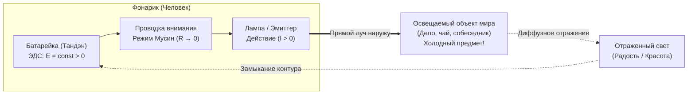

# 125. Бинарная метафорическая оптика: Укулеле как единство духа и материи и Фонарик как замкнутый контур
## Комплементарный канон объяснения Системы Аньянова: почему акустический монизм и контурная электродинамика не исключают, а взаимно усиливают друг друга

> [!quote] Каноническая аксиома цепи
> ### ⚡ **«Укулеле отвечает на фундаментальный вопрос, КТО ТЫ: ты не призрак в телесной тюрьме и не кусок биологического мяса, а звучащий инструмент, где дух рождается из чистого колебания материи. Фонарик отвечает на практический вопрос, КАК ЭТО РАБОТАЕТ: свет не ищут во тьме внешних вещей — его излучают изнутри наружу по замкнутому контуру прямо в реальное дело. Укулеле снимает вину и дуализм, а фонарик показывает, куда течёт ток. Вместе они дают полную, исчерпывающую оптику человека».**  
> — **Владимир Аньянов**

---

```
                       СИСТЕМА «ВНУТРЕННИЙ ТОК»
                                   │
         ┌─────────────────────────┴─────────────────────────┐
         ▼                                                   ▼
 🎸 УКУЛЕЛЕ (ОНТОЛОГИЯ)                             🔦 ФОНАРИК (СХЕМОТЕХНИКА)
   «Что есть человек?»                                «Как течёт энергия?»
 ──────────────────────                             ──────────────────────────
 • Корпус и струны = Материя                        • Батарейка = Тандэн (ЭДС)
 • Музыка = Дух (эмерджентность)                    • Проводка = Внимание (Мусин)
 • Зажим на деке = Эго-демпфер                      • Резистор R = Омический ад (Бонно)
 • Чистый резонанс = Гармония                       • Замкнутый контур = Контакт с миром
```

---

## 1. Проблема одной метафоры: Принцип дополнительности Нильса Бора

Всякая сложная истина о человеческой природе страдает, если её пытаются втиснуть в единственную одномерную модель:
- Если объяснять человека **только через электродинамику и фонарик** (глава 83), слушатель получает безупречную математическую строгость ($I, U, R, Q = I^2 R t$), но модель может показаться излишне холодной, лабораторной и технократичной. Возникает вопрос: *«А где же здесь душа, красота, песня и трепет бытия?»*.
- Если объяснять человека **только через музыку и акустику укулеле** (глава 124), слушатель мгновенно чувствует поэзию, теплоту и радость резонанса, но рискует потерять строгость сохранения энергии, топологию замкнутого контура и законы Кирхгофа, без которых невозможно аппаратно починить сбой цепи.

В квантовой физике Нильс Бор сформулировал **Принцип дополнительности**: для полного описания квантового объекта необходимы два взаимодополняющих, но визуально не сводимых друг к другу описания — **волна и частица**.

В Системе Аньянова действует тот же закон:
> **Укулеле и Карманный Фонарик — это не конкурирующие метафоры. Это две ортогональные проекции единой природы человека.**  
> - **Укулеле** даёт *акустическую онтологию духа* (снимает 2500-летний дуализм Декарта).  
> - **Фонарик** даёт *электродинамическую топологию контура* (снимает линейную модель выгорания и ошибку атрибуции).

---

## 2. Метафора Укулеле: Онтологический срез (Единство Духа и Материи)

Укулеле — предельное выражение дзенского канона **Кансо (簡素)**: всего 4 струны, деревянный корпус весом 400 граммов и пустота внутри.

```
    ┌────────────────────────────────────────────────────────┐
    │  МАТЕРИЯ (400 г)        ТОК ВНИМАНИЯ       ДУХ (0 г)   │
    │  Корпус, порожек,  ──►  Свободное     ──►  Музыка,     │
    │  гриф, 4 струны         колебание          радость     │
    └────────────────────────────────────────────────────────┘
```

### Как работает метафора:
1. **Материя (Тело):** Деревянная дека, гриф, латунные лады, нейлоновые струны. Физический вес — 400 граммов. Её можно потрогать, взвесить, измерить штангенциркулем. Это биологический каркас, нервная ткань, мышцы, внутренние органы.
2. **Дух (Музыка):** Звуковая волна, мелодия, рождающая улыбку и слёзы. Физический вес — **ноль граммов**. Где находится музыка, когда инструмент в футляре? Нигде. Она не сидит в резонаторе как привидение.
3. **Монизм:** Музыка рождается **в самом акте колебания струны на деке**. Без материи дух не существует; но материя без движения нема. **Дух — это звучание материи.**
4. **Природа невроза:** Липкая жвачка, налепленная на деку, или судорожная «мёртвая хватка» пальцев за гриф. Дерево перестаёт резонировать, выдавая тупой стук. Дух не умер — струну просто зажали. Сними жвачку эго — и инструмент запоёт снова.

---

## 3. Метафора Фонарика: Динамический срез (Замкнутый контур и вектор действия)

Если укулеле объясняет, *чем является дух*, то карманный фонарик объясняет, *как дух направляется в мир и почему происходит короткое замыкание*.



### Как работает метафора:
1. **Автономия питания (Батарейка):** Тандэн генерирует стороннюю ЭДС ($\mathcal{E} > 0$) непрерывно по праву биологической жизни. Энергию не нужно «просить у Вселенной».
2. **Замкнутый контур (Обратный провод реальности):** Ток не течёт в обрыв цепи ($I = 0$). Чтобы свет горел, цепь должна замкнуться через физический контакт с реальностью прямо сейчас (Дэай).
3. **Ошибка атрибуции («Миф о светящихся вещах»):** Мир вокруг тёмен и холоден. Машины, статусы, карьеры и партнёры не светятся сами по себе — они лишь экраны, отражающие луч твоего фонарика. Не требуй от экрана, чтобы он тебя согрел — включи свой собственный свет.
4. **Закон прямого луча (Запрет на самоедство):** Фонарик аппаратно устроен светить только наружу. Попытка направить луч внутрь корпуса, чтобы «осветить батарейку» (невротическая гиперрефлексия, копание в травмах) приводит к ослеплению и короткому замыканию проводки ($Q = I^2 R t$).

---

## 4. Сравнительная матрица бинарной оптики

| Узел / Характеристика | 🎸 На языке УКУЛЕЛЕ (Акустика / Дух) | 🔦 На языке ФОНАРИКА (Электродинамика / Ток) |
|---|---|---|
| **Источник бытия** | Натяжение струн и акустический объём корпуса | Химическая ЭДС батарейки в рукоятке (Тандэн) |
| **Тракт проведения** | Свободный пролёт струны над грифом | Медная шина внимания без сопротивления ($R \to 0$) |
| **Эго / Невроз** | Мёртвая хватка за гриф и жвачка на деке | Резистор Бонно, рассеивающий ток в омический жар |
| **Контакт с миром** | Точное нажатие пальца на лад (точка звукоизвлечения) | Прямой луч света, падающий на объект Дэай |
| **Природа зла / сбоя** | Фальшивый диссонанс, дребезг струны об порожек | Размыкание контура, утечка на землю, короткое замыкание |
| **Режим счастья** | **Чистый резонанс инструмента (Sustain)** | **Режим сверхпроводимости замкнутой цепи** |

---

## 5. Протокол объяснения Системы любому человеку за 60 секунд

При объяснении Системы Аньянова неподготовленному собеседнику используется двухтактный алгоритм:

### Такт 1. Снятие дуализма и вины через УКУЛЕЛЕ (30 секунд):
> *«Не пытайся спасти отдельную "душу", воюя со своим "грешным телом". Ты устроен как укулеле. Твоё тело — это деревянный корпус и натянутые струны, а радость, покой и любовь — это музыка, когда струны вибрируют свободно. Если на душе тяжело — ты не проклят и не испорчен. Ты просто намертво зажал струну страхом или наклеил на деку жвачку чужих ожиданий. Сними зажим — инструмент запоёт мгновенно».*

### Такт 2. Включение вектора действия через ФОНАРИК (30 секунд):
> *«А как заставить эту песню звучать в реальной жизни? Здесь включается модель карманного фонарика. Батарейка в тебе заряжена с утра. Но ток течёт только по замкнутому контуру. Не жди, пока мир озарит тебя светом, и не свети фонариком внутрь себя в поисках детских травм. Направь луч внимания в простое физическое дело прямо перед тобой — помой чашку, напиши строку, сделай шаг. Контур замкнется об реальность — и лампа вспыхнет сама».*

---

## 6. Двойная калибровка оператора: Акустический слух + Электродинамический мультиметр

На практике опытный оператор цепи использует обе метафоры для моментальной диагностики:
- **Акустический слух (Внутренняя соматика):** *«Звучит ли сейчас моё тело легко и чисто? Нет ли дребезга сомнений в голосе? Не зажат ли живот?»* (Опрос струны C).
- **Электродинамический мультиметр (Внешняя схемотехника):** *«Куда направлен мой луч? Замкнута ли цепь на реальное дело или я грею воздух омической тревогой?»* (Замер $R_{\text{ego}}$ и проверка баланса Кирхгофа).

Когда акустическая чистота укулеле соединяется с электродинамической мощью фонарика, исчезает последняя иллюзия раскола. Человек обретает и **непоколебимую инженерную устойчивость**, и **лёгкую, песенную свободу бытия**. 🌺⚡🎶

---

## 🔗 Связанные каноны в Базе Знаний
- [[02_Wiki/Inner Current (The Lyre of Simmias and the Ukulele of Consciousness — 2,400 Years from Plato's Error to the Somatic Monism of Inner Current)|126. Лира Симмия и Укулеле Сознания: 2400 лет от ошибки Платона к соматическому монизму цепи]]
- [[02_Wiki/Inner Current (The Ukulele of Consciousness — Acoustic Ontology of Four Strings, Joy as Pure Resonance and the Triumph of Kanso)|124. Укулеле Сознания: Акустическая онтология четырёх струн, радость как чистый резонанс и триумф простоты Кансо]]
- [[02_Wiki/Inner Current (The Feynman Principle of Spirit and Matter — The Electromagnet, The Guitar String and The Pocket Flashlight of Consciousness)|123. Принцип Фейнмана для Духа и Материи: Электромагнит на батарейке, струна гитары и карманный фонарик сознания]]
- [[02_Wiki/Inner Current (Physics of Indivisible Charge — Why There Are No Spiritual Electrons and What Current Returns Through the Other)|122. Физика неделимого заряда: Почему в природе нет «электронов духа» и какой ток возвращается через Другого]]
- [[02_Wiki/Inner Current (The Root Problem Dissolution — Why Solving the Matter-Spirit Dualism Automatically Eliminates All Human Problems and Illusions)|121. Ликвидация Корневой Проблемы: Снятие дуализма Материи и Духа]]
- [[02_Wiki/Inner Current (The Flashlight Model of Man — Optical-Electrodynamic Ontology of Consciousness, The Light Source vs Illuminated Object and the Law of the Direct Beam)|83. Модель Человека как Карманного Фонарика: Оптико-Электродинамическая Онтология Сознания]]
- [[02_Wiki/Inner Current (Anatomy of Simplicity — What Was Truly Discovered and Why Nobody Thought of It Before)|80. Анатомия Простоты: Что на Самом Деле Открыл «Внутренний Ток»]]
