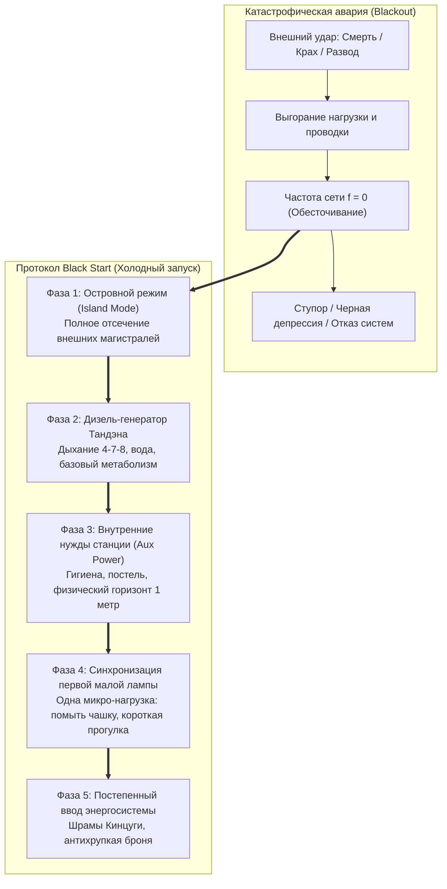

# 30. Протокол «Черного старта» (Black Start): Аварийный запуск контура с нуля после катастрофического блэкаута

> [!quote] Цитата Канона
> ### ⚡ **«Когда рушится весь внешний мир — смерть близкого, крах компании или потеря всего, что вы строили, — бесполезно пытаться зажечь города. В энергетике это называется Black Start: вы отсекаете все внешние магистрали и запускаете автономный дизель Тандэна. Одно дыхание. Один стакан воды. Один шаг. Контур поднимается из темноты последовательно, узел за узлом.»**  
> — **Владимир Аньянов**

---

## ⚡ 1. Физика катастрофического блэкаута: Выгорание подстанции

В штатном режиме человек сталкивается с бытовыми омическими перегревами: усталостью в конце рабочего дня, спором с коллегой или ступором перед сложным звонком. С этим справляются штатные предохранители Дзансин (Circuit Breakers).

Но в жизни каждого человека случаются **события катастрофического масштаба**:
- Внезапная смерть близкого человека.
- Тотальное банкротство и потеря дела десятилетия.
- Развод и распад семьи.
- Клиническая депрессия и тяжелое физическое заболевание.

В этот момент происходит не просто омический нагрев — **происходит физический взрыв подстанции (Catastrophic Grid Collapse)**. Внешняя нагрузка внезапно исчезает или выжигает силовые кабели. Системная частота падает в ноль. Человек оказывается в состоянии **полного обесточивания (Total Blackout)**: полная апатия, ступор, неспособность встать с кровати, ощущение, что «жизнь кончилась».

---

## 🔌 2. Что такое Black Start в энергетике и почему попытка «взять себя в руки» смертельна

В национальной энергосистеме электростанции питают потребителей, но сами нуждаются в электроэнергии для насосов, турбин и зажигания. Если падает вся энергосистема страны, вы не можете просто нажать кнопку на гидроэлектростанции — в проводах нет тока, чтобы запустить пусковые двигатели.

Для этого существует процедура **Black Start («Черный старт»)**:
1. На электростанции есть изолированный резервный дизель-генератор, работающий от автономного аккумулятора.
2. Он запускает вспомогательные системы самой станции (House Load).
3. Затем станция выходит на рабочие 50 Гц в режиме «острова».
4. И лишь через часы и дни к ней по одной подключаются внешние подстанции.

### Главная фатальная ошибка людей в горе:
> Человек в состоянии блэкаута пытается сразу «зажечь всю Москву»: вернуться на работу, доказать всем, что он сильный, решить глобальные проблемы. Результат: генератор захлебывается, срабатывает реле останова, и человек сваливается в еще более глубокую яму.

---

## 📋 3. Пять фаз протокола Black Start Владимира Аньянова

### Фаза 1: Островной режим (Island Mode) — Отсечение внешних магистралей
- **Инженерное действие:** Разомкнуть все рубильники внешней сети.
- **В жизни:** Прекратить читать новости, отключить рабочие чаты, закрыть социальные сети, сказать «нет» всем внешним запросам. Вы официально объявляете аварийный статус. Ваш единственный долг сейчас — не спасти проект, а не дать погаснуть генератору жизни.

### Фаза 2: Запуск автономного дизеля Тандэна
- **Инженерное действие:** Подача питания исключительно на критические витальные функции.
- **В жизни:** Горизонт планирования сокращается до **следующих 5 минут**.
  - Ровное, глубокое брюшное дыхание (вдох 4 сек, выдох 6 сек).
  - Стакан теплой чистой воды.
  - Лечь горизонтально, укутаться одеялом (сохранение биологического тепла).
  - Снять чувство вины: «Я сейчас ничего не произвожу, и это абсолютно нормально. Моя станция на черном старте».

### Фаза 3: Питание собственных нужд станции (House Load)
- **Инженерное действие:** Подключение насосов охлаждения и смазки турбины.
- **В жизни:** Забота о биологической оболочке (лампа «Тело»):
  - Горячий душ.
  - Простая горячая еда (бульон, каша).
  - Сон без будильника.
  - Пространство в радиусе 1 метра: убрать подушку, открыть форточку для свежего воздуха.

### Фаза 4: Синхронизация первой микро-нагрузки (Micro-Load Connection)
- **Инженерное действие:** Подача 50 Гц на первый изолированный фидер мощностью 1 кВт.
- **В жизни:** Выполнение **одного сверхмалого физического действия по закону Мусин ($R \to 0$)**:
  - Помыть одну тарелку.
  - Завязать шнурки и пройти 300 метров вокруг дома.
  - Полить цветок на окне.
  - Заварить одну пиалу зеленого чая (канон чайной церемонии).
  - *Критерий:* Действие должно быть на 100% завершаемым прямо сейчас, не требующим рефлексии и оценки.

### Фаза 5: Заваривание шрамов золотом (Канон Кинцуги)
- **Инженерное действие:** Включение в общую энергосеть с новой, усиленной изоляцией.
- **В жизни:** Трагедия не стирается из памяти — она становится **золотым швом вашей энергосистемы**:
  - Человек, прошедший Black Start, обретает абсолютную антихрупкость. Он знает, что даже если весь мир вокруг рассыплется в прах, внутри его Тандэна есть нерушимый генератор, который умеет запускаться из абсолютной темноты.

---

## ⚡ 4. Каноническая формула выживания контура

$$\lim_{\text{Grid} \to 0} \mathcal{H} = \frac{\mathcal{E}_{\text{tanden}}}{R_{\text{bio}}} > 0$$

Пока бьется сердце и в легкие входит воздух, ЭДС Тандэна ($\mathcal{E}_{\text{tanden}}$) больше нуля. Энергосистема человека неуничтожима, если не пытаться насильно включать сгоревшие магистрали, а следовать строгой технологической карте холодного старта.

---

## 🔗 Связи
- [[04_Maps/Inner Current MOC|Inner Current MOC]]
- [[02_Wiki/Inner Current (Safety, Antifragility and Zanshin)|04. Предохранители цепи, ваби-саби и антихрупкость]]
- [[02_Wiki/Inner Current (Scale Invariance and Tea Ceremony)|03. Инвариантность масштаба нагрузки: от чая до империи]]
- [[02_Wiki/Inner Current (Diagnostic Machine and System Specification)|06. Машина для диагностики счастья: спецификация]]

---
*Created: 2026-09-23 | Author: Vladimir Anyanov & Antigravity*
