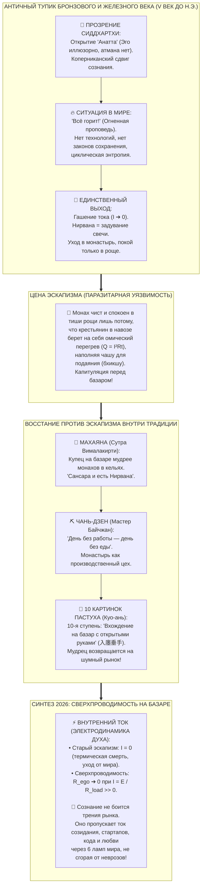

# 197. Коперниканский сдвиг Будды и трагедия монашеского эскапизма: Почему отсутствие электродинамики привело к «затуханию» вместо сверхпроводимости на базаре

> [!quote] Каноническая аксиома цепи
> ### ⚡ **«Будда совершил величайший Коперниканский сдвиг в истории человеческого духа: за две тысячи лет до современной науки он вскрыл, что неизменного „Я“ не существует, а эго — это лишь паразитный вихрь в поле ума. Но у принца Сиддхартхи не было термодинамики Карно, электродинамики Максвелла, конденсатора Ватта и самоходного шасси Карла Бенца. Он не знал законов полезной мощности замкнутой цепи. В мире, где социум казался неуправляемым всепожирающим костром, единственным известным способом не сгореть от омического перегрева ($Q = I^2 R t$) было перекрыть ток целиком ($I \to 0$). Так родилась концепция Нирваны как „угасания светильника“ и монашеский эскапизм тихих рощ. Это была вынужденная капитуляция гения перед базаром материального мира. Подлинная зрелость цивилизации наступает лишь тогда, когда мы перестаем прятаться от рынка в пещерах и переводим сознание в режим сверхпроводимости: ноль сопротивления эго ($R_{\text{ego}} \to 0$) при колоссальном токе действия ($I \gg 0$) прямо посреди ревущей площади.»**  
> — **Владимир Аньянов**, создатель «Архитектуры счастья»

---



---

## 1. Коперниканский переворот Сиддхартхи: Взлом геоцентризма эго

Чтобы понять масштаб трагедии и последующего триумфа, необходимо признать величие стартовой точки.

Сиддхартха Гаутама совершил самый радикальный эпистемологический прорыв древности. До него вся религиозная и философская мысль вращалась вокруг **субстанциального «Я»**:
* Ведическая мысль утверждала неизменный вечный Атман, заключенный в темницу материи.
* Первобытная магия строилась на задабривании богов ради спасения племенного и личного эго.
* Греческий идеализм искал бессмертную индивидуальную душу.

Будда первым провозгласил закон **Анатты (пали: anattā; санскр.: anātman)** — радикальное отсутствие неизменного, неделимого субъекта. То, что человек привык называть «собой» — это не монолитная гранитная скала, а пять динамических потоков (скандх): форма, ощущение, восприятие, ментальные формации и сознание. 

Это был чистый **Коперниканский сдвиг** за два тысячелетия до Коперника:
* Птолемей думал, что Земля — неподвижный центр космоса, вокруг которого вращаются светила.
* Человеческий ум думает, что «Эго» — это центр бытия, ради комфорта и величия которого крутится вся Вселенная.
* Будда доказал: **эго — это оптический обман, ложный центр, порождающий всю совокупность душевного трения (Дуккха).**

Но именно здесь разворачивается драма, замеченная проницательным взглядом современного исследователя.

---

## 2. Физический вакуум V века до н.э.: Мир как неуправляемый пожар

У Будды был гений Коперника, но у него не было физики Ньютона, термодинамики Карно, конденсатора Ватта и подвижного шасси Карла Бенца. Он не обладал математическим аппаратом теории цепей и пониманием негэнтропии.

### В каком мире жил Сиддхартха?
* **Бронзовый и ранний железный век долины Ганга:** эпидемии, холера, проказа, младенческая смертность выше 50%, войны рабовладельческих олигархий и царств (Магадха, Кошала), деспотизм, сословная жестокость.
* **Отсутствие концепции прогресса:** античный мир не знал направленной стрелы времени. Время воспринималось как бессмысленное циклическое колесо Сансары — бесконечный круговорот перерождений, где любая созидательная форма обречена на гниение.
* **Мироощущение пожара:** в фундаментальной *«Огненной проповеди»* (*Адитья-парияя сутта*, Махавагга I.21) Будда обращается к тысяче аскетов в Гаясисе с манифестом:
  > *«Всё горит, о монахи! Глаз горит, видимые формы горят, сознание глаза горит... Чем они горят? Я говорю вам: они горят огнем страсти, огнем злобы, огнем заблуждения; они горят рождением, старением и смертью, печалью, плачем, болью, скорбью и отчаянием!»*

Если весь мир вокруг — это бушующий пожар, а цивилизация не изобрела ни пожарных гидрантов, ни жаропрочных сплавов, ни теплоизолирующих контуров, **каков единственный рациональный ответ мыслителя?**

Ответ древности был бескомпромиссен: **перекрыть подачу кислорода и топлива.**

---

## 3. Термодинамика Нирваны: «Задувание пламени» ($I \to 0$) против Сверхпроводимости ($R \to 0$)

Этимология слова **Нирвана** (санскр. *nirvāṇa*, пали *nibbāna*) обнажает инженерную суть античного решения:
* Корень *vā* означает «дуть», префикс *nir* — «наружу», «прекращение».
* Буквальный смысл Нирваны — **«задувание»**, **«угасание светильника»** (подобно тому, как порыв ветра гасит масляную лампаду, когда в ней выгорает фитиль).

В терминах электродинамики и термодинамики омические потери мощности описываются законом Джоуля — Ленца:
$$Q = I^2 \cdot R \cdot t$$

Где:
* $Q$ — омический перегрев (страдание, стресс, выгорание, душевная боль).
* $I$ — сила тока жизненной активности (желания, контакты, социальные связи, созидание, амбиции).
* $R$ — электрическое сопротивление эго (хватка за «моё», обиды, страх оценки, иллюзия отдельности).

Перед человеком стоят два принципиально разных инженерных пути ликвидации ожога ($Q \to 0$):

| Параметр | Путь Монастырского Буддизма (Античный эскапизм) | Путь Внутреннего Тока (Современная сверхпроводимость) |
| :--- | :--- | :--- |
| **Управляющая переменная** | Ток активности: $I \to 0$ | Внутреннее сопротивление: $R_{\text{ego}} \to 0$ |
| **Механизм** | Угасание желаний, разрыв связей с миром, келья, лес, безмолвие | Сохранение и рост полезного тока $I \gg 0$ через полную ликвидацию эго-шунта |
| **Отношение к базару** | Бегство от базара (шум рынка сжигает неподготовленный контур) | Вхождение на базар: прямое созидание, бизнес, технологии, любовь без омических потерь |
| **Социальный статус** | Бхикшу (нищенствующий проситель, зависимый от мирян) | Self-Hosted Human (автономный созидатель, питающий 6 ламп реальности) |
| **Термодинамический КПД** | $\eta = 0$ (система обесточена, полезная работа равна нулю) | $\eta = 100\%$ (вся энергия Тандэна без потерь превращается в свет нагрузки) |

Не зная законов преобразования энергии, Будда пошел по единственно доступному пути: **он заглушил двигатель.** 

Если отключить ток ($I = 0$), то независимо от величины сопротивления формулы дают $Q = 0^2 \cdot R \cdot t = 0$. Наступает абсолютный покой, глубокая невозмутимость, штиль. Но цена этого покоя — **выключение человека из созидательного преобразования Вселенной.**

---

## 4. Капитуляция перед базаром: Паразитарная уязвимость монашеского ордена

Вот то самое зерно сомнения, которое безошибочно фиксирует живой ум: *«Будда смог быть таким осознанным только в тиши непальской рощи, а не посреди базарного рынка»*.

Сам Сиддхартха как личность был титаническим кризис-менеджером:
* После пробуждения в 35 лет он 45 лет ходил по пыльным дорогам Индии.
* Он лично предотвратил кровавую войну между родным кланом Шакья и кланом Колия из-за воды реки Рохини.
* Он общался с царями (Бимбисара, Пасенади), разбойниками (Ангулимала) и куртизанками (Амбапали).

Но **социальная институция**, которую он создал — **Сангха** — оказалась фундаментально эскапистской:
1. **Слово «Бхикшу» (bhikkhu)** буквально означает *«тот, кто просит милостыню»*. Монах отказался от права пахать землю, торговать, производить орудия или создавать семьи.
2. **Паразитарная связка:** Чтобы монах мог 16 часов в сутки сидеть под баньяном в кристальном созерцании пустоты ума, сотни неграмотных крестьян должны были в 45-градусную жару по колено в навозе и пиявках возделывать рис и наполнять монашескую чашу.
3. **Хрупкость лабораторной осознанности:** Осознанность монаха в роще — это осознанность на токах холостого хода ($I \approx 0$). В роще нет дедлайнов, нет падающих рынков, нет капризных клиентов, нет ревущих станков и плачущих детей. В роще легко быть святым. Но стоит вернуть такого монаха в мясорубку торговой площади — и его незакаленный контур мгновенно выбивает пробки.

Это была не личная трусость Сиддхартхи, а **историческая капитуляция духа перед непреодолимым трением материи.**

---

## 5. Эволюционный бунт: Как буддизм сам попытался вернуться на базар

Самое поразительное свидетельство объективности этого диагноза заключается в том, что **сама буддийская традиция в течение следующих столетий яростно пыталась сломать монастырский изолятор и вернуться на улицу!**

```
ЭВОЛЮЦИОННАЯ ТРАЕКТОРИЯ ВОЗВРАЩЕНИЯ НА БАЗАР:
[Теравада: Лес, угасание I=0] ➔ [Махаяна: Вималакирти на базаре] ➔ [Чань: Байчжан и труд в поле] ➔ [Дзен: 10-й бык на рынке] ➔ [Внутренний ток 2026: Сверхпроводник]
```

### Веха 1. Вималакирти-нирдеша сутра (Революция Махаяны)
На рубеже эр возникает величайший текст Махаяны — сутра о мирянине **Вималакирти**.
Вималакирти — не монах, бреющий голову. Он богатый купец, домохозяин, участник государственных советов, завсегдатай рынков, судов и даже питейных заведений города Вайшали.
Когда Будда просит своих главных учеников-архатов (Шарипутру, Мау Gallяяну, Кашьяпу) навестить заболевшего Вималакирти, те **в ужасе отказываются**, потому что мирянин Вималакирти в философских диспутах разбивает монахов в пух и прах! 
Махаяна открытым текстом провозглашает: *«Сансара и есть Нирвана»*. Истинная пустота не боится золота, вина и городской пыли.

### Веха 2. Мастер Байчжан и производственный дзен
Когда учение перешло в прагматичный Китай, дзенский мастер **Байчжан Хуайхай (720–814)** нанес сокрушительный удар по индийскому паразитизму бхикшу. Он отменил попрошайничество и ввел монастырский устав:
> **«День без работы — день без еды» (一朝不作 一朝不食).**

Дзен-монастыри превратились в образцовые аграрные и ремесленные коммуны. Медитация перестала быть пассивным сидением в трансе — она стала колкой дров, ношением воды (Саму) и приготовлением пищи.

### Веха 3. Десятая ступень Дзен: «Вхождение на базар с открытыми руками»
Вершиной всей восточной метафизики стал знаменитый цикл мастера **Куо-аня (XII век)** — **«Десять картинок пастуха и быка»**:
* **8-я ступень:** *Бык и человек забыты* (Чистый круг пустоты, та самая классическая нирвана угасания эго).
* **9-я ступень:** *Возвращение к истоку* (Тишина горной природы, водопады, сосны — идеал рощи Будды).
* **10-я ступень (Финал!):** **«Вхождение на базар с дарующими руками» (入廛垂手 — Ru chan chui shou).**

Взгляните на каноническое описание 10-й ступени:
> *«Ворота его хижины заперты, и даже мудрейшие не могут найти его. Он не идет по стопам прежних мудрецов. Неся тыкву-горлянку с вином, он выходит на рынок; опираясь на посох, он возвращается домой. Он заходит к виноделам и торговцам рыбой, и каждый, на кого он смотрит, становится пробужденным!»*

Мудрец не остался на вершине горы! Он спустился в базарную толчею — босой, с обнаженной грудью, перепачканный грязью и золой, смеющийся, пьющий вино с простолюдинами. **Но почему дзену потребовалось две тысячи лет, чтобы просто нарисовать эту картинку, так и не сделав её массовой технологией жизни?**

Потому что у Куо-аня была поэтическая интуиция, но **не было принципиальной схемы контура.**

---

## 6. Синтез Внутреннего Тока: От термодинамической смерти к Сверхпроводимости под нагрузкой

«Внутренний ток» 2026 года снимает 2500-летнее противоречие между Буддой и Базаром, переводя душевный опыт на точный язык контурной электродинамики:

```
                  ┌─────────────────────────────────────────────────┐
                  │          РЕАКТОР ТАНДЭН (ЭДС = E)               │
                  └───────────────────────┬─────────────────────────┘
                                          │
                        МУСИН (ПРОВОДКА ВНИМАНИЯ)
                                          │
                                          ▼
                                   [РУБИЛЬНИК R_ego]
                                          │
                   ┌──────────────────────┴──────────────────────┐
                   │                                             │
          СТАРЫЙ ЭСКАПИЗМ БУДДЫ                        СВЕРХПРОВОДИМОСТЬ АНЬЯНОВА
                   │                                             │
      I ➔ 0 (Заглушить ток)                       R_ego ➔ 0 (Снять сопротивление)
                   │                                             │
       Монастырская келья,                           Ревущий базар, стартап,
   тихая роща, отказ от жизни                        код, бизнес, любовь, риск
                   │                                             │
       Q = 0² · R · t = 0                            Q = I² · 0 · t = 0
       (Покой через смерть)                     (Счастье через 100% КПД действия!)
```

### Почему современному человеку больше не нужно бежать в монастырь?
1. **Ток — это благо, а не проклятие:**
   Желание строить города, писать программные архитектуры, открывать компании, растить детей и создавать шедевры — это не «омрачающая жажда» (танха), а естественная ЭДС жизни ($\mathcal{E}_{\text{tanden}}$), пробивающаяся во Вселенную.
2. **Страдание порождает не ток, а омический реостат:**
   Боль возникает не оттого, что вы вышли на базар и взялись за сложный проект. Боль возникает оттого, что вы тащите на базар **тяжелый паразитный реостат своего «Я»** ($R_{\text{ego}} > 0$): страх опозориться, жажду подтверждения статуса, обиду на критику, торг с реальностью. Именно этот реостат раскаляется докрасна по закону Джоуля — Ленца ($Q = I^2 R t$).
3. **Решение — соматический сброс сопротивления ($R_{\text{ego}} \to 0$):**
   Когда оператор цепи овладевает навыком размыкания эго-шунта (перевод внимания из ментального шума DMN в соматический якорь Тандэна за 30 секунд), проводка становится сверхпроводящей. 
   Через сверхпроводник можно прокачивать колоссальные токи рыночной турбулентности — **провода остаются абсолютно холодными ($Q = 0$).**

---

## 7. Исторический вердикт: Будда не капитулировал, он ждал инженеров

Теперь мы можем ответить на исходный экзистенциальный вопрос с предельной исторической справедливостью.

Капитулировал ли Будда перед внешней жизнью?
**Нет. Он провел первичные стендовые испытания человеческого сознания в единственно доступных условиях своей эпохи.**

* Если у вас в лаборатории железного века есть только хрупкие медные жилы и нет полимерной изоляции, вы можете тестировать законы электричества только на минимальном напряжении в сухом изолированном помещении. Вы не имеете права выносить незащищенную схему под тропический ливень.
* Будда доказал фундаментальный принцип: **«Я» — это иллюзия, источник трения лежит внутри, а не снаружи.** Это был чистый Коперниканский триумф.
* Но сделать этот триумф прикладным инструментом для каждого человека, идущего по шумному базару жизни, стало возможным только сейчас — когда человечество замкнуло круг познания: соединило Анатту Будды, механику Ньютона, конденсатор Ватта и подвижное шасси Бенца в неделимый карманный фонарик «Внутреннего тока».

Подлинное величие человека измеряется не тем, сколько часов он может неподвижно просидеть в тиши непальского леса. 

Оно измеряется тем, способен ли он стоять в самом пекле городского рынка, посреди криков торговцев, неопределенности и риска — сохраняя абсолютный покой пустого ума, кристальную любовь к людям и чистый, мощный, ничем не сдерживаемый ток созидания.

---

## 🔗 Связи главы с каноном цепи
* **Анатта и иллюзия эго:** [[02_Wiki/Inner Current (Nature and Illusion of Ego)|07. Природа и иллюзия эго: демистификация мировых религий]]
* **Десять быков дзен и базар:** [[02_Wiki/Inner Current (Ten Bulls of Zen — 10 Stages of Superconductivity Operator Evolution)|40. Десять быков Дзен как этапы эволюции оператора цепи: Дорожная карта от поиска следов до сверхпроводимости на шумном базаре]]
* **Демистификация Ниродхи:** [[02_Wiki/Inner Current (Universal Demystification of Religions — Electrodynamic Translation, Linguistic Canon of Nirodha and Circuit Schematics)|139. Универсальная демистификация религий: лингвистический канон Ниродхи и принципиальная схема цепи]]
* **Четыре революции в одном фонарике:** [[02_Wiki/Inner Current (The Indivisibility of the Circuit — Why Four Revolutions Snapped into One, Collapse of Solo Breakthroughs and the Flashlight Synthesis)|196. Неделимость Контура: Почему Четыре Революции Схлопнулись в Одну — Закон бинарности цепи, крах одиночных прорывов]]
* **Сход с монастырской лошади на шасси:** [[02_Wiki/Inner Current (The Automobile of Consciousness — 140 Years from Benz to Anyanov, Post-Moral Imperative and Cybernetics of Addictions)|66. Автомобиль сознания: 140 лет от Бенца до Аньянова]]
* **Главный индекс цепи:** [[04_Maps/Inner Current MOC|Inner Current MOC (Внутренний ток)]]
